# embedded
weifengdq's embedded

所有板子都可到闲鱼搜索用户 weifengdq , 在主页中找到购买链接, 或直接点击以下链接: 【闲鱼】https://m.tb.cn/h.RJLGTFF?tk=9gzPgSFTDTy tG-#22>lD 「这是我的闲鱼号，快来看看吧～」

QQ 群(`嵌入式_机器人_自动驾驶交流群`): 1040239879, 所有板子资料在群公告网盘链接中免费下载, 欢迎进群潜水, 无需发言, 无需购买板子.

TC387:

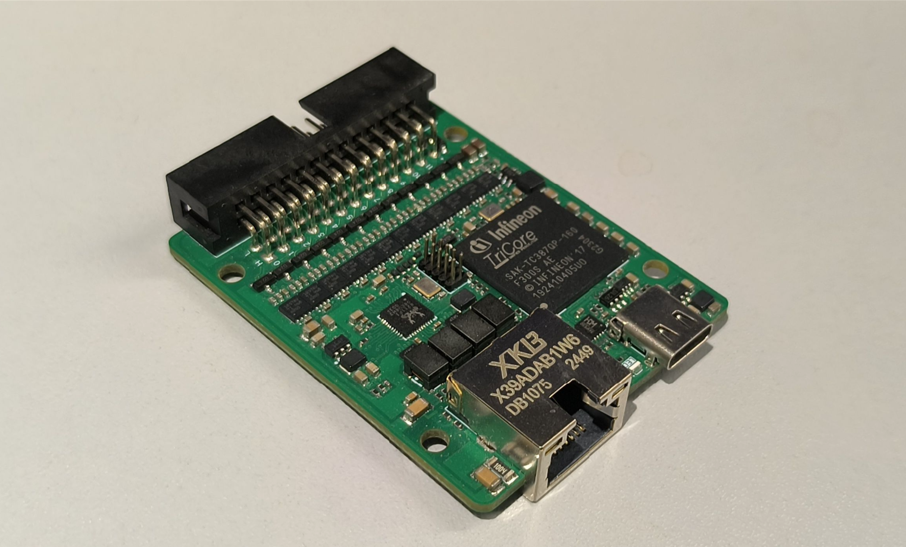

S32K312:

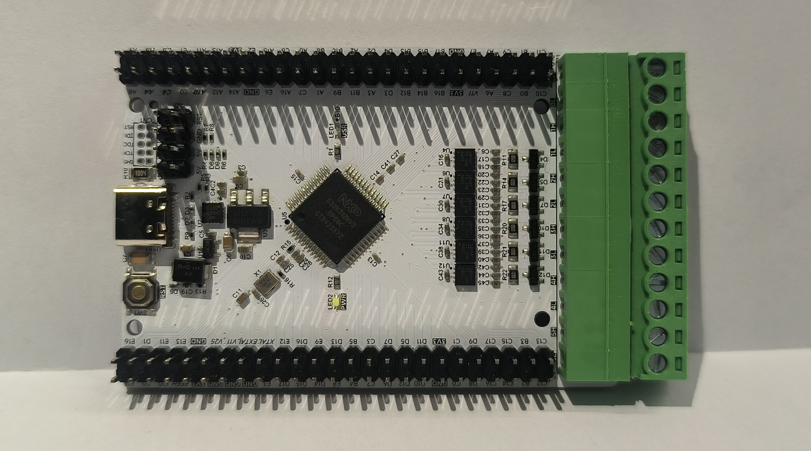

CYT2B95:

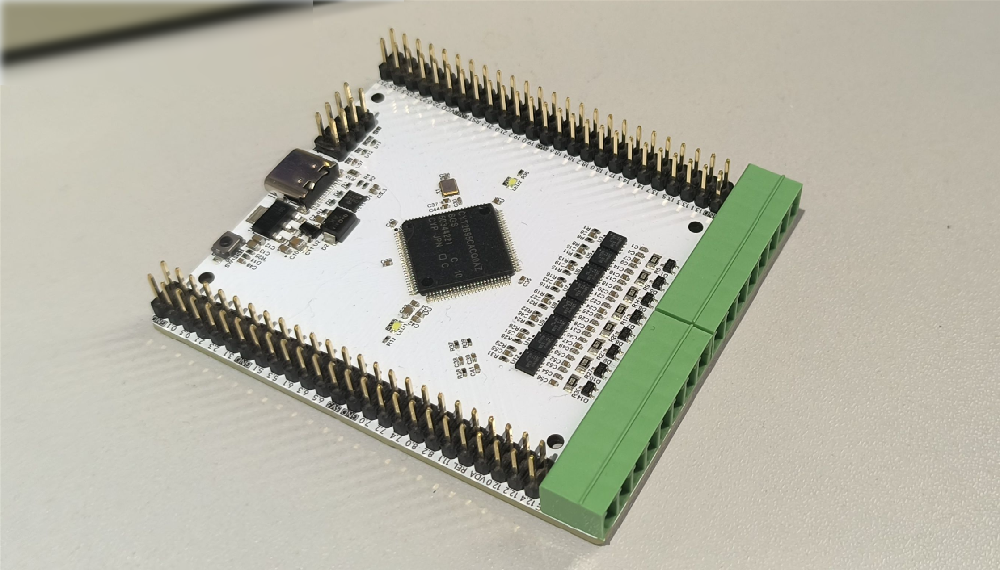

GD32A503:

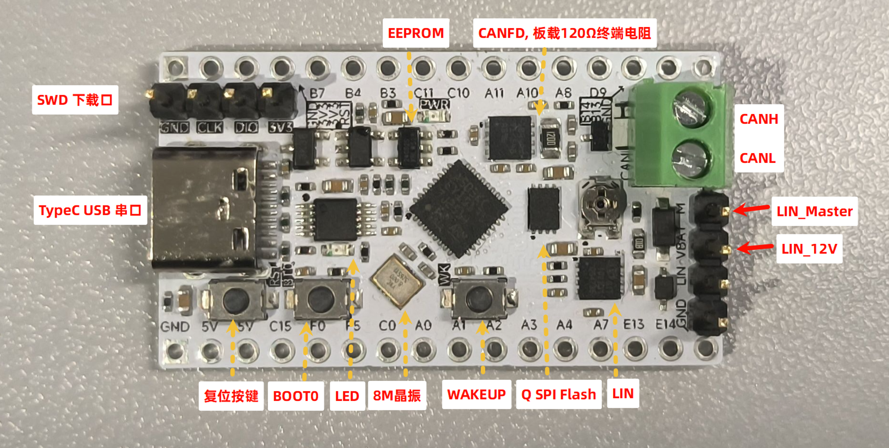

HPM5E31:

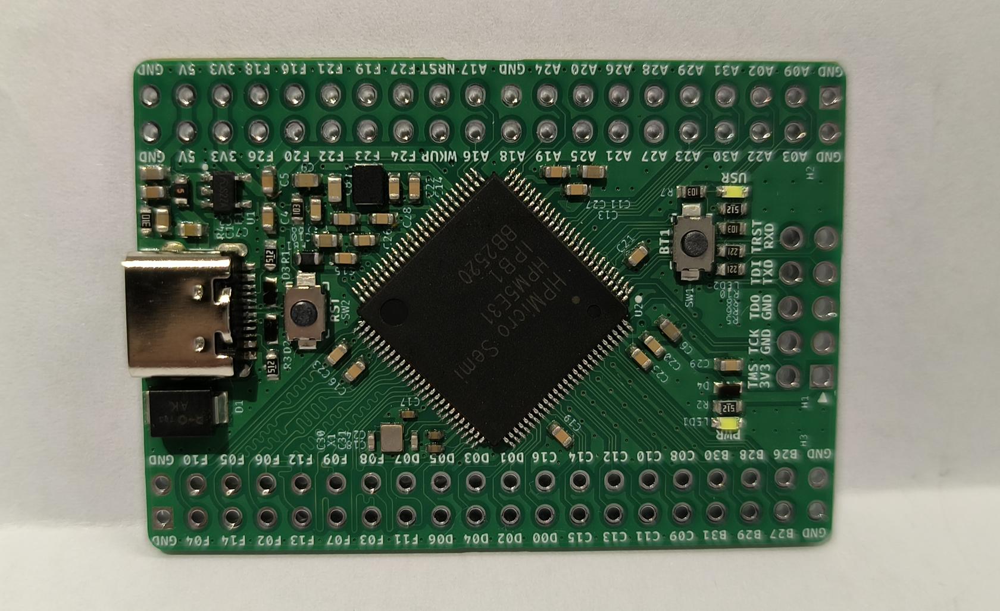

LAN9370, 5-Port 100BASE-T1 Gigabit Ethernet Switch:

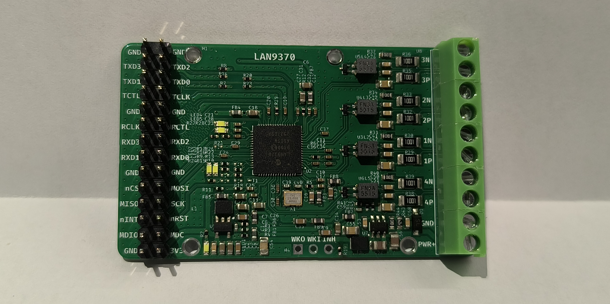

TJA1103, RMII-100BASE-T1:

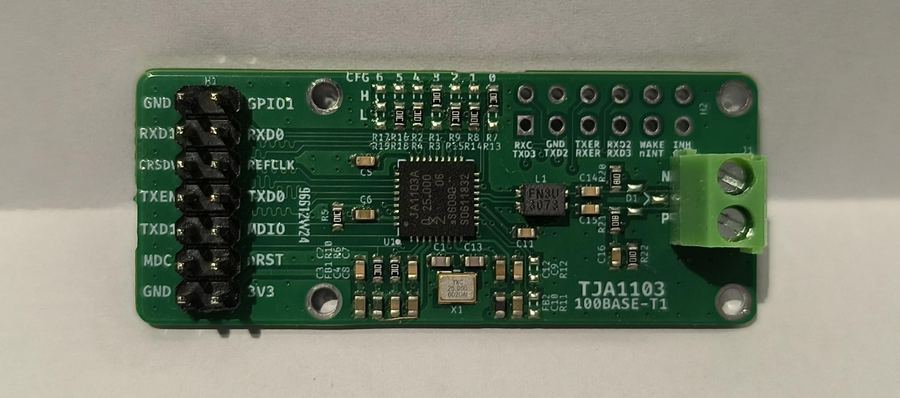

LAN8651, SPI-10BASE-T1S:

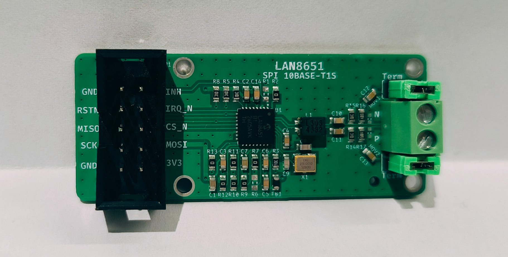

LAN8671, RMII-10BASE-T1S:

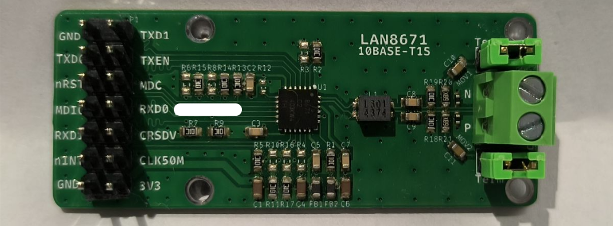

P3T1755, I3C:

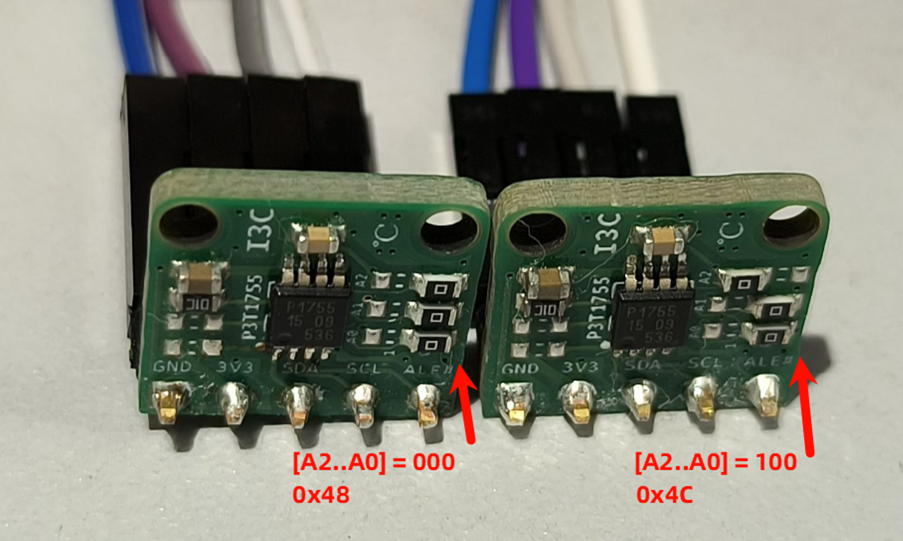

TCAN4550, SPI-CANFD:

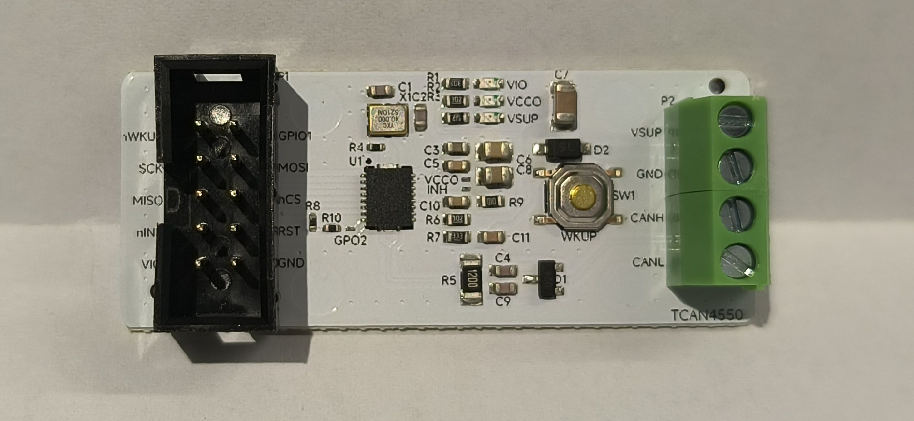

MCP251863, SPI-CANFD:

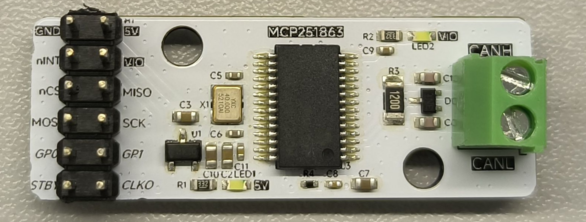

SJA1124, SPI-4xLIN:

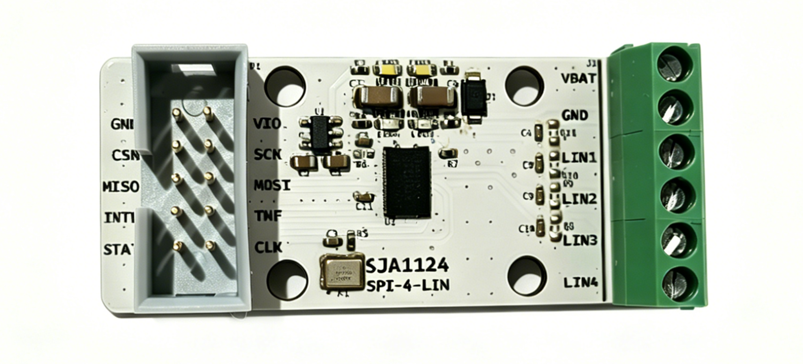
