# embedded
weifengdq's embedded

所有板子都可到闲鱼搜索用户 weifengdq , 在主页中找到购买链接, 或直接点击以下链接: 【闲鱼】https://m.tb.cn/h.8uZw3MA?tk=ZcajTlg8jsF 

QQ 群(`嵌入式_机器人_自动驾驶交流群`): 1040239879, 所有板子资料在群公告网盘链接中免费下载, 欢迎进群潜水, 无需发言或购买板子.

TC397 (YT8011AN_1000BASET1 + 12xCANFD + 10BASET1S + FlexRay + SD + TLF35584):

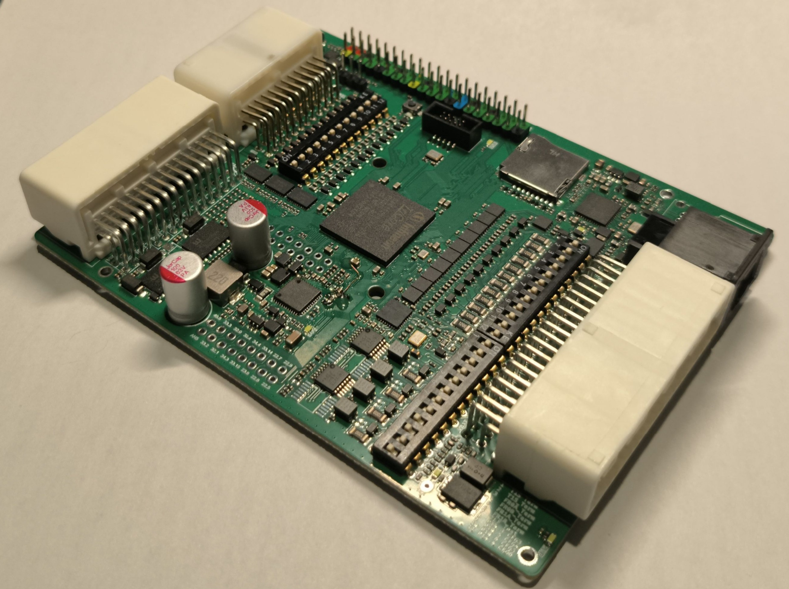

TC387 (RTL8211FI 千兆以太网 + 12xCAFD):

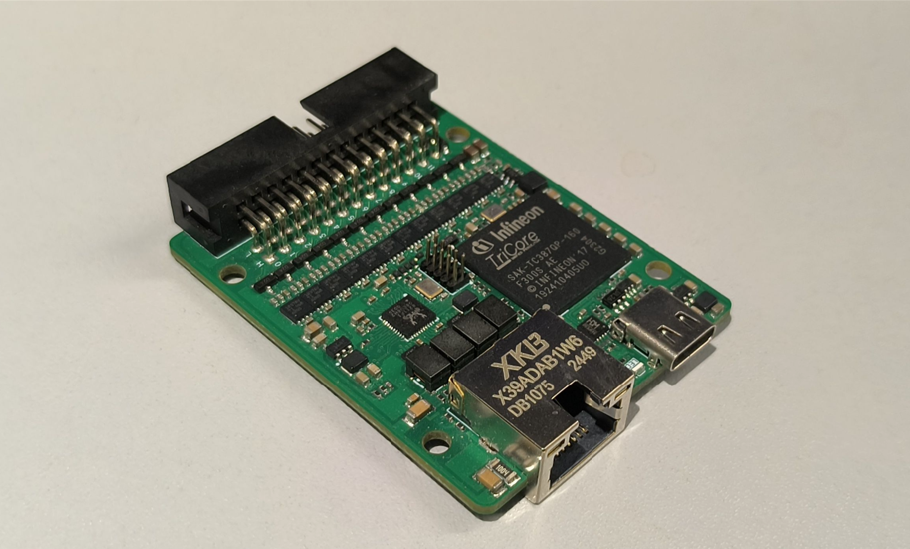

TC364 (百兆以太网 + 8xCANFD):

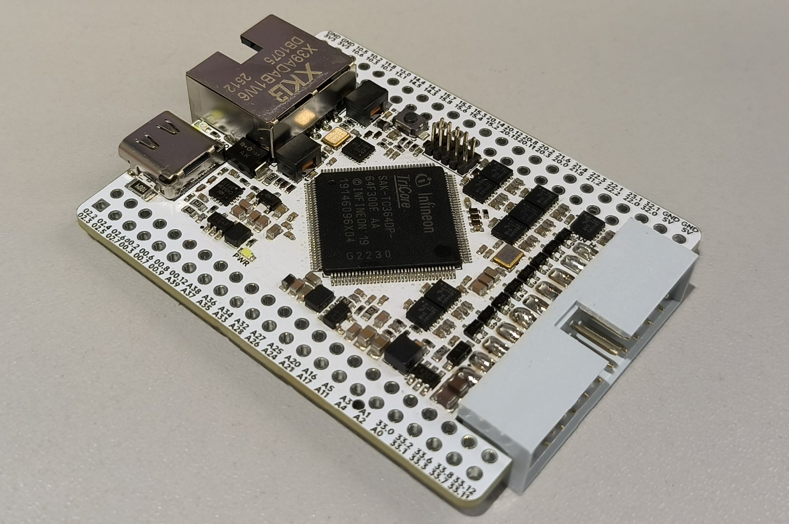

S32K312 (6xCANFD):

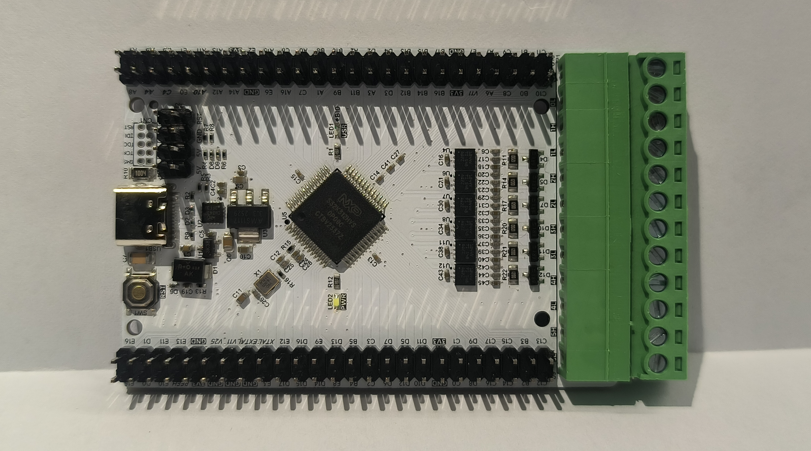

CYT2B95 (8xCANFD):

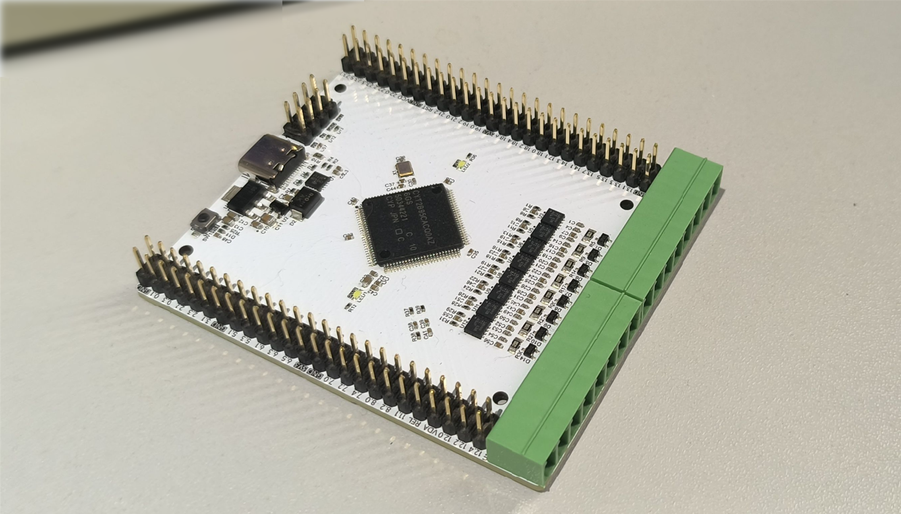

GD32A503 (CANFD + LIN):

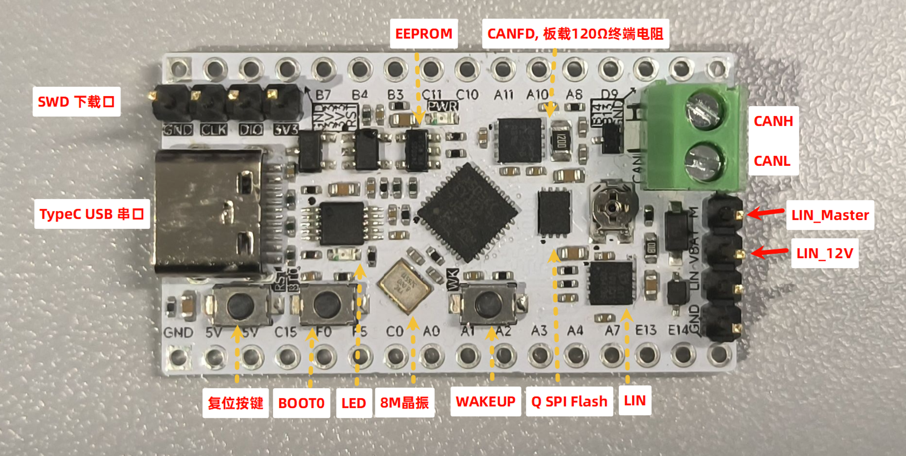

HPM5E31:

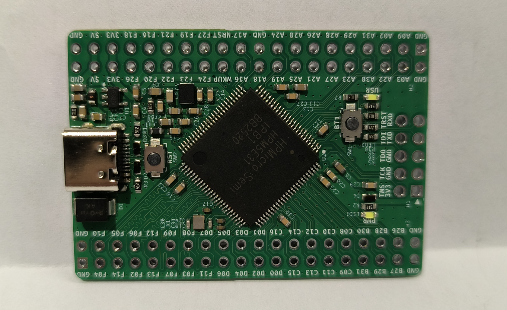

LAN9370, 5-Port 100BASE-T1 Gigabit Ethernet Switch:

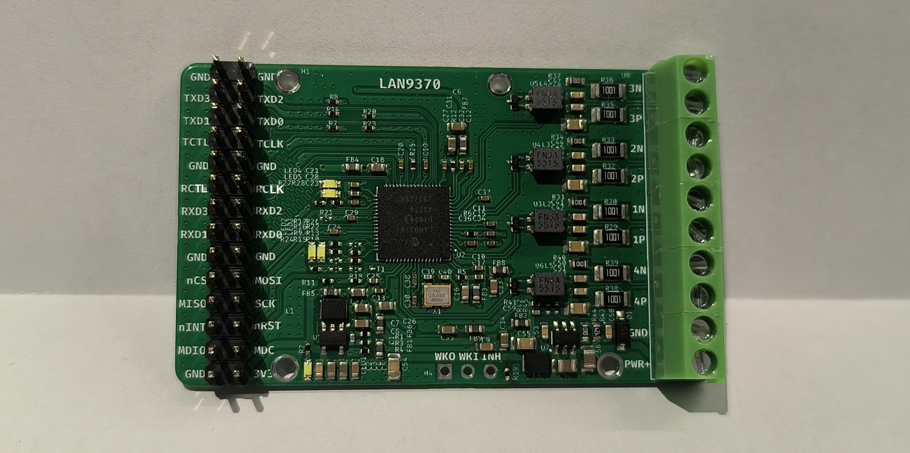

TJA1103, RMII-100BASE-T1:

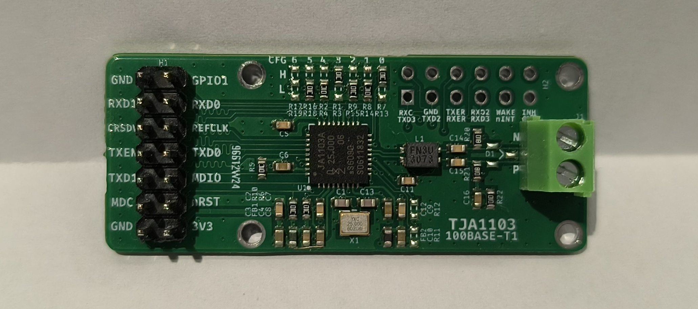

LAN8651, SPI-10BASE-T1S:

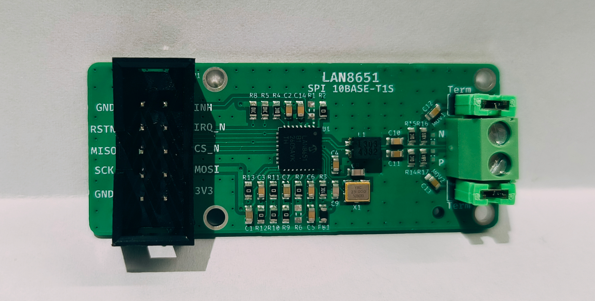

LAN8671, RMII-10BASE-T1S:

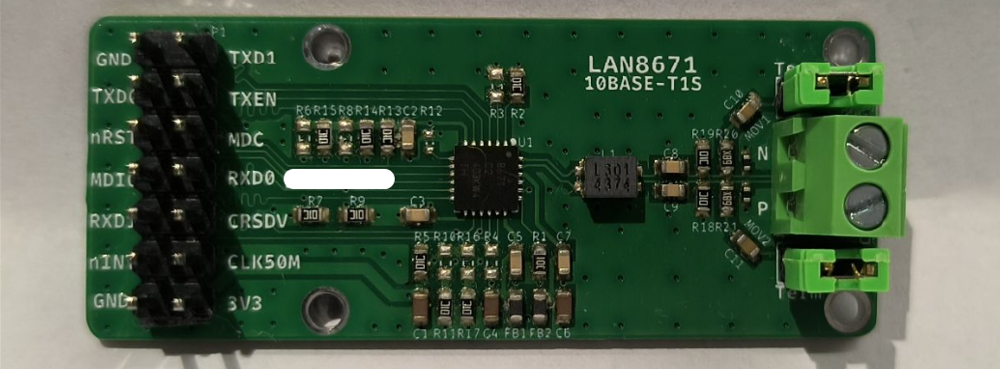

P3T1755, I3C:

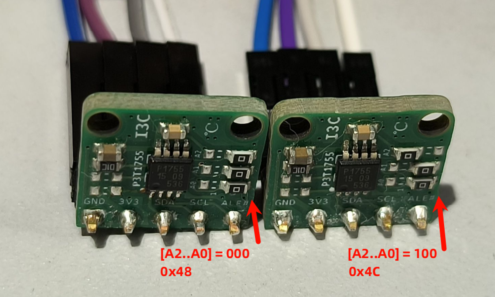

TCAN4550, SPI-CANFD:

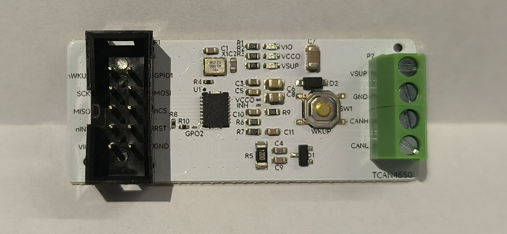

MCP251863, SPI-CANFD:

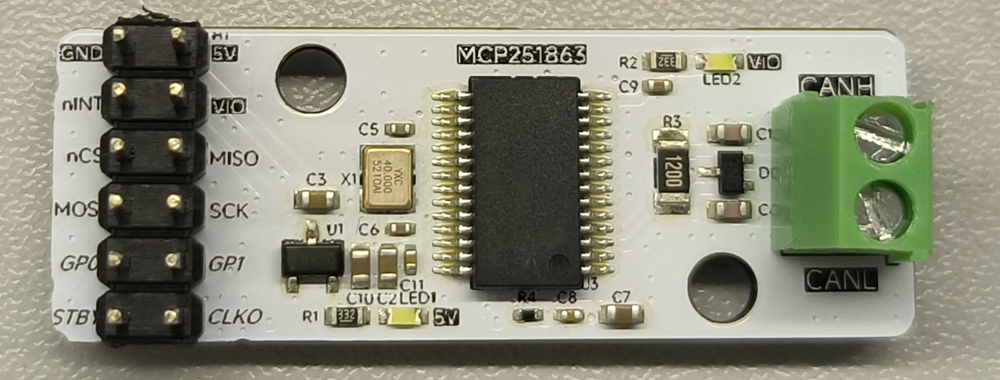

SJA1124, SPI-4xLIN:

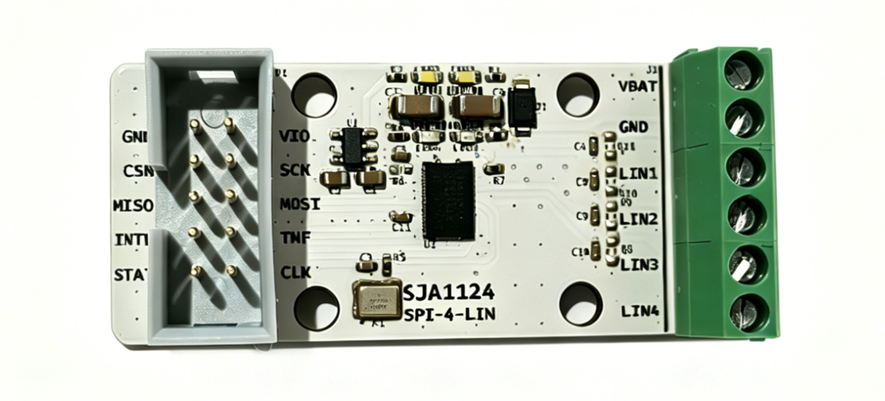

SlcanX (HPM5321 4路CANFD分析仪, 开放原理图方便自行开发) 标准版和隔离版, 详见 [weifengdq/SlcanX: Four-channel CANFD Analyzer](https://github.com/weifengdq/SlcanX):

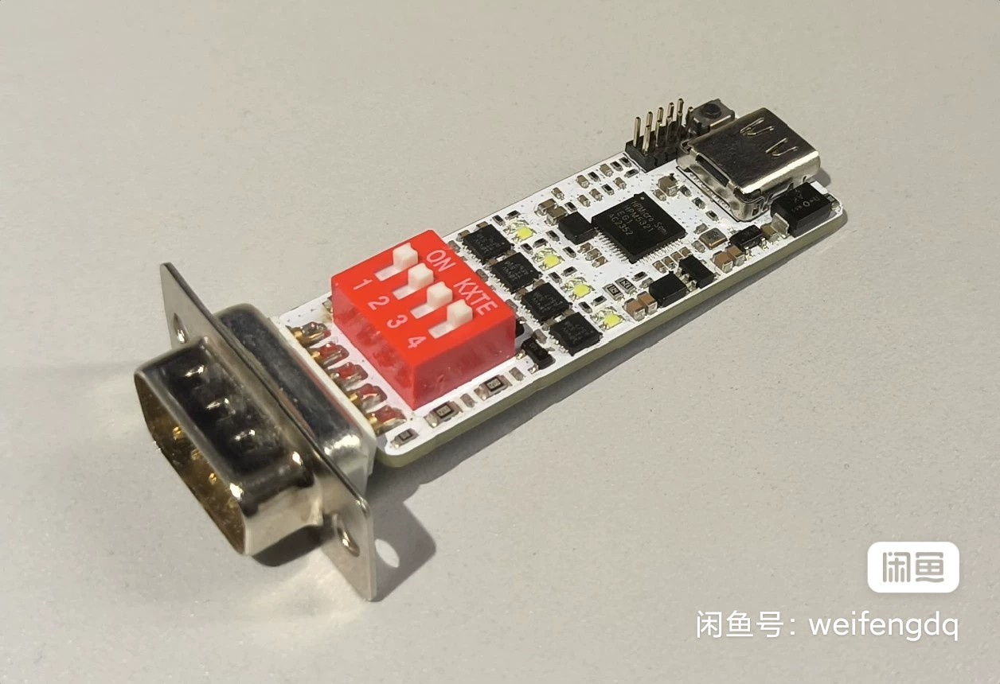

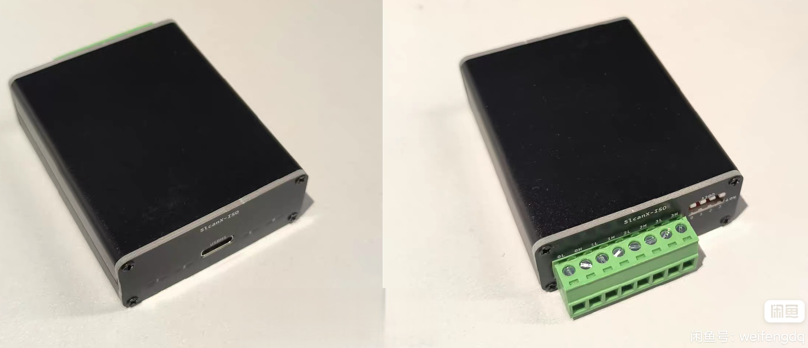

GS_USB_X (N32H765, 8路CANFD分析仪, 开放原理图和HEX固件方便自行开发), 详见 [weifengdq/gs_usb_x](https://github.com/weifengdq/gs_usb_x):

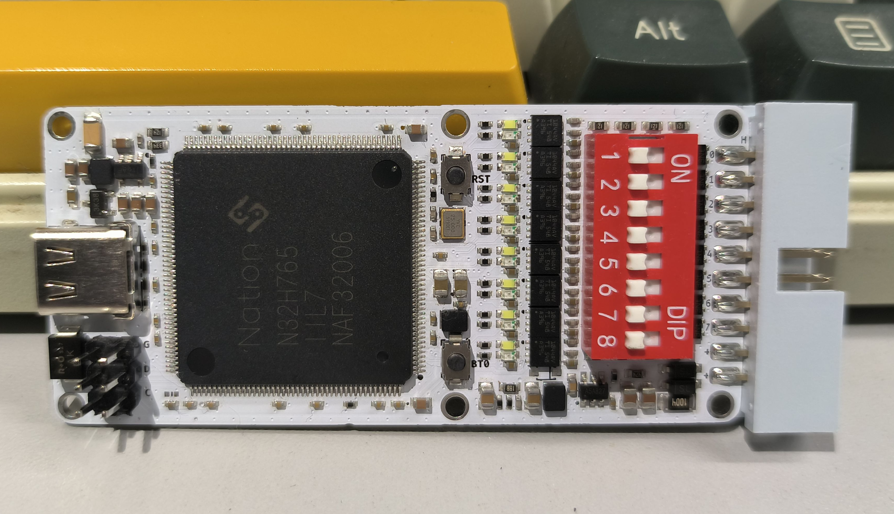

