# CYT2B95

[TOC]


## 板子图片

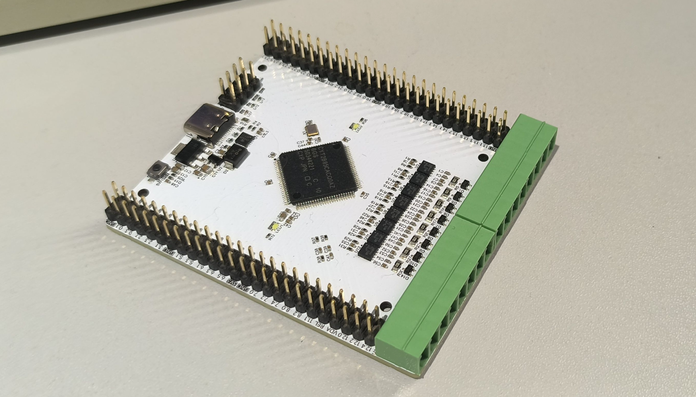

资源如下:

- CYT2B95CAC00AZSGS
  - Cortex-M4F(160M max) + Cortex-M0+(100M max), TRAVEO™ T2G Family
  - 2112 KB (1984 KB + 128 KB) Code Flash, 128 KB (96 KB + 32 KB) Work Flash, 256 KB SRAM
  - 100-LQFP, ASIL-B, eSHE – on, HSM – on, RSA - 2K, Third revision, S-grade (–40 °C to 105 °C), 选型时对应 CYT2B95CAS
- 8路 CANFD 通过 TCAN1044VDRBRQ1 引出到 3.81 间距的绿端子, 板载120Ω终端电阻, 支持常用的 500K, 1M, 2M, 5M等速率
- SCB0 UART(P0.0 P0.1) 调试串口通过 CH343 引出到 USB TypeC
- 外部16MHz无源晶振, 复位按键, 用户LED, 3.3V电源指示灯, SWD调试口, IO引出等

详细原理图参见板子附送的资料包. 硬件设计也可参考官方文档: [Hardware design guide for the TRAVEO™ T2G family](https://www.infineon.com/row/public/documents/10/42/infineon-an220270-hardware-design-guide-for-the-traveo-t2g-family-applicationnotes-en.pdf)

## 开发环境

ModusToolbox Tools Package 3.6:

- Project Creator 2.50, 图标NEW, 基于BSPs创建 Eclipse VSCode Keil 等工程, 省去很多Startup的工作
- BSP Assistant 1.50, 图标BSP, 管理Bsp配置, 这里可以直接配置固件版本, 宏, 启动Device Configurator等, 可以打开 TARGET_ 开头的文件夹
- Device Configurator 5.50, 图标DEV, 类似STM32CubeMX, 配置外设, 时钟树, 引脚等, 保存自动生成配置代码. 可以打开 .modus 文件
- Library Manager 2.50, 图标LIB, 用于库的下载和更新, 工作空间的 mtb_shared 文件夹独立于其它工程之外, 有几百兆或上GB, 可能不会上传到Git, 其他人从Git拉下来工程发现没有 mtb_shared 文件夹, 就可以用 Library Manager 把依赖的库拉下来, 生成新的 mtb_shared 文件夹, 同时还能看到库是否可以更新, 可以用 Library Manager 进行更新.

Keil MDK + [T2G-B-E_DFP pack](https://www.keil.arm.com/packs/t2g-b-e_dfp-infineon/versions/), 官方也有免费的 Eclipse for ModusToolbox, 或者直接使用 VSCode.

所有文档与代码仅用于学习交流.

## 新建工程 LED Blink

### Project Creator 创建工程

打开 Project Creator, 选择 Creat from MPN...(需要联网, 从主仓库拉最新版, 如果不能联网可以尝试另一个按钮从本地BSP创建)

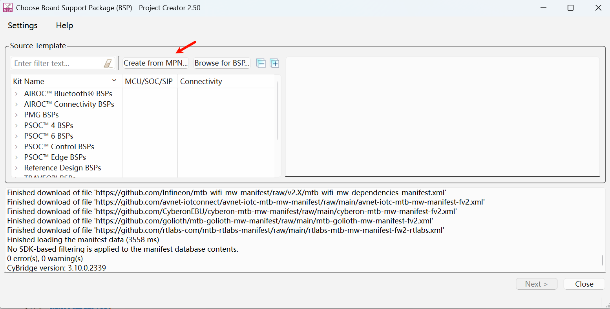

弹出 BSP Assistant 界面, 选择 TRAVEO MCU 下面的 CYT2B95CAS(S是标准温度105℃, E是扩展温度125℃, 选 CYT2B95CAS 应该也可以), 新的BSP命名为 TARGET_CYT2B95:

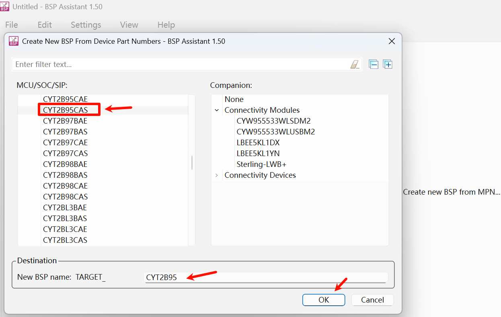

联网卡顿一会, 先不管配置, 点击Close回来

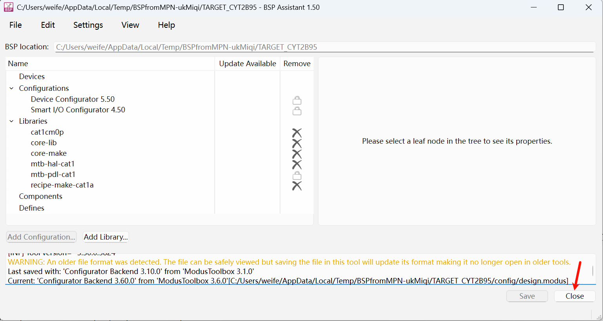

可以看到 Import 处有了 CYT2B95, 点击Next

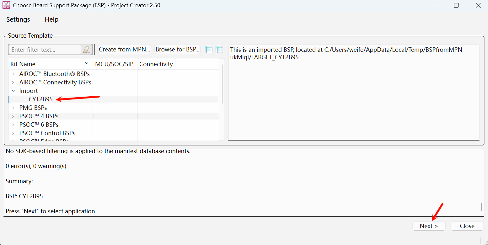

选择工程路径和IDE, 模版应用选择  Peripherals 下面的 `Toggle LED with Systick Timer`, 重命名为 `cyt2b95_led_blink_systick`, 点击 Create:

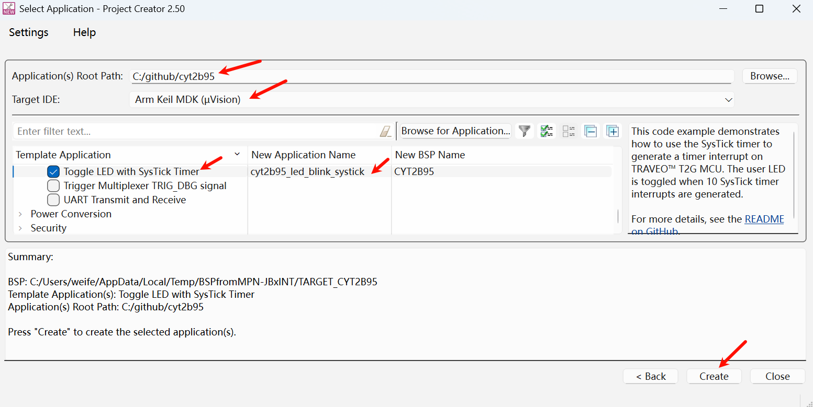

接下来会联网下载一些库, 稍微等待一会即可

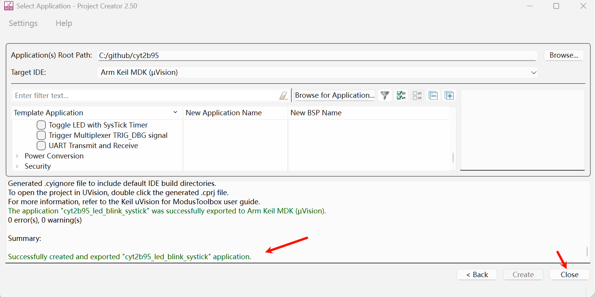

接下来使用 BSP Assistant  配置IO和时钟树, 就像 STM32CubeMX 那样.

### BSP Assistant 配置IO和时钟树

打开 BSP Assistant, 点击 Open BSP

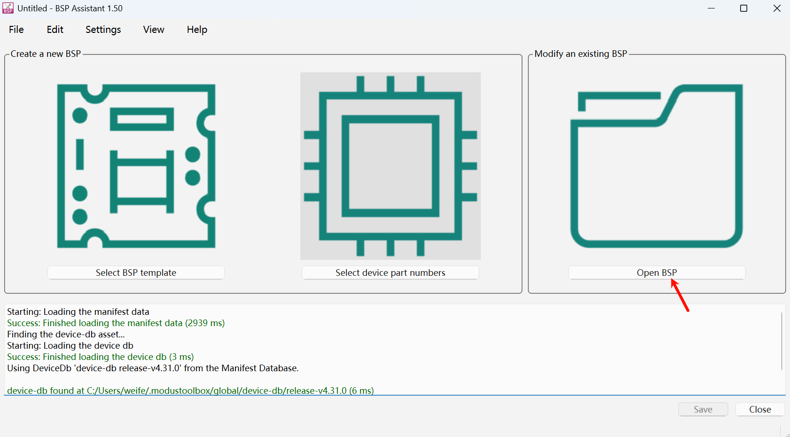

上面工作空间是`C:\github\cyt2b95\`, 工程目录是`C:\github\cyt2b95\cyt2b95_led_blink_systick` , 此处BSP就打开 `C:\github\cyt2b95\cyt2b95_led_blink_systick\bsps\TARGET_CYT2B95` 文件夹.

此处无需使用 HAL, 下拉选N/A, 上面默认CM4启动, 让CM0+核进入deep sleep:

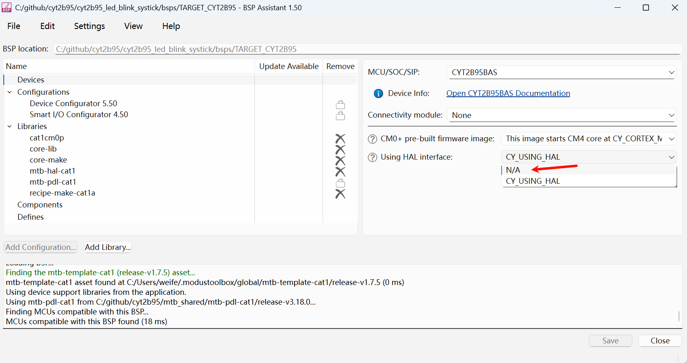

点击Edit Configuration 进入 Device Configurator 

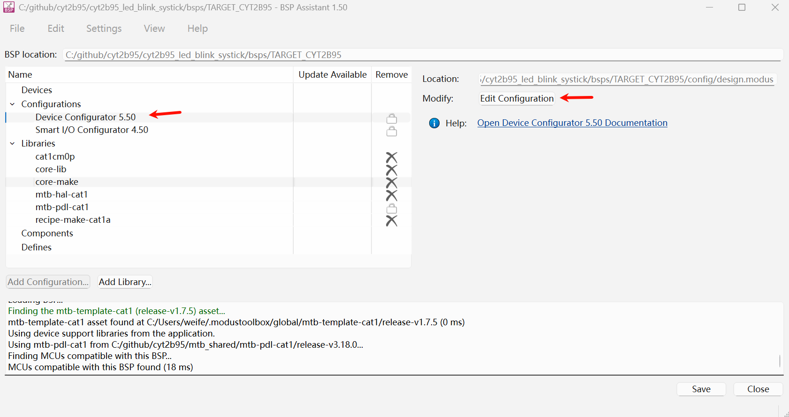

LED是 P18.5, 低电平点亮, Pins选项卡, 设置 P18.5 为 Strong Drive, 初始高电平熄灭, 其它默认, Code Preview 可以预览代码


接下来配置时钟树, 如果不改默认是使用内部8MHz, CM4跑在100MHz, 板子上有16MHz外部晶振, 此处虽然用不到, 但是可以配一下, 双击ECO, 配置晶振 [**X322516MLB4SI**](https://item.szlcsc.com/14393.html?fromZone=s_s__%2216MHz%22&spm=sc.gbn.xh1.zy.n___sc.hm.hd.ss&lcsc_vid=R1YKVVACRVRYAQBTQwdfBQcHQQMIAlFfFFVdBQZRFVcxVlNTR1VfUlZTTlReVTsOAxUeFF5JWBYZEEoEHg8JSQcJGk4%3D) 的参数 16MHz, ±10ppm, 9pF负载电容

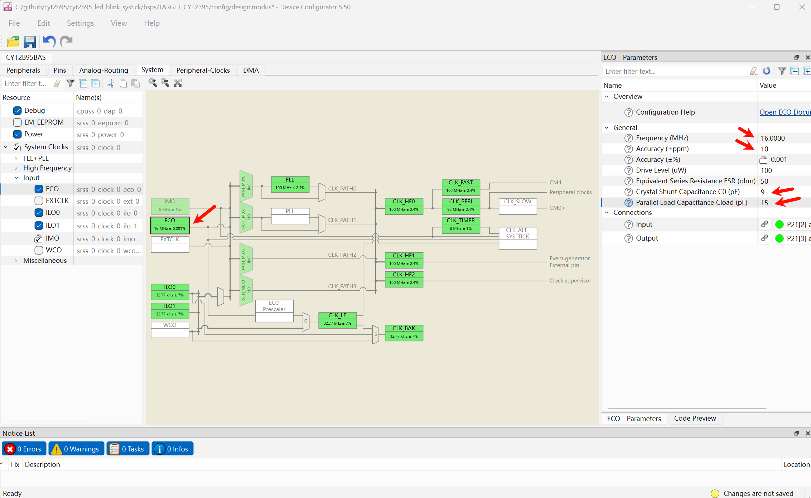

接下来双击PLL, 可以看到只有8MHz内部晶振的选项并不能用到外部的16MHz, 期望频率改到160MHz

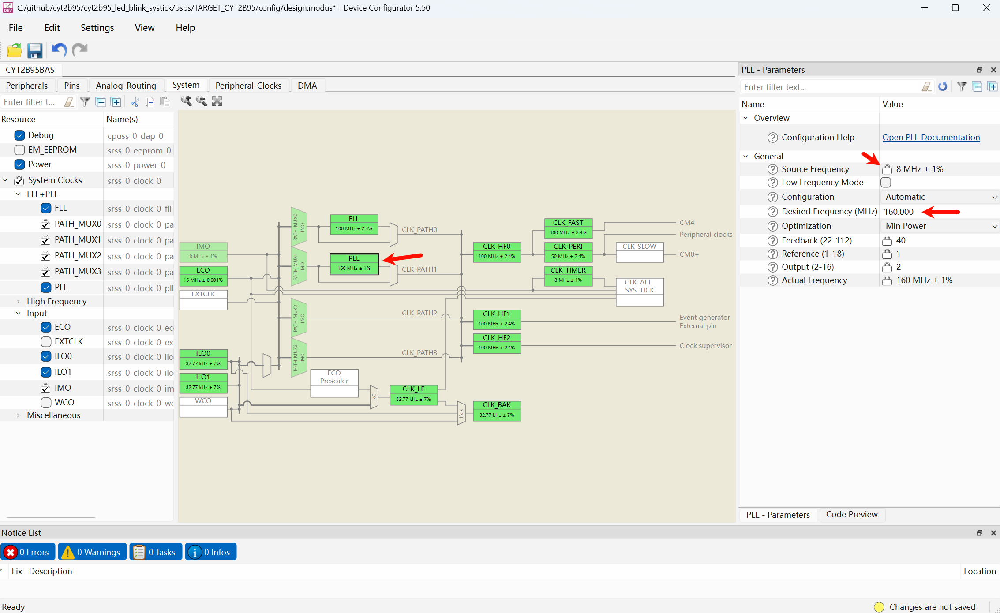

点击CLK_HF0, 改到 PATH1, 这样CM4就能跑到160MHz, 如果CM0+跑的话是80MHz

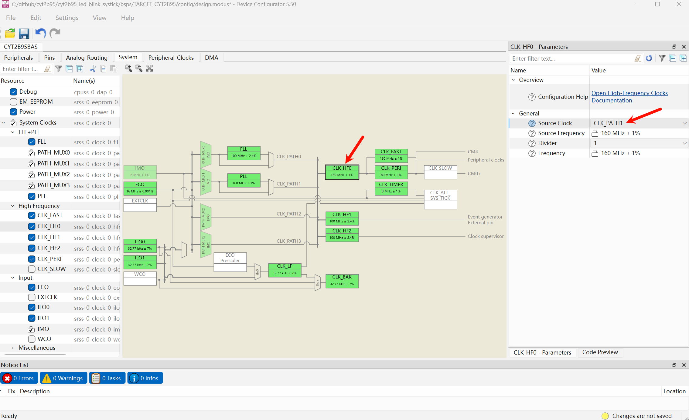

外设这里使用不到, 暂不配置, 按下 Ctrl+S, 已经在工程目录下 `C:\github\cyt2b95\cyt2b95_led_blink_systick\bsps\TARGET_CYT2B95\config\GeneratedSource` 自动生成了代码

### 打开工程编译下载

双击打开工程

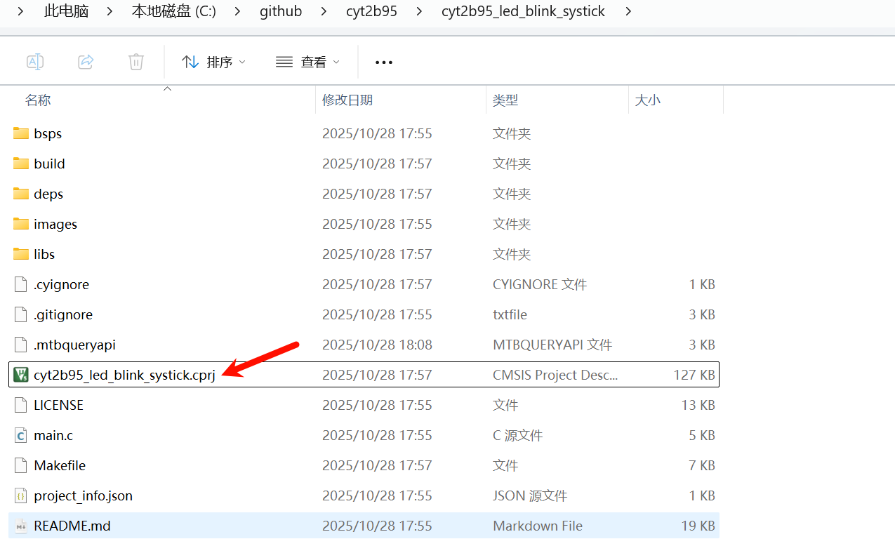

修改 main.c

```c
#include "cy_pdl.h"
#include "cybsp.h"

#define SYSTICK_RELOAD_VAL   (16000000UL)
#define SYSTICK_PERIOD_TIMES (10u)

// 必须加 volatile
volatile uint32_t counterTick = 0;

void toggle_led_on_systick_handler(void)
{
    counterTick++;
}

int main(void)
{
    cy_rslt_t result = cybsp_init() ;
    if (result != CY_RSLT_SUCCESS)
    {
        CY_ASSERT(0);
    }

    __enable_irq();

    /*Initialize the User LED*/
    Cy_GPIO_Pin_FastInit(P18_5_PORT, P18_5_NUM, CY_GPIO_DM_STRONG, 1u, P18_5_GPIO);

    /*Initialize the systick*/
    Cy_SysTick_Init(CY_SYSTICK_CLOCK_SOURCE_CLK_CPU, SYSTICK_RELOAD_VAL);

    /*Set Systick interrupt callback*/
    Cy_SysTick_SetCallback(0, toggle_led_on_systick_handler);

    /*Enable Systick and the Systick interrupt*/
    Cy_SysTick_Enable();


    for (;;)
    {
        /*toggle user led*/
        if(counterTick > SYSTICK_PERIOD_TIMES)
        {
            counterTick = 0;
            Cy_GPIO_Inv(P18_5_PORT, P18_5_NUM);
        }
    }
}
```

编译无error, 暂时忽略warning.

调试器用的 JLink SWD 接口, 接了3根线(GND DIO CLK)

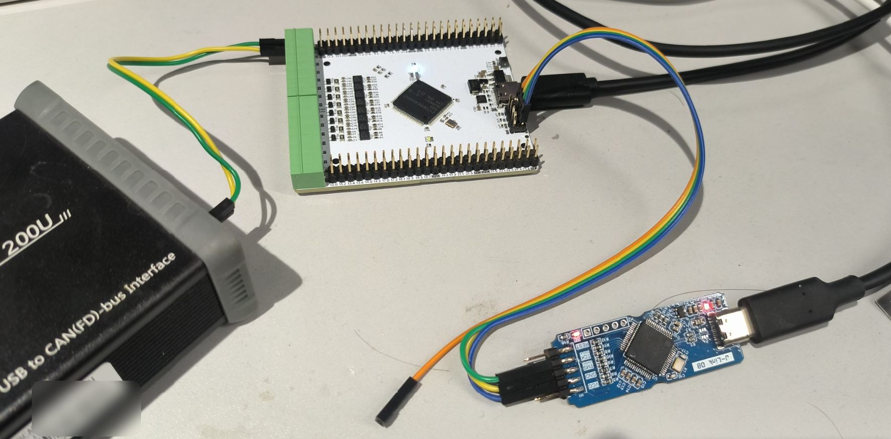

 魔术棒打开调试器, JLink SW

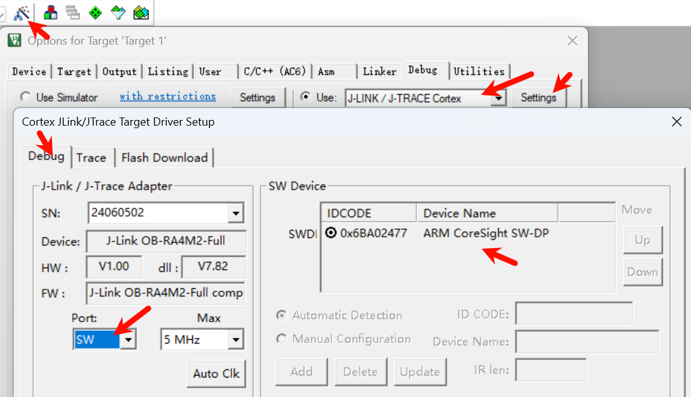

这里勾选 Reset and Run 并没有效果, 实际还是下载后按了复位键

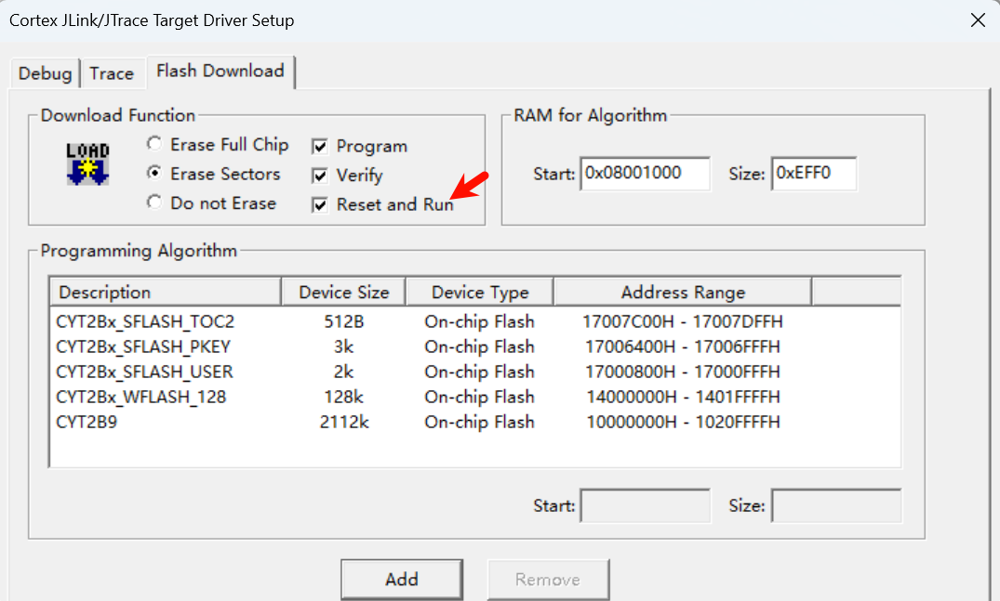

有时候第一次下载会失败, 再下载一次即可, 按下复位后可以看到  LED 以 2s 周期闪烁.

### HEX生成  JFlash烧录

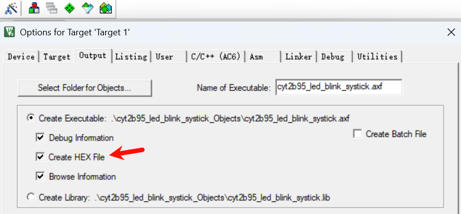

重新编译, 生成的HEX为 `"C:\github\cyt2b95\cyt2b95_led_blink_systick\cyt2b95_led_blink_systick_Objects\cyt2b95_led_blink_systick.hex"`

打开 JFlash, 新建工程选择 CCYT2B95CAS_M4, SWD

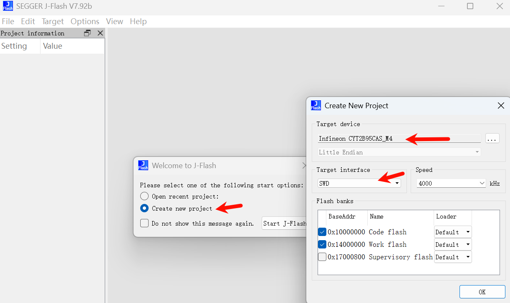

加载 hex 文件, F7 编程后复位即可.

## UART print

SCB0 UART(P0.0 P0.1) 调试串口通过 CH343 引出到 USB TypeC, 时钟树配置参考上小节, 下面是 BSP Assistant 外设里面勾选 SCB0, UART, 115200-8-N-1, 过采样8(这样主时钟需要设置到大约921600Hz)

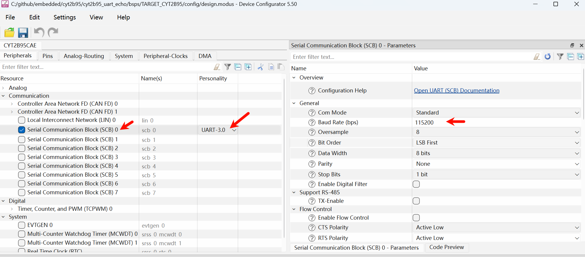

先配置外设时钟, 选择 `24.5 bit Divider 0`, 搭配整数86, 分数26, 得到 921.5kHz, 接近需要的 921600Hz, 外设选择 SCB0

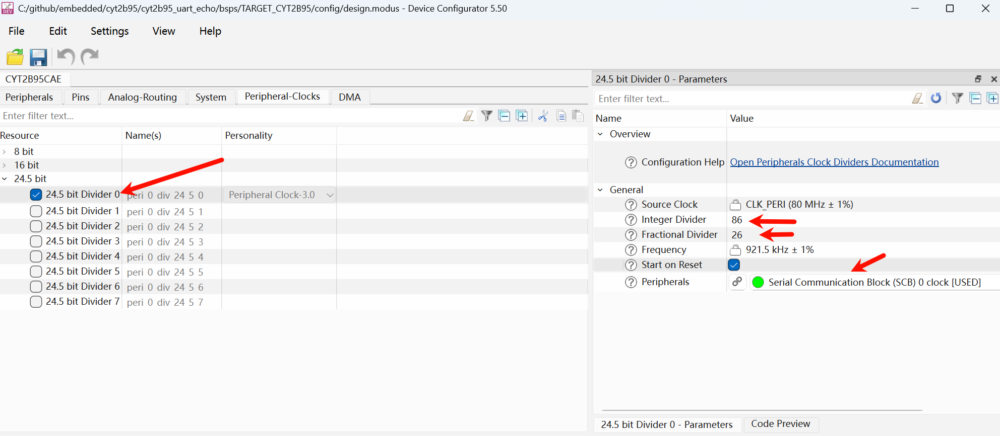

回到 SCB0 设置界面, 发现时钟已经过来了, 再选好IO映射即可:

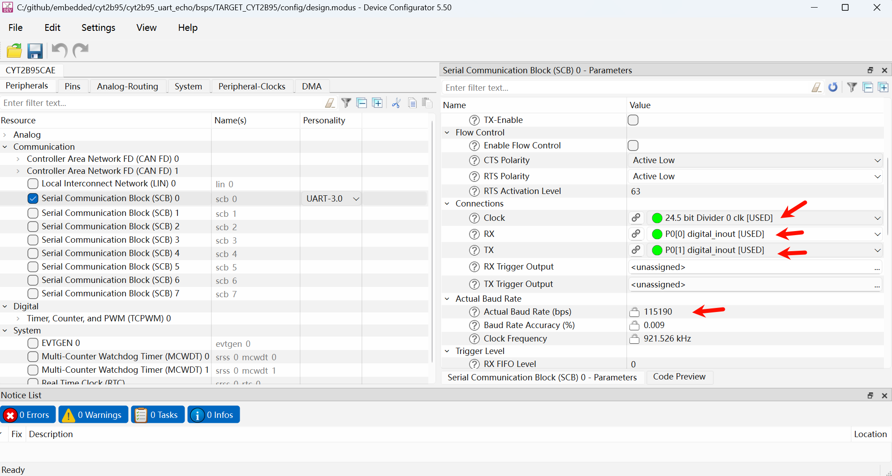

这里只是简单的 print 和 echo, 下面的 API Mode 选择了 Low Level, 图略. 

保存后生成代码, 直接编译报错, 原因是新生成的 `cycfg_peripherals.c` 外设源码文件没有被包含到 Keil 工程, 添加即可

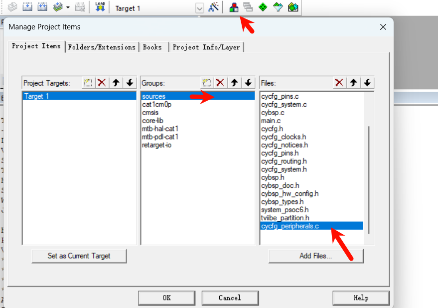

修改main.c代码, 此处实现了print, 无需keil勾选微库

```c
#include "cy_pdl.h"
#include "cy_scb_uart.h"
#include "cybsp.h"
#include <stdarg.h>
#include <stdio.h>
#include <string.h>

cy_stc_scb_uart_context_t uart0;
uint8_t g_uart_out_data[256];

void uart0_callback(uint32_t event) {}

void print(void *fmt, ...) {
  va_list arg;
  va_start(arg, fmt);
  vsprintf((char *)&g_uart_out_data[0], (char *)fmt, arg);
  while (Cy_SCB_UART_IsTxComplete(SCB0) != true) {
  };
  Cy_SCB_UART_PutArray(SCB0, g_uart_out_data, strlen((char *)g_uart_out_data));
  va_end(arg);
}

int main(void) {
  cy_rslt_t result = cybsp_init();
  if (result != CY_RSLT_SUCCESS) {
    CY_ASSERT(0);
  }

  Cy_SCB_UART_DeInit(SCB0);
  Cy_SCB_UART_Init(SCB0, &scb_0_config, &uart0);
  Cy_SCB_UART_Enable(SCB0);

  __enable_irq();

  print("CYT2B95 UART Echo Example\r\n");
  // 测试整数浮点数uint64_t打印
  print("int: %d, float: %.2f, uint64_t: %llu\r\n", -12345, 3.14159,
        12345678901234ULL);

  while (1) {
    // Check if there is at least one character in the RX FIFO
    if (Cy_SCB_UART_GetNumInRxFifo(SCB0) > 0) {
      // Read the received character
      uint8_t rx_data = Cy_SCB_UART_Get(SCB0);

      // Send the same character back to the terminal (echo)
      Cy_SCB_UART_Put(SCB0, rx_data);
    }
  }

  return 0;
}
```

下载复位后测试效果:

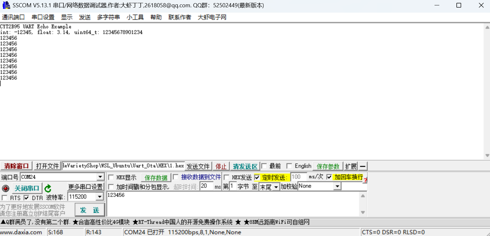


## 重建 mtb_shared

现在 ws_traveo 文件夹下下载了 git 上的 cyt2b95_can_x1 工程, 由于没有 mtb_shared 文件夹, 工程无法编译.

打开 Library Manager, 应用文件夹选择 cyt2b95_can_x1, 点击 update 即可联网下载:

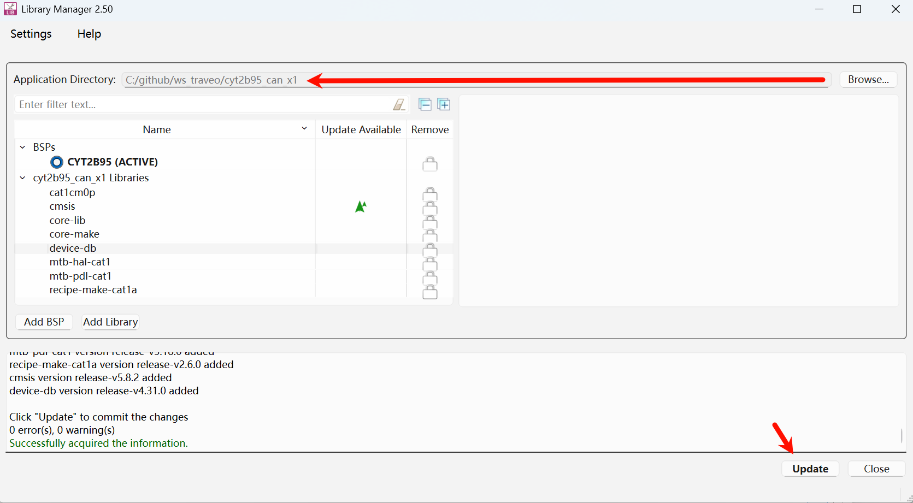

更新完成后显示:

```bash
Summary:
Successfully updated application "cyt2b95_can_x1"
Successfully refreshed dependencies.
Done.
```

可以看到 ws_traveo 文件夹下多了 mtb_shared 文件夹, 里面有工程需要的库:

```bash
ws_traveo
├── cyt2b95_can_x1
└── mtb_shared
    ├── cat1cm0p
    ├── cmsis
    ├── core-lib
    ├── core-make
    ├── mtb-hal-cat1
    ├── mtb-pdl-cat1
    └── recipe-make-cat1a
```

之后打开 cyt2b95_can_x1 工程, 可以正常编译

## mtb_shared 库更新

 ws_traveo 文件夹下放置了很久之前的 cyt2b95_uart_echo 工程, 用的库太老了, 需要更新一下.

打开 Library Manager, 应用文件夹选择 cyt2b95_uart_echo, 发现一堆绿色的可以升级的图标, 挨个选择最新的 release 让绿色图标消失, 点击 update 即可联网下载:

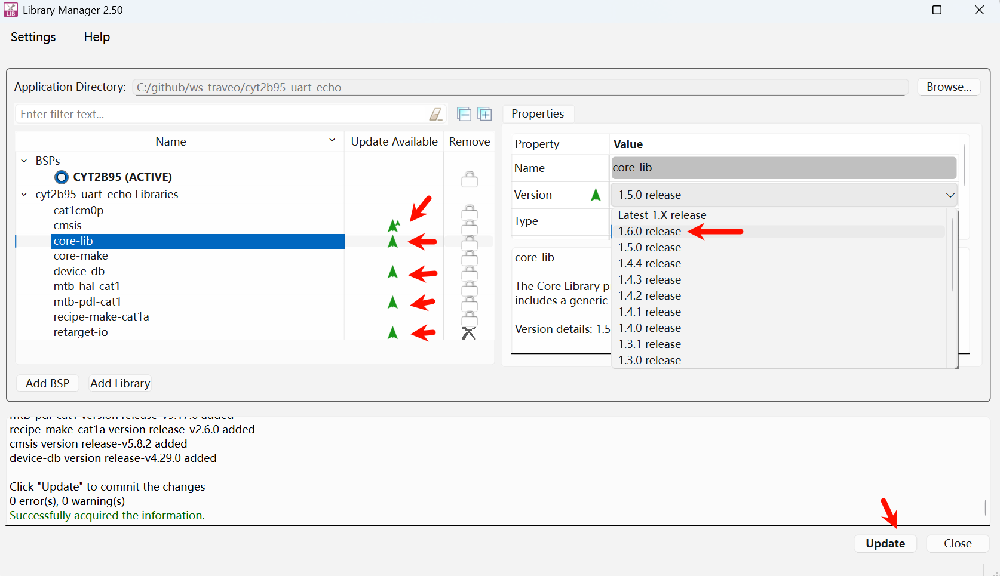

这里需要记录下更新的库的版本方便后面 Keil 路径的替换:

- cmsis 从 5.8.2 -> 6.1.0
- core-lib 从 1.5.0 -> 1.6.0
- device-db 从4.29.0 -> 4.31.0
- mtb-pdl-cat1 从 3.17.0 -> 3.18.0
- retarget-io 从 1.8.0 -> 1.8.1

接下来打开 BSP Assistant, 也挨个更下版本让绿色图标消失, 点击 Save

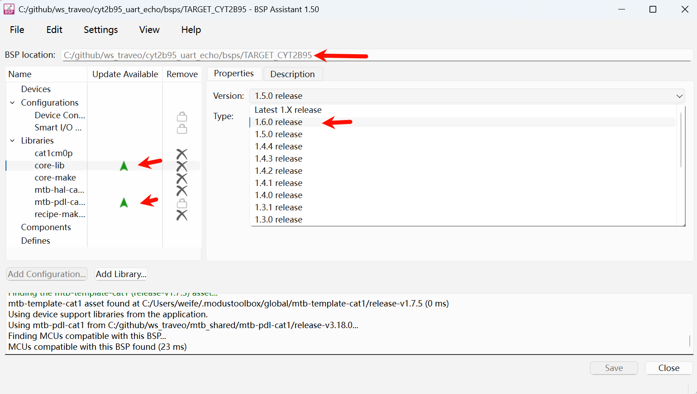

打开 Device Configurator, 按下 Ctrl + S 重新生成下代码

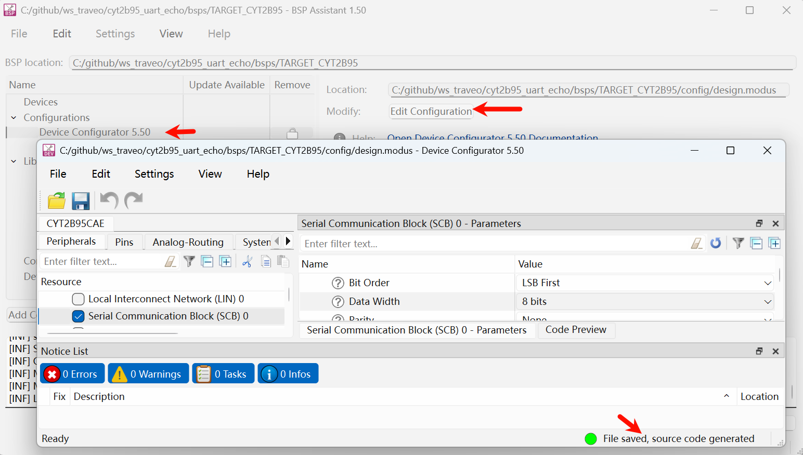

用 VSCode 打开 cyt2b95_uart_echo 工程文件夹, 替换 core-lib 1.5.0 -> 1.6.0 版本号(相当于直接更改了.h头文件和.c源文件的包含路径), 要注意看一下, 别出现 错误的替换了源码中可能存在的 1.5.0 等可能出现的情况.

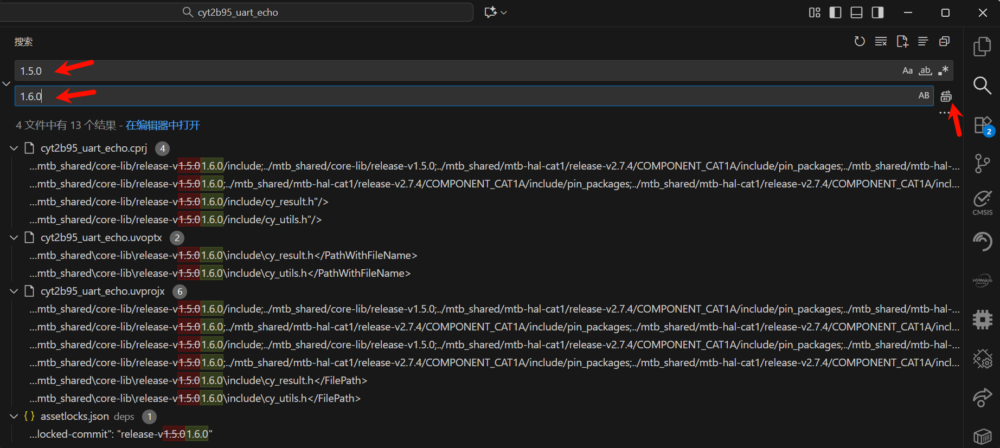

替换 mtb-pdl-cat1 从 3.17.0 -> 3.18.0:

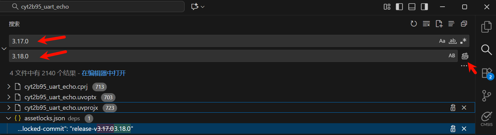

cmsis 和 retarget-io 替换略.

打开 `cyt2b95_uart_echo.uvprojx`, 编译, 小版本更新一般稳一些能编过, 大版本更新用到的API如果有变更可能会报错, 按需修改即可.

 ## 重命名工程

现在有 cyt2b95_uart_echo 工程, 想继续用 print 调试功能, 但是不想重新配置串口部分了, 就拷贝了整个工程文件夹, 重命名为了 cyt2b95_can_x1, 接下来继续修改

重命名 .cprj 和 .uvprojx 文件名为 cyt2b95_can_x1, 打开 .cprj 文件, 弹窗替换.uvprojx文件,  继续修改:

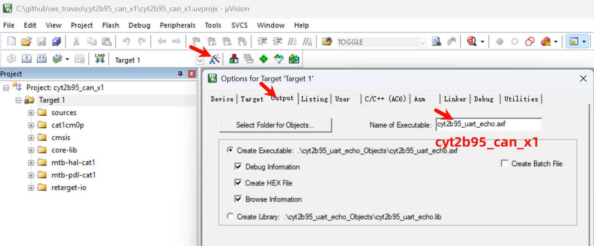

之后添加缺失的 cycfg_peripherals.c 文件

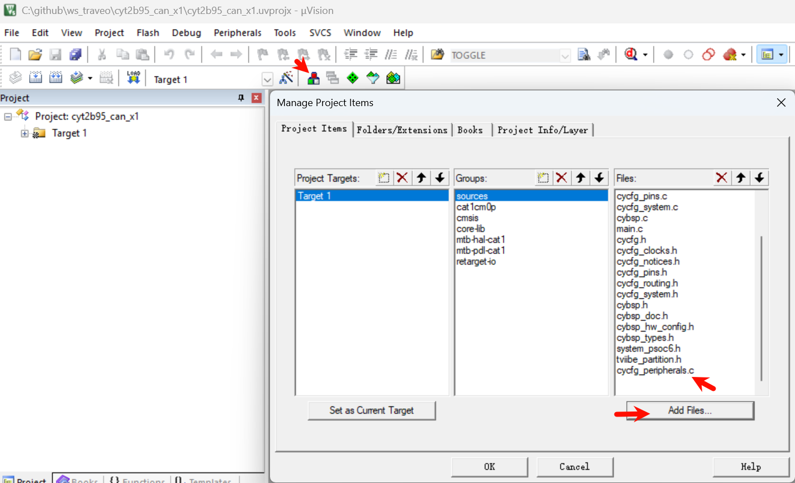

重新编译, 删掉之前无用的 cyt2b95_uart_echo_Listings 和 cyt2b95_uart_echo_Objects 文件夹

## CAN x1 1M+5M

用于测试 CAN0 (P2.0 P2.1)的发送与接收, 1M 80% + 5M 75%采样点

主时钟配置 80MHz

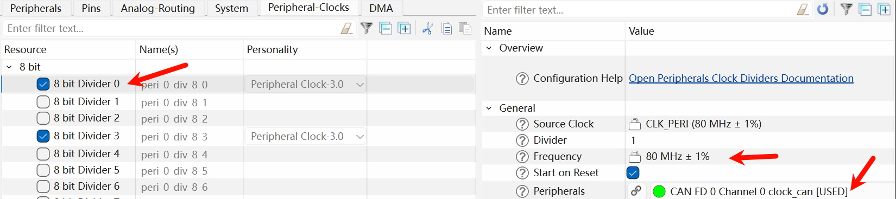

打开CANFD模式, 引脚选择 P2.0 和 P2.1, Message RAM 每通道 4KB, 通道0地址偏移0 (如果是通道1地址偏移4096, 通道2地址偏移8192, 通道3地址偏移12288)

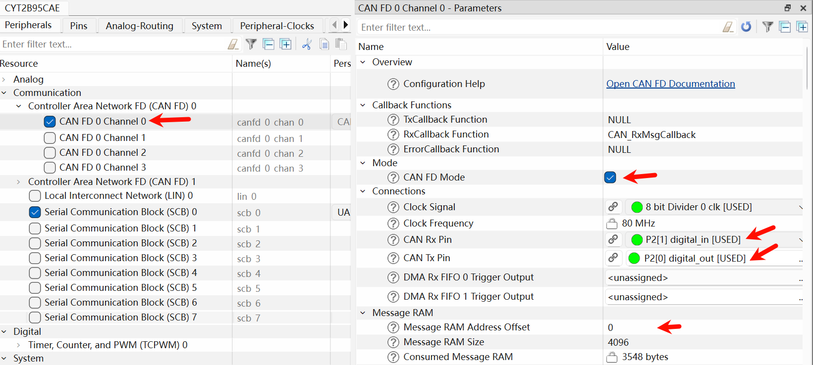

80MHz:

- 仲裁段4分频后是20MHz, 1 + 15 + 4 的组合得到 1M 速率和 80% 采样点
- 数据段2分频后是40MHz, 1 + 5 + 2 的组合得到 5M 速率和 75% 采样点
- TDC需要使能, 值暂时都设置为 1 + 5 = 6

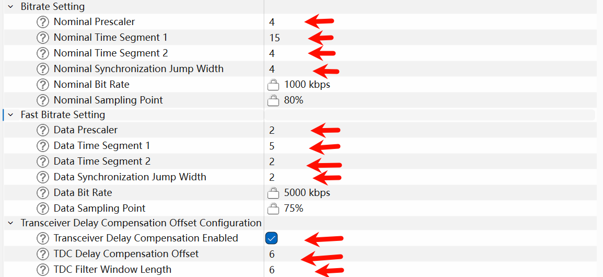

一个标准帧滤波器, 一个扩展帧滤波器, 不管匹配不匹配都丢到 Rx FIFO 0, 不使用 Rx Buffer 和 Rx FIFO 1, 设置 Rx FIFO 0 Size 为16, 使能 FIFO 0 Top pointer Logic, Tx Buffers 数量设置为 32, 这样总计使用了 3548 字节的 Message RAM, 不超过 4096 即可:

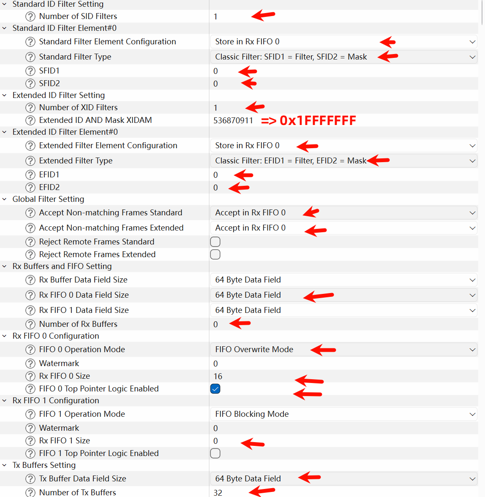

Ctrl + S 保存, 生成代码

linux can 熟悉的人比较多, 这里封装成 linux can 的接口, 更直观一些:

```c
cy_stc_canfd_context_t can0_context = {0};
static uint8_t can0_tx_index = 0;
typedef struct canfd_frame canfd_frame_t;

int can_send(canfd_frame_t *frame) {
  // 创建实际的结构体对象 (不是指针!)
  cy_stc_canfd_t0_t t0_register = {0};
  cy_stc_canfd_t1_t t1_register = {0};
  uint32_t data[CY_CANFD_MESSAGE_DATA_BUFFER_SIZE] = {0};

  // 设置 T0 寄存器
  t0_register.id = frame->can_id & CAN_EFF_MASK;
  if (frame->can_id & CAN_EFF_FLAG) {
    t0_register.xtd = CY_CANFD_XTD_EXTENDED_ID;
  } else {
    t0_register.xtd = CY_CANFD_XTD_STANDARD_ID;
  }
  if (frame->can_id & CAN_RTR_FLAG) {
    t0_register.rtr = CY_CANFD_RTR_REMOTE_FRAME;
  } else {
    t0_register.rtr = CY_CANFD_RTR_DATA_FRAME;
  }
  t0_register.esi = CY_CANFD_ESI_ERROR_ACTIVE;

  // 设置 T1 寄存器
  t1_register.dlc = can_len2dlc(frame->len);
  if ((frame->flags & CANFD_FDF) || (frame->flags & CANFD_BRS)) {
    t1_register.fdf = CY_CANFD_FDF_CAN_FD_FRAME;
  } else {
    t1_register.fdf = CY_CANFD_FDF_STANDARD_FRAME;
  }
  t1_register.brs = (frame->flags & CANFD_BRS) ? true : false;
  t1_register.efc = false;
  t1_register.mm = 0;

  // 复制数据
  uint32_t dataWords = (frame->len + 3) / 4; // Round up to nearest word
  for (uint32_t i = 0; i < dataWords && i < CY_CANFD_MESSAGE_DATA_BUFFER_SIZE;
       i++) {
    data[i] = ((uint32_t *)frame->data)[i];
  }

  // 组装 TX Buffer 结构体,指针指向实际对象
  cy_stc_canfd_tx_buffer_t txBuffer = {
      .t0_f = &t0_register, .t1_f = &t1_register, .data_area_f = data};
  // MEMO: Cy_CANFD_GetTxBufferStatus
  cy_en_canfd_status_t status = Cy_CANFD_UpdateAndTransmitMsgBuffer(
      CANFD0, 0, &txBuffer, can0_tx_index, &can0_context);
  can0_tx_index = (can0_tx_index + 1) % canfd_0_chan_0_config.noOfTxBuffers;
  return (status == CY_CANFD_SUCCESS) ? 0 : -1;
}
```

发送的示例:

```bash
// 发送 CAN, CANFD, CANFD_BRS 的 标准帧和扩展帧, 以及CAN的远程帧
void test_can_send(void) {
  // clang-format off
  canfd_frame_t frame[] = {
      { .can_id = 0x120, .len = 8, .flags = 0, .data = {1,2,3,4,5,6,7,8} },  // CAN 标准帧
      { .can_id = 0x1FFFFFF0 | CAN_EFF_FLAG, .len = 8, .flags = 0, .data = {1,2,3,4,5,6,7,8} },  // CAN 扩展帧
      { .can_id = 0x121 | CAN_RTR_FLAG, .len = 8, .flags = 0, .data = {0} },  // CAN 远程帧
      { .can_id = 0x122, .len = 32, .flags = CANFD_FDF, .data = {1,2,3,4,5,6,7,8,
                                                                 9,10,11,12,13,14,15,16,
                                                                 17,18,19,20,21,22,23,24,
                                                                 25,26,27,28,29,30,31,32} },  // CANFD 标准帧
      { .can_id = 0x1FFFFFF1 | CAN_EFF_FLAG, .len = 64, .flags = CANFD_FDF | CANFD_BRS, .data = {
                                                                 1,2,3,4,5,6,7,8,
                                                                 9,10,11,12,13,14,15,16,
                                                                 17,18,19,20,21,22,23,24,
                                                                 25,26,27,28,29,30,31,32,
                                                                 33,34,35,36,37,38,39,40,
                                                                 41,42,43,44,45,46,47,48,
                                                                 49,50,51,52,53,54,55,56,
                                                                 57,58,59,60,61,62,63,64} },  // CANFD_BRS 扩展帧
  };
  // clang-format on
  for (int i = 0; i < sizeof(frame) / sizeof(frame[0]); i++) {
    if (can_send(&frame[i]) == 0) {
      print("Sent frame with can_id: 0x%X\n", frame[i].can_id);
    } else {
      print("Failed to send frame with can_id: 0x%X\n", frame[i].can_id);
    }
  }
}
```

进行轮询接收:

```c
  cy_stc_canfd_r0_t r0RxBuffer;
  cy_stc_canfd_r1_t r1RxBuffer;
  uint32_t rxData[CY_CANFD_DATA_ELEMENTS_MAX];
  cy_stc_canfd_rx_buffer_t rxBuffer = {/* .r0_f         */ &r0RxBuffer,
                                       /* .r1_f         */ &r1RxBuffer,
                                       /* .data_area_f  */ rxData};

  while (1) {
    /* Checks the Rx FIFO 0 fill level */
    if (_FLD2VAL(CANFD_CH_M_TTCAN_RXF0S_F0FL, CANFD_RXF0S(CANFD0, 0UL)) ==
        0UL) {
      continue;
    }
    if (CY_CANFD_SUCCESS !=
        (Cy_CANFD_ExtractMsgFromRXBuffer(CANFD0, 0UL, true, 0U, &rxBuffer,
                                         &can0_context))) {
      continue;
    }
    canfd_frame_t frame;
    // 填充 canfd_frame 结构体
    frame.can_id = rxBuffer.r0_f->id;
    if (rxBuffer.r0_f->xtd == CY_CANFD_XTD_EXTENDED_ID) {
      frame.can_id |= CAN_EFF_FLAG;
    }
    if (rxBuffer.r0_f->rtr == CY_CANFD_RTR_REMOTE_FRAME) {
      frame.can_id |= CAN_RTR_FLAG;
    }
    frame.len = can_dlc2len[rxBuffer.r1_f->dlc];
    frame.flags = 0;
    if (rxBuffer.r1_f->fdf == CY_CANFD_FDF_CAN_FD_FRAME) {
      frame.flags |= CANFD_FDF;
    }
    if (rxBuffer.r1_f->brs) {
      frame.flags |= CANFD_BRS;
    }
    // 复制数据
    uint32_t dataWords = (frame.len + 3) / 4; // Round up to nearest word
    for (uint32_t i = 0; i < dataWords && i < CY_CANFD_MESSAGE_DATA_BUFFER_SIZE;
         i++) {
      ((uint32_t *)frame.data)[i] = rxBuffer.data_area_f[i];
    }
    print("rx can_id: 0x%X, len: %d, flags: %s ", frame.can_id, frame.len,
          (frame.flags & CANFD_BRS)   ? "FDBRS"
          : (frame.flags & CANFD_FDF) ? "FD "
                                      : "");
    // 远程帧不再打印数据, 直接显示 remote frame
    if (frame.can_id & CAN_RTR_FLAG) {
      print("remote frame\n");
      continue;
    }
    print("data: ");
    for (uint32_t i = 0; i < frame.len; i++) {
      print("%02X ", frame.data[i]);
    }
    print("\n");
  }
```

接线如图:

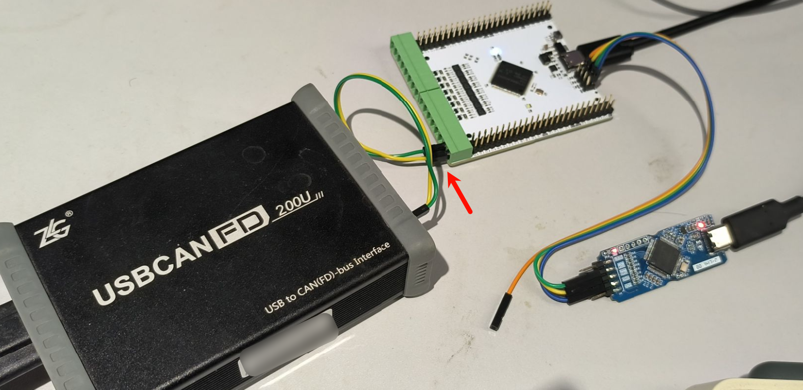

CAN分析仪设置为 1M + 5M:

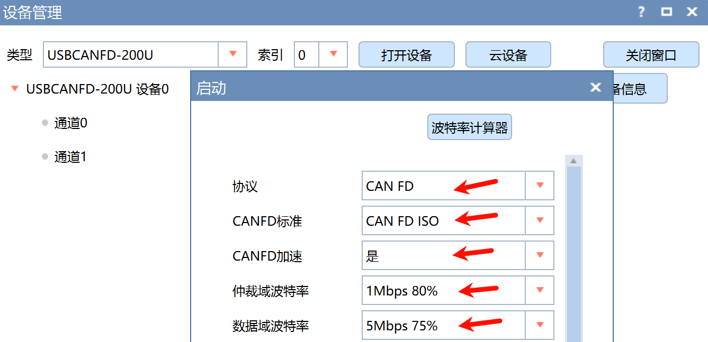

编译下载程序, 复位运行, 可以看到收到了 5 帧CAN报文, 涵盖 `CAN/CANFD/CANFD加速` `数据帧/远程帧` `标准帧/扩展帧`

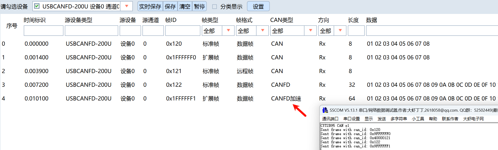

用CAN分析仪往板子发数据, 串口打印出收到的数据:

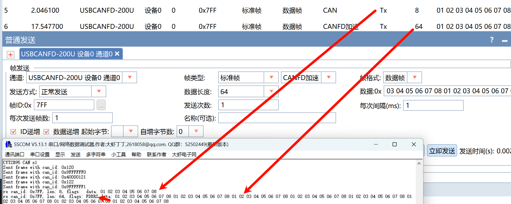

## CAN x8

用于测试所有8路 CANFD 的 echo(把收到的帧原封不动的再发回去), 1M 80% + 5M 75%采样点, 8路的命名和注意事项:

- CAN0, canfd_0_chan_0, P2.0(TX) P2.1(RX), 地址偏移0
- CAN1, canfd_0_chan_1, P0.2(TX) P0.3(RX), 地址偏移4096
- CAN2, canfd_0_chan_2, P6.2(TX) P6.3(RX), 地址偏移8192
- CAN3, canfd_0_chan_3, P3.0(TX) P3.1(RX), 地址偏移12288
- CAN4, canfd_1_chan_0, P14.0(TX) P14.1(RX), 地址偏移0
- CAN5, canfd_1_chan_1, P17.0(TX) P17.1(RX), 地址偏移4096
- CAN6, canfd_1_chan_2, P18.6(TX) P18.7(RX), 地址偏移8192
- CAN7, canfd_1_chan_3, P19.0(TX) P19.1(RX), 地址偏移12288

之前 canfd_0_chan_0 配置好, 剩下的7路并不用一个个鼠标点, 直接 CAN FD 0 Channel 0 上鼠标右键 Copy, 然后其它通道 Paste 即可:

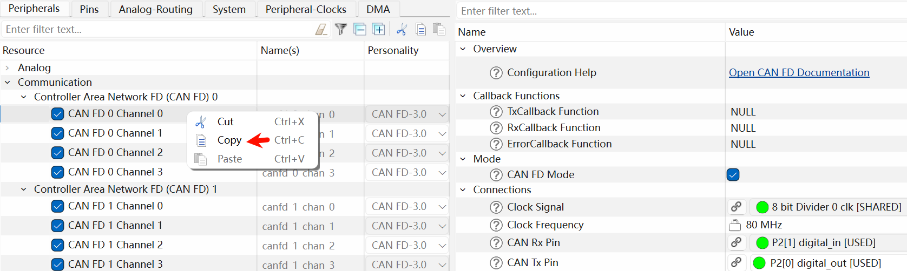

粘贴完配置后要修改不一样的地方, 如 引脚和地址偏移:

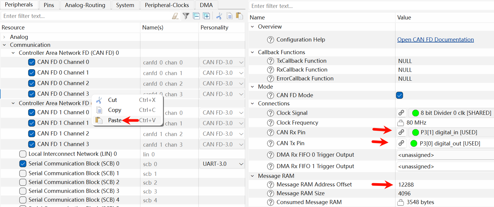

代码中的 8 路定义

```c
// 8路CAN配置指针数组
const cy_stc_canfd_config_t *canfd_configs[8] = {
    &canfd_0_chan_0_config, &canfd_0_chan_1_config, &canfd_0_chan_2_config,
    &canfd_0_chan_3_config, &canfd_1_chan_0_config, &canfd_1_chan_1_config,
    &canfd_1_chan_2_config, &canfd_1_chan_3_config};

typedef enum {
  CAN0 = 0, // canfd_0_chan_0
  CAN1 = 1, // canfd_0_chan_1
  CAN2 = 2, // canfd_0_chan_2
  CAN3 = 3, // canfd_0_chan_3
  CAN4 = 4, // canfd_1_chan_0
  CAN5 = 5, // canfd_1_chan_1
  CAN6 = 6, // canfd_1_chan_2
  CAN7 = 7  // canfd_1_chan_3
} can_channel_t;

CANFD_Type *get_canfd_instance(uint8_t chan) {
  if (chan <= CAN3) {
    return CANFD0;
  } else {
    return CANFD1;
  }
}

uint8_t get_canfd_channel(uint8_t chan) {
  return chan % 4; // 每个 CANFD 实例有4个通道
}


  // 初始化 8 路 CAN
  for (uint8_t chan = 0; chan < 8; chan++) {
    if (CY_CANFD_SUCCESS !=
        Cy_CANFD_Init(get_canfd_instance(chan), get_canfd_channel(chan),
                      canfd_configs[chan], &can_context[chan])) {
      print("CAN%d Init Failed\r\n", chan);
    }
  }
```

把每路收到的帧原封不动发回去:

```c
  print("CYT2B95 CAN x8 Echo Test\r\n");

  cy_stc_canfd_r0_t r0RxBuffer;
  cy_stc_canfd_r1_t r1RxBuffer;
  uint32_t rxData[CY_CANFD_DATA_ELEMENTS_MAX];
  cy_stc_canfd_rx_buffer_t rxBuffer = {/* .r0_f         */ &r0RxBuffer,
                                       /* .r1_f         */ &r1RxBuffer,
                                       /* .data_area_f  */ rxData};

  while (1) {
    // 轮询 8 路 CAN 的 RX FIFO
    for (uint8_t chan = 0; chan < 8; chan++) {
      /* Checks the Rx FIFO 0 fill level */
      if (_FLD2VAL(CANFD_CH_M_TTCAN_RXF0S_F0FL,
                   CANFD_RXF0S(get_canfd_instance(chan),
                               get_canfd_channel(chan))) == 0UL) {
        continue;
      }
      if (CY_CANFD_SUCCESS !=
          (Cy_CANFD_ExtractMsgFromRXBuffer(get_canfd_instance(chan),
                                           get_canfd_channel(chan), true, 0U,
                                           &rxBuffer, &can_context[chan]))) {
        continue;
      }
      canfd_frame_t frame;
      // 填充 canfd_frame 结构体
      frame.can_id = rxBuffer.r0_f->id;
      if (rxBuffer.r0_f->xtd == CY_CANFD_XTD_EXTENDED_ID) {
        frame.can_id |= CAN_EFF_FLAG;
      }
      if (rxBuffer.r0_f->rtr == CY_CANFD_RTR_REMOTE_FRAME) {
        frame.can_id |= CAN_RTR_FLAG;
      }
      frame.len = can_dlc2len[rxBuffer.r1_f->dlc];
      frame.flags = 0;
      if (rxBuffer.r1_f->fdf == CY_CANFD_FDF_CAN_FD_FRAME) {
        frame.flags |= CANFD_FDF;
      }
      if (rxBuffer.r1_f->brs) {
        frame.flags |= CANFD_BRS;
      }
      // 复制数据
      uint32_t dataWords = (frame.len + 3) / 4; // Round up to nearest word
      for (uint32_t i = 0;
           i < dataWords && i < CY_CANFD_MESSAGE_DATA_BUFFER_SIZE; i++) {
        ((uint32_t *)frame.data)[i] = rxBuffer.data_area_f[i];
      }
      print("CAN%d rx can_id: 0x%X, len: %d, flags: %s ", chan, frame.can_id,
            frame.len,
            (frame.flags & CANFD_BRS)   ? "FDBRS"
            : (frame.flags & CANFD_FDF) ? "FD "
                                        : "");
      // 远程帧不再打印数据, 直接显示 remote frame
      if (frame.can_id & CAN_RTR_FLAG) {
        print("remote frame\n");
        continue;
      }
      print("data: ");
      for (uint32_t i = 0; i < frame.len; i++) {
        print("%02X ", frame.data[i]);
      }
      print("\n");

      // Echo: 原封不动发回去
      can_send(chan, &frame);
    }
  }
```

CAN分析仪逐个连接8路CANFD, 测试echo, 如下8路均能正常 echo:

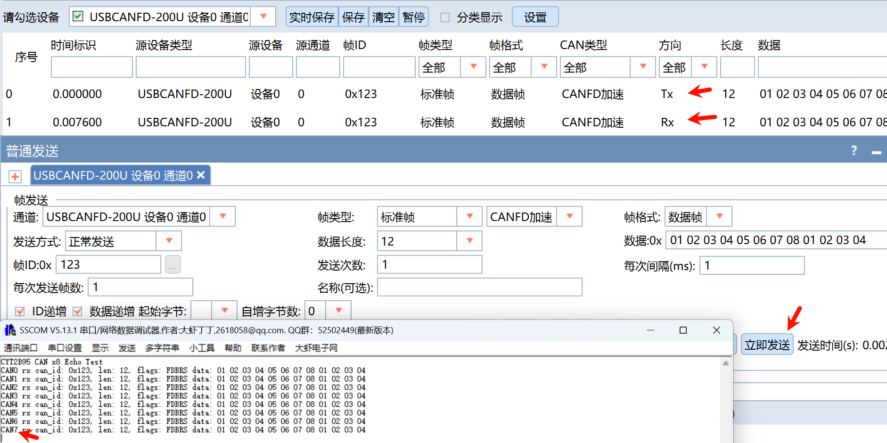

## 板子购买 资料下载

xian yu 搜索用户 weifengdq, 主页里可购买 CYT2B95开发板.

QQ 群(`嵌入式_机器人_自动驾驶交流群`): 1040239879

板子所有资料在群公告网盘链接中免费下载, 欢迎进群潜水, 无需发言, 无需购买板子.

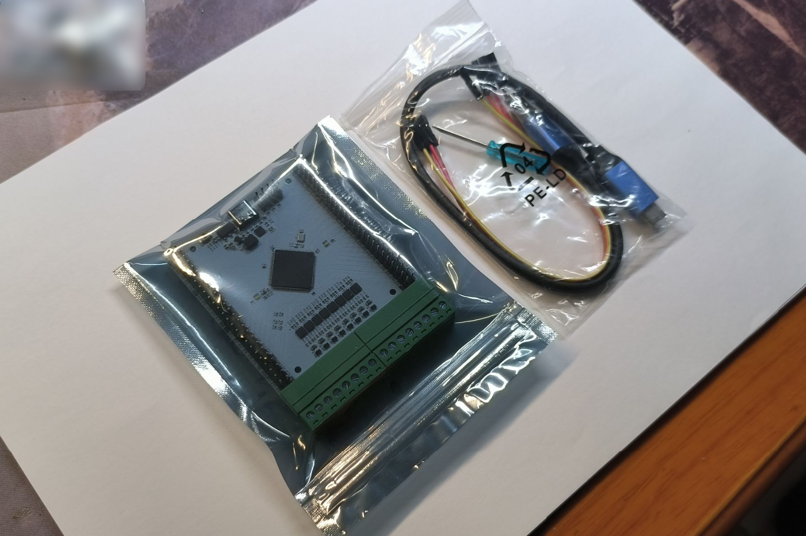

## 参考链接

[weifengdq/embedded: https://github.com/weifengdq/embedded](https://github.com/weifengdq/embedded), 欢迎 Star

[MTB CAT1 Peripheral driver library: Getting Started](https://infineon.github.io/mtb-pdl-cat1/pdl_api_reference_manual/html/page_getting_started.html)

[TRAVEO™ T2G | Traveo Documentation](https://documentation.infineon.com/traveo/index.html?_gl=1*1w3ay67*_gcl_au*MjkzNDcwOTUzLjE3NTg2OTk2Mzc.*_ga*MTY5MTc0MTQ1MC4xNzUyNzM2NTMz*_ga_KVD0BL538B*czE3NjE3MjA2MTEkbzExJGcxJHQxNzYxNzIwNjU3JGoxNCRsMCRoMTU0OTIyMzQ2NA..)

[rodrigort/Examples_TRAVEO_T2G: Examples Traveo T2G](https://github.com/rodrigort/Examples_TRAVEO_T2G)


