## 新建工程

工作空间:

- 拷贝 `GD32A50x_Firmware_Library_V1.7.0\Firmware` 文件夹到工作空间
- 再新建一个存放工程的文件夹 `a503_empty`

工程:

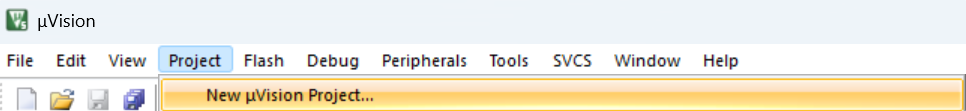

保存到工作空间的 `a503_empty` 文件夹下, 根据使用的封装在 GigaDevice 下选择 GD32A503x

勾选 CMSIS CORE

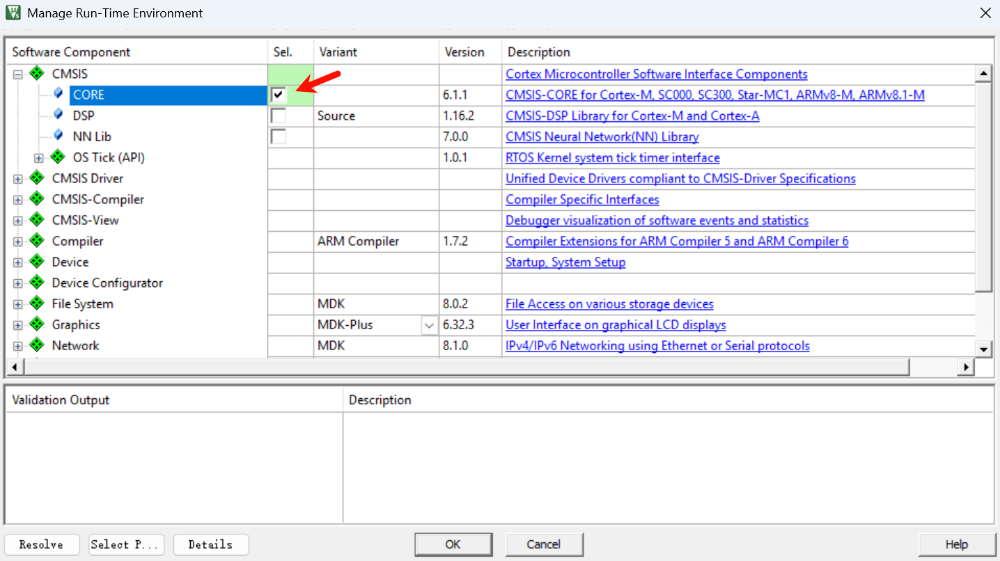

Target 里面如果用printf可以勾选 Use MicroLIB

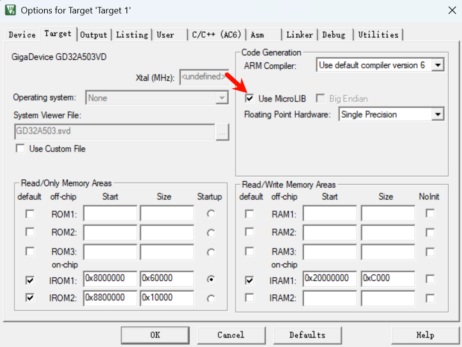

Output 中勾选 Creat HEX File

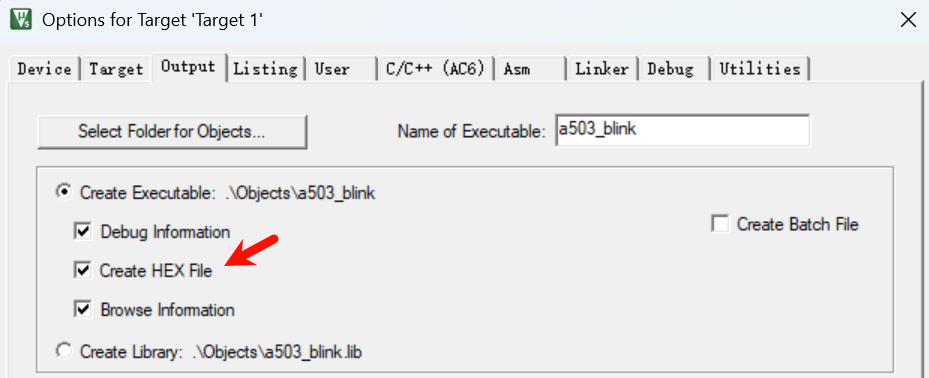

`C/C++` 选项卡下:

- 定义宏 `USE_STDPERIPH_DRIVER,GD32A50X`
- 选择 `AC5-Like Warnings`
- C99 C++11

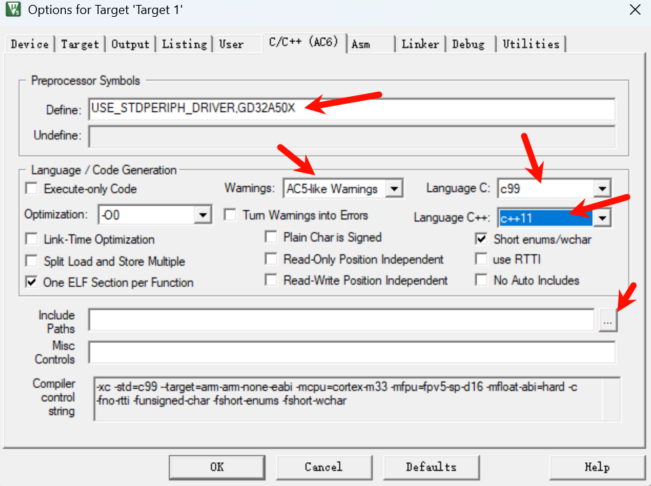

头文件包含:

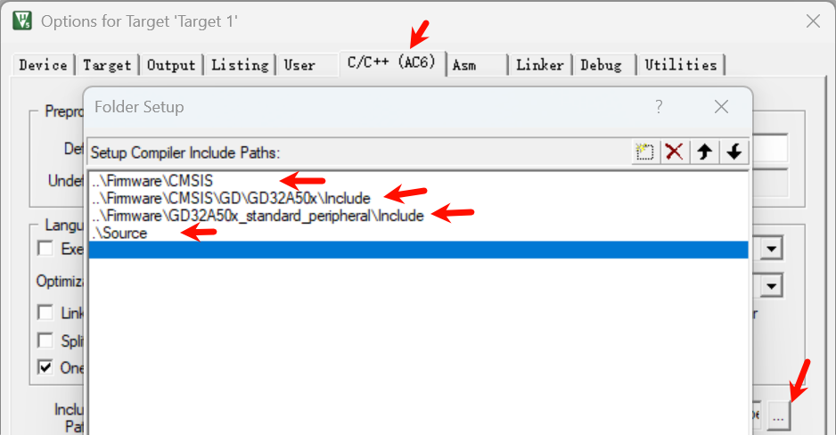

Asm 选择 `armasm (Arm Syntax)`

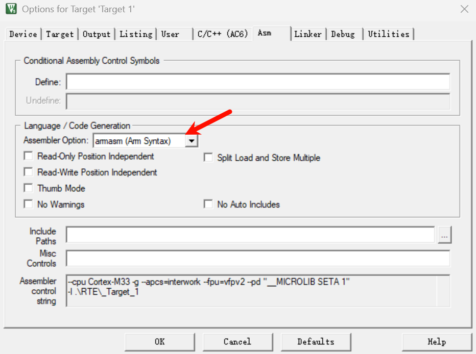

```bash
--cpu Cortex-M33 -g --apcs=interwork --fpu=vfpv2 --pd "__MICROLIB SETA 1" 
-I .\RTE\_Target_1 
-I C:\z\app\Keil\Packs\ARM\CMSIS\6.2.0\CMSIS\Core\Include 
--pd "__UVISION_VERSION SETA 538" --pd "_RTE_ SETA 1" --pd "_RTE_ SETA 1" --list ".\Listings\*.lst" --xref -o "*.o" --depend "*.d" 
```

Linker 默认如下不改

```bash
--cpu=Cortex-M33 *.o
--library_type=microlib --strict --scatter ".\Objects\a503_blink.sct"
--summary_stderr --info summarysizes --map --load_addr_map_info --xref --callgraph --symbols
--info sizes --info totals --info unused --info veneers
--list ".\Listings\a503_blink.map"
-o .\Objects\a503_blink.axf
```

Debug 随调试器改, 此处不赘述

Utilities 先不改

Manage Project Items:

- CMSIS
  - "Firmware\CMSIS\GD\GD32A50x\Source\system_gd32a50x.c"
- Peripherals
  - "Firmware\GD32A50x_standard_peripheral\Source\" 文件夹下的所有 C 文件
- Startup
  - "Firmware\CMSIS\GD\GD32A50x\Source\ARM\startup_gd32a50x.s"
- Source
  - 自己的源文件 

如下图:

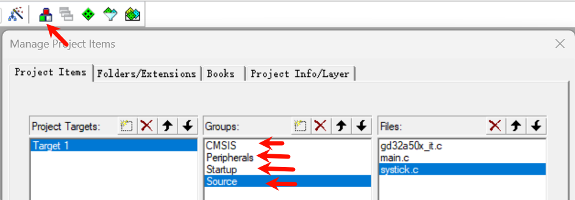

编译无错误:

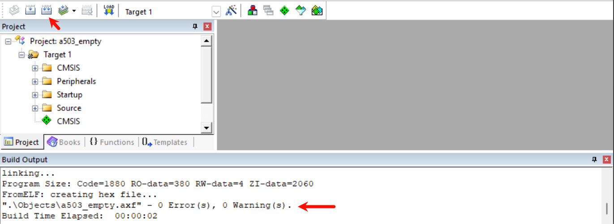

## 重命名工程

拷贝 a503_empty 文件夹, 重命名为 a503_blink.

删除 .vscode Listings Objects 文件夹 和 `*.uvguix.*` 文件

重命名 `.uvoptx 和 .uvprojx` 文件为 a503_blink

VSCode 打开 a503_blink 文件夹, a503_empty  全部替换为 a503_blink, 这就要求工程名别致一些, 以免误替换.


以上操作写成一个 copy_and_rename_project.ps1, 使用方法和效果如下:

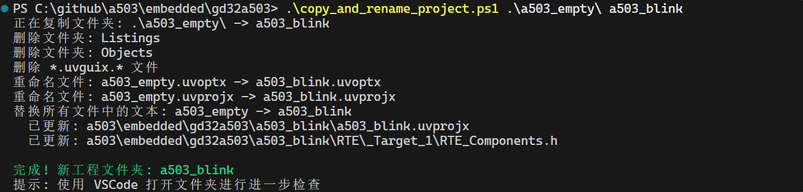

## 时钟树

`GD32A50x_Firmware_Library_V1.7.0\Firmware\CMSIS\GD\GD32A50x\Source\ARM\startup_gd32a50x.s` 里面可以看到 `IMPORT  SystemInit  IMPORT  __main`, 也就是在 main 函数之前就已经执行了 `SystemInit` 函数.

`SystemInit ` 函数在 `GD32A50x_Firmware_Library_V1.7.0\Firmware\CMSIS\GD\GD32A50x\Source\system_gd32a50x.c` 文件中实现, 用 AI 总结功能是:

> SystemInit 函数主要完成上电后内核与时钟的基础复位与初始配置，步骤概述如下：  
>
> 1. FPU 访问：若芯片带 FPU 且已使用，开放 CP10/CP11 完全访问权限。  
> 2. 时钟复位到缺省：确保内部 8MHz IRC8M 打开；若当前系统时钟是 PLL，执行分频阶梯降频宏 `RCU_MODIFY_DE_3(0x100)` 以减轻切换瞬间的 Vcore 波动。然后清除系统时钟源选择位。  
> 3. 软延时：调用 `_soft_delay_(100)` 给内部稳态留时间。  
> 4. 关闭/复位外部与 PLL 相关功能：清除 HXTAL、PLL、锁定、时钟监测等控制位，禁止所有 RCU 中断；重写 `RCU_CFG0` 与 `RCU_CFG1` 为复位初值；清除外部晶振旁路位。  
> 5. 根据外部晶振频率设置放大/标称位：若 `HXTAL_VALUE > 8MHz` 则置位 `HXTALSCAL`。  
> 6. 调用 `system_clock_config()`：按照编译期选择的宏（如 `__SYSTEM_CLOCK_100M_PLL_HXTAL` 等）完成目标系统时钟、PLL 倍频、总线分频及 Flash 等设置（具体实现分支在下方各 `system_clock_xxx`）。  
> 7. 配置 LXTAL 旁路保护位：暂时打开 PMU 时钟；必要时打开后备域写入使能 `BKPWEN`；设置 `LXTALBPS` 以使低速晶振旁路保护；随后根据之前状态关闭 PMU 时钟或清除临时使能位。  
> 8. 设置中断向量表基址：根据是否定义 `VECT_TAB_SRAM` 选择放到 SRAM 或 FLASH，偏移量为 `VECT_TAB_OFFSET`。  
>
> 整体作用：保证复位后时钟与电源域安全过渡到预期系统频率，避免直接高速切换导致内核或供电不稳定，同时完成 FPU、低速/高速晶振与向量表的基础环境搭建。

`GD32A50x_Firmware_Library_V1.7.0\Firmware\CMSIS\GD\GD32A50x\Include\gd32a50x.h` 文件中可以看到, 默认使用外部 8MHz 晶振: `#define HXTAL_VALUE   ((uint32_t)8000000)`

使用 system_clock_100m_pll_hxtal 函数安全循序的设置系统时钟到 100MHz, 反映到最终的时钟树就是:

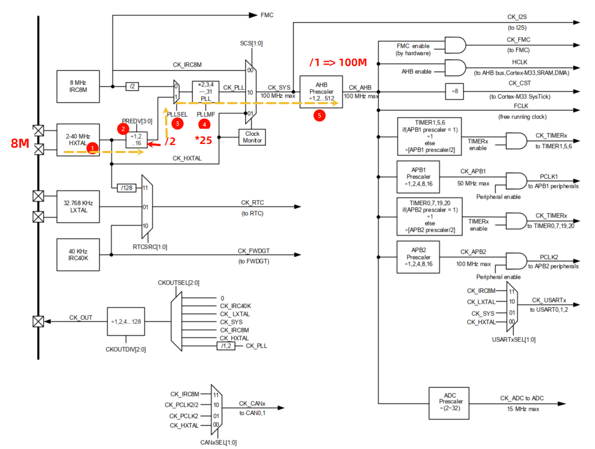

## Blink


## Printf

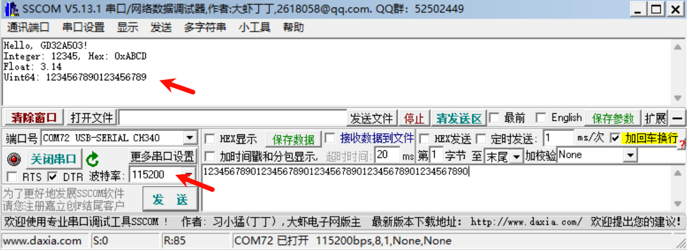

## ADC

用螺丝刀转动板载10K电位器, 注意与其它器件保持安全距离, 逆时针旋转可增大到接近3.3V, 顺时针减小到 0V

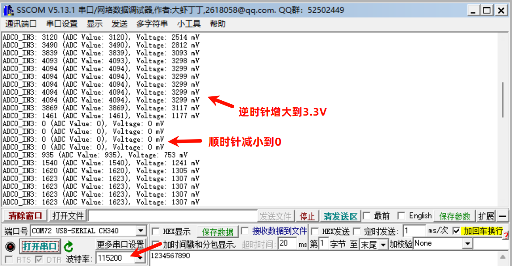

## CAN

500K 80% + 1M 80%


## I2C EEPROM 24C02

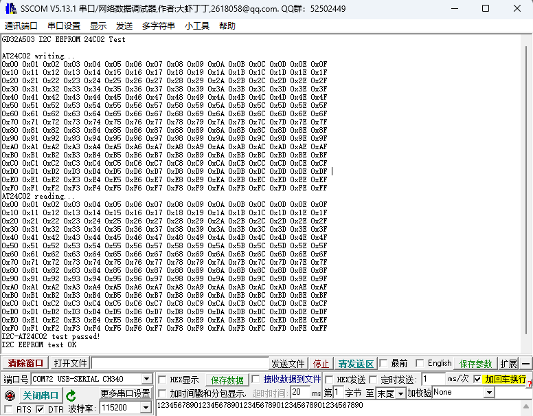


