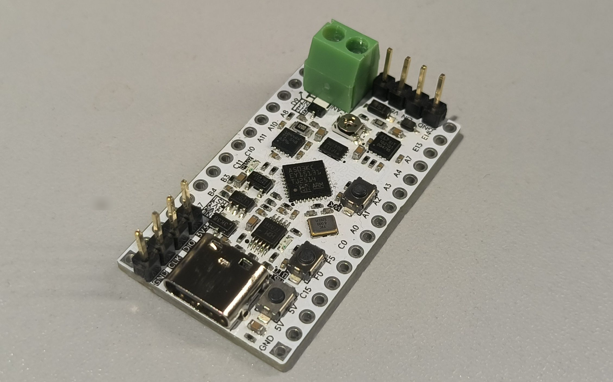

## 板子简介

GD32A503 评估板资源:

- **GD32A503KCU3**
  - ASIL-B READY, -40~+125℃
  - Cortex-M33, 100MHz, 外置扬兴的 8MHz 无源晶振
  - 32KB SRAM, 256KB Flash, 64KB Data Flash
  - QFN32 封装, 支持 1xCANFD, 1xUSART/LIN, 1xSPI, 1xMFCOM可用做UART/I2C/SPI/PWM等, 类似NXP的FlexIO
  - 注: 同系列 64PIN 或 100PIN 封装的可以支持到 2xCANFD 3xUSART/LIN, 2xSPI
- **CANFD 收发器**: TI , 车规级 TCAN1044AVDRBRQ1, 可支持到 8Mbits/s
- **LIN 收发器**: 芯力特, 车规级 SIT1021QTK/1, LIN速率可到 20kbps
- **Quad SPI FLASH**: W25Q16JVUXIQ, 16Mbit
- I2C EEPROM: 24C02S, 2KBit
- USB串口: CH340X, 支持到 2Mbps
- BOURNS 的 10K 电位器 用于测试 ADC
- 电源指示灯, 用户LED, RST BT0 WAKEUP 按键, SWD 下载接口等
- 全部 IO 引出方便逻辑分析仪等抓取波形进行分析

如图所示:

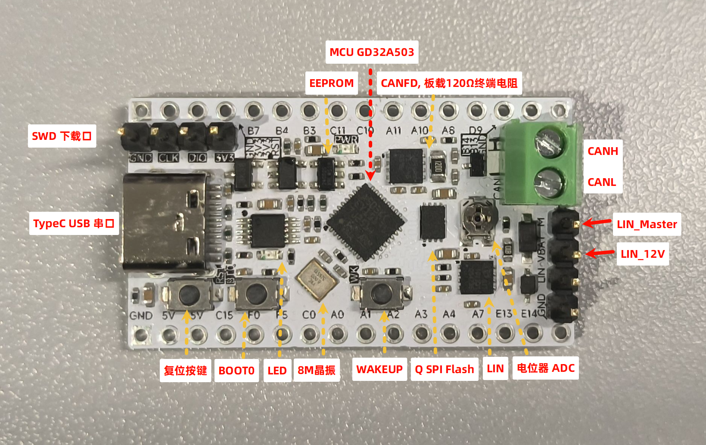

## 软件固件

如下:

- GigaDevice.GD32A50x_DFP.1.6.0.pack
- GD32A50x_Firmware_Library_V1.7.0

## 新建工程

工作空间:

- 拷贝 `GD32A50x_Firmware_Library_V1.7.0\Firmware` 文件夹到工作空间
- 再新建一个存放工程的文件夹 `a503_empty`

工程:


保存到工作空间的 `a503_empty` 文件夹下, 根据使用的封装在 GigaDevice 下选择 GD32A503x

勾选 CMSIS CORE


Target 里面如果用printf可以勾选 Use MicroLIB


Output 中勾选 Creat HEX File


`C/C++` 选项卡下:

- 定义宏 `USE_STDPERIPH_DRIVER,GD32A50X`
- 选择 `AC5-Like Warnings`
- C99 C++11


头文件包含:


Asm 选择 `armasm (Arm Syntax)`


```bash
--cpu Cortex-M33 -g --apcs=interwork --fpu=vfpv2 --pd "__MICROLIB SETA 1" 
-I .\RTE\_Target_1 
-I C:\z\app\Keil\Packs\ARM\CMSIS\6.2.0\CMSIS\Core\Include 
--pd "__UVISION_VERSION SETA 538" --pd "_RTE_ SETA 1" --pd "_RTE_ SETA 1" --list ".\Listings\*.lst" --xref -o "*.o" --depend "*.d" 
```

Linker 默认如下不改

```bash
--cpu=Cortex-M33 *.o
--library_type=microlib --strict --scatter ".\Objects\a503_blink.sct"
--summary_stderr --info summarysizes --map --load_addr_map_info --xref --callgraph --symbols
--info sizes --info totals --info unused --info veneers
--list ".\Listings\a503_blink.map"
-o .\Objects\a503_blink.axf
```

Debug 随调试器改, 此处不赘述

Utilities 先不改

Manage Project Items:

- CMSIS
  - "Firmware\CMSIS\GD\GD32A50x\Source\system_gd32a50x.c"
- Peripherals
  - "Firmware\GD32A50x_standard_peripheral\Source\" 文件夹下的所有 C 文件
- Startup
  - "Firmware\CMSIS\GD\GD32A50x\Source\ARM\startup_gd32a50x.s"
- Source
  - 自己的源文件 

如下图:


编译无错误:


## 重命名工程

拷贝 a503_empty 文件夹, 重命名为 a503_blink.

删除 .vscode Listings Objects 文件夹 和 `*.uvguix.*` 文件

重命名 `.uvoptx 和 .uvprojx` 文件为 a503_blink

VSCode 打开 a503_blink 文件夹, a503_empty  全部替换为 a503_blink, 这就要求工程名别致一些, 以免误替换.


以上操作写成一个 copy_and_rename_project.ps1, 使用方法和效果如下:


## 时钟树

`GD32A50x_Firmware_Library_V1.7.0\Firmware\CMSIS\GD\GD32A50x\Source\ARM\startup_gd32a50x.s` 里面可以看到 `IMPORT  SystemInit  IMPORT  __main`, 也就是在 main 函数之前就已经执行了 `SystemInit` 函数.

`SystemInit ` 函数在 `GD32A50x_Firmware_Library_V1.7.0\Firmware\CMSIS\GD\GD32A50x\Source\system_gd32a50x.c` 文件中实现, 用 AI 总结功能是:

> SystemInit 函数主要完成上电后内核与时钟的基础复位与初始配置，步骤概述如下：  
>
> 1. FPU 访问：若芯片带 FPU 且已使用，开放 CP10/CP11 完全访问权限。  
> 2. 时钟复位到缺省：确保内部 8MHz IRC8M 打开；若当前系统时钟是 PLL，执行分频阶梯降频宏 `RCU_MODIFY_DE_3(0x100)` 以减轻切换瞬间的 Vcore 波动。然后清除系统时钟源选择位。  
> 3. 软延时：调用 `_soft_delay_(100)` 给内部稳态留时间。  
> 4. 关闭/复位外部与 PLL 相关功能：清除 HXTAL、PLL、锁定、时钟监测等控制位，禁止所有 RCU 中断；重写 `RCU_CFG0` 与 `RCU_CFG1` 为复位初值；清除外部晶振旁路位。  
> 5. 根据外部晶振频率设置放大/标称位：若 `HXTAL_VALUE > 8MHz` 则置位 `HXTALSCAL`。  
> 6. 调用 `system_clock_config()`：按照编译期选择的宏（如 `__SYSTEM_CLOCK_100M_PLL_HXTAL` 等）完成目标系统时钟、PLL 倍频、总线分频及 Flash 等设置（具体实现分支在下方各 `system_clock_xxx`）。  
> 7. 配置 LXTAL 旁路保护位：暂时打开 PMU 时钟；必要时打开后备域写入使能 `BKPWEN`；设置 `LXTALBPS` 以使低速晶振旁路保护；随后根据之前状态关闭 PMU 时钟或清除临时使能位。  
> 8. 设置中断向量表基址：根据是否定义 `VECT_TAB_SRAM` 选择放到 SRAM 或 FLASH，偏移量为 `VECT_TAB_OFFSET`。  
>
> 整体作用：保证复位后时钟与电源域安全过渡到预期系统频率，避免直接高速切换导致内核或供电不稳定，同时完成 FPU、低速/高速晶振与向量表的基础环境搭建。

`GD32A50x_Firmware_Library_V1.7.0\Firmware\CMSIS\GD\GD32A50x\Include\gd32a50x.h` 文件中可以看到, 默认使用外部 8MHz 晶振: `#define HXTAL_VALUE   ((uint32_t)8000000)`

使用 system_clock_100m_pll_hxtal 函数安全循序的设置系统时钟到 100MHz, 反映到最终的时钟树就是:


## GPIO

IO 输出, 参考 a503_blink

```c
// PC15 LED
rcu_periph_clock_enable(RCU_GPIOC);
gpio_mode_set(GPIOC, GPIO_MODE_OUTPUT, GPIO_PUPD_NONE, GPIO_PIN_15);
gpio_output_options_set(GPIOC, GPIO_OTYPE_PP, GPIO_OSPEED_50MHZ, GPIO_PIN_15);
// 高电平熄灭, 以下方法都可以
// GPIO_BOP(GPIOC) = GPIO_PIN_15;
// gpio_bit_reset(GPIOC, GPIO_PIN_15);
gpio_bit_write(GPIOC, GPIO_PIN_15, SET);
// gpio_bit_toggle(GPIOC, GPIO_PIN_15);
```

IO 输入, 参考 a503_lin_master

```c
// WK Button: PA0
rcu_periph_clock_enable(RCU_GPIOA);
gpio_mode_set(GPIOA, GPIO_MODE_INPUT, GPIO_PUPD_NONE, GPIO_PIN_0);
if (RESET == gpio_input_bit_get(GPIOA, GPIO_PIN_0)) {}
```

## Printf

a503_printf, 重定向:

```c
int fputc(int ch, FILE *f) {
  // retarget the C library printf function to the USART
  usart_data_transmit(USART0, (uint8_t)ch);
  while (RESET == usart_flag_get(USART0, USART_FLAG_TBE))
    ;
  return ch;
}
```

勾选微库:

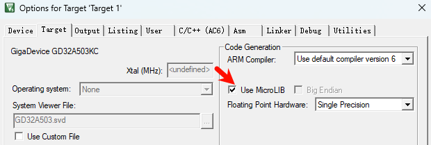

打印测试:

```bash
#include <inttypes.h>

// 字符串, 整数, 浮点数, 十六进制, uint64_t
printf("Hello, GD32A503!\n");
printf("Integer: %d, Hex: 0x%X\n", 12345, 0xABCD);
printf("Float: %.2f\n", 3.14159);
printf("Uint64: %" PRIu64 "\n", (uint64_t)1234567890123456789ULL);
```

如图所示:


## ADC

a503_adc, 12bit ADC, 使用 `ADC0` 的常规通道序列长度设为 1，采样 `ADC_CHANNEL_3`（引脚 PD9）, 累积50次取均值, 该引脚外接了 10K 电位器, 用螺丝刀转动板载10K电位器, 注意与其它器件保持安全距离, 逆时针旋转可增大到接近3.3V, 顺时针减小到 0V


## Temp Vref

ADC 有 1个内部温度传感器通道(VSENSE)   和 1个内部参考电压输入通道(VREFINT)  , 分别对应 ADC_CHANNEL_16 和 ADC_CHANNEL_17.

上电先执行校准 `adc_calibration_enable()`；随后读取工厂校准值：`REG16(0x1FFFF7F8) & 0x0FFF` 保存到 `adc0_temp_calib_value`（手册有说明, 这是 30°C、VDDA=5V 时的温度 ADC 基准点）

温度计算:

- 采用公式：`Temp = (Vtemp - V30)/Slope + 30`
- 其中 `Slope = 4.58 mV/°C`
- V30 是工厂校准值, VDDA 5V 时 30°C 对应的 ADC 转换结果, 要折算到 VDDA 3.3V

下载 a503_temp_vref 后运行如图:

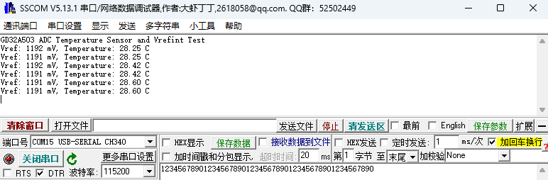

## I2C EEPROM 24C02

I2C0: PC11 SCL, PC10 SDA 上挂载了 EEPROM 24C02

运行 a503_i2c_eeprom, 写入和读取后的对比如图:


## SPI Quad Flash 25Q16

如图:

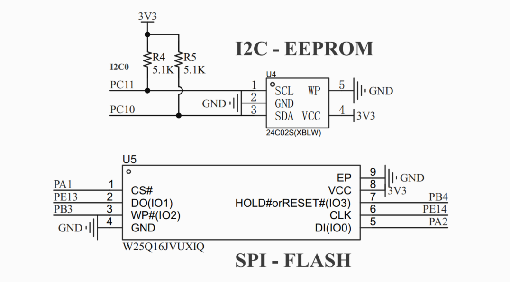

运行 a503_spi_quad_flash, 先读取了ID, 然后测试写入和读取后的对比, 如图:

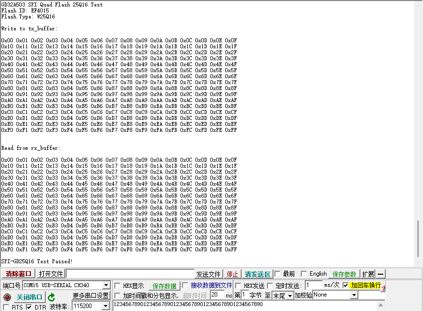

## CANFD 500K+2M

CAN 主时钟 100MHz:

- 仲裁段, 预分频5后是 20MHz, PTS_10 PBS1_21 PBS2_8 得 500K 和 80% 采样点, SJW_8
- 数据段, 预分频5后是 20MHz, PTS_1 PBS1_6 PBS2_2 得 2M 和 80% 采样点, SJW_2, 开启 TDC, tdc_offset 设为8 

500K 80% + 2M 80%, 板载有 120Ω 终端电阻, 连接的 HSCanT 也开启 120Ω 终端电阻:


运行 a503_can 后

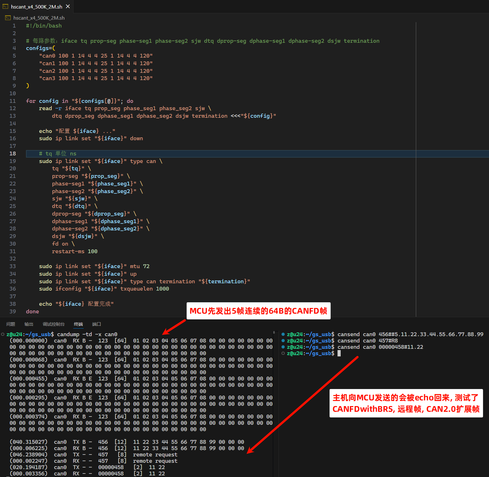

同时串口可以看到接收的数据:

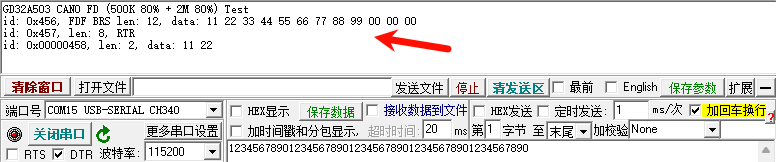

## CANFD 1M+5M

需要注意参数能够设置的范围:

```bash
nominal:
- prescaler: 1~1024
- resync_jump_width: 1~32
- prop_time_segment: 1~64
- time_segment_1: 1~32
- time_segment_2: 1~32

data:
- tdc_offset: 0 ~ 31
- prescaler: 1~1024
- resync_jump_width: 1~8
- prop_time_segment: 0~31
- time_segment_1: 1~8
- time_segment_2: 2~8
```

CAN 主时钟 100MHz:

- 仲裁段, 预分频5后是 20MHz, PTS_1 PBS1_14 PBS2_4 得 500K 和 80% 采样点, SJW_4
- 数据段, 预分频1后是 100MHz, PTS_7 PBS1_7 PBS2_5 得 5M 和 75% 采样点, SJW_5, 开启 TDC, tdc_offset 设为 15 

1000K 80% + 5M 75%, 运行 a503_can_1M_5M 程序后效果与上面类似:


串口接收也有打印, 此处不再贴图.

## LIN Master Slave

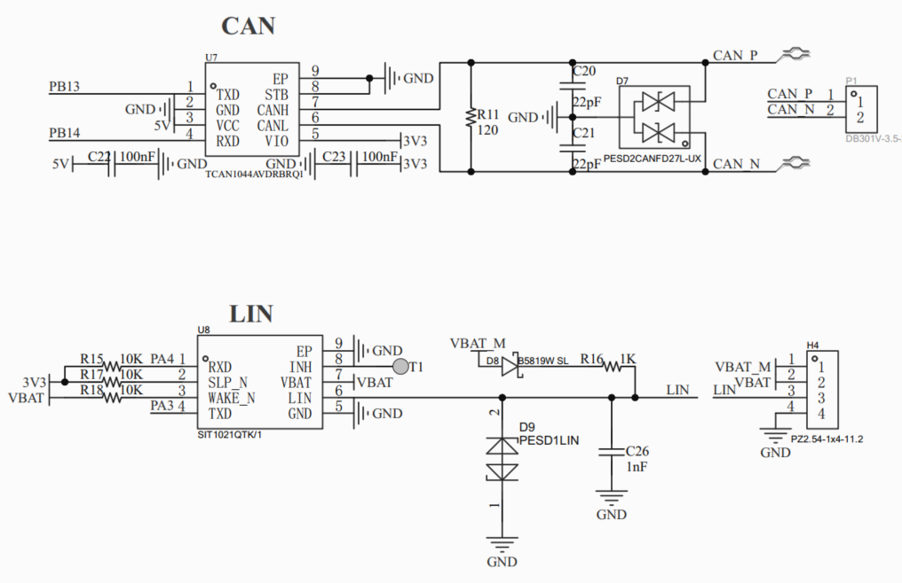

需要两块板子进行测试:

- Master, GND LIN 与 Slave 相连, VBAT 和 M 均接 12V 电源, 同时 12V 电源还要拉根地线和板子 GND 连
- Slave, GND LIN 与 Master 相连, VBAT 接 12V 电源, **M 悬空**, 同时 12V 电源还要拉根地线和板子 GND 连

接线如图:

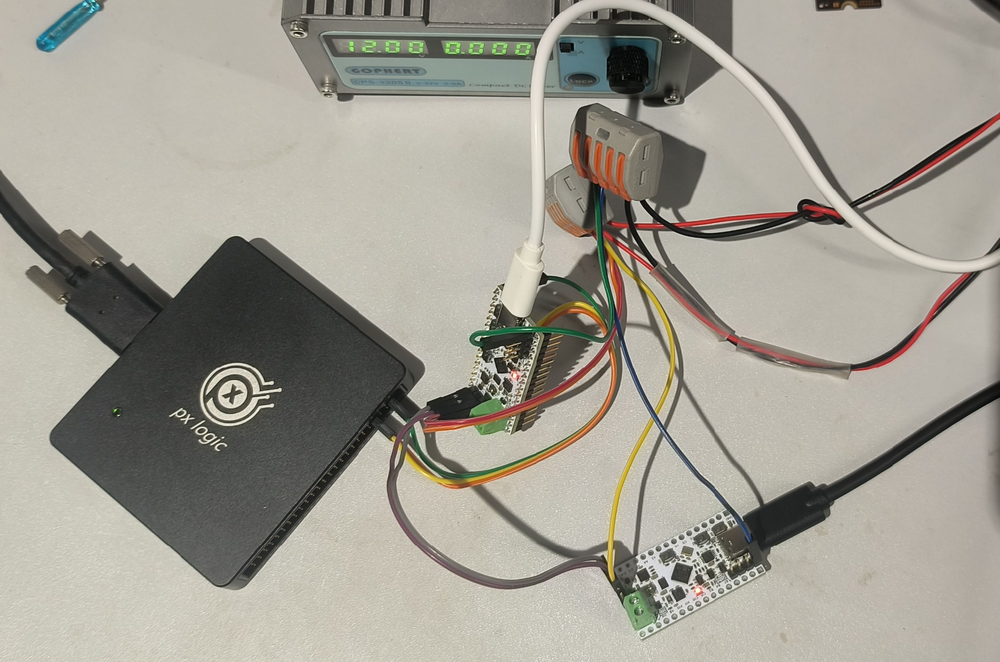

下载 a503_lin_master 和 a503_lin_slave 后, 按住左侧 Master 板子上的 WK 按钮不松手, 可以看到 Slave 板子上的 LED 以 1s 周期翻转.

拿逻辑分析仪接在 Master 的 PA3 PA4, 设置 19200 解码速率, 抓取到的 Master 发出的 LIN 数据:

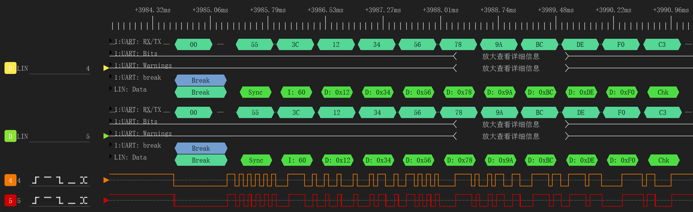

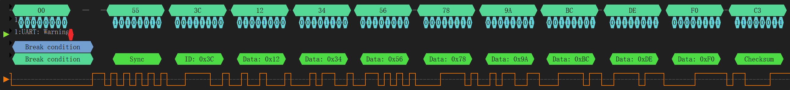

可以看到完整的LIN帧:

Break -> Sync (0x55) -> PID (0x3C) -> Data (8 bytes) -> Checksum

## 交流群

板子购买: 海鲜市场, weifengdq, 主页中可见

QQ交流群 `嵌入式_机器人_自动驾驶_交流群`: 1040239879


