# 10BASE-T1S LAN8651

- [10BASE-T1S LAN8651](#10base-t1s-lan8651)
  - [10BASE-T1S 简介](#10base-t1s-简介)
  - [部分厂商与芯片汇总](#部分厂商与芯片汇总)
  - [LAN8651 简介](#lan8651-简介)
  - [STM32F407 LAN8651](#stm32f407-lan8651)
  - [HPM5361 LAN8651](#hpm5361-lan8651)
  - [多个节点](#多个节点)
  - [LwIP链路参考](#lwip链路参考)
  - [USB-10BASET1S 默认配置](#usb-10baset1s-默认配置)
  - [逻辑分析仪示例](#逻辑分析仪示例)
    - [64B Payload](#64b-payload)
    - [65B Payload](#65b-payload)
  - [10BASE-T1S 零散补充](#10base-t1s-零散补充)
    - [节点定义](#节点定义)
    - [寄存器部分规则与诊断](#寄存器部分规则与诊断)
    - [DPLCA](#dplca)
  - [开源链接](#开源链接)
  - [参考资料](#参考资料)

## 10BASE-T1S 简介

**命名方式**:

- 10, 传输速度 10Mbits/s
- BASE, 基带传输, 信号不经过调制, 直接在介质上传输
- T, Twisted-pair, 双绞线
- 1, 1 Pair, 单对双绞线以太网SPE(Single-Pair Ethernet), 也就是2根线
- S, Short Reach, 短距离, 多点连接总线型, **多个节点互联不需要交换机**, 可以像CAN那样直接连, 终端电阻 100Ω 装在最远端的两个节点上, 点对点至少15m全双工, 或支持8个以上25m半双工, 一般32个也可以. 有 S 就有 L, 都符合 IEEE 802.3cg 标准, 10BASE-T1L 能到 1km, 但是没有 PLCA 这种机制.
- 概括: 一种使用单对双绞线、在短距离总线型拓扑上、以10Mbps基带方式传输的工业与车载以太网标准

**部分优点**:

- PLCA ( PHY-Level Collision Avoidance, 物理层冲突避免) , 10BASE-T1S 核心介质访问机制，通过时分复用时隙分配消除多节点数据冲突，由协调器节点发 Beacon 信号启动传输周期. 半双工, 保证确定性延迟和高效率. 所有从节点（Node1~N）依赖 Node0 的 BEACON 重置传输机会计数器（TO, Transmit Opportunity 计数器）, 如果没有节点0或者BEACON 消息, PLCA轮询机制失效, 自动回退到 CSMA/CD 模式, 所有节点竞争总线，冲突概率上升. PLCA 还能配置 Burst 模式, 比如某个节点1500B占用1.2ms, 另一个高频节点期间积累的几包数据可以一次性发出去, 避免延迟积累.
- 支持 **SPE 供电（PoDL）**, 意味着只需要两根线就能搞定 供电+通信 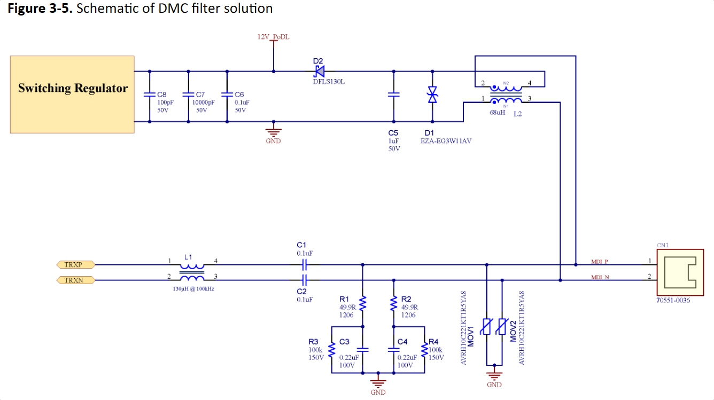 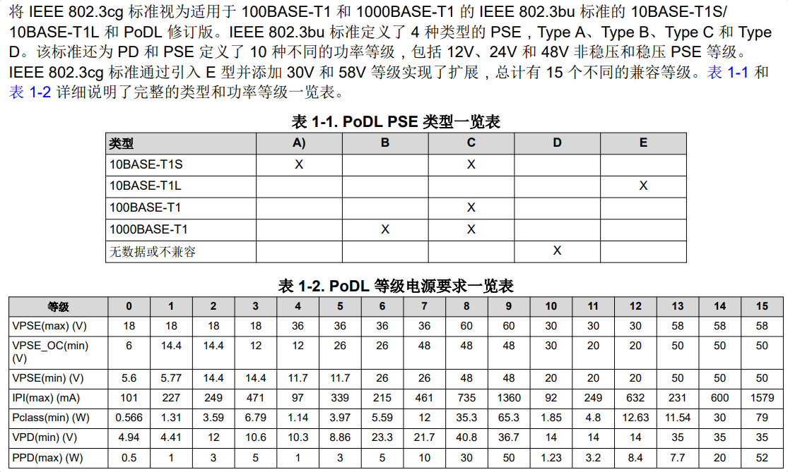
- ...

**接口方案**, 大致可以参考 **MAC-PLCA-PCS-PMA-MDI** 的路径:

- MII/RMII, 一般是 RMII 10Pins(REF_CLK, TXD[1:0], RXD[1:0], TX_EN, RX_ER, CRS_DV, MDIO, MDC), 类似STM32接LAN8720 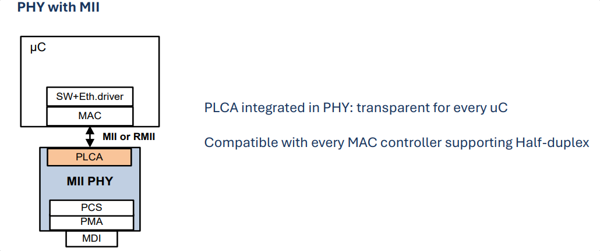
- SPI, MAC-PHY, 开放联盟(Open Alliance) 在 TC6 中给出的 SPI 接口方案, 5Pins(CSn, SCK, MOSI, MISO, IRQn), 类似 MCU 通过 SPI 接口接 MCP251x 扩展 CAN, 本篇的 LAN8651 就是 SPI-10BASET1S 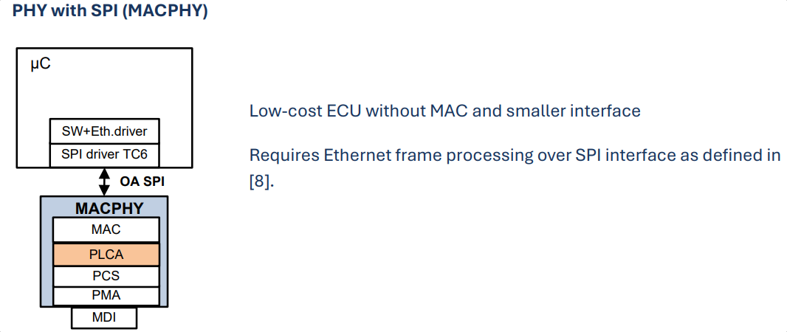
- OA3p, Open Alliance 3‑pin Interface, 收发器PHY, 3Pins(TX, RX, ED), 类似外接CAN收发器, 在 10BASE-T1S 里面称为 PMD 收发器 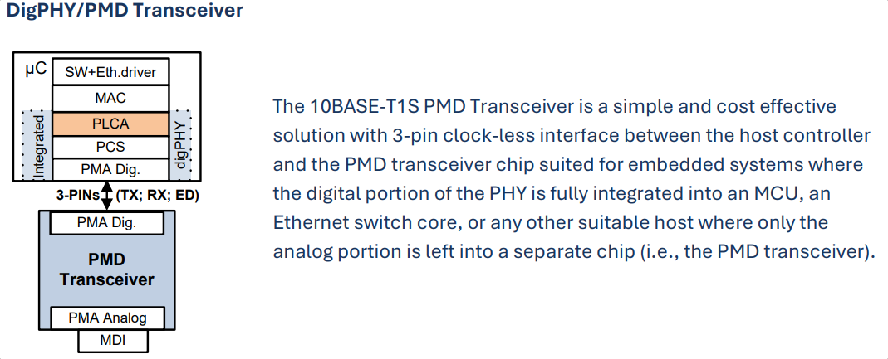
- 集成PHY, 类似于 CH32V317 CH32H417 直接把百兆 PHY 集成进 MCU, 常见于带 10BASE-T1S 的交换机芯片.

PHY 之后一般是共模电感, 隔直电容, 终端电阻, ESD 等:

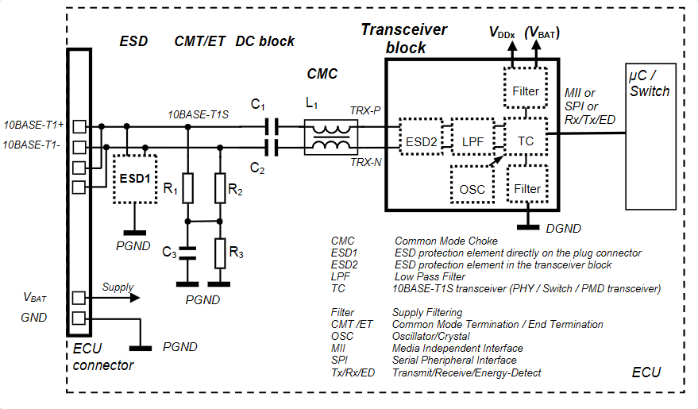

## 部分厂商与芯片汇总

部分收集, 仅供参考:

**SPI, MAC-PHY**:

- Microchip: LAN8650/8651
- onsemi: NCN26010(工业), NCV7410(车载), T30HM1TS2500(车载)
- TI: DP83TD555J‑Q1
- ADI: AD3300, AD3306

**MII/RMII PHY**:

- Microchip: LAN8670/8671/8672
- onsemi: NCN26000

**OA3p, PMD收发器**:

- Microchip: LAN8679/8680
- NXP: TJA1410
- TI: DP83TD530-Q1, DP83TD535‑Q1

**RCP, SPE Endpoints**:

- Microchip: LAN8660(Control), LAN8661(Lighting), LAN8662(Audio)
- ADI: AD3300, AD3301, AD3304, AD3305

**Switch, 带 10BASE-T1S PHY**:

- Infineon Marvell 88Q5152 88Q5192

## LAN8651 简介

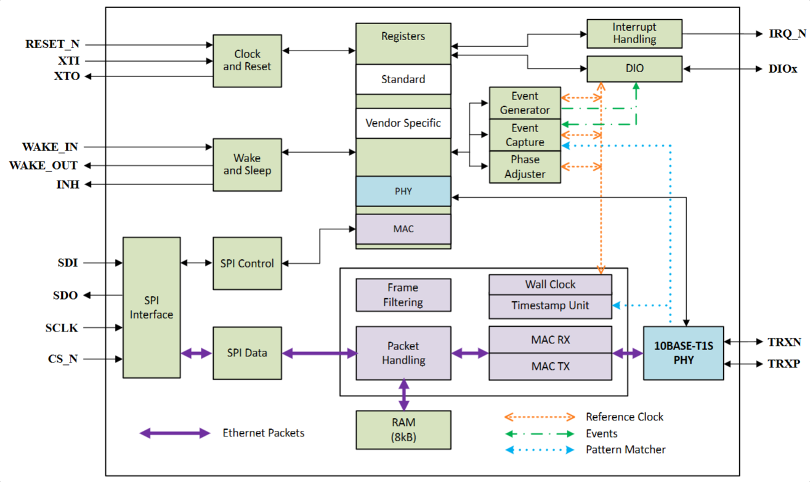

[LAN8651 | Microchip Technology](https://www.microchip.com/en-us/product/lan8651):

- SPI接口, MAC-PHY 以太网控制器, SPI 最大支持 25MHz, 模式0
- 3.3V 单电源供电, 集成 1.8V LDO, 需外接 25MHz 无源晶振
- -40 ~ +125 ℃, AEC-Q100
- 设计遵循 `OPEN Alliance 10BASE‑T1x MAC‑PHY Serial Interface specification, V1.1` 规范

**数据面**, 遵照规范, 发送有4B Header, 接收有4B Footer, payload默认64B:

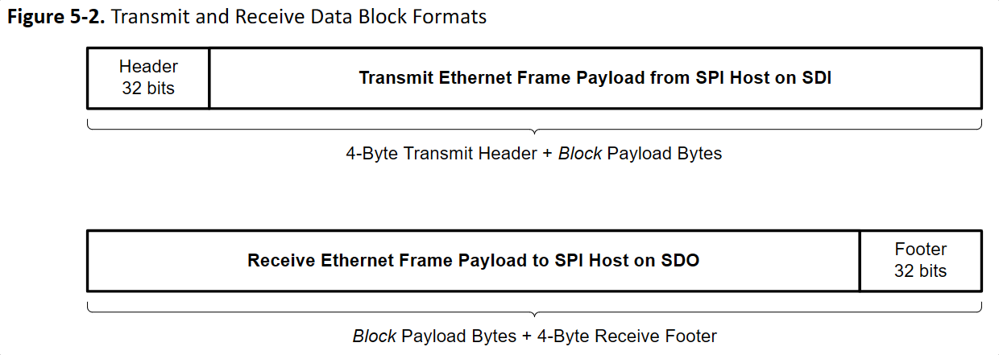

**控制面**, 4B Header + Payload, **控制面**主要是以下工作:

- 复位, 校验设备
- 使能 PLCA 相关时序和节点参数(如节点ID, 节点总数等)
- 配置 MAC 接收行为(如允许多播哈希、接收时去掉 FCS、半双工下接收帧, 打开MAC收发功能)
- 设置 TC6 同步、对齐、块大小, 64B block payload
- 写入 MAC 地址
- 使能 TX RX
- 运行时的状态查看与故障诊断

做了一批LAN8651的小板子, 放在 XY, 同名主页里面:

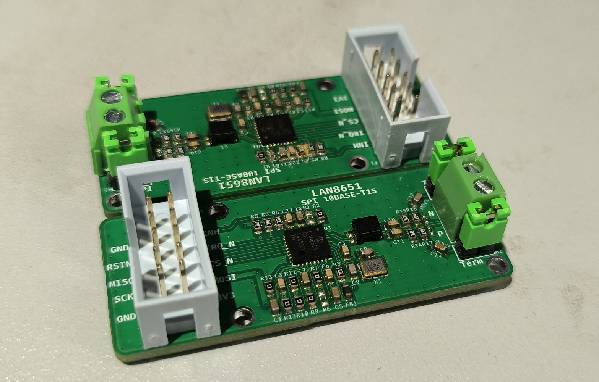

参考原理图:

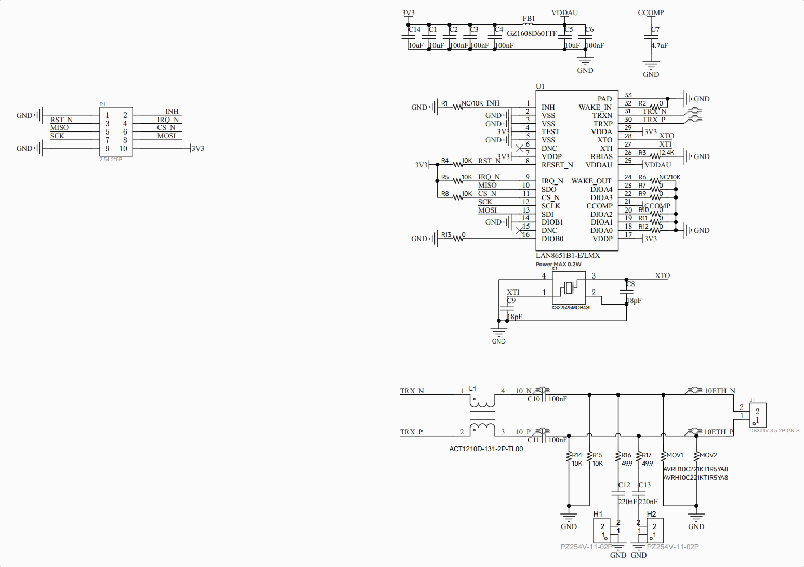

一般需要 8 根线与 MCU 板子相连, 电源(3V3) 2 + SPI 4 + IRQ_N 1 + RST_N 1

下面是 在 STM32F407 和 HPM5631 上使用的示例, 源码放到了 Github 上, 欢迎 Star:

[https://github.com/weifengdq/embedded](https://github.com/weifengdq/embedded)

因为用到了 LwIP, 为了用的舒心一些, 推荐移植到其它MCU时,  Flash 和 SRAM 都在 128KB 及以上.

SPI 的速率一般建议在 15Mbits/s ~ 25Mbits/s, 基本能跑满 10BASE-T1S 的带宽.

## STM32F407 LAN8651

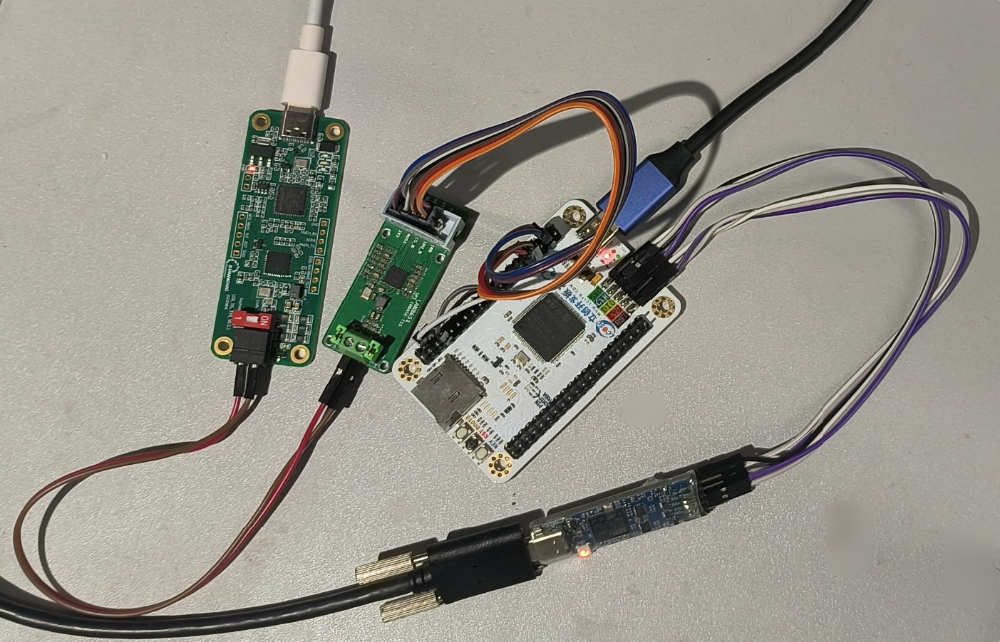

STM32F407 与 Microchip LAN8651 的裸机 10BASE-T1S 以太网示例，网络协议栈使用 lwIP 2.2.1：

- 静态 IPv4 地址通信, 192.168.1.108, 255.255.255.0, 192.168.1.1
- ICMP Ping
- UDP Echo 回显服务, 端口8, 注意不是7.
- TCP iperf server, 端口 5008, 注意不是5001
- 通过 SPI3 + GPIO(复位 中断) 以 OPEN Alliance TC6 协议连接外部 LAN8651 10BASE-T1S MAC-PHY
- PLCA 使能, 节点ID 1, 节点(最大)总数8

硬件连接如下:

| 信号        | STM32F407 引脚 | 方向     | 说明                 |
| ----------- | -------------- | -------- | -------------------- |
| USART1_TX   | PA9            | MCU 输出 | 调试串口发送         |
| USART1_RX   | PA10           | MCU 输入 | 调试串口接收         |
| SPI3_SCK    | PC10           | MCU 输出 | SPI 时钟             |
| SPI3_MISO   | PC11           | MCU 输入 | 从 LAN8651 读取数据  |
| SPI3_MOSI   | PC12           | MCU 输出 | 向 LAN8651 发送数据  |
| LAN_CS_N    | PA15           | MCU 输出 | 软件控制片选，低有效 |
| LAN_IRQ_N   | PD0            | MCU 输入 | LAN8651 中断，低有效 |
| LAN_RESET_N | PD1            | MCU 输出 | LAN8651 复位，低有效 |
| GND         |                |          | LAN8651 GND          |
| 3V3         |                |          | LAN8651 3.3V 供电    |

SPI3 的当前工作方式如下:

| 项目        | 配置                                      |
| ----------- | ----------------------------------------- |
| 模式        | Master                                    |
| 方向        | 2 Lines，全双工                           |
| 数据宽度    | 8 bit                                     |
| CPOL / CPHA | Mode 0, CPOL Low, CPHA 1 Edge             |
| NSS         | Software                                  |
| First Bit   | MSB                                       |
| 运行期分频  | `SPI_BAUDRATEPRESCALER_2`, 对应 21Mbits/s |

工程使用 powershell + cmake 管理, stlink下载, 工具链用的 STM32CubeIDE 自带的 `C:\ST\STM32CubeIDE_2.1.0\STM32CubeIDE\plugins\com.st.stm32cube.ide.mcu.externaltools.gnu-tools-for-stm32.14.3.rel1.win32_1.0.100.202602081740\tools\bin`, 使用以下命令编译和下载运行

```bash
.\build.ps1 rebuild Release
.\build.ps1 flash Release
```

测试 ping, udp echo, 和 iperf 的截图:

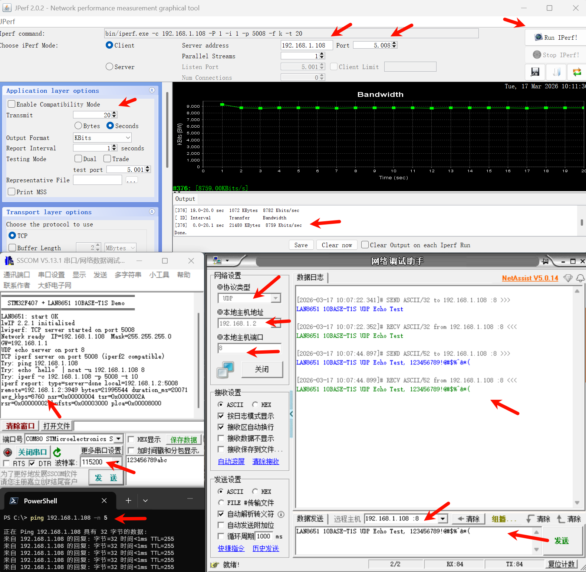

## HPM5361 LAN8651

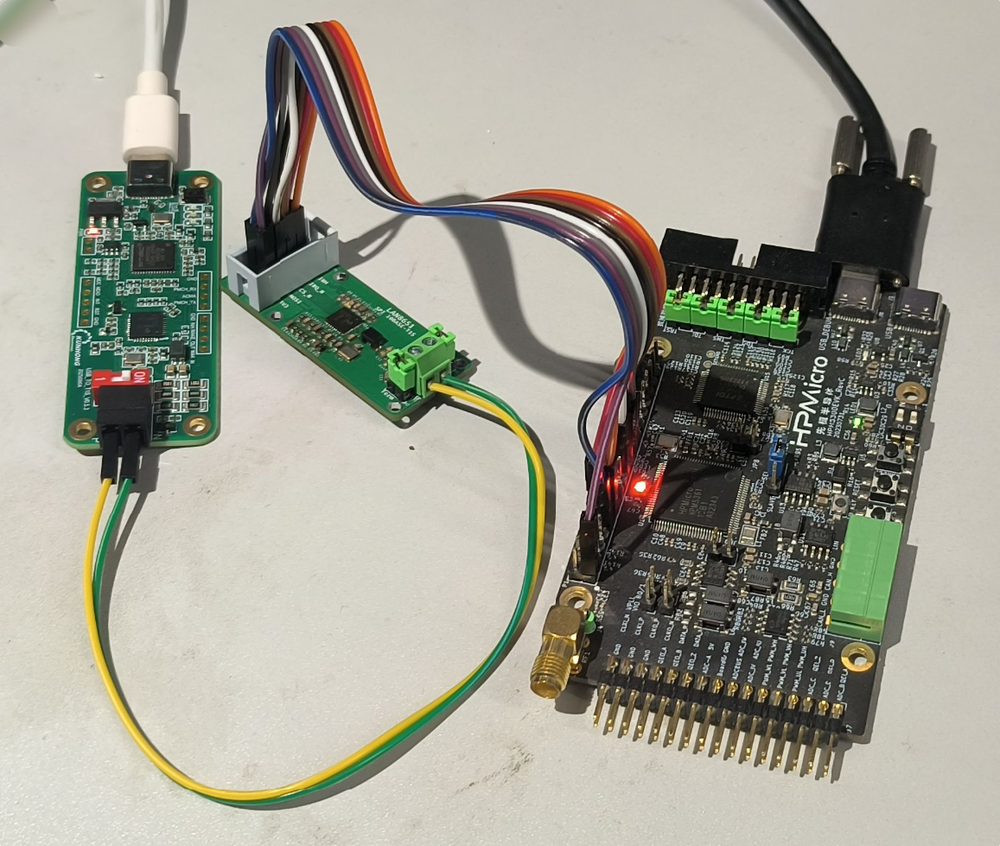

工程基于 HPM SDK 1.11.0，在 hpm5300evk 上使用 HPM5361 的 SPI1 (Block + DMA) 驱动 LAN8651，并接入 SDK 自带 lwIP baremetal port, LAN8651 与 HPM5361 连接如下, 都在HPM5300EVK的树莓派接口上：

- CS_N: PA26, 树莓派接口24 CE0
- SCK: PA27, 树莓派接口23 SCLK
- MISO: PA28, 树莓派接口21 MISO
- MOSI: PA29, 树莓派接口19 MOSI
- IRQ_N: PA12, 树莓派接口11 GPIO0
- RESET_N: PA10, 树莓派接口12 GPIO1

注意电源是3.3V.

IP: 192.168.1.109, UDP Echo 端口 9, iperf  端口 5009.

PLCA 节点 ID 2.

SPI 最大频率 20MHz.

路径是直接放sdk samples里面 `D:\hpm\sdk_env_v1.11.0\hpm_sdk\samples`, 编译 `.\build.ps1 rebuild Release` 下载 `.\build.ps1 flash Release`, 下面是 ping,  udp echo, 和 iperf 测试:

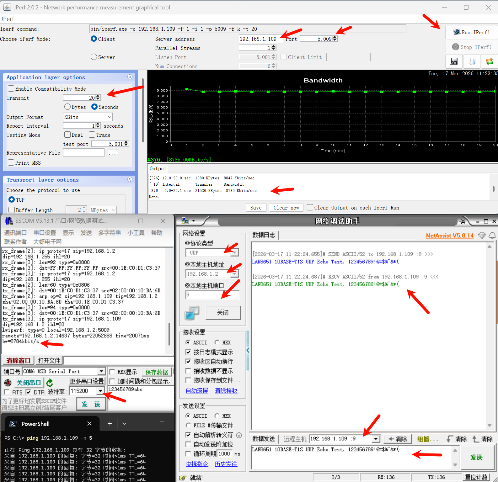

## 多个节点

多个节点相连不需要以太网交换机, 可以像CAN那样直接相连(下图中终端电阻多了一组, 实际需要去掉一组):

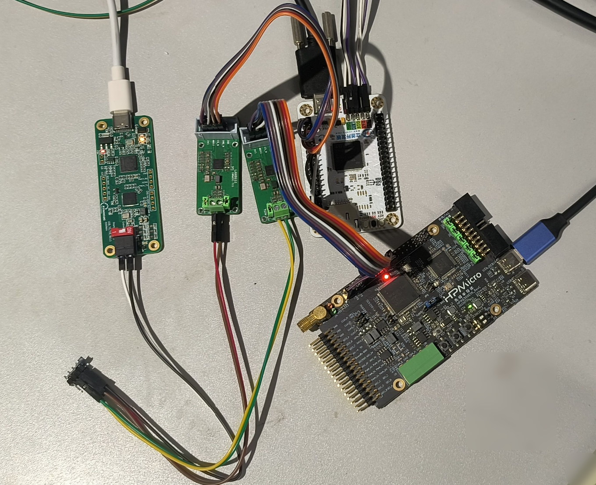

再次贴下参数, 都使能PLCA, 各自设置不同的节点ID:

- USB-10BASET1S: 192.168.1.2, PLCA ID 0, Node Count 8, TO TIMER 8
- STM32F407 + LAN8651: 192.168.1.108, UDP Echo Port 8, PLCA ID 1
- HPM5361 + LAN8651: 192.168.1.109, UDP Echo Port 9, PLCA ID 2

同时 ping: 

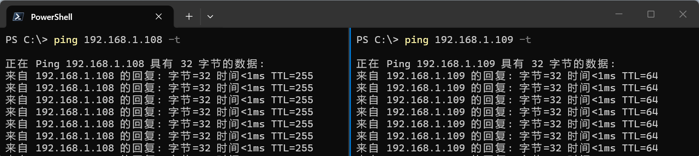

同时 iperf, STM32先开始, 然后 HPM5361 后开始, HPM5361先结束, 然后STM32后结束

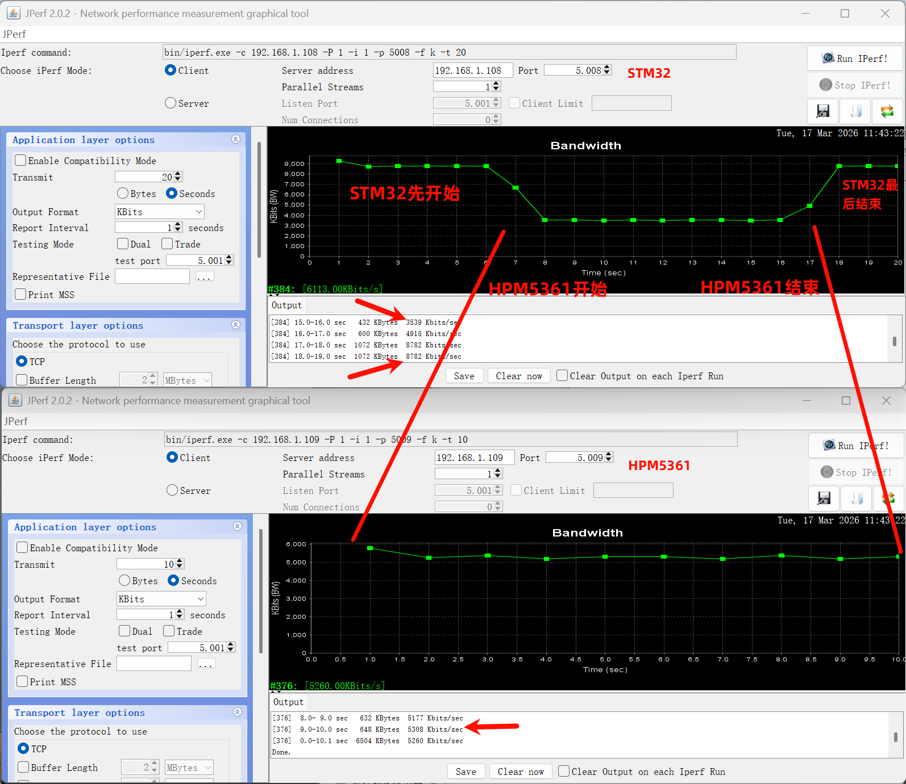

下图是反过来, HPM5361先开始后结束, STM32后开始先结束:

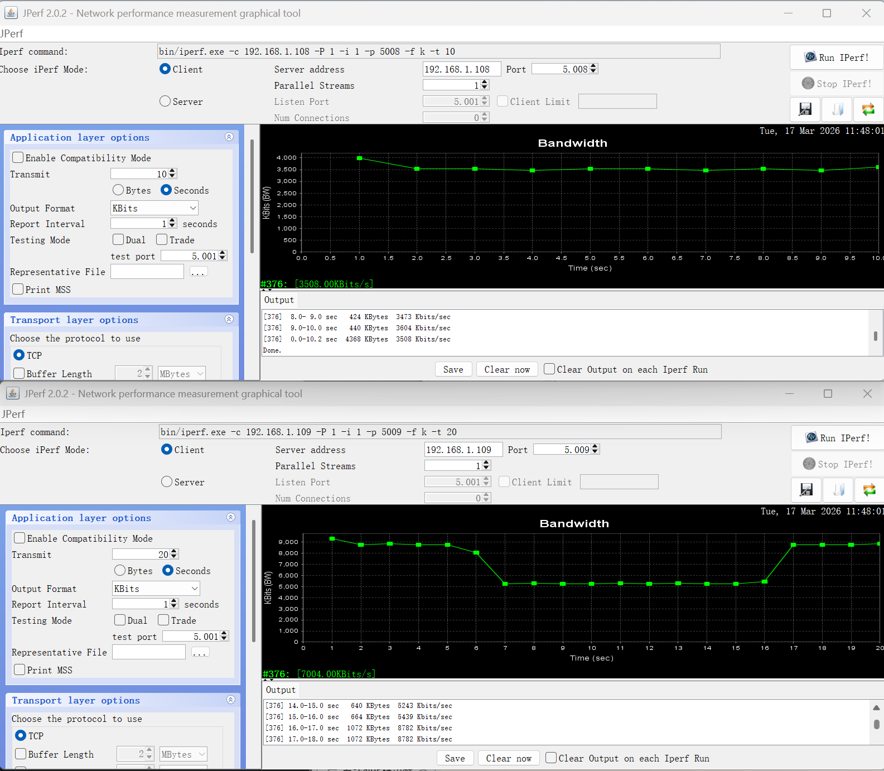

## LwIP链路参考

整体链路如下:

```bash
lwIP upper layer
	↓
netif.linkoutput = low_level_output()
	↓
LAN8651_Transmit()
	↓
SPI3 + OA TC6
	↓
LAN8651 / 10BASE-T1S

10BASE-T1S / LAN8651
	↓
SPI3 + OA TC6
	↓
LAN8651_Receive(), low_level_input()
	↓
ethernetif_input()
	↓
netif->input()
	↓
lwIP ARP/IP/ICMP/UDP
```

## USB-10BASET1S 默认配置

IP: 192.168.1.2

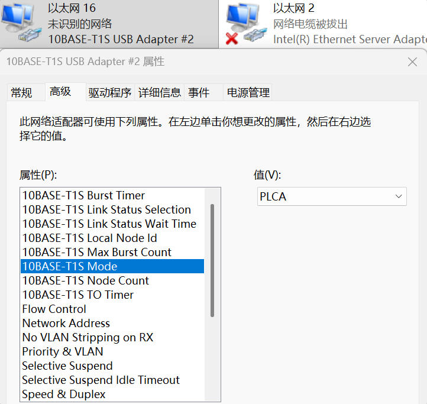

 高级属性里面的默认配置:

```bash
10BASE-T1S Burst Timer: 128
10BASE-T1S Link Status Selection: Link Status reflects PLCA Status
10BASE-T1S Link Status Wait Time: 15ms
10BASE-T1S Local Node Id: 0
10BASE-T1S Max Burst Count: 0
10BASE-T1S Mode: PLCA
10BASE-T1S Node Count: 8
10BASE-T1S TO Timer: 32
Flow Control: Rx & Tx Enabled
Network Address: 不存在
No VLAN Stripping on RX: Disabled
Priority & VLAN: Priority & VLAN Enabled
Selective Suspend: Disabled
Selective Suspend Idle Timeout: 10
Speed & Duplex: 10 Mbps Half Duplex
UnTagged Frames Without VLAN: Enabled
USB Bandwidth Usage Mode: Maximum Throughput
User Configurable Link Status: Link Up
VLAN ID1 Rx: 0
VLAN ID1 Tx: 0
VLAN ID2 Rx: 0
VLAN ID3 Rx: 0
Wake on magic packet: Disabled
Wake on pattern match: Disabled
```

 默认节点数量8, PLCA模式, Node ID 0 当作 PLCA 协调器.

## 逻辑分析仪示例

主要看下数据面

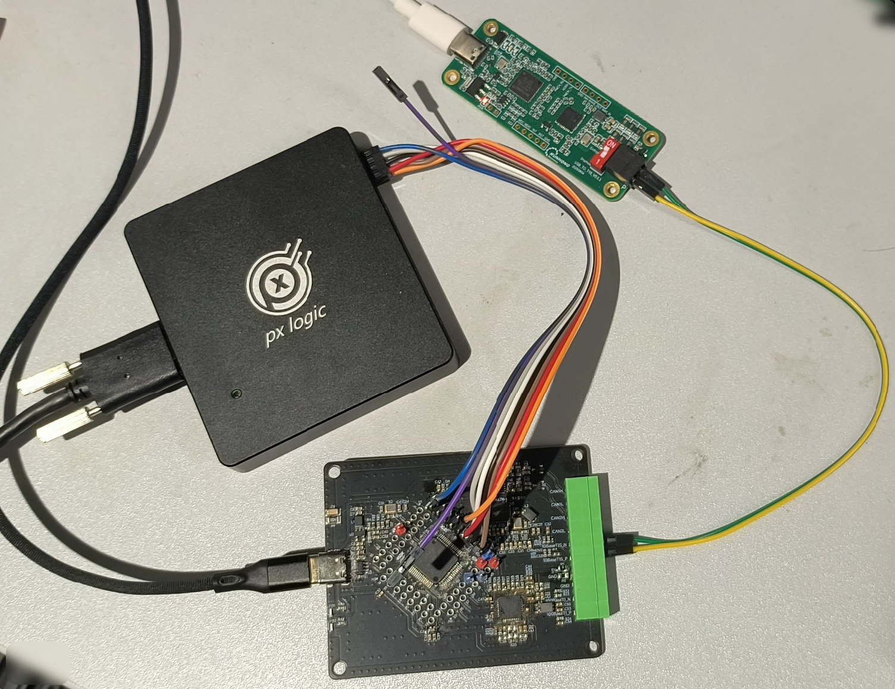

### 64B Payload

UDP 包echo 测试(Payload部分) `1234567890123456789012` 共22B数据, Wireshark 中可以看到对应包长 64B.

从USB-10BASET1S -> LAN8651 -> MCU(192.168.1.2 -> 192.168.1.x) 的数据会出现在 MISO 上, 遵循 MAC-PHY SPI 数据格式, 是 `Receive Ethernet Frame + 4-Byte Receive Footer `:

- SPI 包总长度 68B = 64B Eth Frame + 4B Footer
- Footer 0x20307F3E(SPI配置的 MSB First)
  - 0010 0000 0011 0000 0111 1111 0011 1110
  - SYNC: 1, 配置同步
  - DV, Data Valid: 1, 数据有效
  - SV, Start Valid: 1, 有效开始
  - SWO, Start Word Offset: 0, 开始位置在0字节, 也就是第1字节
  - EV, End Valid, 1, 有效结束, 表示以太网帧的结束包含在数据块有效载荷中, 如果 DV 为0, 忽略 EV
  - EBO, End Byte Offset, 63, 结束字节偏移63, 也就是第64字节
  - TXC, Trasmit Credits, 63, 发送信用, 指示不会导致缓冲区溢出的SPI能发送到LAN8651的数据块数

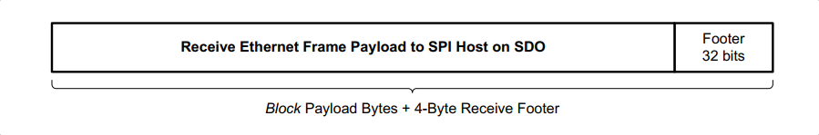

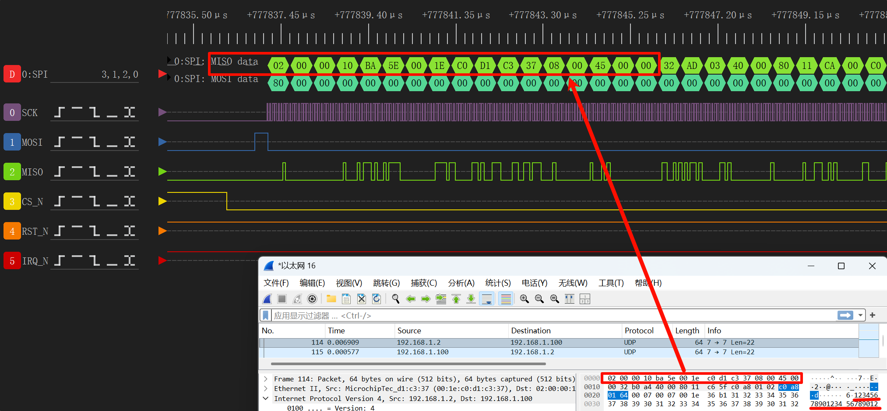

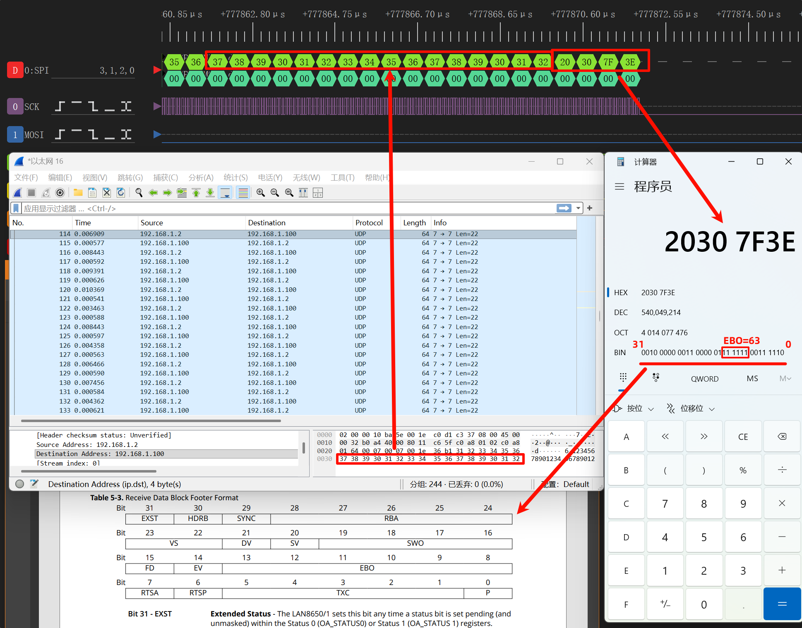


MCU echo 的数据会出现在 MOSI 上, 是 `4-Byte Transmit Header + Block Payload Bytes`, 参数数据手册, 此处不再赘述:


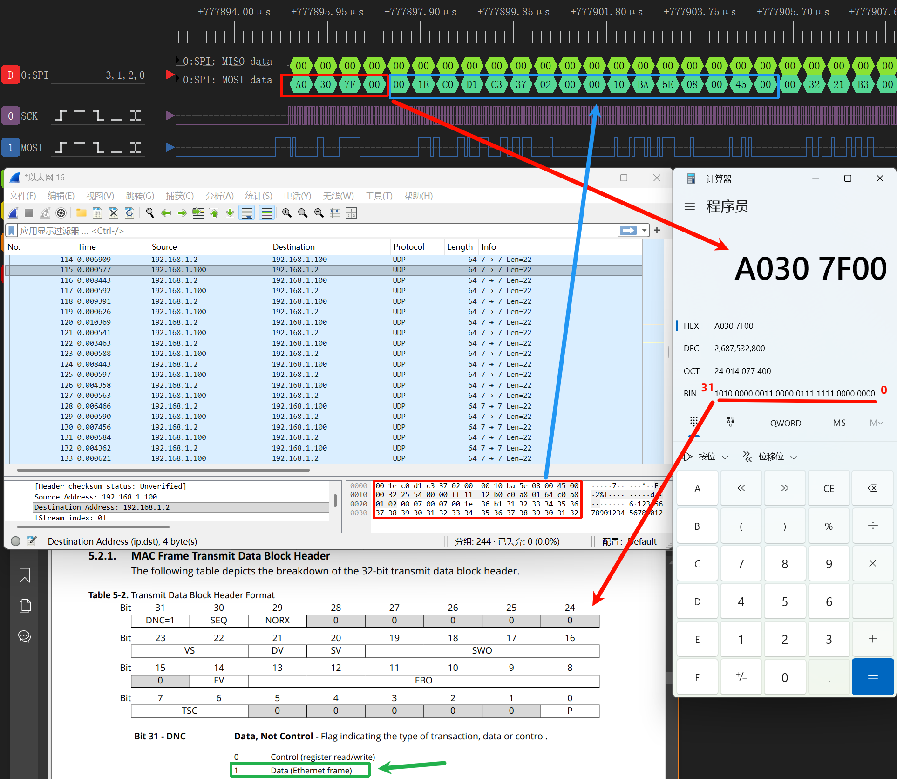

### 65B Payload

UDP 包echo 测试(Payload部分) `12345678901234567890123` 共23B数据, Wireshark 中可以看到对应包长 65B, SPI 包 Payload 最大64B, 需要拆成2包:

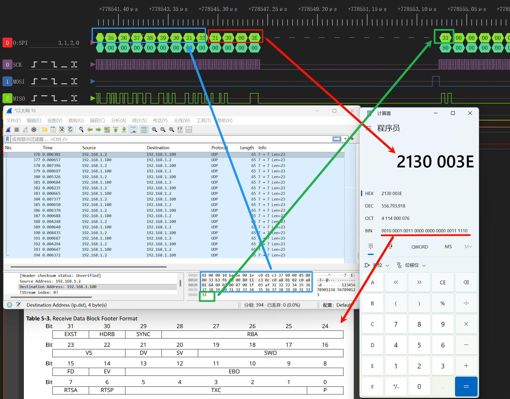

第一包 footer 0x2130003E:

- 0010 0001 0011 0000 0000 0000 0011 1110
- RBA, Receive Blocks Available, 从单包的0变成了1, 还有1个包待接收?
- DV 1, SV 1, SWO 0
- EV 0, 以太网帧结束不在此SPI数据块Payload里, 后面还有. EBO 0

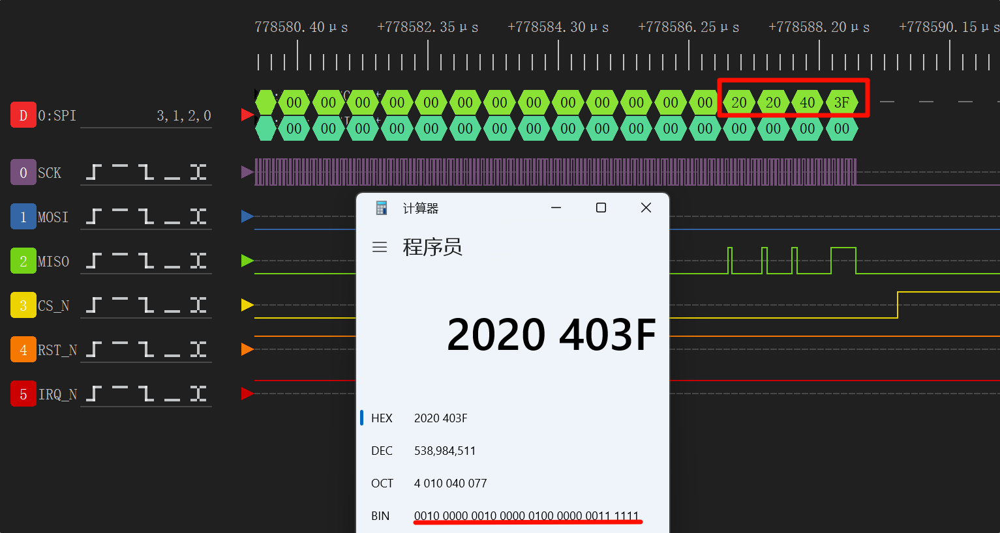

第二包 footer 0x2020403F:

- 0010 0000 0010 0000 0100 0000 0011 1111
- RBA 0, 后面没有包了
- DV 1, SV 0 以太网帧开始不再这里, SWO 0
- EV 1, EBO 0, 以太网帧结束在SPI Payload里, 结束在0字节
- P 1, 这个是校验位 Parity odd


MCU Echo 回来的也是2个SPI包:

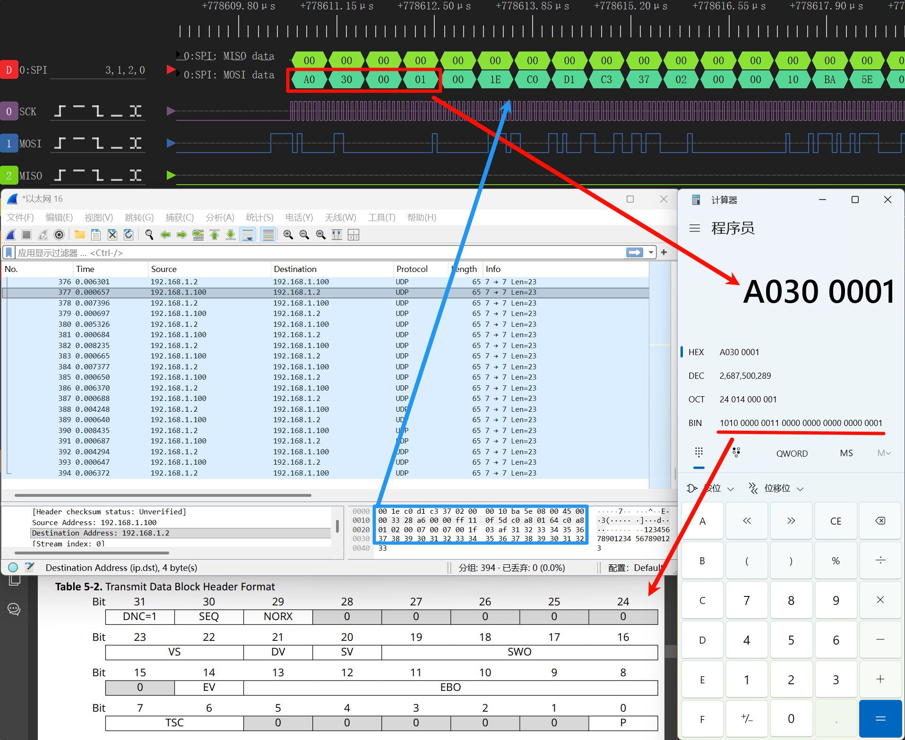

第一包 header 0xA0300001:

- DV 1, SV 1, SWO 0, 以太网帧开始在此SPI包里
- EV 0, EBO 0, 以太网帧结束不再此SPI包里

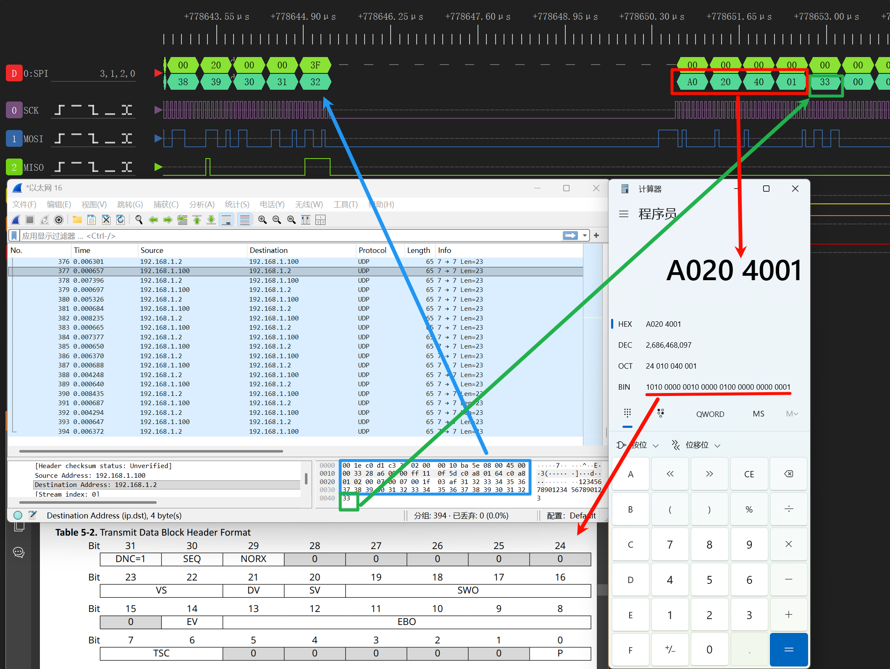

第二包 header 0xA0204001:

- DV 1, SV 0, 以太网帧开始不在此SPI包里
- EV 1, EBO 0, 以太网帧结束在此SPI包Payload的0字节

## 10BASE-T1S 零散补充

### 节点定义

| 节点类型              | 定义与功能                                                   |
| --------------------- | ------------------------------------------------------------ |
| 协调器（Coordinator） | ID=0 的节点，负责周期性发送 BEACON 信标、配置传输机会数，是 PLCA 组网核心 |
| 跟随器（Follower）    | ID=1~254 的节点，接收信标同步传输机会计数器，需保证 ID 全网唯一 |
| 端节点（End Node）    | 网段两端的节点，可集成 100Ω 终端电阻，无其他节点串联         |
| 主节点（Head Node）   | 网段最高级应用节点，通常为交换机 / 网关，对接核心网络        |
| Drop Node             | 位于两个端节点之间的节点                                     |

注: 

- ID 此处指 aPLCALocalNodeID (PLCA ID)
- **组网要求**：每网段建议包含 1 个协调器 + 1 个主节点 + 2 个端节点，协调器和主节点功能可合并至同一物理节点。

### 寄存器部分规则与诊断

- 所有节点**TOT 值必须一致**，否则无法实现无冲突传输；(TOT, Transmit Opportunity Timer 传输机会计时器)
- 突发模式仅当 MAXBC 非 0 时生效，BTMR 需适配本地 MAC 时延
- DIAG:
  - RXINTO, RX in own TO, 当本地节点在其分配的传输机会期间接收到数据包时，此位会被置位, 表明混合段上存在至少另一个具有相同节点ID的节点. 跟随器**ID 必须全网唯一**，否则触发 **RXINTO** 诊断位
  - UNEXPB, Unexpedted BEACON, 意外信标诊断位, 表明混合端上至少存在另一个协调器
  - BCNBFTO, BEACON before TO, 当本地节点获得传输机会之前检测到信标时，从节点上的该位会被置位，表明协调器节点的CTRL1寄存器中NCNT字段的配置可能存在错误. 协调器**NCNT 需大于等于实际组网节点数**，否则触发 **BCNBFTO** 诊断位.

### DPLCA

Dynamic Physical Layer Collision Avoidance, 动态物理层碰撞避免, 可选的, 并非所有芯片都支持.

这是可选的 PLCA 节点 ID 分配方法。这应该允许所有节点 ID（包括节点 0）动态分配，并在操作过程中进行更改。协调节点还应该能够根据检测到的活动节点数量来改变节点数。dPLCA 与 802.3cg 中定义的正常 PLCA 兼容，因此 dPLCA 打开的节点可以在不影响正常 PLCA 节点操作的情况下加入网络。

## 开源链接

原理图和代码放在了 Github 上, 再次贴出链接:

[https://github.com/weifengdq/embedded](https://github.com/weifengdq/embedded)

Q群(`嵌入式_机器人_自动驾驶交流群`) 1040239879

## 参考资料

- [Automotive Ethernet Specifications - Open Alliance](https://opensig.org/Automotive-Ethernet-Specifications/)
- [OPEN Alliance 10BASE-T1x MAC-PHY Serial Interface](https://opensig.org/wp-content/uploads/2023/12/OPEN_Alliance_10BASET1x_MAC-PHY_Serial_Interface_V1.1.pdf)
- [OA_10BASE-T1S_PLCA-Conformance-Test-Suite_v1.3.pdf](https://opensig.org/wp-content/uploads/2024/01/OA_10BASE-T1S_PLCA-Conformance-Test-Suite_v1.3.pdf)
- [2024-12-10BASE-T1S-PLCA-Management-Registers-v1.4.pdf](https://opensig.org/wp-content/uploads/2025/03/2024-12-10BASE-T1S-PLCA-Management-Registers-v1.4.pdf)
- [IEEE 10BASE-T1S Implementation Specification](https://opensig.org/wp-content/uploads/2023/12/20230215_10BASE-T1S_system_implementation_V1_0.pdf)
- [LAN8651 | Microchip Technology](https://www.microchip.com/en-us/product/lan8651)
- [AN1848 Using Power over Data Line functionality in 10BASE-T1S System](https://onlinedocs.microchip.com/oxy/GUID-EE625E6A-B59C-4CC5-A378-0E964C859B33-en-US-7/index.html)
- [IEEE 802.3cg 10BASE-T1L 数据线供电器件设计方案 (Rev. A)](https://www.ti.com.cn/cn/lit/an/zhcabq2a/zhcabq2a.pdf?ts=1684674567936&ref_url=https%3A%2F%2Fwww.ti.com.cn%2Fproduct%2Fcn%2FTLV3012)
- [How to Implement an IEEE 802.3cg or 802.3bu-Compliant PoDL PSE](https://www.ti.com/lit/ab/snla395/snla395.pdf?ts=1773651640486)
