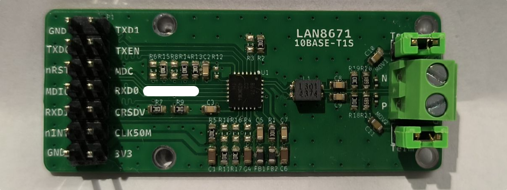
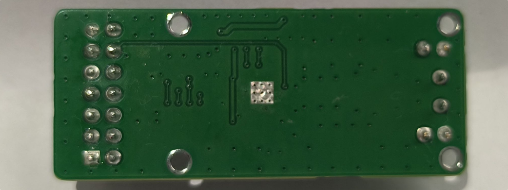
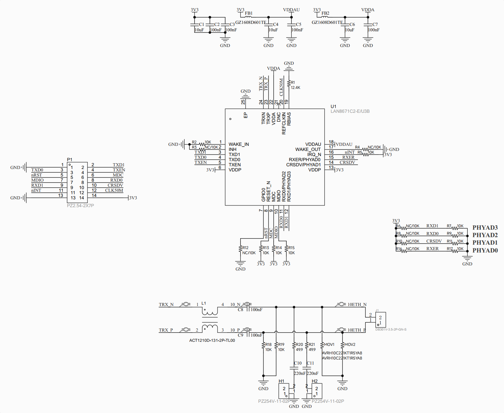
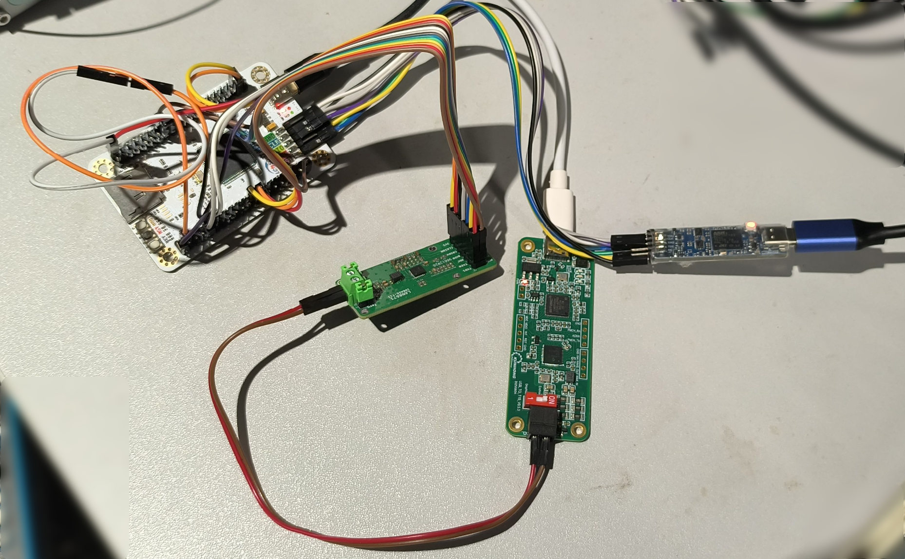
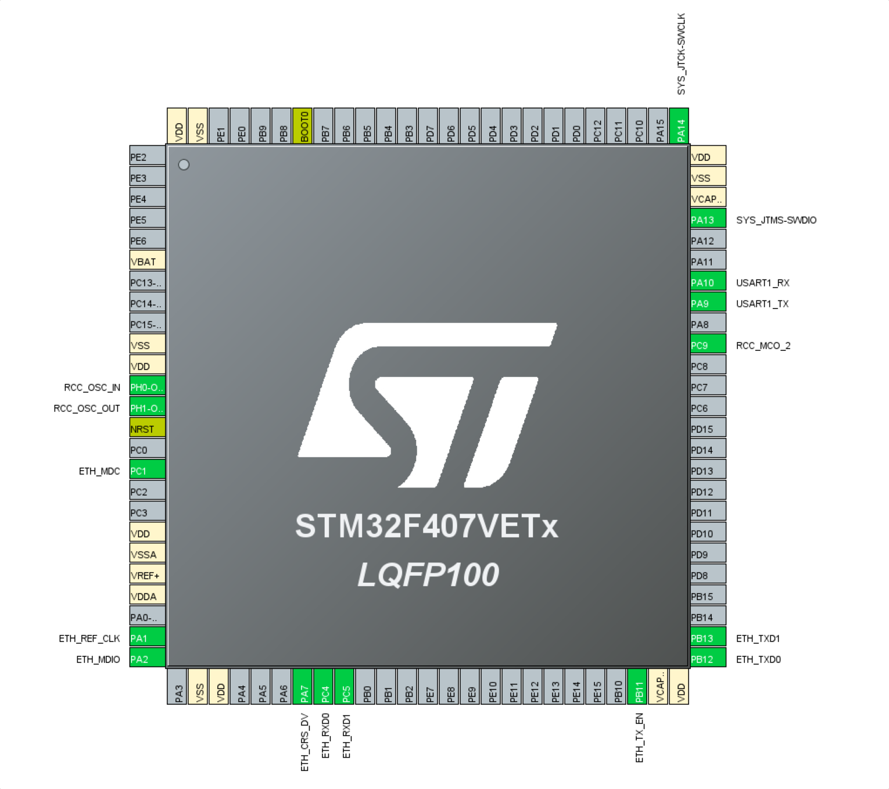
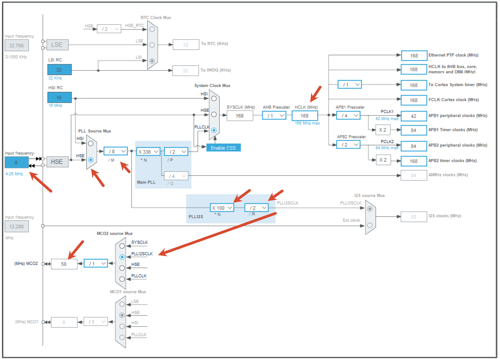
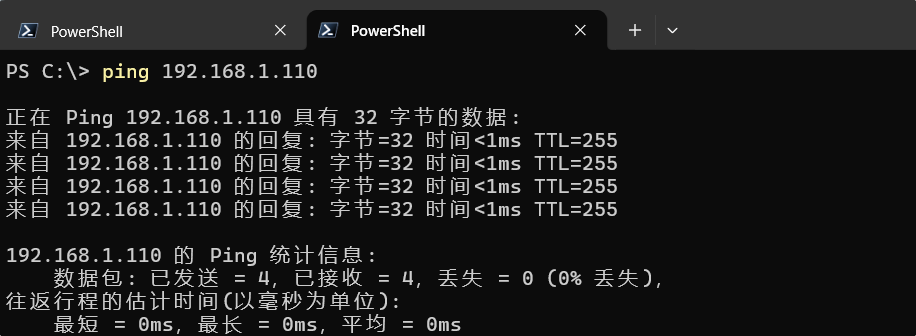
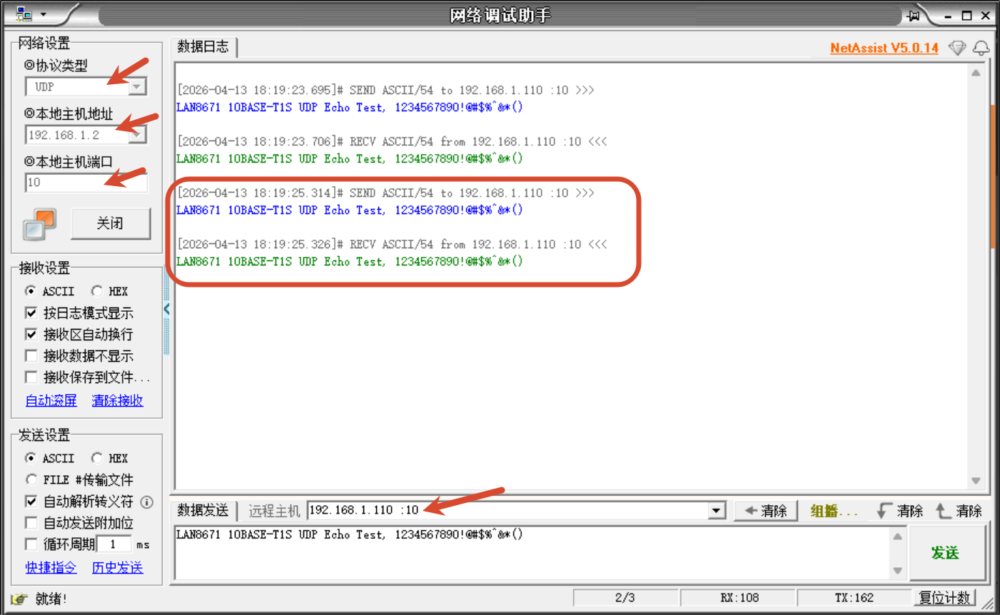
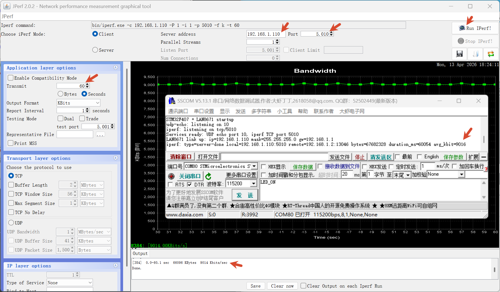
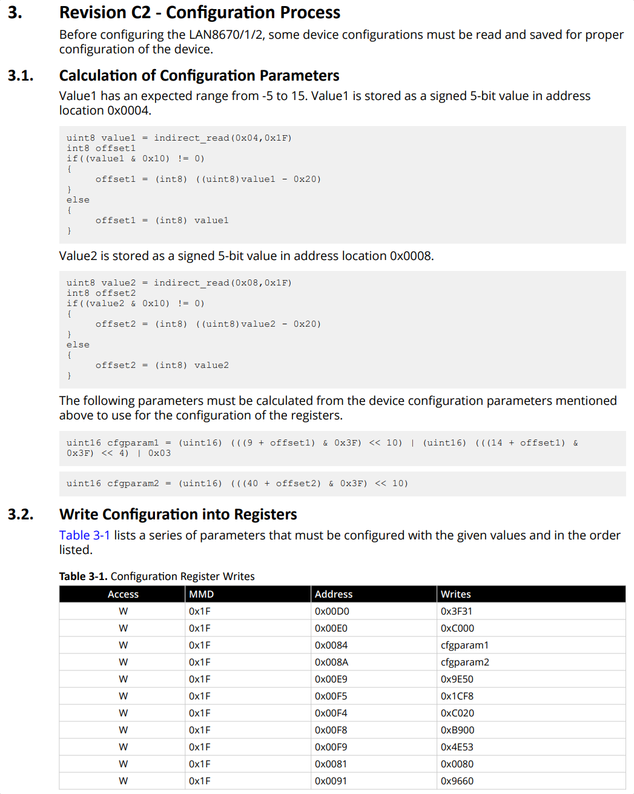

# 10BASE-T1S LAN8671

- [10BASE-T1S LAN8671](#10base-t1s-lan8671)
  - [LAN8671 简介](#lan8671-简介)
  - [LAN8671 原理图](#lan8671-原理图)
  - [与 STM32F407 的接线](#与-stm32f407-的接线)
  - [Github 工程的使用](#github-工程的使用)
  - [测试](#测试)
    - [PING](#ping)
    - [MAC 地址](#mac-地址)
    - [UDP Echo](#udp-echo)
    - [IPERF](#iperf)
  - [部分代码说明](#部分代码说明)
  - [Github 链接](#github-链接)
  - [购买与交流群](#购买与交流群)


## LAN8671 简介





前篇介绍了SPI接口的 [10BASE-T1S LAN8651](https://github.com/weifengdq/embedded/tree/main/lan8651), 本篇是 RMII 接口的 [LAN8671](https://www.microchip.com/en-us/product/LAN8671):

- 测试的是 LAN8671C2-E/U3B
- 24-pin VQFN, -40ºC to +125ºC, 单 **3.3V** 供电，内置 1.8V 稳压器
- RMII 接口, 需要 50MHz 外部参考时钟, 可以用有源晶振或者 MCU 的 MCO 引脚提供, 本篇用的是 **STM32F407 的 MCO2(PC9) 输出 50MHz 同时供给 PHY 和 ETH_REF_CLK(PA1)**
- 管理接口 SMI (MDIO/MDC)：最高 4 MHz，兼容 IEEE 802.3 Clause 22/45 寄存器访问
- 电源域:
  - VDDA：模拟电源(睡眠可关断)
  - VDDP：IO 电源(睡眠可关断)
  - VDDAU：持续供电(睡眠期维持唤醒电路)
- 复位:
  - 上电复位 (POR)：约 2 ms，自动加载配置 strap
  - 外部复位：RESET_N 引脚拉低≥5 μs
  - 软件复位：寄存器触发，**不重载配置 strap**
- 初始化流程: 复位解除 → 内部初始化（≈7 μs）→ IRQ_N 提示就绪 → SMI 寄存器配置
- PHYAD[3:0] 可配置16个地址

## LAN8671 原理图

上面绿色小板子的参考原理图:

- 供电是单 3.3V 供电
- PHY 地址直接设成 0
- 不使用的引脚:
  - INH, 悬空
  - WAKE_IN, 接地
  - WAKE_OUT, 悬空
  - GPIO0, 悬空



## 与 STM32F407 的接线



除了 3V3 GND 电源引脚, 连接了以下信号:

| 信号                   | STM32F407 引脚 | 方向     | 说明                     |
| ---------------------- | -------------- | -------- | ------------------------ |
| ETH_REF_CLK (CLK50M)   | PA1, PC9       | MCU 输入 | RMII 50 MHz 参考时钟输入 |
| ETH_MDC                | PC1            | MCU 输出 | PHY 管理时钟             |
| ETH_MDIO               | PA2            | 双向     | PHY 管理数据             |
| ETH_CRS_DV             | PA7            | MCU 输入 | RMII 载波检测/接收有效   |
| ETH_RXD0               | PC4            | MCU 输入 | RMII RXD0                |
| ETH_RXD1               | PC5            | MCU 输入 | RMII RXD1                |
| ETH_TX_EN              | PB11           | MCU 输出 | RMII 发送使能            |
| ETH_TXD0               | PB12           | MCU 输出 | RMII TXD0                |
| ETH_TXD1               | PB13           | MCU 输出 | RMII TXD1                |
| LAN8671_IRQ_N (nINT)   | PC2            | MCU 输入 | PHY 中断输入，低有效     |
| LAN8671_RESET_N (nRST) | PC3            | MCU 输出 | PHY 复位输出，低有效     |

注:

-  **STM32F407 的 MCO2(PC9) 输出 50MHz 同时供给 PHY 和 ETH_REF_CLK(PA1)**, 本篇直连仅供测试, 实际是否加缓冲或电阻或改用50MHz有源晶振 硬件可自行评估. 示波器应能看到 50MHz 的时钟.
- SWD 调试口: PA13, DIO; PA14 CLK; 连接 ST-Link V3
- 调试串口 USART1: PA9 TX; PA10 RX; 115200-8-N-1

看图应该直观一些:



立创天空星的板子上贴的是 8M 晶振, 实际使用的时钟树可参考下图:



LAN8671 的 10BASE-T1S 连接 USB-10BASE-T1S:

- PC, 192.168.1.2, PLCA, Node ID 0 作为Coordinator, 负责周期性发送 BEACON 信标等, Node Count 8
- MCU, 192.168.1.110, PLCA, Node ID 3, Link up 后是 10M half-duplex
- TOTMR = 0x20, Burst Max Count = 0, Burst Timer = 0x80
- 都连接 100Ω 终端电阻

## Github 工程的使用

[stm32f407_lan8671](https://github.com/weifengdq/embedded/tree/main/lan8671/stm32f407_lan8671) 默认的环境:

- STM32CubeMX 6.17.0
- STM32CubeF4 Firmware Package V1.28.3
- LwIP 2.1.2, NO_SYS
- CMAKE 管理工程
- 编译: `.\build.sh build`, 可以带 `Debug` 或 `Release` (测速时 Debug 更稳, Releas版本会偶发整秒塌陷, 尽管已做特殊处理, 全局 Release 仍然是 -Os -g0，但 `stm32f4xx_hal_eth.c 和 LWIP/Target/ethernetif.c` 都作为独立对象目标在 Release 下按 O0 编译), 工具链 `C:\ST\STM32CubeIDE_2.1.0\STM32CubeIDE\plugins\com.st.stm32cube.ide.mcu.externaltools.gnu-tools-for-stm32.14.3.rel1.win32_1.0.100.202602081740`
- 下载 `.\build.sh flash` , 使用 ST-Link V3, 默认用以下目录里的命令行工具  `C:\Program Files\STMicroelectronics\STM32Cube\STM32CubeProgrammer` 


## 测试

### PING



### MAC 地址

```bash
> Get-NetNeighbor -AddressFamily IPv4 | Where-Object { $_.IPAddress -eq '192.168.1.110' } | Select-Object IPAddress, LinkLayerAddress

IPAddress     LinkLayerAddress
---------     ----------------
192.168.1.110 02-00-00-00-67-11
```

### UDP Echo



### IPERF

```bash
iperf.exe -c 192.168.1.110 -i 1 -p 5010 -t 10
```

或者用 jperf



## 部分代码说明

LAN8671 的代码放在了:

- `stm32f407_lan8671\LWIP\Target\eth_custom_phy_interface.h`
- `stm32f407_lan8671\LWIP\Target\eth_custom_phy_interface.c`

主要对接的是 PHY 的 初始化, 软件复位, 获取或设置连接状态 等. 通过 Clause 22 访问 PHY 基本寄存器, 通过 MMD 访问 Clause 45 风格的扩展寄存器. 参考数据手册 `4.3.1. Clause 45 Register Access`


PHY 的地址探测:

- 扫描 0~31 的 PHY 地址
- 寄存器 PHYID1 (0x0002) 等于 0x0007, 对应数据手册 `5.1.4. PHY Identifier 1 Register`
- 寄存器 PHYID2 (0x0003) 等于 0xC16x, 实际读出来是 0xC165, 是 `Silicon revision 5 (Rev C2 default)`, 对应数据手册 `5.1.5. PHY Identifier 2 Register`


PLCA 的一些寄存器的设置:

| MMD Device | 寄存器              | 当前值 | 作用                          |
| ---------- | ------------------- | ------ | ----------------------------- |
| 31         | PLCA_TOTMR (0xCA04) | 0x0020 | PLCA TOT 定时                 |
| 31         | PLCA_BURST (0xCA05) | 0x0080 | Burst timer=0x80, max count=0 |
| 31         | PLCA_CTRL1 (0xCA02) | 0x0803 | NodeCount=8, NodeID=3         |
| 31         | PLCA_CTRL0 (0xCA01) | 0x8000 | 使能 PLCA                     |

部分状态寄存器:

| 寄存器                  | 用途                   |
| ----------------------- | ---------------------- |
| BSR (0x0001)            | 读两次确认基本链路状态 |
| PLCA_STS (MMD31:0xCA03) | 读取 PLCA 状态         |


[AN1699: LAN8670/1/2 Configuration Application Note](https://ww1.microchip.com/downloads/aemDocuments/documents/AIS/ApplicationNotes/ApplicationNotes/LAN8670-1-2-Configuration-Appnote-60001699.pdf) 中对 D0 和 C2 版本有一些配置说明, 本篇的C2版本未按照这个文档设置, 此处截图作为记录参考:



## Github 链接

Github 开源链接 https://github.com/weifengdq/embedded/tree/main/lan8671

## 购买与交流群

【闲鱼】https://m.tb.cn/h.RqFbHaC?tk=6i9CgSvdMJJ CZ028 「我在闲鱼发布了【LAN8671 10BASE-T1S 评估板:】」
点击链接直接打开

QQ 交流群: 1040239879


