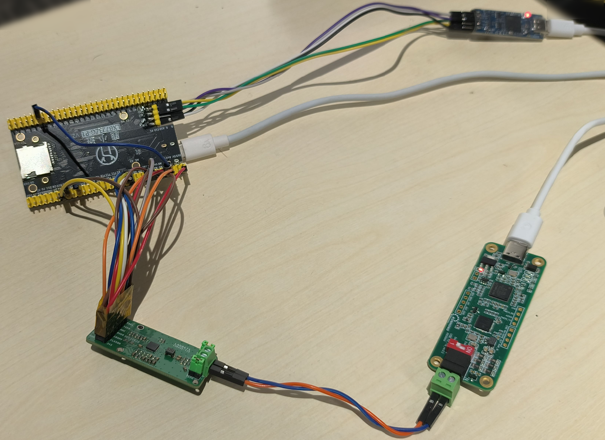
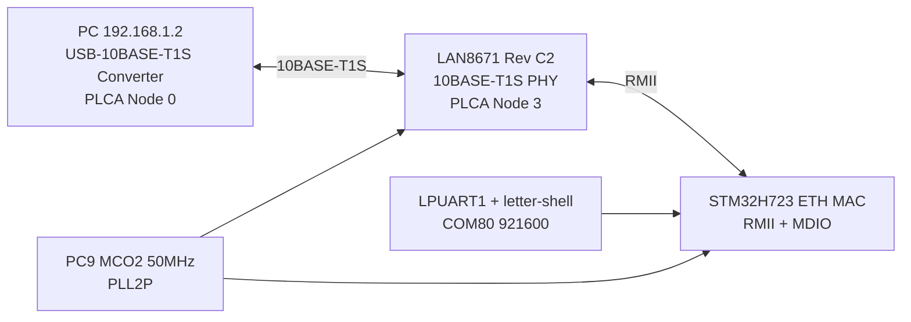

# stm32h723_lan8671



STM32H723ZG + Microchip LAN8671 Rev C2 的 10BASE-T1S 裸机 LwIP 示例工程，使用 CMake + GCC 构建。

当前工程已经完成以下内容：

- RMII + MDIO 方式驱动 LAN8671
- 按 AN1699 的 Rev C2 配置流程完成基础寄存器初始化
- 默认启用 PLCA，默认节点配置与已跑通的 F407 工程一致
- 基于 LPUART1 的 letter-shell 诊断命令
- 静态 IP、UDP echo、TCP iperf server
- 已在当前硬件上完成刷写、串口、ping、UDP echo、iperf 实测

## 1. 背景

LAN8671 是 Microchip 的 10BASE-T1S PHY，支持 PLCA。这个工程使用 STM32H723 自带 ETH MAC，通过 RMII 直连 LAN8671，再通过 USB-10BASE-T1S 转换板接到 PC。

当前网络默认规划如下：

- STM32H723: 192.168.1.110
- PC 侧 USB-10BASE-T1S 转换板: 192.168.1.2
- PLCA Coordinator: Node ID 0
- 本工程默认节点: Node ID 3
- Node Count: 8

## 2. 接线

实际接线已经按下表验证通过：

| 信号 | STM32H723 引脚 | 方向 | 说明 |
| --- | --- | --- | --- |
| ETH_REF_CLK / CLK50M | PA1, PC9 | MCU 输入 / MCO 输出 | RMII 50 MHz 参考时钟，PC9 输出到 PA1 和 LAN8671 |
| ETH_MDC | PC1 | MCU 输出 | PHY 管理时钟 |
| ETH_MDIO | PA2 | 双向 | PHY 管理数据 |
| ETH_CRS_DV | PA7 | MCU 输入 | RMII 载波检测 / 接收有效 |
| ETH_RXD0 | PC4 | MCU 输入 | RMII RXD0 |
| ETH_RXD1 | PC5 | MCU 输入 | RMII RXD1 |
| ETH_TX_EN | PB11 | MCU 输出 | RMII 发送使能 |
| ETH_TXD0 | PB12 | MCU 输出 | RMII TXD0 |
| ETH_TXD1 | PB13 | MCU 输出 | RMII TXD1 |
| LAN8671_IRQ_N | PC2 | MCU 输入 | PHY 中断输入，低有效 |
| LAN8671_RESET_N | PC3 | MCU 输出 | PHY 复位输出，低有效 |
| LPUART1_TX | PA9 | MCU 输出 | 调试串口 TX，921600 bps |
| LPUART1_RX | PA10 | MCU 输入 | 调试串口 RX，921600 bps |
| SWDIO | PA13 | 调试 | SWD |
| SWCLK | PA14 | 调试 | SWD |

串口连接：

- ST-Link 虚拟串口: COM80
- 波特率: 921600-8-N-1

## 3. 架构与关键实现



### 3.1 RMII 50MHz 时钟

这个工程不是外部 PHY 给 MCU 提供 REF_CLK，而是 STM32H723 自己从 PC9 的 MCO2 输出 50 MHz，再同时送给：

- LAN8671 REF_CLK 输入
- PA1，作为 ETH MAC 的 RMII REF_CLK 输入

代码里的关键点：

- `PLL2P = 50 MHz`
- `HAL_RCC_MCOConfig(RCC_MCO2, RCC_MCO2SOURCE_PLL2PCLK, RCC_MCODIV_1)`
- `PC9` 必须配置为 `GPIO_AF0_MCO` 且 `GPIO_SPEED_FREQ_VERY_HIGH`
- `HAL_SYSCFG_ETHInterfaceSelect(SYSCFG_ETH_RMII)` 之后，必须手动 `CLEAR_BIT(SYSCFG->PMCR, SYSCFG_PMCR_PA1SO)`，确保 PA1 内部模拟开关闭合，REF_CLK 真正送到 ETH MAC

### 3.2 LAN8671 Rev C2 初始化

LAN8671 使用的是 Rev C2 流程，不是 TJA1103 那套 Clause 45 诊断架构。

本工程按 AN1699 做了两部分事情：

1. 读取 MMD31 的 `0x0004` 和 `0x0008`，算出 `offset1`、`offset2`
2. 按表 3-1 顺序写入 Rev C2 所需寄存器

对应寄存器包括：

- `0x00D0 = 0x3F31`
- `0x00E0 = 0xC000`
- `0x0084 = cfgparam1`
- `0x008A = cfgparam2`
- `0x00E9 = 0x9E50`
- `0x00F5 = 0x1CF8`
- `0x00F4 = 0xC020`
- `0x00F8 = 0xB900`
- `0x00F9 = 0x4E53`
- `0x0081 = 0x0080`
- `0x0091 = 0x9660`

同时保留了 SQI 配置写表，方便读出 `SQISTS0`。

### 3.3 PLCA 与 Collision Detect

PLCA 默认参数：

- enable = 1
- node_id = 3
- node_count = 8
- TOTMR = 0x20
- BURST = 0x0080

Rev C2 的 `PLCA_CTRL1` 写法按 AN1699 处理：

- Coordinator (`node_id = 0`): 写 `node_count << 8`
- Follower (`node_id != 0`): 只写 `node_id`

此外按应用笔记建议，工程实现了碰撞检测自动切换：

- 使能 `IMSK1.PSTCM` 中断
- 当 `PLCA_STS.PST = 1` 时，清 `CDCTL0.CDEN`，关闭物理碰撞检测
- 当 PLCA 失效并回落到 CSMA/CD 时，再把 `CDEN` 打开

这能避免在有噪声或反射时因为误判物理冲突而丢包。

### 3.4 网络服务

当前应用层默认服务：

- 静态 IP: 192.168.1.110/24
- Gateway: 192.168.1.1
- UDP echo: 端口 7
- TCP iperf server: 端口 5001

## 4. 构建与下载

### 4.1 环境

当前工程验证环境：

- STM32Cube FW H7 版本参考: `C:\Users\weife\STM32Cube\Repository\STM32Cube_FW_H7_V1.13.0`
- 交叉编译工具链默认路径:
  `C:\ST\STM32CubeIDE_2.1.0\STM32CubeIDE\plugins\com.st.stm32cube.ide.mcu.externaltools.gnu-tools-for-stm32.14.3.rel1.win32_1.0.100.202602081740\tools\bin`
- 下载工具: `STM32_Programmer_CLI.exe`

### 4.2 编译

```powershell
.\build.ps1 build Debug
.\build.ps1 build Release
```

### 4.3 下载

```powershell
.\build.ps1 flash Debug
```

当前已实测 `flash Debug` 可成功擦写、校验并复位。

## 5. 串口命令

上电或复位后串口会看到：

```text
stm32h723_lan8671 boot
letter:/$
=== STM32H723 + LAN8671 Shell ===
Type 'help' for command list
```

当前命令列表：

- `mcu`
  - 显示 MCU 频率、复位原因、UID、Flash 容量
- `uptime`
  - 显示运行时间
- `reset`
  - 软件复位
- `phyinfo`
  - 显示 LAN8671 基本状态、PLCA、Collision Detect 状态
- `c45read <devad> <reg>`
  - 读 Clause 45 / MMD 寄存器
- `c45write <devad> <reg> <val>`
  - 写 Clause 45 / MMD 寄存器
- `plca`
  - 查看或修改 PLCA 参数
- `sqi`
  - 读取或控制 `SQICTL` / `SQISTS0`
- `irq`
  - 读取缓存后的 `STS1/STS2/STS3/IMSK1` 和 IRQ 引脚状态
- `irqclr [all]`
  - 清除缓存的状态位；加 `all` 同时清空长期累计计数
- `plcadiag`
  - 读取 PLCA 相关诊断位和 `ERRTOID`
- `pcsdiag`
  - 读取 PCS 计数寄存器，如 remote jabber / corrupted tx
- `evcnt [clear]`
  - 读取长期累计事件计数；`clear` 清空累计值
- `collision`
  - 查看或控制 Collision Detect 自动策略
- `loopback`
  - 控制 PCS 本地环回
- `ethdiag`
  - 查看 ETH DMA/RX pool 诊断信息

### 5.1 `phyinfo` 示例

```text
letter:/$ phyinfo
PHYAD=0 PHYID=0x0007/0xC165 IRQ_N=1
Link=UP SQI=0 valid=0 err=0
PLCA en=1 pst=1 node_id=3 node_count=8 totmr=0x20 burst=0x0080
Collision auto=on cden=off pstc_irq=on STS1=0x0080 STS2=0x0000
```

### 5.2 `plca` 示例

```text
letter:/$ plca
plca enabled=1 active=1 node_id=3 node_count=8
plca totmr=0x20 burst_count=0 burst_timer=0x80
plca pstc_irq=on collision_auto=on cden=off ctrl0=0x8000 ctrl1=0x0003
```

### 5.3 修改 PLCA 参数示例

```text
plca nodeid 3
plca nodecount 8
plca totmr 0x20
plca burstcnt 0
plca bursttmr 0x80
plca enable on
plca irq on
plca collauto on

# 辅助命令
plca follower 3 8
plca coordinator 8
```

说明：

- `plca follower <node_id> [node_count]` 适合快速切回 follower 配置
- `plca coordinator <node_count>` 会把本节点设为 Node 0
- 当前这套测试网络里 PC 侧转换板已经是 coordinator，通常不要同时再把板子切成 coordinator

### 5.4 `irq` 示例

```text
letter:/$ irq
IRQ_N=1 STS1=0x0080 STS2=0x0000 STS3=0x0000 IMSK1=0xF7FF
STS1 flags: EMPCYC
STS2 flags: none
```

`irq` 显示的是后台轮询后缓存的状态，不会像直接读 RC 位那样把排查现场立刻清掉。

### 5.5 `irqclr` 示例

```text
letter:/$ irqclr
IRQ latched status cleared

letter:/$ irqclr all
IRQ latched status cleared and counters reset
```

### 5.6 `sqi` 示例

默认上电后 `SQI` 已经使能，但通常需要一段接收流量统计窗口后才会 `valid=1`。

```text
letter:/$ sqi
SQI ctl=0x5400 raw=0x0000 valid=0 value=0 err=0 errcode=0

# 跑一段 ping 或 iperf 后
letter:/$ sqi
SQI ctl=0x5402 raw=0x9F7B valid=1 value=7 err=0 errcode=3
```

也可以手工控制：

```text
sqi on
sqi off
sqi reset
```

### 5.6 `plcadiag` 示例

```text
letter:/$ plcadiag
PLCA diag STS1=0x0080 STS3(ERRTOID)=0x03 active=1
EMPCYC=1 RXINTO=0 UNEXPB=0 BCNBFTO=0 UNCRS=0 PLCASYM=0
```

### 5.7 `pcsdiag` 示例

```text
letter:/$ pcsdiag
PCS status=0x0000 fault=0
PCS remote_jabber_count=0 corrupted_tx_count=0
```

### 5.8 `evcnt` 示例

```text
letter:/$ evcnt
poll=45 last_errtoid=2 latched_sts1=0x0080 latched_sts2=0x0000
SQI=0 PSTC=1 TXCOL=0 TXJAB=0 TSSI=0 EMPCYC=45
RXINTO=0 UNEXPB=0 BCNBFTO=0 UNCRS=0 PLCASYM=1 ESDERR=0 DEC5B=0
RESETC=1 WKEMDI=0 WKEWI=0 UV33=0 OT=0 IWDTO=0
```

这个命令适合看长期运行趋势，尤其是：

- `EMPCYC`
- `RXINTO`
- `UNEXPB`
- `BCNBFTO`
- `UNCRS`
- `PLCASYM`
- `DEC5B`

## 6. 网络测试步骤

### 6.1 串口检查

1. 打开 `COM80`
2. 波特率设为 `921600`
3. 确认能看到启动日志和 `letter:/$` 提示符

### 6.2 Ping

主机侧：

```powershell
ping 192.168.1.110 -n 4
```

### 6.3 UDP Echo

可以用 PowerShell 直接发 UDP：

```powershell
$udp = New-Object System.Net.Sockets.UdpClient
$udp.Client.ReceiveTimeout = 2000
$remote = New-Object System.Net.IPEndPoint ([System.Net.IPAddress]::Parse('192.168.1.110')), 7
$payload = [System.Text.Encoding]::ASCII.GetBytes('lan8671-udp-echo')
[void]$udp.Send($payload, $payload.Length, $remote)
$src = New-Object System.Net.IPEndPoint ([System.Net.IPAddress]::Any), 0
$resp = $udp.Receive([ref]$src)
[System.Text.Encoding]::ASCII.GetString($resp)
$udp.Close()
```

### 6.4 iperf

工程默认启动 TCP iperf server，主机侧：

```powershell
C:\git\embedded\lan8671\ref\iperf.exe -c 192.168.1.110 -t 5 -i 1
```

## 7. 实测结果

以下结果是在当前接线和当前固件上实际测得：

### 7.1 启动日志

```text
LAN8671 PHYAD=0
ETH link up: 10M/half PHYAD=0

stm32h723_lan8671 boot

letter:/$
=== STM32H723 + LAN8671 Shell ===
Type 'help' for command list

Network ready IP=192.168.1.110 Mask=255.255.255.0 GW=192.168.1.1
UDP echo server on port 7
TCP iperf server on port 5001
```

### 7.2 Ping

- 4/4 成功
- RTT: 0 ms 到 1 ms
- 平均: 0 ms

### 7.3 UDP Echo

- 发送内容: `lan8671-udp-echo`
- 返回内容与发送一致
- 主机侧收到回显: `from=192.168.1.110:7 bytes=16 text=lan8671-udp-echo`

### 7.4 TCP iperf

```text
[416]  0.0- 1.0 sec  1.14 MBytes  9.57 Mbits/sec
[416]  1.0- 2.0 sec  1.08 MBytes  9.04 Mbits/sec
[416]  2.0- 3.0 sec  1.09 MBytes  9.11 Mbits/sec
[416]  3.0- 4.0 sec  1.08 MBytes  9.04 Mbits/sec
[416]  4.0- 5.0 sec  1.08 MBytes  9.04 Mbits/sec
[416]  0.0- 5.1 sec  5.47 MBytes  9.06 Mbits/sec
```

结论：

- 实测 TCP 吞吐约 `9.06 Mbits/sec`
- 已接近 10BASE-T1S 的链路上限

### 7.5 ETH DMA 运行状态

```text
letter:/$ ethdiag
ETHDIAG rx_alloc_status=0 rx_alloc_error_count=0 rx_alloc_recover_count=0
ETHDIAG rx_desc_idx=2 rx_build_desc_idx=2 rx_build_desc_cnt=0 dmacsr=0x00000C04
```

当前没有出现 RX pool 耗尽。

### 7.6 SQI 实测

初始上电后如果尚未积累足够接收统计，`SQIVLD` 可能为 0。跑一段持续流量后，当前实测可得到：

```text
letter:/$ sqi
SQI ctl=0x5402 raw=0x9F7B valid=1 value=7 err=0 errcode=3
```

可以确认：

- 当前工程里 `SQI` 已默认使能
- `SQI` 需要一定统计窗口，不是上电立刻有效
- 当前这套接线和链路下可以得到 `SQI value = 7`

### 7.7 事件计数与显式清状态

当前工程已经把 LAN8671 的 RC 事件位改成：

- 后台周期轮询并累计
- `irq` 只显示缓存
- `irqclr` 单独负责清缓存状态
- `evcnt` 单独负责看长期统计

这样排查时不会出现“刚读一次 `irq`，现场就没了”的问题。

## 8. 注意事项

### 8.1 PHY 地址

当前实测 `LAN8671 PHYAD=0`，说明板上 strap 配出来的是地址 0，不是 TJA1103 示例里的地址 5。

### 8.2 PLCA Coordinator 必须是 Node 0

PC 侧 USB-10BASE-T1S 转换板需要配置为：

- IP: `192.168.1.2`
- PLCA Node ID: `0`

本工程默认是 follower：

- IP: `192.168.1.110`
- PLCA Node ID: `3`

### 8.3 RMII 时钟是这个工程最关键的点

如果 `PC9 MCO2` 没有稳定输出 50 MHz，或者 `PA1SO` 没有清掉，ETH MAC 通常会表现为：

- `HAL_ETH_Init()` 卡住或失败
- PHY 能扫到，但链路不起来
- 网络完全不通

### 8.4 `SQI` 需要流量窗口

`SQI` 默认已经使能，但通常不会在刚上电时马上 `valid=1`。当前实测是在跑过一段 ping / iperf 流量后，`SQI` 才变为有效。

如果你看到：

```text
SQI ctl=0x5400 raw=0x0000 valid=0 value=0 err=0 errcode=0
```

先不要急着判定为异常，先制造一段持续接收流量，再重新读取。

### 8.5 `irq` 与 `irqclr` 的职责分离

当前工程里：

- `irq` 用来观察当前缓存的状态现场
- `irqclr` 用来显式清缓存状态
- `evcnt` 用来看累计事件趋势

这样更适合长时间挂着跑，再回来定位问题。

### 8.6 不建议再用 CubeMX 覆盖生成

当前工程已经有多处手工修正：

- `PC9 MCO2` 50 MHz 输出
- `PA1` 内部开关处理
- `PC3` reset 线相关处理
- LAN8671 Rev C2 初始化和 PLCA 逻辑
- shell 命令

如果重新生成代码，建议先对比差异再合并，不要直接覆盖。

## 9. 参考资料

- 官网: [LAN8671 | Microchip Technology](https://www.microchip.com/en-us/product/LAN8671)
- 数据手册: `C:\git\embedded\lan8671\ref\LAN8670-1-2-Data-Sheet-60001573.pdf`
- 配置应用笔记: `C:\git\embedded\lan8671\ref\LAN8670-1-2-Configuration-Appnote-60001699.pdf`
- 已跑通参考工程: `C:\git\embedded\lan8671\stm32f407_lan8671`
- iperf: `C:\git\embedded\lan8671\ref\iperf.exe`
