# LAN9370

- [LAN9370](#lan9370)
  - [板子简介](#板子简介)
  - [STM32H503 SPI-LAN9370 模拟SMI-LAN8720](#stm32h503-spi-lan9370-模拟smi-lan8720)
    - [实际接线](#实际接线)
    - [SPI-LAN9370](#spi-lan9370)
    - [SMI-LAN8720](#smi-lan8720)
    - [ping 和 iperf 测试](#ping-和-iperf-测试)
    - [注意事项](#注意事项)
  - [STM32H723 RMII交叉连接 LAN9370](#stm32h723-rmii交叉连接-lan9370)
    - [实际接线](#实际接线-1)
    - [CubeMX](#cubemx)
    - [工程说明](#工程说明)
    - [编译和烧录](#编译和烧录)
    - [ping](#ping)
    - [iperf](#iperf)
    - [Master Slave](#master-slave)
    - [端口分组](#端口分组)
    - [其它功能说明](#其它功能说明)
  - [Github开源链接 原理图与测试工程](#github开源链接-原理图与测试工程)
  - [立创开源平台](#立创开源平台)
  - [闲鱼购买与QQ交流群](#闲鱼购买与qq交流群)

## 板子简介

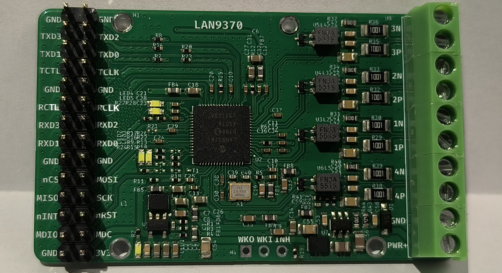

如上图:

- 贴的是 LAN9370-I/KCX, 集成100BASE-T1 PHY的5端口AVB/TSN千兆位以太网交换芯片,  VQFN-64 封装
- 右侧绿色端子:
  - 4x 100BASE-T1
  - 1路外部供电 8V~36V (板子可以用排针的单3V3 或 这个外置电源供电)
- 左侧 2x14P 2.54mm排针:
  - RGMII/RMII
    - RGMII, 如果使用, 建议画板子直接对插上, 不建议任何形式的杜邦线或飞线
    - RMII, 建议 10cm 以内杜邦线
      - RMII 命名和丝印的对应关系: CRS_DV -> RCTL, TX_EN -> TCTL, REFCLKI -> RCLK, REFCLKO -> TCLK
      - 如果 RMII 外部接PHY, 如 LAN8720, 是直连, 即 TX-TX, RX-RX
      - 如果 RMII 外部接MAC, 如 MCU, 是交叉连接, TX-RX, CRS_DV-TX_EN, 两个 REFCLKI 可以接到同一时钟源如 MCU 的 MCO 50MHz 输出
  - SPI, 用于 LAN9370 的管理和配置, 测试 ~4MHz 能用
  - SMI, 也就是 MDC MDIO, 可用于连接和配置外部 PHY
  - 3V3单电源供电
- 原理图和测试工程开源到了 https://github.com/weifengdq/embedded, 欢迎 star

LAN9370 特性如下表:

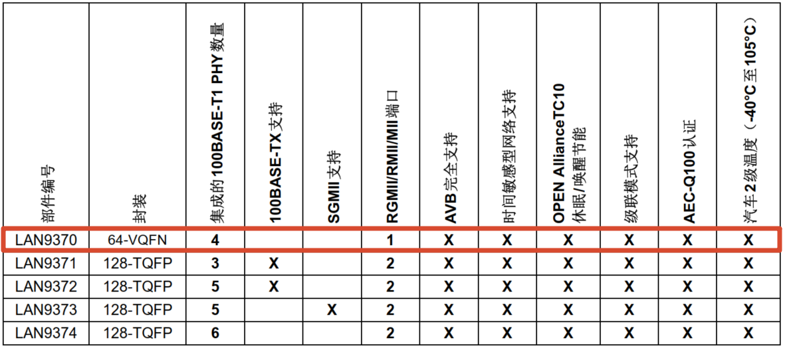

实际第一次打板的时候, RCTL RCLK 丝印搞反了, 板子上会有一个贴纸来纠正:

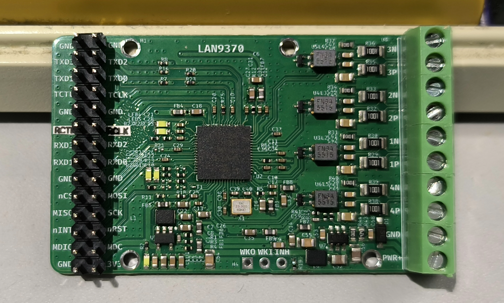

## STM32H503 SPI-LAN9370 模拟SMI-LAN8720

### 实际接线

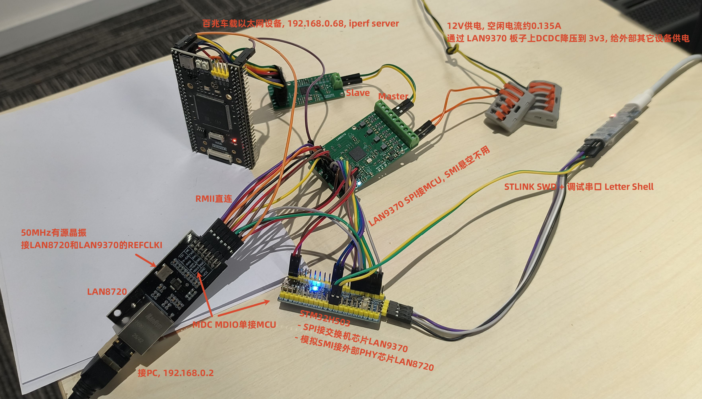

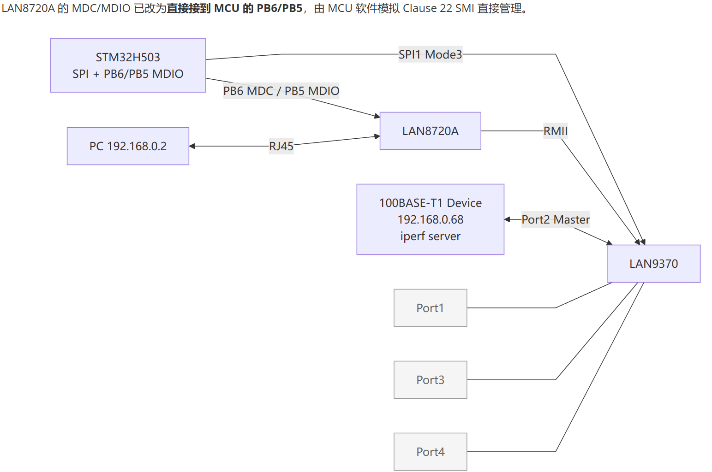

MCU 和 LAN9370 LAN8720的接线:

| 功能            | 引脚 | AF   | 连接目标             | 说明                                       |
| --------------- | ---- | ---- | -------------------- | ------------------------------------------ |
| **HSE 晶振**    | -    | -    | 8MHz 外部晶振        | PLL → SYSCLK 250MHz                        |
| **SWD 调试**    | -    | -    | STLINK-V3MINIE       | 下载和调试                                 |
| **LPUART1**     | PA9  | AF3  | TX → 串口工具(COM80) | 2Mbps, Shell 交互                          |
|                 | PA10 | AF3  | RX ← 串口工具        |                                            |
| **SPI1**        | PA1  | -    | CS → LAN9370 SPI_CS  | 软件控制 CS（GPIO 输出）                   |
|                 | PA2  | AF4  | SCK → LAN9370        | **SPI Mode 3** (CPOL=1, CPHA=1), 3.906 MHz |
|                 | PA3  | AF4  | MISO ← LAN9370       |                                            |
|                 | PA4  | AF4  | MOSI → LAN9370       |                                            |
| **Direct MDIO** | PB6  | GPIO | MDC → LAN8720        | MCU 直接输出 Clause 22 时钟                |
|                 | PB5  | GPIO | MDIO ↔ LAN8720       | 开漏 + 上拉，双向数据线                    |
| **复位**        | PB7  | -    | nRST -> LAN9370      | 低电平有效，>=10ms 脉冲                    |

LAN8720A RMII 直连 LAN9370 Port5, 接线:

| LAN9370 Port5 信号 | LAN8720A 引脚 | 方向   | 说明                              |
| ------------------ | ------------- | ------ | --------------------------------- |
| TXD[1:0]           | TXD[1:0]      | -> PHY | RMII 发送数据                     |
| RXD[1:0]           | RXD[1:0]      | <- PHY | RMII 接收数据                     |
| TXEN (TCTL)        | TXEN          | -> PHY | 发送使能                          |
| CRS_DV (RCTL)      | CRS_DV        | <- PHY | **载波检测/数据有效（关键信号）** |
| REFCLKI (RCLK)     | X1/CLKIN      | <- OSC | **50MHz 参考时钟（关键信号）**    |

### SPI-LAN9370

MCU ↔ LAN9370 通过 SPI1 (**SPI Mode 3**, CPOL=1, CPHA=1, 3.906 MHz) 连接:

- 芯片识别 Chip ID 0x00937010, 可用来测试 SPI 配置到底对不对
- VPHY 间接访问 LAN9370 内部的 4个 T1 PHY (Port 1-4), 对应 letter shell 里 phyread phywrite 命令
- 设置 Port1-4 的 enable/disable, master/slave, 对应 letter shell 里的命令
- ...

如图:

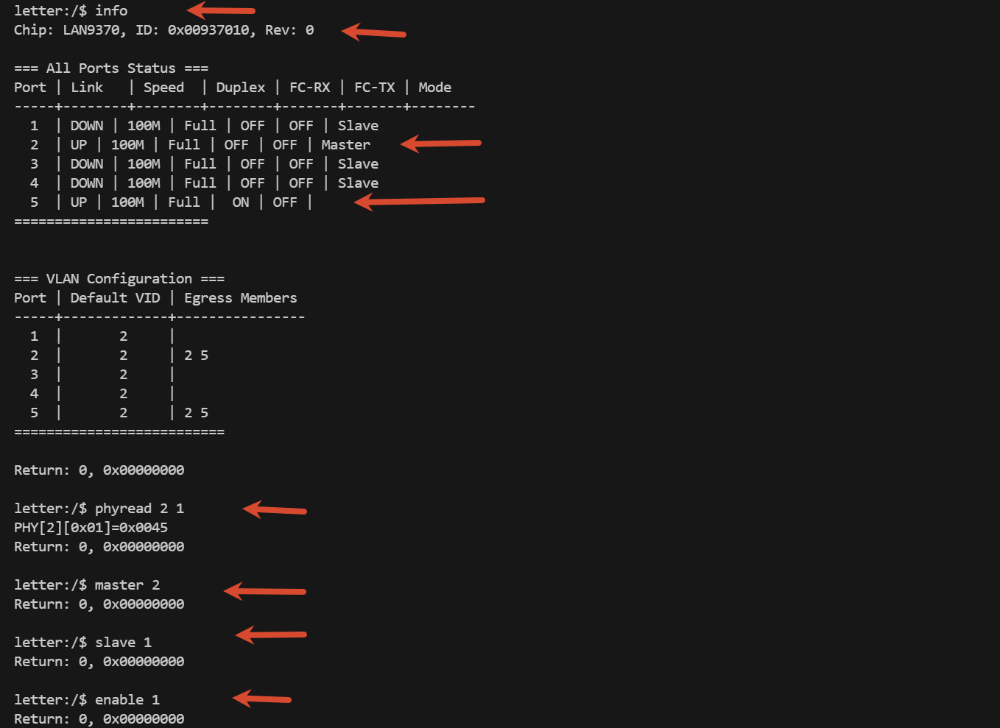

VPHY 间接访问

```c
  /* Post-reset VPHY indirect access enable (critical for T1 PHY access) */
  {
    uint8_t vphyVal = 0;
    for (int attempt = 0; attempt < 5; attempt++) {
      HAL_Delay(10);
      LAN9370_SPI_ReadReg8(0x077C, &vphyVal);
      LAN9370_SPI_WriteReg8(0x077C, vphyVal | 0x10);
      HAL_Delay(5);
      LAN9370_SPI_ReadReg8(0x077C, &vphyVal);
      if (vphyVal & 0x10) break;
    }
    if (!(vphyVal & 0x10)) {
      printf("[WARN] VPHY enable failed, T1 ports may not work\r\n");
    }
  }
```

5个端口里面的 1 3 4 默认是关闭了, 对应代码里面:

```c
  /* ---- 100BASE-T1 Port Configuration ----
   * Current bench wiring only uses Port2 <-> external 100BASE-T1 device.
   * Port1/3/4 are left floating and should stay disabled in release builds. */
  LAN9370_SetPortEnable(LAN9370_PORT_1, false);
  LAN9370_SetT1MasterSlave(LAN9370_PORT_2, LAN9370_T1_MASTER);
  LAN9370_SetPortEnable(LAN9370_PORT_2, true);
  LAN9370_SetPortEnable(LAN9370_PORT_3, false);
  LAN9370_SetPortEnable(LAN9370_PORT_4, false);

  /* ---- L2 Forwarding ----
   * Active datapath is Port2 <-> Port5 only.
   * Isolate floating ports to reduce noise during release testing. */
  LAN9370_SetPortMembership(LAN9370_PORT_1, 0x00);
  LAN9370_SetPortMembership(LAN9370_PORT_2, 0x12);
  LAN9370_SetPortMembership(LAN9370_PORT_3, 0x00);
  LAN9370_SetPortMembership(LAN9370_PORT_4, 0x00);
  LAN9370_SetPortMembership(LAN9370_PORT_5, 0x12);

  /* Enable MAC learning */
  LAN9370_SetMACLearning(true);
```

如果 5 个端口互通, 可以改为

```c
  LAN9370_SetPortEnable(LAN9370_PORT_1, true);
  LAN9370_SetT1MasterSlave(LAN9370_PORT_2, LAN9370_T1_MASTER);
  LAN9370_SetPortEnable(LAN9370_PORT_2, true);
  LAN9370_SetPortEnable(LAN9370_PORT_3, true);
  LAN9370_SetPortEnable(LAN9370_PORT_4, true);

  /* ---- L2 Forwarding: all ports can forward to each other ---- */
  for (int port = 1; port <= 5; port++) {
    LAN9370_SetPortMembership((LAN9370_Port_t)port, 0x1F);
  }
```

Port 5 配成 RMII 模式, REFCLKI 输入时钟 (似乎 REFCLKO 只能输出 125MHz 时钟?).

### SMI-LAN8720

`lan9370\stm32h503_lan9370_lan8720\LAN9370\mdio_bitbang.c`  文件中, 用两个 GPIO 模拟了 SMI (GPIO bit-banging implementation based on IEEE 802.3 Clause 22):

- PB5: MDIO (bidirectional data)
- PB6: MDC (clock, max 2.5MHz)

`lan9370\stm32h503_lan9370_lan8720\LAN9370\lan8720_driver.c` 文件中用模拟的 SMI 对LAN8720进行探测与适配:

- probe_phy, 实测 `addr=1` 命中，`mdioscan 0 3` 返回 `PHY[1]: ID=0x0007C0F1`
- 通用的写寄存器进行软复位 `phy_write(MII_BMCR, BMCR_RESET);`
- RMII, 自动协商等
- 链路状态的读取, 是否是 100M FULL

初始的日志:

```bash
[LAN8720] Probing PHY via MCU direct MDIO...
[LAN8720] probe addr 1: ID=0x0007C0F1 - MATCH!
[LAN8720] Found at PHY address 1, ID: 0x0007C0F1
[LAN8720] Resetting PHY...
[LAN8720] Reset complete after 11 ms
[LAN8720] SM register (before): 0x60E1
[LAN8720] SM register (after):  0x60E1
[LAN8720] SCSR register (before): 0x0040
[LAN8720] SCSR register (after):  0x0040
[LAN8720] ANAR set to 0x01E1 (100FD/100HD/10FD/10HD)
[LAN8720] BMCR set to 0x3200 (AN enabled, restarting)
[LAN8720] Waiting for auto-negotiation...
[LAN8720] Auto-negotiation complete after 1717 ms
[LAN8720] Link: UP
[LAN8720] Init OK
```

letter shell 也有对应的命令可以参考:

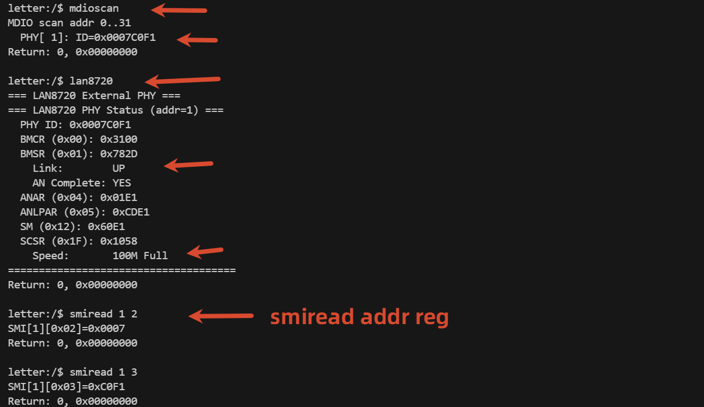

### ping 和 iperf 测试

```bash
> ping -n 4 192.168.0.68
来自 192.168.0.68 的回复: 字节=32 时间<1ms TTL=255
来自 192.168.0.68 的回复: 字节=32 时间<1ms TTL=255
来自 192.168.0.68 的回复: 字节=32 时间<1ms TTL=255
来自 192.168.0.68 的回复: 字节=32 时间<1ms TTL=255

> iperf.exe -c 192.168.0.68 -p 5001 -t 5 -i 1
------------------------------------------------------------
[ ID] Interval       Transfer     Bandwidth
[412]  0.0- 1.0 sec  10.8 MBytes  90.6 Mbits/sec
[412]  1.0- 2.0 sec  10.8 MBytes  90.6 Mbits/sec
[412]  2.0- 3.0 sec  10.9 MBytes  91.8 Mbits/sec
[412]  3.0- 4.0 sec  10.9 MBytes  91.8 Mbits/sec
[412]  4.0- 5.0 sec  10.9 MBytes  91.7 Mbits/sec
[412]  0.0- 5.0 sec  54.4 MBytes  90.9 Mbits/sec
```

### 注意事项

LAN9370 数据手册寄存器定义需要NDA, 我这也没有, 代码都是从 Linux Kernel, CycloneTCP等地方扒下来的, 仅供参考, 实际生产需要对照手册一一确认, LAN937x 的很多特性只是占位或没有实现或没有验证, 如LED Status, VLAN, PTP, Mirror, gPTP, SQI, Cable Diag等:

```bash
letter:/$ help

Command List:
setVar                CMD   --------  set var
help                  CMD   --------  show command info
users                 CMD   --------  list all user
cmds                  CMD   --------  list all cmd
vars                  CMD   --------  list all var
keys                  CMD   --------  list all key
clear                 CMD   --------  clear console
sh                    CMD   --------  run command directly
info                  CMD   --------  show chip info
dump                  CMD   --------  dump key registers
reset                 CMD   --------  hardware reset lan9370
port                  CMD   --------  port <1-5>
master                CMD   --------  master <1-4>
slave                 CMD   --------  slave <1-4>
enable                CMD   --------  enable <1-5>
disable               CMD   --------  disable <1-5>
phyread               CMD   --------  phyread <port> <reg>
phywrite              CMD   --------  phywrite <port> <reg> <value>
spiread               CMD   --------  spiread <addr> [count]
spiwrite              CMD   --------  spiwrite <addr> <value>
smiread               CMD   --------  smiread <phy> <reg>
smiwrite              CMD   --------  smiwrite <phy> <reg> <value>
diagbus               CMD   --------  diagnose SPI/SMI bus
rstprobe              CMD   --------  reset timing probe
spiprobe              CMD   --------  probe SPI mode0..3
spispeed              CMD   --------  set SPI prescaler
mib                   CMD   --------  mib <1-5>
vlan                  CMD   --------  vlan on|off|set <port> <vid>|show
portgroup             CMD   --------  portgroup <port> <memberMask>
portrecover           CMD   --------  portrecover <1-4>
mirror                CMD   --------  mirror <src> <dst|off>
ptp                   CMD   --------  ptp on|off|status|gptp on|off|status
config                CMD   --------  config save|load|show|erase
staticmac             CMD   --------  staticmac list|flush
sysreset              CMD   --------  software reset MCU
mdioscan              CMD   --------  mdioscan [from] [to] - scan MCU dire...
lan8720               CMD   --------  show LAN8720 PHY status
```

目前 Port2 如果上电后长时间无数据通信, 可能会断开, 不再能 ping 通, 在 main.c 里加了一个检测的恢复逻辑, 未测试.

## STM32H723 RMII交叉连接 LAN9370

### 实际接线

LAN9370:

- Port 1, 默认 Slave, 悬空
- Port 2, 默认 Master, 接外部车载以太网设备 192.168.0.68
- Port 3, 默认 Slave, 悬空
- Port 4, 默认 Slave, 悬空, 接百兆车载以太网转换盒后到 PC, 192.168.0.2
- Port 5, RMII, 和 MCU 相当于 MAC-MAC, 需要交叉连接
- SMI, 悬空不用
- SPI, 接 MCU 用于配置
- NRST, 低电平复位, 接 MCU

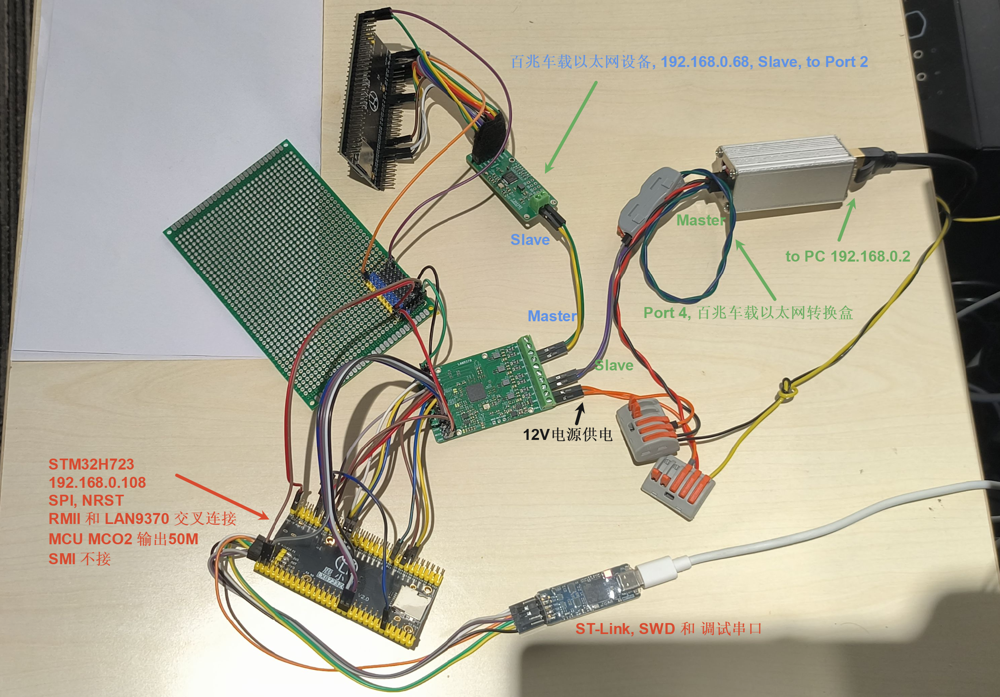

具体到引脚:

| STM32H723 信号 | STM32 引脚 |  LAN9370 信号  | 说明                        |
| :------------: | :--------: | :------------: | --------------------------- |
|      nRST      |    PC3     |      nRST      | LAN9370 硬件复位（低有效）  |
|    SPI1 SCK    |    PG11    |      SCK       | SPI 时钟                    |
|   SPI1 MISO    |    PG9     |      MISO      | SPI 数据（LAN9370 → STM32） |
|   SPI1 MOSI    |    PD7     |      MOSI      | SPI 数据（STM32 → LAN9370） |
|    SPI1 nCS    |    PG10    |       CS       | SPI 片选（软件 GPIO 控制）  |
|  MCO2 (50MHz)  |    PC9     | REFCLKI (RCLK) | RMII 参考时钟               |
|  ETH_REF_CLK   |    PA1     |       -        | 50MHz MCO2 环回             |
|   ETH_CRS_DV   |    PA7     |  TX_EN (TCTL)  | RMII 接收控制               |
|    ETH_RXD0    |    PC4     |      TXD0      | RMII 接收数据0              |
|    ETH_RXD1    |    PC5     |      TXD1      | RMII 接收数据1              |
|   ETH_TX_EN    |    PB11    | CRS_DV (RCTL)  | RMII 发送控制               |
|    ETH_TXD0    |    PB12    |      RXD0      | RMII 发送数据0              |
|    ETH_TXD1    |    PB13    |      RXD1      | RMII 发送数据1              |
|   LPUART1 TX   |    PA9     |       -        | 调试串口 (2Mbps, COM80)     |
|   LPUART1 RX   |    PA10    |       -        | 调试串口                    |
|      MDC       |    PA2     |       -        | **悬空不用**                |
|      MDIO      |    PC1     |       -        | **悬空不用**                |

### CubeMX

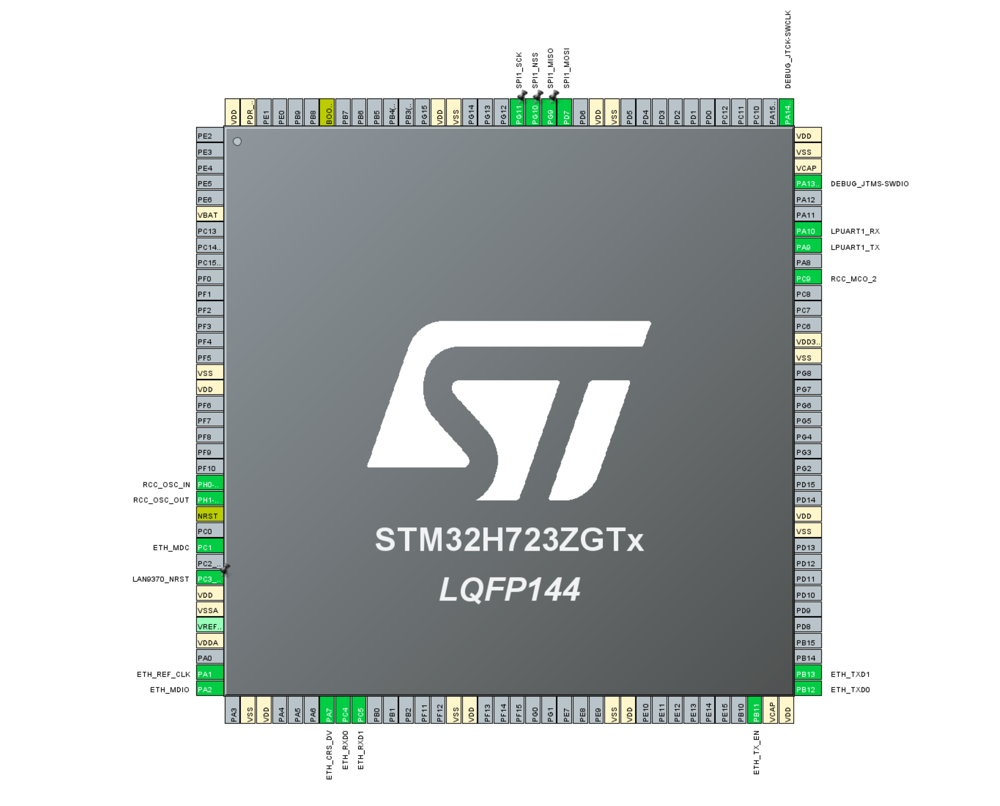

注意事项:

- 大部分都是默认配置, 仅用于最开始生成基础CMake工程, 其中的配置并不是最终使用的, 仅供参考, 不要再在 CubeMX 上修改或生成代码
- PC9 因为要输出 50MHz, GPIO 的输出速率需要调整为 Very High
- MDC MDIO 悬空不接, 所有配置都是通过 SPI 进行的
- SPI 片选实际用的是软件 GPIO 控制

时钟树, 外部25MHz无源晶振, PLL2P 配成 50MHz 给 MCO2 输出:

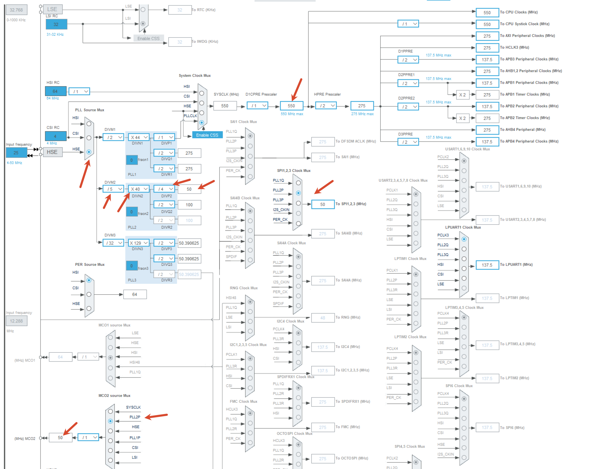

### 工程说明

LAN9370 数据手册截止目前需要NDA才能拿到, 我这里也没有, 硬件是参考官方板子, 软件是从 Linux 内核等地方扒拉下来的部分代码, 寄存器等并不算全面, 但最终也算能通能用. 对于 VLAN PTP gPTP Mirror StaticMAC 线缆诊断 信号质量SQI LED控制等, 只是命令占位.

裸机 LwIP, 192.168.0.108.

调试串口除了打印日志外, 也移植了 letter shell, 可以在调试串口进行命令交互, 但其中部分命令因为并没有详细的数据手册和寄存器参考, 仅仅占坑罢了.

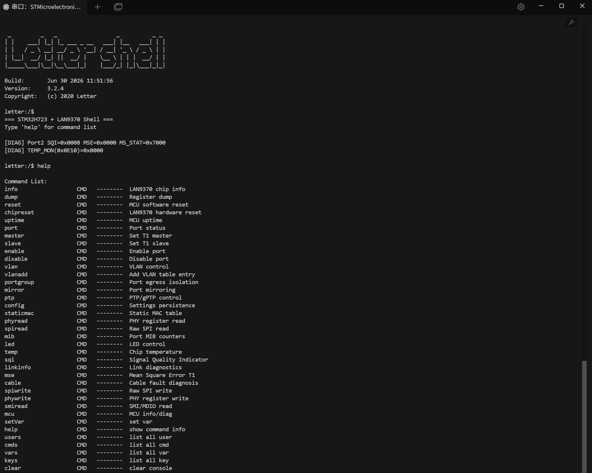

STM32H7系列相比之前的F系列有MPU/Cache配置的注意事项, 详细可参考工程里面的README文件.

### 编译和烧录

工程用 PowerShell + CMake 管理, 理论上不需要打开任何IDE, 用命令行即可进行编译下载:

- CMake ≥ 3.22 + Ninja
- arm-none-eabi GCC 工具链, 我之前安装过STM32CubeIDE, 所以用了里面自带的 `C:\ST\STM32CubeIDE_2.1.0\STM32CubeIDE\plugins\com.st.stm32cube.ide.mcu.externaltools.gnu-tools-for-stm32.14.3.rel1.win32_1.0.100.202602081740\tools\bin`, 工程里 build.ps1 可以用 `-ToolchainBinDir <路径>`: 指定工具链 bin 目录
- STM32CubeProgrammer CLI (用于烧录), 安装 STM32CubeProgrammer 软件后, 路径记录一下, 工程里 build.ps1 可以用 `-CubeProgrammerCli <路径>`: 指定 STM32CubeProgrammer CLI 路径

编译 `.\build.ps1 build`, ST-Link烧录 `.\build.ps1 flash`, 都可以加 Debug 和 Release 参数

部分截图:

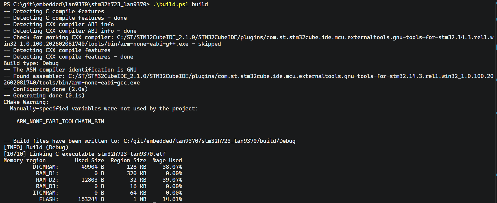

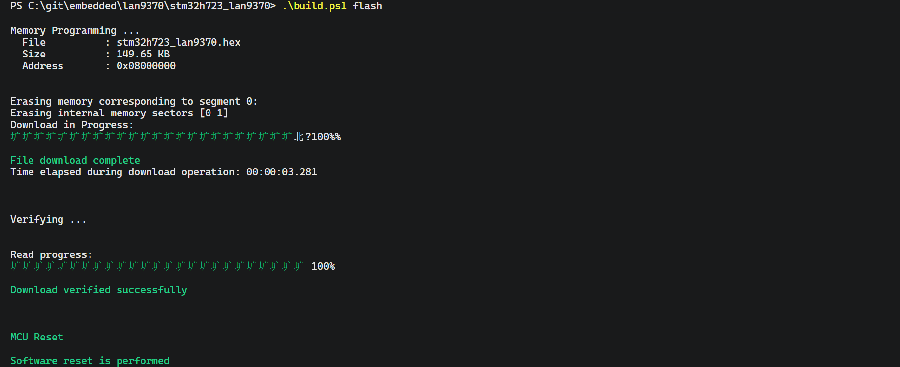

### ping

默认没有开 VLAN, 所有端口互通, 从 PC 的 192.168.0.2 开始 ping 192.168.0.108 和 192.168.0.68, 也就是从 port4 ping  port2 和 RMII的port5

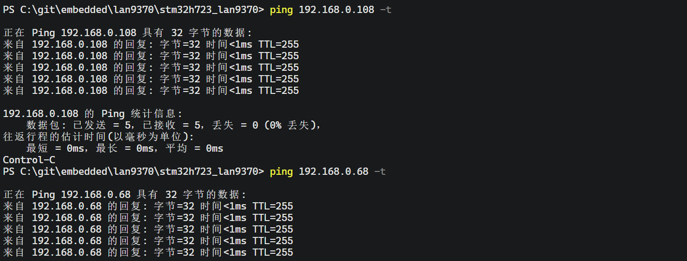

### iperf

release 版本编译和下载后, 在 5001 端口测试, 约 90Mbit/s, 对应 RMII MAC-MAC 交叉连接的结果.

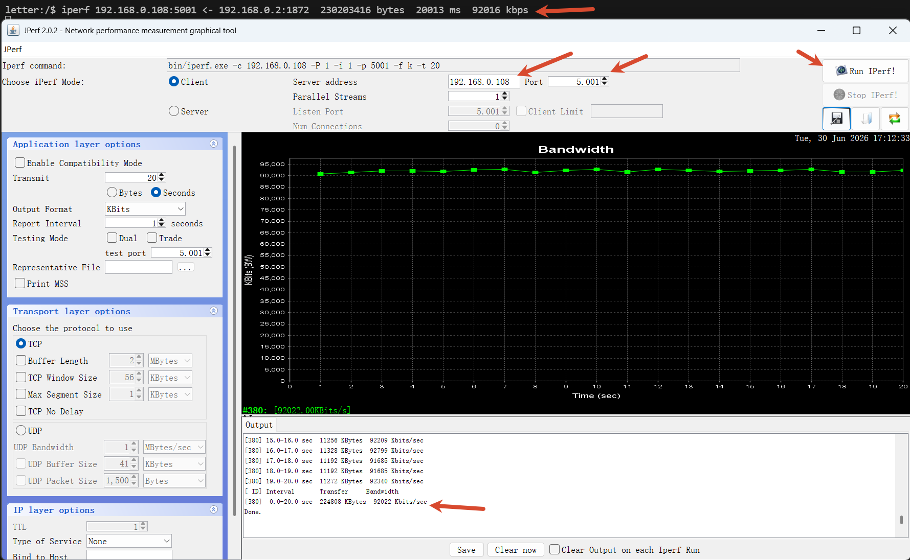

### Master Slave

命令行对连接百兆车载以太网转换盒的 Port4 进行配置, 用 master/slave 命令, 从默认的 Slave -> Master, 发现不再能 ping 通, 改回 Slave 后正常工作

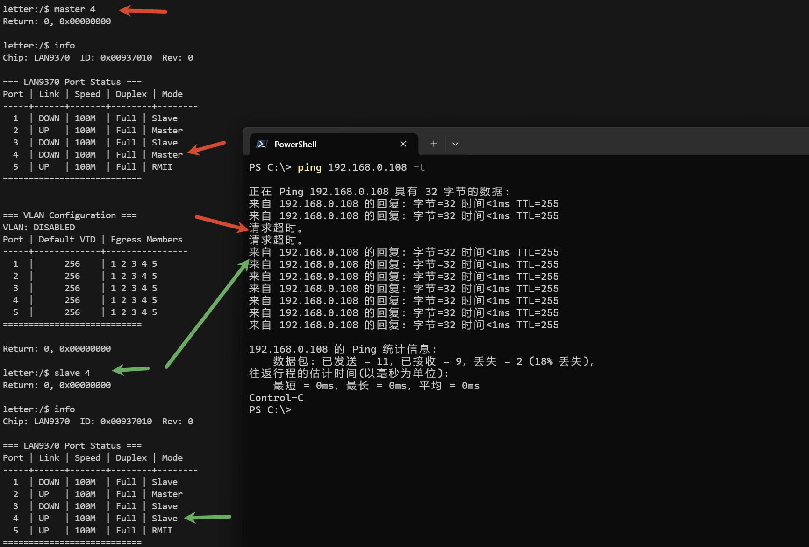

### 端口分组

用 portgroup 命令把某几个Port划分到同一组, 无需 VLAN 使能，即可实现端口分组隔离, 如

```bash
## bit 0~4 => port 1~5
portgroup 2 0x18    # Port2只转发到Port4+5  (0x18=24=bit3+bit4)
portgroup 4 0x12    # Port4只转发到Port2+5  (0x12=18=bit1+bit4)
portgroup 4 0x10    # Port4只转发到Port5    (0x10=16=bit4)
portgroup 4 0x1F    # Port4恢复全互通
```

G下面设置 `portgroup 4 0x10` 让 Port4只转发到Port5, 这样能ping通Port5的 192.168.0.108, 不再能ping通Port2的192.168.0.68, 之后 `ortgroup 4 0x1F`, Port4恢复全互通

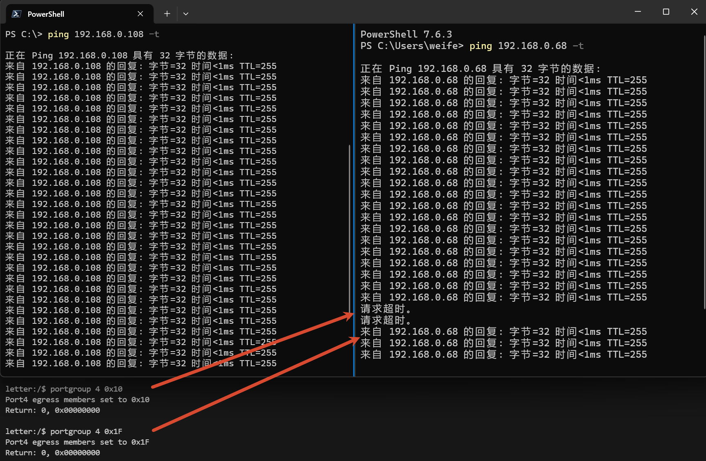

### 其它功能说明

对于 VLAN PTP gPTP Mirror StaticMAC 线缆诊断 信号质量SQI LED控制等, 只是命令占位, 没有详细的数据手册和寄存器说明, 也没有继续尝试, 这些功能暂时搁置.

##  Github开源链接 原理图与测试工程

原理图和测试工程开源到以下链接的 lan9370 文件夹, 欢迎 Star:

[https://github.com/weifengdq/embedded](https://github.com/weifengdq/embedded)

## 立创开源平台

原理图和PCB都在立创开源了:

[LAN9370 车载以太网交换机 - 立创开源硬件平台](https://oshwhub.com/weifengdq/project_ndzygzws)

## 闲鱼购买与QQ交流群

【闲鱼】https://m.tb.cn/h.RuGWY1Y?tk=UGsUg9BPU9H HU006 「我在闲鱼发布了【LAN9370 评估板:】」 点击链接直接打开

QQ 交流群: 1040239879, 验证信息可填LAN9370
