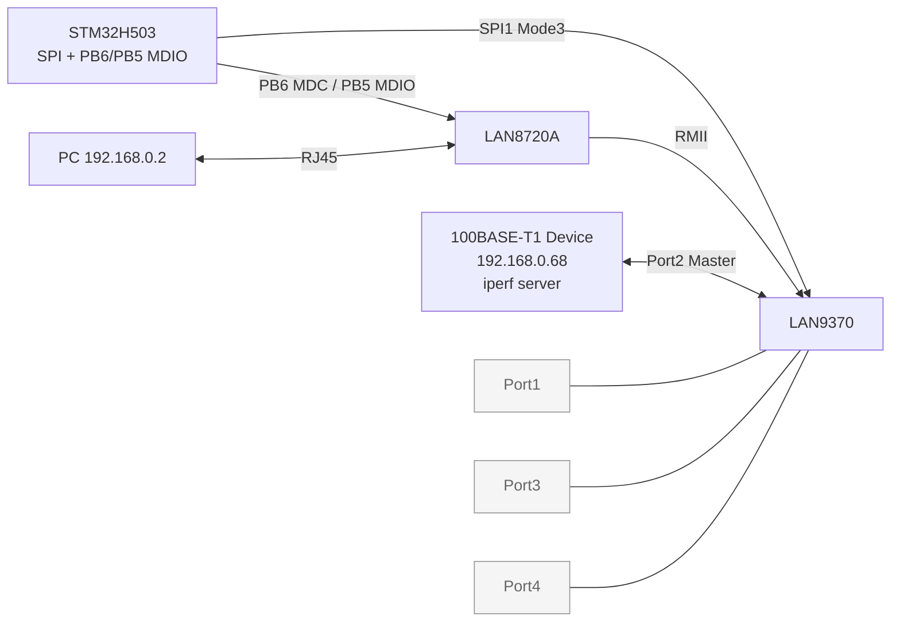
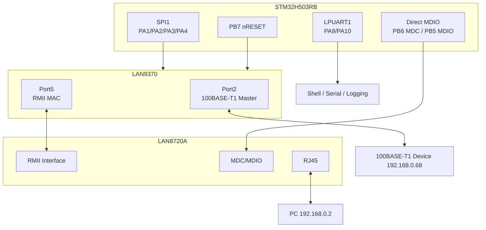
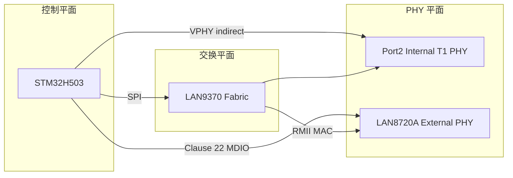
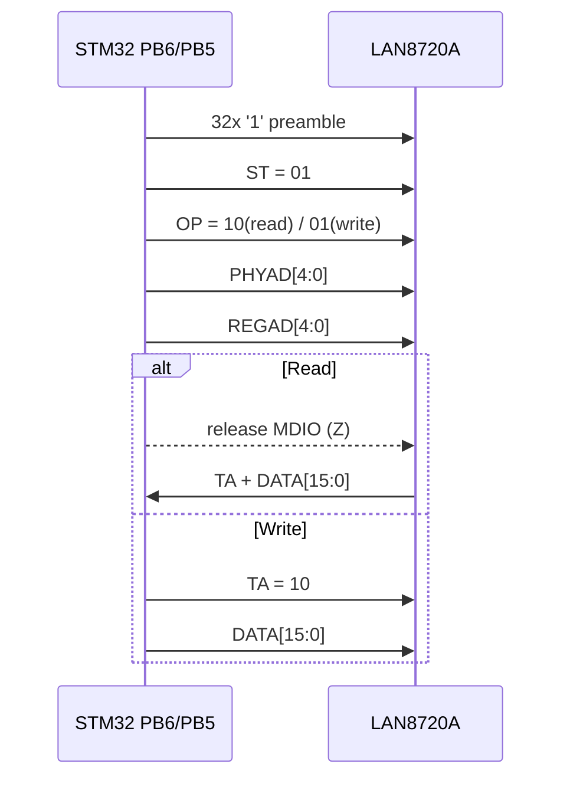
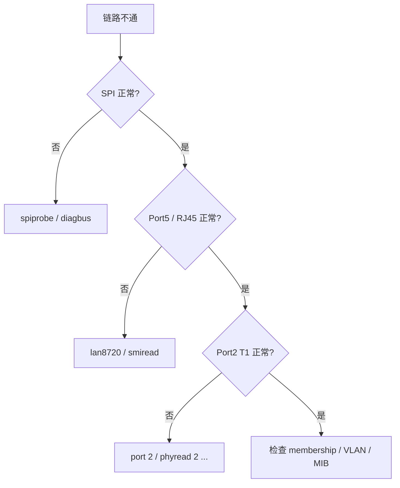

# STM32H503 + LAN9370 + LAN8720 百兆车载以太网交换机方案

## 项目概述

本项目当前面向一套非常具体、可重复的台架：

- MCU: STM32H503RB
- Switch: LAN9370
- 外部 RMII PHY: LAN8720A
- PC: 通过 RJ45 接到 LAN8720A，固定地址 `192.168.0.2`
- 远端 T1 设备: 挂在 LAN9370 Port2，地址 `192.168.0.68`，同时运行 `iperf server`
- Port1 / Port3 / Port4: 当前悬空，Release 默认关闭

这份工程文档描述的是**当前真实接线**，不是早期试验接线。最关键的变化有两点：

1. `LAN9370_MIIM_Read/Write` 这条“SPI 代理 external PHY”的假路径已经删除。
2. LAN8720A 的 MDC/MDIO 已改为**直接接到 MCU 的 PB6/PB5**，由 MCU 软件模拟 Clause 22 SMI 直接管理。



### 当前工作路径

| 路径 | 介质 | 当前状态 | 说明 |
|------|------|----------|------|
| MCU ↔ LAN9370 | SPI1 | 启用 | Mode 3, 3.906 MHz，用于交换机寄存器和 VPHY 访问 |
| MCU ↔ LAN8720 | PB6/PB5 | 启用 | 软件模拟 Clause 22 SMI，直接读写 external PHY |
| LAN9370 Port5 ↔ LAN8720 | RMII | 启用 | 100M only，外部 50MHz REFCLK 输入 |
| LAN9370 Port2 ↔ T1 Device | 100BASE-T1 | 启用 | Port2 固定为 Master |
| LAN9370 Port1/3/4 | 100BASE-T1 | 禁用 | 当前台架未使用，默认关闭 |

### 一句话理解这份工程

这不是“MCU 通过 SPI 同时管 Switch 和 external PHY”的工程；
而是“**MCU 通过 SPI 管 LAN9370，通过 GPIO bit-bang MDIO 管 LAN8720**，两条控制通路各司其职”的工程。

### 核心特性

- **LAN9370 SPI 驱动**：SPI1 Mode 3，读写交换机全局/端口/VLAN/MIB 等寄存器
- **VPHY 间接访问**：内部 T1 PHY 继续通过 SPI + VPHY window 管理
- **直连 MDIO 驱动**：PB6/PB5 直接 bit-bang Clause 22，管理 LAN8720A
- **双平面控制**：Switch 控制面和 external PHY 控制面彻底分离，避免后续误用
- **端口裁剪**：Release 默认只打开 Port2 与 Port5，Port1/3/4 关闭
- **状态灯**：PA5 板载 LED 显示链路状态，并在 Port2/Port5 有流量时快闪
- **Letter-shell 命令行**：交互式控制和诊断
- **持久化配置**：端口模式/VLAN/PTP 配置保存到 MCU Flash
- **CMake + Ninja 构建**：一键编译和烧录

---

## 硬件接线

### 整体接线框图



### 当前接线重点

- `LAN9370 SMI_OUT` 在当前台架**不参与** external PHY 管理。
- `LAN8720 MDC/MDIO` 由 `STM32 PB6/PB5` 直接控制。
- `LAN9370 Port5` 只承担 RMII MAC 角色，不再承担 external PHY MDIO 主控角色。
- `Port1 / Port3 / Port4` 在当前 Release 配置中默认关闭，避免空口引入噪声和误判。

### STM32H503 引脚分配

| 功能         | 引脚 | AF   | 连接目标            | 说明                       |
|-------------|------|------|--------------------|---------------------------|
| **HSE 晶振** | -    | -    | 8MHz 外部晶振        | PLL → SYSCLK 250MHz       |
| **SWD 调试** | -    | -    | STLINK-V3MINIE     | 下载和调试                  |
| **LPUART1** | PA9  | AF3  | TX → 串口工具(COM80) | 2Mbps, Shell 交互          |
|             | PA10 | AF3  | RX ← 串口工具        |                           |
| **SPI1**    | PA1  | -    | CS → LAN9370 SPI_CS | 软件控制 CS（GPIO 输出）     |
|             | PA2  | AF4  | SCK → LAN9370       | **SPI Mode 3** (CPOL=1, CPHA=1), 3.906 MHz |
|             | PA3  | AF4  | MISO ← LAN9370      |                           |
|             | PA4  | AF4  | MOSI → LAN9370      |                           |
| **Status LED** | PA5 | GPIO | NUCLEO 板载 LED | 软件状态灯，见下方说明 |
| **Direct MDIO** | PB6 | GPIO | MDC → LAN8720 | MCU 直接输出 Clause 22 时钟 |
|               | PB5 | GPIO | MDIO ↔ LAN8720 | 开漏 + 上拉，双向数据线 |
| **复位**     | PB7  | -    | nRST -> LAN9370      | 低电平有效，>=10ms 脉冲      |

### LAN8720A RMII 接口接线（连接到 LAN9370 Port 5）

| LAN9370 Port5 信号 | LAN8720A 引脚 | 方向      | 说明                      |
|-------------------|--------------|----------|--------------------------|
| TXD[1:0]          | TXD[1:0]     | -> PHY    | RMII 发送数据              |
| RXD[1:0]          | RXD[1:0]     | <- PHY    | RMII 接收数据              |
| TXEN              | TXEN         | -> PHY    | 发送使能                   |
| CRS_DV            | CRS_DV       | <- PHY    | **载波检测/数据有效（关键信号）** |
| REFCLK            | X1/CLKIN     | <- OSC    | **50MHz 参考时钟（关键信号）** |
| PB5(MDIO)         | MDIO         | <->       | MCU 直接管理 PHY 寄存器 |
| PB6(MDC)          | MDC          | -> PHY    | MCU 直接输出 MDIO 时钟 |

> **CRSDV / REFCLK 注意事项**：
> - **REFCLK** 必须由外部 50MHz 有源晶振提供，LAN9370 Port5 配置为 REFCLK input 模式
> - **CRS_DV** 是 RMII 的关键信号，如果接错或虚焊，链路层无法建立
> - LAN8720A 的 PHYAD0 引脚内部下拉，默认 PHY 地址 = 0；若外部上拉，PHY 地址 = 1
> - 当前接线中 PHY 地址 strap 为 `1`，软件默认先探测 `addr=1`，再回退到 `addr=0`
> - MDIO 需要上拉；代码里 PB5 使用开漏输出，符合 Clause 22 总线特性

### LAN9370 端口接线汇总

| 端口    | 类型        | 默认模式 | 当前状态 | 连接设备 | 说明 |
|--------|------------|---------|---------|---------|------|
| Port 1 | 100BASE-T1 | 未使用 | 关闭 | 悬空 | 旧台架已移除 |
| Port 2 | 100BASE-T1 | Master | 启用 | 外部 T1 设备 `192.168.0.68` | 当前唯一 T1 工作口 |
| Port 3 | 100BASE-T1 | 未使用 | 关闭 | 悬空 | Release 默认关闭 |
| Port 4 | 100BASE-T1 | 未使用 | 关闭 | 悬空 | Release 默认关闭 |
| Port 5 | RMII       | RMII MAC | 启用 | LAN8720A + RJ45 + PC `192.168.0.2` | 作为 PC 接入口 |

### 本工程为什么这样布线

| 设计点 | 原因 | 直接收益 |
|--------|------|----------|
| MCU 直连 LAN8720 MDIO | 删除假 SPI→MIIM 代理，避免层次混乱 | external PHY 可直接读写 Clause 22 寄存器 |
| Port2 固定 Master | 当前对端设备角色已确定 | 避免链路配对歧义 |
| Port1/3/4 默认禁用 | 当前台架无连接 | 减少调试噪声，状态更可预测 |
| Port5 只保留 RMII | 把 MAC 数据面和 PHY 控制面拆开 | 数据通路更清楚，问题边界更清楚 |

### LED 指示语义

当前工程把 NUCLEO-H503RB 的板载 LED（按常见板卡定义使用 `PA5`）作为**整机链路/流量状态灯**：

| LED 状态 | 含义 |
|----------|------|
| 熄灭 | Port2 与 LAN8720 两侧都未建立链路 |
| 慢闪 | 只有一侧链路建立，另一侧未建立 |
| 常亮 | Port2 与 LAN8720 两侧链路都建立，当前空闲 |
| 快闪 | Port2/Port5 MIB 计数有变化，说明当前有收发流量 |

> 说明：如果你的板子不是标准 NUCLEO-H503RB，`PA5` 可能没有接 LED，此时需要把 `main.c` 里的状态灯引脚改成你的实际灯脚。

---

## 适配情况

### LAN9370 适配

| 项目           | 状态 | 说明                                                |
|---------------|------|----------------------------------------------------|
| SPI 寄存器访问  | OK   | **Mode 3** (CPOL=1, CPHA=1), **3.906 MHz** (250MHz/64), 8/16/32 位读写均验证通过 |
| 芯片识别       | OK   | Chip ID: 0x00937010, Revision ID 正常                 |
| VPHY 间接访问  | OK   | 通过 VPHY_SPECIAL_CTRL (0x077C) bit4 使能              |
| T1 PHY 寄存器  | OK   | 4 个 T1 端口的 PHY 寄存器均能正确读写                    |
| Master/Slave  | OK   | 当前 Release 固定 Port2=Master，其余空口默认关闭         |
| 端口使能/禁用  | OK   | 通过 REG_PORTn_MSTP_STATE (0x0B04) 控制                 |
| L2 转发       | OK   | 当前 Release 只开放 Port2 ↔ Port5 转发路径              |
| Port 5 RMII   | OK   | XMII_CTRL0/1 正确配置，REFCLK input, 100M only         |
| SMI_OUT / 外部PHY代理 | N/A  | 当前接线未使用 LAN9370 的 SMI_OUT 管 external PHY；外部 PHY 由 MCU 直连 MDIO 管理 |
| VLAN          | OK   | Port-based VLAN 配置和查询                             |
| 端口镜像       | OK   | 支持任意端口间流量镜像                                   |
| PTP/gPTP      | WIP  | 寄存器控制位已找到，功能待验证                             |
| MIB 计数器    | OK   | 支持读取各端口收发统计                                   |

### LAN8720A 适配

| 项目           | 状态 | 说明                                                |
|---------------|------|----------------------------------------------------|
| PHY 自动探测   | OK   | 实测 `addr=1` 命中，`mdioscan 0 3` 返回 `PHY[1]: ID=0x0007C0F1` |
| PHY 直接访问   | OK   | 通过 PB6/PB5 直接读写 Clause 22 寄存器 |
| PHY ID 读取   | 已实现 | `PHYID1=0x0007`, `PHYID2=0xC0F1`，完整 ID = `0x0007C0F1` |
| 软复位        | 已实现 | 实测复位完成时间约 `11 ms` |
| RMII 模式      | 已实现 | `SM(0x12)=0x60E1`，bit14 已为 1 |
| 4B5B 编码      | 已实现 | `SCSR(0x1F)=0x1058`，bit6 已为 1 |
| 自动协商       | 已实现 | 实测协商完成时间约 `1616 ms` |
| 链路状态读取   | 已实现 | `BMSR(0x01)=0x782D`，`SCSR(0x1F)=0x1058`，当前为 `100M Full` |

### LAN8720A 实测寄存器快照（COM80 串口）

| 命令 | 实测返回 | 说明 |
|------|----------|------|
| `mdioscan 0 3` | `PHY[1]: ID=0x0007C0F1` | 仅在地址 1 命中 |
| `smiread 1 2` | `0x0007` | PHYID1 |
| `smiread 1 3` | `0xC0F1` | PHYID2 |
| `smiread 1 0` | `0x3100` | BMCR，AN 已启用 |
| `smiread 1 1` | `0x782D` | BMSR，Link Up + AN Complete |
| `smiread 1 18` | `0x60E1` | SM，RMII 模式 |
| `smiread 1 31` | `0x1058` | SCSR，100M Full |

---

## 测试情况

### 测试环境

- **MCU 平台**: STM32H503RB (NUCLEO-H503RB), SYSCLK 250MHz
- **交换机**: LAN9370 5-Port 100BASE-T1 Switch EVB
- **外部 PHY**: LAN8720A RMII 模块 (RJ45 接口)
- **测试 PC**: Windows 11, RJ45 接 LAN8720A, IP 192.168.0.2/24
- **对端设备**: 192.168.0.68 (100BASE-T1, iperf server)
- **编译工具**: arm-none-eabi-gcc 14.3.1, -Os 优化
- **固件大小**: Flash 46.1KB / 120KB, RAM 3.9KB / 32KB

### 当前 Release 拓扑的验证目标


### Ping 测试

**测试: PC(`192.168.0.2`) -> Port2 对端设备(`192.168.0.68`)**

```
> ping -n 4 192.168.0.68
来自 192.168.0.68 的回复: 字节=32 时间<1ms TTL=255
来自 192.168.0.68 的回复: 字节=32 时间<1ms TTL=255
来自 192.168.0.68 的回复: 字节=32 时间<1ms TTL=255
来自 192.168.0.68 的回复: 字节=32 时间<1ms TTL=255

数据包: 已发送 = 4，已接收 = 4，丢失 = 0 (0% 丢失)
```

### iperf TCP 吞吐量测试

**正向测试（PC -> 100BASE-T1 设备）**

```
> C:\git\embedded\bak\iperf.exe -c 192.168.0.68 -p 5001 -t 5 -i 1
------------------------------------------------------------
[ ID] Interval       Transfer     Bandwidth
[412]  0.0- 1.0 sec  10.8 MBytes  90.6 Mbits/sec
[412]  1.0- 2.0 sec  10.8 MBytes  90.6 Mbits/sec
[412]  2.0- 3.0 sec  10.9 MBytes  91.8 Mbits/sec
[412]  3.0- 4.0 sec  10.9 MBytes  91.8 Mbits/sec
[412]  4.0- 5.0 sec  10.9 MBytes  91.7 Mbits/sec
[412]  0.0- 5.0 sec  54.4 MBytes  90.9 Mbits/sec
```

**反向测试（100BASE-T1 设备 -> PC）**

```
> C:\git\embedded\bak\iperf.exe -c 192.168.0.68 -p 5001 -t 5 -i 1 -R
[384]  0.0- 1.0 sec  11.0 MBytes  92.2 Mbits/sec
[384]  1.0- 2.0 sec  10.7 MBytes  89.5 Mbits/sec
[384]  2.0- 3.0 sec  11.0 MBytes  91.9 Mbits/sec
[384]  3.0- 4.0 sec  10.8 MBytes  90.2 Mbits/sec
[384]  4.0- 5.0 sec  10.7 MBytes  89.8 Mbits/sec
[384]  0.0- 5.0 sec  54.1 MBytes  90.5 Mbits/sec
```

### 测试结论

| 指标           | 结果       | 说明                      |
|---------------|-----------|--------------------------|
| Ping 丢包率    | 0%        | 双向稳定                  |
| Ping 延迟      | <1ms      | LAN 级别延迟              |
| TCP 吞吐量     | ~90.9 Mbps | 当前 Port2↔Port5 拓扑下稳定运行 |
| 双向吞吐量     | ~90.5 Mbps | 双向基本对称，无异常抖动     |
| 稳定性         | 优秀       | 当前 Release 配置下 ping/iperf 稳定 |

---

## 工程架构

```
stm32h503_lan9370_lan8720/
├── Core/                           # STM32CubeMX 生成
│   ├── Inc/
│   │   ├── main.h                  # HAL 句柄声明
│   │   ├── app_extensions.h        # lwIP/FreeRTOS 扩展接口
│   │   ├── stm32h5xx_hal_conf.h    # HAL 配置
│   │   └── stm32h5xx_it.h         # 中断服务声明
│   └── Src/
│       ├── main.c                  # * 主程序入口，初始化全流程
│       ├── app_extensions.c        # 扩展模块初始桩
│       ├── stm32h5xx_hal_msp.c    # HAL 底层硬件初始化
│       ├── stm32h5xx_it.c         # 中断向量表实现
│       ├── syscalls.c / sysmem.c  # newlib 系统调用
│       └── system_stm32h5xx.c     # 系统时钟初始化
│
├── LAN9370/                        # * LAN9370 驱动模块
│   ├── lan9370_reg.h              # 完整寄存器定义 (>200个寄存器宏)
│   ├── lan9370_spi.h / .c         # SPI 底层：读/写 8/16/32位 + Burst
│   ├── mdio_bitbang.h / .c        # MCU 直连 LAN8720 的 Clause-22 bit-bang MDIO
│   ├── lan9370_driver.h / .c      # 高层 API：初始化/端口/VLAN/PHY/MIB
│   ├── lan9370_persist.h / .c     # 持久化：MCU Flash 存储配置
│   └── lan8720_driver.h / .c      # * LAN8720A PHY 驱动（MCU direct MDIO）
│
├── Shell/                          # * 命令行交互模块
│   ├── shell_port.h / .c          # Shell 端口层 + 全部命令实现
│   ├── shell_cfg_user.h           # letter-shell 配置
│   └── letter-shell/              # 开源 letter-shell (v3.x)
│       └── src/                   # shell.c, shell_cmd_list.c, shell_ext.c
│
├── Drivers/                        # STM32 HAL 库（只读）
│   ├── CMSIS/                     # ARM CMSIS Core + Device
│   └── STM32H5xx_HAL_Driver/     # STM32H5 HAL 驱动
│
├── cmake/                          # CMake 工具链
│   ├── gcc-arm-none-eabi.cmake    # GCC ARM 交叉编译配置
│   ├── starm-clang.cmake          # (备用) ARM Clang 配置
│   └── stm32cubemx/              # STM32CubeMX 生成的 CMake 片段
│
├── build/                          # 构建输出目录（gitignore）
│   ├── Debug/                     # Debug 构建 ( -O0 -g3 )
│   └── Release/                   # Release 构建 ( -Os -g0 )
│
├── CMakeLists.txt                  # * 顶层 CMake 配置
├── CMakePresets.json              # CMake 预设（Debug / Release）
├── build.ps1                      # * PowerShell 一键构建/烧录脚本
├── serial_monitor.py              # 串口读取调试工具
├── startup_stm32h503xx.s          # 汇编启动文件
├── STM32H503xx_FLASH.ld           # 链接脚本 (FLASH 120KB + 持久化 8KB)
├── STM32H503xx_RAM.ld             # RAM 链接脚本 (调试用)
├── stm32h503_lan9370.ioc          # STM32CubeMX 工程文件
└── README.md                      # 本文档
```

---

## 工程详解

### 1. 主程序初始化流程 (`main.c`)

```
main()
  ├── MPU_Config()                  # 内存保护单元
  ├── HAL_Init()                    # HAL 库初始化
  ├── SystemClock_Config()         # HSE 8MHz -> PLL -> SYSCLK 250MHz
  ├── MX_GPIO_Init()               # GPIO 默认配置
  ├── MX_ICACHE_Init()             # 指令缓存使能
  ├── MX_LPUART1_UART_Init()       # 调试串口 2Mbps
   ├── Shell_Init(&hlpuart1)        # * 仅初始化 UART/Shell，不再访问交换机寄存器
  ├── MX_SPI1_Init()               # SPI1 Mode 3 (CPOL=1,CPHA=1), ~3.9MHz (250/64)
  ├── LAN9370_Init(&hspi1)         # * 初始化 SPI + SMI + 复位 + VPHY
  ├── LAN9370_GetChipInfo()        # 读取芯片 ID
  ├── VPHY 间接访问使能             # 重试 5 次确保 VPHY 通路
   ├── T1 端口配置                   # Port2=Master, Port1/3/4=Disabled
   ├── Port 5 RMII 配置             # XMII_CTRL0/1 寄存器配置
   ├── LAN8720_Init()               # * MCU 直连 MDIO 配置 external PHY
   ├── L2 成员掩码设置               # 仅开放 Port2 ↔ Port5 (member=0x12)
  ├── MAC 学习使能                  # 动态 MAC 地址学习
  └── App_Extensions_Init()        # lwIP/FreeRTOS 扩展桩（暂未使用）
```

### 2. SPI 驱动层 (`lan9370_spi.c`)

LAN9370 通过 SPI 从接口进行所有寄存器配置：

```
读帧: [CMD=0x03][ADDR_HI][ADDR_LO][DUMMY] -> [DATA]
写帧: [CMD=0x02][ADDR_HI][ADDR_LO][DATA]

参数:
  - SPI Mode 3 (CPOL=1, CPHA=1)  ← 实测 LAN9370 需 Mode 3，Mode 0 读到 0x00
  - MSB First, 8-bit 帧
  - 速度: SYSCLK (250MHz) / 64 = 3.906 MHz
  - CS: 手动 GPIO 控制 (PA1)

通过 spiprobe 命令验证:
  spiprobe mode0: id=00 00 00 00  (×)
  spiprobe mode2: id=00 49 38 08  (×)
  spiprobe mode3: id=00 93 70 10  (✓ = LAN9370 正确 ID)
```

提供的 API 接口：
- `LAN9370_SPI_ReadReg8/16/32()` -- 单寄存器读
- `LAN9370_SPI_WriteReg8/16/32()` -- 单寄存器写
- `LAN9370_SPI_ReadBurst/WriteBurst()` -- 批量读写
- `LAN9370_SPI_ReadBurstDMA/WriteBurstDMA()` -- DMA 批量传输

### 3. PHY 访问边界：VPHY vs 直连 MDIO

当前工程最重要的设计收敛是把“**内部 PHY**”和“**外部 PHY**”分开看：

| 对象 | 访问路径 | 当前实现 | 文件 |
|------|----------|----------|------|
| LAN9370 内部 T1 PHY (Port1-4) | SPI → VPHY indirect window | `LAN9370_PHY_ReadReg/WriteReg` | `lan9370_driver.c` |
| LAN8720 external PHY | MCU PB6/PB5 → Clause 22 MDIO | `MDIO_BitBang_Read/Write` | `mdio_bitbang.c`, `lan8720_driver.c` |

旧版本里曾经存在 `LAN9370_MIIM_Read/Write` 这套 API，假设 LAN9370 能作为 MCU 的 external PHY SPI 代理。
该假设已经被彻底删除，原因如下：

1. 当前硬件接线下，LAN8720 的 MDC/MDIO 已直接接到 MCU，而不是接到 LAN9370。
2. 就算回到旧接线，LAN9370 也不提供当前工程所需的“SPI 穿透读 external PHY Clause-22 寄存器”的可靠代理接口。
3. 继续保留这套假 API 只会让后续维护者误以为 external PHY 可通过 switch driver 访问。

### 4. LAN9370 高层驱动 (`lan9370_driver.c`)

封装了完整的交换机管理功能。关键实现细节：

#### VPHY 间接访问
LAN9370 内置的 T1 PHY 通过 VPHY (Virtual PHY) 机制访问。需要先使能 SPI 间接访问路径：
1. 设置 `VPHY_SPECIAL_CTRL` bit4 使能 VPHY
2. 等待 `VPHY_IND_BUSY` 清除
3. 通过 `REG_VPHY_IND_ADDR__2` 设置目标端口和寄存器地址
4. 通过 `REG_VPHY_IND_DATA__2` 读写数据

#### External PHY 控制边界
当前工程中，LAN9370 只负责：

- Port5 的 RMII MAC 寄存器配置
- Switch fabric 的二层转发
- Port2 的 T1 侧配置

LAN8720 的 PHY 管理由 `lan8720_driver.c` 负责，控制链路不穿过 `lan9370_driver.c`。
这正是“删除假 MIIM API”之后的层次边界。

#### 端口使能
正确做法是通过 `REG_PORTn_MSTP_STATE` (0x0B04) 控制转发状态，而非直接操作 OP_CTRL 寄存器。错误的 tail-tag 位操作会导致帧格式损坏。

#### Master/Slave 读取
T1 端口的 Master/Slave 状态应从 `T1_PHY_MASTER_SLAVE_CTRL` bit11 (`T1_PHY_MS_CFG_VALUE`) 读取，而非 `T1_PHY_BASIC_CTRL` bit14（该位是 loopback 控制）。

### 5. LAN8720A PHY 驱动 (`lan8720_driver.c`)

当前 external PHY 初始化已经切换为**真实的直连 MDIO 驱动**：

```
初始化流程（direct MDIO）:
   1. 初始化 PB6/PB5 software SMI 总线
   2. 优先探测 PHY addr=1
   3. 若失败则探测 addr=0，再扫描 0..31
   4. 读取 PHYID1/PHYID2，匹配 LAN8720 OUI
   5. 写 BMCR.RESET 并轮询复位完成
   6. 配置 SM[14]=1，确保 RMII 模式
   7. 配置 SCSR[6]=1，打开 LAN8720A 需要的 4B5B
   8. 写 ANAR，广播 10/100 FD/HD 能力
   9. 置 BMCR.AN_ENABLE + RESTART_AN
 10. 轮询 BMSR / SCSR，读取 link / duplex / speed
```

当前台架实测启动日志：

```text
[LAN8720] Probing PHY via MCU direct MDIO...
[LAN8720] probe addr 1: ID=0x0007C0F1 - MATCH!
[LAN8720] Found at PHY address 1, ID: 0x0007C0F1
[LAN8720] Resetting PHY...
[LAN8720] Reset complete after 11 ms
[LAN8720] SM register (before): 0x60E1
[LAN8720] SM register (after):  0x60E1
[LAN8720] SCSR register (before): 0x0040
[LAN8720] SCSR register (after):  0x0040
[LAN8720] ANAR set to 0x01E1 (100FD/100HD/10FD/10HD)
[LAN8720] BMCR set to 0x3200 (AN enabled, restarting)
[LAN8720] Waiting for auto-negotiation...
[LAN8720] Auto-negotiation complete after 1616 ms
[LAN8720] Link: UP
```

这意味着 `lan8720`、`smiread`、`smiwrite`、`mdioscan` 这几条 shell 命令现在都直接作用于 **MCU ↔ LAN8720** 的物理 MDIO 总线。

### 6. Letter-shell 命令行 (`shell_port.c`)

基于开源 [letter-shell](https://github.com/NevermindZZT/letter-shell) 框架，通过 LPUART1 提供交互式控制台：

- **波特率**: 2Mbps
- **缓冲区**: 512 字节命令缓冲 + 512 字节环形接收缓冲
- **中断驱动**: UART RX 中断 -> 环形缓冲区 -> Shell 轮询处理
- **printf 重定向**: `_write()` 系统调用重定向到 UART TX
- **初始化边界**: `Shell_Init()` 现在只做 UART / shell 初始化，不再提前访问 LAN9370 SPI 寄存器

### 7. 持久化存储 (`lan9370_persist.c`)

使用 MCU Flash 最后一个 8KB 扇区存储配置：

```
Flash 布局:
┌──────────────────────────┐ 0x08000000
│  固件代码 (120KB)         │
│                          │
├──────────────────────────┤ 0x0801E000
│  持久化区域 (8KB)         │ <- PERSIST_FLASH_BASE
│  ┌──────────────────────┐│
│  │ PersistBlob_t        ││
│  │ - magic: 0x4C394337  ││  ('L9C7')
│  │ - version: 1         ││
│  │ - payloadSize        ││
│  │ - crc32              ││
│  │ - settings           ││
│  └──────────────────────┘│
└──────────────────────────┘ 0x08020000
```

- 链接脚本 `STM32H503xx_FLASH.ld` 限制 FLASH=120KB，保留最后 8KB
- 写入前自动擦除扇区
- CRC32 校验保证数据完整性
- 通过 Shell `config save|load|show|erase` 管理

---

## 构建和烧录

### 依赖工具

| 工具                  | 要求       | 下载                                                        |
|----------------------|-----------|-------------------------------------------------------------|
| CMake                | >= 3.22   | https://cmake.org                                           |
| Ninja                | 最新即可   | https://ninja-build.org                                     |
| arm-none-eabi-gcc    | 10.3+     | https://developer.arm.com (或 CubeIDE 内置)                   |
| STM32CubeProgrammer  | 2.x       | https://www.st.com                                          |

### 快速上手

```powershell
# 进入工程目录
cd stm32h503_lan9370_lan8720

# Release 构建 + 烧录
.\build.ps1 flash Release

# Debug 构建（含调试符号）
.\build.ps1 build Debug

# 清理构建
.\build.ps1 distclean Release

# 查看帮助
.\build.ps1 help
```

### build.ps1 命令参考

| 命令       | 说明                       |
|-----------|---------------------------|
| `build`   | 构建工程（默认 Debug）       |
| `rebuild` | 清理后重新构建              |
| `clean`   | 清理编译中间文件            |
| `distclean`| 删除整个构建目录            |
| `flash`   | 构建 + 烧录到 STM32         |
| `gen`     | 仅生成 CMake 构建文件        |

---

## Shell 命令参考

### 基础命令
| 命令     | 参数 | 说明                                |
|---------|------|------------------------------------|
| `help`  | -    | 显示所有命令帮助                      |
| `info`  | -    | 芯片信息 + 全端口状态 + VLAN 配置       |
| `dump`  | -    | 导出所有寄存器状态                     |
| `reset` | -    | 硬件复位 LAN9370                     |

### 端口控制
| 命令       | 参数       | 说明                        |
|-----------|-----------|----------------------------|
| `port`    | `<1-5>`   | 显示端口详细状态              |
| `master`  | `<1-4>`   | 设置 T1 端口为 Master        |
| `slave`   | `<1-4>`   | 设置 T1 端口为 Slave         |
| `enable`  | `<1-5>`   | 使能端口转发                 |
| `disable` | `<1-5>`   | 禁用端口转发                 |

### PHY 诊断
| 命令        | 参数                       | 说明                      |
|------------|---------------------------|--------------------------|
| `phyread`  | `<port 1-4> <reg 0-31>`   | 读 T1 PHY 寄存器 (VPHY)    |
| `phywrite` | `<port 1-4> <reg> <val>`  | 写 T1 PHY 寄存器           |
| `smiread`  | `<phy 0-31> <reg 0-31>`   | MCU 直连 MDIO 读 PHY 寄存器 |
| `smiwrite` | `<phy 0-31> <reg> <val>`  | MCU 直连 MDIO 写 PHY 寄存器 |
| `lan8720`  | -                         | 显示 LAN8720A 真实 PHY 状态（BMCR/BMSR/SCSR 等） |
| `portrecover` | `<1-4>`                | 手动重启一个 T1 口的 PHY/AN/端口状态 |

### 高级功能
| 命令         | 参数                       | 说明                       |
|-------------|---------------------------|---------------------------|
| `vlan`      | `on|off|show`            | VLAN 使能/状态              |
| `vlan`      | `set <1-5> <1-4094>`      | 设置端口默认 VLAN ID         |
| `portgroup` | `<port> <memberMask>`     | 直接设置端口 egress membership，做可靠端口隔离 |
| `mirror`    | `<src> <dst|off>`        | 端口镜像配置                 |
| `ptp`       | `on|off|status`          | PTP 配置                    |
| `ptp`       | `gptp on|off|status`     | gPTP 配置                   |
| `staticmac` | `list|flush`              | 静态 MAC 表管理              |
| `mib`       | `<1-5>`                   | 端口 MIB 统计                |
| `config`    | `save|load|show|erase`  | 持久化配置管理               |

### 低级调试
| 命令        | 参数                       | 说明                       |
|------------|---------------------------|---------------------------|
| `spiread`  | `<addr> [count]`          | 直接 SPI 读寄存器            |
| `spiwrite` | `<addr> <val>`            | 直接 SPI 写寄存器            |
| `mdioscan` | `[from] [to]`             | 扫描 MCU 直连 MDIO 总线上的 PHY |
| `diagbus`  | -                         | SPI/SMI 总线诊断             |
| `rstprobe` | `[rounds]`                | 复位时序探测                  |
| `spiprobe` | -                         | SPI 模式扫描 (CPOL/CPHA)，确认 Mode 3 |
| `spispeed` | `<prescaler>`             | 动态调整 SPI 速度             |
| `sysreset` | -                         | MCU 软复位 (用于捕获完整启动日志) |

---

## 注意事项 & 踩坑记录

### 硬件相关

1. **CRSDV / REFCLK 接线**
   - CRS_DV 是 RMII 最关键的信号之一，接错会导致 LAN8720 无法建立链路
   - REFCLK 必须由外部 50MHz 有源晶振供给 LAN9370 Port5（配置为 REFCLK input），同时供给 LAN8720A
   - 排查时先检查这两根线的连通性

2. **MDIO 拓扑（重要变更 + 实测结论）**
   - **当前接线**: MCU PB6/PB5 直连 LAN8720A MDC/MDIO；LAN9370 不再参与 external PHY 管理。
   - **关键结论**: `LAN9370_MIIM_Read/Write` 已从驱动层删除，避免误把 external PHY 访问挂到 switch driver 上。
   - **PHY addr = 1**（当前台架 strap 为 1；软件仍保留回退到 0 和全扫描）
   - Shell `smiread`/`smiwrite`/`mdioscan` 现在都是真实的 MCU 直连 MDIO 命令
   - `phyread`/`phywrite` 依旧只访问内部 T1 PHY (Port1-4)，和 external PHY 无关

3. **100BASE-T1 Master/Slave 配对**
   - 链路两端必须一端 Master + 一端 Slave
   - 如果两边都是 Slave 或都是 Master，PHY 会一直处于 Link Down 状态
   - 通过 Shell `port <n>` 命令查看 T1_PHY_MS_CFG_VALUE 确认模式

4. **Port2 空闲后偶发不通的判断**
   - 从现象上看，更像是 **T1 链路侧** 在空闲后进入了某种低功耗/掉链路/重新协商状态，而不是纯交换平面“忘记转发”
   - 如果只是二层转发表问题，通常 `ping` 不会在“空闲一段时间后稳定失联”，而且 `FlushDynamicMAC` 往往就能恢复
   - 当前工程已经在交换机侧加入了两层恢复手段：
   - 自动恢复：主循环检测到 Port2 持续掉链路数秒后，自动执行 PHY reset + restart AN + 重新使能端口
   - 手动恢复：Shell 命令 `portrecover 2`
   - 但如果**对端设备自己的 PHY/MAC 已进入更深的睡眠态**，单从交换机侧恢复并不保证一定能唤醒对端

### 软件相关

11. **VPHY 间接访问使能**
   - 芯片复位后必须重新使能 VPHY 间接访问（`VPHY_SPECIAL_CTRL` bit4）
   - 复位后首次写入可能失败，需要重试（当前代码重试 5 次）

12. **端口使能不要用 OP_CTRL 寄存器**
   - `REG_PORTn_OP_CTRL0` (0x0020) 的 bit2 是 `PORT_TAIL_TAG_ENABLE`，不是 TX/RX enable
   - 错误地设置 tail-tag 会导致帧格式损坏，网络不通
   - 正确做法：使用 `REG_PORTn_MSTP_STATE` (0x0B04) 控制端口转发状态

13. **Master/Slave 状态读取**
   - `T1_PHY_BASIC_CTRL` bit14 是 loopback 控制位，不是 Master/Slave 状态
   - 正确读取：`T1_PHY_MASTER_SLAVE_CTRL` bit11 (`T1_PHY_MS_CFG_VALUE`)

14. **Port2 自动恢复策略**
   - 当前 Release 在主循环中轮询 Port2 link 状态
   - 如果 Port2 被管理员显式关闭（MSTP state = 0），自动恢复不会介入
   - 如果 Port2 处于启用状态但持续掉链路，则执行：
   - `SetPortEnable(false)`
   - `T1_PHY_BASIC_CTRL` 写 `RESET + AN_ENABLE + RESTART_AN`
   - 恢复 Master/Slave 模式（当前 Port2=Master）
   - `SetPortEnable(true)`
   - `FlushDynamicMAC()`

15. **寄存器字节序**
   - LAN9370 寄存器为大端序（big-endian），16位寄存器的 MSB 在低地址
   - 使用 WriteReg8 按字节操作比 WriteReg16 更可靠

16. **SMI 操作中断保护（MCU 直连 MDIO）**
   - 当前 external PHY 管理使用 MCU bit-bang Clause 22，事务期间要关中断，避免时序抖动
   - 如果后续迁移到硬件 MDIO 外设，可再评估是否放开中断保护

17. **持久化 Flash 区域保护**
   - 链接脚本 FLASH 限制为 120KB（而非完整的 128KB），保留最后 8KB
   - 固件超过 120KB 会导致持久化数据被覆盖
   - 当前固件约 45KB，有充足余量

18. **LAN8720A 4B5B 编码**
    - LAN8720A 的 SCSR 寄存器 bit6 必须写 1，否则在某些模式下可能不正常工作
    - 这是 LAN8720A 特有的要求，其他 PHY 可能不需要

19. **Shell 初始化顺序**
   - `Shell_Init()` 现在只负责 UART 和 shell 缓冲初始化
   - 不再允许在 `LAN9370_Init()` 之前访问 switch SPI 寄存器
   - 这样做是为了避免“日志能打印，但底层 SPI handle 还没绑定”的隐蔽顺序 bug

---

## 交换机基础知识速览

### 1. 这颗板子里的三个平面

| 平面 | 本工程对应对象 | 负责什么 | 代码入口 |
|------|----------------|----------|----------|
| 控制平面 | STM32H503 | 配置寄存器、诊断、初始化 | `main.c`, `shell_port.c` |
| 交换平面 | LAN9370 switching fabric | 二层查表、端口转发、VLAN membership | `lan9370_driver.c` |
| PHY 平面 | 内部 T1 PHY + 外部 LAN8720 PHY | 模拟/物理层链路建立、速率/双工/自协商 | `lan9370_driver.c`(VPHY), `lan8720_driver.c`(direct MDIO) |

### 2. 为什么交换机工程总是容易把人绕晕

因为同样都叫“PHY 配置”，实际上至少有两种完全不同的对象：

1. **Switch 内部 PHY**：在 LAN9370 芯片内部，和 switch fabric 紧耦合。
2. **外部 PHY**：这里是挂在 Port5 上的 LAN8720A，本质上是另一颗独立芯片。

它们共享的只是“都要配 PHY 寄存器”，不是同一条控制路径。

### 3. 本工程里最重要的概念对照

| 概念 | 通俗解释 | 本工程实现 |
|------|----------|-----------|
| Store-and-Forward | 帧先收完整，再决定往哪转发 | 由 LAN9370 硬件完成，MCU 不参与逐包搬运 |
| Forwarding Membership | 某端口允许把帧转给哪些端口 | `LAN9370_SetPortMembership()` |
| Port Enable | 端口是否允许进入转发态 | `LAN9370_SetPortEnable()` |
| Master/Slave | 100BASE-T1 链路谁提供时钟基准 | `LAN9370_SetT1MasterSlave()`，当前 Port2=Master |
| RMII MAC/PHY 分离 | Port5 只做 MAC，LAN8720 做外部 PHY | Port5 寄存器在 LAN9370，PHY 寄存器在 LAN8720 |
| Clause 22 SMI | 经典 MDC/MDIO 管理协议 | `mdio_bitbang.c` 中的软件时序实现 |

### 4. 当前数据面和控制面的关系



---

## 同类交换机对比

### 1. 为什么 LAN9370 容易被误判成“能 SPI 代理所有 PHY”

很多车载交换机把“内部 PHY 管理”和“外部 PHY 管理”藏在不同层里，名字又都带 PHY / MDIO / SMI / MIIM，很容易把边界搞混。

下面这张表是本工程真正关心的对比维度：

| 芯片 | 内部 PHY 访问 | external PHY 访问 | MCU 最小控制接口 | 适合什么场景 |
|------|---------------|-------------------|------------------|--------------|
| SJA1105 | 无统一内部 PHY 窗 | MCU 自己直连 MDIO | SPI + MCU MDIO | 需要 MCU 亲自管 external PHY |
| SJA1110 | 代理能力更完整 | 设计上更接近“全包” | 单 SPI 更容易 | 大系统、较强驱动栈 |
| KSZ8895 / KSZ9477 家族 | 某些型号有寄存器代理 | 依型号而异 | 单 SPI 常见 | 工业交换机经验丰富 |
| **LAN9370** | **VPHY 适合 internal T1 PHY** | **本工程建议 external PHY 用 MCU 直连 MDIO** | **SPI + MCU bit-bang MDIO** | 当前这种 Port5 + LAN8720 台架 |

### 2. 本工程最终为什么选择“MCU 直连 external PHY MDIO”

| 方案 | 优点 | 缺点 | 本工程结论 |
|------|------|------|-----------|
| LAN9370 代理 external PHY | 接线看起来干净 | 当前工程没有可靠代理实现，易误用 | 放弃 |
| MCU 直连 MDIO | 边界清晰、命令可控、PHY 调试直接 | 多占两根 GPIO | 采用 |
| 只靠 PHY 上电默认行为 | 不用写驱动也能偶尔通 | 不可控、不可诊断、不可发布 | 不采用 |

---

## 交换机概念与代码对照实现

### 1. 概念 -> 函数 -> 寄存器

| 概念 | 关键函数 | 关键寄存器/位 | 当前项目用途 |
|------|----------|---------------|-------------|
| Switch Reset | `LAN9370_HardwareReset()` | `nRESET(PB7)` + `REG_GLOBAL_CTRL_0` | 上电恢复已知状态 |
| SPI indirect VPHY enable | `LAN9370_EnableSpiIndirectVphyAccess()` | `VPHY_SPECIAL_CTRL` | 打通 internal T1 PHY 配置路径 |
| Port2 Master 配置 | `LAN9370_SetT1MasterSlave()` | `T1_PHY_MASTER_SLAVE_CTRL` | 匹配外部 T1 对端 |
| Port Enable | `LAN9370_SetPortEnable()` | `REG_PORTn_MSTP_STATE` | 关闭空口，只保留 Port2/5 |
| L2 转发表边界 | `LAN9370_SetPortMembership()` | `REG_PORT_VLAN_MEMBERSHIP__4` | 仅开放 2 ↔ 5 |
| External PHY Reset / AN | `LAN8720_Init()` | `BMCR/BMSR/ANAR/SCSR/SM` | 让 RJ45 侧 link 处于受控状态 |
| External PHY 寄存器读写 | `MDIO_BitBang_Read/Write()` | MDC/MDIO Clause 22 | Shell 诊断与驱动初始化 |

### 2. 当前 Release 的 forwarding policy

```text
Port1 membership = 0x00   // disabled
Port2 membership = 0x12   // Port2 <-> Port5
Port3 membership = 0x00   // disabled
Port4 membership = 0x00   // disabled
Port5 membership = 0x12   // Port5 <-> Port2
```

也就是说，这颗交换机在当前工程里被裁剪成一个非常明确的两口桥：

- 上行/车载侧: Port2
- 下行/调试/PC 侧: Port5 + LAN8720 + RJ45

这比“把所有端口都开着”更适合作为 Release 基线。

---

## 模拟 SMI 实现详解

### 1. Clause 22 基本帧格式

`mdio_bitbang.c` 里实现的是最传统的 IEEE 802.3 Clause 22 帧：

```text
PREAMBLE(32x1) | ST(01) | OP(10/01) | PHYAD[4:0] | REGAD[4:0] | TA | DATA[15:0]
```

其中：

- `OP=10` 表示读
- `OP=01` 表示写
- 读操作的 TA 是 `Z0`
- 写操作的 TA 是 `10`

### 2. 代码是怎么把这帧“手搓”出来的

| 动作 | 函数 | 作用 |
|------|------|------|
| 发 32 个 1 | `SMI_SendPreamble()` | 兼容多数 PHY 的 preamble 需求 |
| 发起始位 | `SMI_SendStart()` | 固定 `01` |
| 发操作码 | `SMI_SendOp()` | 读/写选择 |
| 发地址 | `SMI_SendAddr()` | 发送 PHY 地址和寄存器地址 |
| 处理 TA | `SMI_SendTA_Write()` / `SMI_HandleTA_Read()` | 区分读写时序 |
| 发/收 16bit 数据 | `SMI_SendData()` / `SMI_ReadData()` | 真正的寄存器 payload |

### 3. 为什么 MDIO 一定要开漏

MDIO 不是一根普通 GPIO，而是一根可能被不同设备轮流驱动的双向管理线。
如果做成推挽输出，一旦两边同时驱动反相电平，就会总线打架。

本工程的实现里：

- PB5 输出时使用 `GPIO_MODE_OUTPUT_OD`
- 释放总线时切回输入
- 依靠外部/内部上拉把总线维持在 idle high

### 4. 为什么要关中断

因为 bit-bang MDIO 的本质是“软件精确定时”。
如果在发送 `ST/OP/ADDR/TA/DATA` 中间被长时间打断，PHY 可能把这次帧当成畸形事务直接丢掉。

因此当前实现采取了非常保守但稳定的策略：

- 事务开始前 `__disable_irq()`
- 事务结束后 `__enable_irq()`

在 250MHz Cortex-M33 上，这种做法对当前初始化和 shell 诊断场景完全可接受。

### 5. 时序流程图



### 6. 为什么现在改名成 `mdio_bitbang.c`

当前模块负责的是 MCU 直连 external PHY 的通用 Clause 22 bit-bang，总体上并不属于 LAN9370 专有逻辑。

因此这次收尾把文件名从带强烈误导性的 `lan9370_smi.c` 改成了 `mdio_bitbang.c`，这样后续维护时更容易一眼看出：

- 它不是 LAN9370 的 SPI/VPHY 驱动
- 它也不是 switch fabric 的一部分
- 它只是一个给 external PHY 用的直连 MDIO 工具层

---

## 调试路径建议

### 1. 先看什么

| 现象 | 第一条命令 | 第二条命令 | 目的 |
|------|------------|------------|------|
| SPI 不通 | `spiprobe` | `diagbus` | 确认 Mode 3 与芯片 ID |
| T1 不通 | `port 2` | `phyread 2 0x09` | 确认 Master/Slave 和 PHY 状态 |
| RJ45 不通 | `lan8720` | `smiread 1 1` | 确认 external PHY link / AN |
| Port2 掉线后恢复 | `portrecover 2` | `ping 192.168.0.68` | 验证交换机侧 best-effort 恢复是否有效 |
| 全路径不通 | `info` | `mib 2` / `mib 5` | 看转发路径两端是否有包 |

### 2. 建议的排障顺序



### 调试技巧

- **链路不通时**：先用 `info` 命令查看所有端口状态，确认 PHY link 是否 UP
- **SPI 通信异常时**：用 `diagbus` 快速诊断 SPI/SMI 总线状态
- **不确定 SPI 模式时**：用 `spiprobe` 扫描所有 CPOL/CPHA 组合
- **怀疑复位时序时**：用 `rstprobe` 多次复位并读取芯片 ID 验证时序余量
- **跟踪网络转发问题时**：用 `mib <port>` 查看端口收发计数，判断丢包位置
- **保存工作配置**：调试完成后用 `config save` 保存当前配置到 Flash

---

## 参考资料

- [LAN9370 数据手册](https://www.microchip.com/en-us/product/LAN9370)
- [LAN8720A 数据手册](https://www.microchip.com/en-us/product/LAN8720A)
- [IEEE 802.3 Clause 22 - SMI/MDIO 协议](https://standards.ieee.org/)
- [RMII 规范 v1.2](https://www.rmii.org/)
- [letter-shell 开源项目](https://github.com/NevermindZZT/letter-shell)
- [STM32H503 参考手册 (RM0492)](https://www.st.com)
- Linux 内核 LAN9370 驱动: `drivers/net/dsa/microchip/ksz9477_spi.c`
- CycloneTCP LAN9370 驱动: `cyclone_tcp/drivers/switch/lan937x_driver.c`

---

## 许可证

- STM32 HAL 驱动代码版权归 STMicroelectronics 所有
- LAN9370/LAN8720 驱动代码基于数据手册独立实现
- letter-shell 组件使用 MIT 许可证
- 其余代码采用项目内部许可
