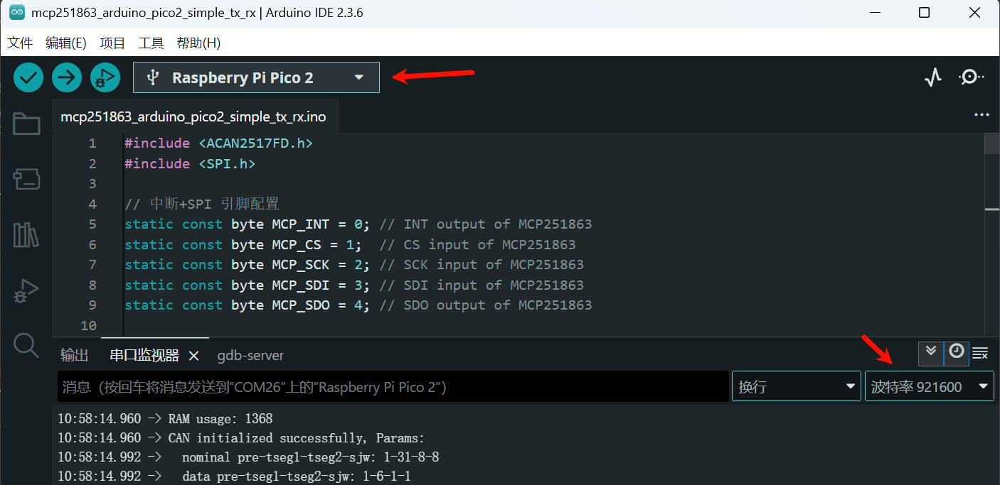

# MCP251863

- [MCP251863](#mcp251863)
  - [MCP251863 简介](#mcp251863-简介)
  - [MCP251863 评估板](#mcp251863-评估板)
  - [评估板原理图](#评估板原理图)
  - [Arduino Pico2 测试](#arduino-pico2-测试)
    - [接线](#接线)
    - [ACAN2517FD 库](#acan2517fd-库)
    - [收发测试 1M+5M](#收发测试-1m5m)
    - [自定义 预分频 TSEG SJW TDC](#自定义-预分频-tseg-sjw-tdc)
    - [自定义滤波器](#自定义滤波器)
  - [Github 链接](#github-链接)
  - [QQ 交流群](#qq-交流群)
  - [评估板购买方式](#评估板购买方式)

## MCP251863 简介

[MCP251863 | Microchip Technology](https://www.microchip.com/en-us/product/MCP251863) 带集成收发器的SPI-CANFD控制器, 其实可以看作 `MCP2518FD控制器 + ATA6563收发器` 拿胶水站起来了, 软件层面可以完全视为 MCP2518FD, 可直接借用 MCP2518FD 的 51, Arduino, ESP32, Linux 等的配置和使用示例.

MCP251863 的特性:

- CAN速率最高 仲裁段1Mbps + 数据段5Mbps
- SPI速率最高20MHz, 支持模式 0,0 和 1,1
- 供电 VCC 5V + VIO(3.3或5V, 对应MCU电平)
- 温度范围 `扩展级E(-40~125℃)` 和 `高温H(-40~150℃)`
- 封装目前有 SSOP28 和 VQFN28 两种, 后者体积小, 但目前前者相对便宜

中文数据手册: [https://www.microchip.com.cn/newcommunity/Uploads/202209/63296a9c72b03.pdf](https://www.microchip.com.cn/newcommunity/Uploads/202209/63296a9c72b03.pdf)

## MCP251863 评估板

闲鱼用户 weifengdq 购买


贴的立创的型号是 [MCP251863T-E/SS](https://item.szlcsc.com/5929957.html?fromZone=s_s__%2522MCP251863%2522&spm=sc.gbn.xh1.zy.n___sc.hm.hd.ss&lcsc_vid=TgJdBQJRTwcMUVAATwNcUAFQEVVbBgJWQwcPVFwDFAIxVlNTQlReX1JSQVNbUztW):


## 评估板原理图


原理图简介:

- 40MHz 无源晶振
- 板载120Ω终端电阻, 直接焊上, 以免测试忘记接
- 板子上放置了两个白色LED, 正常工作时应确保两个都是亮的状态.
- 一般使用前8个引脚即可:
  - 电源3个引脚: 5V, GND, VIO(3.3V或5V, 对应MCU电平)
  - SPI 4个引脚: nCS, SCK, MISO(SDO), MOSI(SDI)
  - 中断(nINT)
- 注意: MCP2518FD 没有复位引脚, nCS 引脚可选加一个10K的上拉电阻到VIO, 以便MCU复位时nCS不会意外拉低, 但ACAN2517FD库的作者对 MCP2518FD 做了测试, 不加此电阻仍能正确重置.

## Arduino Pico2 测试

Arduino Uno, ESP32, Raspberry Pi Pico 等仅仅是 SPI 指定引脚初始化方式略有不同, 对于 MCP251863 的配置是几乎一样的, 此处仅以 树莓派Pico2 为例.


### 接线

| 编号 | MCP251863 评估板 | 树莓派 Pico2 |
| ---- | ---------------- | ------------ |
| 1    | GND              | GND          |
| 2    | 5V               | VBUS         |
| 3    | nINT             | GP0          |
| 4    | VIO              | 3V3          |
| 5    | nCS              | GP1          |
| 6    | MISO             | GP4          |
| 7    | MOSI             | GP3          |
| 8    | SCK              | GP2          |

如图所示


### ACAN2517FD 库

[pierremolinaro/acan2517FD](https://github.com/pierremolinaro/acan2517FD), 这个作者贡献的库很多:

- ACAN, 用于 FlexCAN 的驱动
- ACAN2515, 用于 MCP2515
- ACAN2517, 用于 MCP2517FD, 但是 CAN2.0B 模式
- ACAN2517FD, 用于 MCP2517FD, MCP2518FD 和 MCP251863, 这个就是本篇需要安装的库

Arduino 安装的图示


### 收发测试 1M+5M

直接贴代码, 实现的是 1M+5M 的测试示例:

- 每 2s 自动发送一帧 64 字节的CANFD帧
- 如果收到 CAN 帧, 通过串口打印出来, 格式为 `(时间戳) ID 标准/扩展(S/E) 2.0数据/2.0远程/FDF/BRS(D/R/F/B) [长度] 数据`
- 滤波器不设置默认是全接收的
- 主时钟40MHz, `预分频/Tseg1/Tseg2/SJW/TDC` 都是根据通信速率自动自己算的
- ACAN2517FD 库中 SPI 默认首先配置频率为 800kbit/s 用于重置 MCP2517FD 并对 PLLEN 和 SCLKDIV 位进行编程, 然后将SPI时钟设置为 `sysClock * 2 / 5 =  16M`, 有些处理器硬件SPI达不到这么高的速率, 可能需要对接到 8M 等.

```c
#include <ACAN2517FD.h>
#include <SPI.h>

// 中断+SPI 引脚配置
static const byte MCP_INT = 0; // INT output of MCP251863
static const byte MCP_CS = 1;  // CS input of MCP251863
static const byte MCP_SCK = 2; // SCK input of MCP251863
static const byte MCP_SDI = 3; // SDI input of MCP251863
static const byte MCP_SDO = 4; // SDO output of MCP251863

ACAN2517FD can(MCP_CS, SPI, MCP_INT);

void setup() {
  delay(10000); // 方便查看串口打印
  Serial.begin(921600);

  // https://arduino-pico.readthedocs.io/en/latest/spi.html
  SPI.setSCK(MCP_SCK); // GP2 for SPI0_SCK
  SPI.setTX(MCP_SDI);  // GP3 for SPI0_TX
  SPI.setRX(MCP_SDO);  // GP4 for SPI0_RX
  SPI.setCS(MCP_CS);   // GP5 for SPI0_CS
  SPI.begin();

  // 40MHz晶振, 1Mbps仲裁段, 5Mbps数据段
  ACAN2517FDSettings settings(ACAN2517FDSettings::OSC_40MHz, 1000 * 1000,
                              DataBitRateFactor::x5);
  // Controller是MCP2518的2KB MessageRAM划分, 可理解为硬件RAM
  // Driver是MCU的RAM, 可理解为软件FIFO
  // 驱动中 mDriverReceiveFIFOSize 软件接收FIFO默认32
  settings.mControllerReceiveFIFOSize = 2; // 硬件接收FIFO大小
  // FIFO模式先来先发, QUEUE模式按优先级发, 二者可结合使用称混合模式
  settings.mDriverTransmitFIFOSize = 0;      // 不使用软件FIFO
  settings.mControllerTransmitFIFOSize = 16; // 使用16个TX FIFO
  settings.mControllerTransmitFIFORetransmissionAttempts =
      ACAN2517FDSettings::ThreeAttempts; // 重传3次, 也可选不重传或不限次
  settings.mControllerTXQSize = 1;       // 使用1个TXQ
  settings.mControllerTXQBufferRetransmissionAttempts =
      ACAN2517FDSettings::ThreeAttempts; // 重传3次, 也可选不重传或不限次
  const uint32_t errorCode = can.begin(settings, [] { can.isr(); });
  if (errorCode != 0) {
    Serial.print("CAN init failed with error code: ");
    Serial.println(errorCode, HEX);
    while (true) {
      delay(1000); // 停止执行
    }
  }
  // MessageRAM使用情况, 不超过 2KB
  uint32_t ram_usage = settings.ramUsage();
  Serial.print("RAM usage: ");
  Serial.println(ram_usage);
  Serial.println("CAN initialized successfully, Params:");
  auto print4 = [](const char *label, uint32_t a, uint32_t b, uint32_t c,
                   uint32_t d) {
    char buf[80];
    snprintf(buf, sizeof(buf), "%s %lu-%lu-%lu-%lu", label, (unsigned long)a,
             (unsigned long)b, (unsigned long)c, (unsigned long)d);
    Serial.println(buf);
  };
  print4("  nominal pre-tseg1-tseg2-sjw:", settings.mBitRatePrescaler,
         settings.mArbitrationPhaseSegment1, settings.mArbitrationPhaseSegment2,
         settings.mArbitrationSJW);
  print4("  data pre-tseg1-tseg2-sjw:", settings.mBitRatePrescaler,
         settings.mDataPhaseSegment1, settings.mDataPhaseSegment2,
         settings.mDataSJW);
}

void loop() {
  static uint32_t tx_delay = millis();
  CANFDMessage frame;
  if (tx_delay < millis()) {
    tx_delay += 2000;
    frame.id = 0x12345678; // 发送的ID
    frame.ext = true;      // 发送扩展帧
    frame.type =
        CANFDMessage::CANFD_WITH_BIT_RATE_SWITCH; // 发送带速率切换的CAN FD帧
    // frame.idx = 255 ;  // Uncomment this for sending throught TXQ
    frame.len = 64;
    for (uint8_t i = 0; i < frame.len; i++) {
      frame.data[i] = i;
    }
    const bool ok = can.tryToSend(frame);
    if (!ok) {
      Serial.println("Send failure");
    }
  }

  if (can.available()) {
    can.receive(frame);
    auto printFrame = [](const CANFDMessage &f) {
      char buf[256];
      char type =
          (f.type == CANFDMessage::CANFD_WITH_BIT_RATE_SWITCH)
              ? 'B'
              : ((f.type == CANFDMessage::CANFD_NO_BIT_RATE_SWITCH)
                     ? 'F'
                     : ((f.type == CANFDMessage::CAN_DATA) ? 'D' : 'R'));
      char idstr[16];
      if (f.ext) {
        snprintf(idstr, sizeof(idstr), "%08X", f.id);
      } else {
        char tmp[8];
        snprintf(tmp, sizeof(tmp), "%03X", f.id & 0x7FF);
        snprintf(idstr, sizeof(idstr), "%8s", tmp);
      }
      snprintf(buf, sizeof(buf), "(%lu) %s %c %c [%d] ",
               (unsigned long)millis(), idstr, f.ext ? 'E' : 'S', type, f.len);
      Serial.print(buf);
      if (f.type == CANFDMessage::CAN_REMOTE) {
        Serial.print(" [Remote Frame]");
      } else {
        for (uint8_t i = 0; i < f.len; i++) {
          if (i > 0) {
            Serial.print(' ');
          }
          Serial.printf("%02X", f.data[i]);
        }
      }
      Serial.println();
    };
    printFrame(frame);
  }
}
```

编译后传到 MCU 里面执行, 开始打印出:

- MessageRAM 使用 1368B, 未超过 2KB
- 40MHz 主时钟:
  - 仲裁段 1Mbit/s, 采样点 `(1+31)/(1+31+8) = 80%`
  - 数据段 5Mbit/s, 采样点 `(1+6)/(1+6+1) = 87.5%`



CAN分析仪参数 (这里CANFD数据域采样点 75%, 但只要 TDC 是自动计算好的, 采样点差别可能影响并不大)


可以看到每2s分析仪收到的CANFD帧:


从CAN分析仪发送数据到 MCP251863, 可以看到 Pico2 串口打印出收到的报文:


### 自定义 预分频 TSEG SJW TDC

参考 [McpArduPico2_Custom_1M_5M.ino](McpArduPico2_Custom_1M_5M/McpArduPico2_Custom_1M_5M.ino) 的例子:

```c
  // 40MHz晶振, 1Mbps仲裁段, 5Mbps数据段
  ACAN2517FDSettings settings(ACAN2517FDSettings::OSC_40MHz, 1000 * 1000,
                              DataBitRateFactor::x5);

  // 采样点: 仲裁段80%, 数据段75%
  settings.mBitRatePrescaler = 1; // 预分频后还是40MHz, 仲裁段和数据段一样
  settings.mArbitrationPhaseSegment1 = 31; // 仲裁段TSEG1
  settings.mArbitrationPhaseSegment2 = 8;  // 仲裁段TSEG2
  settings.mArbitrationSJW = settings.mArbitrationPhaseSegment2; // 仲裁段SJW
  settings.mDataPhaseSegment1 = 5;                 // 数据段TSEG1
  settings.mDataPhaseSegment2 = 2;                 // 数据段TSEG2
  settings.mDataSJW = settings.mDataPhaseSegment2; // 数据段SJW
  settings.mTDCO =
      settings.mBitRatePrescaler * settings.mDataPhaseSegment1; // TDC
```

这在对接某些奇葩采样点时可能很有用, 比如 canable2 的 `15 / 17 ≈ 88.2353%` 采样点, MCP251863 仲裁段可以尝试`1-34-5-5`, 数据段可以尝试 `1-6-1-1`, 使采样点相对接近一些.

### 自定义滤波器

参考 [McpArduPico2_Custom_Filters.ino](McpArduPico2_Custom_Filters/McpArduPico2_Custom_Filters.ino) 的例子, 总计 32 个可以自己定义的滤波器, 支持 直接ID指定 或 经典的掩码方式

```bash
  // 40MHz晶振, 1Mbps仲裁段, 5Mbps数据段
  ACAN2517FDSettings settings(ACAN2517FDSettings::OSC_40MHz, 1000 * 1000,
                              DataBitRateFactor::x5);

  // 自定义滤波器
  ACAN2517FDFilters filters ;
  // ID 方式
  filters.appendFrameFilter (kStandard, 0x123, NULL) ;
  filters.appendFrameFilter (kExtended, 0x12345678, NULL) ;
  // 掩码方式, 456:7FF, 18765432:1FFFFFFF
  filters.appendFilter (kStandard, 0x7FF, 0x456, NULL) ;
  filters.appendFilter (kExtended, 0x1FFFFFFF, 0x18765432, NULL) ;
  
  ...

  const uint32_t errorCode = can.begin(settings, [] { can.isr(); }, filters);
```

测试如下图, 只能收到上面滤波器允许接收的帧(只分标准/扩展+ID, 与CANFD/BRS等无关)


## Github 链接

https://github.com/weifengdq/embedded/tree/main/mcp251863

## QQ 交流群


## 评估板购买方式


