# STM32H5 I3C P3T1755 测试

- [STM32H5 I3C P3T1755 测试](#stm32h5-i3c-p3t1755-测试)
  - [I3C 简介](#i3c-简介)
  - [STM32H5 I3C](#stm32h5-i3c)
    - [I3C 常见缩写](#i3c-常见缩写)
    - [CubeMX 配置选项](#cubemx-配置选项)
  - [P3T1755 I3C](#p3t1755-i3c)
    - [P3T1755 简介](#p3t1755-简介)
    - [原理图与PCB](#原理图与pcb)
    - [支持的 CCC 命令](#支持的-ccc-命令)
    - [目标地址](#目标地址)
    - [PID BCR DCR](#pid-bcr-dcr)
    - [核心寄存器](#核心寄存器)
  - [STM32H5 P3T1755 I3C 测试](#stm32h5-p3t1755-i3c-测试)
  - [开源链接](#开源链接)

## I3C 简介

I3C（Improved Inter-Integrated Circuit）是由MIPI联盟制定的下一代串行控制总线接口标准，旨在统一传统I²C和SPI的优点，为现代传感器系统提供更高性能、更低功耗的解决方案:

- 两线接口（SDA和SCL），向下兼容传统I²C设备, 但是外部不需要像I2C那样上拉, 内部可以**动态切换（开漏+推挽, Open-Drain + Push-Pull)**
- **SDR模式：基础速率12.5 MHz**（实际数据速率约11 Mbps）; HDR模式：最高可达33.3 Mbps原始速率（实际速率约30 Mbps）, 有多种 多种HDR子模式（HDR-DDR、HDR-BT、HDR-TSL）; I3C 甚至可以类似 QSPI 那样, 到100Mbps（四通道 模式）; 本篇主要是 SDR 模式.
- 部分亮点:
  - **带内中断（IBI, In-Band Interruption）**：从设备可通过总线本身发起中断，无需额外引脚
  - **动态地址分配（DAA, Dynamic Address Assignment）**：控制器可为从设备动态分配地址，支持热插拔
  - **通用命令码（CCC, Common Command Code）**：标准化的控制命令集，用于总线管理和设备配置
  - **热加入（Hot Join）**：支持设备在系统运行时动态加入总线. (注: 本篇不探讨这个功能)
- 版本演进:
  - v1.0, 2017年, 定义基础协议框架
  - v1.1, 2022年, 增强HDR模式，新增GETCAPS CCC命令
  - v1.1.1, 2023年, 修正兼容性问题
  - v1.2, 2024年底, 整理内容，分清强制与可选特性
  - 嵌入式中一般是 **I3C Basic**, 是MIPI I3C成员版本的一个丰富子集，以无版税条款授权，适用于更广泛的嵌入式应用

## STM32H5 I3C

具体文档参考 [Introduction to I3C for STM32 MCUs - Application note](https://www.st.com/resource/en/application_note/an5879-introduction-to-i3c-for-stm32h5-series-mcu-stmicroelectronics.pdf), 这里尽量不摘录了.

当前支持 I3C 的 STM32 系列有: STM32H5、STM32H7R3/7S3、STM32H7R7/7S7、STM32U3、STM32N6、STM32C5 等. 纯I3C(Pure I3C)总线, SCL 在推挽模式下可运行至 12.5 MHz，在开漏模式下可运行至 4 MHz。如 STM32H5, 仅支持 I3C SDR, 支持 MIPI I3C 规范 v1.1 中 I3C 主控制器、辅助控制器和目标设备的所有功能.

动态地址最好参考下表, 本篇用的 0x30 和 0x31

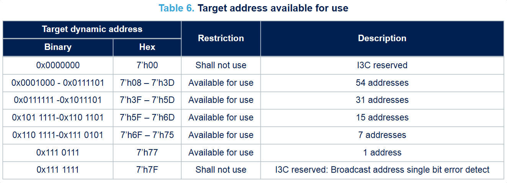

I3C 总线数据格式, 基本是单个或多个这样的片段拼起来的

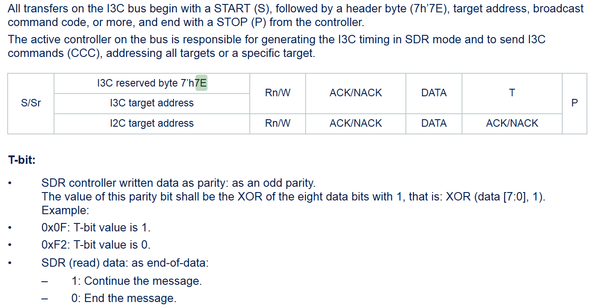

片段内部的速率并不是恒定的, 会在 OD 和 PP 间来回切换, 如

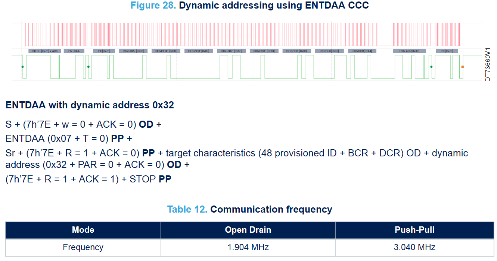

### I3C 常见缩写

- S = START, 起始
- Sr = repeated START, 重复/重新起始位, 与 S 区别是无需先发P(停止位)
- P = STOP, 停止
- T: Transition bit (parity bit for write data) from controller
- T*: transition bit (end of data for read data) from controller and/or from target.
- ACK = acknowledge, acknowledge from the addressed target without handoff
- NACK = not acknowledged
- 7h'7E 或 7'h30, 7是7bit二进制数如I3C的7bit地址, h hex 十六进制, 后面的十六进制数取低7bit. 7h'7E 是 I3C 的广播地址
- W, Write, 写
- R, Read, 读
- A, Address 地址
- D, Data 数据
- OD, Open Drain 开漏
- PP, Push Pull 推挽
- PAR, Parity, 校验位

### CubeMX 配置选项

以 STM32H503 I3C1 的 Controller 模式为例, 主时钟是250MHz.

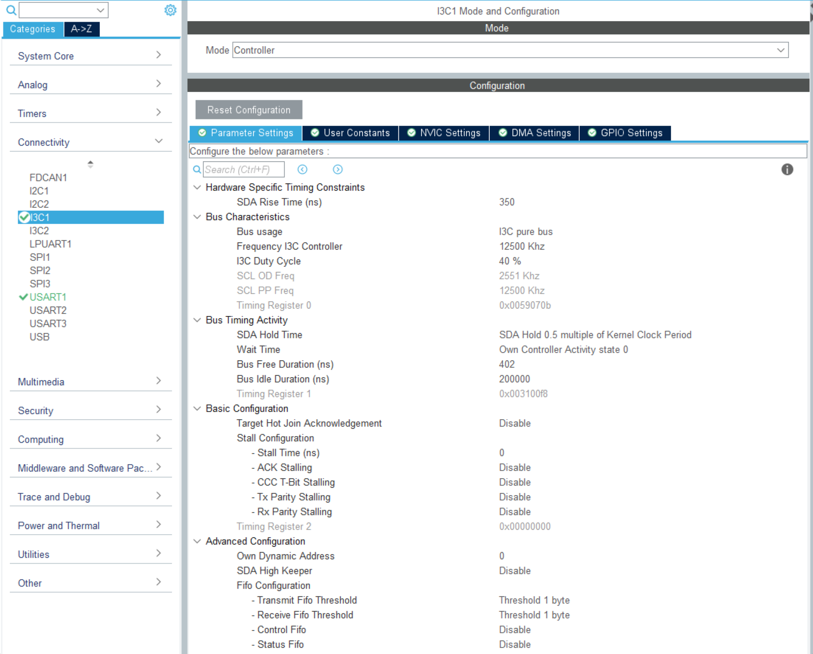

部分参数解释:

- SDA Rise Time (ns), 350(默认, 适用中等长度I3C总线), SDA 信号上升时间，单位为纳秒, 用于计算总线时序补偿，需匹配实际硬件上拉电阻和电容负载
- Bus usage, I3C pure bus, 纯I3C总线, 另一个选项是 Mixed I3C and I2C, 本篇是纯I3C
- 开漏(OD)频率 2.551MHz, 推挽(PP)频率 12.5MHz, I3C 占空比 40%. (250M / 12.5M = 20, 20 * 0.4 = 8 => 0x07 + 1, 20 * 0.6 = 12 => 0x0b + 1, 如果想设置 1MHz, 50%占空比, 就是 0x7C 0x7C)
- SDA Hold Time, SDA 数据保持时间, 保持 0.5 个内核时钟周期
- Wait Time, 主控制器和新控制器在发出启动信号前应等待的时间（ns）
- Target Hot Join Acknowledgement, Disable, 不自动响应设备的热加入请求
- Own Dynamic Address, 控制器自身动态地址, 最好是按建议的地址范围设置


## P3T1755 I3C

### P3T1755 简介

[P3T1755DP, 温度传感器, I3C, I²C, TSSOP, 12位, ±0.5°C | NXP 半导体](https://www.nxp.com.cn/products/P3T1755DP) :

- 支持2线串行I3C(高达12.5MHz 推挽模式)和I²C(高达3.4MHz)
  - I2C下支持 32 个目标地址、SMBus Alert、通用呼叫、超时功能（SDA/SCL 拉低 > 45ms 复位）
  - I3C下支持动态地址分配、IBI 带内中断（无额外中断引脚）、48 位 Provisional-ID、BCR/DCR 寄存器
- 范围 –40°C ~ +125°C, 12bit 二进制补码存于温度寄存器, 分辨率为 0.0625°C, 精度:
  - -20°C ~ +85°C 范围：±0.5°C（最大值）
  - -40°C ~ +125°C 全范围：±1°C（最大值）
- 供电电压 1.4V ~ 3.6V, 本篇用于 3.3V
- 封装 TSSOP8：3.0mmx3.0mm
- 工作模式:
  - 连续转换模式：持续测温，SD=0（默认）
  - 单触发模式（One-shot）：关断模式下触发单次测温，完成后返回关断（OS=1 启动）
  - 关断模式：仅保留 I3C/I2C 接口，最小化功耗（SD=1）
- 转换时间（可编程, 配置位 [R1 R0]）
  - [0 0] 27.5ms
  - [0 1] 55ms(默认)
  - [1 0] 110ms
  - [1 1] 220ms
- 告警功能
  - 模式选择：比较器模式（TM=0，默认）/ 中断模式（TM=1）
  - 阈值寄存器：
    - THIGH（03h）：高温阈值，默认 80°C
    - TLOW（02h）：低温阈值，默认 75°C
  - 故障队列[F1 F0]：可编程 1/2/4/6 次连续故障触发告警（默认 2 次）
  - 告警极性：POL=0（低有效，默认）/ POL=1（高有效）

### 原理图与PCB

做了一批 P3T1755 的板子, 放到了 XY 上:

- 纯 I3C 模式, SDA SCL 的上拉电阻不贴, 支持带内中断, 也无需连接 ALERT# 引脚
- A0 A1 A2 用于配置地址
- 3.3V 供电

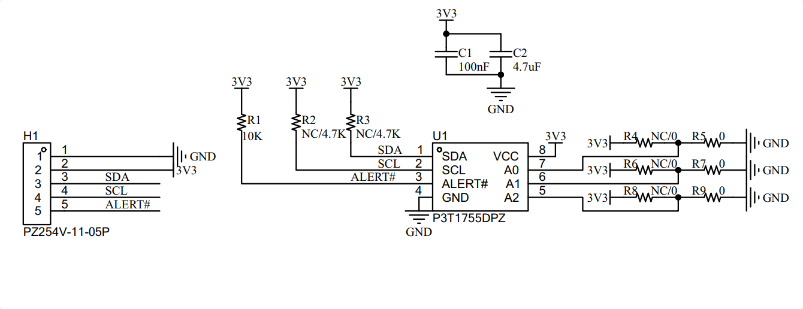

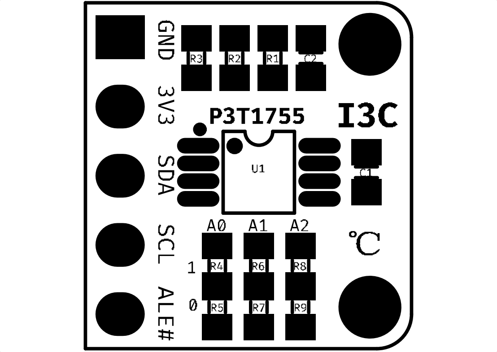

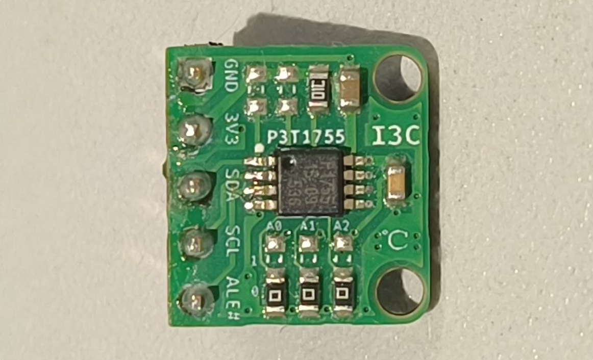

### 支持的 CCC 命令

标准文档里 CCC 命令很多, 有些是必须支持的, 有些是选择支持的, P3T1755 支持的 CCC 命令:

| CCC 类型     | 命令代码 | 命令名称  | 默认设置 | 核心功能描述                                                 |
| ------------ | -------- | --------- | -------- | ------------------------------------------------------------ |
| **广播命令** | 0x00     | ENEC      | 启用     | 全局启用目标设备的事件驱动中断（如 IBI）                     |
|              | 0x06     | RSTDAA    | -        | 全局重置所有设备的动态地址分配状态，清除当前动态地址，等待重新分配 |
|              | 0x07     | ENTDAA    | -        | 全局触发动态地址分配流程，仅未分配动态地址的设备参与         |
| **直接命令** | 0x80     | ENEC      | 启用     | 针对单个目标设备启用事件驱动中断（如 IBI）                   |
|              | 0x81     | DISEC     | 禁用     | 针对单个目标设备禁用事件驱动中断（如 IBI）                   |
|              | 0x87     | SETDASA   | -        | 通过静态地址为指定设备分配动态地址（推荐在 ENTDAA 前使用）   |
|              | 0x88     | SETNEWDA  | -        | 为已分配动态地址的设备重新分配新动态地址                     |
|              | 0x8D     | GETPID    | -        | 读取目标设备的 48 位 Provisional-ID（PID）                   |
|              | 0x8E     | GETBCR    | -        | 读取目标设备的总线特性寄存器（BCR）                          |
|              | 0x8F     | GETDCR    | -        | 读取目标设备的设备特性寄存器（DCR）                          |
|              | 0x90     | GETSTATUS | -        | 读取目标设备的运行状态寄存器                                 |
|              | 0x9A     | RSTACT    | -        | 配置并查询目标设备的复位操作和时序                           |

如 SETDASA 0x87 通过静态地址(下图0x48)分配动态地址(0x30) 的示例(1MHz, 图中 60 应为 LA 解码错误):

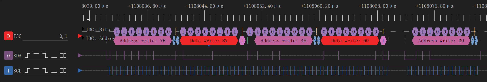

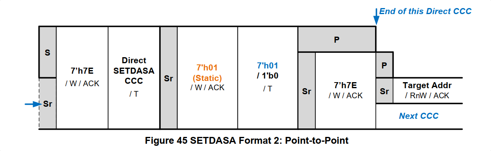

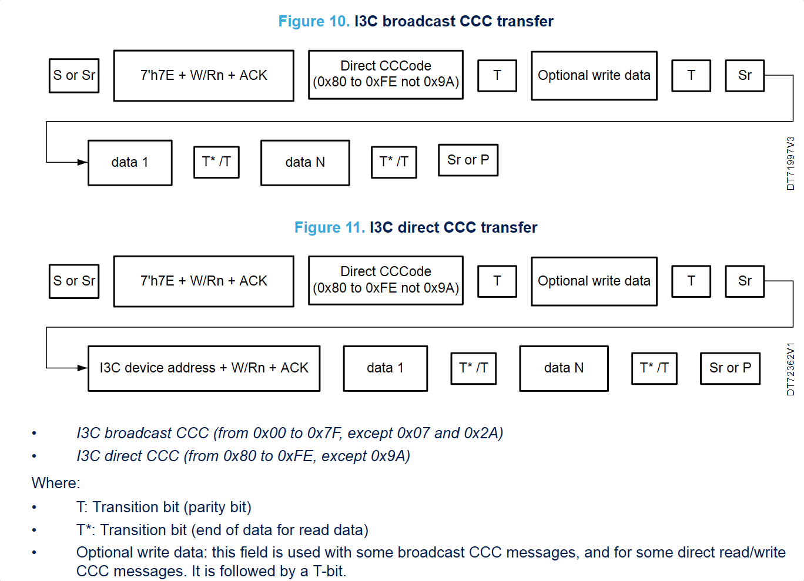

### 目标地址 

I3C 动态分配地址之前, 也是需要不同器件有不同的静态地址的, P3T1755 的地址分配引脚:

- A2  可以连接 GND VCC
- A1 A0 可以连接 GND VCC SDA SCL
- 合计 2 x 4 x 4 = 32 种静态地址, 参考下表, 地址 7’h5E 在 I2C 下可用, 在纯I3C下应避免
- 上面的 PCB 上可以通过移动电阻配置最常用的 8 种地址

32种硬件配置地址表

| 序号   | A2 引脚配置 | A1 引脚配置 | A0 引脚配置 | I2C 目标地址（7bit/7’hXX） | I3C PID BITS [11:0]（二进制 / 十六进制） | 备注                                       |
| ------ | ----------- | ----------- | ----------- | -------------------------- | ---------------------------------------- | ------------------------------------------ |
| 1      | 0           | 0           | SDA         | 1000000 / 7’h40            | 000010000000 / 0x800                     | -                                          |
| 2      | 0           | 0           | SCL         | 1000001 / 7’h41            | 000010000010 / 0x802                     | -                                          |
| 3      | 0           | 1           | SDA         | 1000010 / 7’h42            | 000010000100 / 0x804                     | -                                          |
| 4      | 0           | 1           | SCL         | 1000011 / 7’h43            | 000010000110 / 0x806                     | -                                          |
| 5      | 1           | 0           | SDA         | 1000100 / 7’h44            | 000010001000 / 0x808                     | -                                          |
| 6      | 1           | 0           | SCL         | 1000101 / 7’h45            | 000010001010 / 0x80A                     | -                                          |
| 7      | 1           | 1           | SDA         | 1000110 / 7’h46            | 000010001100 / 0x80C                     | -                                          |
| 8      | 1           | 1           | SCL         | 1000111 / 7’h47            | 000010001110 / 0x80E                     | -                                          |
| **9**  | **0**       | **0**       | **0**       | **1001000 / 7’h48**        | **000010010000 / 0x810**                 | **-**                                      |
| **10** | **0**       | **0**       | **1**       | **1001001 / 7’h49**        | **000010010010 / 0x812**                 | **-**                                      |
| **11** | **0**       | **1**       | **0**       | **1001010 / 7’h4A**        | **000010010100 / 0x814**                 | **-**                                      |
| **12** | **0**       | **1**       | **1**       | **1001011 / 7’h4B**        | **000010010110 / 0x816**                 | **-**                                      |
| **13** | **1**       | **0**       | **0**       | **1001100 / 7’h4C**        | **000010011000 / 0x818**                 | **-**                                      |
| **14** | **1**       | **0**       | **1**       | **1001101 / 7’h4D**        | **000010011010 / 0x81A**                 | **-**                                      |
| **15** | **1**       | **1**       | **0**       | **1001110 / 7’h4E**        | **000010011100 / 0x81C**                 | **-**                                      |
| **16** | **1**       | **1**       | **1**       | **1001111 / 7’h4F**        | **000010011110 / 0x81E**                 | **-**                                      |
| 17     | 0           | SDA         | SDA         | 1010000 / 7’h50            | 000010100000 / 0x820                     | -                                          |
| 18     | 0           | SDA         | SCL         | 1010001 / 7’h51            | 000010100010 / 0x822                     | -                                          |
| 19     | 0           | SCL         | SDA         | 1010010 / 7’h52            | 000010100100 / 0x824                     | -                                          |
| 20     | 0           | SCL         | SCL         | 1010011 / 7’h53            | 000010100110 / 0x826                     | -                                          |
| 21     | 1           | SDA         | SDA         | 1010100 / 7’h54            | 000010101000 / 0x828                     | -                                          |
| 22     | 1           | SDA         | SCL         | 1010101 / 7’h55            | 000010101010 / 0x82A                     | -                                          |
| 23     | 1           | SCL         | SDA         | 1010110 / 7’h56            | 000010101100 / 0x82C                     | -                                          |
| 24     | 1           | SCL         | SCL         | 1010111 / 7’h57            | 000010101110 / 0x82E                     | -                                          |
| 25     | 0           | SDA         | 0           | 1011000 / 7’h58            | 000010110000 / 0x830                     | -                                          |
| 26     | 0           | SDA         | 1           | 1011001 / 7’h59            | 000010110010 / 0x832                     | -                                          |
| 27     | 0           | SCL         | 0           | 1011010 / 7’h5A            | 000010110100 / 0x834                     | -                                          |
| 28     | 0           | SCL         | 1           | 1011011 / 7’h5B            | 000010110110 / 0x836                     | -                                          |
| 29     | 1           | SDA         | 0           | 1011100 / 7’h5C            | 000010111000 / 0x838                     | -                                          |
| 30     | 1           | SDA         | 1           | 1011101 / 7’h5D            | 000010111010 / 0x83A                     | -                                          |
| 31     | 1           | SCL         | 0           | 1011110 / 7’h5E            | 000010111100 / 0x83C                     | 不支持 I3C SETDASA 命令，纯 I3C 模式不可用 |
| 32     | 1           | SCL         | 1           | 1011111 / 7’h5F            | 000010111110 / 0x83E                     | -                                          |

### PID BCR DCR

**Provisioned ID**（PID，48 位设备标识）, 可通过 I3C 的 CCC 命令 **GETPID（0x8D）** 读取, 包含厂商、设备、配置、版本等信息:

- BITS[47:33], 15bit 厂商 ID, 0x011B（二进制：0000 0001 0001 1011）对应 NXP
- BITS[32], 1bit 标识类型（随机 / 结构化）, 0 代表结构化 ID, 不是随机生成的
- BITS[31:16], 16bit 设备 ID, 0x1520（二进制：0001 0101 0010 1010）是 P3T1755 专属
- BITS[15:12], 4bit 实例 ID, 对应 A0/A1/A2 引脚配置的硬件实例标识
- BITS[11:0], 12bit 设备版本 / I2C 地址映射, 参考上表中的 `I3C PID BITS [11:0]（二进制 / 十六进制）` 列

**Bus Characterization Register (BCR)**, 总线特征寄存器, 0x03, 仅为**I3C 目标设备**, 不支持 I3C 协议的可选高级功能, 非虚拟目标设备, 不挂载下游子设备, 始终响应 I3C 总线命令，无离线模式, IBI（带内中断）无后续数据字节，仅发送中断标识, **支持 IBI 带内中断**（I3C 核心中断方式，无需 ALERT 引脚）, 对 I3C 总线数据速率存在硬件限制（推挽模式最高 12.5MHz，开漏模式按标准时序）

**Device Characteristic Register (DCR)** , 设备特征寄存器, 参考 [I3C Device Characteristics Register | MIPI](https://www.mipi.org/MIPI_I3C_device_characteristics_register), 温度传感器对应 0x63

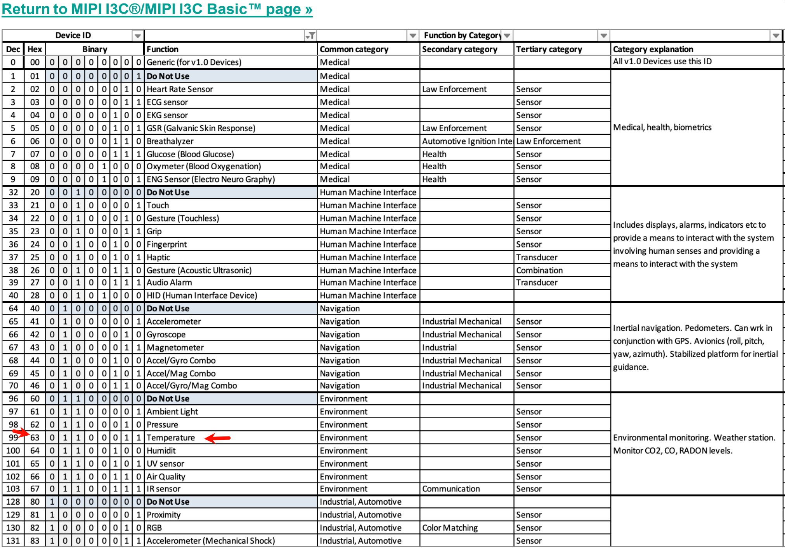

PID BCR DCR 值的读取可以通过 CCC 命令 GETPID GETBCR GETDCR, 也可以尝试 ENTDAA 0x07 辅助采集, 如下(1MHz, PID 0x0236152A0090, BCR 0x03, DCR 0x63):

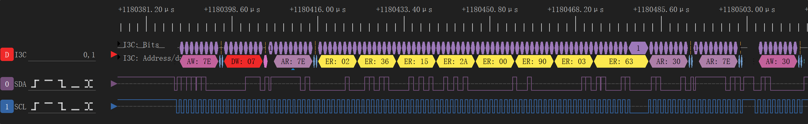

### 核心寄存器

| 寄存器名称 | 指针地址 | 读写属性 | 功能描述                                         |
| ---------- | -------- | -------- | ------------------------------------------------ |
| Temp       | 00h      | 只读     | 存储 12 位测温数据（2 字节，低 4 位无效）        |
| Conf       | 01h      | 读写     | 配置工作模式、告警极性、故障队列、转换时间       |
| TLOW       | 02h      | 读写     | 低温阈值寄存器（2 字节，补码格式）               |
| THIGH      | 03h      | 读写     | 高温阈值寄存器（2 字节，补码格式）               |
| 指针寄存器 | -        | 不可访问 | 8 位，低 2 位选择目标寄存器（上电默认选择 Temp） |

如读取 动态地址 0x30 设备的 0x00 Temp 寄存器, 读到 0x1A60. 图中可以看到, 前面波形稀疏的是 2.551MHz 的开漏模式, 后面波形密集的是 12.5MHz 的推挽模式

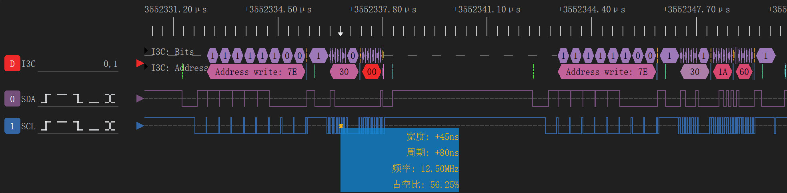

对应

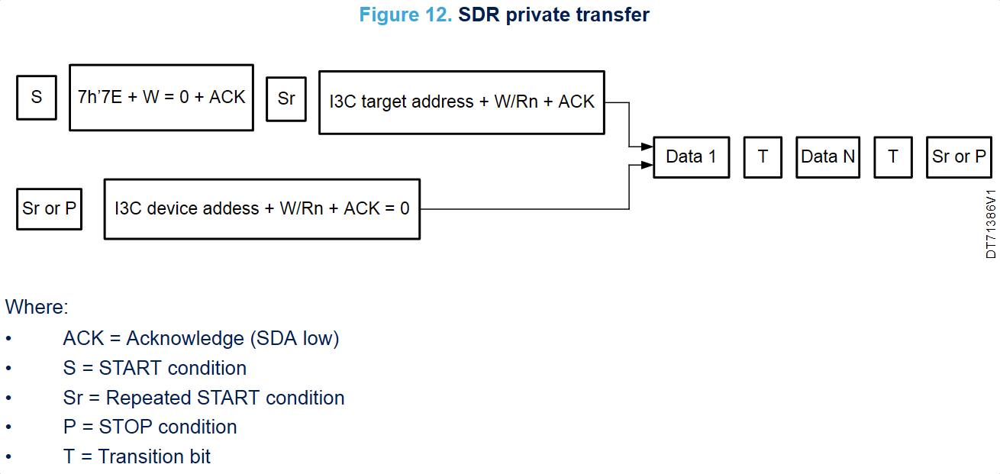

参考手册, 去掉低 4 bit, 0x1A6 * 0.0625 = 26.375 ℃

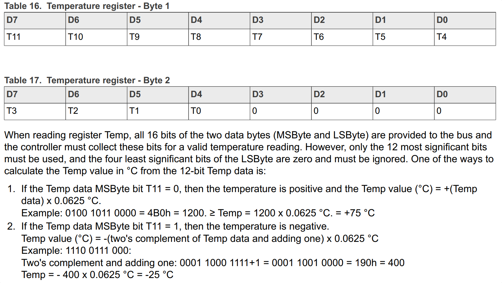


Configuration配置寄存器 0x2A:

- bit 7, OS, One-Shot, 不论单发还是连续总会读到0
- bit [6..5], [R1 R0], 01, 转换时间, 55ms
- bit [4..3], [F1 F0], 01, Fault queue, 2次连续故障触发告警
- bit 2, POL, Polarity, 0, ALERT pin becomes active low
- bit1, TM, Thermostat mode, 1, 中断模式
- bit 0, SD, Shutdown mode, 0, 连续转换状态


## STM32H5 P3T1755 I3C 测试

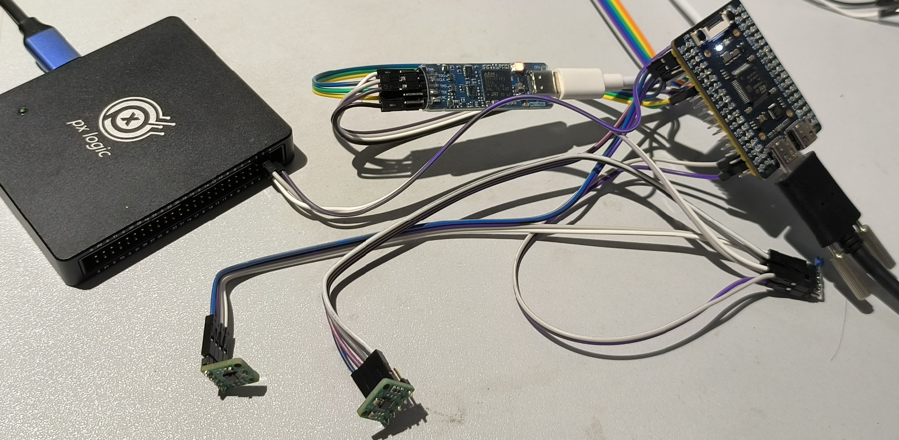

工程源码: [https://github.com/weifengdq/embedded](https://github.com/weifengdq/embedded)

引脚:

- I3C: SDA=PC9 SCL=PC8
- Debug UART: TX=PA2 RX=PA1

接了 2 个 P3T1755, 静态地址分别为 0x48 和 0x4C

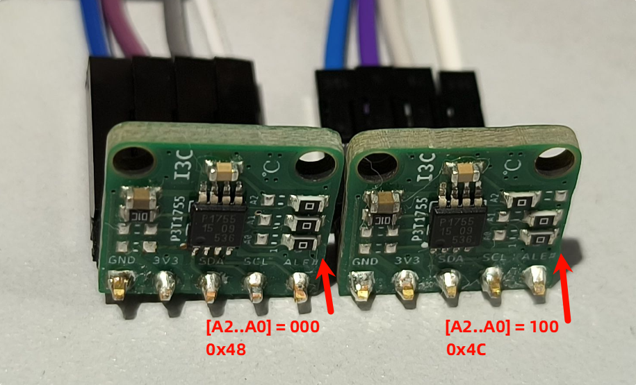

工程编译与下载(stlink)

```bash
## 工具链, 用 STM32CubeCLI 或 直接套 STM32CubeIDE 的
$TOOLCHAIN_BIN = 'C:\ST\STM32CubeIDE_2.1.0\STM32CubeIDE\plugins\com.st.stm32cube.ide.mcu.externaltools.gnu-tools-for-stm32.14.3.rel1.win32_1.0.100.202602081740\tools\bin'


.\build.ps1 build
.\build.ps1 flash
```

串口日志

```bash
=== stm32h503_i3c_p3t1755 ===
  board        : STM32H503 / I3C1 / USART1
  i3c pins     : SDA=PC9 SCL=PC8
  uart pins    : TX=PA2 RX=PA1
  static scan  : 0x48..0x4F
  dynamic base : 0x30
  [init] CCC TX DISEC  target=0x7E data=08
  [init] CCC TX RSTDAA target=0x7E

[init] Static Address Discovery
  [init] CCC TX SETDASA target=0x48 data=60
  target[1]
    static      : 0x48
    dynamic     : 0x30
    method      : SETDASA
  [init] CCC TX SETDASA target=0x49 data=62
  [init] CCC TX SETDASA target=0x4A data=62
  [init] CCC TX SETDASA target=0x4B data=62
  [init] CCC TX SETDASA target=0x4C data=62
  target[2]
    static      : 0x4C
    dynamic     : 0x31
    method      : SETDASA
  [init] CCC TX SETDASA target=0x4D data=64
  [init] CCC TX SETDASA target=0x4E data=64
  [init] CCC TX SETDASA target=0x4F data=64

[init] ENTDAA Identity Correlation
  [init] CCC TX DISEC  target=0x7E data=08
  [init] CCC TX RSTDAA target=0x7E
  target[1]
    static      : 0x48
    strategy    : isolate peers then ENTDAA
  [init] CCC TX SETDASA target=0x4C data=62
    parked peer : static=0x4C dynamic=0x31
  [init] CCC TX ENTDAA target=0x7E
    dynamic     : 0x30
    pid         : 0x0236152A0090
    bcr         : 0x03
    dcr         : 0x63
  [init] CCC TX DISEC  target=0x7E data=08
  [init] CCC TX RSTDAA target=0x7E
  target[2]
    static      : 0x4C
    strategy    : isolate peers then ENTDAA
  [init] CCC TX SETDASA target=0x48 data=60
    parked peer : static=0x48 dynamic=0x30
  [init] CCC TX ENTDAA target=0x7E
    dynamic     : 0x31
    pid         : 0x0236152A0098
    bcr         : 0x03
    dcr         : 0x63

[init] Target Summary
  count        : 2
  target[1]
    static      : 0x48
    dynamic     : 0x30
    pid         : 0x0236152A0090
    pid.mfg     : 0x011B
    pid.idsel   : 0
    pid.part    : 0x152A
    pid.inst    : 0x0
    bcr         : 0x03
    bcr.ibi     : 1
    bcr.payload : 0
    bcr.roleReq : 0
    bcr.offline : 0
    bcr.virtual : 0
    bcr.adv     : 0
    bcr.speed   : 1
    dcr         : 0x63
  target[2]
    static      : 0x4C
    dynamic     : 0x31
    pid         : 0x0236152A0098
    pid.mfg     : 0x011B
    pid.idsel   : 0
    pid.part    : 0x152A
    pid.inst    : 0x0
    bcr         : 0x03
    bcr.ibi     : 1
    bcr.payload : 0
    bcr.roleReq : 0
    bcr.offline : 0
    bcr.virtual : 0
    bcr.adv     : 0
    bcr.speed   : 1
    dcr         : 0x63
I3C bus timing switched to 12.5MHz for private SDR transfers
T1[0x48->0x30]=1A60/conf=0x2A/26.375 C T2[0x4C->0x31]=1A60/conf=0x2A/26.375 C
IBI setup for T1[0x48->0x30] tempRaw=1A60 temp=26.375 C
Config updated for interrupt mode: 0x2A
IBI thresholds programmed: T_LOW=27.375 C T_HIGH=27.875 C
  [init] CCC TX ENEC   target=0x30 data=01
IBI enabled for T1[0x48->0x30]
IBI setup for T2[0x4C->0x31] tempRaw=1A60 temp=26.375 C
Config updated for interrupt mode: 0x2A
IBI thresholds programmed: T_LOW=27.375 C T_HIGH=27.875 C
  [init] CCC TX ENEC   target=0x31 data=01
IBI enabled for T2[0x4C->0x31]
T1[0x48->0x30]=1A60/conf=0x2A/26.375 C T2[0x4C->0x31]=1A60/conf=0x2A/26.375 C
T1[0x48->0x30]=1A60/conf=0x2A/26.375 C T2[0x4C->0x31]=1A60/conf=0x2A/26.375 C
T1[0x48->0x30]=1A50/conf=0x2A/26.312 C T2[0x4C->0x31]=1A60/conf=0x2A/26.375 C
T1[0x48->0x30]=1A50/conf=0x2A/26.312 C T2[0x4C->0x31]=1A60/conf=0x2A/26.375 C
T1[0x48->0x30]=1AB0/conf=0x2A/26.687 C T2[0x4C->0x31]=1BF0/conf=0x2A/27.937 C
IBI event: T2[0x4C->0x31] payload=0x00000000 tempRaw=1CF0 conf=0x2A temp=28.937 C
T1[0x48->0x30]=1B20/conf=0x2A/27.125 C T2[0x4C->0x31]=1CF0/conf=0x2A/28.937 C
T1[0x48->0x30]=1AC0/conf=0x2A/26.750 C T2[0x4C->0x31]=1C20/conf=0x2A/28.125 C
T1[0x48->0x30]=1AB0/conf=0x2A/26.687 C T2[0x4C->0x31]=1BD0/conf=0x2A/27.812 C
T1[0x48->0x30]=1A90/conf=0x2A/26.562 C T2[0x4C->0x31]=1B90/conf=0x2A/27.562 C
IBI event: T2[0x4C->0x31] payload=0x00000000 tempRaw=1B40 conf=0x2A temp=27.250 C
T1[0x48->0x30]=1A80/conf=0x2A/26.500 C T2[0x4C->0x31]=1B40/conf=0x2A/27.250 C
T1[0x48->0x30]=1A80/conf=0x2A/26.500 C T2[0x4C->0x31]=1AE0/conf=0x2A/26.875 C
T1[0x48->0x30]=1A80/conf=0x2A/26.500 C T2[0x4C->0x31]=1AB0/conf=0x2A/26.687 C
T1[0x48->0x30]=1A80/conf=0x2A/26.500 C T2[0x4C->0x31]=1AC0/conf=0x2A/26.750 C
```

部分说明:

- 初始时用的 1MHz 进行配置, 对0x48..0x4F的静态地址进行了扫描, 识别出了 2个器件 0x48 和 0x4C, 分配了动态ID 0x30 和 0x31, 也读出了 PID BCR DCR 寄存器
- 切换到最大 12.5MHz(推挽, 开漏对应2.551MHz) 进行温度和 Conf 寄存器的读取, 读出一次后, 为了方便测试, IBI 设置高1℃为 T_LOW, 设置高1.5℃为 T_HIGH, 使能 IBI
- 进入1s一次的打印, 用嘴对着 T2 温度传感器吹气, 温度升高到 28.937℃, 高于 T_HIGH 的 27.875℃, 触发IBI event, 之后温度下降到低于 T_LOW 的 27.375℃, 再次触发 IBI event

P3T1755的带内中断后是没有跟具体数据信息的

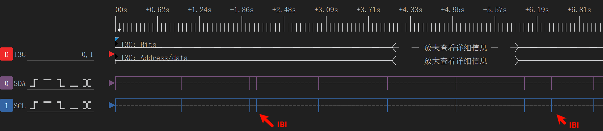

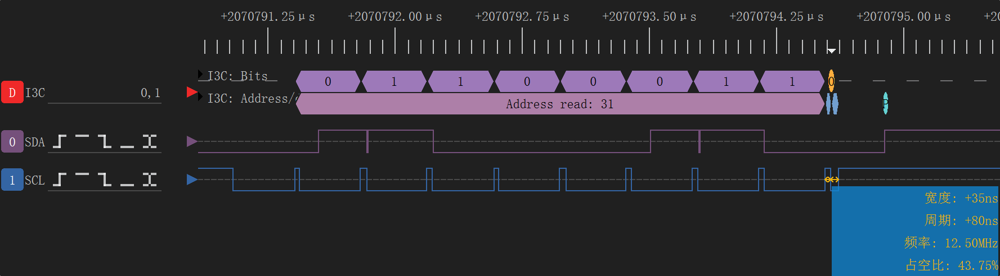


## 开源链接

原理图和测试工程的Github链接: https://github.com/weifengdq/embedded

Q(`嵌入式_机器人_自动驾驶`)交流群: 1040239879