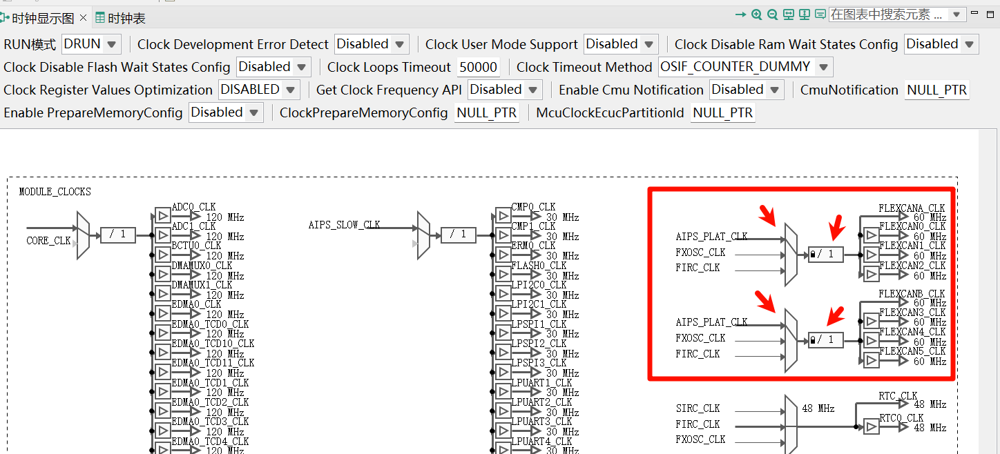

# S32K3

- [S32K3](#s32k3)
  - [S32K312 评估板概览](#s32k312-评估板概览)
  - [硬件设计](#硬件设计)
    - [电源](#电源)
    - [时钟](#时钟)
    - [复位](#复位)
    - [调试](#调试)
    - [LED](#led)
    - [串口](#串口)
    - [CAN](#can)
  - [开发环境搭建](#开发环境搭建)
    - [S32DS](#s32ds)
    - [RTD](#rtd)
    - [JTAG 设置](#jtag-设置)
  - [新建工程 LED Blink](#新建工程-led-blink)
    - [新建工程](#新建工程)
    - [引脚配置](#引脚配置)
    - [时钟配置](#时钟配置)
    - [外设配置](#外设配置)
    - [代码修改](#代码修改)
    - [工程编译](#工程编译)
    - [代码调试](#代码调试)
  - [HEX 文件生成](#hex-文件生成)
  - [烧录](#烧录)
    - [JFlash](#jflash)
    - [DAP-Link Utility](#dap-link-utility)
  - [导入工程](#导入工程)
  - [重命名工程](#重命名工程)
  - [UART 2M](#uart-2m)
  - [CANFD 1M+5M](#canfd-1m5m)
    - [Message Buffer 划分](#message-buffer-划分)
    - [Header 定义](#header-定义)
    - [图形配置](#图形配置)
    - [代码编写](#代码编写)
    - [收发测试](#收发测试)
  - [6路 CANFD](#6路-canfd)
    - [引脚 时钟 FlexCAN 中断](#引脚-时钟-flexcan-中断)
    - [代码编写](#代码编写-1)
    - [指定内存区域](#指定内存区域)
    - [收发测试](#收发测试-1)
  - [交流群与板子购买](#交流群与板子购买)


## S32K312 评估板概览

NXP S32K312 评估板:

- [**S32K312NHT0VPAST**](https://item.szlcsc.com/5890293.html?fromZone=s_s__%22S32K312%22&spm=sc.gbn.xh2.zy.n___sc.hm.hd.ss&lcsc_vid=R1YKVVACRVRYAQBTQwdfBQcHQQMIAlFfFFVdBQZRFVcxVlNTRVBfXlJXR1hbUDtW),  1 x M7 core, 120M, 2MB P-Flash, 192KB SRAM, -40 °C to 105 °C, MaxQFP-100 封装, 外部 16M 晶振
- [USB转高速串口芯片 CH343](https://www.wch.cn/products/CH343.html), 最高可支持到 6Mbps
- 6路CANFD接口, 收发器型号 [**TCAN1044VDRBRQ1**](https://item.szlcsc.com/5911591.html?fromZone=s_s__%22C5215851%22&spm=sc.gbn.xh1.zy.n___sc.hm.hd.ss&lcsc_vid=QlkKU1VeFFcMV1MFFlAIXgdWTlVZBVxXTwALXlAAFQUxVlNTRVBfXl1UQVBeUzsOAxUeFF5JWBIBSRccGwIdBEoFGAxBAAgJFQACSQwSGg0%3D), AEC-Q100, 支持到 8Mbps, 通过 [**KF2EDGR-3.81-12P**](https://item.szlcsc.com/441153.html?fromZone=s_s__%223.81-12P%22&spm=sc.gbn.xh2.zy.n&lcsc_vid=QlkKU1VeFFcMV1MFFlAIXgdWTlVZBVxXTwALXlAAFQUxVlNTRVBcUlVfQlRXUzsOAxUeFF5JWBIBSRccGwIdBEoFGAxBAAgJFQACSQwSGg0%3D) 绿色插座引出, 配套插头为 [**KF2EDGK-3.81-12P**](https://item.szlcsc.com/440829.html?fromZone=s_s__%223.81-12P%22&spm=sc.gbn.xh3.zy.n&lcsc_vid=QlkKU1VeFFcMV1MFFlAIXgdWTlVZBVxXTwALXlAAFQUxVlNTRVBcUlVfQlRXUzsOAxUeFF5JWBIBSRccGwIdBEoFGAxBAAgJFQACSQwSGg0%3D)
- 引出所有的 100PIN 引脚
- 其它: RST按键, 用户LED, SWD接口, 1.27_2*5P JTAG接口, TypeC 或 排针5V 供电


## 硬件设计

[S32K312](https://www.nxp.com.cn/products/S32K3) 的硬件资源:


硬件设计参考资料:

-  `S32K3 MCUs for General Purpose – Hardware Design Package` 中的 `S32K3xx - Hardware Design Guidelines -- Rev_E2.pdf` 文档
- [S32K31XEVB-Q100 Evaluation Board | NXP 半导体](https://www.nxp.com.cn/design/design-center/development-boards-and-designs/S32K31XEVB-Q100), 官方的评估板设计文件
- S32DS 的 引脚配置工具

### 电源

有以下电源类型:

- VDD_HV_A, 主 I/O 和模拟电源电压, 3.3V 或 5V
- VREFH, ADC 高参考电压
- V11, 内部生成的核心逻辑电压供应 (+1.1 V), 外接电容即可
- V25, 内部产生的闪存电源 (+2.5 V), 外接电容即可


对于 S32K312 100PIN, 单 3.3V 供电即可.

### 时钟

S32K3xx MCU有以下时钟源:

- 8 ~ 40 MHz Fast External Oscillator (FXOSC), 外部晶振
- 48 MHz Fast Internal RC oscillator (FIRC)
- 32 kHz Low Power Oscillator (SIRC)
- 32 kHz Slow External Oscillator (SXOSC)
- Up to 320 MHz System Phased Lock Loop (SPLL)

选 16MHz 无源晶振即可, 因为官方评估板就是这个, S32DS默认新工程也是这个, 立创基础库也有这个, 一般外部搭配 12~20pF 电容使用


下面是 S32DS 里面 S32K312 默认新工程的时钟树:


### 复位

对于所有复位源，RESET_B 引脚(PTA5)均由 MCU 驱动至低电平至少 128 个总线时钟周期，直至闪存初始化完成。闪存初始化完成后，RESET_B 引脚释放，内部芯片复位。保持 RESET_B 引脚外部有效可延迟内部芯片复位的取消。有内部弱上拉。继续使用 10K + 100nF或1uF 的经典组合即可。


### 调试

SWD 或 JTAG


一般 SWD 接口即可:

- SWCLK, PTC4
- SWDIO, PTA4
- 建议加上 RESET_B PTA5 引脚方便直接复位运行


如图连接了 3V3 DIO CLK GND RST 5根线到 Jlink 的 Vref SWDIO SWCLK GND RESET 上:


JTAG 接口有常见的 `2.54_2*10P 20PIN` 和 `1.27_2*5P 10PIN` 两种接口, 后者 7 9 有的调试器拿来做调试串口, 有的直接接地, 这里为了避免冲突, 直接悬空, 如下图:


因为 100PIN 都引出来了, 所以 JTAG 用杜邦线连接的也可以直接插到引出的 2.54 排针上.

### LED

板载两个 LED:

- PWR, 3.3V 电源指示灯
- USR, 用户LED, 低电平点亮, 接到了 PTB10


### 串口

调试串口:

- LPUART0_RX, PTC2
- LPUART0_TX, PTC3


### CAN

6路CANFD的引脚映射:

| CANx | 引脚TX | 引脚RX |
| ---- | ------ | ------ |
| 0    | A7     | A6     |
| 1    | C8     | C9     |
| 2    | C15    | C14    |
| 3    | C0     | C1     |
| 4    | B3     | B2     |
| 5    | C10    | C11    |

其中 CAN5 的原理图:


这里 120Ω 最终还是全贴上了, 方便调试, 毕竟调试时多了问题不大, 忘了没有就问题很大.

实际项目也可选择贴共模电感和把120Ω拆成两个60Ω, 如下图


## 开发环境搭建

需要先到 [恩智浦半导体官方网站 | NXP 半导体](https://www.nxp.com.cn/) 官网注册帐号. 

大部分选用官方的 S32DS, 之前 S32K1 时也可以用 Keil MDK, 方便使用 DAP_Link 等, 但还是推荐 NXP 官方的 IDE. S32DS 新建工程默认支持 PEMicro, JTAG 等调试器. 如果不调试只下载, 那么 DAP Link, HSLinkPro/MicroLink, 硬汉的安富莱 等都是可以下载程序的.

[Real-Time Drivers (RTD)](https://www.nxp.com.cn/design/design-center/software/automotive-software-and-tools/real-time-drivers-rtd:AUTOMOTIVE-RTD#downloads) SDK 支持AUTOSAR®(配合EB)和非AUTOSAR应用上的实时软件, 大概是大家常说的 RTD MCAL 和 RTD LLD 两种开发方式.

这里为方便快速验证硬件, 开发环境为非AUTOSAR的 [S32K3 Standard Software](https://nxp.flexnetoperations.com/control/frse/product?entitlementId=719331357&lineNum=1&authContactId=136826597&authPartyId=151684767):

- IDE: S32DS 3.6.2
- SDK: RTD 6.0.0

### S32DS

[Design : Product Information : Automotive SW - S32K3 - S32 Design Studio](https://nxp.flexnetoperations.com/control/frse/product?child_plneID=831967):


同意许可


下载完后双击, 一步步安装即可, 现在也不需要 License Key 了, 可能需要注意的是 同意许可需要鼠标拉到最下面才能勾选, 还有安装路径的修改:


装完占用 11.7GB 空间, 

常用的开发组件都可以在 S32DS Extensions and  Updates 里面安装或更新, 如 GCC, Configuration Tools, S32K3xx development package 等:


### RTD

[Design : Product Information : Automotive SW - S32K3/S32M27x - Real-Time Drivers for Cortex-M](https://nxp.flexnetoperations.com/control/frse/product?child_plneID=830617)


同意许可, 下图中的 exe 用于 AutoSAR EB 方式, 此处不用, 只需 updatesite.zip 即可


下载完后无需解压, 打开 S32DS:

至于上面 updatesite.zip 这类的安装包:


Next, accept, 中间还会弹出信任组件:


装完以后, 才能 S32DS 新建工程时找到 SDKs


### JTAG 设置

之前买的 V11 仿真器在 J-Link 7.9x 版本下使用正常, 但在 S32K3 默认的驱动版本 8.28 不匹配


S32DS 安装的路径下 `D:\NXP\S32DS.3.6.2\Drivers\Segger` 的四个文件替换成 V7.9x 的即可, 可以用 Everything 辅助查找


这样 IDE 里面就能正常调试了

## 新建工程 LED Blink

### 新建工程

打开 S32DS, 多个 S32DS 可以同时打开, 但需要选择(Choose)不同的工作目录


File -> New -> S32DS Application Project 新建新工程, 下面也有库工程和从官方例子中导入工程


找到芯片, 输入工程名


调试器 Jlink, SDK 选 6.0.0


### 引脚配置

双击 .mex 文件打开配置工具


更换封装


引脚列取消默认的 PTA0 引脚配置, 然后找到 PTB10, 选择 `SIUL2:gpio,42`, 方向输出 Output


标签和标识符取名 LED1


默认输出电平 LOW, 可以不改或改成 HIGH


### 时钟配置

**时钟配置**可以不用修改, 默认外部晶振 16MHz, 系统时钟 120MHz


### 外设配置

点开外设配置, 加入DIO组件


Port组件可以默认不修改


DIO 组件没有什么配置的, 也保持默认. 点击更新源代码


### 代码修改

回到代码编辑界面, 添加 Blink 需要的简易代码, main.c 文件中

```c
#include "Siul2_Dio_Ip.h"
#include "Siul2_Port_Ip.h"

Siul2_Port_Ip_Init(
      NUM_OF_CONFIGURED_PINS_PortContainer_0_BOARD_InitPeripherals,
      g_pin_mux_InitConfigArr_PortContainer_0_BOARD_InitPeripherals);

Siul2_Dio_Ip_WritePin(LED1_PORT, LED1_PIN, 0);
for(volatile int i = 0; i < 1000000; i++);
Siul2_Dio_Ip_WritePin(LED1_PORT, LED1_PIN, 1);
for(volatile int i = 0; i < 1000000; i++);
```

如图:


### 工程编译

工程右键 Build Project


### 代码调试


展开 GDB SEGGER J-Link Debugging (如果没有可以右键新建配置), 可以看到默认 SWD 接口


点击 Debug, 切换视图


双击打断点, Step Over 单步执行, 右边可以查看变量等


如果想一直执行, 可以取消断点, 鼠标点到return行, 然后 run to line 运行


就可以看到 LED 在一直闪烁

## HEX 文件生成

S32DS 工程右键 Properties


勾选完后, 再随便点击最左侧某个设置项比如Logging转移一下IDE的注意力, 然后再点回来Settings页面


一般发布的 HEX 文件先把工程切换到 Release FLASH, 再编译生成 HEX 文件.


## 烧录

使用 SWD 接口连接, 外加 3.3V 接 Vref, RESET_B 接 JTAG 15PIN SRST

### JFlash


File -> Creat Project, 选择 S32K312, SWD 接口


File -> Open data file 载入HEX 文件.

然后 F7 直接烧录, F9 直接执行(可能需要连接RESET引脚) 即可:


### DAP-Link Utility


## 导入工程

File -> Import, 导入本地已有工程


选择已有的工程目录


## 重命名工程

很多时候需要改个名, 工程右键 -> Rename


输入新名称即可


## UART 2M

引脚配置:

- LPUART0_RX, PTC2
- LPUART0_TX, PTC3

这里配置成 2Mbps, 实现一个串口 echo 的硬件测试程序


时钟配置 LPUART0 的时钟默认是 60MHz


外设配置加入 Lpuart 和 中断控制IntCtrl

自定义 `60M / 2 / 15 = 2M` 波特率


设置中断的回调函数


打开中断


这里的 Handler 是和 `s32k3\s32k312_uart\RTD\include\Lpuart_Uart_Ip_Irq.c` 中的名称对应上的

点击 `更新源代码`, 然后修改 main.c

```c
#include "Clock_Ip.h"
#include "IntCtrl_Ip.h"
#include "Lpuart_Uart_Ip.h"
#include "Lpuart_Uart_Ip_Irq.h"
#include "Mcal.h"
#include "Siul2_Port_Ip.h"
#include <stdint.h>
#include <stdio.h>
#include <string.h>

const uint8 UART_INSTANCE = 0; // LPUART0
// 环形缓冲区相关定义
#define UART_RX_BUFFER_SIZE 256
uint8_t g_uart0_rx_buffer[UART_RX_BUFFER_SIZE] = {0};
uint8_t g_uart0_cmd_buf[UART_RX_BUFFER_SIZE] = {0};
volatile uint16_t g_uart0_rx_head = 0;
volatile uint16_t g_uart0_rx_tail = 0;
volatile uint8_t g_uart0_cmd_ready = 0;
volatile uint8_t g_uart0_cmd_len = 0;

void UART0_CALLBACK(const uint8 HwInstance,
                    const Lpuart_Uart_Ip_EventType Event,
                    const void *UserData) {
  (void)UserData;
  if (Event == LPUART_UART_IP_EVENT_RX_FULL) {
    // 写入数据到环形缓冲区
    uint8_t data = g_uart0_rx_buffer[g_uart0_rx_head]; // 当前收到的数据
    g_uart0_rx_head = (g_uart0_rx_head + 1) % UART_RX_BUFFER_SIZE;
    // 检查是否收到换行符
    if (data == '\n') {
      // 取出一条命令（从 tail 到 head，遇到 \n 截止）
      while (g_uart0_rx_tail != g_uart0_rx_head) {
        uint8_t ch = g_uart0_rx_buffer[g_uart0_rx_tail];
        g_uart0_rx_tail = (g_uart0_rx_tail + 1) % UART_RX_BUFFER_SIZE;
        g_uart0_cmd_buf[g_uart0_cmd_len++] = ch;
        if (ch == '\n') {
          break;
        }
      }
      g_uart0_cmd_ready = 1;
    }
    // 继续接收下一个字节
    Lpuart_Uart_Ip_SetRxBuffer(HwInstance, &g_uart0_rx_buffer[g_uart0_rx_head],
                               1);
  }
}

int main(void) {
  Clock_Ip_Init(&Clock_Ip_aClockConfig[0]);
  Siul2_Port_Ip_Init(
      NUM_OF_CONFIGURED_PINS_PortContainer_0_BOARD_InitPeripherals,
      g_pin_mux_InitConfigArr_PortContainer_0_BOARD_InitPeripherals);
  IntCtrl_Ip_Init(&IntCtrlConfig_0);
  Lpuart_Uart_Ip_Init(UART_INSTANCE, &Lpuart_Uart_Ip_xHwConfigPB_0);

  const char *message =
      "UART Ping-Pong Buffer Example\r\nType something and press enter...\r\n";
  Lpuart_Uart_Ip_SyncSend(UART_INSTANCE, (const uint8_t *)message,
                          strlen(message), 0xFFFF);
  memset(g_uart0_rx_buffer, 0, sizeof(g_uart0_rx_buffer));
  Lpuart_Uart_Ip_AsyncReceive(UART_INSTANCE, g_uart0_rx_buffer, 1);

  while (1) {
    // 检查是否收到完整命令（遇到换行符）
    if (g_uart0_cmd_ready) {
      // 处理命令, 这里原封不动发回
      if (LPUART_UART_IP_STATUS_BUSY !=
          Lpuart_Uart_Ip_GetTransmitStatus(UART_INSTANCE, NULL)) {
        Lpuart_Uart_Ip_AsyncSend(UART_INSTANCE, g_uart0_cmd_buf,
                                 g_uart0_cmd_len);
      }
      g_uart0_cmd_len = 0; // 重置命令长度
      g_uart0_cmd_ready = 0;
    }
  }

  return 0;
}

```

代码解释:

- 初始化部分, 配置时钟、端口、中断、UART 等外设。发送欢迎信息，并启动异步 1字节 接收。
- UART 回调函数 `UART0_CALLBACK`, 存放收到的字节到环形缓冲区, 遇到 `\n` 结尾取出命令, 设置标志
- 主循环, 检查标志, 处理串口命令, 此处是直接异步回传

测试, 打开串口调试助手, 2M-8-N-1, 收到欢迎语后清空, 然后每 1ms 定时发送 100字节(含回车换行), 可以看到收发字节相同:


## CANFD 1M+5M

这里以 flexcan0 为例, 配置成 CANFD 仲裁段速率1M采样点80% + 数据段5M采样点75%, 设置了 TDC, 对 CAN/CANFD/CANFD加速, 标准帧/扩展帧, 数据帧/远程帧 进行了测试.

### Message Buffer 划分

类似于 BxCAN 或 MCAN, S32K3 的 FlexCAN 也遵循 CAN 的基本配置:

- 直接配置成 CANFD 64字节 使能 BRS, 正常模式, 这样不论 CAN2.0 还是 CANFD 都能正常使用, 一劳永逸
- 主时钟一般 40/80M 居多, 60/120M 也常见, 这里使用 60M
- 仲裁段 预分频6得 10M, 然后 1+6+1+2 得 1M 和 80% 采样点
- 数据段 预分频1得 60M, 然后 1+7+1+3 得 12M 和 75% 采样点
- `MessageRAM`(MessageBuffers, MBs) 按 72B(Header_8B + Data_64B) 分, 同时还要注意 512B Block 对齐, 也就是80B对齐, 得出 RX + TX 总的Buffer数()MBs), 刚好MB也是mailbox邮箱的缩写, 这里姑且叫它邮箱吧
- RX 全接收一般占 2 个邮箱(Buffer), 用于设置一个标准帧滤波器 + 一个扩展帧滤波器
- 剩下的邮箱(Buffer)可以全给 TX, 方便能一次性填充多个
- 超过 2M 速率要配置 TDC, 一般可优先尝试 (数据段时钟 / 数据段速率 * 采样点) 的计算方式, 这里 5M 对应的 TDC 是 60M/5M*0.75 = 9

再看 S32K312 6路 CANFD 的资源:


表中:

- CAN0, CAN1, CAN2 可用 64*16 = 1024B, 刚好 2个 Block, 每个 Block 可分出 512/72= 7.111, 2 个Block合计 14个 MBs (64B负载的)
- CAN3, CAN4, CAN5 的 RX + TX 合计可用 7 MBs

**我们就按 7 个分吧, 这样 6 路都适用. 前 2 个给 RX, 后面 5 个给 TX.** 其它独有的或高级的特性也暂且不用.

附上 Block 的解释


### Header 定义

72B 的 Header 部分的定义:


图中:

- IDE, 区分 标准帧 / 扩展帧
- EDL, 区分 CAN / CANFD, 也就是常说的 FDF
- BRS, 区分 CANFD / CANFD加速, 位速率变换
- RTR, 区分 数据帧 / 远程帧

### 图形配置

切换封装到 100PIN


引脚配置:

- CAN0_TX, PTA7
- CAN0_RX, PTA6 


时钟配置成使用 AIPS_PLAT_CLK 1分频 得到 60M


FlexCAN 配置:

- 正常模式
- 64B Payload, RX+TX 7MBs, 这对于其它CAN也适用
- 使能 BRS CANFDISO 远程帧接收 自动BusOff
- 主时钟 60M, 仲裁段 1M 80%, 数据段 5M 75%
- 设置中断回调函数


中断控制器里开中断:


其中:

- Interrupt Name 是 `D:\NXP\S32DS.3.6.2\S32DS\software\PlatformSDK_S32K3\RTD\BaseNXP_TS_T40D34M60I0R0\header\S32K312_COMMON.h` 中定义了的:
  - FlexCANx_0_IRQn, 用于 Busoff (Interrupt indicating that the CAN bus went to Bus Off state)
  - FlexCANx_1_IRQn, 用于 Block0 的指示 (Message Buffer Interrupt line 0-31,ORed Interrupt for Message Buffers)
- Handler 是 `s32k3\s32k312_can0\RTD\src\FlexCAN_Ip_Irq.c` 中定义的
  - FlexCANx_0_IRQn, Busoff 对应 CAN0_ORED_IRQHandler
  - FlexCANx_1_IRQn 对应 CAN0_ORED_0_31_MB_IRQHandler

### 代码编写

概况:

- 初始化时钟, 引脚, 中断控制器
- 初始化FlexCAN驱动, 设置TDC, 设置接收滤波器(1 STD + 1 EXT), 开始接收
- 发送只用了一个 TX MB, 剩余4个暂且不用
- 连续发送 9标准帧 + 9扩展帧 + 65CANFD_BRS标准帧 + 65CANFD_BRS扩展帧, 合计 148 帧
- 收发都用到了 CircleBuffer, 深度32, 都是 Linux SocketCAN风格, 方便理解
- While 中把收到的帧原封不动回传回去

代码如下:

```c
#include "Clock_Ip.h"
#include "FlexCAN_Ip.h"
#include "FlexCAN_Ip_HwAccess.h"
#include "IntCtrl_Ip.h"
#include "Mcal.h"
#include "Siul2_Port_Ip.h"
#include <stdbool.h>
#include <stdint.h>
#include <string.h>

// Linux SocketCAN 风格
#define CAN_EFF_FLAG 0x80000000U
#define CAN_RTR_FLAG 0x40000000U
#define CAN_ERR_FLAG 0x20000000U
#define CAN_SFF_MASK 0x000007FFU
#define CAN_EFF_MASK 0x1FFFFFFFU
#define CAN_ERR_MASK 0x1FFFFFFFU
#define CANFD_BRS 0x01
#define CANFD_ESI 0x02
#define CANFD_FDF 0x04
typedef uint32_t canid_t;
struct canfd_frame {
  canid_t can_id; /* 32 bit CAN_ID + EFF/RTR/ERR flags */
  uint8_t len;    /* frame payload length in byte */
  uint8_t flags;  /* additional flags for CAN FD */
  uint8_t __res0; /* reserved / padding */
  uint8_t __res1; /* reserved / padding */
  uint8_t data[64];
};

const uint8_t FLEXCAN_INSTANCE = 0; // FlexCAN0
const uint8_t RX_STD_MB_IDX = 0;    // 接收标准帧的消息缓冲区索引
const uint8_t RX_EXT_MB_IDX = 1;    // 接收扩展帧
const uint8_t TX_MBS[5] = {2, 3, 4, 5, 6}; // 发送消息缓冲区索引

static Flexcan_Ip_DataInfoType rx_std_info = {.msg_id_type = FLEXCAN_MSG_ID_STD,
                                              .data_length = 64U,
                                              .is_polling = false,
                                              .is_remote = true};
static Flexcan_Ip_DataInfoType rx_ext_info = {.msg_id_type = FLEXCAN_MSG_ID_EXT,
                                              .data_length = 64U,
                                              .is_polling = false,
                                              .is_remote = true};
static Flexcan_Ip_MsgBuffType can_rx_msg[2];
static volatile uint8_t can_tx_busy = 0;

// 通用环形缓冲区结构体及操作函数
#define CAN_CIRCLE_BUF_SIZE 32
struct canfd_frame_circlebuf {
  struct canfd_frame buf[CAN_CIRCLE_BUF_SIZE];
  volatile uint8_t head;
  volatile uint8_t tail;
  volatile uint8_t ready;
};

static inline int
canfd_cbuf_is_empty(const struct canfd_frame_circlebuf *cbuf) {
  return cbuf->head == cbuf->tail;
}

static inline int canfd_cbuf_is_full(const struct canfd_frame_circlebuf *cbuf) {
  return ((cbuf->head + 1) % CAN_CIRCLE_BUF_SIZE) == cbuf->tail;
}

static inline int canfd_cbuf_push(struct canfd_frame_circlebuf *cbuf,
                                  const struct canfd_frame *frame) {
  if (canfd_cbuf_is_full(cbuf)) {
    return -1; // 满
  }
  memcpy(&cbuf->buf[cbuf->head], frame, sizeof(struct canfd_frame));
  cbuf->head = (cbuf->head + 1) % CAN_CIRCLE_BUF_SIZE;
  cbuf->ready = 1;
  return 0;
}

static inline int canfd_cbuf_pop(struct canfd_frame_circlebuf *cbuf,
                                 struct canfd_frame *frame) {
  if (canfd_cbuf_is_empty(cbuf)) {
    cbuf->ready = 0;
    return -1; // 空
  }
  memcpy(frame, &cbuf->buf[cbuf->tail], sizeof(struct canfd_frame));
  cbuf->tail = (cbuf->tail + 1) % CAN_CIRCLE_BUF_SIZE;
  if (cbuf->tail == cbuf->head) {
    cbuf->ready = 0;
  }
  return 0;
}

struct canfd_frame_circlebuf can_rx_cbuf = {.head = 0, .tail = 0, .ready = 0};
struct canfd_frame_circlebuf can_tx_cbuf = {.head = 0, .tail = 0, .ready = 0};

// FlexCAN消息与canfd_frame转换
static inline void flexcan_msg_to_canfd_frame(const Flexcan_Ip_MsgBuffType *msg,
                                              struct canfd_frame *frame) {
  bool is_ext = !!(msg->cs & FLEXCAN_IP_CS_IDE_MASK);
  bool is_fdf = !!(msg->cs & FLEXCAN_IP_MB_EDL_MASK);
  bool is_brs = !!(msg->cs & FLEXCAN_IP_MB_BRS_MASK);
  bool is_rmt = !!(msg->cs & FLEXCAN_IP_CS_RTR_MASK);
  uint8_t dlc = (msg->cs & FLEXCAN_IP_CS_DLC_MASK) >> FLEXCAN_IP_CS_DLC_SHIFT;
  const uint8_t dlc2len[16] = {0, 1,  2,  3,  4,  5,  6,  7,
                               8, 12, 16, 20, 24, 32, 48, 64};
  frame->can_id =
      msg->msgId | (is_ext ? CAN_EFF_FLAG : 0) | (is_rmt ? CAN_RTR_FLAG : 0);
  frame->len = dlc2len[dlc];
  frame->flags = (is_fdf ? CANFD_FDF : 0) | (is_brs ? CANFD_BRS : 0);
  memcpy(frame->data, msg->data, frame->len);
}

// canfd_frame 到 FlexCAN 发送参数的转换
static inline void canfd_frame_to_tx(const struct canfd_frame *frame,
                                     Flexcan_Ip_DataInfoType *tx_info,
                                     uint32_t *msg_id, uint8_t *data) {
  tx_info->msg_id_type =
      (frame->can_id & CAN_EFF_FLAG) ? FLEXCAN_MSG_ID_EXT : FLEXCAN_MSG_ID_STD;
  tx_info->data_length = frame->len;
  tx_info->is_remote = (frame->can_id & CAN_RTR_FLAG) ? true : false;
  tx_info->is_polling = false;
  tx_info->enable_brs = (frame->flags & CANFD_BRS) ? true : false;
  tx_info->fd_enable =
      (tx_info->enable_brs || (frame->flags & CANFD_FDF)) ? true : false;
  tx_info->fd_padding = 0;
  *msg_id = frame->can_id & CAN_EFF_FLAG ? (frame->can_id & CAN_EFF_MASK)
                                         : (frame->can_id & CAN_SFF_MASK);
  memcpy(data, frame->data, frame->len);
}

extern void FlexCAN_UserCallback(uint8 instance, Flexcan_Ip_EventType eventType,
                                 uint32 buffIdx,
                                 const Flexcan_Ip_StateType *flexcanState) {
  (void)flexcanState;
  if (FLEXCAN_EVENT_RX_COMPLETE == eventType) {
    if (buffIdx >= sizeof(can_rx_msg) / sizeof(can_rx_msg[0])) {
      // 错误处理: 缓冲区索引超出范围
      return;
    }
    struct canfd_frame frame;
    flexcan_msg_to_canfd_frame(&can_rx_msg[buffIdx], &frame);
    canfd_cbuf_push(&can_rx_cbuf, &frame);
    // re-enable reception for the next message
    FlexCAN_Ip_Receive(instance, buffIdx, &can_rx_msg[buffIdx], false);
  } else if (FLEXCAN_EVENT_TX_COMPLETE == eventType) {
    // 发送完成, 检查软件环形缓冲区是否有待发送帧
    struct canfd_frame frame;
    if (canfd_cbuf_pop(&can_tx_cbuf, &frame) == 0) {
      Flexcan_Ip_DataInfoType tx_info;
      uint32_t msg_id;
      uint8_t data[64];
      canfd_frame_to_tx(&frame, &tx_info, &msg_id, data);
      int ret = FlexCAN_Ip_Send(instance, TX_MBS[0], &tx_info, msg_id, data);
      if (ret == FLEXCAN_STATUS_SUCCESS) {
        can_tx_busy = 1;
      } else {
        // 发送失败，等待下次中断再尝试
      }
    } else {
      can_tx_busy = 0;
    }
  }
}

extern void FlexCAN_ErrorCallback(uint8 instance,
                                  Flexcan_Ip_EventType eventType,
                                  uint32 u32ErrStatus,
                                  const Flexcan_Ip_StateType *flexcanState) {
  (void)instance;
  (void)eventType;
  (void)u32ErrStatus;
  (void)flexcanState;
}

// Linux SocketCAN 风格的发送函数
int bsp_can_send(int channel, struct canfd_frame *frame) {
  FlexCAN_Ip_DisableInterrupts(channel);
  if (!can_tx_busy) {
    Flexcan_Ip_DataInfoType tx_info;
    uint32_t msg_id;
    uint8_t data[64];
    canfd_frame_to_tx(frame, &tx_info, &msg_id, data);
    int ret =
        FlexCAN_Ip_Send((uint8_t)channel, TX_MBS[0], &tx_info, msg_id, data);
    if (ret == FLEXCAN_STATUS_SUCCESS) {
      can_tx_busy = 1;
      FlexCAN_Ip_EnableInterrupts(channel);
      return 0;
    } else if (ret == FLEXCAN_STATUS_BUFF_OUT_OF_RANGE) {
      FlexCAN_Ip_EnableInterrupts(channel);
      return -1;
    } else if (ret == FLEXCAN_STATUS_BUSY) {
      // 放入软件环形缓冲区
      if (canfd_cbuf_push(&can_tx_cbuf, frame) != 0) {
        FlexCAN_Ip_EnableInterrupts(channel);
        return -4; // 缓冲区满
      }
      FlexCAN_Ip_EnableInterrupts(channel);
      return 1;
    } else {
      FlexCAN_Ip_EnableInterrupts(channel);
      return -3;
    }
  } else {
    // 正在发送，放入软件环形缓冲区
    if (canfd_cbuf_push(&can_tx_cbuf, frame) != 0) {
      FlexCAN_Ip_EnableInterrupts(channel);
      return -4; // 缓冲区满
    }
    FlexCAN_Ip_EnableInterrupts(channel);
    return 0;
  }
}

// less than 100us? delay
void delay(int count) {
  int cnt = count * 1200;
  while (cnt--) {
    __asm__ volatile("nop");
  }
}

int main(void) {
  /* 初始化时钟, 引脚, 中断控制器 */
  Clock_Ip_Init(&Clock_Ip_aClockConfig[0]);
  Siul2_Port_Ip_Init(
      NUM_OF_CONFIGURED_PINS_PortContainer_0_BOARD_InitPeripherals,
      g_pin_mux_InitConfigArr_PortContainer_0_BOARD_InitPeripherals);
  IntCtrl_Ip_Init(&IntCtrlConfig_0);

  /* 初始化FlexCAN驱动 */
  FlexCAN_Ip_Init(FLEXCAN_INSTANCE, &FlexCAN_State0, &FlexCAN_Config0);
  // TDC: 60M/5M*0.75 = 9
  FlexCAN_Ip_SetTDCOffset(FLEXCAN_INSTANCE, TRUE, 9U);
  // rx filter, mb0: std, mb1: ext, id:mask = 0:0
  FlexCAN_Ip_SetRxMaskType(FLEXCAN_INSTANCE, FLEXCAN_RX_MASK_INDIVIDUAL);
  FlexCAN_Ip_SetRxIndividualMask(FLEXCAN_INSTANCE, RX_STD_MB_IDX, 0x0U);
  FlexCAN_Ip_ConfigRxMb(FLEXCAN_INSTANCE, RX_STD_MB_IDX, &rx_std_info, 0x0U);
  FlexCAN_Ip_SetRxIndividualMask(FLEXCAN_INSTANCE, RX_EXT_MB_IDX, 0x0U);
  FlexCAN_Ip_ConfigRxMb(FLEXCAN_INSTANCE, RX_EXT_MB_IDX, &rx_ext_info, 0x0U);
  // start FlexCAN
  FlexCAN_Ip_SetStartMode(FLEXCAN_INSTANCE);

  // 开始接收
  FlexCAN_Ip_Receive(FLEXCAN_INSTANCE, RX_STD_MB_IDX, &can_rx_msg[0], false);
  FlexCAN_Ip_Receive(FLEXCAN_INSTANCE, RX_EXT_MB_IDX, &can_rx_msg[1], false);

  // 发送测试, 合计 9+9+65+65 = 148 帧
  struct canfd_frame frame;
  int i;

  // 0~8字节标准CAN帧
  for (i = 0; i <= 8; i++) {
    frame.can_id = 0x123 + i;
    frame.len = i;
    frame.flags = 0;
    memset(frame.data, 0xA5, i);
    while (bsp_can_send(FLEXCAN_INSTANCE, &frame) != 0) {
      // delay(1);
    }
  }

  // 0~8字节扩展CAN帧
  for (i = 0; i <= 8; i++) {
    frame.can_id = (0x12345678 | CAN_EFF_FLAG) + i;
    frame.len = i;
    frame.flags = 0;
    memset(frame.data, 0x5A, i);
    while (bsp_can_send(FLEXCAN_INSTANCE, &frame) != 0) {
      // delay(1);
    }
  }

  // CANFD 不带BRS 测试略

  // 0~64字节 CANFD/CANFD_BRS 标准帧
  for (i = 0; i <= 64; i++) {
    frame.can_id = 0x321 + i;
    frame.len = i;
    frame.flags = CANFD_FDF | CANFD_BRS;
    memset(frame.data, 0x11, i);
    while (bsp_can_send(FLEXCAN_INSTANCE, &frame) != 0) {
      // delay(1);
    }
  }

  // 0~64字节 CANFD/CANFD_BRS 扩展帧
  for (i = 0; i <= 64; i++) {
    frame.can_id = (0x12ABCEDF | CAN_EFF_FLAG) + i;
    frame.len = i;
    frame.flags = CANFD_FDF | CANFD_BRS;
    memset(frame.data, 0x22, i);
    while (bsp_can_send(FLEXCAN_INSTANCE, &frame) != 0) {
      // delay(1);
    }
  }

  while (1) {
    // 检查是否有接收到的帧
    struct canfd_frame frame;
    while (canfd_cbuf_pop(&can_rx_cbuf, &frame) == 0) {
      // echo 回去
      while (bsp_can_send(FLEXCAN_INSTANCE, &frame) != 0) {
        delay(1);
      }
    }
  }

  return 0;
}

```

### 收发测试


打开 ZCANPro, 设置 1M+5M, 开中断电阻, S32K312板子上也焊接好了 120Ω 终端电阻:


下载程序, 初始 148 帧的发送:


padding, len 填充9, 但是 canfd 标准长度没有9, 就自动扩充到 12, 不够的数据补 0


64字节


之后清空, 测试 收发回传, 如下对 标准/扩展帧, 数据/远程帧, CAN/CANFD/CANFD加速 都进行了测试:


## 6路 CANFD

### 引脚 时钟 FlexCAN 中断

引脚配置:


时钟配置成 60MHz 主时钟:



FlexCAN 先按照上节配置好 CAN0, 然后右键复制, 粘贴出其它5路, 修改 Channel 和 Name 即可:


中断配置:


### 代码编写

实现6路 CANFD 的初始化和 echo 回传:

```c
#include "Clock_Ip.h"
#include "FlexCAN_Ip.h"
#include "FlexCAN_Ip_HwAccess.h"
#include "IntCtrl_Ip.h"
#include "Mcal.h"
#include "Siul2_Port_Ip.h"
#include <stdbool.h>
#include <stdint.h>
#include <string.h>

#define CAN_EFF_FLAG 0x80000000U
#define CAN_RTR_FLAG 0x40000000U
#define CAN_EFF_MASK 0x1FFFFFFFU
#define CAN_SFF_MASK 0x000007FFU
#define CANFD_BRS 0x01
#define CANFD_FDF 0x04
#define CAN_CIRCLE_BUF_SIZE 32
#define CAN_CHANNEL_NUM 6

typedef uint32_t canid_t;
struct canfd_frame {
  canid_t can_id;
  uint8_t len;
  uint8_t flags;
  uint8_t __res0;
  uint8_t __res1;
  uint8_t data[64];
};

struct canfd_frame_circlebuf {
  struct canfd_frame buf[CAN_CIRCLE_BUF_SIZE];
  volatile uint8_t head;
  volatile uint8_t tail;
  volatile uint8_t ready;
};

static inline int canfd_cbuf_is_empty(const struct canfd_frame_circlebuf *cbuf) {
  return cbuf->head == cbuf->tail;
}
static inline int canfd_cbuf_is_full(const struct canfd_frame_circlebuf *cbuf) {
  return ((cbuf->head + 1) % CAN_CIRCLE_BUF_SIZE) == cbuf->tail;
}
static inline int canfd_cbuf_push(struct canfd_frame_circlebuf *cbuf, const struct canfd_frame *frame) {
  if (canfd_cbuf_is_full(cbuf)) return -1;
  memcpy(&cbuf->buf[cbuf->head], frame, sizeof(struct canfd_frame));
  cbuf->head = (cbuf->head + 1) % CAN_CIRCLE_BUF_SIZE;
  cbuf->ready = 1;
  return 0;
}
static inline int canfd_cbuf_pop(struct canfd_frame_circlebuf *cbuf, struct canfd_frame *frame) {
  if (canfd_cbuf_is_empty(cbuf)) { cbuf->ready = 0; return -1; }
  memcpy(frame, &cbuf->buf[cbuf->tail], sizeof(struct canfd_frame));
  cbuf->tail = (cbuf->tail + 1) % CAN_CIRCLE_BUF_SIZE;
  if (cbuf->tail == cbuf->head) cbuf->ready = 0;
  return 0;
}

// 6路实例相关定义
const uint8_t FLEXCAN_INSTANCE[CAN_CHANNEL_NUM] = {0,1,2,3,4,5};
const uint8_t RX_STD_MB_IDX = 0;
const uint8_t RX_EXT_MB_IDX = 1;
static Flexcan_Ip_MsgBuffType can_rx_msg[CAN_CHANNEL_NUM][2];
static volatile uint8_t can_tx_busy[CAN_CHANNEL_NUM] = {0};
// 未初始化 .bss, 初始化 .data
__attribute__((section(".dtcm_bss"))) struct canfd_frame_circlebuf can_rx_cbuf[CAN_CHANNEL_NUM];
__attribute__((section(".dtcm_bss"))) struct canfd_frame_circlebuf can_tx_cbuf[CAN_CHANNEL_NUM];

static Flexcan_Ip_DataInfoType rx_std_info[CAN_CHANNEL_NUM];
static Flexcan_Ip_DataInfoType rx_ext_info[CAN_CHANNEL_NUM];

// FlexCAN消息与canfd_frame转换
static inline void flexcan_msg_to_canfd_frame(const Flexcan_Ip_MsgBuffType *msg, struct canfd_frame *frame) {
  bool is_ext = !!(msg->cs & FLEXCAN_IP_CS_IDE_MASK);
  bool is_fdf = !!(msg->cs & FLEXCAN_IP_MB_EDL_MASK);
  bool is_brs = !!(msg->cs & FLEXCAN_IP_MB_BRS_MASK);
  bool is_rmt = !!(msg->cs & FLEXCAN_IP_CS_RTR_MASK);
  uint8_t dlc = (msg->cs & FLEXCAN_IP_CS_DLC_MASK) >> FLEXCAN_IP_CS_DLC_SHIFT;
  const uint8_t dlc2len[16] = {0, 1, 2, 3, 4, 5, 6, 7, 8, 12, 16, 20, 24, 32, 48, 64};
  frame->can_id = msg->msgId | (is_ext ? CAN_EFF_FLAG : 0) | (is_rmt ? CAN_RTR_FLAG : 0);
  frame->len = dlc2len[dlc];
  frame->flags = (is_fdf ? CANFD_FDF : 0) | (is_brs ? CANFD_BRS : 0);
  memcpy(frame->data, msg->data, frame->len);
}

static inline void canfd_frame_to_tx(const struct canfd_frame *frame, Flexcan_Ip_DataInfoType *tx_info, uint32_t *msg_id, uint8_t *data) {
  tx_info->msg_id_type = (frame->can_id & CAN_EFF_FLAG) ? FLEXCAN_MSG_ID_EXT : FLEXCAN_MSG_ID_STD;
  tx_info->data_length = frame->len;
  tx_info->is_remote = (frame->can_id & CAN_RTR_FLAG) ? true : false;
  tx_info->is_polling = false;
  tx_info->enable_brs = (frame->flags & CANFD_BRS) ? true : false;
  tx_info->fd_enable = (tx_info->enable_brs || (frame->flags & CANFD_FDF)) ? true : false;
  tx_info->fd_padding = 0;
  *msg_id = frame->can_id & CAN_EFF_FLAG ? (frame->can_id & CAN_EFF_MASK) : (frame->can_id & CAN_SFF_MASK);
  memcpy(data, frame->data, frame->len);
}

// 回调函数
void FlexCAN_UserCallback(uint8 instance, Flexcan_Ip_EventType eventType, uint32 buffIdx, const Flexcan_Ip_StateType *flexcanState) {
  (void)flexcanState;
  if (FLEXCAN_EVENT_RX_COMPLETE == eventType) {
    if (buffIdx >= 2) return;
    struct canfd_frame frame;
    flexcan_msg_to_canfd_frame(&can_rx_msg[instance][buffIdx], &frame);
    canfd_cbuf_push(&can_rx_cbuf[instance], &frame);
    FlexCAN_Ip_Receive(instance, buffIdx, &can_rx_msg[instance][buffIdx], false);
  } else if (FLEXCAN_EVENT_TX_COMPLETE == eventType) {
    struct canfd_frame frame;
    if (canfd_cbuf_pop(&can_tx_cbuf[instance], &frame) == 0) {
      Flexcan_Ip_DataInfoType tx_info;
      uint32_t msg_id;
      uint8_t data[64];
      canfd_frame_to_tx(&frame, &tx_info, &msg_id, data);
      int ret = FlexCAN_Ip_Send(instance, 2, &tx_info, msg_id, data);
      if (ret == FLEXCAN_STATUS_SUCCESS) {
        can_tx_busy[instance] = 1;
      }
    } else {
      can_tx_busy[instance] = 0;
    }
  }
}

void FlexCAN_ErrorCallback(uint8 instance, Flexcan_Ip_EventType eventType, uint32 u32ErrStatus, const Flexcan_Ip_StateType *flexcanState) {
  (void)instance; (void)eventType; (void)u32ErrStatus; (void)flexcanState;
}

int bsp_can_send(uint8 channel, struct canfd_frame *frame) {
  FlexCAN_Ip_DisableInterrupts(channel);
  if (!can_tx_busy[channel]) {
    Flexcan_Ip_DataInfoType tx_info;
    uint32_t msg_id;
    uint8_t data[64];
    canfd_frame_to_tx(frame, &tx_info, &msg_id, data);
    int ret = FlexCAN_Ip_Send(channel, 2, &tx_info, msg_id, data);
    if (ret == FLEXCAN_STATUS_SUCCESS) {
      can_tx_busy[channel] = 1;
      FlexCAN_Ip_EnableInterrupts(channel);
      return 0;
    } else if (ret == FLEXCAN_STATUS_BUFF_OUT_OF_RANGE) {
      FlexCAN_Ip_EnableInterrupts(channel);
      return -1;
    } else if (ret == FLEXCAN_STATUS_BUSY) {
      if (canfd_cbuf_push(&can_tx_cbuf[channel], frame) != 0) {
        FlexCAN_Ip_EnableInterrupts(channel);
        return -4;
      }
      FlexCAN_Ip_EnableInterrupts(channel);
      return 1;
    } else {
      FlexCAN_Ip_EnableInterrupts(channel);
      return -3;
    }
  } else {
    if (canfd_cbuf_push(&can_tx_cbuf[channel], frame) != 0) {
      FlexCAN_Ip_EnableInterrupts(channel);
      return -4;
    }
    FlexCAN_Ip_EnableInterrupts(channel);
    return 0;
  }
}

void delay(int count) {
  int cnt = count * 1200;
  while (cnt--) {
    __asm__ volatile("nop");
  }
}

int main(void) {
  Clock_Ip_Init(&Clock_Ip_aClockConfig[0]);
  Siul2_Port_Ip_Init(NUM_OF_CONFIGURED_PINS_PortContainer_0_BOARD_InitPeripherals,
                     g_pin_mux_InitConfigArr_PortContainer_0_BOARD_InitPeripherals);
  IntCtrl_Ip_Init(&IntCtrlConfig_0);

  // 初始化6路FlexCAN
  FlexCAN_Ip_Init(0, &FlexCAN_State0, &FlexCAN_Config0);
  FlexCAN_Ip_Init(1, &FlexCAN_State1, &FlexCAN_Config1);
  FlexCAN_Ip_Init(2, &FlexCAN_State2, &FlexCAN_Config2);
  FlexCAN_Ip_Init(3, &FlexCAN_State3, &FlexCAN_Config3);
  FlexCAN_Ip_Init(4, &FlexCAN_State4, &FlexCAN_Config4);
  FlexCAN_Ip_Init(5, &FlexCAN_State5, &FlexCAN_Config5);
  for (uint8_t ch = 0; ch < CAN_CHANNEL_NUM; ch++) {
    FlexCAN_Ip_SetTDCOffset(ch, TRUE, 9U);
    FlexCAN_Ip_SetRxMaskType(ch, FLEXCAN_RX_MASK_INDIVIDUAL);
    FlexCAN_Ip_SetRxIndividualMask(ch, RX_STD_MB_IDX, 0x0U);
    rx_std_info[ch].msg_id_type = FLEXCAN_MSG_ID_STD;
    rx_std_info[ch].data_length = 64U;
    rx_std_info[ch].is_polling = false;
    rx_std_info[ch].is_remote = true;
    FlexCAN_Ip_ConfigRxMb(ch, RX_STD_MB_IDX, &rx_std_info[ch], 0x0U);
    FlexCAN_Ip_SetRxIndividualMask(ch, RX_EXT_MB_IDX, 0x0U);
    rx_ext_info[ch].msg_id_type = FLEXCAN_MSG_ID_EXT;
    rx_ext_info[ch].data_length = 64U;
    rx_ext_info[ch].is_polling = false;
    rx_ext_info[ch].is_remote = true;
    FlexCAN_Ip_ConfigRxMb(ch, RX_EXT_MB_IDX, &rx_ext_info[ch], 0x0U);
    FlexCAN_Ip_SetStartMode(ch);
    can_rx_cbuf[ch].head = can_rx_cbuf[ch].tail = can_rx_cbuf[ch].ready = 0;
    can_tx_cbuf[ch].head = can_tx_cbuf[ch].tail = can_tx_cbuf[ch].ready = 0;
    can_tx_busy[ch] = 0;
    FlexCAN_Ip_Receive(ch, RX_STD_MB_IDX, &can_rx_msg[ch][0], false);
    FlexCAN_Ip_Receive(ch, RX_EXT_MB_IDX, &can_rx_msg[ch][1], false);
  }

  while (1) {
    for (uint8_t ch = 0; ch < CAN_CHANNEL_NUM; ch++) {
      struct canfd_frame frame;
      while (canfd_cbuf_pop(&can_rx_cbuf[ch], &frame) == 0) {
        while (bsp_can_send(ch, &frame) != 0) {
          delay(1);
        }
      }
    }
  }
  return 0;
}
```

### 指定内存区域

注意到上面代码中有 `__attribute__((section(".dtcm_bss"))) `, 如果不加, 会报 SRAM 不够用了:


默认的 sram 只有 32KB, 默认链接很快就不够用了, 而 S32K312 号称 192KB SRAM(include 96KB TCM), 剩下的 RAM 想用得手动指定, 查看链接脚本文件 `s32k3\s32k312_can_x6\Project_Settings\Linker_Files\linker_flash_s32k312.ld`, 发现 dtcm 有 60KB:

```bash
MEMORY
{
    int_pflash              : ORIGIN = 0x00400000, LENGTH = 0x001D4000    /* 2048KB - 176KB (sBAF + HSE)*/
    int_dflash              : ORIGIN = 0x10000000, LENGTH = 0x00020000    /* 128KB */
    int_itcm                : ORIGIN = 0x00000000, LENGTH = 0x00008000    /* 32KB */
    int_dtcm                : ORIGIN = 0x20000000, LENGTH = 0x0000F000    /* 60KB */
    int_stack_dtcm          : ORIGIN = 0x2000F000, LENGTH = 0x00001000    /* 4KB */
    int_sram                : ORIGIN = 0x20400000, LENGTH = 0x00007F00    /* 32KB , needs to include int_sram_fls_rsv*/
    int_sram_fls_rsv        : ORIGIN = 0x20407F00, LENGTH = 0x00000100
    int_sram_no_cacheable   : ORIGIN = 0x20408000, LENGTH = 0x00007F00    /* 32KB , needs to include int_sram_results  */
    int_sram_results        : ORIGIN = 0x2040FF00, LENGTH = 0x00000100
    int_sram_shareable      : ORIGIN = 0x20410000, LENGTH = 0x00008000    /* 32KB */
    ram_rsvd2               : ORIGIN = 0x20418000, LENGTH = 0             /* End of SRAM */
}

    .data_tcm_data : AT(__tcm_data_rom)
    {
        . = ALIGN(4);
        __dtcm_data_start__ = .;
        *(.dtcm_data*)
        . = ALIGN(4);
        __dtcm_data_end__ = .;
    } > int_dtcm

    __tcm_data_rom_end = __tcm_data_rom + (__dtcm_data_end__ - __dtcm_data_start__);

    .bss_tcm_data (NOLOAD) :
    {
        . = ALIGN(4);
        __dtcm_bss_start__ = .;
        *(.dtcm_bss*)
        . = ALIGN(4);
        __dtcm_bss_end__ = .;
    } > int_dtcm
```

把大数组丢到这 60KB 的 dtcm 里面, 默认初始化的是 dtcm_data, 未初始化的变量是 dtcm_bss, 这里把最大的默认未初始化的数组丢到 dtcm 里面, GCC链接就是下面的写法:

```bash
__attribute__((section(".dtcm_bss"))) struct canfd_frame_circlebuf can_rx_cbuf[CAN_CHANNEL_NUM];
__attribute__((section(".dtcm_bss"))) struct canfd_frame_circlebuf can_tx_cbuf[CAN_CHANNEL_NUM];
```

编译完后, 查看 map 文件, 两个数组分配到了 [0x20000000, 0x2000EFFFF] 地址区间的 dtcm 内存中


### 收发测试

连接任意一路CAN:


分析仪发送任意CAN帧, 可以看到被回传回来:


## 交流群与板子购买

`嵌入式_机器人_自动驾驶交流` QQ群: 1040239879

闲鱼: weifengdq


