# SJA1124

## SJA1124 简介

SJA1124:

-  SPI-to-4xLIN 桥接芯片, 4 通道 LIN 的每路集成 主机控制器(Commander Controller) + 收发器(Transceiver) + 主机终端电阻(Commander Termination）,  集成的 LIN 协议控制器会自动处理帧头、校验、同步等(Break/Sync/ID/Data/Checksum)
- MCU 通过 SPI 搭配中断输出 进行配置, 控制, 诊断, LIN数据传输等, SPI 最大 4MHz, 帧长度灵活：3~18 字节，支持全双工传输
- 兼容 LIN 2.0/2.1/2.2/2.2A、ISO 17987-3/-4:2016（12V LIN）、SAE J2602-1, 支持 20 kBd，高速模式可超 20 kBd
- 分 **A/B** 两个版本，A 版带 MTP 可编程 NVM，B 版NVM只读是固定配置。本篇用的是 SJA1124B, 公差更严格(±10Ω), 固定为模式 10：Normal 模式启用 R_commander(900~1010Ω)，Low Power 模式启用 R_commander (lp)(900~1500Ω)
- DHVQFN24 封装（3.5 mm×5.5 mm）

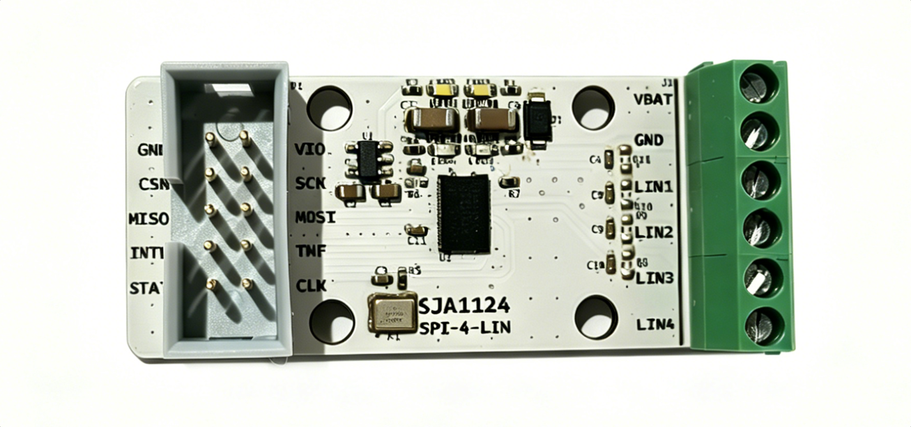

背面就不放了, 铁板烧烤泛黄了.

## SJA1124 原理图

上面白色板子的原理图

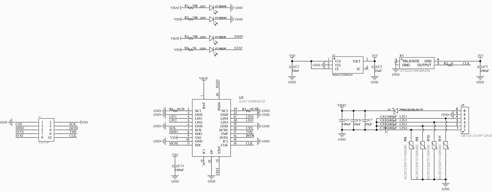

说明:

- VBAT: 5~28 V, 一般接 12V
- VIO 视 MCU 电压, 接 3.3V(建议) 或 5V
- CLK 接了 10MHz 的有源晶振, 驱动中 PLL 乘法因子应设为 `MULT_FACTOR_3_9` (适用于 8.0-10.0 MHz 输入频率范围). MCU不用连接此引脚, 如果想通过 MCU 的 MCO 输出 10M 接 CLK, 可以去掉 R5电阻
- 四个 LED 指示灯
  - LED1: VBAT 指示
  - LED2, VIO 指示
  - LED3, INHN 指示, 低电平点亮. `inhibit output for controlling an external voltage regulator; open-drain; active LOW`
  - LED4, STAT 指示, 低电平点亮, SPI 状态输出, 开漏, STAT 在正常模式是高阻, 以下情况会输出低电平点亮LED4(此时SPI不可访问):
    - Overtemp  过温
    - VIO UV 欠压
    - Low Power Mode 低功耗模式
    - Off Mode  关断模式 且 VBAT电压 > 上电检测阈值Vth (det) pon

## STM32 连接

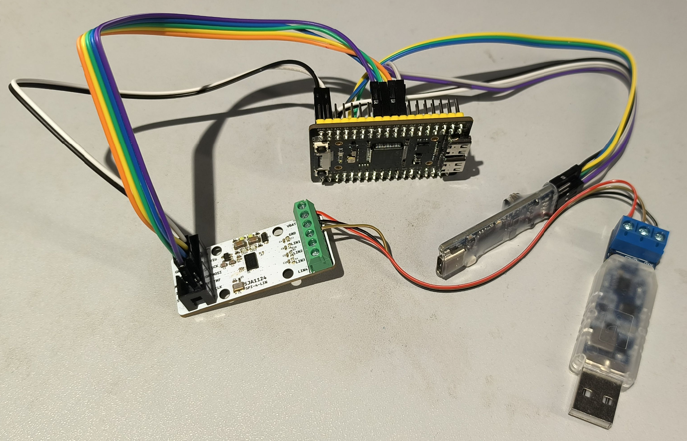

**SPI3 配置**:

- 模式: SPI Mode 1 (CPOL=0, CPHA=1)(SPI_POLARITY_LOW, SPI_PHASE_2EDGE)
- 数据宽度: 8 bit
- 波特率: 3.90625 MHz (64 分频 @ 250 MHz APB)
- 字节序: MSB first
- NSS: 软件控制 (PA15)
- SCK(PC10), MISO(PC11), MOSI(PC12)

**中断引脚**: PD2, 用的下降沿中断

**调试串口**: USART1_RX(PA1), USART1_TX(PA2)

## Github 工程简介

把 NXP 官方的 [nxp-appcodehub/dm-sja1124evb-spi-to-quad-lin-bridge](https://github.com/nxp-appcodehub/dm-sja1124evb-spi-to-quad-lin-bridge) 部分功能搬运到了 STM32H503 上.

用 GCC + CMake 管理工程:

- CMake ≥ 3.22
- Ninja
- arm-none-eabi-gcc 工具链 (GCC 10 或 GCC 11+, GCC 14.3.1)
- STM32CubeProgrammer (下载固件用)

build.ps1 中直接写了交叉编译工具链和ST_Programmer的路径, 可改为自己的:

```bash
$TOOLCHAIN_BIN = 'C:\ST\STM32CubeIDE_2.1.0\STM32CubeIDE\plugins\com.st.stm32cube.ide.mcu.externaltools.gnu-tools-for-stm32.14.3.rel1.win32_1.0.100.202602081740\tools\bin'

    $candidates = @(
        (Join-Path $env:ProgramFiles 'STMicroelectronics\STM32Cube\STM32CubeProgrammer\bin\STM32_Programmer_CLI.exe'),
        (Join-Path ${env:ProgramFiles(x86)} 'STMicroelectronics\STM32Cube\STM32CubeProgrammer\bin\STM32_Programmer_CLI.exe')
    )
```

编译下载清理

```bash
cd h503_sja1124
.\build.ps1 build Debug      # Debug 编译
.\build.ps1 build Release    # Release 编译
.\build.ps1 rebuild Debug    # 清理后重新编译

# ST-Link 下载
.\build.ps1 flash Debug
.\build.ps1 flash Release

# 清理
.\build.ps1 clean Debug      # 清理编译输出
.\build.ps1 distclean Debug  # 删除整个 build 目录
```


## 测试说明

用 tabby 或 putty 连接调试串口, 115200-8-N-1

### Banner

SJA1124 四通道 LIN 主机测试

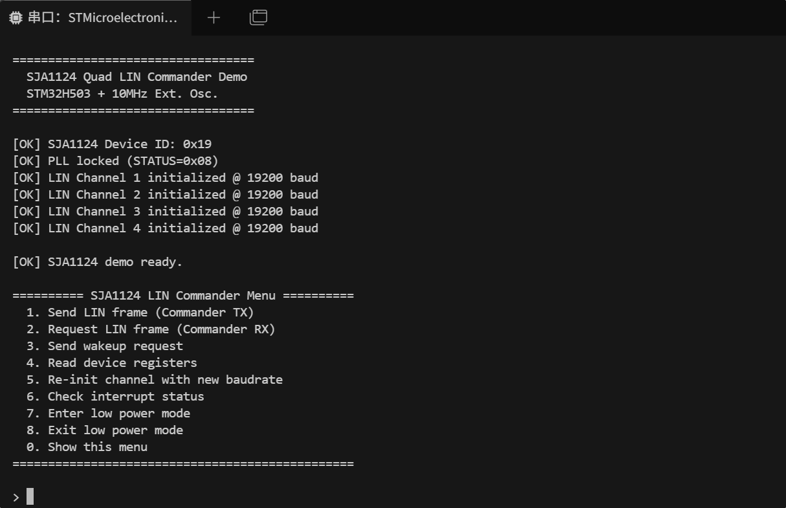

用外部 10MHz 有源晶振给 SJA1124 提供时钟:

- 那 PLL 输出的时钟 f_clk (PLL) out 就是 10M x 3.9 = 39MHz
- 19200 Bd 的 LIN 分频系数就是 39M / 19.2K = 2031.25 = (16×IBR + FBR)
- 整数部分：IBR = floor (2031.25 ÷ 16) = **126**（0x007E）
- 小数部分：FBR = 2031.25 − (16×126) = **15**（0xF，4 位最大）
- 实际分频系数：16×126 + 15 = **2031**
- 实际波特率：39,000,000 ÷ 2031 ≈ **19202.36 Bd**
- 偏差：(19202.36 − 19200) ÷ 19200 × 100% ≈ **+0.0123%**, 小于 LIN 要求的 ±0.3%，**完全合规**

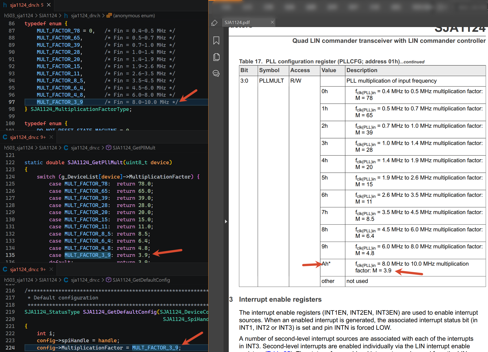

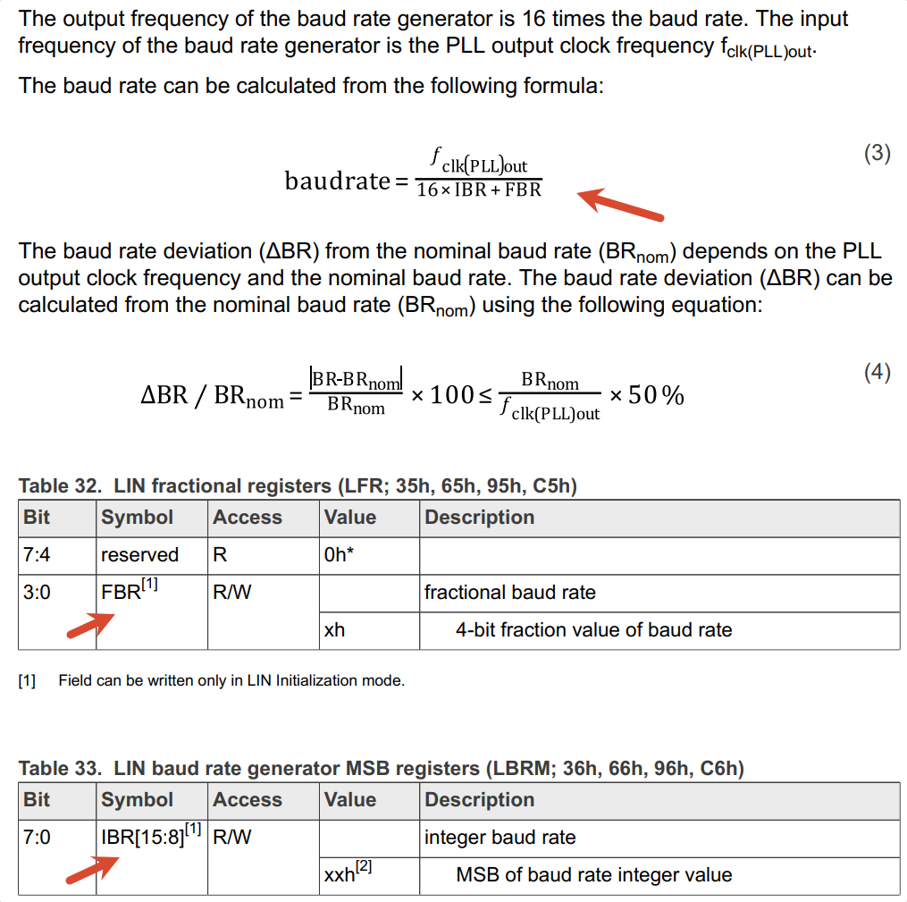

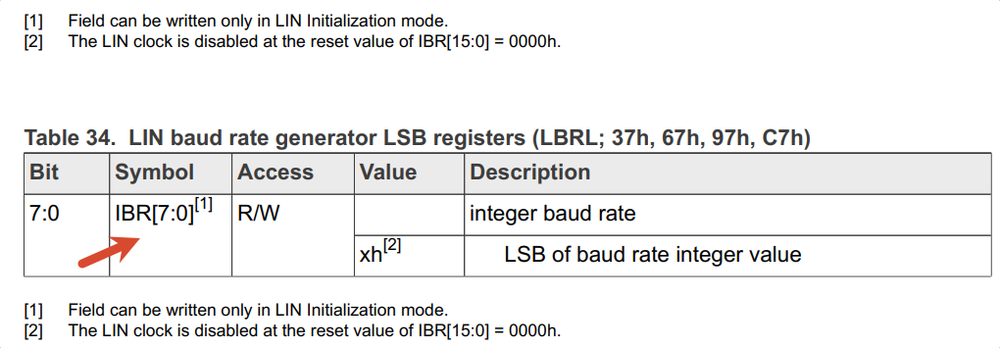

`SJA1124 Device ID: 0x19` 是读 0xFF 寄存器出来的.

`PLL locked (STATUS=0x08)` 是读 0x13 状态寄存器出来的

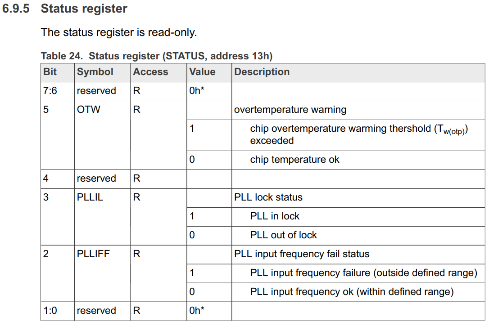

### 发送 LIN

通过 SJA1124 的通道1 发送 0x0B, 8字节数据, 增强校验 到从机(USB-LIN分析仪):

- sum = 0x0B + 0x11 + 0x22 + 0x7B = 0xB9
- 取反 ~0xB6 = 0x46, 就是 Enhance Checksum

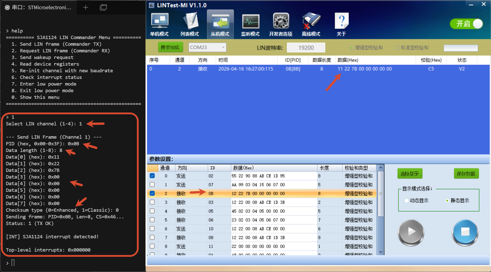 

### 请求 LIN

SJA1124 通道1 请求 0x02 8字节 增强型校验, 收到从机发来的 8 字节数据:

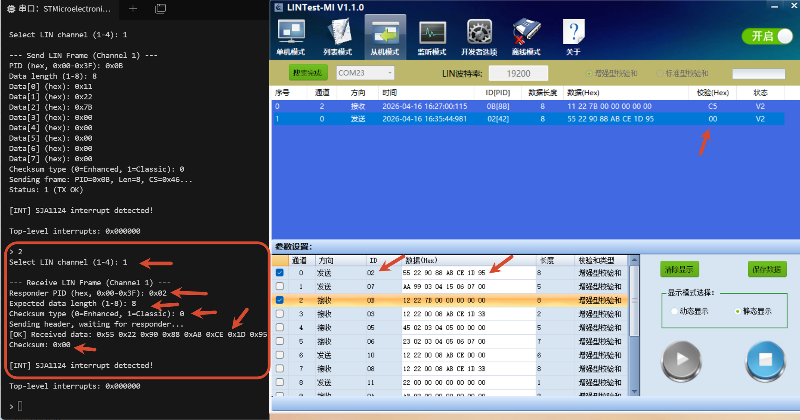

### 发送唤醒字节

唤醒只能发1字节, 直接在 `LINx_SF_LBD1` 写入唤醒字符(此处定义的0xAA)，`LINx_SF_LC` 写 `WAKEUPREQ` 触发总线唤醒

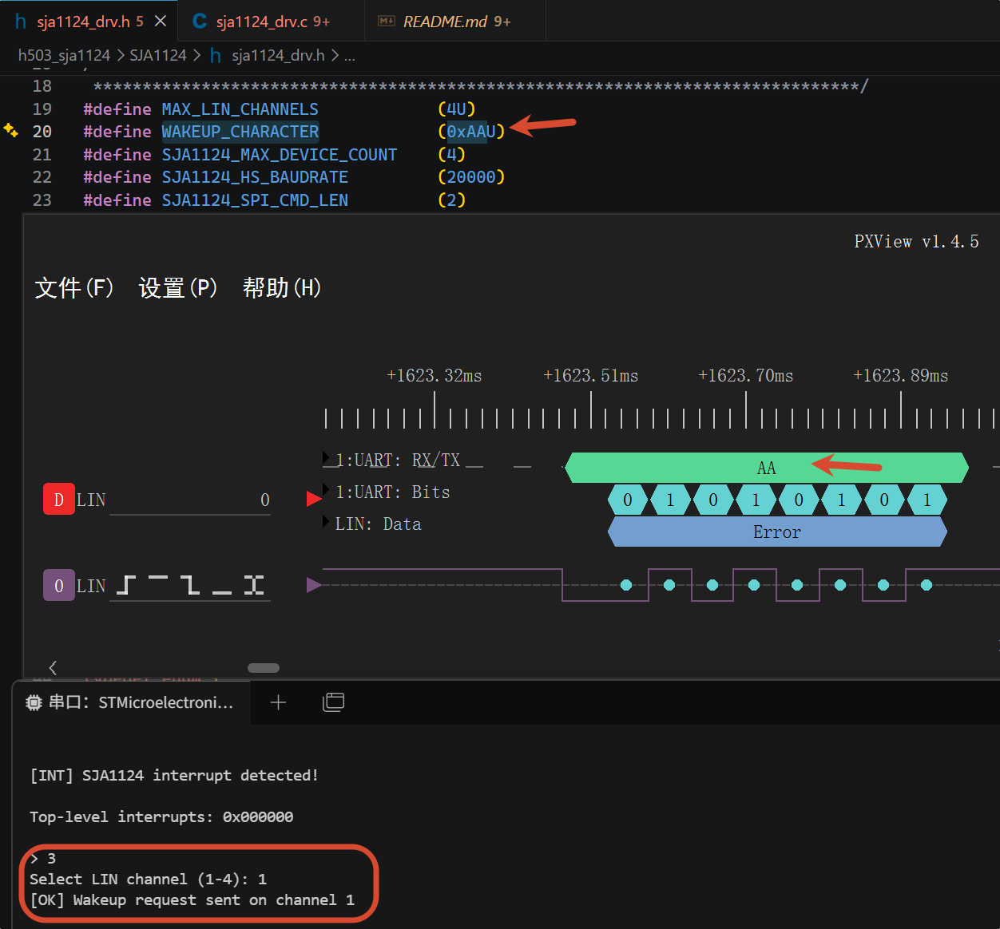

### 读寄存器

读了部分寄存器(芯片全局状态、PLL 状态、顶层中断和每通道配置/状态), 其它可自行添加

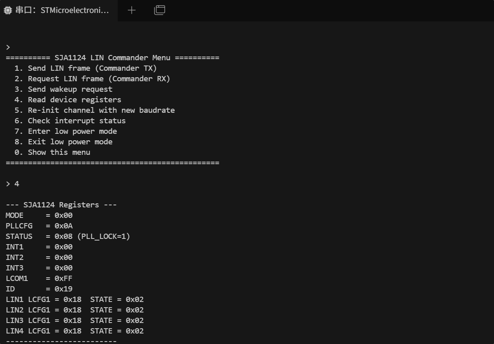

### 其它速率初始化

以 20K Bd 重新初始化通道:

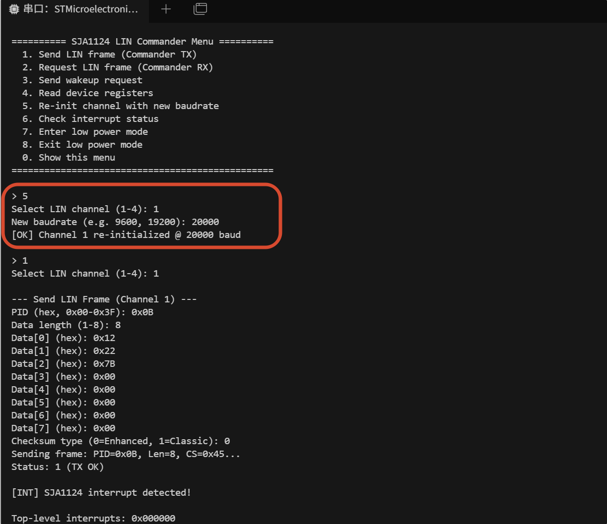

### 低功耗模式

进入低功耗模式:

- 先对每个通道写 `ABORTREQ` 停止当前传输，再清顶层/二级中断，把各通道切到 `SLEEP`，最后把全局 `MODE` 置为低功耗。
- 进入低功耗后 INHN 引脚高阻LED3熄灭, STAT 引脚输出低电平LED4点亮

退出低功耗模式:

- 先读 `STATUS` 唤醒器件，再写 `INT1` 清 `INITSTATINT`，之后主循环会对四个通道重新执行 `ChannelInit`。
- 退出低功耗后(正常模式), INHN 引脚输出低电平LED3点亮, STAT 引脚高阻LED4熄灭

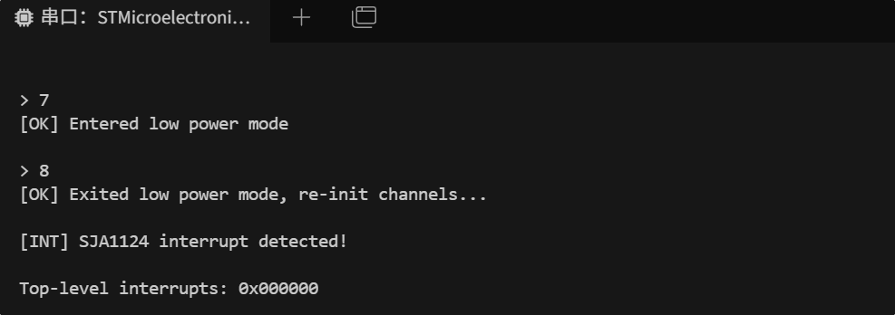

