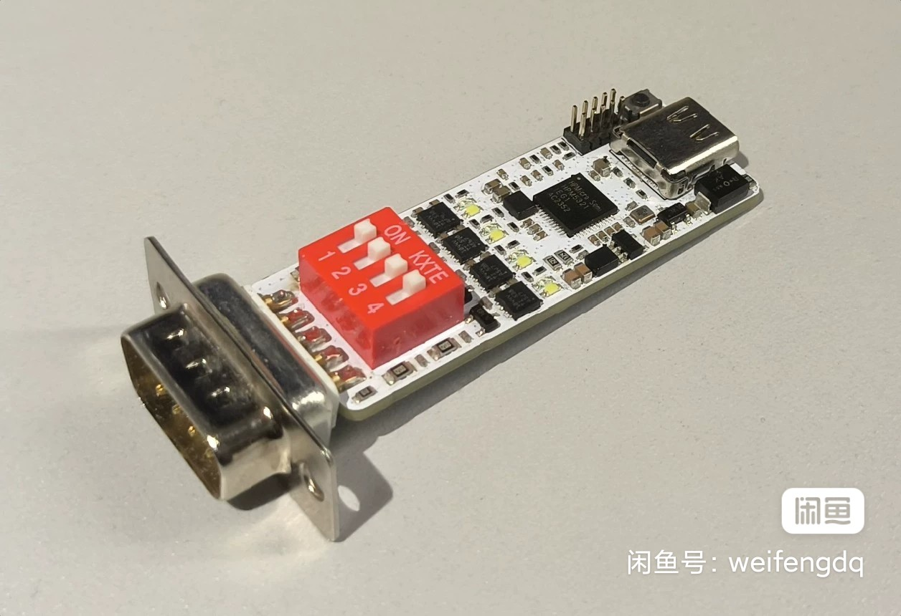
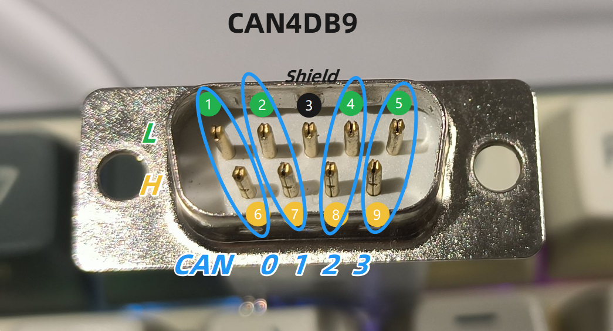
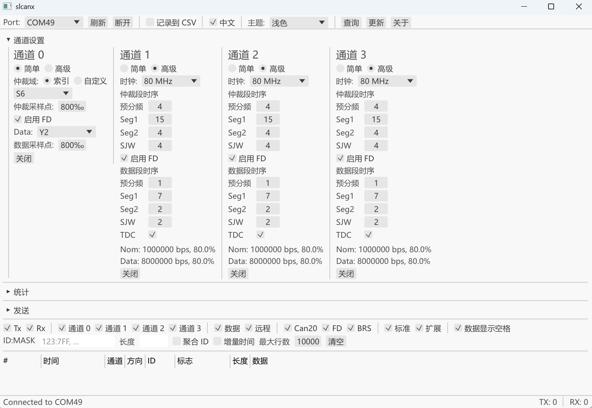
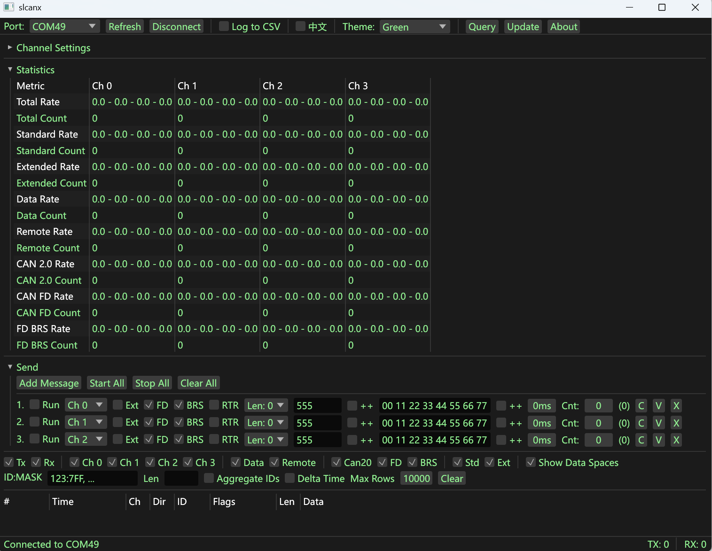
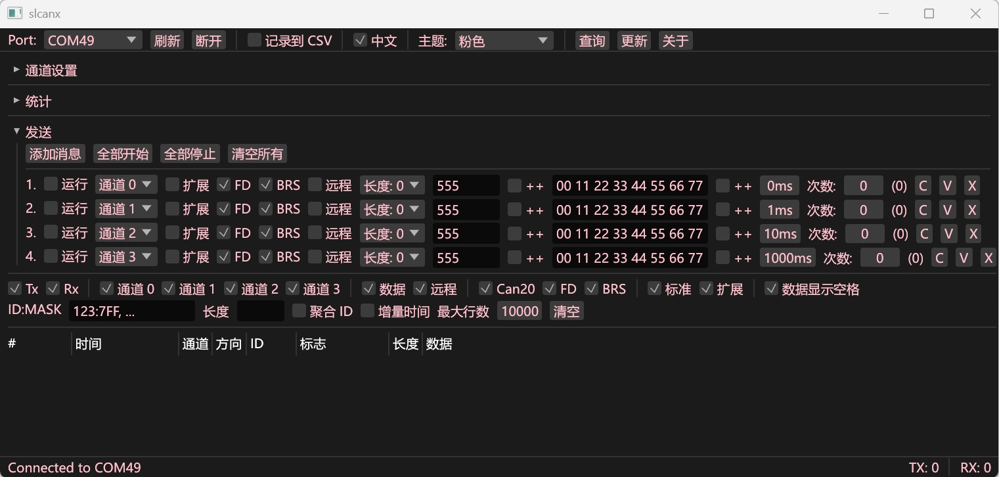
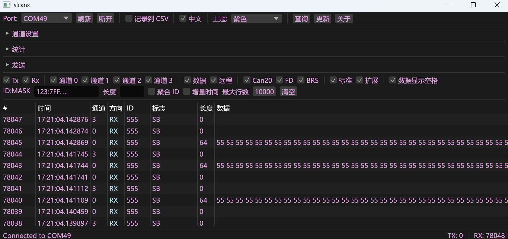
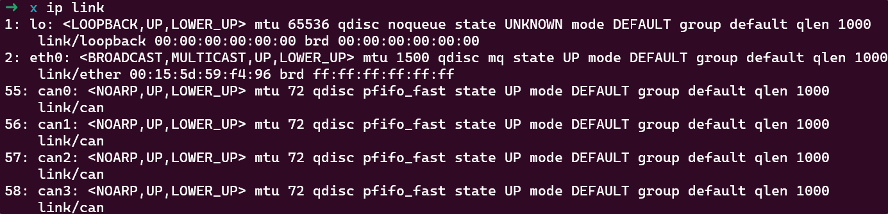
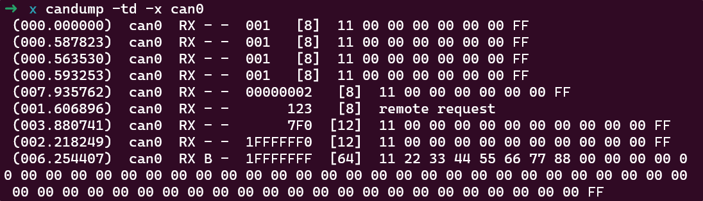
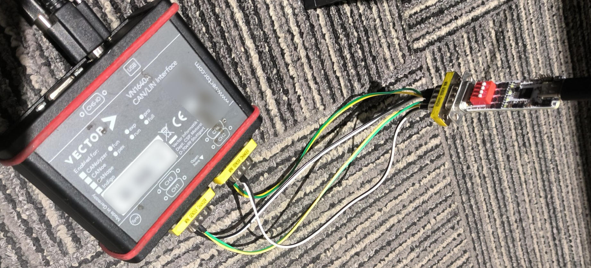

## SlcanX



## 参数比较

| CANFD           | USBCANFD-400U  | TC1014       | VN1640A      | SlcanX         |
| --------------- | -------------- | ------------ | ------------ | -------------- |
| 通道数量        | 4              | 4            | 4            | 4              |
| USB接口         | Type-B, 480M   | Type-B, 480M | Type-B, 480M | Type-C, 480M   |
| CAN接口         | DB9 x2         | DB9 x2       | DB9 x4       | DB9 x1         |
| 最大速率        | 5M (实验室8M)  | 8M           | 8M           | 8M (实验室10M) |
| 发送能力        | < 2W 帧/s      | ~ 2W 帧/s    | ~ 12W 帧/s ? | ~ 12W 帧/s     |
| 接收能力        | < 3W 帧/s      | ~ 2W 帧/s    | ~ 12W 帧/s ? | ~ 12W 帧/s     |
| 终端电阻        | 软件使能       | 软件使能     | -            | 拨码开关       |
| 隔离            | ✔              | ✔            | -            | ✖              |
| 系统            | Win, Linux(库) | Win, Linux   | Win          | Win, Linux     |
| 二次开发        | 支持           | 支持         | 支持         | 支持           |
| Linux SocketCAN | ✖              | ✖            | ✖            | ✔              |
| 价格参考        | ￥ ~3300       | ￥ ~8000 ?   | ￥> 10000    | ￥128          |

参考:

- [USB接口CAN FD卡-广州致远电子股份有限公司](https://zlg.cn/can/can/product/id/223.html)
- [TC1014 - 4路CAN FD转USB接口 - 上海同星智能科技有限公司](https://www.tosunai.com/product/tc1014/)
- [VN1600 Family - Network Interfaces for CAN, CAN FD, CAN XL, LIN, K-Line, J1708 and IO | Vector](https://www.vector.com/cn/zh/products/products-a-z/hardware/network-interfaces/vn16xx/#c386660)

## 接口定义



## 位时间参考

设置原则:

- 最好 (1+Seg1+Seg2) 的值为 20 或 40
- 采样点优先 80%, 次之 75%, 最次 87.5% (新设计建议, 如果是已有设备如canable2, 只能87.5%)
- 75% 比 87.5% 优先的目的是为了让 Sjw 尽量大
- Sjw 取 1 总是要避免的, 最好是2以上, 优先让 Sjw = Seg2
- 下表是一些速率和采样点的设置参考

|           | 时钟 | 预分频 | Seg1 | Seg2 | Sjw  |
| --------- | ---- | ------ | ---- | ---- | ---- |
| 250K, 80% | 80M  | 8      | 31   | 8    | 8    |
| 500K, 80% | 80M  | 4      | 31   | 8    | 8    |
| 1M, 80%   | 80M  | 2      | 31   | 8    | 8    |
| 2M, 80%   | 80M  | 1      | 31   | 8    | 8    |
| 3M, 80%   | 60M  | 1      | 15   | 4    | 4    |
| 4M, 80%   | 80M  | 1      | 15   | 4    | 4    |
| 5M, 75%   | 80M  | 1      | 11   | 4    | 4    |
| 6M, 80%   | 60M  | 1      | 7    | 2    | 2    |
| 8M, 80%   | 80M  | 1      | 7    | 2    | 2    |
| 9M, 75%   | 72M  | 1      | 5    | 2    | 2    |
| 10M, 75%  | 80M  | 1      | 5    | 2    | 2    |
| 12M, 80%  | 60M  | 1      | 3    | 1    | 1    |

注意: 12M 只能部分通信正常, 一般会报错误帧.

**取值范围**:

- 时钟: `80/72/60/50/24` MHz, 注意四路时钟要一致
- 仲裁段:
  - 预分频(Prescaler): [1, 512]
  - TSeg1: [2, 256]
  - TSeg2: [2, 128]
  - Sjw: [1, 128]
- 数据段:
  - 预分频(Prescaler): [1, 512]
  - TSeg1: [2, 256]
  - TSeg2: [1, 32]
  - Sjw: [1, 128]

## 上位机slcanx

基于 [Rust egui](https://github.com/emilk/egui) 编写, 超高性能, 纵享丝滑, 目前实现的有:

- 中英切换, 多种主题
- 数据保存
- 多通道设置, 支持简单(`速率+采样点`)和高级(`时钟_预分频_Seg1_Seg2_Sjw_TDC`)设置
- 统计, 支持各通道 收发计数 帧率的当前-最小-最大-平均值
- 发送, 支持 `标准/扩展, CAN20/FD/BRS, 数据/远程, 长度, ID, ID自增, 数据输入, 数据递增, 发送次数, 发送计数, 复制, 粘贴, 删除, 列表的 全部开始/全部停止`
- 过滤: 支持 `TX/RX, 通道选择, 数据/远程, CAN20/FD/BRS, 标准/扩展, 多 ID:MASK, 长度` 等的过滤, 支持 ID聚合, 增量时间, 行数设置等
- 收发数据或错误帧显示

以下是部分截图:









## Linux SocketCAN

设置 4 通道 1M 80% + 5M 75% 的示例脚本:
```bash
#!/bin/bash

sudo modprobe can can-raw can-dev
sudo insmod ./slcanx_module/slcanx.ko

# o总是要放在最后面
sudo ./slcandx/slcandx \
	-0c -0y1000000 -0Y5 -0p800 -0P750 -0o \
	-1c -1y1000000 -1Y5 -1p800 -1P750 -1o \
	-2c -2y1000000 -2Y5 -2p800 -2P750 -2o \
	-3c -3y1000000 -3Y5 -3p800 -3P750 -3o \
	/dev/ttyACM0

for i in 0 1 2 3; do
	sudo ip link set up can$i
	sudo ifconfig can$i txqueuelen 1000
done
```

ip link 检查:



发送 `cansend can0 123##5.11.22.33.44.55.66.77.88.99`

接收:



测试截图:




