# TC364

- [TC364](#tc364)
  - [板子简介](#板子简介)
  - [20P接口](#20p接口)
  - [调试连接](#调试连接)
  - [版本说明](#版本说明)
  - [0\_Board\_Test\_LED](#0_board_test_led)
  - [0\_Board\_Test\_UART0](#0_board_test_uart0)
  - [0\_Board\_Test\_CAN0](#0_board_test_can0)
  - [0\_Board\_Test\_CAN\_x8](#0_board_test_can_x8)
  - [0\_Board\_Test\_LwIP\_Ping](#0_board_test_lwip_ping)
  - [0\_Board\_Test\_LwIP\_Iperf](#0_board_test_lwip_iperf)
  - [Tips](#tips)
    - [设置 Release](#设置-release)
  - [注意事项](#注意事项)
    - [百兆以太网](#百兆以太网)
    - [终端电阻](#终端电阻)
    - [背面开窗](#背面开窗)
    - [免责声明](#免责声明)
  - [购买链接与交流群](#购买链接与交流群)


## 板子简介

英飞凌 AURIX TC364 评估板:

- 板载 SAK-TC364DP-64F300F AA, TQFP-144封装
- 引出8路支持8Mbits/s的车规级CANFD收发器TCAN1044A
- 百兆以太网, PHY为DP83825I
- CH343串口USB
- 电源LED, 双用户LED, 复位按键, 1.27_2x5P调试口
- 其余IO引出

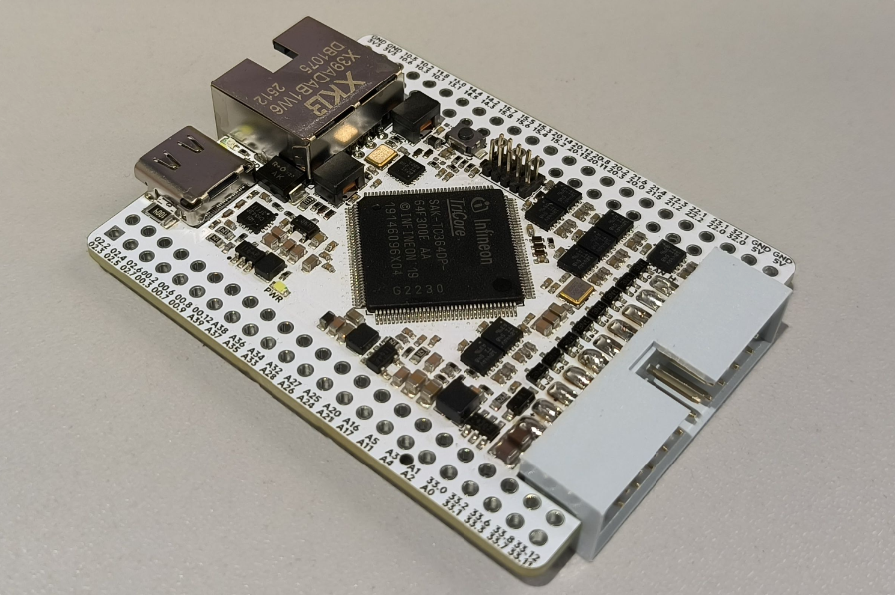

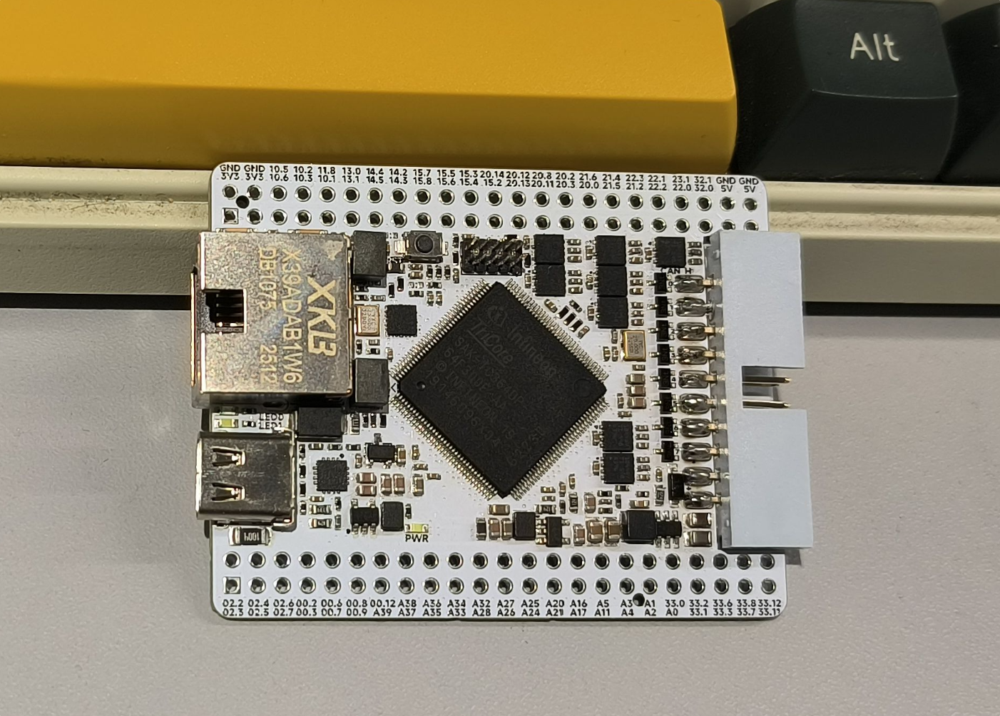

## 20P接口

DC3-2.54mm 2x10P:

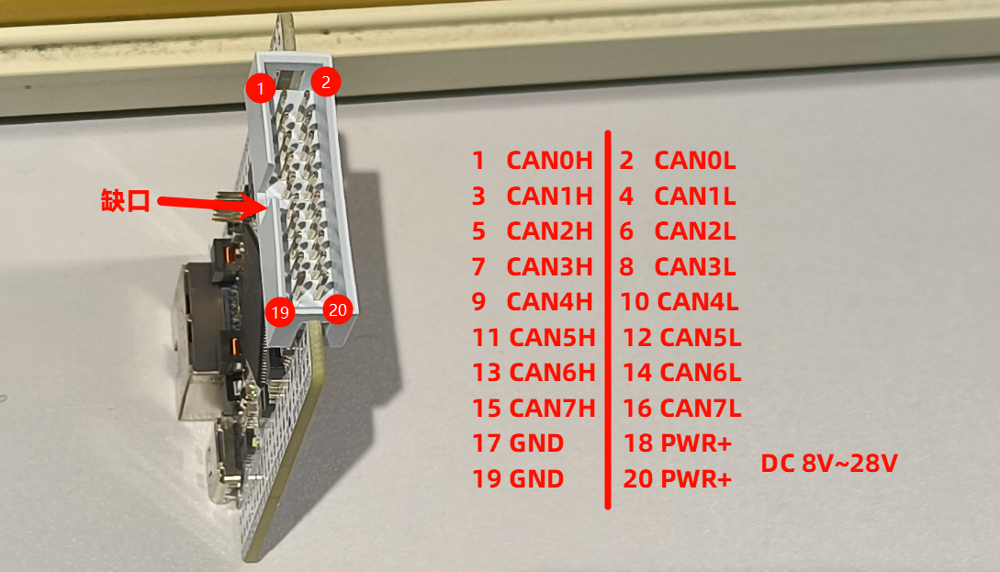

可用杜邦线或灰排线连接. 供电可单USB, 也可单外部8~28V直流电源, 也可同时接.

## 调试连接

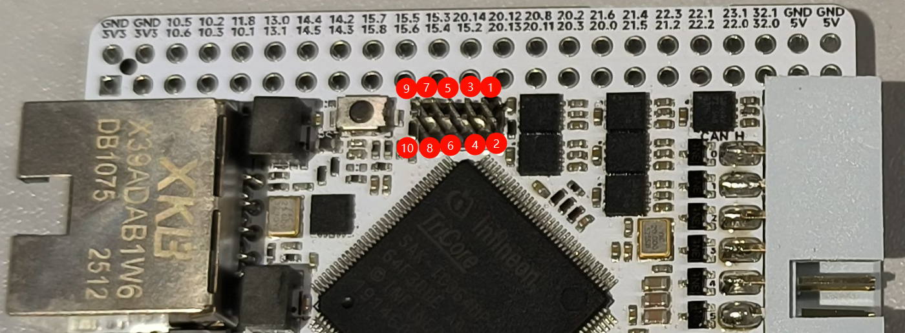

1.27_2x5P调试口原理图:

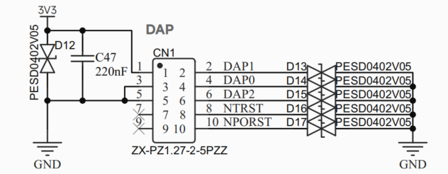

注意:

- 板子上调试口 7 9 脚是悬空的, 所以不论是调试器这两个引脚是串口还是GND, 都可以正常连接, 只要是有 1.27 10P 口的 DAP MiniWiggler, 应该都是可以用的.
- 6 DAP2 在其它家调试器可能写作 USR0, 是通用的
- 8 NTRST 在其它家调试器可能写作 USR1, 是通用的
- 10 NPORST 在其它家调试器可能写作 RST, 是通用的

调试器连接, 注意图中灰排线最左边**红紫色线对应1.27_2x5P调试口1脚**VREF(3V3)的位置:

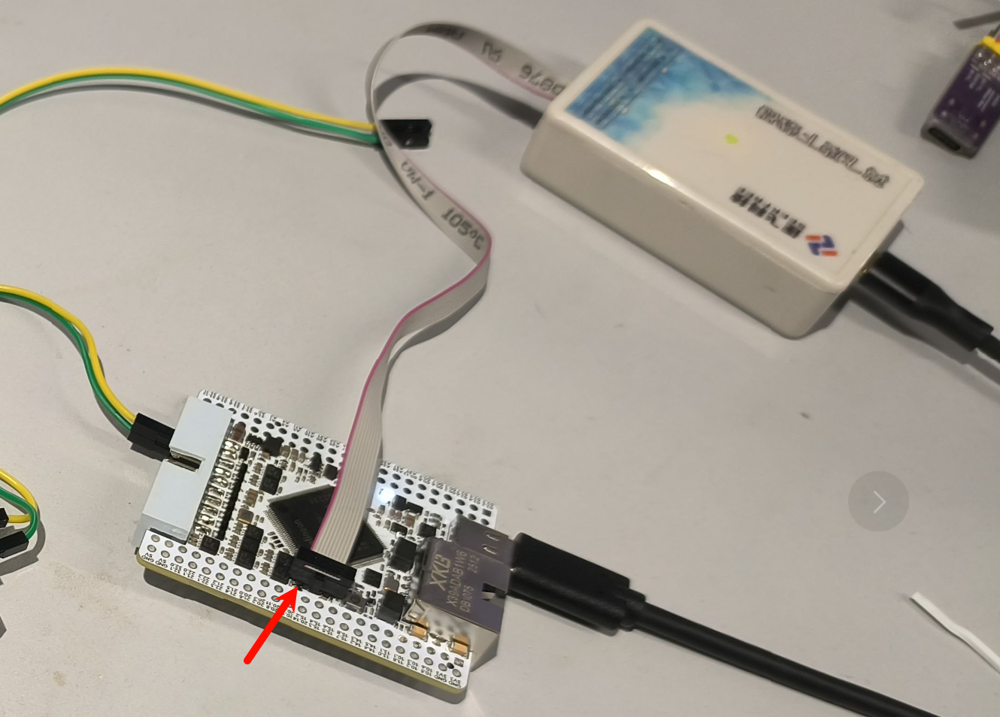

## 版本说明

- [Aurix Development Studio](https://www.infineon.cn/design-resources/platforms/aurix-software-tools/aurix-tools/aurix-development-studio) 1.10.16, 以下简称 ADS
- [Memtool](https://softwaretools.infineon.com/tools/com.ifx.tb.tool.infineonmemtool) 2025.02b
- [iLLD]([Releases · Infineon/illd_release_tc3x](https://github.com/Infineon/illd_release_tc3x/releases)) V1.20.1, 默认安装目录 `C:\Infineon\iLLD\TC3\v1.20.0`, API 文档 `"C:\Infineon\iLLD\TC3\v1.20.0\TC3-v1.20.0\Doc\TC3xx\iLLD_UM_TC3xx.chm"`

## 0_Board_Test_LED

工程右键 -> Set Active Project

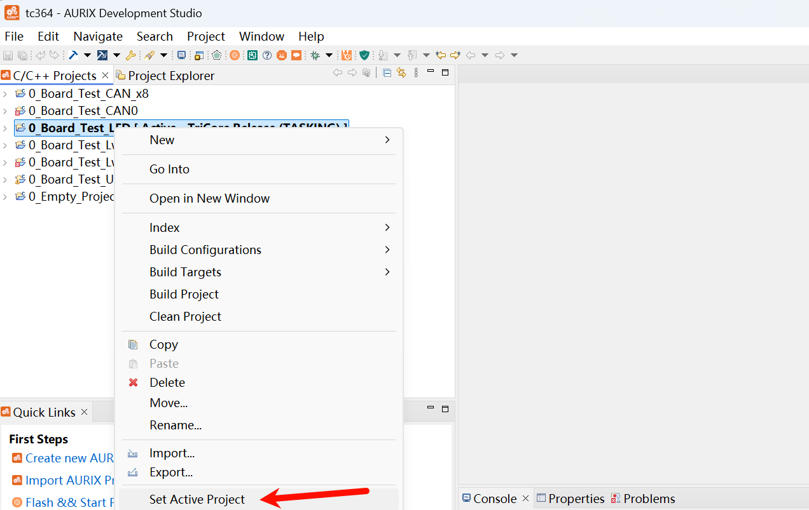

一键编译下载, 自动复位运行:

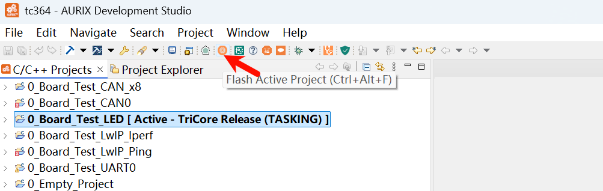

或者 Memtool 烧录 HEX 文件, 首次打开选择TC36x的目标配置, Target -> Change -> Default:

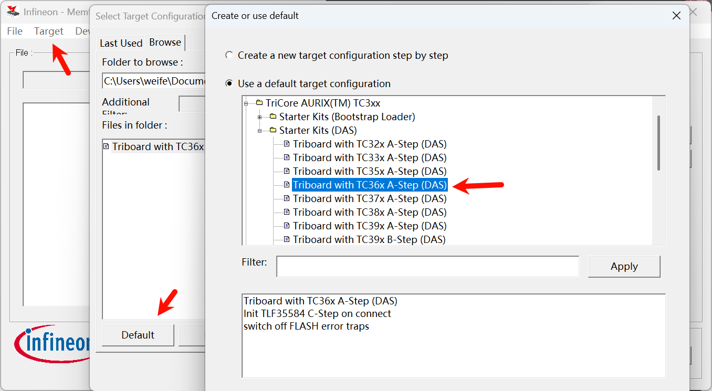

点击 Connect, 打开HEX文件, 选择全部, 添加选择到PFLASH, 烧录:

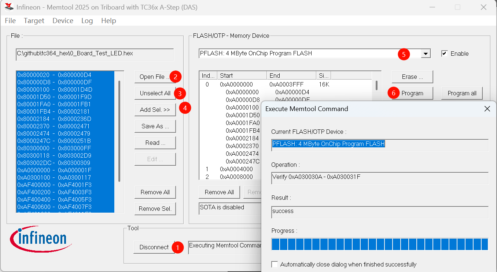

注意 UCBs出厂烧录过一次, 后面新手暂不建议再次改动或烧入.

烧录后, 手动按下板子上的复位按键或者重启电源, 可以看到板子上的一红一白两个LED以1s周期闪烁.

## 0_Board_Test_UART0

4M波特率打开CH343串口, 按下复位按钮后, 显示 `UART Echo Advanced Ready` 欢迎标语, 点击清除窗口, 然后开始进行 1ms 周期定时发送, 每次 100 字节(98发送区+2字符的回车换行)的回显, 一段时间后停止, 观察发送与接收计数:

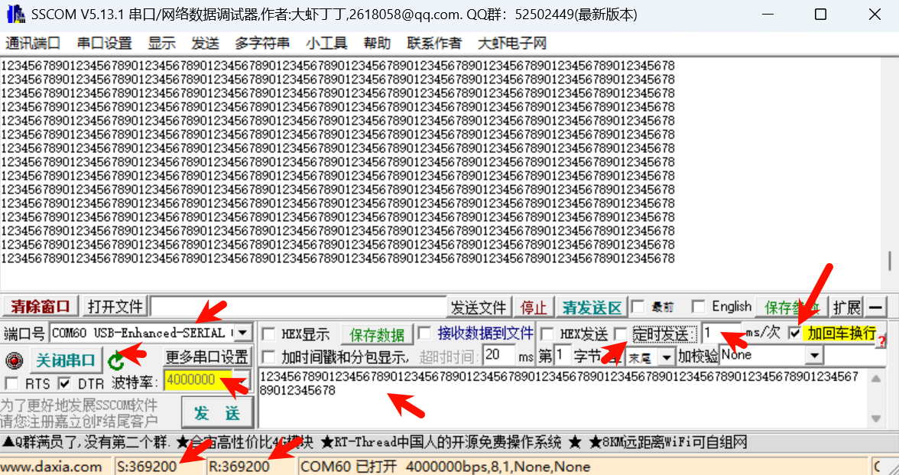

## 0_Board_Test_CAN0

MCAN主时钟80MHz, 打开两路CAN节点:

- CAN0, 500K_80% + 2M_80%
- CAN1, 1M_80% + 5M_75%

无论CAN0收到什么, 都透明转发到CAN1上去. 接线(板子背面的120Ω终端电阻没有贴, 外部总线上必须保证至少有一个终端电阻, 最好两端各接一个):

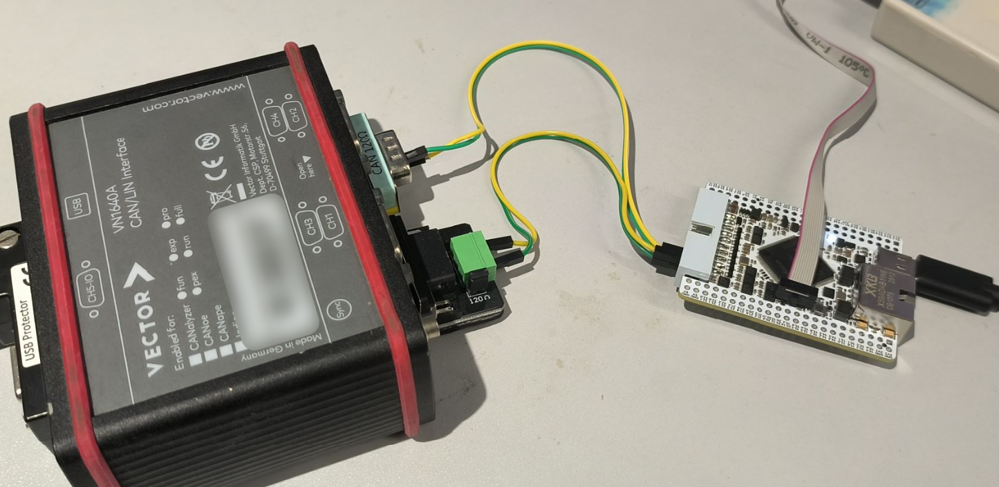

两套 API 都是可以的:

- init_can_simple, 设置波特率和采样点
- init_can, 设置预分频, tseg1, tseg2

```c
  // void init_can_simple(mcmcanType *dev, canChannel channel, uint32 baudRate, float samplePoint, uint32 fastBaudRate, float fastSamplePoint)
  init_can_simple(&can[0], CAN0, 500000, 0.8, 2000000, 0.8); // 500kbps 80%, 2Mbps 80%
  init_can_simple(&can[1], CAN1, 1000000, 0.8, 5000000, 0.75); // 1000kbps 80%, 5Mbps 75%
  
  // void init_can(mcmcanType *dev, canChannel channel, uint16 npre, uint8 ntseg1,
  //           uint8 ntseg2, uint16 dpre, uint8 dtseg1, uint8 dtseg2)
  // init_can(&can[0], CAN0, 8, 15, 4, 2, 15, 4); // 500kbps 80%, 2Mbps 80%
  // init_can(&can[1], CAN1, 4, 15, 4, 1, 11, 4); // 1000kbps 80%, 5Mbps 75%
```

Vector的两路CAN连接 TC364 板子的CAN0和CAN1, 打开CANoe, 设置速率:

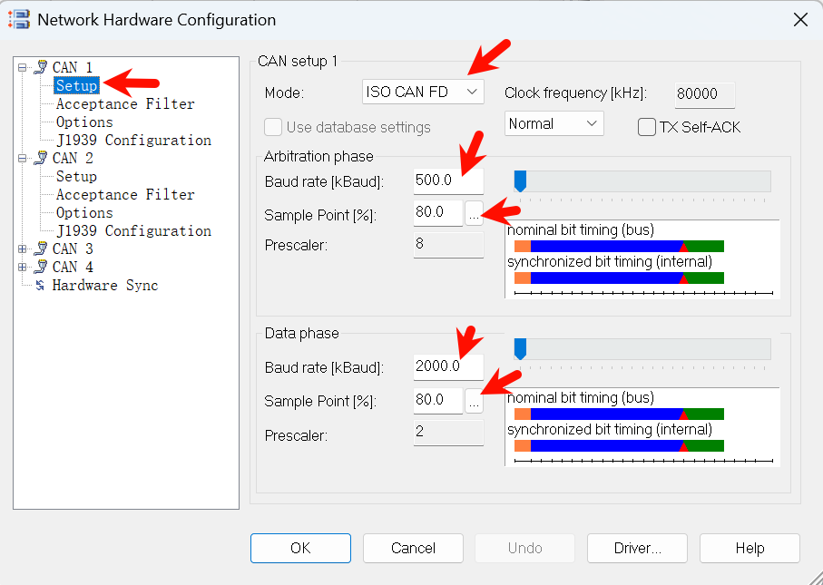


直接100%负载率, 用64字节开启BRS的帧测试:

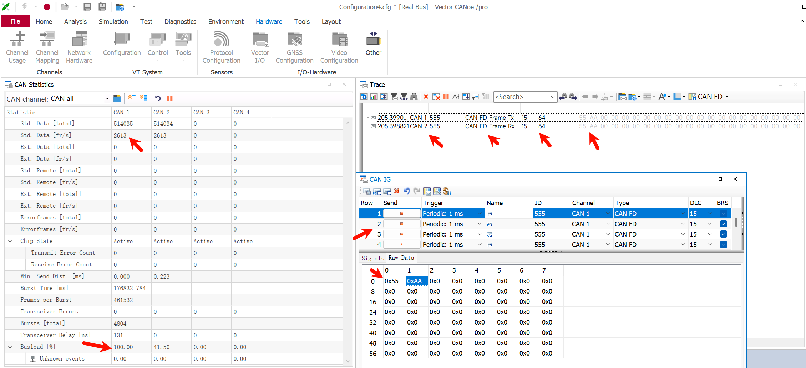

停止发送, 可以看到所有从Vector CAN1发出去的帧从CAN2 echo回来了, 无丢帧:

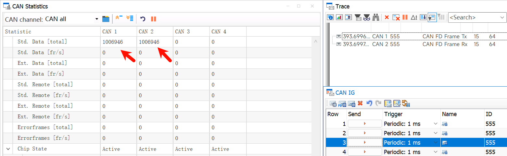

## 0_Board_Test_CAN_x8

8路CAN全部设置为 1M 80% + 8M 80%:

```c
  // 所有通道 1Mbps 80%, 8Mbps 80%
  for (canChannel ch = CAN0; ch < CAN_NUM; ch++) {
    init_can_simple(&can[ch], ch, 1000000, 0.8, 8000000, 0.8);
    // init_can(&can[ch], ch, 4, 15, 4, 1, 7, 2);
  }
```

每通道收到一帧CAN后echo回去, 注意发送频率不要太快, 以免同ID冲突. 接线:

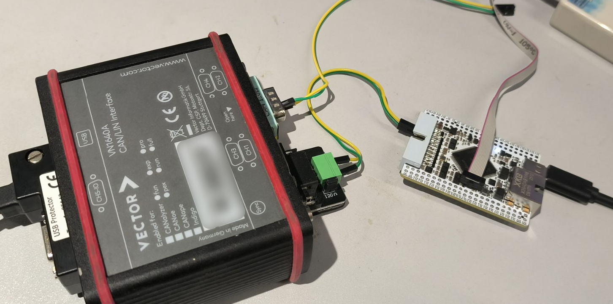

Vector设置:

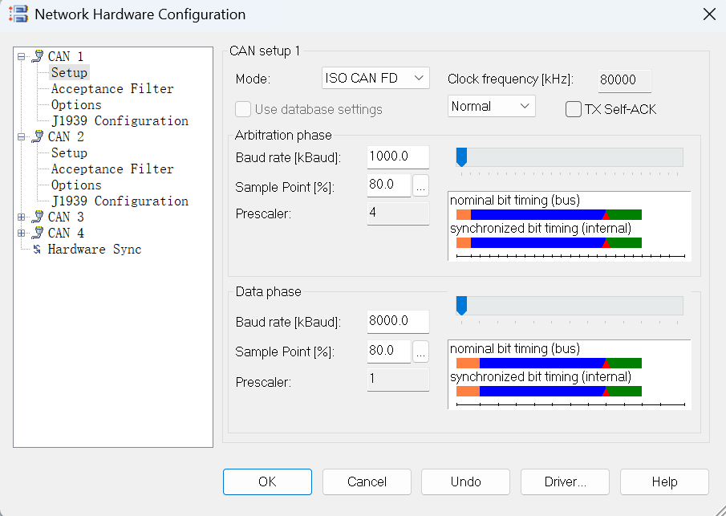

单路测试效果, 发送1000帧/s 加上echo回来的, 共计 2000帧/s

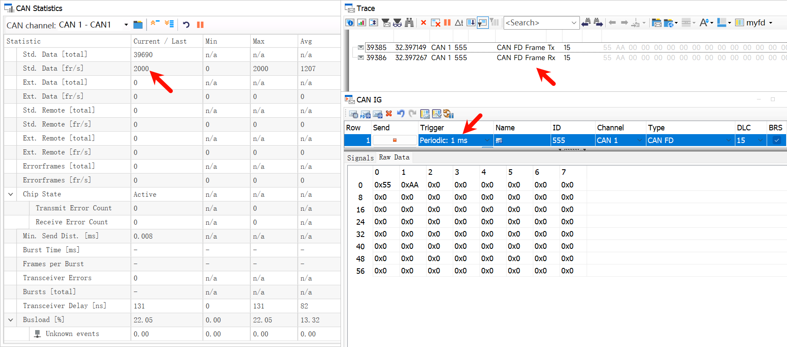

依次测试8路CAN的echo即可.

## 0_Board_Test_LwIP_Ping

TC364板子的IP地址设为 `192.168.0.100`

```c
eth_addr_t ethAddr;
ethAddr.addr[0] = 0xDE;
ethAddr.addr[1] = 0xAD;
ethAddr.addr[2] = 0xBE;
ethAddr.addr[3] = 0xEF;
ethAddr.addr[4] = 0xFE;
ethAddr.addr[5] = 0xED;

ip_addr_t ipAddr    = IPADDR4_INIT_BYTES(192, 168,   0, 100); 
ip_addr_t netMask   = IPADDR4_INIT_BYTES(255, 255, 255,   0); 
ip_addr_t gateway   = IPADDR4_INIT_BYTES(192, 168,   0,   1); 

Ifx_Lwip_init_with_ip(ethAddr, ipAddr, netMask, gateway);    
```

电脑设置IP 192.168.0.2

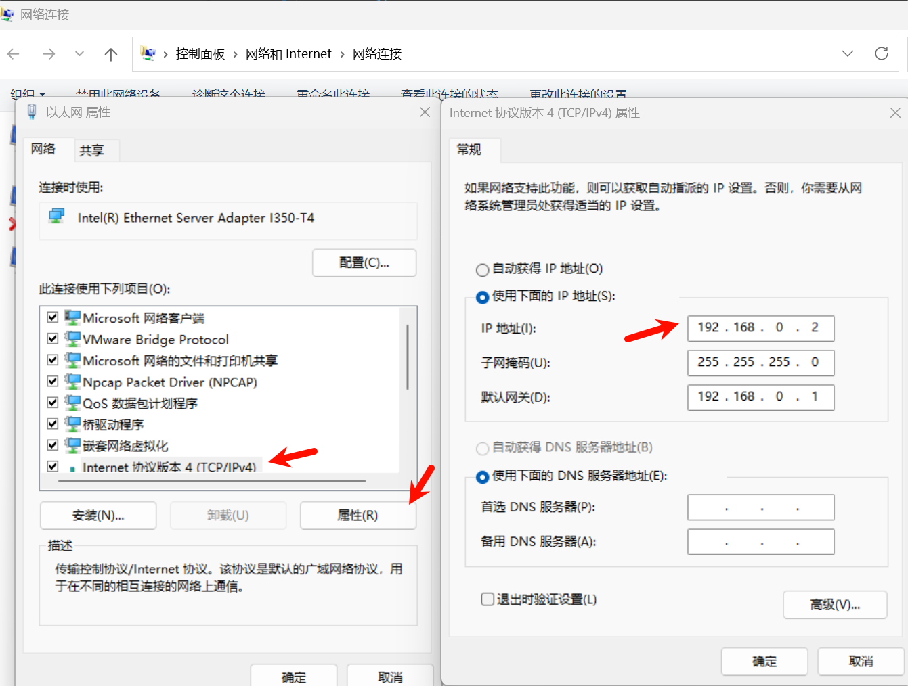

状态里面速度显示 100Mbps

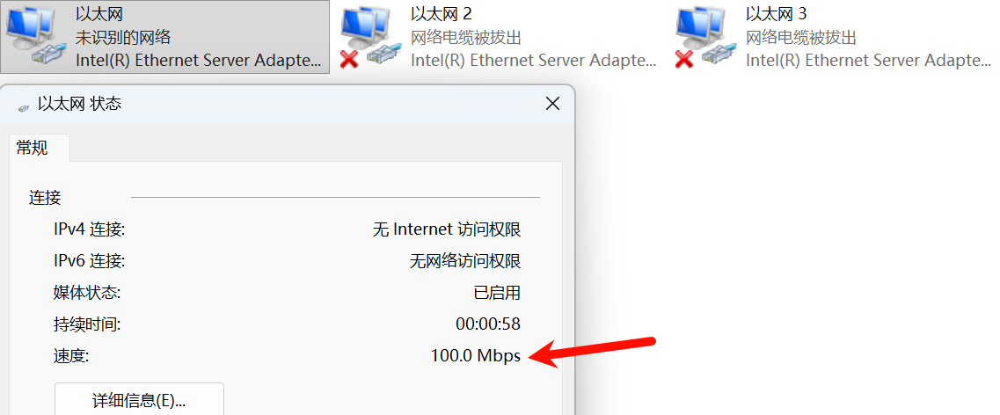

ping 测试:

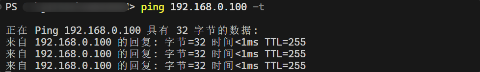

PowerShell 里面查看mac地址 `Get-NetNeighbor -IPAddress "192.168.0.100"`:

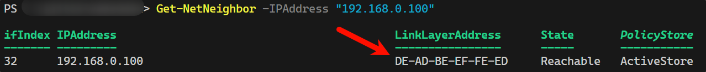

调试串口显示:

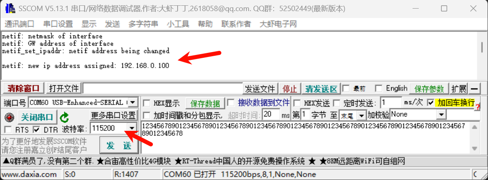

## 0_Board_Test_LwIP_Iperf

添加 `tc364\0_Board_Test_LwIP_Iperf\Libraries\Ethernet\lwip\src\apps\lwiperf\lwiperf.c` 文件, 

Cpu0_Main.c 中开启 Iperf, 宏 LWIP_TCP 默认已在文件 opt.h 中开启, 打开 jperf, 填入 IP, 默认的 5001 端口不改, 进行测试:

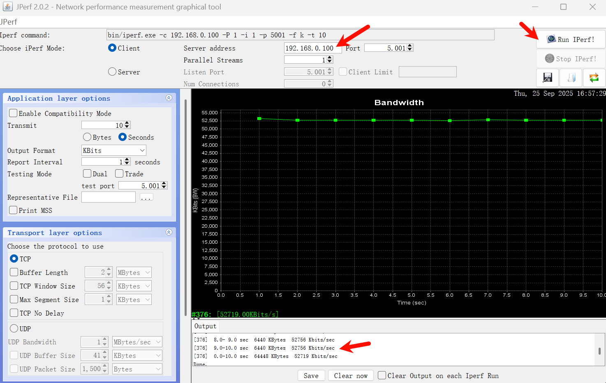

串口也打印出结果, 约 52Mbits/s:

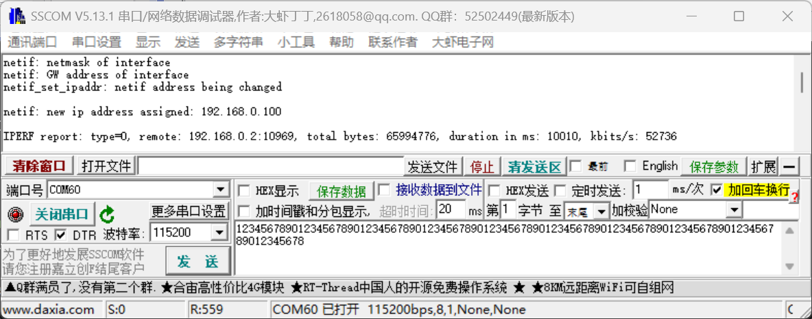

接下来对 TCP 配置进行优化, 仅在 lwipopts.h 添加

```c
#define TCP_MSS                 1460
```

从原来默认的 536 修改为 1460, 即可接近百兆网速, 到接近 90Mbits/s:

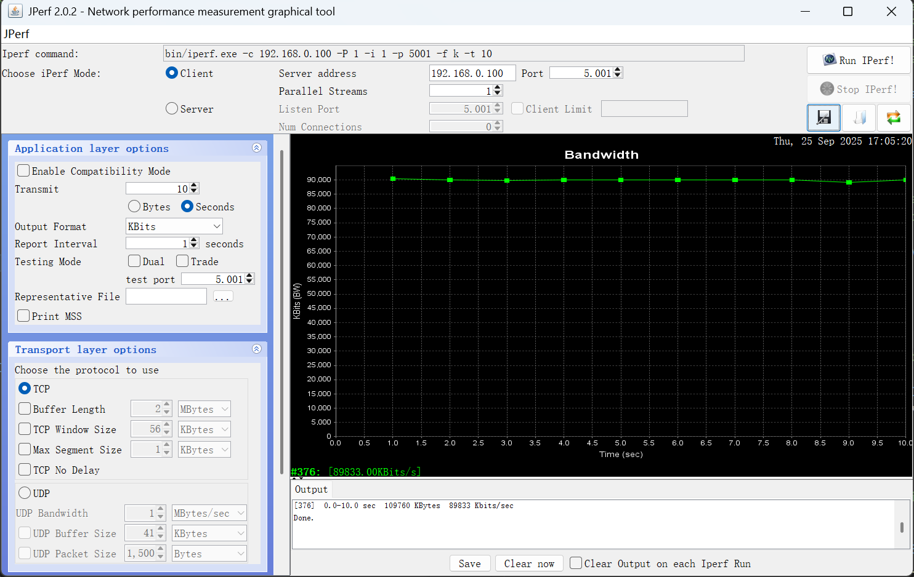

串口打印 `IPERF report: type=0, remote: 192.168.0.2:7104, total bytes: 112394264, duration in ms: 10004, kbits/s: 89872`

## Tips

### 设置 Release

工程右键 Properties:

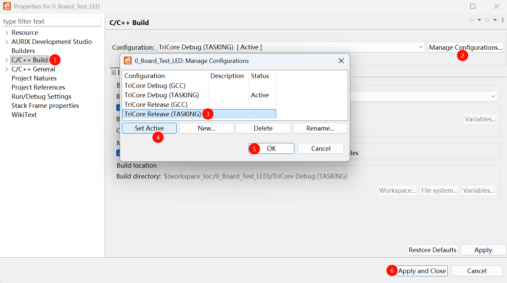

## 注意事项

### 百兆以太网

以太网可能会有自动重连, Iperf 测试中断的问题, 这是板子便宜出售的原因, 基本不影响学习使用, 介意勿拍.

### 终端电阻

板子背面 8 路CAN的终端电阻默认没有焊接, 有需要启用板载终端电阻的的可以手动焊接 0603 封装的 120Ω 电阻:

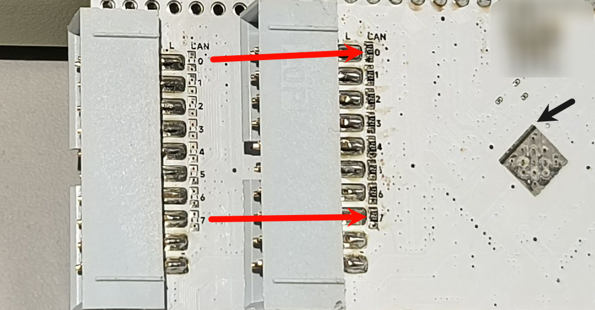

### 背面开窗

MCU背面的开窗开的有些大, 开出了一条 1.25V 的走线, 注意不要和地相连, 如上图黑色箭头

### 免责声明

本印刷电路板（PCB）设计、相关原理图、固件及任何配套文件（以下统称“本项目”）**仅限用于教育、学习、评估目的**。本项目以“按原样”和“当前状态”提供。设计者、贡献者及发布方（以下统称“提供方”）**明示或不暗示地不作任何形式的担保**，包括但不限于对项目的适销性、特定用途适用性、不侵犯第三方权利、稳定性、安全性及可靠性的任何担保。提供方不保证本项目功能的完整性或准确性。设计可能存在错误或不完善之处。元件参数、封装、固件等可能随时调整，恕不另行通知。您应自行承担因设计、焊接、调试或使用本项目而产生的一切风险和责任。

## 购买链接与交流群

QQ 交流群

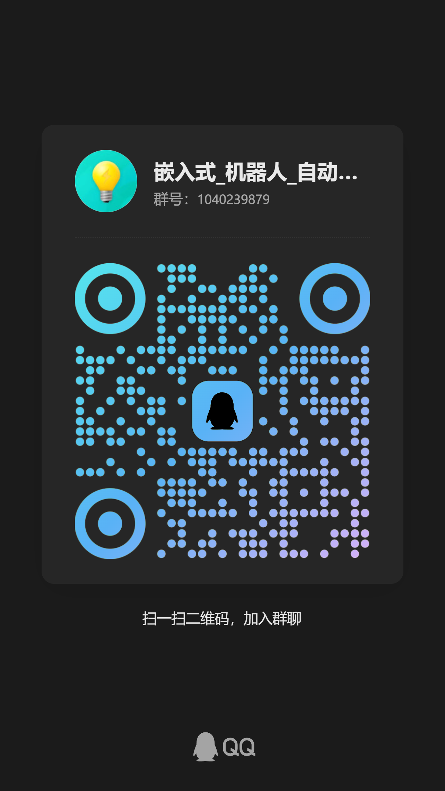

原价 299, 首发优惠 199元, 数量有限, 欲购从速:

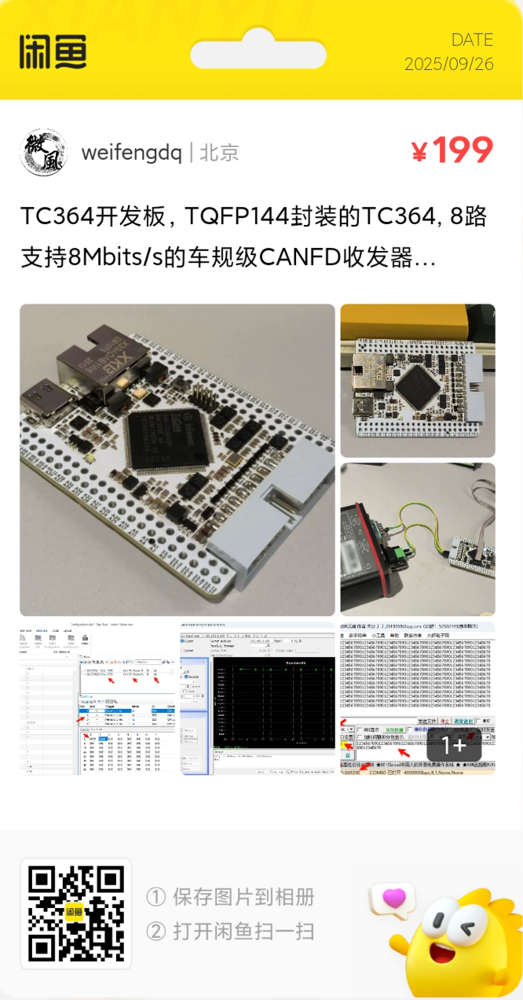