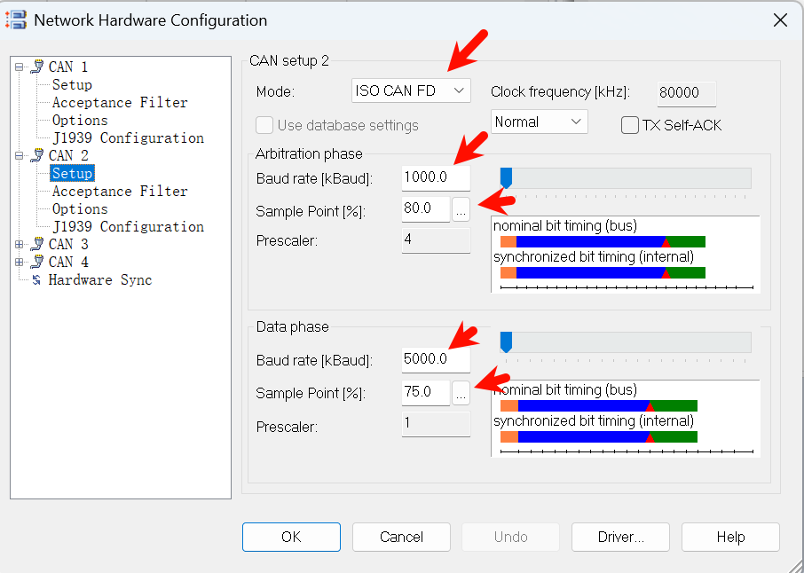

# TC364

## 板子图片


## 版本说明

- [Aurix Development Studio](https://www.infineon.cn/design-resources/platforms/aurix-software-tools/aurix-tools/aurix-development-studio) 1.10.16, 以下简称 ADS
- [Memtool](https://softwaretools.infineon.com/tools/com.ifx.tb.tool.infineonmemtool) 2025.02b
- [iLLD]([Releases · Infineon/illd_release_tc3x](https://github.com/Infineon/illd_release_tc3x/releases)) V1.20.1, 默认安装目录 `C:\Infineon\iLLD\TC3\v1.20.0`, API 文档 `"C:\Infineon\iLLD\TC3\v1.20.0\TC3-v1.20.0\Doc\TC3xx\iLLD_UM_TC3xx.chm"`
- 

## 设置 Release

工程右键 Properties:


## 0_Board_Test_UART0

4M波特率打开CH343串口, 按下复位按钮后, 显示 `UART Echo Advanced Ready` 欢迎标语, 清空, 开始进行 1ms 周期定时发送, 每次 100 字节的回显, 一段时间后停止, 观察发送与接收计数:


## 0_Board_Test_CAN0

MCAN主时钟80MHz, 打开两路CAN节点:

- CAN0, 500K_80% + 2M_80%
- CAN1, 1M_80% + 5M_75%

无论CAN0收到什么, 都透明转发到CAN1上去. 接线(板子背面的120Ω终端电阻没有贴, 外部总线上必须保证至少有一个终端电阻, 最好两端各接一个):


两套 API 都是可以的:

- init_can_simple, 设置波特率和采样点
- init_can, 设置预分频, tseg1, tseg2

```c
  // void init_can_simple(mcmcanType *dev, canChannel channel, uint32 baudRate, float samplePoint, uint32 fastBaudRate, float fastSamplePoint)
  init_can_simple(&can[0], CAN0, 500000, 0.8, 2000000, 0.8); // 500kbps 80%, 2Mbps 80%
  init_can_simple(&can[1], CAN1, 1000000, 0.8, 5000000, 0.75); // 1000kbps 80%, 5Mbps 75%
  
  // void init_can(mcmcanType *dev, canChannel channel, uint16 npre, uint8 ntseg1,
  //           uint8 ntseg2, uint16 dpre, uint8 dtseg1, uint8 dtseg2)
  // init_can(&can[0], CAN0, 8, 15, 4, 2, 15, 4); // 500kbps 80%, 2Mbps 80%
  // init_can(&can[1], CAN1, 4, 15, 4, 1, 11, 4); // 1000kbps 80%, 5Mbps 75%
```

Vector的两路CAN连接 TC364 板子的CAN0和CAN1, 打开CANoe, 设置速率:




直接100%负载率, 用64字节开启BRS的帧测试:


停止发送, 可以看到所有从Vector CAN1发出去的帧从CAN2 echo回来了, 无丢帧:


## 0_Board_Test_CAN_x8

8路CAN全部设置为 1M 80% + 8M 80%:

```c
  // 所有通道 1Mbps 80%, 8Mbps 80%
  for (canChannel ch = CAN0; ch < CAN_NUM; ch++) {
    init_can_simple(&can[ch], ch, 1000000, 0.8, 8000000, 0.8);
    // init_can(&can[ch], ch, 4, 15, 4, 1, 7, 2);
  }
```

每通道收到一帧CAN后echo回去, 注意发送频率不要太快, 以免同ID冲突. 接线:


Vector设置:


单路测试效果, 发送1000帧/s 加上echo回来的, 共计 2000帧/s


依次测试8路CAN的echo即可.

## 0_Board_Test_LwIP_Ping

TC364板子的IP地址设为 `192.168.0.100`

```c
eth_addr_t ethAddr;
ethAddr.addr[0] = 0xDE;
ethAddr.addr[1] = 0xAD;
ethAddr.addr[2] = 0xBE;
ethAddr.addr[3] = 0xEF;
ethAddr.addr[4] = 0xFE;
ethAddr.addr[5] = 0xED;

ip_addr_t ipAddr    = IPADDR4_INIT_BYTES(192, 168,   0, 100); 
ip_addr_t netMask   = IPADDR4_INIT_BYTES(255, 255, 255,   0); 
ip_addr_t gateway   = IPADDR4_INIT_BYTES(192, 168,   0,   1); 

Ifx_Lwip_init_with_ip(ethAddr, ipAddr, netMask, gateway);    
```

电脑设置IP 192.168.0.2


状态里面速度显示 100Mbps


ping 测试:


PowerShell 里面查看mac地址 `Get-NetNeighbor -IPAddress "192.168.0.100"`:


调试串口显示:


