## TC387

- [TC387](#tc387)
- [板子简介](#板子简介)
- [版本和下载说明](#版本和下载说明)
- [tc387\_blink](#tc387_blink)
- [tc387\_uart\_print](#tc387_uart_print)
- [tc387\_uart\_echo](#tc387_uart_echo)
- [tc387\_die\_temperature](#tc387_die_temperature)
- [tc387\_can\_forward](#tc387_can_forward)
- [tc387\_can\_x12](#tc387_can_x12)
- [tc387\_lwip\_ping](#tc387_lwip_ping)
- [tc387\_lwip\_iperf](#tc387_lwip_iperf)
- [交流群](#交流群)


## 板子简介

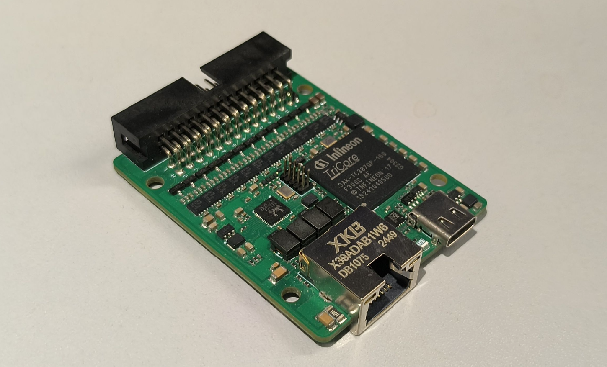

英飞凌 AURIX TC387 评估板:

- 板载 **SAK-TC387QP-160F300S** AE, 四核 300MHz Tricore, LFBGA-292 封装
- 引出 12 路 CANFD, 支持8Mbits/s, TI 的车规CANFD收发器 **TCAN1057AVDRBRQ1**, 板子背面可自行焊接 0805 封装的 120Ω 终端电阻
- 千兆以太网, PHY为工业级 RTL8211FI-CG
- **CH343** USB串口, Type-C 引出
- 1.27_2x5P 调试口, 接 **DAP MiniWiggler**, 官方, 逐飞或第三方调试器均适用
- 双用户LED
- 可 Type-C直接供电, 也可外接 DC 8~28V 供电, 或两者同时供电

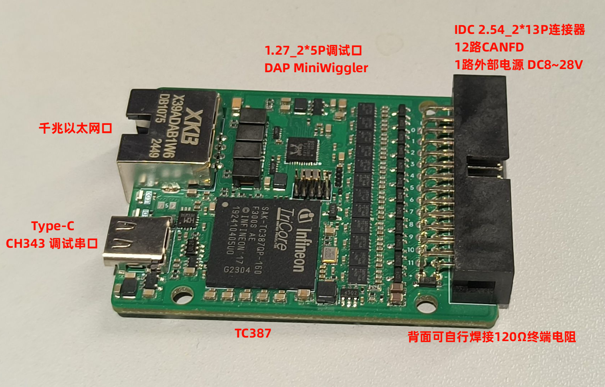

2*13P 引脚定义:

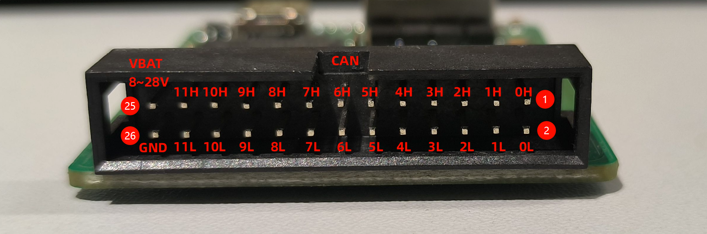

2*5P 调试口定义:

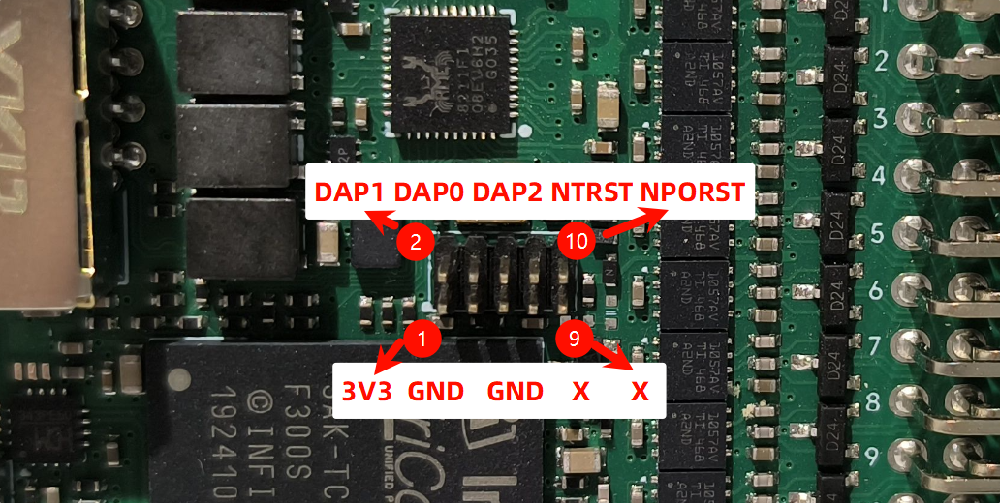

注意:

- 板子上调试口 7 9 脚是悬空的, 所以不论是调试器这两个引脚是串口还是GND, 都可以正常连接, 只要是有 1.27 10P 口的 DAP MiniWiggler, 应该都是可以用的.
- 6 DAP2 在其它家调试器可能写作 USR0, 是通用的
- 8 NTRST 在其它家调试器可能写作 USR1, 是通用的
- 10 NPORST 在其它家调试器可能写作 RST, 是通用的

调试器连接, 注意图中灰排线最左边**红紫色线对应1.27_2x5P调试口1脚**VREF(3V3)的位置:

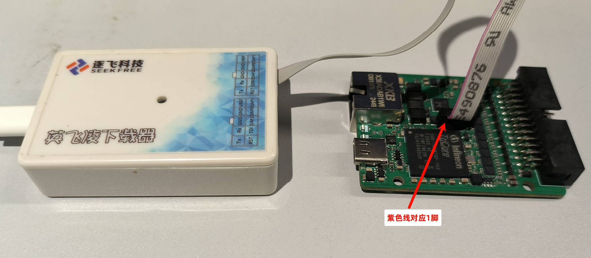

## 版本和下载说明

有现成的工程或 HEX 文件可用于快速评估板子硬件情况.

用到的软件版本:

- [Aurix Development Studio](https://www.infineon.cn/design-resources/platforms/aurix-software-tools/aurix-tools/aurix-development-studio) 1.10.24, 以下简称 ADS
- [Memtool](https://softwaretools.infineon.com/tools/com.ifx.tb.tool.infineonmemtool) 2025.02b

工程右键 -> Set Active Project

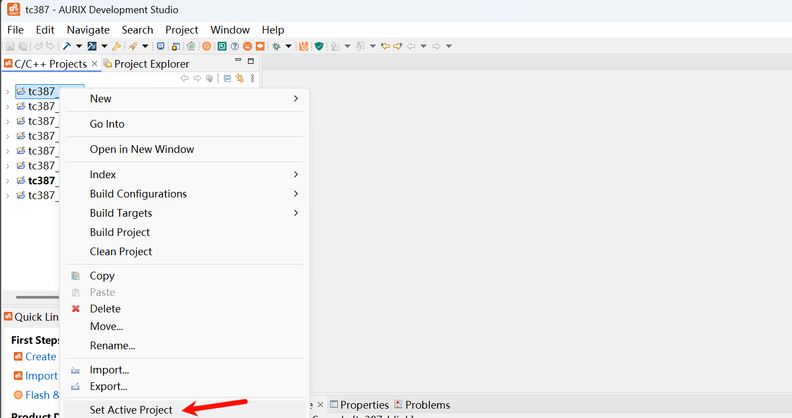

一键编译下载, 自动复位运行:

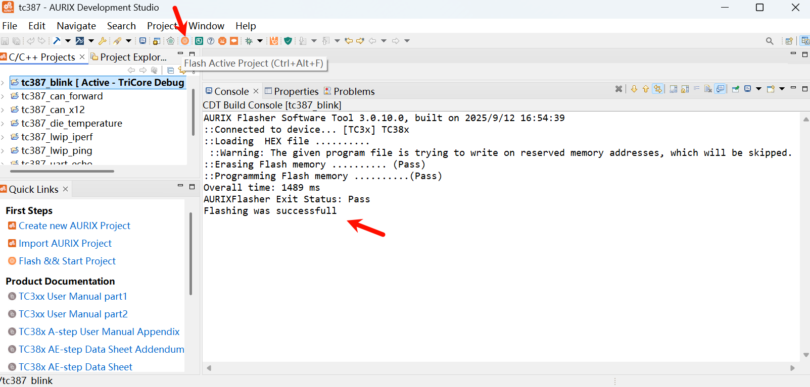

Memtool 可用于直接烧录 HEX 文件, 首次打开选择TC38x的目标配置, Target -> Change -> Default 选TC38x:

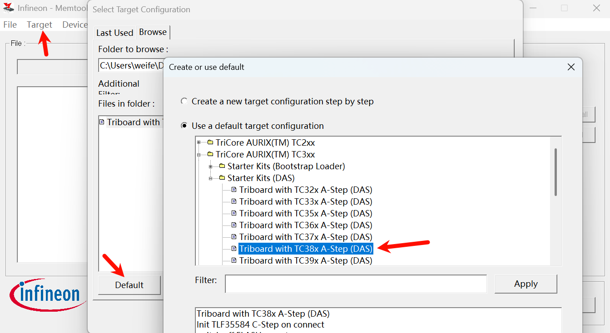

1 连接, 2 打开HEX文件, 3 选择全部, 4 添加选择, 5 选 PFlash, 6 编程, 再点击 Disconnect 断开连接, 重新上电运行

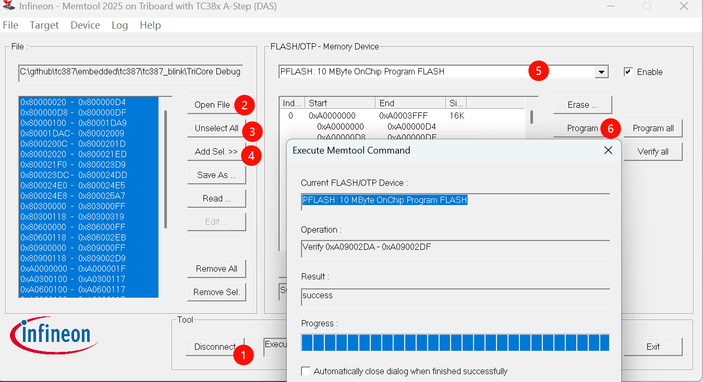

## tc387_blink

两个 LED 连接到 P02.3 和 P02.2, 低电平点亮, 每 500ms 翻转一次电平

```c
// LED
const IfxPort_Io_ConfigPin configLedPin[] = {
    {&IfxPort_P02_3, IfxPort_Mode_outputPushPullGeneral,
     IfxPort_PadDriver_cmosAutomotiveSpeed1}, // LED1
    {&IfxPort_P02_2, IfxPort_Mode_outputPushPullGeneral,
     IfxPort_PadDriver_cmosAutomotiveSpeed1}, // LED2
};
const IfxPort_Io_Config confLed = {sizeof(configLedPin) /
                                       sizeof(IfxPort_Io_ConfigPin),
                                   (IfxPort_Io_ConfigPin *)configLedPin};
IfxPort_Io_initModule(&confLed);
IfxPort_setPinLow(&MODULE_P02, 3); // LED1 off
IfxPort_setPinLow(&MODULE_P02, 2); // LED2 off

while (1) {
  waitTime(
      IfxStm_getTicksFromMilliseconds(BSP_DEFAULT_TIMER, 500)); // wait 500ms
  IfxPort_togglePin(&MODULE_P02, 3);                            // toggle LED1
  IfxPort_togglePin(&MODULE_P02, 2);                            // toggle LED2
}
```

下载程序后, 可以看到两个 LED 每 500ms 变换一次状态.

## tc387_uart_print

参考 `"AURIX_code_examples\code_examples\iLLD_TC375_ADS_printf_scanf\README.md"` 中的说明:

- 调用 printf 函数时, TASKING 编译器使用函数 _io_putc  一次发送一个字符
- 调用 printf 函数时, GCC 编译器会提供使用函数 write 发送的完整字符串。

参考代码:

```c
#ifdef __TASKING__

/* Retarget for Tasking compiler */
void _io_putc(int c, struct _io *io) {
  if (io->fp == NULL) {
    /* Called on print on string */
    /* If we still have enough space in the string */
    if (io->ptr < io->end) {
      *(io->ptr++) = (char)c;
    }
  } else {
    while (IfxAsclin_getTxFifoFillLevelFlagStatus(SERIALIO.asclin) != TRUE) {
    }

    IfxAsclin_clearTxFifoFillLevelFlag(SERIALIO.asclin);

    /* Send the character */
    IfxAsclin_writeTxData(SERIALIO.asclin, c);
  }
}

#endif /* __TASKING__ */

#ifdef __HIGHTEC__

/* Retarget for GCC compiler */
int write(int desc, void *buf, size_t len) {
  char *buf_char;
  int write_cnt;

  /* Descriptor is 1 for stdout */
  if (desc != 1) {
    __debug();
  }

  buf_char = (char *)buf;
  write_cnt = len;

  while (write_cnt) {
    while (IfxAsclin_getTxFifoFillLevelFlagStatus(SERIALIO.asclin) != TRUE) {
    }

    IfxAsclin_clearTxFifoFillLevelFlag(SERIALIO.asclin);

    /* Send the character */
    IfxAsclin_writeTxData(SERIALIO.asclin, *buf_char++);

    write_cnt -= 1;
  }
  return len;
}

#endif
```

当然, 也可以自己写, 这里给出 print 的简单实现:

```c
void print(const char* fmt, ...)
{
    char buffer[256];
    va_list args;
    va_start(args, fmt);
    int len = vsnprintf(buffer, sizeof(buffer), fmt, args);
    va_end(args);
    if (len > 0)
    {
        Ifx_SizeT wlen = (Ifx_SizeT)len;
        IfxAsclin_Asc_write(&uart4.ascHandle, (uint8*)buffer, &wlen, TIME_INFINITE);
    }
}
```

Type-C 连接的是 uart4, 也就是 ASCLIN4, RX-P00.12, TX-P00.9, 速率设置到 4Mbits/s:

```c
init_uart4(4000000); /* 设置高波特率，4Mbps，可按需要修改 */
```

对 print 简单测试:

```c
// print 测试, 字符串, 整数, 浮点数, uint64
print("Hello, UART4!\n");
print("Integer: %d\n", 123);
print("Float: %.2f\n", 3.14);
print("Unsigned 64-bit: %" PRIu64 "\n", (uint64)1234567890123456789ULL);
```

运行:

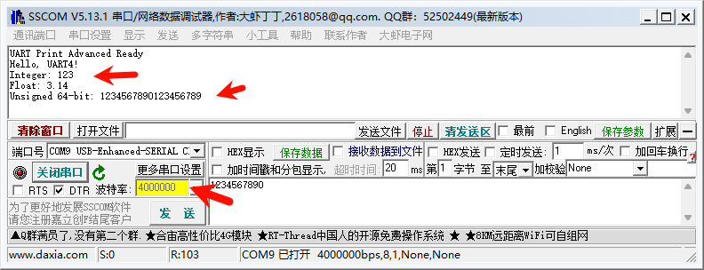

## tc387_uart_echo

上面 print 只测试了发送, echo 能测收发, 这里实现了以下特性：

- 批量读取：IfxAsclin_Asc_read
- 行结束：'\n'；可选处理'\r' (过滤)
- 过滤 CR: 丢弃'\r'
- 行超时：超过 ECHO_LINE_TIMEOUT_MS 毫秒未收满(未遇到'\n')，自动回显已有数据并加 '\r\n'
- 非阻塞批量发送：聚合行后调用 IfxAsclin_Asc_write，一次写出（必要时分片）

运行测试, 勾选 加回车换行, 定时 1ms 发送, 每次 100 字节

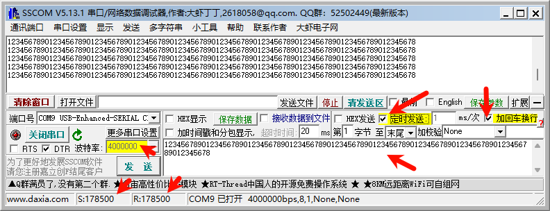

停止发送后可检查收发, 不丢字节

## tc387_die_temperature

芯片的温度测试:

```c
#define ISR_PRIORITY_DTS 4
#define MIN_TEMP_LIMIT -35 /* Lower temperature limit              */
#define MAX_TEMP_LIMIT 150 /* Upper temperature limit              */
volatile uint8 g_isMeasureAvailable =
    FALSE; /* Variable to store availability of new measurements */

IFX_INTERRUPT(DTS_ISR, 0, ISR_PRIORITY_DTS);
void DTS_ISR(void) {
  g_isMeasureAvailable =
      TRUE; /* Notify the system that a new measurement is ready */
}

/* Function to initialize the Die Temperature Sensor */
void initDieTemperatureSensor(void) {
  IfxDts_Dts_Config dtsConf;
  IfxDts_Dts_initModuleConfig(&dtsConf);
  dtsConf.lowerTemperatureLimit = MIN_TEMP_LIMIT;
  dtsConf.upperTemperatureLimit = MAX_TEMP_LIMIT;
  dtsConf.isrPriority = ISR_PRIORITY_DTS;
  dtsConf.isrTypeOfService = IfxSrc_Tos_cpu0;
  IfxDts_Dts_initModule(&dtsConf);
}

void core0_main(void) {
  // ...

  init_uart4(2000000); /* 设置高波特率，2Mbps，可按需要修改 */
  initDieTemperatureSensor();

  while (1) {
    if (g_isMeasureAvailable == TRUE) {
      float32 temperature = IfxDts_Dts_getTemperatureCelsius();
      print("Die Temperature: %.2f degC\r\n", temperature);
      g_isMeasureAvailable = FALSE; /* Reset the flag */
    }
    waitTime(IfxStm_getTicksFromMilliseconds(
        BSP_DEFAULT_TIMER, 500)); /* Wait for 500 milliseconds */
  }
}
```

运行, 看到现在芯片的温度是 48.9 ℃:

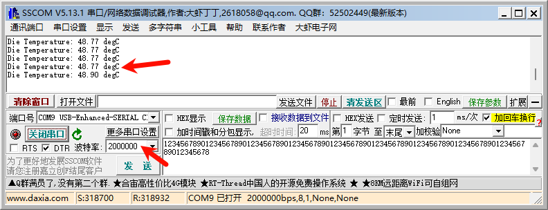

## tc387_can_forward

给出了两种设置 CAN 速率的API:

```c
init_can_simple(&can[0], CAN0, 500000, 0.8, 2000000,
                0.8); // 500kbps 80%, 2Mbps 80%
init_can_simple(&can[1], CAN1, 1000000, 0.8, 5000000,
                0.75); // 1000kbps 80%, 5Mbps 75%

// init_can(&can[0], CAN0, 8, 15, 4, 2, 15, 4); // 500kbps 80%, 2Mbps 80%
// init_can(&can[1], CAN1, 4, 15, 4, 1, 11, 4); // 1000kbps 80%, 5Mbps 75%
```

效果是一样的, 在 can0 的接收中断里直接原封不动转给 can1:

```c
static uint8 dlc2len[16] = {0, 1,  2,  3,  4,  5,  6,  7,
                            8, 12, 16, 20, 24, 32, 48, 64};

// can0 rx callback, 把收到的帧全部转发到can1
void can0_rx_callback(canChannel channel, IfxCan_Message *msg) {
  // copy data to can1 tx buffer
  (void)channel;
  uint8 len = dlc2len[msg->dataLengthCode];
  for (uint8 i = 0; i < len; i++) {
    can[1].txData[i] = can[0].rxData[i];
  }
  can[1].txMsg = *msg;
  if (!IfxCan_Can_isTxFifoQueueFull(&can[1].node)) {
    while (IfxCan_Can_sendMessage(&can[1].node, &can[1].txMsg,
                                  (uint32 *)can[1].txData) != IfxCan_Status_ok)
      ;
  }
  // 或者不copy，直接转发
}
```

使用支持 linux socketcan 的 hscant 进行测试, 单个可支持 4 路 CANFD, 使用前 2 路, 接线如图:

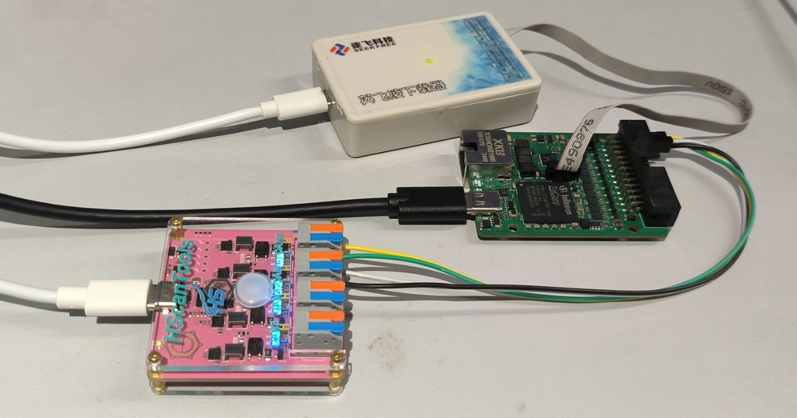

hscant 的设置脚本:

```bash
#!/bin/bash

# can0 500K + 2M
sudo ip link set can0 down
    sudo ip link set can0 type can \
        tq 100 \
        prop-seg 1\
        phase-seg1 14 \
        phase-seg2 4 \
        sjw 4 \
        dtq 25 \
        dprop-seg 1 \
        dphase-seg1 14 \
        dphase-seg2 4 \
        dsjw 4 \
        fd on \
        restart-ms 100
sudo ip link set can0 mtu 72
sudo ip link set can0 up
sudo ip link set can0 type can termination 120
sudo ifconfig can0 txqueuelen 1000

# can1 1M + 5M
sudo ip link set can1 down
sudo ip link set can1 type can \
        bitrate 1000000 sample-point 0.8 \
        dbitrate 5000000 dsample-point 0.75 \
        fd on restart-ms 200
sudo ip link set can1 mtu 72
sudo ip link set can1 up
sudo ip link set can1 type can termination 120
sudo ifconfig can1 txqueuelen 1000
```

其中的 termination 120 指开启 120Ω 终端电阻.

测试如图, 可以看到通过hscant can0 发出去的数据, 在hscant can1 被成功接收:

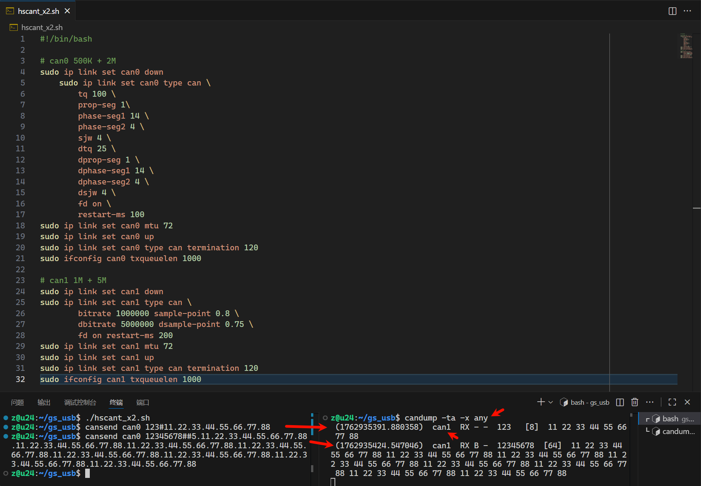

## tc387_can_x12

12路 CANFD:

```c
typedef enum {
  CAN0 = 0,
  CAN1,
  CAN2,
  CAN3,
  CAN4,
  CAN5,
  CAN6,
  CAN7,
  CAN8,
  CAN9,
  CAN10,
  CAN11,
  CAN_NUM
} canChannel;

// clang-format off
static const IfxCan_Can_Pins can_pins[CAN_NUM] = {
    {&IfxCan_TXD00_P02_0_OUT, IfxPort_OutputMode_pushPull, &IfxCan_RXD00A_P02_1_IN, IfxPort_InputMode_pullUp, IfxPort_PadDriver_cmosAutomotiveSpeed4},
    {&IfxCan_TXD01_P15_2_OUT, IfxPort_OutputMode_pushPull, &IfxCan_RXD01A_P15_3_IN, IfxPort_InputMode_pullUp, IfxPort_PadDriver_cmosAutomotiveSpeed4},
    {&IfxCan_TXD02_P32_5_OUT, IfxPort_OutputMode_pushPull, &IfxCan_RXD02C_P32_6_IN, IfxPort_InputMode_pullUp, IfxPort_PadDriver_cmosAutomotiveSpeed4},
    {&IfxCan_TXD03_P20_10_OUT, IfxPort_OutputMode_pushPull, &IfxCan_RXD03E_P20_9_IN, IfxPort_InputMode_pullUp, IfxPort_PadDriver_cmosAutomotiveSpeed4},
    {&IfxCan_TXD10_P00_0_OUT, IfxPort_OutputMode_pushPull, &IfxCan_RXD10A_P00_1_IN, IfxPort_InputMode_pullUp, IfxPort_PadDriver_cmosAutomotiveSpeed4},
    {&IfxCan_TXD11_P00_4_OUT, IfxPort_OutputMode_pushPull, &IfxCan_RXD11B_P00_5_IN, IfxPort_InputMode_pullUp, IfxPort_PadDriver_cmosAutomotiveSpeed4},
    {&IfxCan_TXD12_P20_7_OUT, IfxPort_OutputMode_pushPull, &IfxCan_RXD12A_P20_6_IN, IfxPort_InputMode_pullUp, IfxPort_PadDriver_cmosAutomotiveSpeed4},
    {&IfxCan_TXD13_P33_4_OUT, IfxPort_OutputMode_pushPull, &IfxCan_RXD13B_P33_5_IN, IfxPort_InputMode_pullUp, IfxPort_PadDriver_cmosAutomotiveSpeed4},
    {&IfxCan_TXD20_P34_1_OUT, IfxPort_OutputMode_pushPull, &IfxCan_RXD20C_P34_2_IN, IfxPort_InputMode_pullUp, IfxPort_PadDriver_cmosAutomotiveSpeed4},
    {&IfxCan_TXD21_P20_3_OUT, IfxPort_OutputMode_pushPull, &IfxCan_RXD21C_P20_0_IN, IfxPort_InputMode_pullUp, IfxPort_PadDriver_cmosAutomotiveSpeed4},
    {&IfxCan_TXD22_P33_12_OUT, IfxPort_OutputMode_pushPull, &IfxCan_RXD22A_P33_13_IN, IfxPort_InputMode_pullUp, IfxPort_PadDriver_cmosAutomotiveSpeed4},
    {&IfxCan_TXD23_P14_9_OUT, IfxPort_OutputMode_pushPull, &IfxCan_RXD23A_P14_10_IN, IfxPort_InputMode_pullUp, IfxPort_PadDriver_cmosAutomotiveSpeed4},
};
// clang-format on
```

初始化:

```c
  // 所有通道 1000kbps 80%, 5Mbps 75%
  for (canChannel ch = CAN0; ch < CAN_NUM; ch++) {
    init_can(&can[ch], ch, 4, 15, 4, 1, 11, 4);
    // init_can_simple(&can[ch], ch, 1000000, 0.8, 5000000, 0.75);
  }

  // 所有通道 500kbps 80%, 2Mbps 80%
  // for (canChannel ch = CAN0; ch < CAN_NUM; ch++) {
  //   init_can_simple(&can[ch], ch, 500000, 0.8, 2000000, 0.8);
  // }

  // 所有通道 1Mbps 80%, 8Mbps 80%
  // for (canChannel ch = CAN0; ch < CAN_NUM; ch++) {
  //   init_can_simple(&can[ch], ch, 1000000, 0.8, 8000000, 0.8);
  //   // init_can(&can[ch], ch, 4, 15, 4, 1, 7, 2);
  // }
```

进行echo测试

```c
// can rx callback, 把收到的帧全部echo回去
void can_rx_callback(canChannel channel, IfxCan_Message *msg) {
  // copy data to can1 tx buffer
  uint8 len = dlc2len[msg->dataLengthCode];
  for (uint8 i = 0; i < len; i++) {
    can[channel].txData[i] = can[channel].rxData[i];
  }
  can[channel].txMsg = *msg;
  if (!IfxCan_Can_isTxFifoQueueFull(&can[channel].node)) {
    while (IfxCan_Can_sendMessage(&can[channel].node, &can[channel].txMsg,
                                  (uint32 *)can[channel].txData) != IfxCan_Status_ok)
      ;
  }
}
```

用 hscant 的 can1 挨个进行测试:

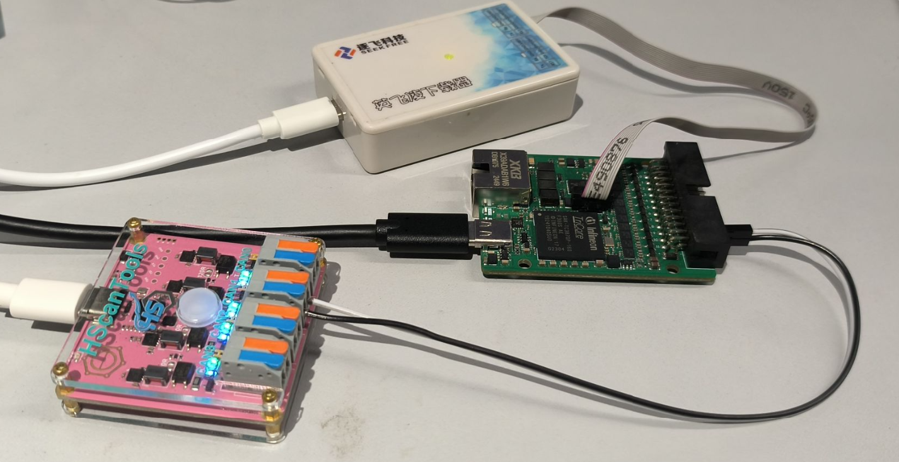

如图, 12路均能正常 echo, 且 echo 时延均小于 100us

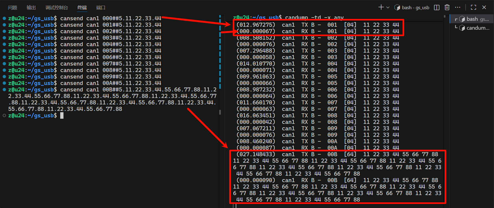

## tc387_lwip_ping

外置的千兆 PHY 为 RTL8211, 使用的 LwIP 版本为 2.1.2

引脚 P11.15 连接到 RTL8211 的复位引脚, 程序运行初始可先复位:

```c
// eth PHY RESET
IfxPort_setPinModeOutput(&MODULE_P11,15, IfxPort_OutputMode_pushPull, IfxPort_OutputIdx_general);
IfxPort_setPinLow(&MODULE_P11,15);
waitTime(IfxStm_getTicksFromMilliseconds(BSP_DEFAULT_TIMER, 90));
IfxPort_setPinHigh(&MODULE_P11,15);
waitTime(IfxStm_getTicksFromMilliseconds(BSP_DEFAULT_TIMER, 10));
```

设置 mac 和 ip 地址:

```c
/* Define a MAC Address */
eth_addr_t ethAddr;
ethAddr.addr[0] = 0xDE;
ethAddr.addr[1] = 0xAD;
ethAddr.addr[2] = 0xBE;
ethAddr.addr[3] = 0xEF;
ethAddr.addr[4] = 0xFE;
ethAddr.addr[5] = 0xED;

ip_addr_t ipAddr    = IPADDR4_INIT_BYTES(192, 168,   0, 100); /* IP address  */
ip_addr_t netMask   = IPADDR4_INIT_BYTES(255, 255, 255,   0); /* Netmask     */
ip_addr_t gateway   = IPADDR4_INIT_BYTES(192, 168,   0,   1); /* Gateway     */

Ifx_Lwip_init_with_ip(ethAddr, ipAddr, netMask, gateway);     /* Initialize LwIP with static IP */
```

电脑的 IP 地址设为 192.168.0.2:

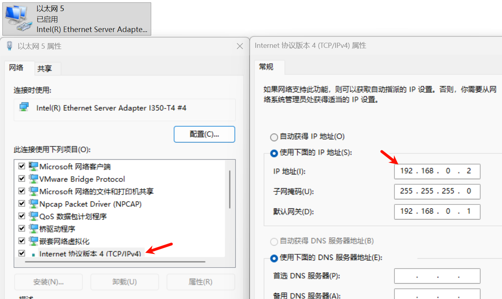

下载程序后可以看到串口(115200)的打印, 板子的 IP 地址是 192.168.0.100:

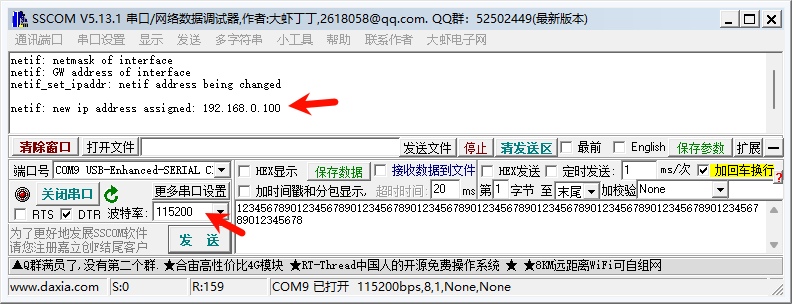

连接速率是 1Gbps:

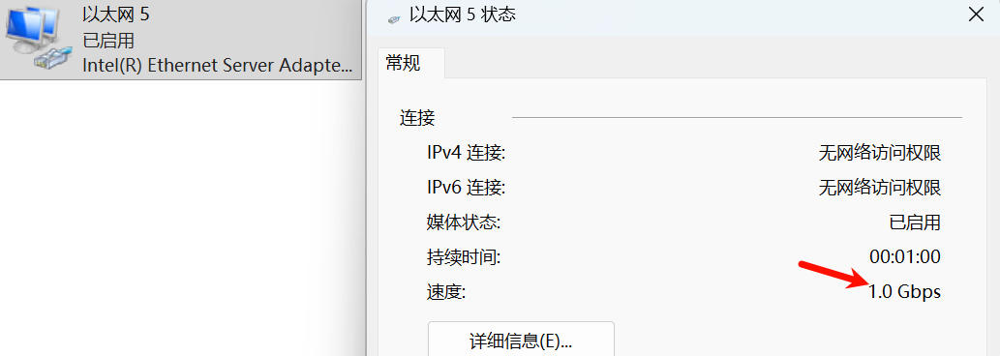

ping 测试正常:

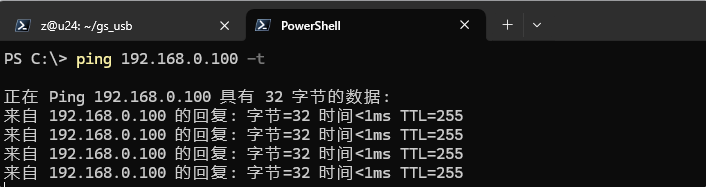

查看 mac 地址 `Get-NetNeighbor -IPAddress "192.168.0.100"`, 结果与设置相同:

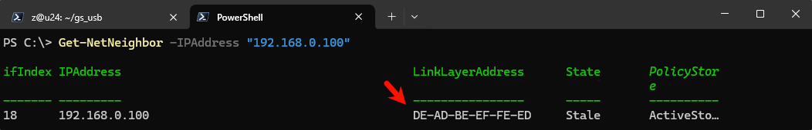

## tc387_lwip_iperf

lwipopts.h 中把 TCP_MSS 从 512 提到 1024:

```c
#define TCP_MSS                 1024
```

netif.c 中把收发队列大小从 2560 提到 8192:

```c
GethConfig.mtl.txQueue[0].txQueueSize = IfxGeth_QueueSize_8192Bytes;
GethConfig.mtl.rxQueue[0].rxQueueSize = IfxGeth_QueueSize_8192Bytes;
```

使用 jperf 进行测试, 速率基本稳定在 162 Mbits/s, 与网络上其他人测试 TC397 iperf 速率相当, 有优化的空间.

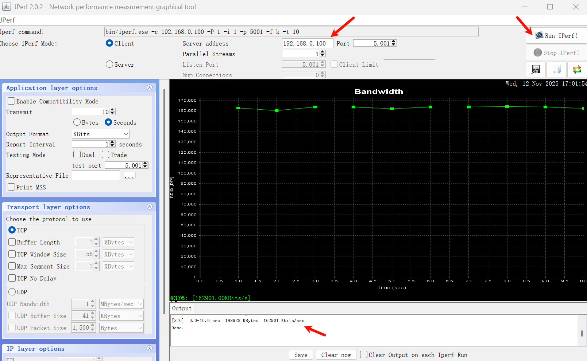

测试完串口也会打印:


使用 iperf 测试 `iperf.exe -c 192.168.0.100 -i 1 -t 10`, 效果也是相似的

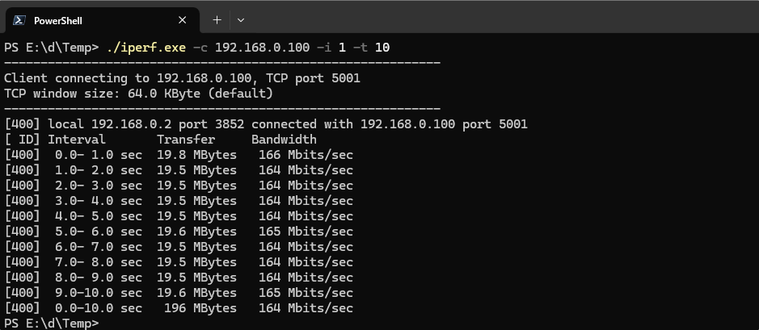

## 交流群

`嵌入式_机器人_自动驾驶交流群`: 1040239879

购买方式: xian yu 搜索用户 weifengdq, 在主页中查找.
