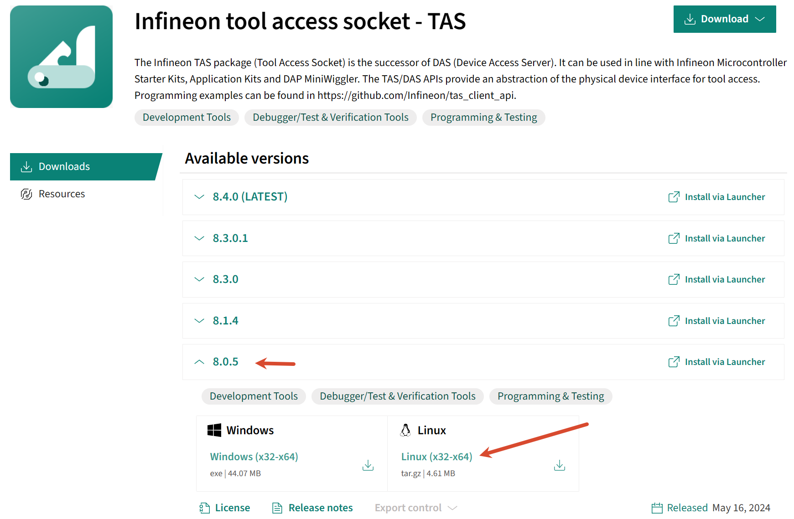

# tc387 — Infineon AURIX TC387 Linux 开发

本文档对应 tc387_1 和 tc387_2 两个工程:

- 测试环境: Ubuntu 26.04, Kernel 7.0.0-30-generic x86_64, 主要测试了 tc387_1 串口 letter-shell, tc387_2 lwip iperf, 详见文件夹下各自的 README 文档
- 工具链(tricore-gcc 13.4): [NoMore201/tricore-gcc-toolchain: Fork of EEESlab/tricore-gcc-toolchain-11.3.0 with CI/CD, automated builds/releases and additional tools (QEMU, GDB...)](https://github.com/NoMore201/tricore-gcc-toolchain)
- 调试器DAP MiniWiggler:
  - Aurix Flasher 的 Linux 版本: [volumit/aurix_flasher_linux: TAS Aurix Flasher Linux/Windows](https://github.com/volumit/aurix_flasher_linux)
  - TAS(DAS) 8.0.5: [Infineon tool access socket - TAS - Infineon Developer Center](https://softwaretools.infineon.com/tools/com.ifx.tb.tool.infineontoolaccesssockettas?_gl=1*evu3l3*_gcl_au*MTkzMTcxMTY5MS4xNzg0MjUzNzc1*_ga*MTY5MTc0MTQ1MC4xNzUyNzM2NTMz*_ga_KVD0BL538B*czE3ODgyNTgwOTYkbzEyMyRnMSR0MTc4ODI1ODMyNyRqNTAkbDAkaDk4MDkxNDg0MQ..), 参考下方图片



---

本仓库包含 TC387 (TriBoard TC2XX) 的 Linux CMake GCC 工程移植及烧录调试说明。原始 Windows ADS 工程位于 `ref/`，新 Linux 工程位于 `tc387_1/`。

## 结构

* `ref/` — 原 Windows 工程 (含 `build.ps1`, `Lcf_*.lsl`, `Libraries/iLLD`, `LAN8651` 驱动, `lwip`+`iperf`, 两套 STM32H5/H7 的 Letter-Shell 参考实现 `stm32h503_lan9370_lan8720` `stm32h723_tja1103`, 以及 `aurix_flasher_linux-master` )
* `tc387_1/` — Linux 移植版本 (见 `tc387_1/README.md`)
  * 已配置 tricore-gcc 13.4.1 (`/opt/tricore-gcc`), CMake 4.2 + Ninja 1.13
  * 一键脚本 `tc387_1/build.sh` 覆盖 `configure|build|rebuild|clean|download|reset|all`
  * 移植 Letter-Shell + 诊断命令 (`mcu`, `uid`, `temp`, `uptime`, `sysinfo` 等, 已移除 LAN8651/LwIP)
* `tc387_2/` — LwIP GETH 千兆 iperf + Letter-Shell 合并版 (见 `tc387_2/README.md`)
  * 在 `ref/tc387_lwip_iperf_gcc2` 的 fGETH 300MHz/PBLX8/流控等优化上叠加 `tc387_1` 的 921600 Shell
  * 一键脚本 `tc387_2/build.sh`，`ifconfig`/`ethstat`/`ping <ip> [count] [size]` (Ctrl+C 中止)，`iperf` 5001，板端 `192.168.0.100/24`
  * PC 直连 `enp6s0` (`192.168.0.1/24`) 测速 `~538 Mbit/s` (Debug) 见 tc387_2/README §7
* `tc387_1/build/gcc/`, `tc387_2/build/gcc/` — 编译产物 (`.elf` `.hex` `.map`)

> 详细移植、串口、烧录、命令说明请阅读 **[tc387_1/README.md](tc387_1/README.md)** 与 **[tc387_2/README.md](tc387_2/README.md)**

## 快速开始

```bash
# 1) 工具链
export PATH=/opt/tricore-gcc/bin:$PATH
tricore-elf-gcc --version  # 13.4.1

# 2) 编译 tc387_1
cd tc387_1
./build.sh build                  # Debug
./build.sh build --build-type Release

# 2b) 编译 tc387_2 (LwIP + Shell)
cd ../tc387_2
./build.sh build                  # Debug (~538 Mbit/s)
./build.sh build --build-type Release  # Release O3

# 3) 串口 (921600, P00.9/P00.12)
ls /dev/serial/by-id/*
python3 -m serial.tools.miniterm /dev/ttyACM0 921600 --raw

# 4) 下载 (需 DAS/TAS)
./build.sh download               # 需 TAS server: systemctl status tas-server
# 网络 (tc387_2)
sudo ip addr add 192.168.0.1/24 dev enp6s0 && sudo ip link set enp6s0 up
ping -I enp6s0 -c 3 192.168.0.100   # <1ms
iperf -c 192.168.0.100 -p 5001 -t 10  # ~538 Mbit/s
# 板端 Shell
# letter:/$ ping 192.168.0.1 3 32
```

产物: `tc387_1/build/gcc/tc387_1.hex` (约 203K, text 79K)；`tc387_2/build/gcc/tc387_2.hex` (21K, text 156k)

## 硬件

* TC387 无 LAN8651 (已移除), 仅 UART4 调试
* UART4: P00.9(TX) / P00.12(RX) → Linux `/dev/ttyACM0` (CH340 1a86:55d3)
* DAP MiniWiggler: `058b:0043` → Linux `/dev/ttyUSB0` (FTDI) + DAP，用于烧录
* 波特率: 921600-8N1, FIFO 1024, RX 中断 32>TX31>STM10, 详见 tc387_1/README.md §5.4

## Shell

```
tc387> help
tc387> mcu        # 芯片/复位/时钟
tc387> temp       # DTS 温度
tc387> mcu        # 芯片/复位/时钟
tc387> temp       # DTS 温度
tc387> version    # 固件版本
tc387> sysinfo    # 汇总
```

见 `tc387_1/Shell/shell_port.c`。

## 构建脚本

`tc387_1/build.sh` 替代 Windows `build.ps1`，参数一致: `configure|build|rebuild|clean|download|reset|all`，`--build-type`/`--id`/`--flash-tool`。

## 许可

* Infineon iLLD: Boost Software License 1.0
* Letter-Shell: MIT
* `aurix_flasher_linux`: MIT + Apache 2.0 (Infineon TAS)
