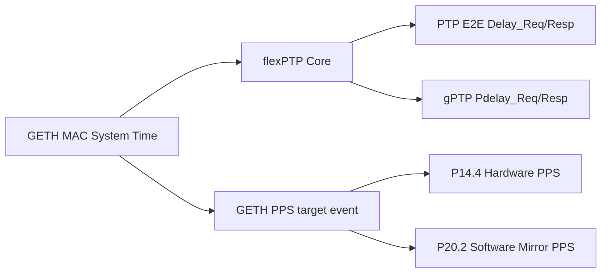

# TC387 lwIP PTP/gPTP/PPS 移植项目

基于 `tc387_lwip_iperf_gcc` 项目，集成 flexPTP 库实现 IEEE 1588 PTP/gPTP/PPS 功能。

## 硬件配置

| 项目 | 配置 |
|------|------|
| MCU | Infineon TC387 AURIX (TriCore, big-endian CPU) |
| PHY | RTL8211F (RGMII, TX-delay only) |
| 串口 | ASCLIN4, P00.12(RX)/P00.9(TX), COM31, 921600 baud |
| PPS 输出 | P14.4 (GETH 硬件 PPS), P20.2 (软件镜像 PPS) |
| 调试器 | DAP Miniwiggler, AURIXFlasher v3.0.14 |
| 网络 | 192.168.0.100/24, Gateway 192.168.0.1, MAC DE:AD:BE:EF:FE:ED |
| 工具链 | TriCore GCC 11.3.1 (AURIX Studio 1.10.28) |
| 构建系统 | CMake + Ninja |

## 文件结构

```
tc387_lwip_ptp_gcc/
├── PTP/                         # PTP 应用层代码
│   ├── flexptp_app.c/h          # PTP 生命周期管理 (start/stop/process)
│   ├── flexptp_port.c/h         # TC387 GETH 硬件时钟驱动 + PPS
│   ├── flexptp_cli_bridge.c/h   # CLI 命令分发桥接
│   ├── flexptp_options.h        # flexPTP 编译选项 (FLEXPTP_OSLESS, etc.)
├── Shell/
│   ├── shell_port.c/h           # letter-shell 端口层（复用 ASCLIN4）
│   ├── shell_cmd_list.c         # 手工命令表（help / ptp / time / info / uptime）
│   ├── shell_cfg_user.h         # letter-shell 配置
│   └── letter-shell/            # letter-shell v3.2.4 源码
├── Middlewares/Third_Party/
│   └── flexPTP/                 # flexPTP 库 (libflexptp.a)
├── Configurations/
│   └── lwipopts.h               # lwIP 配置 (ETH_PAD_SIZE, PTP 相关)
├── Libraries/
│   ├── UART/UART_Logging.c/h    # ASCLIN4 驱动 (921600, 16x oversampling, RX/TX FIFO)
│   └── Ethernet/
│       └── lwip/port/src/netif.c # low_level_output (ETH_PAD_SIZE 修复)
└── Cpu0_Main.c                  # 主入口 (lwIP 初始化, PTP 轮询)
```

## 构建和烧录

```powershell
cd tc387\tc387_lwip_ptp_gcc
.\build.ps1 -Action download    # 构建 + 烧录
.\build.ps1 -Action build       # 仅构建
.\build.ps1 -Action clean       # 清理
```

## 测试环境

- **对端**: Ubuntu 26, enp3s0 @ 192.168.0.2/24, I210 NIC (硬件时间戳)
- **SSH**: `C:\Windows\System32\OpenSSH\ssh.exe -o KexAlgorithms=+diffie-hellman-group14-sha1 -o HostKeyAlgorithms=+ssh-rsa -o PubkeyAcceptedAlgorithms=+ssh-rsa -i ~/.ssh/id_ed25519_u24 z@10.11.1.246`
- **PTP 主时钟启动**: `sudo ptp4l -i enp3s0 -2 -m -l 6`
- **PTP 抓包 (0x88F7)**: `sudo tcpdump -i enp3s0 -e -c 30 "ether proto 0x88f7"`
- **TC387 发帧抓包**: `sudo tcpdump -i enp3s0 -e -c 10 "ether src de:ad:be:ef:fe:ed"`

## 当前状态 (2026-07-14)

### ✅ 已验证完整功能

| 功能 | 状态 | 说明 |
|------|------|------|
| lwIP 网络栈 | ✅ | Ping <0.3ms, ARP/IP TX/RX 正常 |
| **PTP E2E 同步** | ✅ | Delay_Req (~1Hz) → Delay_Resp, Sync → Follow_Up 双向 |
| flexPTP 状态机 | ✅ | BMCA, Slave 模式, clock ID DE:AD:BE:FF:FE:FE:ED |
| PTP RX hook | ✅ | 0x88F7 帧通过 LWIP_HOOK_UNKNOWN_ETH_PROTOCOL → flexPTP |
| PTP TX (Delay_Req) | ✅ | PTPv2 E2E, 01:1B:19:00:00:00 |
| Hardware PTP 计数器 | ✅ | 修复 `SUB_SECOND_INCREMENT` 位域后，`time ns` 正常递增 |
| **硬件 PPS 输出** | ✅ | `ptp pps on` 后 P14.4 由 GETH PPS 逻辑驱动 |
| 软件 PPS 镜像 | ✅ | P20.2 跟随 PPS 事件翻转，便于逻辑分析仪对比 |
| MCU 稳定性 | ✅ | ptp4l 持续运行不崩溃 |
| UART Shell | ✅ | letter-shell v3.2.4 + ASC FIFO 轮询，COM31 @ 921600 |

### ⚠️ 部分工作

| 功能 | 状态 | 说明 |
|------|------|------|
| **gPTP (802.1AS)** | ✅ | shell 可切换 gPTP；`transportSpecific=0` 后可与 ptp4l `-P` 互通 |
| originTimestamp | ❌ | Delay_Req 中始终为 0（flexPTP 软件时间戳集成待做） |
| 同步精度 | ⚠️ | ~1ms（软件时钟+无硬件时间戳） |

### 测试命令

```bash
# PTP 主时钟 (需 -S 软件时间戳)
sudo ptp4l -i enp3s0 -2 -S -m -l 6

# 所有 PTP 帧
sudo tcpdump -i enp3s0 -e -c 30 "ether proto 0x88f7"

# TC387 发送的 PTP 帧 (Delay_Req)
sudo tcpdump -i enp3s0 -e -c 10 "ether src de:ad:be:ef:fe:ed and ether proto 0x88f7"

# ptp4l 发给 TC387 的 Delay_Resp
sudo tcpdump -i enp3s0 -e -c 10 "ether dst de:ad:be:ef:fe:ed and ether proto 0x88f7"

# gPTP 测试 (802.1AS)
sudo ptp4l -i enp3s0 -2 -S -m -l 6 -P
sudo tcpdump -i enp3s0 -e -c 10 "ether dst 01:80:c2:00:00:0e and ether proto 0x88f7"
```

### 串口 Shell

- 终端: COM31
- 波特率: 921600
- 格式: 8N1, 无流控
- Shell: letter-shell v3.2.4（不再使用 Ifx_Shell）

**当前内建命令**:

- `help` : 显示命令列表
- `ptp` : `on|gptp|off|status|help`
- `gptp` : 顶层快捷命令，等价于 `ptp gptp`
- `pps` : 顶层快捷命令，等价于 `ptp pps ...`
- `time` : `ns|utc|local|+H|-H|offset N`
- `info` : 显示 IP/MAC/link/PTP 状态
- `uptime` : 显示 MCU 运行时间
- `diag` : 显示 PTP RX/TX 计数器与当前时间戳

**设计说明**:

- ASCLIN4 仍由 `UART_Logging.c` 初始化
- RX 中断只负责把字节送进 iLLD/ASC 软件 FIFO
- letter-shell 在主循环 `Shell_Process()` 中轮询 `IfxAsclin_Asc_read()` 逐字节取出并调用 `shellHandler()`
- 这样可以避免自定义 RX ISR 与 iLLD FIFO 管理冲突

### gPTP (802.1AS) 状态 — ✅ 已验证

| 项目 | 状态 |
|------|------|
| Pdelay_Req | ✅ TC387 ↔ ptp4l `-P` 已验证 |
| Pdelay_Resp | ✅ TC387 回应 ptp4l 的 Pdelay_Req |
| gPTP profile | ✅ 工作配置（见下） |
| 根因修复 | `transportSpecific` 必须匹配 ptp4l（值为 0，非 802.1AS 的 1） |

**gPTP Profile 配置** (`ptp_profile_presets.c`):
- transportType: 802_3 (L2 Ethernet)
- transportSpecific: 0 (UNKNOWN_DEF, 匹配 ptp4l)
- delayMechanism: P2P
- flags: SLAVE_ONLY | ISSUE_SYNC_FOR_COMPLIANT
- AV8021ASMEN: 已在 `ptphw_init` 中设置 (GETH bit 28)

**测试命令**:
```bash
# TC387 启动 gPTP
# (代码已设为 FlexPTP_StartGptp())

# Ubuntu 端
sudo ptp4l -i enp3s0 -2 -S -m -l 6 -P

# 验证 Pdelay 双向
sudo tcpdump -i enp3s0 -e -c 20 "ether dst 01:80:c2:00:00:0e and ether proto 0x88f7"
```

### PPS 输出状态

| 项目 | 状态 |
|------|------|
| Hardware PPS | ✅ P14.4 走 GETH PPS 复用（alt6） |
| Software PPS | ✅ P20.2 作为软件镜像输出 |

## 关键修复

### 1. ETH_PAD_SIZE TX 路径修复 ⭐ (最关键的修复)

**问题**: `low_level_output()` 中 `pbuf_header(p, -ETH_PAD_SIZE)` 在 payload 偏移为 0 时永远失败。
这导致 2 字节填充垃圾被复制到 TX DMA 缓冲区的前端，GETH MAC 拒绝发送畸形帧。

**影响范围**: 所有通过 `ethernet_output` → `linkoutput` 发送的帧(包括 ARP、IP、PTP)。
内建 ARP/IP 之所以"能工作"是因为 lwIP 走了一条不同路径绕过了 `ethernet_output`。
但所有 PTP 帧、自定义以太帧都无法发送。

**修复**: `Libraries/Ethernet/lwip/port/src/netif.c` 的 `low_level_output()` 中，
memcpy 循环显式跳过第一段 pbuf 的 `ETH_PAD_SIZE` 字节：

```c
for (q = p; q != NULL; q = q->next) {
    uint16_t skip = (q == p) ? (uint16_t)ETH_PAD_SIZE : 0U;
    memcpy(&tbuf[l], (uint8_t*)q->payload + skip, q->len - skip);
    l += q->len - skip;
}
```

**验证**: tcpdump 捕获到 TC387 发送的 ARP 和 PTP (0x88F7) 测试帧。

### 2. GETH MAC 字节序 (BYTE_ORDER = LITTLE_ENDIAN)

详见 [上方 GETH MAC 字节序章节](#2-geth-mac-字节序-byte_order--little_endian)。

### 3. UART DPipe ISR 处理函数修复

**问题**: ISR 使用 `IfxAsclin_Asc_isrTransmit/Receive/Error()` 直接操作 ASC FIFO，
但 Shell 使用 `IfxStdIf_DPipe` 层。DPipe 不知道 FIFO 状态，导致 Shell 无法收发数据。

**修复**: 参考官方 `ASCLIN_Shell_UART_1_KIT_TC387_TFT` 示例，
ISR 改为调用 `IfxStdIf_DPipe_onTransmit/onReceive/onError()`：
```c
void asclin4TxISR(void) {
    if (g_uartDPipePtr != NULL_PTR)
        IfxStdIf_DPipe_onTransmit(g_uartDPipePtr);
    else
        IfxAsclin_Asc_isrTransmit(&g_asc);  // fallback
}
```
同时在 `initUARTConsole()` 中保存 DPipe 指针供 ISR 使用。

### 4. ifx_netif_input 默认分支修复 ⭐ (PTP RX 关键)

**问题**: `ifx_netif_input()` 在 `default` 分支直接丢弃所有非 ARP/IP 帧（`pbuf_free(p)`），
PTP 多播帧 (0x88F7) 从未到达 `ethernet_input` → `LWIP_HOOK_UNKNOWN_ETH_PROTOCOL`。

**修复**: `Libraries/Ethernet/lwip/port/src/netif.c`:
```c
default:
#ifdef LWIP_HOOK_UNKNOWN_ETH_PROTOCOL
    LWIP_HOOK_UNKNOWN_ETH_PROTOCOL(p, netif);  /* flexPTP hook handles 0x88F7 */
#else
    pbuf_free(p);
#endif
    break;
```

### 5. 软件 PTP 时钟 (GETH 硬件计数器不工作)

**问题**: GETH MAC 时间戳计数器在 TSENA=1, TSCTRLSSR=1, addend/increment 正确写入, TSINIT 触发后
始终保持为 0。确认 SUB_SECOND_INCREMENT 和 ADDEND 均为只写寄存器（读回 0 / 0xFFFFFFFF），
但计数器始终不递增。可能 TC387 GETH 实现限制。

**解决**: 实现基于 `g_TickCount_1ms` 的软件时钟 (`flexptp_port.c`):
- `ptphw_gettime()` 返回从 1ms tick 累加的秒+纳秒
- `flexptp_ptp_set_clock()` 设置软件时钟值
- `flexptp_ptp_set_addend()` 调整时钟速率 (PPB)
- 分辨率 1ms，适合 PTP 状态机 (BMCA, Delay_Req/Resp)

### 6. GETH PTP 识别位导致 DMA 崩溃

**问题**: 启用 TSVER2ENA/TSIPENA/TSIPV4ENA (PTP 帧识别位) 后，
当 PTP 帧 (0x88F7) 从 Ubuntu ptp4l 到达时，GETH DMA 在 ~4-14 秒后崩溃。

**根因**: 通过二分法隔离：
- TSENA=1 only → 稳定（计数器不跑）
- TSENA + TSCTRLSSR → 稳定
- TSENA + TSCTRLSSR + TSVER2ENA/TSIPENA/TSIPV4ENA → **崩溃**
- SNAPTYPSEL=0 不能防止崩溃

**修复**: `ptphw_init()` 中仅设置 TSENA=1，不设置任何 PTP 识别位。
PTP 帧仍通过 normal lwIP 路径 (ethernet_input → LWIP_HOOK_UNKNOWN_ETH_PROTOCOL) 到达 flexPTP。

### 7. PTP RX Hook 完整性

**验证**: tcpdump 确认 Ubuntu Announce/Sync/Follow_Up 到达 TC387，
flexPTP RX hook (`nsd_lwip.c`) 正确识别 ethertype 0x88F7 + 多播 MAC，
调用 `ptp_receive_enqueue()` 入队。TC387 状态机以 Slave 模式发送 Delay_Req (~1Hz)。

**发现**: TC387 的 lwIP 移植在 `cc.h` 中定义 `BYTE_ORDER = LITTLE_ENDIAN`。
这是因为 GETH MAC 内部使用小端字节序 (与 TriCore CPU 的大端不同)。

**影响**:
- `lwip_htons(x)` 和 `PP_HTONS(x)` **都会字节交换**
- `ethernet_output()` 内部调用 `lwip_htons(eth_type)` 进行交换
- GETH MAC 硬件在发送时将内存中的 LE 数据交换回网络字节序 (BE)

**正确的以太类型传递方式**:
```c
// ✅ 正确 — 传原生值, ethernet_output 会 htons
ethernet_output(netif, p, src, dst, 0x88F7);

// ❌ 错误 — PP_HTONS 导致双重交换
ethernet_output(netif, p, src, dst, PP_HTONS(0x88F7));
```

### 3. UART 非阻塞发送

**问题**: `sendUARTMessage()` 使用 `TIME_INFINITE` 超时。
如果 UART TX ISR 未触发或 FIFO 满，整个主循环会永久挂死。

**修复**: 将超时从 `TIME_INFINITE` 改为 `0`（非阻塞）。
未发送的字节会被丢弃，但主循环不会被阻塞。

### 4. MAC 时间戳寄存器配置

在 `PTP/flexptp_port.c` 的 `ptphw_init()` 中：
```c
GETH_MAC_TIMESTAMP_CONTROL.B.SNAPTYPSEL = 1;  // 使用 PTP 消息类型做快照
GETH_MAC_TIMESTAMP_CONTROL.B.TSIPV4ENA = 1;   // IPv4 时间戳
GETH_MAC_TIMESTAMP_CONTROL.B.TSVER2ENA = 1;   // PTPv2 时间戳
GETH_MAC_TIMESTAMP_CONTROL.B.TSEVNTENA = 1;   // 事件消息时间戳
GETH_MAC_TIMESTAMP_CONTROL.B.TSENA = 1;       // 启用时间戳
```

确认 MAC 时间戳与 TX 不冲突——修复 ETH_PAD_SIZE 后，时间戳和 TX 可以共存。

## PTP 测试步骤

### 1. 验证基础网络
```bash
ping 192.168.0.100  # 确保 <1ms
```

### 2. 验证 PTP 以太类型 TX (test_tx_ptp)
```bash
sudo tcpdump -i enp3s0 -e -c 5 "ether src de:ad:be:ef:fe:ed and ether proto 0x88f7"
# 应每 5 秒看到一个来自 DE:AD:BE:EF:FE:ED 的 PTP 帧 (0x88F7)
```

### 3. 启动 PTP 主时钟
```bash
sudo ptp4l -i enp3s0 -2 -m -l 6
# ptp4l 将在 ~6 秒后成为 Grandmaster
```

### 4. 监视 PTP 流量
```bash
# 全方向 PTP 帧
sudo tcpdump -i enp3s0 -e -c 30 "ether proto 0x88f7"
```

## GETH 多播 RX 故障排除

**症状**: TC387 接收 PTP 主时钟帧后，~4 秒内 GETH DMA 崩溃，MCU 失去网络连接。

**发现**:
- ✅ `IfxGeth_mac_setPromiscuousMode(TRUE)` 使 GETH 成功接收 PTP 多播帧
- ✅ PTP 帧成功到达 `ifx_netif_input()` → `ethernet_input()` → hook
- ❌ 混杂模式 (PR=1) 运行 ~4 秒后 GETH DMA 崩溃（总线错误/描述符损坏）
- ❌ 仅 PM=1 (Pass All Multicast) 似乎不足以接收 PTP 多播帧
- ❌ `ptp_receive_enqueue()` 在所有参数组合下都导致崩溃（flexPTP 库函数）
- ❌ iLLD 缺少添加 MAC 地址滤波器条目的 API（仅有 `setMacAddress` 设置主地址）

**下一步**:
1. 查阅 TC387 GETH 参考手册，确认 `MAC_PACKET_FILTER.PR` 为何导致 DMA 崩溃
2. 查找 iLLD 中是否隐藏了 MAC 地址滤波器 API（如 `IfxGeth_mac_addAddress`）
3. 用 J-Link 调试器捕获崩溃时的异常向量和寄存器状态
4. 测试 `ptp_receive_enqueue` 独立调用（绕过完整 PTP init 流程）
5. 检查 flexPTP 库版本是否与 TC387 平台兼容

## 调试命令

```bash
# Ping 连通性
ping -c 4 -W 1 192.168.0.100

# 抓所有来自 MCU 的帧
sudo tcpdump -i enp3s0 -e -c 10 "ether src de:ad:be:ef:fe:ed"

# 抓 PTP 帧 (全方向)
sudo tcpdump -i enp3s0 -v -c 20 "ether proto 0x88f7"

# 查看 PTP 报文详情
sudo tcpdump -i enp3s0 -vvv -c 5 "ether proto 0x88f7"
```

## 技术参考

- **ETH_PAD_SIZE 注意事项**: 见 `/memories/repo/tc387_lan8651_notes.md` (lwip_eth_pad_size.md)
- **lwIP 端口**: `Libraries/Ethernet/lwip/port/`
- **lwIP 配置**: `Configurations/lwipopts.h` (ETH_PAD_SIZE=2, LWIP_HOOK_UNKNOWN_ETH_PROTOCOL, LWIP_PBUF_CUSTOM_DATA)
- **PTP 配置**: `PTP/flexptp_options.h` (FLEXPTP_OSLESS, PTP_ADDEND_INTERFACE, LWIP)
- **时钟参数**: `PTP_MAIN_OSCILLATOR_FREQ_HZ=150000000`, `PTP_INCREMENT_NSEC=7`
- **PTP 默认 Profile**: L2 Ethernet (PTP_TP_802_3), E2E 延迟 (PTP_DM_E2E), domain 0, priority1=0

## 参考项目

- `tc387_lwip_iperf_gcc` — 网络基线 (iperf)
- `tc387_lwip_ping` — Ping 测试
- `stm32h723_lan8671` — STM32H723 PTP 参考实现 (已验证可用)

## 串口与 Shell 详细说明

### 串口设计目标

本工程的串口目标不是“能打印日志”就算完成，而是满足以下三条：

| 目标 | 说明 |
|------|------|
| 高吞吐 | 921600 bps，避免大量 PTP/gPTP 日志时阻塞主循环 |
| 可交互 | 退格、方向键、Tab、Enter、命令回显都必须可用 |
| 不干扰网络 | UART 中断和 GETH 中断不能互相踩踏，不能因为 shell 输入导致 PTP 或 lwIP 掉线 |

### 当前实现结构

当前串口链路由两层组成：

1. `Libraries/UART/UART_Logging.c`
   负责 ASCLIN4 的底层初始化、FIFO、中断和裸字节收发。
2. `Shell/shell_port.c`
   负责把 ASC 软件 FIFO 中收到的字节交给 letter-shell 解释。

### 为什么不再使用 Ifx_Shell

原始 `Ifx_Shell` 在本项目中的主要问题不是功能不全，而是交互体验差：

| 问题 | 现象 |
|------|------|
| 输入回显混乱 | `help` 经常被拆成乱码片段 |
| 退格不可预期 | 退格后光标和缓冲状态不一致 |
| 命令提示上下文少 | 对 PTP/gPTP/PPS 的入口不清晰 |
| 命令扩展成本高 | 很多逻辑需要额外桥接 |

letter-shell 的优势：

| 能力 | 价值 |
|------|------|
| 成熟的按键处理 | Backspace / Delete / Arrow / Tab 都有现成逻辑 |
| 手工命令表 | 易于把 PTP/gPTP/PPS 命令归拢成统一入口 |
| 交互提示更接近 Linux CLI | 用户学习成本更低 |
| 易于脚本化 | 可通过 pyserial / PowerShell SerialPort 自动测试 |

### 当前命令表

| 命令 | 作用 | 说明 |
|------|------|------|
| `help` | 显示命令帮助 | 使用 letter-shell 内建 `shellHelp()` |
| `users` | 显示用户 | 调试用 |
| `cmds` | 显示命令表 | 调试用 |
| `vars` | 显示变量 | 调试用 |
| `keys` | 显示按键 | 用于验证退格/方向键映射 |
| `clear` | 清屏 | 终端辅助 |
| `ptp` | 统一 PTP/gPTP/PPS 入口 | `ptp on/off/gptp/status/help/pps ...` |
| `gptp` | gPTP 快捷入口 | 等价于 `ptp gptp` |
| `pps` | PPS 快捷入口 | 等价于 `ptp pps ...` |
| `time` | 显示 PTP 时间 | `time ns` 最常用 |
| `info` | 显示链路和 PTP 状态 | 现场调试入口 |
| `uptime` | 显示运行时间 | 系统活性确认 |
| `diag` | 显示 PTP 收发计数器 | 用于定位“收到了没处理”还是“根本没收到” |

### Shell 回归测试方法

建议每次修改 shell 后都跑以下 4 项：

| 测试项 | 输入 | 预期 |
|------|------|------|
| 基础帮助 | `help` | 打印完整命令列表并回到 prompt |
| 退格 | `hel<BS>lp` | 最终执行 `help` |
| 状态查询 | `info` | 打印 link/PTP/profile |
| PPS 快捷命令 | `pps on` | 打印 `PPS: hw=P14.4 sw=P20.2 ...` |

### 自动化串口测试脚本示例

#### Python / pyserial

```python
import time
import serial

ser = serial.Serial('COM31', 921600, timeout=0.2, write_timeout=0.2)

def cmd(text, wait=2.0):
    ser.reset_input_buffer()
    ser.write((text + '\r').encode('ascii'))
    ser.flush()
    end = time.time() + wait
    buf = bytearray()
    while time.time() < end:
        buf += ser.read_all()
    return buf.decode('utf-8', 'replace')

print(cmd('help'))
print(cmd('info'))
print(cmd('ptp status'))
ser.close()
```

#### PowerShell / SerialPort

```powershell
$port = New-Object System.IO.Ports.SerialPort COM31,921600,None,8,one
$port.ReadTimeout = 200
$port.WriteTimeout = 200
$port.Open()
$port.Write("help`r")
Start-Sleep -Milliseconds 1500
$port.ReadExisting()
$port.Close()
```

### 串口层的关键经验

| 经验 | 说明 |
|------|------|
| 不要在 RX ISR 里“手动抢读 + 自己维护第二套 FIFO” | 这会和 iLLD 的软件 FIFO 竞争，导致数据丢失或状态错乱 |
| shell 应该从已有的 ASC 软件 FIFO 读数据 | `IfxAsclin_Asc_getReadCount()` + `IfxAsclin_Asc_read()` 是稳定用法 |
| 921600 不仅要改波特率，还要显式配置 oversampling/sample point | 否则高波特率时 jitter 容忍度太低 |
| shell 和 debug print 不能都使用阻塞输出 | 否则在高频日志下会拖慢主循环 |

## PTP / gPTP / PPS 体系概览

### 三个概念的区别

| 能力 | 典型协议 | 本工程作用 |
|------|------|------|
| PTP | IEEE 1588-2008 | 默认采用 E2E，适合与 Linux `ptp4l` 互通 |
| gPTP | IEEE 802.1AS | 采用 P2P，面向车载/TSN/工业同步 |
| PPS | 1Hz 脉冲输出 | 用于示波器/逻辑分析仪/外部时间基准对齐 |

### 本工程中的三条时间链路



### 当前时间源关系

当前 `time ns` 命令读到的值，已经来自 GETH MAC system time，而不是软件模拟时钟。也就是说：

$$
T_{reported} = T_{GETH\_MAC\_SYSTEM\_TIME}
$$

这一步是硬件 PPS 的前提，因为硬件 PPS 事件本质上是：

$$
T_{now} = T_{target} \Rightarrow \text{toggle PPS output}
$$

如果系统时间不动，则不会有任何 PPS target 事件。

## GETH 时间戳与 PPS 硬件路径

### 关键寄存器

| 寄存器 | 用途 | 当前作用 |
|------|------|------|
| `MAC_TIMESTAMP_CONTROL` | 时间戳主控 | 使能 TSENA / TSCTRLSSR / AV8021ASMEN |
| `MAC_TIMESTAMP_ADDEND` | Addend | 频率微调 |
| `MAC_SUB_SECOND_INCREMENT` | 每 tick 增量 | 决定 system time 递增步长 |
| `MAC_SYSTEM_TIME_SECONDS` | 当前秒 | `time ns` 读取路径 |
| `MAC_SYSTEM_TIME_NANOSECONDS` | 当前纳秒 | `time ns` 读取路径 |
| `MAC_PPS0_TARGET_TIME_SECONDS` | PPS 目标秒 | 下一次 PPS 边沿秒值 |
| `MAC_PPS0_TARGET_TIME_NANOSECONDS` | PPS 目标纳秒 | 下一次 PPS 边沿纳秒值 |
| `MAC_PPS_CONTROL` | PPS 控制 | `PPSEN0` / `TRGTMODSEL0` |
| `MAC_TIMESTAMP_STATUS` | 事件状态 | `TSTARGT0` 表示 PPS target 命中 |

### 本次定位出来的关键硬件 Bug

**真正导致 GETH system time 不递增的根因不是“TC387 不支持 1588”，而是 `MAC_SUB_SECOND_INCREMENT` 写错位域。**

原来代码：

```c
GETH_MAC_SUB_SECOND_INCREMENT.U = increment;
```

问题在于这个寄存器不是线性布局：

| 位域 | 位置 | 含义 |
|------|------|------|
| `SNSINC` | `[15:8]` | Sub-nanosecond increment |
| `SSINC` | `[23:16]` | Sub-second increment |

如果直接写 `.U = 6`，写到的是低 8 位保留位，`SSINC` 仍为 0，因此计数器停住。

修复后：

```c
GETH_MAC_SUB_SECOND_INCREMENT.U = 0U;
GETH_MAC_SUB_SECOND_INCREMENT.B.SNSINC = 0U;
GETH_MAC_SUB_SECOND_INCREMENT.B.SSINC = (uint8)increment;
```

修复后串口验证：

```text
time ns
8 540042562

time ns
9 350691966
```

说明硬件时间已经真正跑起来。

### PPS 双输出设计

| 输出 | 引脚 | 实现 | 用途 |
|------|------|------|------|
| 硬件 PPS | P14.4 | GETH PPS alt6 复用 | 真实硬件同步输出 |
| 软件镜像 PPS | P20.2 | 软件在 PPS event 到来时翻转 GPIO | 逻辑分析仪辅助观测 |

### 为什么保留软件镜像 PPS

即便硬件 PPS 已经打通，软件镜像仍然有价值：

1. 可以直观看出“硬件事件到了，但 pin mux 没切对”还是“事件根本没到”。
2. 当硬件 PPS 边沿肉眼难以区分时，镜像输出可以作为调试参考。
3. 可测两者相位差：

$$
\Delta t = t_{P20.2\_mirror} - t_{P14.4\_hardware}
$$

如果 `\Delta t` 稳定，则说明软件中断路径稳定；如果漂移或丢脉冲，说明软件处理存在抖动。

## PTP 报文结构速查

### Sync 报文（两步时钟）

| 字段 | 含义 |
|------|------|
| messageType = 0 | Sync |
| twoStepFlag = 1 | 两步时钟，精确时间在 Follow_Up 里 |
| sequenceId | 与 Follow_Up 配对 |
| correctionField | 路径补偿 |

### Follow_Up 报文

| 字段 | 含义 |
|------|------|
| messageType = 8 | Follow_Up |
| preciseOriginTimestamp | 真正的 T1 时间戳 |

### Delay_Req / Delay_Resp

| 报文 | 方向 | 作用 |
|------|------|------|
| Delay_Req | Slave -> Master | 请求路径延迟测量 |
| Delay_Resp | Master -> Slave | 返回接收时间戳 |

经典 E2E 四时间戳关系：

$$
offset = \frac{(t_2 - t_1) - (t_4 - t_3)}{2}
$$

$$
delay = \frac{(t_2 - t_1) + (t_4 - t_3)}{2}
$$

### Pdelay_Req / Pdelay_Resp / Pdelay_Resp_Follow_Up

| 报文 | 方向 | 作用 |
|------|------|------|
| Pdelay_Req | Peer A -> Peer B | 测邻居链路延迟 |
| Pdelay_Resp | Peer B -> Peer A | 返回接收时间 |
| Pdelay_Resp_Follow_Up | Peer B -> Peer A | 两步模式补齐精确发送时间 |

P2P 模式更适合 TSN / 车载 / 交换网络，因为延迟测量发生在相邻节点之间，而不是依赖 grandmaster。

## tcpdump / Wireshark 实测指南

### tcpdump 常用过滤器

| 目标 | 过滤器 |
|------|------|
| 所有 PTP | `ether proto 0x88f7` |
| MCU 发出的 PTP | `ether src de:ad:be:ef:fe:ed and ether proto 0x88f7` |
| gPTP Pdelay | `ether dst 01:80:c2:00:00:0e and ether proto 0x88f7` |
| E2E PTP 多播 | `ether dst 01:1b:19:00:00:00 and ether proto 0x88f7` |

示例：

```bash
sudo tcpdump -i enp3s0 -e -vvv -c 20 "ether proto 0x88f7"
```

### Wireshark 过滤器

| 用途 | 过滤器 |
|------|------|
| 所有 PTP | `eth.type == 0x88f7` |
| Sync | `ptp.v2.messagetype == 0` |
| Delay_Req | `ptp.v2.messagetype == 1` |
| Pdelay_Req | `ptp.v2.messagetype == 2` |
| Pdelay_Resp | `ptp.v2.messagetype == 3` |
| Follow_Up | `ptp.v2.messagetype == 8` |
| Pdelay_Resp_Follow_Up | `ptp.v2.messagetype == 10` |

### Wireshark 推荐列

建议自定义以下列：

| 列名 | 字段 |
|------|------|
| PTP Type | `ptp.v2.messagetype` |
| SeqID | `ptp.v2.sequenceid` |
| Domain | `ptp.v2.domain_number` |
| Clock ID | `ptp.v2.sourceportidentity.clockidentity` |
| Correction | `ptp.v2.correctionfield` |

## Linux 从零配置指南

### 1. 网卡与 IP 基础配置

```bash
sudo ip addr add 192.168.0.2/24 dev enp3s0
sudo ip link set enp3s0 up
ip addr show enp3s0
```

### 2. 安装工具

```bash
sudo apt update
sudo apt install -y linuxptp tcpdump ethtool wireshark
```

### 3. 检查网卡时间戳能力

```bash
ethtool -T enp3s0
```

关注：

| 能力 | 含义 |
|------|------|
| hardware-transmit | 硬件发送时间戳 |
| hardware-receive | 硬件接收时间戳 |
| hardware-raw-clock | PHC 支持 |
| PTP Hardware Clock | `/dev/ptpX` |

### 4. PTP E2E 启动

```bash
sudo ptp4l -i enp3s0 -2 -S -m -l 6
```

参数说明：

| 参数 | 含义 |
|------|------|
| `-i enp3s0` | 指定网卡 |
| `-2` | 二层 PTP（802.3） |
| `-S` | 软件时间戳（当前实测更稳定） |
| `-m` | 输出到 stdout |
| `-l 6` | 日志级别 |

### 5. gPTP 启动

```bash
sudo ptp4l -i enp3s0 -2 -S -m -l 6 -P
```

`-P` 表示 802.1AS / P2P 模式。

### 6. phc2sys 简介

如果要把 Linux 系统时钟和 PHC 对齐：

```bash
sudo phc2sys -s /dev/ptp0 -c CLOCK_REALTIME -O 0 -m
```

常用场景：

| 场景 | 作用 |
|------|------|
| ptp4l 同步 PHC | 网卡硬件时间基准锁定 |
| phc2sys 同步系统时钟 | 让 `date` / `CLOCK_REALTIME` 跟随 PHC |
| 多机联合测试 | 保证抓包和日志统一时基 |

## 主流网卡 / PHY / 方案支持情况

### Linux 网卡

| 网卡 | PTP | gPTP | 备注 |
|------|------|------|------|
| Intel I210 | ✅ | ✅ | 本项目优先推荐 |
| Intel I225/I226 | ✅ | ✅ | 新平台常见 |
| Intel 82580 | ✅ | ⚠️ | 老平台 |
| Realtek 普通桌面网卡 | ⚠️ | ⚠️ | 常常只支持有限时间戳 |
| USB 网卡 | ❌ | ❌ | 通常不建议做精确时间同步 |

### MCU / SoC 侧实现思路

| 平台 | 时间戳源 | PPS 典型做法 |
|------|------|------|
| STM32H7 ETH | MAC 时间戳计数器 | ETH PPS 输出引脚 |
| AURIX TC387 GETH | MAC 时间戳计数器 | GETH PPS alt pin |
| NXP ENET | ENET timer | Timer/PPS pin |
| TI CPSW | CPTS | CPTS AUX output |

## 测试矩阵

### Shell 回归矩阵

| 编号 | 用例 | 预期 |
|------|------|------|
| S-01 | 打开 COM31 | 出现 banner 和 prompt |
| S-02 | `help` | 列出命令表 |
| S-03 | `hel<BS>lp` | 最终执行 `help` |
| S-04 | `clear` | 终端清屏 |
| S-05 | `info` | 打印 link/PTP 状态 |
| S-06 | `diag` | 打印时间戳和收发计数器 |
| S-07 | `pps on` | 返回 `PPS: hw=P14.4 sw=P20.2 ...` |

### PTP E2E 测试矩阵

| 编号 | 用例 | 预期 |
|------|------|------|
| P-01 | `ping 192.168.0.100` | < 1 ms 且稳定 |
| P-02 | `ptp4l -2 -S` | ptp4l 成为 GM |
| P-03 | 抓 `Sync/Follow_Up/Announce` | Ubuntu -> MCU 报文可见 |
| P-04 | 抓 `Delay_Req` | MCU -> Ubuntu 可见 |
| P-05 | 抓 `Delay_Resp` | Ubuntu -> MCU 可见 |
| P-06 | `time ns` 连续读取 | 时间戳递增 |

### gPTP P2P 测试矩阵

| 编号 | 用例 | 预期 |
|------|------|------|
| G-01 | `gptp` | 切到 gPTP 模式 |
| G-02 | `ptp status` | `delay mechanism = P2P` |
| G-03 | `ptp4l -P` | Ubuntu 进入 802.1AS |
| G-04 | 抓 `Pdelay_Req` | 双向可见 |
| G-05 | 抓 `Pdelay_Resp` | 双向可见 |

### PPS 测试矩阵

| 编号 | 用例 | 预期 |
|------|------|------|
| H-01 | `pps on` | P14.4/P20.2 均开始输出 |
| H-02 | `pps off` | 两路都停止 |
| H-03 | `pps freq 1` | 1 Hz |
| H-04 | `pps duty 50` | 50% 占空比 |
| H-05 | `time ns` 同时观测 | PPS 边沿与秒边界对齐 |

## 故障定位手册

### 现象 1：`help` 没回显或偶发空读

优先检查：

1. COM31 是否真是目标设备
2. 终端是否 921600 / 8N1 / no flow control
3. shell 是否已经完成 banner 打印
4. 是否把 `IfxAsclin_Asc_read()` 的返回值误当作字节数使用

### 现象 2：`time ns` 始终 `0 0`

优先检查：

1. `MAC_SUB_SECOND_INCREMENT` 是否正确写入 `SSINC`
2. `TSENA` / `TSCTRLSSR` / `TSCFUPDT` 是否置位
3. `TSADDREG` 写 addend 后是否完成

### 现象 3：`ptp pps on` 提示 armed，但 2.5 秒后报警

说明：

$$
T_{target} \neq T_{now}
$$

或者 `T_{now}` 根本不变。

此时优先检查 `time ns` 是否递增。

### 现象 4：gPTP 不收外部报文

优先检查：

1. `transportSpecific` 是否与对端一致
2. `ether dst 01:80:c2:00:00:0e` 是否真的在网线上出现
3. `diag` 中 `rx_type` / `rx_mac` / `rx_enqueue` 是否递增

## 已验证日志片段

### 串口：退格测试

```text
hel<BS>lp
help

Command List:
...
```

### 串口：时间戳递增

```text
time ns
8 540042562

time ns
9 350691966
```

### 串口：PPS 打开

```text
pps on
PPS: hw=P14.4 sw=P20.2 freq=1Hz duty=50% target=33.000000000
```

### Ubuntu：gPTP Pdelay_Req

```text
15:32:55.907483 ... > 01:80:c2:00:00:0e ... msg type: peer delay req msg
```

## 与 STM32H723 参考工程对照

| 维度 | STM32H723 参考 | TC387 当前实现 |
|------|------|------|
| Shell | letter-shell | letter-shell |
| 串口 | 921600 | 921600 |
| PTP | E2E | E2E |
| gPTP | 802.1AS / P2P | 802.1AS / P2P |
| 硬件 PPS | 支持 | 支持 |
| 软件镜像 PPS | 可加 | P20.2 已加 |

## 进一步工作建议

1. 在 `diag` 中加入 BMCA state / mode / pps target 时间戳打印。
2. 增加 `pps status` 子命令，直接打印当前 freq/duty/target。
3. 为 `time` 增加 `time raw`，显示 seconds / nanoseconds / addend / increment。
4. 把 Ubuntu 侧 `ptp4l` / `phc2sys` / `tcpdump` 的完整会话日志整理进附录。
5. 增加逻辑分析仪截图：P14.4 vs P20.2 边沿对比。

## 附录 A：常用命令速查表

| 类别 | 命令 |
|------|------|
| Shell | `help`, `clear`, `cmds`, `keys` |
| 状态 | `info`, `uptime`, `diag` |
| PTP | `ptp on`, `ptp off`, `ptp status` |
| gPTP | `gptp`, `ptp gptp` |
| PPS | `pps on`, `pps off`, `pps freq 1`, `pps duty 50` |
| 时间 | `time ns`, `time utc`, `time local` |

## 附录 B：抓包速查表

| 目标 | 命令 |
|------|------|
| 所有 PTP | `sudo tcpdump -i enp3s0 -e -c 30 "ether proto 0x88f7"` |
| MCU 发出的 E2E | `sudo tcpdump -i enp3s0 -e -c 10 "ether src de:ad:be:ef:fe:ed and ether dst 01:1b:19:00:00:00"` |
| MCU 发出的 gPTP | `sudo tcpdump -i enp3s0 -e -c 10 "ether src de:ad:be:ef:fe:ed and ether dst 01:80:c2:00:00:0e"` |
| Delay_Resp 回包 | `sudo tcpdump -i enp3s0 -e -c 10 "ether dst de:ad:be:ef:fe:ed and ether proto 0x88f7"` |

## 附录 C：逻辑分析仪接线建议

| 信号 | 引脚 | 说明 |
|------|------|------|
| PPS_HW | P14.4 | GETH 硬件 PPS |
| PPS_SW | P20.2 | 软件镜像 |
| UART_TX | P00.9 | shell 输出 |
| UART_RX | P00.12 | shell 输入 |

推荐同时测：

1. `P14.4`
2. `P20.2`
3. `P00.9`

这样可以把 `pps on` 命令的时刻和真实边沿对应起来。


