# TC397

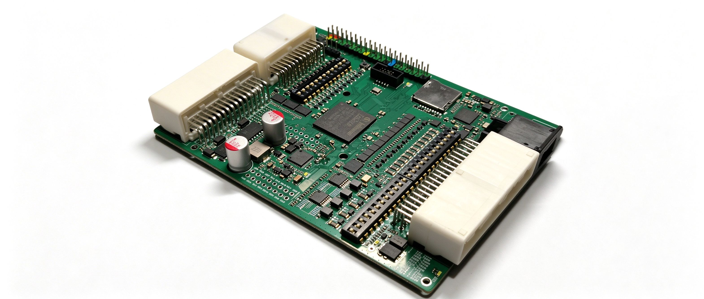

## 目录

- [TC397](#tc397)
  - [板子简介](#板子简介)
  - [Github链接](#github链接)
  - [开发环境](#开发环境)
    - [ADS](#ads)
    - [TASKING/GCC11 命令行](#taskinggcc11-命令行)
    - [Linux GCC13](#linux-gcc13)
  - [外设简介](#外设简介)
    - [40P连接器](#40p连接器)
    - [拨码开关](#拨码开关)
    - [调试口DAP](#调试口dap)
    - [调试串口](#调试串口)
    - [CANFD x12](#canfd-x12)
    - [FlexRay](#flexray)
    - [10BASE-T1S](#10base-t1s)
    - [1000BASE-T1](#1000base-t1)
    - [ADC](#adc)
    - [SD](#sd)
    - [TLF35584](#tlf35584)
  - [自测工程](#自测工程)
  - [结语](#结语)


## 板子简介

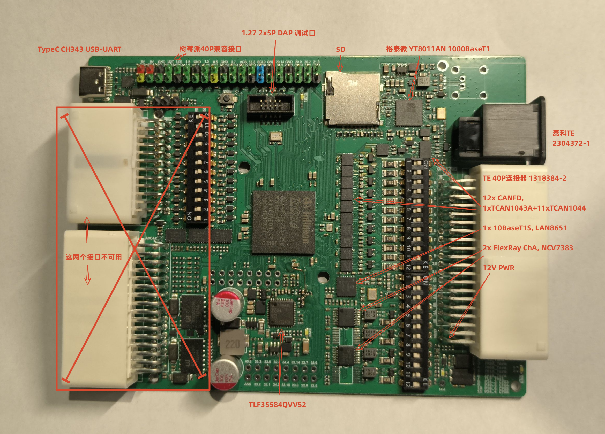

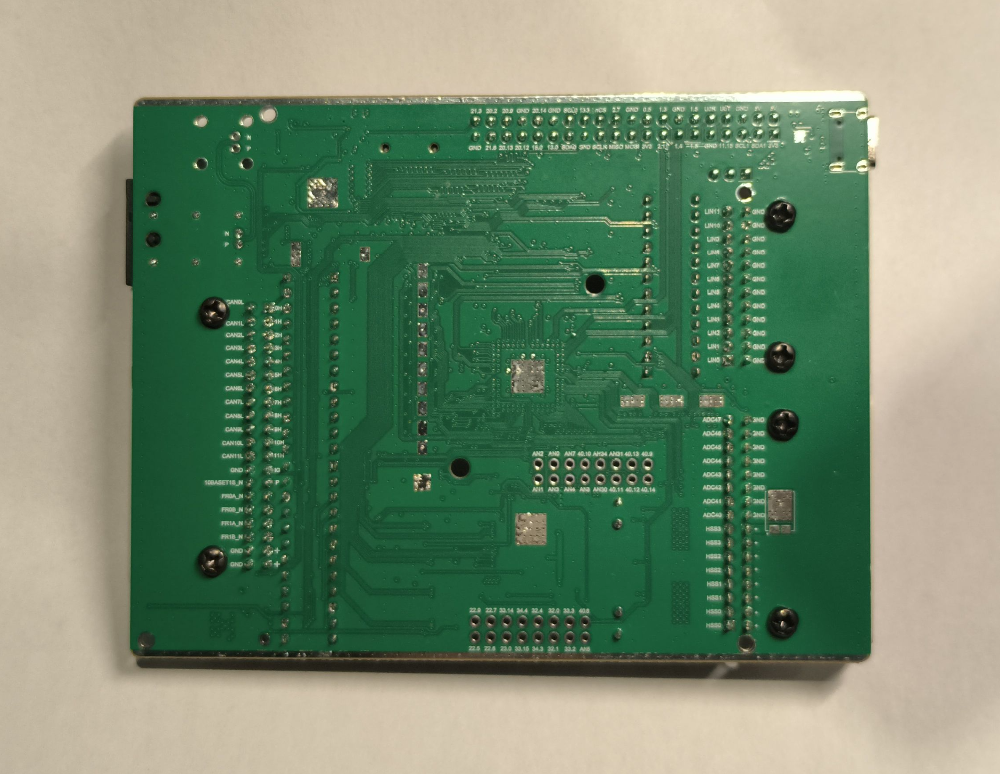

TC397 开发板, 汽车总线评估板: 

- 英飞凌 TC397: SAK-TC397XP-256F300S 或 SAK-TC397XX-256F300
- 裕泰微 YT8011AN, 1000BASE-T1, 因为 NXP TJA112x 没有资料, TI DP83x 又太贵, 国产的成了唯一选择, 用下来其实还不错
- 千兆车载以太网连接器 泰科TE 2304372-1
- 泰科TE 40P连接器 1318384-2:
  - 12xCANFD, 1x TCAN1043A + 11x TCAN1044A, 都能支持到 8Mbits/s
  - 1x 10BASE-T1S, MicroChip LAN8651, SPI-10BASET1S
  - 2x FlexRay(ChA), ONSEMI NCV7383, 因为 TJA108x 价格起飞, 用安森美的平替
  - 12V/24V 电源供电
- TLF35584
- 拨码开关: 设置 CAN 10BASE-T1S FlexRay 终端电阻, TLF35584 Test Mode, TC397 HWCFG 等.
- TF卡座, USB串口CH343, 树莓派兼容40P扩展口
- 1.27 2x5P 调试口(DAP miniWiggler 调试器)
- 四层板单面贴装
- 原理图和测试工程开源在 https://github.com/weifengdq/embedded
- **注意**: 
  - **主图左侧两个接口(32P+24P, LIN 和 高边开关)因设计问题不可用**, 其它功能正常
  - 板上有一根TLF35584 VCI引脚的飞线
  - 通道B的两片FlexRay收发器(NCV7383)未焊接, 如有需要可自行焊接, 板上只焊了2片通道A的

## Github链接

[github.com/weifengdq/embedded](github.com/weifengdq/embedded), 在 tc397 文件夹里, 开放了原理图, 丝印图, step文件, 外设的测试工程:

- tc397_adc
- tc397_can_x12
- tc397_flexray
- tc397_lan8651_t1s
- tc397_lwip_iperf
- tc397_sdmmc
- tc397_tlf35584
- tc397_uart_lettershell
- tc397_selftest, 自测工程, 上面几个外设的集合体, 里面有 lwip 双网卡(1GT1+10T1S) 的适配, 可供参考.
- 其它工程(_0 _lin _hss)不适合本板子, 不用关心.

**板子适配的外壳**: [分体式铝合金壳体带耳113*40*120 本色喷砂阳极氧化 | 嘉立创FA](https://www.jlcfa.com/item/1152581151218.html), step文件搭配接插件模型可以用于自行设计外壳开孔.

板子的购买方式也可在Github链接中找到.

## 开发环境

开发方式任选其一(上面的测试工程并未完全测试到, 如遇问题多用AI解决):

- Windows: 
  - **AURIX Development Studio**, 以下简称ADS
  - **Tricore-GCC11 / TASKING 命令行 + CMake**
- Ubuntu (在 Ubuntu26.04 上验证):
  - Tricore-GCC13 + CMake

### ADS

**ADS** 英飞凌官网下载即可, 本篇用的 1.10.36 版本:

- 导入工程: File -> Import -> General -> Existing Projects into Workspace
- 编译工程: 右键 Set Active Project -> Build Project
- 调试或运行自行搜索网络即可, Eclipse 系的风格类似, 不再赘述.

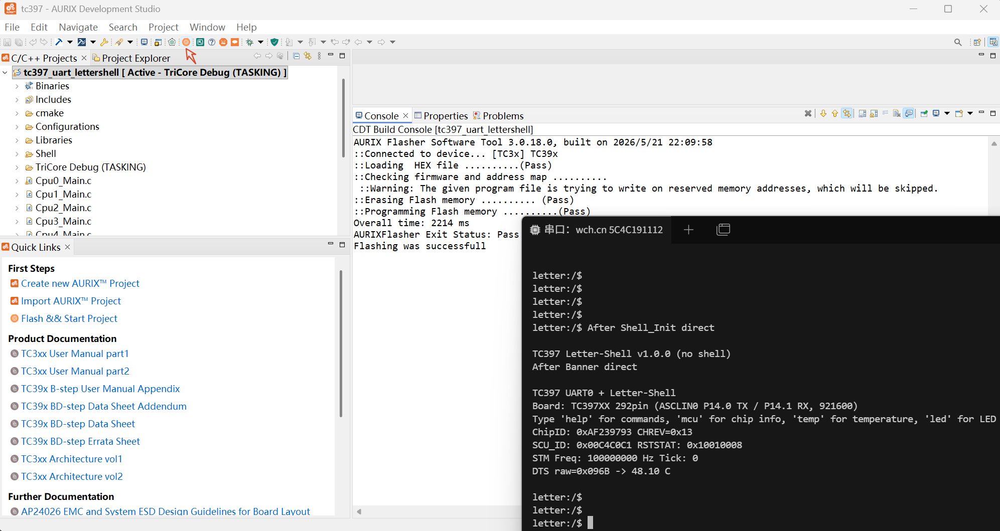

### TASKING/GCC11 命令行

**Tricore-GCC11**, 安装ADS后自带: `AURIX-Studio-1.10.36\tools\Compilers\tricore-gcc11`

**AURIXFlasher**, 命令行下载工具, 安装ADS后自带: `AURIX-Studio-1.10.36\tools\AurixFlasherSoftwareTool_v3.0.18`

**TASKING**, 用的v6.3r1版本, 一般是公司购买或个人申请测试.

环境问题自行用 AI 解决即可.

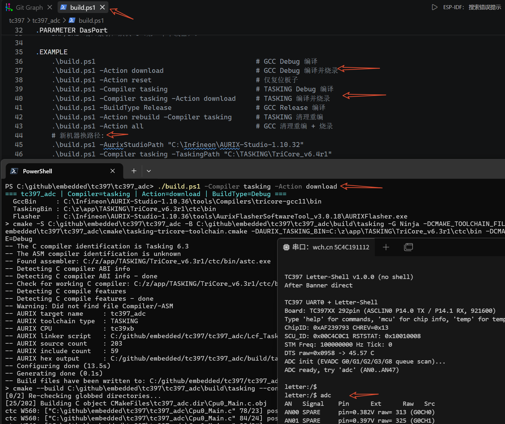

### Linux GCC13

**Ubuntu**, 可以下载下面的然后让AI帮忙配置环境编译工程下载程序, 或者自行README摸索:

- 工具链(tricore-gcc 13.4): [NoMore201/tricore-gcc-toolchain: Fork of EEESlab/tricore-gcc-toolchain-11.3.0 with CI/CD, automated builds/releases and additional tools (QEMU, GDB...)](https://github.com/NoMore201/tricore-gcc-toolchain)
- 调试器DAP MiniWiggler:
  - AURIX Flasher 的 Linux 版本: [volumit/aurix_flasher_linux: TAS Aurix Flasher Linux/Windows](https://github.com/volumit/aurix_flasher_linux)
  - TAS(DAS) 8.0.5 Linux版本: [Infineon tool access socket - TAS - Infineon Developer Center](https://softwaretools.infineon.com/tools/com.ifx.tb.tool.infineontoolaccesssockettas?_gl=1*evu3l3*_gcl_au*MTkzMTcxMTY5MS4xNzg0MjUzNzc1*_ga*MTY5MTc0MTQ1MC4xNzUyNzM2NTMz*_ga_KVD0BL538B*czE3ODgyNTgwOTYkbzEyMyRnMSR0MTc4ODI1ODMyNyRqNTAkbDAkaDk4MDkxNDg0MQ..), **调试器使用需要先启动 tas_server**, 期间如果出现 lsusb 识别不出的情况, 可重新插拔或更换USB口

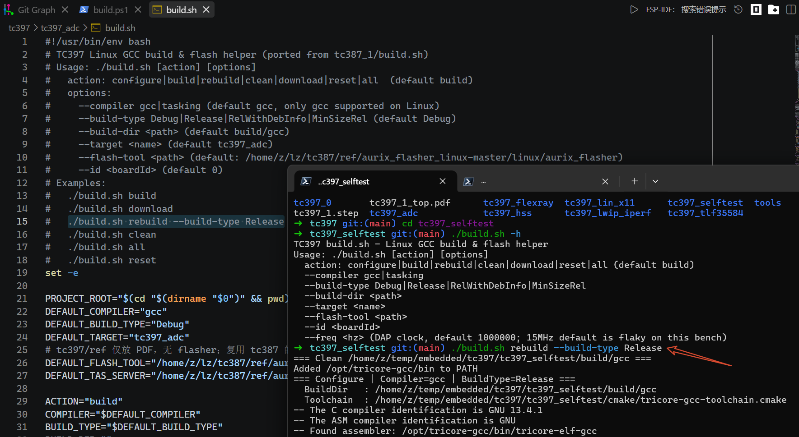

## 外设简介

### 40P连接器

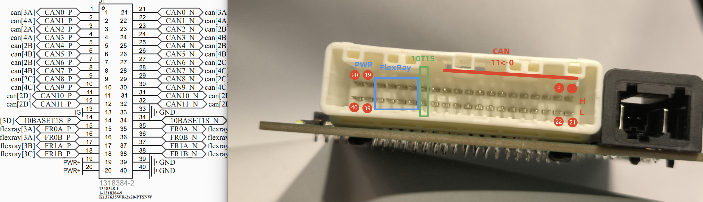

### 拨码开关

右侧上面的12个拨码开关:

| **位号** | **功能**            | **说明**                     | **建议默认** |
| :------- | :------------------ | :--------------------------- | :----------- |
| 上1      | CAN0 120Ω 终端电阻  | ON接入/OFF断开 CAN0 终端电阻 | ON           |
| 上2      | CAN1 120Ω 终端电阻  | 接入/断开 CAN1 终端电阻      | ON           |
| 上3      | CAN2 120Ω 终端电阻  | 接入/断开 CAN2 终端电阻      | ON           |
| 上4      | CAN3 120Ω 终端电阻  | 接入/断开 CAN3 终端电阻      | ON           |
| 上5      | CAN4 120Ω 终端电阻  | 接入/断开 CAN4 终端电阻      | ON           |
| 上6      | CAN5 120Ω 终端电阻  | 接入/断开 CAN5 终端电阻      | ON           |
| 上7      | CAN6 120Ω 终端电阻  | 接入/断开 CAN6 终端电阻      | ON           |
| 上8      | CAN7 120Ω 终端电阻  | 接入/断开 CAN7 终端电阻      | ON           |
| 上9      | CAN8 120Ω 终端电阻  | 接入/断开 CAN8 终端电阻      | ON           |
| 上10     | CAN9 120Ω 终端电阻  | 接入/断开 CAN9 终端电阻      | ON           |
| 上11     | CAN10 120Ω 终端电阻 | 接入/断开 CAN10 终端电阻     | ON           |
| 上12     | CAN11 120Ω 终端电阻 | 接入/断开 CAN11 终端电阻     | ON           |

右侧下面的12个拨码开关:

| **位号** | **功能**                     | **说明**                                                   | **建议默认**                  |
| :------- | :--------------------------- | :--------------------------------------------------------- | :---------------------------- |
| 下1      | 10BASET1S 终端电阻 1         | 与下2 必须同时 ON 或同时 OFF                               | ON                            |
| 下2      | 10BASET1S 终端电阻 2         | 与下1 联动，不可单独拨动                                   | ON                            |
| 下3      | FlexRay 0 Channel A 终端电阻 | FR0 A 通道终端电阻                                         | ON                            |
| 下4      | FlexRay 0 Channel B 终端电阻 | 0B 收发器未贴片                                            | ON                            |
| 下5      | FlexRay 1 Channel A 终端电阻 | FR1 A 通道终端电阻                                         | ON                            |
| 下6      | FlexRay 1 Channel B 终端电阻 | 1B 收发器未贴片                                            | ON                            |
| 下7      | TLF35584 MPS                 | ON = 调试模式；OFF = 正常模式（需喂狗）                    | ON（TLF35584 调通后再拨 OFF） |
| 下8      | TC397 HWCFG[3]               | ON = Boot with [4:5]；OFF = Flash BMI                      | ON                            |
| 下9      | TC397 HWCFG[4]               | 与下10 组成 [4:5] 启动模式选择                             | OFF                           |
| 下10     | TC397 HWCFG[5]               | [4:5] = ON/ON → Bootstrap P14.0/1；OFF/OFF → 从 Flash 启动 | OFF（需串口 Boot 时改 ON/ON） |
| 下11     | TC397 HWCFG[6]               | ON = 引脚三态；OFF = 引脚上拉                              | ON                            |
| 下12     | 保留                         | 未使用                                                     | OFF                           |

### 调试口DAP

1.27-2x5 间距引出:

- 1, 3V3
- 3,5, GND
- 7 9 引脚悬空
- 2, DAP1 (TC397 K16 TMS/DAP1)
- 4, DAP0 (TC397 J16 TCK/DAP0)
- 6, DAP2 (TC397 H16 P21.7/TDO)
- 8, NTRST (TC397 L19 NTRST)
- 10, NPORST (TC397 G17 NPORST)

用英飞凌官方的 DAP miniWiggler 或者 逐飞 其它第三方的都可以, 注意是 1.27mm-2x5 接口.

### 调试串口

**tc397_uart_lettershell** 相关引脚:

- P14.0, UART0_TX
- P14.1, UART0_RX
- P13.0, LED

注意 USB转串口 CH343 这个调试串口和树莓派40P里面的引脚是一样的.

默认波特率 921600bps

```bash
$ ./build.sh download
$ sudo minicom -b 921600 -D /dev/ttyACM0

After Shell_Init direct
After Banner direct

TC397 UART0 + Letter-Shell
Board: TC397XX 292pin (ASCLIN0 P14.0 TX / P14.1 RX, 921600)
Type 'help' for commands, 'mcu' for chip info, 'temp' for temperature, 'led' for LED
ChipID: 0xAF239793 CHREV=0x13
SCU_ID: 0x00C4C0C1 RSTSTAT: 0x10010008
STM Freq: 100000000 Hz Tick: 0
DTS raw=0x099F -> 55.03 C

letter:/$ help
Command List:
clear                 CMD   clear console
keys                  CMD   list all key
vars                  CMD   list all var
cmds                  CMD   list all cmd
users                 CMD   list all user
help                  CMD   show command info
setVar                CMD   set var
led                   CMD   P13.0 LED control
mem                   CMD   memory info
sysinfo               CMD   system info
temp                  CMD   die temperature
reboot                CMD   reboot alias
reset                 CMD   software reset
uptime                CMD   uptime
uid                   CMD   chip UID
mcu                   CMD   MCU info
ver                   CMD   version alias
version               CMD   version info

letter:/$ sysinfo
=== MCU Info ===
ChipID  : 0xAF239793 (CHREV=0x13)
SCU_ID  : 0x00C4C0C1
RSTSTAT : 0x10010008 RSTCON: 0x00000282
STM Freq: 100000000 Hz
CCUCON0 : 0x17230113 CCUCON1: 0x21110212
Build   : Sep 22 2026 18:03:03
================
DTS raw=0x09AF (2479) -> 57.16 C
Limits: LOW=-40 C HIGH=170 C
PMS DTSSTAT RESULT field = 2479
Uptime: 28347 ms (0 days 00:00:28.347)
sysinfo done
Return: 0, 0x00000000

letter:/$ led
Usage: led <on|off|toggle|blink|hb> [args]
  led on            - LED on (P13.0 low), heartbeat off
  led off           - LED off (P13.0 high), heartbeat off
  led toggle        - toggle once, heartbeat off
  led blink <n> [ms]- blink n times (default 5 x 200ms), heartbeat off
  led hb <on|off>   - heartbeat 1Hz toggle on/off (default on)
LED P13.0 low=on. heartbeat=on
Return: 0, 0x00000000

letter:/$ led on
LED on (P13.0 low)
Return: 0, 0x00000000

letter:/$ led hb on
LED heartbeat on (1Hz)
Return: 0, 0x00000000
```

### CANFD x12

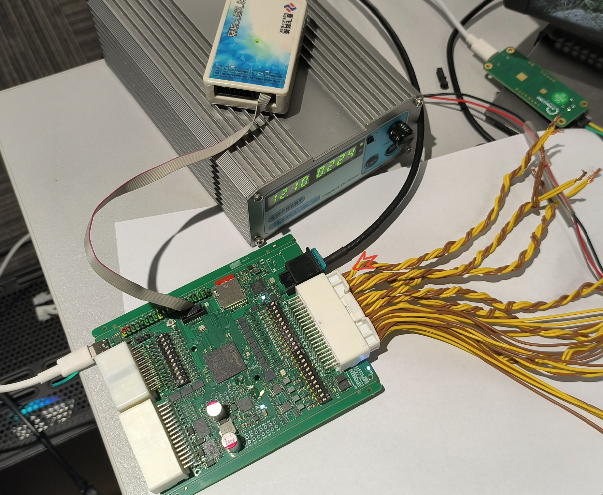

引脚:

| 逻辑  | TX     | RX     | MCMCAN     | 收发器       | 使能脚                                       |
| ----- | ------ | ------ | ---------- | ------------ | -------------------------------------------- |
| CAN0  | P34.1  | P33.12 | CAN0 node0 | TCAN1043A-Q1 | EN P33.1=H, nSTB P33.0=H, nFAULT P10.3(输入) |
| CAN1  | P15.2  | P33.10 | CAN0 node1 | TCAN1044A-Q1 | STB P21.5=L（与 CAN2/3 共用）                |
| CAN2  | P32.5  | P32.6  | CAN0 node2 | TCAN1044A-Q1 | STB P21.5=L                                  |
| CAN3  | P32.3  | P32.2  | CAN0 node3 | TCAN1044A-Q1 | STB P21.5=L                                  |
| CAN4  | P00.0  | P00.1  | CAN1 node0 | TCAN1044A-Q1 | STB P21.2=L（与 CAN5/6/7 共用）              |
| CAN5  | P23.6  | P23.7  | CAN1 node1 | TCAN1044A-Q1 | STB P21.2=L                                  |
| CAN6  | P23.2  | P23.3  | CAN1 node2 | TCAN1044A-Q1 | STB P21.2=L                                  |
| CAN7  | P33.4  | P33.5  | CAN1 node3 | TCAN1044A-Q1 | STB P21.2=L                                  |
| CAN8  | P10.6  | P34.2  | CAN2 node0 | TCAN1044A-Q1 | STB P21.4=L（与 CAN9/10/11 共用）            |
| CAN9  | P00.2  | P00.3  | CAN2 node1 | TCAN1044A-Q1 | STB P21.4=L                                  |
| CAN10 | P22.8  | P32.7  | CAN2 node2 | TCAN1044A-Q1 | STB P21.4=L                                  |
| CAN11 | P22.10 | P22.11 | CAN2 node3 | TCAN1044A-Q1 | STB P21.4=L                                  |

线束：CAN0-CAN1、CAN2-CAN3、CAN4-CAN5、CAN6-CAN7、CAN8-CAN9、CAN10-CAN11 **两两互联**用于测试, 终端电阻都ON.

**tc397_can_x12** 工程:

```bash
$ ./build.sh download
$ sudo minicom -b 921600 -D /dev/ttyACM0

After Shell_Init direct
After Banner direct

TC397 CAN x12 + Letter-Shell
Board: TC397XX 292pin (ASCLIN0 P14.0 TX / P14.1 RX, 921600)
Type 'help' for commands, 'canstat' for CAN, 'canpair' for pair test
ChipID: 0xAF239793 CHREV=0x13
SCU_ID: 0x00C4C0C1 RSTSTAT: 0x10010008
STM Freq: 100000000 Hz Tick: 0
DTS raw=0x098B -> 52.37 C
CAN 12ch init done: 1M/5M 80% (pairs 0-1..10-11), nFAULT=0

# 命令仅供参考, 并未全测
letter:/$ help
Command List:
...
xcvr                  CMD   transceiver state
canrst                CMD   restart node
canflood              CMD   burst TX test
canpair               CMD   pair loopback test
canstat               CMD   CAN status
canlive               CMD   live RX print
candump               CMD   candump [ch] [n]
cansend               CMD   cansend ch frame
...

letter:/$ xcvr
CAN0 TCAN1043: EN P33.1=1 nSTB P33.0=1 nFAULT P10.3=1 (ok)
TCAN1044 STB: P21.5(CAN1-3)=0 P21.2(CAN4-7)=0 P21.4(CAN8-11)=0 (0=normal)
Return: 0, 0x00000000

letter:/$ canpair
canpair: 1 round(s), len=8 FD+BRS, pairs 0-1..10-11
round 1:
  can0->can1: PASS (id=100 len=8 FD+BRS)
  can1->can0: PASS (id=140 len=8 FD+BRS)
  can2->can3: PASS (id=102 len=8 FD+BRS)
  can3->can2: PASS (id=142 len=8 FD+BRS)
  can4->can5: PASS (id=104 len=8 FD+BRS)
  can5->can4: PASS (id=144 len=8 FD+BRS)
  can6->can7: PASS (id=106 len=8 FD+BRS)
  can7->can6: PASS (id=146 len=8 FD+BRS)
  can8->can9: PASS (id=108 len=8 FD+BRS)
  can9->can8: PASS (id=148 len=8 FD+BRS)
  can10->can11: PASS (id=10A len=8 FD+BRS)
  can11->can10: PASS (id=14A len=8 FD+BRS)
canpair done: ALL PASS (0 fail(s))
Return: 0, 0x00000000

letter:/$ cansend
Usage: cansend <ch 0..11> <frame>
  classic : 123#DEADBEEF / 12345678#1122 (ext) / 123#R[Rlen]
  FD      : 123##<flags><data>  flags bit0=BRS, e.g. 123##1DEADBEEF
Wired pairs: 0-1 2-3 4-5 6-7 8-9 10-11
Return: -1, 0xffffffff

letter:/$ cansend 0 123##1.DEADBEEF
can0 sent: 123##1DEADBEEF
Return: 0, 0x00000000

letter:/$ candump
[393175] can1 123##1DEADBEEF (FD+BRS len=4 dlc=4)
candump: 1 frame(s)
Return: 0, 0x00000000

letter:/$ canstat
fMCAN=80.00 MHz nFAULT=0 live=off
ch | rx/tx/ovf/bo/rst | pend/drop | TEC REC BO | NBTP DBTP
 0 | 1/2/0/0/0 | 0/0 | 0 0 0 | 0x06030E03 0x00800B22
 1 | 2/1/0/0/0 | 0/0 | 0 0 0 | 0x06030E03 0x00800B22
 2 | 1/1/0/0/0 | 0/0 | 0 0 0 | 0x06030E03 0x00800B22
 3 | 1/1/0/0/0 | 0/0 | 0 0 0 | 0x06030E03 0x00800B22
 4 | 1/1/0/0/0 | 0/0 | 0 0 0 | 0x06030E03 0x00800B22
 5 | 1/1/0/0/0 | 0/0 | 0 0 0 | 0x06030E03 0x00800B22
 6 | 1/1/0/0/0 | 0/0 | 0 0 0 | 0x06030E03 0x00800B22
 7 | 1/1/0/0/0 | 0/0 | 0 0 0 | 0x06030E03 0x00800B22
 8 | 1/1/0/0/0 | 0/0 | 0 0 0 | 0x06030E03 0x00800B22
 9 | 1/1/0/0/0 | 0/0 | 0 0 0 | 0x06030E03 0x00800B22
10 | 1/1/0/0/0 | 0/0 | 0 0 0 | 0x06030E03 0x00800B22
11 | 1/1/0/0/0 | 0/0 | 0 0 0 | 0x06030E03 0x00800B22
Return: 0, 0x00000000
```

### FlexRay

引脚:

| 信号      | TC397 引脚 | ERAY 符号                            | 说明                |
| --------- | ---------- | ------------------------------------ | ------------------- |
| FR0A_TXD  | P02.0      | `IfxEray0_TXDA_P02_0_OUT`（alt6）    | ERAY0 A 通道发送    |
| FR0A_TXEN | P02.4      | `IfxEray0_TXENA_P02_4_OUT`（alt6）   | 发送使能（低=使能） |
| FR0A_RXD  | P02.1      | `IfxEray0_RXDA2_P02_1_IN`（RxSel_c） | ERAY0 A 通道接收    |
| FR1A_TXD  | P14.10     | `IfxEray1_TXDA_P14_10_OUT`（alt7）   | ERAY1 A 通道发送    |
| FR1A_TXEN | P14.9      | `IfxEray1_TXENA_P14_9_OUT`（alt7）   | 发送使能（低=使能） |
| FR1A_RXD  | P14.8      | `IfxEray1_RXDA0_P14_8_IN`（RxSel_a） | ERAY1 A 通道接收    |

收发器用的 ONSEMI 的 NCV7383, 没有用 SPI, 用的 Track Mode

* 两路 A 通道（FR0A/FR1A）在板上连在一起自收发；B 通道未贴片，软件只配 A
  （`SUCC1.CCHA=1/CCHB=0`，RX header 只有 `channelAFiltered`）。
* 收发器 strapping（免 SPI）：`BGE/STBN/SCK`=3.3 V（Normal + 发送使能），
  `CSN`=GND（TrackMode），`SDO/ERRN` 悬空。
* 拨码开关终端电阻开启

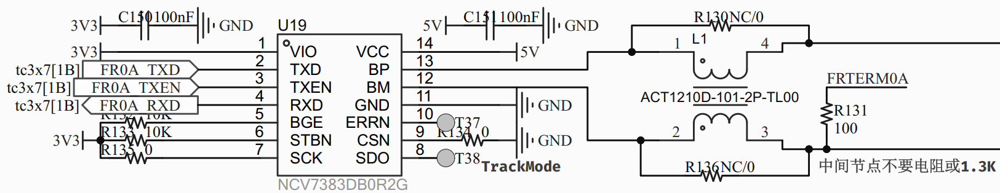

**tc397_flexray** 工程(仅供参考):

- 10 Mbit/s，静态段 **91 slot × 24 MT**，静态 payload **8 word = 16 B**，动态段 289 × 5 MT，周期 3636 MT（约 5 ms），cycle filter = 1（奇周期）。
- FR0（ERAY0）key slot **11**，FR1（ERAY1）key slot **12**（各 static TX buf0，continuous，startup+sync 帧，错开 slot 防碰撞；两节点都 coldstart+sync，谁先 wakeup 谁先 cold-start，另一方 integrate，约 2–4 s 进双 NORMAL_ACTIVE）。
- Message RAM（每节点 3 buffer，无 FIFO）：buf0=TX key slot，buf1/buf2=RX slot 11/12（channel A，cycle 1）。

```bash
TC397 UART0 + Letter-Shell
Board: TC397XX 292pin (ASCLIN0 P14.0 TX / P14.1 RX, 921600)
Type 'help' for commands, 'mcu' for chip info, 'temp' for temperature, 'led' for LED
FlexRay: FR0A(ERAY0 P02.0/02.4/02.1,slot11) FR1A(ERAY1 P14.10/14.9/14.8,slot12), try 'fr test'
ChipID: 0xAF239793 CHREV=0x13
SCU_ID: 0x00C4C0C1 RSTSTAT: 0x10010008
STM Freq: 100000000 Hz Tick: 0
DTS raw=0x098E -> 52.77 C

letter:/$ help
Command List:
...
eray                  CMD   eray alias
fr                    CMD   fr alias
flexray               CMD   FlexRay dual-ERAY selftest
...

# 命令仅供参考, 部分未测到
letter:/$ fr
Usage: flexray <init|status|send|recv|test|regs>
  fr init            - bring up FR0A+FR1A (blocking, verbose)
  fr status          - POC/regs + counters of both nodes
  fr send <0|1> [hex]- TX one frame (default seq pattern)
  fr recv <0|1>      - show last RX frame of node
  fr test [n]        - auto loopback both directions (def 5)
  fr regs            - raw register dump
Nodes: 0=FR0A(ERAY0 P02.0/02.4/02.1 slot11), 1=FR1A(ERAY1 P14.10/14.9/14.8 slot12)
Return: 0, 0x00000000

letter:/$ fr init
FR bring-up start ...
FR bring-up OK (rc=0)
FR0A(ERAY0) boot: rc=0@OK poc=2(NORMAL_ACTIVE) SUCC1=0x04004304 CCSV=0x00360302 EIR=0x00000016
FR1A(ERAY1) boot: rc=0@OK poc=2(NORMAL_ACTIVE) SUCC1=0x04004304 CCSV=0x00410302 EIR=0x00000016
FR0A(ERAY0): POC=2(NORMAL_ACTIVE) CCSV=0x00360302 SUCC1=0x04004305 EIR=0x00000016 SIR=0x0000E00D
  txOk=0 txBusy=0 rxOk=0 rxErr=0 rxNull=0 eirSeen=0 lastEir=0x00000000
  lastMbs=0x00000000 rejMbs=0x00000000 rejSlot=0 rejPlw=0 rejD0=0x00000000
FR1A(ERAY1): POC=2(NORMAL_ACTIVE) CCSV=0x00410302 SUCC1=0x04004305 EIR=0x00000016 SIR=0x0000A00D
  txOk=0 txBusy=0 rxOk=0 rxErr=0 rxNull=0 eirSeen=0 lastEir=0x00000000
  lastMbs=0x00000000 rejMbs=0x00000000 rejSlot=0 rejPlw=0 rejD0=0x00000000
Return: 0, 0x00000000

letter:/$ fr send
Usage: fr send <0|1> [hex16bytes]
Return: -1, 0xffffffff

letter:/$ fr send 0 1234567890ABCDEF
FR send node 0, 8 bytes (padded with 00)
Return: 0, 0x00000000

letter:/$ fr recv 1
FR1A(ERAY1) last RX: slot=11 cycle=41 len=16 MBS=0x0F290001 data=1234567890ABCDEF0000000000000000
Return: 0, 0x00000000

letter:/$ fr send 0 1234567890ABCDEF1234567890ABCDEF
FR send node 0, 16 bytes
Return: 0, 0x00000000

letter:/$ fr recv 1
FR1A(ERAY1) last RX: slot=11 cycle=42 len=16 MBS=0x0F2A0001 data=1234567890ABCDEF1234567890ABCDEF
Return: 0, 0x00000000

letter:/$ fr status
FR0A(ERAY0): POC=2(NORMAL_ACTIVE) CCSV=0x00360302 SUCC1=0x04004305 EIR=0x00000000 SIR=0x0000CC0C
  txOk=2 txBusy=0 rxOk=0 rxErr=0 rxNull=10589 eirSeen=1 lastEir=0x00000016
  lastMbs=0x07280001 rejMbs=0x00000000 rejSlot=0 rejPlw=0 rejD0=0x00000000
FR1A(ERAY1): POC=2(NORMAL_ACTIVE) CCSV=0x00410302 SUCC1=0x04004305 EIR=0x00000000 SIR=0x0000C81C
  txOk=0 txBusy=0 rxOk=7940 rxErr=0 rxNull=2648 eirSeen=1 lastEir=0x00000016
  lastMbs=0x00000000 rejMbs=0x00000000 rejSlot=0 rejPlw=0 rejD0=0x00000000
Return: 0, 0x00000000

letter:/$ fr test
FR selftest: bring-up ...
FR0A(ERAY0) boot: rc=0@OK poc=2(NORMAL_ACTIVE) SUCC1=0x04004304 CCSV=0x00310302 EIR=0x00000016
FR1A(ERAY1) boot: rc=0@OK poc=2(NORMAL_ACTIVE) SUCC1=0x04004304 CCSV=0x00410302 EIR=0x00000016
FR selftest: both nodes NORMAL, 5 rounds each direction
[0] FR0->FR1 slot11 OK
[0] FR1->FR0 slot12 OK
[1] FR0->FR1 slot11 OK
[1] FR1->FR0 slot12 OK
[2] FR0->FR1 slot11 OK
[2] FR1->FR0 slot12 OK
[3] FR0->FR1 slot11 OK
[3] FR1->FR0 slot12 OK
[4] FR0->FR1 slot11 OK
[4] FR1->FR0 slot12 OK
FR selftest: PASS (5 rounds, 0 fails)
FR0A(ERAY0): POC=2(NORMAL_ACTIVE) CCSV=0x00310302 SUCC1=0x04004305 EIR=0x00000000 SIR=0x0000CC1C
  txOk=7 txBusy=0 rxOk=9 rxErr=0 rxNull=11362 eirSeen=2 lastEir=0x00000016
  lastMbs=0x0F341001 rejMbs=0x0F341001 rejSlot=12 rejPlw=8 rejD0=0xBCBDBEBF
FR1A(ERAY1): POC=2(NORMAL_ACTIVE) CCSV=0x00410302 SUCC1=0x04004305 EIR=0x00000000 SIR=0x0000CC1C
  txOk=5 txBusy=0 rxOk=8722 rxErr=0 rxNull=2648 eirSeen=2 lastEir=0x00000016
  lastMbs=0x00000000 rejMbs=0x0F341001 rejSlot=11 rejPlw=8 rejD0=0x43424140
Return: 0, 0x00000000
```

### 10BASE-T1S

板载微芯的 LAN8651 芯片, 是 SPI 转 10BASE-T1S:

| 信号       | TC397 Pin         | 说明                                     |
| ---------- | ----------------- | ---------------------------------------- |
| nRST       | P23.4             | GPIO 输出，复位低 10ms → 高 50ms         |
| nINT       | P33.7             | GPIO 输入上拉，`irq=idle` 常态           |
| MISO       | P33.13            | `IfxQspi4_MRSTA_P33_13_IN`（RxSel_a）    |
| MOSI       | P22.0             | `IfxQspi4_MTSR_P22_0_OUT`（alt3）        |
| SCLK       | P22.3             | `IfxQspi4_SCLK_P22_3_OUT`（alt3）        |
| nCS        | P22.2             | `IfxQspi4_SLSO3_P22_2_OUT`（`autoCS=0`） |
| UART TX/RX | P14.0/P14.1       | ASCLIN0，921600                          |
| LED        | P13.0             | 低=亮，1Hz 心跳                          |
| LAN8651    | B1-E/LMX 板       | 25MHz 晶振，3V3；T1S 双绞线接 USB 适配器 |
| PC         | `enx001ec0d1c337` | `00:1e:c0:d1:c3:37`，配 `192.168.1.1/24` |

**tc397_lan8651_t1s** 工程 mcu 是 192.168.1.100, 经USB转10BASE-T1S连到电脑, 电脑端 ip 192.168.1.1, 图中10T1S PN 还接反了, 不过可以正常用(单节点无PoDL 供电是可以随便接的, 有多结点或供电不行):

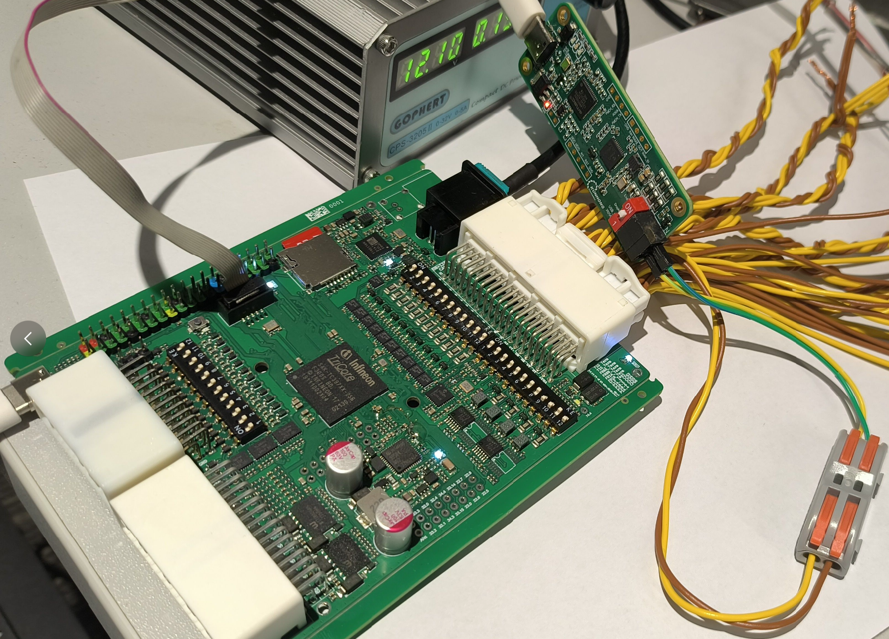

```bash
$ sudo ethtool --set-plca-cfg enx001ec0d1c337 enable on node-id 0 node-cnt 8 to-tmr 0x20 burst-cnt 0x0 burst-tmr 0x80
# 下面两个命令有可能会掉, ping不通时多敲几次, 或AI询问固定一下
$ sudo ip addr add 192.168.1.1/24 dev enx001ec0d1c337
$ sudo ip link set enx001ec0d1c337 up
$ ping -c 3 192.168.1.100


$ lsmod | grep microchip_t1s
microchip_t1s          16384  1
$ ethtool enx001ec0d1c337                                        
Settings for enx001ec0d1c337:
        Supported ports: [ TP ]
        Supported link modes:   10baseT1S_P2MP/Half
        Supported pause frame use: Symmetric Receive-only
        Supports auto-negotiation: No
        Supported FEC modes: Not reported
        Advertised link modes:  10baseT1S_P2MP/Half
        Advertised pause frame use: Symmetric Receive-only
        Advertised auto-negotiation: No
        Advertised FEC modes: Not reported
        Speed: 10Mb/s
        Duplex: Half
        Auto-negotiation: off
        Port: Twisted Pair
        PHYAD: 0
        Transceiver: external
        MDI-X: Unknown
netlink error: Operation not permitted
        PLCA support: OPEN Alliance v1.0
        Current message level: 0x00000007 (7)
                               drv probe link
        Link detected: yes
PLCA status: up
$ iperf -c 192.168.1.100 -t 10 -i 1
------------------------------------------------------------
Client connecting to 192.168.1.100, TCP port 5001
TCP window size: 16.0 KByte (default)
------------------------------------------------------------
[  1] local 192.168.1.1 port 57032 connected with 192.168.1.100 port 5001
[ ID] Interval       Transfer     Bandwidth
[  1] 0.0000-1.0000 sec  1.00 MBytes  8.39 Mbits/sec
[  1] 1.0000-2.0000 sec  1.12 MBytes  9.44 Mbits/sec
[  1] 2.0000-3.0000 sec  1.00 MBytes  8.39 Mbits/sec
[  1] 3.0000-4.0000 sec  1.00 MBytes  8.39 Mbits/sec
[  1] 4.0000-5.0000 sec  1.00 MBytes  8.39 Mbits/sec
[  1] 5.0000-6.0000 sec  1.12 MBytes  9.44 Mbits/sec
[  1] 6.0000-7.0000 sec  1.00 MBytes  8.39 Mbits/sec
[  1] 7.0000-8.0000 sec  1.00 MBytes  8.39 Mbits/sec
[  1] 8.0000-9.0000 sec  1.12 MBytes  9.44 Mbits/sec
[  1] 9.0000-10.0000 sec  1.00 MBytes  8.39 Mbits/sec
[  1] 0.0000-10.1250 sec  10.5 MBytes  8.70 Mbits/sec
```

mcu 调试串口

```bash
TC397 QSPI4 + LAN8651 10BASE-T1S + LwIP + Letter-Shell
Board: TC397XX 292pin (ASCLIN0 P14.0 TX / P14.1 RX, 921600; QSPI4 P22.0/22.2/22.3+P33.13, nRST)
ChipID: 0xAF239793 CHREV=0x13
DTS raw=0x0992 -> 53.30 C
Booting TC397 LAN8651 firmware (QSPI4 20MHz, PLCA ID=1 CNT=8)
LAN8651 DEVID=0x00086512 model=0x8651 rev=2
cfg readback ok (see t1stat)
LAN8651 started, MAC=02:00:00:10:BA:5E
Static IP=192.168.1.100 MASK=255.255.255.0 GW=192.168.1.1
UDP echo listening on port 9
lwIP iperf server ready (TCP 5001)
LAN8651 link up
gratuitous_arp=sent

# 有些命令只是占位, 并未调通或实现
letter:/$ help
cable                 CMD   cable health via SQI+errors
evcnt                 CMD   TO/BEACON cumulative counters
pcsdiag               CMD   PCS/MAC error sticky bits
plcadiag              CMD   PLCA diag + beacon rate
sqi                   CMD   SQI signal quality 0-7
link                  CMD   T1S link status
plca                  CMD   show or set PLCA id/count
t1w                   CMD   LAN8651 reg write
t1r                   CMD   LAN8651 reg read
t1stat                CMD   LAN8651 status dump
ping                  CMD   ping <ip> [count] [size]
ifconfig              CMD   netif info

letter:/$ ifconfig
netif 0: t10 IP 192.168.1.100 NM 255.255.255.0 GW 192.168.1.1
  HWaddr 02:00:00:10:BA:5E MTU 1500 flags 0x1F
  link UP
Return: 0, 0x00000000

letter:/$ ping 192.168.1.1
PING 192.168.1.1 : 32 bytes count 4
Reply from 192.168.1.1: bytes=32 seq=0 time=1 ms
Reply from 192.168.1.1: bytes=32 seq=1 time=0 ms
Reply from 192.168.1.1: bytes=32 seq=2 time=0 ms
Reply from 192.168.1.1: bytes=32 seq=3 time=0 ms
PING statistics: 4 sent, 4 received, 0% loss
Return: 0, 0x00000000

letter:/$ link
link: UP (sync=0 pst=0 phy_link=1 irq=idle)
Return: 0, 0x00000000

letter:/$ plca
PLCA en=1 id=1 ncnt=8 pst=0 tot=0x0020 burst=0x0080
usage: plca <node_id 0..255> [node_count]  (0=coordinator/master)
Return: 0, 0x00000000

letter:/$ t1stat
DEVID=0x00086512 SYNC=0 RESETC=0 oa_cfg=0x9006
PLCA en=1 id=1 ncnt=8 pst=0 tot=0x0020 burst=0x0080
PHY bmcr=0x0000 bmsr=0x0805(link=1) id=0x0007/0xC1B3
MAC ncr=0x0C(TXEN=1 RXEN=1) ncfgr=0x02020040 nsr=0x04
BUF rba=0 txc=48 irq=idle(1)
SPI timeouts=2 busy=0 recovered=2 | TX hdrb=0 fail=0
Return: 0, 0x00000000

IPERF report: type=0, remote: 192.168.1.1:57032, total bytes: 11010072, duration in ms: 10124, kbits/s: 8696
```

### 1000BASE-T1

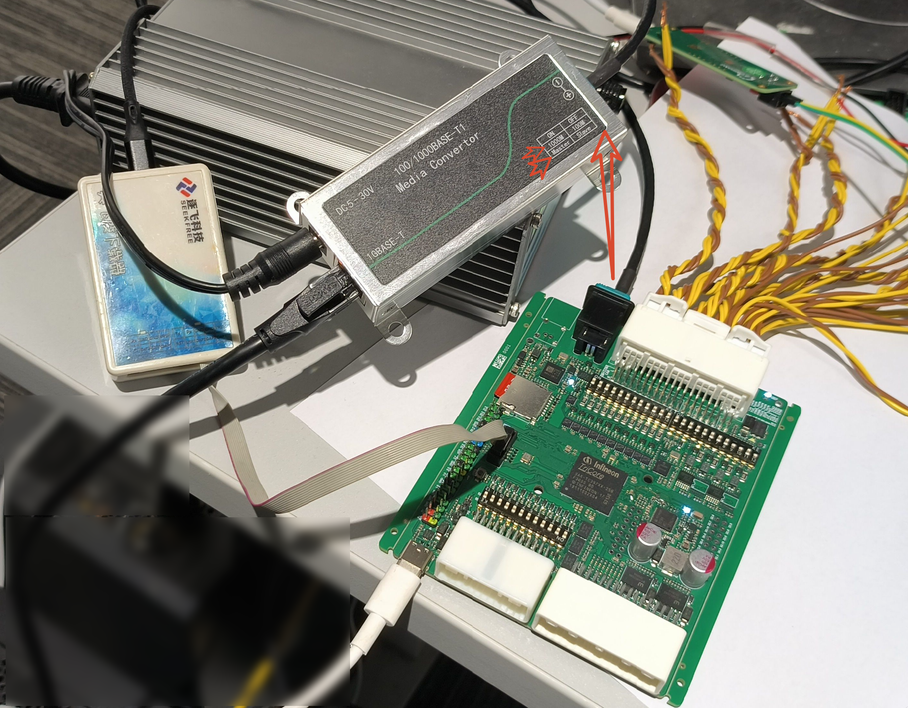

收发器是裕泰微的 YT8011AN,  [下载中心-裕太微电子股份有限公司](https://www.motor-comm.com/download) 填写资料即可下载数据手册和参考电路.

RGMII 相关引脚:

| 信号                | TC397 Pin                | 说明                                              |
| ------------------- | ------------------------ | ------------------------------------------------- |
| TXD3/TXD2/TXD1/TXD0 | P11.0/P11.1/P11.2/P11.3  | RGMII TX（ALT6）                                  |
| TXCLK               | P11.4                    | MAC→PHY 125MHz（RGMII 输出，由 GREFCLK 分频产生） |
| GREFCLK             | P11.5                    | **外部 125MHz 有源晶振输入**（RGMII 必需）        |
| TCTL                | P11.6                    | TXCTL                                             |
| RXD3/RXD2/RXD1/RXD0 | P11.7/P11.8/P11.9/P11.10 | RGMII RX                                          |
| RCTL                | P11.11                   | RXCTL                                             |
| RXCLK               | P11.12                   | PHY→MAC 125MHz                                    |
| MDC/MDIO            | P12.0/P12.1              | Clause-22 管理口，PHYAD=1                         |
| nINT                | P10.8                    | 未用（预留）                                      |
| nRST                | P20.1                    | 软件复位（低 50ms → 高，延时 50ms）               |

再次注意: **MCU 的 D8 P11.5 引脚接了 125MHz 有源晶振**.

YT8011AN 的 Strapping 引脚(本工程可忽略，纯寄存器配置):

| 引脚                  | 上下拉    | 含义                                      |
| --------------------- | --------- | ----------------------------------------- |
| RCTL                  | 上拉 4.7K | AutoMode（自协商使能）                    |
| RXD3                  | 下拉 4.7K | Slave（T1 主从，本端 Slave，对端 Master） |
| RXD2                  | 下拉 4.7K | RGMII 模式                                |
| RXD1 下拉 / RXD0 上拉 | —         | PHYAD = 1（MDIO 地址）                    |
| RXCLK                 | 上拉 4.7K | RXC delay enable（RGMII RX 2ns 延迟）     |

网络拓扑：`TC397—(RGMII)—YT8011AN—(1000BASE-T1)—转换盒(Master)—(1000BASE-T)—PC enp6s0`。

```bash
$ sudo ip addr add 192.168.0.1/24 dev enp6s0   # MCU 的 GW 指向它

$ ping -c3 192.168.0.100
PING 192.168.0.100 (192.168.0.100) 56(84) bytes of data.
64 bytes from 192.168.0.100: icmp_seq=1 ttl=255 time=0.132 ms
64 bytes from 192.168.0.100: icmp_seq=2 ttl=255 time=0.209 ms
64 bytes from 192.168.0.100: icmp_seq=3 ttl=255 time=0.183 ms

# windows 上可能默认300多M,都是正常的, 可以尝试关闭 中断裁决
$ iperf -c 192.168.0.100 -p 5001 -t 10 -i 1
------------------------------------------------------------
Client connecting to 192.168.0.100, TCP port 5001
TCP window size: 85.0 KByte (default)
------------------------------------------------------------
[  1] local 192.168.0.1 port 40840 connected with 192.168.0.100 port 5001
[ ID] Interval       Transfer     Bandwidth
[  1] 0.0000-1.0000 sec  63.9 MBytes   536 Mbits/sec
[  1] 1.0000-2.0000 sec  64.0 MBytes   537 Mbits/sec
[  1] 2.0000-3.0000 sec  63.9 MBytes   536 Mbits/sec
[  1] 3.0000-4.0000 sec  64.0 MBytes   537 Mbits/sec
[  1] 4.0000-5.0000 sec  63.9 MBytes   536 Mbits/sec
[  1] 5.0000-6.0000 sec  63.9 MBytes   536 Mbits/sec
[  1] 6.0000-7.0000 sec  64.0 MBytes   537 Mbits/sec
[  1] 7.0000-8.0000 sec  63.8 MBytes   535 Mbits/sec
[  1] 8.0000-9.0000 sec  64.0 MBytes   537 Mbits/sec
[  1] 9.0000-10.0000 sec  63.9 MBytes   536 Mbits/sec
[  1] 0.0000-10.0031 sec   639 MBytes   536 Mbits/sec
```

**tc397_lwip_iperf** 工程:

```bash
After Shell_Init direct

TC397 GETH + LwIP iperf + Letter-Shell
Board: TC397XX 292pin (ASCLIN0 P14.0 TX / P14.1 RX, 921600; RGMII YT8011AN)
Type 'help' for commands, 'ifconfig' for net, 'ping <ip>' to test
ChipID: 0xAF239793 CHREV=0x13
SCU_ID: 0x00C4C0C1 RSTSTAT: 0x10010008
STM Freq: 100000000 Hz Tick: 0
DTS raw=0x0982 -> 51.17 C
YT8011AN: link UP after 1944 polls

LWIP   : MAC DE:AD:BE:EF:FE:ED
LWIP   : IP  192.168.0.100
LWIP   : NM  255.255.255.0
LWIP   : GW  192.168.0.1
LWIP: MAC DE:AD:BE:EF:FE:ED IP 192.168.0.100/24 GW 192.168.0.1
iperf TCP server on 5001, diag UDP 5002, sink 5003
LINK   : UP   1000M full-duplex

# 命令仅供参考, 部分未实现
letter:/$ help
Command List:
...
ping                  CMD   ping <ip> [count] [size]
clks                  CMD   P11 clocks
geth                  CMD   GETH regs
ethstat               CMD   eth counters
ifconfig              CMD   netif info
ytinit                CMD   YT8011 re-init
link                  CMD   link status
mmd                   CMD   MMD reg
ext                   CMD   EXT reg
phyw                  CMD   MII write
phyr                  CMD   MII read
phy                   CMD   YT8011 MII dump
...

letter:/$ clks
P11.IN=0x000065B0 GREFCLK=1 TXCLK=1 RXCLK=0
P11.IN=0x00007580 GREFCLK=0 TXCLK=0 RXCLK=1
P11.IN=0x000065B0 GREFCLK=1 TXCLK=1 RXCLK=0
P11.IN=0x000065B0 GREFCLK=1 TXCLK=1 RXCLK=0
P11.IN=0x00007580 GREFCLK=0 TXCLK=0 RXCLK=1
P11.IN=0x000075B0 GREFCLK=1 TXCLK=1 RXCLK=1
P11.IN=0x00006580 GREFCLK=0 TXCLK=0 RXCLK=0
P11.IN=0x000075B0 GREFCLK=1 TXCLK=1 RXCLK=1
burst200: GREFCLK_ones=100 TXCLK_ones=100 RXCLK_ones=80
Return: 0, 0x00000000

letter:/$ geth
MAC_CFG=0x00002003 PHYIF=0x000D0000 SKEW=0x00000000
TX_GB=1 RX_GB=0 RX_CRC=0 RX_ALIGN=0 RX_OVF=0
DMA_ST=0x00000405 MISS=0x00000000 RXQ_MISS_OVF=0 TX_PAUSE=0
MTL_RXQOP=0x01F101A0 RXQDBG=0x00000000 TXQOP=0x000F000A
fGETH=150000000 Hz SRI=300000000 SPB=100000000 GETHDIV=2
Return: 0, 0x00000000

letter:/$ ethstat
ETH rx_ok=0 rx_err=0 rx_nobuf=0 tx=1 rbu=0 isrRx=0 isrTx=0
sysbus=0x00005000 rxctl=0x00200C01 txctl=0x00200011
Return: 0, 0x00000000

letter:/$ ifconfig
netif 0: en0 IP 192.168.0.100 NM 255.255.255.0 GW 192.168.0.1
  HWaddr DE:AD:BE:EF:FE:ED MTU 1500 flags 0x0F
  link UP
Return: 0, 0x00000000

letter:/$ link
PHY link: UP (BMSR=0x000D) speed=1000M mode=Slave (SPEC=0x8400)
MAC PHYIF: 0x000D0000 (LNKSTS bit0, LNKMOD bit1, LNKSPEED bit2)
Return: 0, 0x00000000

letter:/$ ping 192.168.0.1
PING 192.168.0.1 : 32 bytes count 4
Reply from 192.168.0.1: bytes=32 seq=0 time=0 ms
Reply from 192.168.0.1: bytes=32 seq=1 time=0 ms
Reply from 192.168.0.1: bytes=32 seq=2 time=0 ms
Reply from 192.168.0.1: bytes=32 seq=3 time=0 ms
PING statistics: 4 sent, 4 received, 0% loss
Return: 0, 0x00000000

IPERF report: type=0, remote: 192.168.0.1:40840, total bytes: 670302232, duration in ms: 10003, kbits/s: 536080
```

### ADC

板子上的大部分电平都接入了 MCU 进行监测.

**tc397_adc** 工程:

```bash
After Shell_Init direct
After Banner direct

TC397 UART0 + Letter-Shell
Board: TC397XX 292pin (ASCLIN0 P14.0 TX / P14.1 RX, 921600)
Type 'help' for commands, 'mcu' for chip info, 'temp' for temperature, 'led' for LED, 'adc' for AN0..AN47
ChipID: 0xAF239793 CHREV=0x13
SCU_ID: 0x00C4C0C1 RSTSTAT: 0x10010008
STM Freq: 100000000 Hz Tick: 0
DTS raw=0x0991 -> 53.17 C
ADC init (EVADC G0/G1/G2/G3/G8 queue scan)...
ADC ready, try 'adc' (AN0..AN47)

letter:/$
letter:/$ adc
AN   Signal    Pin      Ext      Raw   Src
AN00 SPARE     pin=0.383V raw= 314 (G0CH0)
AN01 SPARE     pin=0.396V raw= 324 (G0CH1)
AN02 SPARE     pin=0.393V raw= 322 (G0CH2)
AN03 SPARE     pin=0.392V raw= 321 (G0CH3)
AN04 SPARE     pin=0.391V raw= 320 (G0CH4)
AN05 SPARE     pin=0.392V raw= 321 (G0CH5)
AN06 SPARE     pin=0.396V raw= 324 (G0CH6)
AN07 SPARE     pin=0.397V raw= 325 (G0CH7)
AN08 VPREREG   pin=0.349V ext= 5.819V raw= 286 (G1CH0)  # TLF35584 Buck 后的 5.8V
AN09 VS1       pin=0.671V ext=11.190V raw= 550 (G1CH1)  # TLF35584 Boost 后 7.5~36V
AN10 VBAT      pin=0.697V ext=11.617V raw= 571 (G1CH2)  # PWR过防反二极管后的电平
AN11 ETH_INH   pin=0.195V ext= 3.255V raw= 160 (G1CH3)  # YT8011AN INH 引脚电平
AN12 CAN0_INH  pin=0.691V ext=11.515V raw= 566 (G1CH4)  # TCAN1043A INH 引脚电平
AN13 IG        pin=0.714V ext=11.902V raw= 585 (G1CH5)  # 40P 连接器 IG 引脚电平
AN14 HSS0      pin=0.001V ext= 0.020V raw=   1 (G1CH6)
AN15 HSS1      pin=0.001V ext= 0.020V raw=   1 (G1CH7)
AN16 VUC       pin=3.306V raw=2708 (G2CH0)              # TLF35584 输出的 QUC 3V3
AN17 P40-GPIO  Reserved (P40.x GPIO, not sampled)
AN18 P40-GPIO  Reserved (P40.x GPIO, not sampled)
AN19 P40-GPIO  Reserved (P40.x GPIO, not sampled)
AN20 3V3       pin=3.267V raw=2676 (G2CH4)              # 3V3, 另一路 DC-DC 出来的 3V3
AN21 1V25      pin=1.246V raw=1021 (G2CH5)              # 1V25, MCU_CORE
AN22 0V9       pin=0.920V raw= 754 (G2CH6)              # YT8011AN 出来的 0.9V
AN23 HW_VERSION pin=0.300V vuc~3.303V raw= 246 (G2CH7)  # 3V3 10K+1K 分压后用于指示硬件版本
AN24 P40-GPIO  Reserved (P40.x GPIO, not sampled)
AN25 P40-GPIO  Reserved (P40.x GPIO, not sampled)
AN26 P40-GPIO  Reserved (P40.x GPIO, not sampled)
AN27 P40-GPIO  Reserved (P40.x GPIO, not sampled)
AN28 P40-GPIO  Reserved (P40.x GPIO, not sampled)
AN29 P40-GPIO  Reserved (P40.x GPIO, not sampled)
AN30 SPARE     pin=0.396V raw= 324 (G3CH6)
AN31 SPARE     pin=0.398V raw= 326 (G3CH7)
AN32 P40-GPIO  Reserved (P40.x GPIO, not sampled)
AN33 P40-GPIO  Reserved (P40.x GPIO, not sampled)
AN34 SPARE     pin=0.370V raw= 303 (G8CH2)
AN35 T1S_INH   pin=3.263V raw=2673 (G8CH3)              # LAN8651 出来的INH
AN36 P40-GPIO  Reserved (P40.x GPIO, not sampled)
AN37 P40-GPIO  Reserved (P40.x GPIO, not sampled)
AN38 P40-GPIO  Reserved (P40.x GPIO, not sampled)
AN39 P40-GPIO  Reserved (P40.x GPIO, not sampled)
AN40 EXTADC0   pin=0.000V ext= 0.000V raw=   0 (G8CH8)
AN41 EXTADC1   pin=0.000V ext= 0.000V raw=   0 (G8CH9)
AN42 EXTADC2   pin=0.001V ext= 0.020V raw=   1 (G8CH10)
AN43 EXTADC3   pin=0.000V ext= 0.000V raw=   0 (G8CH11)
AN44 EXTADC4   pin=0.000V ext= 0.000V raw=   0 (G8CH12)
AN45 EXTADC5   pin=0.000V ext= 0.000V raw=   0 (G8CH13)
AN46 EXTADC6   pin=0.001V ext= 0.020V raw=   1 (G8CH14)
AN47 EXTADC7   pin=0.000V ext= 0.000V raw=   0 (G8CH15)
VREF=5.0V(12bit); ext=pin*50/3 (47K+3K); HW_VERSION vuc~=pin*11 # VREF 参考电压来自 TLF35584 5V
Return: 0, 0x00000000
```

### SD

引脚:

| 信号    | TC397 Pin | iLLD PinMap                           | 说明                      |
| ------- | --------- | ------------------------------------- | ------------------------- |
| SD CLK  | P15.1     | `IfxSdmmc0_CLK_P15_1_OUT` (alt7)      | 25MHz（见 §6.5 时钟注记） |
| SD CMD  | P15.3     | `IfxSdmmc0_CMD_P15_3_INOUT` (RxSel_a) | 命令/响应                 |
| SD DAT0 | P20.7     | `IfxSdmmc0_DAT0_P20_7_INOUT`          | 数据                      |
| SD DAT1 | P20.8     | `IfxSdmmc0_DAT1_P20_8_INOUT`          | 数据（4-bit 用）          |
| SD DAT2 | P20.10    | `IfxSdmmc0_DAT2_P20_10_INOUT`         | 数据（4-bit 用）          |
| SD DAT3 | P20.11    | `IfxSdmmc0_DAT3_P20_11_INOUT`         | 数据（4-bit 用）          |
| SD CD   | P10.7     | GPIO 输入上拉                         | 卡在位=低（机械开关对地） |

32GB TF卡, 格式化后 FAT32后测试, **tc397_sdmmc** 工程:

```bash
After Shell_Init direct
After Banner direct

TC397 SDMMC + Letter-Shell (FatFs R0.16, exFAT)
Board: TC397XX 292pin (ASCLIN0 P14.0 TX / P14.1 RX, 921600)
Type 'help' for commands, 'sd' for SD card tests, 'led' for LED
ChipID: 0xAF239793 CHREV=0x13
SCU_ID: 0x00C4C0C1 RSTSTAT: 0x10010008
STM Freq: 100000000 Hz Tick: 0
DTS raw=0x097B -> 50.23 C

letter:/$
letter:/$ help
Command List:
...
sd                    CMD   SD card tests (SDMMC0+FatFs, try 'sd...

# 命令仅供参考, 部分未实现
letter:/$ sd
Usage: sd <subcmd> [args]  (SDMMC0 P15.1/15.3/P20.7/8/10/11 CD P10.7)
  sd init                 - init SD + mount (shows CID/CSD/capacity/FS)
  sd info                 - card + FS info (no re-init)
  sd cd                   - card-detect P10.7 level
  sd ls [path]            - list dir (default 0:/)
  sd cat <file> [maxB]    - dump text file (default 2048B)
  sd stat <file>          - file size/attrib/time
  sd write <f> <KB> [seed]- create pattern file, report KB/s
  sd read <f> [seed]      - read+verify pattern file, report KB/s
  sd bench [MB]           - seq write+read+verify (default 4MB)
  sd mkfs <exfat|fat32> [au_shift] - FORMAT (destroys data!)
  sd erase <lba> <count>  - zero-fill sectors (raw, destructive, 320-blk calls)
  sd raw <r|w> <lba> [n]  - raw sector read(hex)/write(pattern, n<=16)
  sd big <r|w> <lba> [blk] [seed] - ONE call up to 320 blocks (chained ADMA2)
  sd lim [blocks]         - ADMA2 max blocks per command (chunk test knob)
  sd rm <path>            - delete file/dir
  sd mkdir <path>         - make dir
  sd label [new]          - get/set volume label
  sd free                 - free space
  sd st                   - link status + card R1 state
  sd regs                 - host regs + last error
  sd recover              - CMD12 abort + host reset + re-init
  sd diag                 - FULL register dump + decoded PSTATE
  sd tx <pio|dma> <r|w> <lba> [n] - transfer experiment (traced)
  sd chk <lba>            - verify sector == sd_fill_pattern(seed=lba)
  sd csd                  - issue CMD9 and dump the raw R2 response + both decodes
  sd cap [probe]          - device capacity (sectors/MiB) + where it came from
  sd dbg <on|off>         - trace the data path (retry/recovery stages) on the UART
  sd host [v4|dsel|preset|mbui|print] [val] - poke host regs (v4 re-inits card)
  sd reinit               - re-run card identification
  sd clk [kHz|preset|meas] - show/set SDCLK, 'preset' = HW preset, 'meas' = line-rate
128GB TF: use 'sd mkfs exfat'. 'sd bench' default file 0:/BENCH.BIN.
Return: 0, 0x00000000

letter:/$ sd init
sd init: CD P10.7=0 ...
disk_initialize(0) -> 0x00
f_mount -> OK (0)
CD P10.7 : 0 (LOW(card inserted, typical))
SDMMC: RCA=0x0001 state=0x00 type=SDmem cap=SDHC/SDXC(block)(0x0C)
Drv: dmaUsed=1 dmaType=2 presetMode=1 userFreq=0
Drv: flags memInit=1 ioInit=0 f2=1 f8=1 memPresent=1 supMEM=1 supIO=0
Pins: CMD P15.3 / CLK P15.1 / DAT0-3 P20.7/P20.8/P20.10/P20.11, 4-bit HS ADMA2
Clk: SDCLK=50000 kHz (CLKCTL=0x000F FREQ_SEL=0 PRESET_VAL_ENABLE=1)
Capacity: 61067264 sectors x 512B = 29818 MiB (~29.1 GiB)
  source: read probe (32 CMD17 attempts) - this IP does not latch R2, see 'sd csd'
FS: FAT32, cluster=64 sectors, free=953929 clusters (~29810 MiB)
Return: 0, 0x00000000

letter:/$ sd bench
bench 4 MB (0:/BENCH.BIN)...
  ... 1024 KB
  ... 2048 KB
  ... 3072 KB
  ... 4096 KB
write 0:/BENCH.BIN 4096 KB seed=0xA5A55A5A OK in 810 ms -> 5056 KB/s
read 0:/BENCH.BIN 4096 KB seed=0xA5A55A5A VERIFY-OK in 355 ms -> 11538 KB/s
Return: 0, 0x00000000

letter:/$ sd ls
ls 0:/:
  -    8388608  BENCH.BIN
1 entries
Return: 0, 0x00000000

letter:/$ sd read BENCH.BIN
read BENCH.BIN 8192 KB seed=0xA5A55A5A VERIFY-OK in 710 ms -> 11538 KB/s
Return: 0, 0x00000000

letter:/$ sd write 1.bin
usage: sd write <file> <sizeKB> [seed]
Return: -1, 0xffffffff

letter:/$ sd write 1.bin 10000
  ... 1024 KB
  ... 2048 KB
  ... 3072 KB
  ... 4096 KB
  ... 5120 KB
  ... 6144 KB
  ... 7168 KB
  ... 8192 KB
  ... 9216 KB
write 1.bin 10000 KB seed=0xA5A55A5A OK in 2072 ms -> 4826 KB/s
Return: 0, 0x00000000

letter:/$ sd ls
ls 0:/:
  -    8388608  BENCH.BIN
  -   10240000  1.bin
2 entries
Return: 0, 0x00000000

letter:/$ sd cat 1.bin 16
cat 1.bin (size 10240000, show max 16):
ZZ..[Z..XZ..YZ..
-- 16 bytes shown, fr=OK --
Return: 0, 0x00000000
```

### TLF35584

TLF35584 相关引脚:

| TLF35584 引脚 | TC397 引脚        | 方向（MCU 视角）                   | 说明                                                         |
| ------------- | ----------------- | ---------------------------------- | ------------------------------------------------------------ |
| SDI (MOSI)    | P15.6             | 输出（QSPI2 MTSR alt3）            | SPI 主→从                                                    |
| SDO (MISO)    | P15.7             | 输入（QSPI2 MRST RxSel_b，下拉）   | SPI 从→主；读回首位恒 1                                      |
| SCL           | P15.8             | 输出（QSPI2 SCLK alt3）            | 默认 2MHz（`tlf baud` 可改 100k–10M；SLEEP 态 TLF 侧上限 1.5M） |
| SCS           | P14.2             | 输出（QSPI2 SLSO1 alt3，硬件片选） | 每帧自动拉低/释放                                            |
| WDI           | P14.3             | 输出（GPIO，idle 低）              | 看门狗触发输入（TLF 内下拉 150–330uA）；`tlf wdi`            |
| SS1           | P33.9             | 输入（GPIO 上拉）                  | 安全状态输出；**低 = 安全状态**；`tlf ss`                    |
| ERR           | P33.8             | 输出（GPIO，idle 高）              | 台架位 bang 模拟；量产应路由 SMU FSP0（`IfxSmu_FSP0_P33_8_OUT`，idle 高）；`tlf err` |
| ROT           | nPORST            | （专用复位脚，无 SW 动作）         | 本次台架 INIT 迁移均未引起 TC397 复位（§7.7；MPS=1 阻断 ROT，连续性待示波器复核） |
| INT           | nESR1             | （专用中断脚，无 SW 动作）         | 推挽低脉冲；由 `IF` 读回（`INTMISS` 置位即证明 INT 曾跳变，§7.5） |
| MPS           | →VCO（高/低切换） | 台架 strapping                     | 高=Test Mode 1（编程支持模式）；低=Normal（量产模式，需开机自初始化） |
| SEC           | 悬空              | strapping                          | 使用 step-up 前级（`DEVCFG2.STU=1` 实测确认）                |
| FRE           | 悬空              | strapping                          | Buck 高频 2.2MHz（`DEVCFG2.FRE=1` 实测确认）                 |
| VCI           | 电阻分压约 0.8V   | 模拟输入                           | 外部芯核电源检测                                             |
| EVC           | 外部 DC-DC 使能   | 输出使能                           | 外部后级芯核电源使能（`DEVCFG2.EVCEN=1` 实测确认）           |

> 注意：P14.2/P14.3 是 TC397 的 HWCFG 引脚（复位采样），但不影响其复位后作
> QSPI/GPIO 使用（本工程实测正常）。

上面的工程都是TLF35584 MPS引脚处于 Test Mode 的情况, 下载完 **tc397_tlf35584** 后, 可以把下方拨码开关7拨到OFF, 让 TLF35584处于 Normal Mode, 重新上电, MCU 不会再反复复位.

```bash
 After Shell_Init direct
After Banner direct

TC397 UART0 + Letter-Shell
Board: TC397XX 292pin (ASCLIN0 P14.0 TX / P14.1 RX, 921600)
Type 'help' for commands, 'mcu' for chip info, 'temp' for temperature, 'led' for LED
TLF35584 on QSPI2 (P15.6/15.7/15.8 + nCS P14.2, 2MHz HW-parity), try 'tlf link'
ChipID: 0xAF239793 CHREV=0x13
SCU_ID: 0x00C4C0C1 RSTSTAT: 0x10010008
STM Freq: 100000000 Hz Tick: 0
DTS raw=0x0993 -> 53.43 C

letter:/$
letter:/$ help

Command List:
...
tlf                   CMD   TLF35584 SBC control

# 命令仅供参考, 可能并未全部测试
letter:/$ tlf help
Usage: tlf <sub> [args]  (QSPI2 P15.6/15.7/15.8 + nCS P14.2)
 link      : rd DEVSTAT/PROTSTAT/GTM, check MISO MSB=1
 state     : DEVSTAT/VMONSTAT/SS1/WDI/ERR/lock summary
 dump [f [t]]        : dump regs (default 0x00-0x33 + 0x3F)
 rd <a> [n]          : read n regs from addr (hex ok)
 wr <a> <v>          : raw write reg (unprotected only)
 unlock|lock|prot    : PROTCFG sequence / PROTSTAT+keys
 goto <normal|sleep|standby|wake|init> [trk2 trk1 com vref]
 flags               : SYSFAIL/INITERR/IF/SYSSF/WKSF/SPISF/MONSFx/OTx/VMON/DEV/PROT
 clear <all|sysfail|initerr|if|syssf|wksf|spisf|monsf|ot>
 devcfg [trdel]                 : show/set DEVCFG0.TRDEL(100us steps)
 syscfg [ss2 errslp erren recrec rec] : show/set SYSPCFG1 (unlock+lock)
 wdcfg [wwdethr wden fwden ts el cyc] : show/set WDCFG0 (unlock+lock)
 wdcfg1 [slpen fwdethr]              : show/set WDCFG1
 fwdcfg [hbt]        : show/set FWDCFG.WDHBTP (x50 wd cycles)
 wwcfg [cw ow]       : show/set WWDCFG0.CW + WWDCFG1.OW (x50 wd cycles)
 wwd trig [n] | status | auto <on [ms]|off>
 fwd status|answer|resp <b>|sync <b>|bgauto <on [ms]|off>
 wdi <high|low|toggle|pulse <ms>|auto <on [ms]|off>>
 err <high|low|toggle|burst <n> <ms>|auto <on [ms]|off>>
 ss                  : read SS1 (P33.9)
 rails <com> <vref> [trk1] [trk2] : DEVCTRL+DEVCTRLN rail request
 wktim [ms10|cyc]    : show/set 24-bit wake timer (WKTIMCFG2:0)
 abist <start|sel <m> <v>|ctrl0 <v>|ctrl1 <v>|show>
 buck [show]         : BCK_FREQ_CHANGE/FRE_SPREAD/MAIN_CTRL
 baud <hz>           : re-init QSPI2 channel (100k-10M)
 demo                : Infineon init (unlock, dis WWD+ERR, lock, rails, goto normal)
Return: 0, 0x00000000

letter:/$ tlf state
DEVSTAT=0xFA STATE=NORMAL TRK2=1 TRK1=1 COM=1 STBY=1 VREF=1
VMONSTAT=0xFC (TRK2/1/VREF/COM/VCORE/STBY ready)
SS1(P33.9)=1(high/normal) WDI(P14.3)=0 ERR(P33.8)=1 lock=locked baud=2000000 xfer=10 tout=0
SYSFAIL=0x00 INITERR=0x00 IF=0x84 SYSSF=0x00 WKSF=0x00 SPISF=0x08
MONSF0=0x00 MONSF1=0x00 MONSF2=0x00 MONSF3=0x00
OTFAIL=0x00 OTWRNSF=0x00 VMONSTAT=0xFC DEVSTAT=0xFA PROTSTAT=0xF1
Return: 0, 0x00000000

letter:/$ tlf state
DEVSTAT=0xFA STATE=NORMAL TRK2=1 TRK1=1 COM=1 STBY=1 VREF=1
VMONSTAT=0xFC (TRK2/1/VREF/COM/VCORE/STBY ready)
SS1(P33.9)=1(high/normal) WDI(P14.3)=0 ERR(P33.8)=1 lock=locked baud=2000000 xfer=39 tout=0
SYSFAIL=0x00 INITERR=0x00 IF=0x00 SYSSF=0x00 WKSF=0x00 SPISF=0x00
MONSF0=0x00 MONSF1=0x00 MONSF2=0x00 MONSF3=0x00
OTFAIL=0x00 OTWRNSF=0x00 VMONSTAT=0xFC DEVSTAT=0xFA PROTSTAT=0xF1
Return: 0, 0x00000000

letter:/$ tlf buck show
BCK_FREQ_CHANGE=0x00 FRE_SPREAD=0x00 MAIN_CTRL=0x00 (FRE pin open=high/2.2MHz)
Return: 0, 0x00000000
```


## 自测工程

为了方便出厂测试, 编写了自测工程, 把上面外设的工程合成了一个工程 **tc397_selftest**:

- 12路CANFD: CAN0-CAN1、CAN2-CAN3、CAN4-CAN5、CAN6-CAN7、CAN8-CAN9、CAN10-CAN11 **两两互联**, 终端电阻都ON
- FlexRay: 两路 A 通道（FR0A/FR1A）相连
- 32GB TF卡格式化成 FAT32 后插入
- 下面的拨码开关 1~8 和 11 默认拨到ON的位置，让 9 10 12 默认OFF  
- 双网卡:
  - 192.168.0.100, Slave, 1000BASE-T1 经 千兆车载以太网转换盒(1000M Master) 连到 PC 192.168.0.1
  - 192.168.1.100, PLCA, Node ID 1, 10BASE-T1S 经 USB转10BASE-T1S 连到PC 192.168.1.1, PLCA ID 0

服务：iperf2 server TCP 5001、UDP echo 9、GETH 统计 UDP 5002 / sink 5003。

**一个 lwIP 栈、两个 netif**:

- GETH 1000BASE-T1, `en0`（netif 1，default route）
- LAN8651 10BASE-T1S,  `t11`（netif 0，第二个加入）

测试:

```bash
TC397 COMBINED PERIPHERAL SELF-TEST
ADC | CAN x12 | FlexRay | TLF35584 | SD | 10BASE-T1S | 1000BASE-T1 | UART shell
Console: ASCLIN0 P14.0/P14.1 921600 8N1.  Try 'selftest' or 'help'
ChipID: 0xAF239793 CHREV=0x13  SCU_ID: 0x00C4C0C1 RSTSTAT: 0x10010008
STM: 100000000 Hz  CPU: 300000000 Hz  uptime: 0 ms
DTS raw=0x097D -> 50.50 C
TLF35584: auto-init OK (DEVSTAT 0xFA -> 0xFA NORMAL, SS1=1)
YT8011AN: link UP after 1947 polls

LWIP   : MAC DE:AD:BE:EF:FE:ED
LWIP   : IP  192.168.0.100
LWIP   : NM  255.255.255.0
LWIP   : GW  192.168.0.1
LAN8651 DEVID=0x00086512 model=0x8651 rev=2
LAN8651: TC6 over QSPI4 20000000 Hz, PLCA id=1 cnt=8, MAC 02:00:00:10:BA:5E
LAN8651: netif t1 max up, IP 192.168.1.100
LAN8651: IP=192.168.1.100 MASK=255.255.255.0 GW=192.168.1.1
lwIP iperf server ready (TCP 5001)
UDP echo listening on port 9
LINK   : UP   1000M full-duplex

# 命令仅供参考, 部分未实现
letter:/$ help
Command List:
clear                 CMD   clear console
keys                  CMD   list all key
vars                  CMD   list all var
cmds                  CMD   list all cmd
users                 CMD   list all user
help                  CMD   show command info
setVar                CMD   set var
adc                   CMD   AN0..AN47 voltages
adcdbg                CMD   EVADC queue/result debug
xcvr                  CMD   transceiver state
canrst                CMD   restart node
canflood              CMD   burst TX test
canpair               CMD   pair loopback test
canstat               CMD   CAN status
canlive               CMD   live RX print
candump               CMD   candump [ch] [n]
cansend               CMD   cansend ch frame
eray                  CMD   eray alias
fr                    CMD   fr alias
flexray               CMD   FlexRay dual-ERAY selftest
bench                 CMD   on-board throughput bench
stat                  CMD   live peripheral status summary
selftest              CMD   factory self-test over all periphera...
ping                  CMD   ping <ip> [count] [size]
clks                  CMD   P11 clocks
geth                  CMD   GETH regs
ethstat               CMD   eth counters
ifconfig              CMD   netif info
ytinit                CMD   YT8011 re-init
link                  CMD   link status
mmd                   CMD   MMD reg
ext                   CMD   EXT reg
phyw                  CMD   MII write
phyr                  CMD   MII read
phy                   CMD   YT8011 MII dump
led                   CMD   P13.0 LED control
mem                   CMD   memory info
sysinfo               CMD   system info
temp                  CMD   die temperature
reboot                CMD   reboot alias
reset                 CMD   software reset
uptime                CMD   uptime
uid                   CMD   chip UID
mcu                   CMD   MCU info
ver                   CMD   version alias
version               CMD   version info
sd                    CMD   SD card tests (SDMMC0+FatFs, try 'sd...
cable                 CMD   cable health via SQI+errors
evcnt                 CMD   TO/BEACON cumulative counters
pcsdiag               CMD   PCS/MAC error sticky bits
plcadiag              CMD   PLCA diag + beacon rate
sqi                   CMD   SQI signal quality 0-7
t1link                CMD   T1S link status
plca                  CMD   show or set PLCA id/count
t1w                   CMD   LAN8651 reg write
t1r                   CMD   LAN8651 reg read
t1stat                CMD   LAN8651 status dump
tlf                   CMD   TLF35584 SBC control

letter:/$ selftest all
==================== TC397 FACTORY SELF TEST ====================
 FW Sep 23 2026 11:34:30  ChipID 0xAF239793  uptime 10517 ms
 #  PERIPHERAL   RESULT  EVIDENCE
-----------------------------------------------------------------
 1 CORE/CLOCK   PASS  ChipID 0xAF239793 CPU 300 MHz STM 100 MHz tick 10517 ms
01234567890123456789012345678901234567890123456789012345678901

  uart: BITCON=0x8C0F0000 BRG=0x001000D9 FRAMECON=0x00010200 -> 921659 baud
  uart: 64 B burst in 4 us (line rate 921600 would need 694 us), overrun 0
 2 UART0        PASS  921659 baud 8N1 (BITCON 0x8C0F0000 FRAMECON 0x00010200), 64 B tx 4 us, overrun 0

  adc : 33 channels sampled, 0 read errors, 0 rails out of range
  adc : VUC=3.31(3.31) 3V3=3.27(3.25) 1V25=1.25(1.24) 0V9=0.92(0.92)
 3 ADC          PASS  33/48 ch ok, 0 err, 0 rail bad [VUC=3.31(3.31) 3V3=3.27(3.25) 1V25=1.25(1.24) 0V9=0.92(0.92) ]
    can0->can1 PASS (id=0x100 len=8 FD+BRS)
    can1->can0 PASS (id=0x140 len=8 FD+BRS)
    can2->can3 PASS (id=0x102 len=8 FD+BRS)
    can3->can2 PASS (id=0x142 len=8 FD+BRS)
    can4->can5 PASS (id=0x104 len=8 FD+BRS)
    can5->can4 PASS (id=0x144 len=8 FD+BRS)
    can6->can7 PASS (id=0x106 len=8 FD+BRS)
    can7->can6 PASS (id=0x146 len=8 FD+BRS)
    can8->can9 PASS (id=0x108 len=8 FD+BRS)
    can9->can8 PASS (id=0x148 len=8 FD+BRS)
    can10->can11 PASS (id=0x10A len=8 FD+BRS)
    can11->can10 PASS (id=0x14A len=8 FD+BRS)

  can : 12/12 links ok (0 fail, 0 retried), FD+BRS 1M/5M, rx overflow 0
 4 CAN x12      PASS  12/12 links ok (0 fail, 0 retried), FD+BRS 1M/5M, rx overflow 0
    fr  : FR0->FR1 slot11 OK (round 0)
    fr  : FR1->FR0 slot12 OK (round 0)
    fr  : FR0->FR1 slot11 OK (round 1)
    fr  : FR1->FR0 slot12 OK (round 1)
    fr  : FR0->FR1 slot11 OK (round 2)
    fr  : FR1->FR0 slot12 OK (round 2)
 5 FLEXRAY      PASS  FR0A=NORMAL_ACTIVE FR1A=NORMAL_ACTIVE, 6/6 frames bidirectional (10Mbit, 5ms cycle)

  tlf : SPI link ok, DEVSTAT 0xFA (NORMAL) SS1=1 IF=0x84 PROTSTAT=0xF1
 6 TLF35584     PASS  SPI link ok, DEVSTAT 0xFA (NORMAL) SS1=1 IF=0x84 PROTSTAT=0xF1

  sd  : init=0x00 mount=OK capacity=29818 MiB (LBA probe)
  sd  : 32 KB write 4189 KB/s read 18923 KB/s verify=OK
 7 SD CARD      PASS  SDHC 29818 MiB FAT32, 32KB w 4189/ r 18923 KB/s, verify OK

  t1s : DEVID 0x00086512 PLCA on id=1 cnt=8 sync=0 phy_link=1 mac_tx=1 sts1=0x0000
 8 LAN8651 T1S  PASS  DEVID 0x00086512 PLCA on id=1 cnt=8 sync=0 phy_link=1 mac_tx=1 sts1=0x0000

  geth: MAC.PHYIF 0x000D0000 link=1 speed=1000M duplex=full netif en0 link-up
 9 GETH 1000T1  PASS  MAC.PHYIF 0x000D0000 link=1 speed=1000M duplex=full netif en0 link-up
10 NET (PC)     SKIP  needs PC: ping 192.168.0.100 (1000T1) / 192.168.1.100 (T1S); iperf TCP 5001 (see README)
-----------------------------------------------------------------
SUMMARY: 9 PASS  0 FAIL  1 SKIP   -> OVERALL PASS
FAILED PERIPHERALS: none
Network throughput needs a PC: see 'bench' and README section 'iperf'.
=================================================================
Return: 0, 0x00000000


letter:/$ bench
=================== ON-BOARD PERFORMANCE ===================
4567890123456789012345678901234
 UART0  : 4096 B in 33678 us (1216 kbps effective); 3072 B are paced by the
         921600 baud line rate -> 33333 us expected (full 4096 B would be 44444 us)
 CAN0->1 : 3449 frames x64B FD+BRS in 500 ms = 6898 frame/s (~3531 kbit/s payload),
           TX-queue busy retries 660554, RX overflow 0 (1 Mbit arb / 5 Mbit data)
 FLEXRAY: 200 frames x16B in 1000 ms = 200 frame/s sustained
          (static slot 11 occurs once per 5 ms cycle -> 200 frame/s per slot;
           the 91 static slots of the 10 Mbit/s cluster carry up to ~18 kframe/s)
          FR1 rxOk=643 rxErr=0 rxNull=0
 SD     : not mounted (insert card / run 'sd init') #自测工程里的SD可能没有处理好, 可先用 tc397_sdmmc 测SD
 ETH    : end-to-end needs the PC side, use the iperf commands in README:
          10BASE-T1S : tools\iperf.exe -c 192.168.1.100 -p 5001 -t 15 -w 32K -M 1024
          1000BASE-T1: tools\iperf.exe -c 192.168.0.100 -p 5001 -t 15 -w 16K
          reference measured values: 8.66 Mbps (T1S) / 359 Mbps (1000T1)
===========================================================
Return: 0, 0x00000000


# 自测工程中的 iperf 可能只到 350Mbits/s.
letter:/$ ifconfig
netif 0: t11 IP 192.168.1.100 NM 255.255.255.0 GW 192.168.1.1
  HWaddr 02:00:00:10:BA:5E MTU 1500 flags 0x1F
  link UP
netif 1: en0 IP 192.168.0.100 NM 255.255.255.0 GW 192.168.0.1
  HWaddr DE:AD:BE:EF:FE:ED MTU 1500 flags 0x0F
  link UP
Return: 0, 0x00000000
```

## 结语

再次贴出测试工程和原理图的Github链接, 欢迎 Star:

[github.com/weifengdq/embedded](github.com/weifengdq/embedded)

板子的购买方式也可在此链接中找到.


`嵌入式_自动驾驶_机器人` Q交流群: 1040239879

欢迎交流, 进群可备注 tc397


