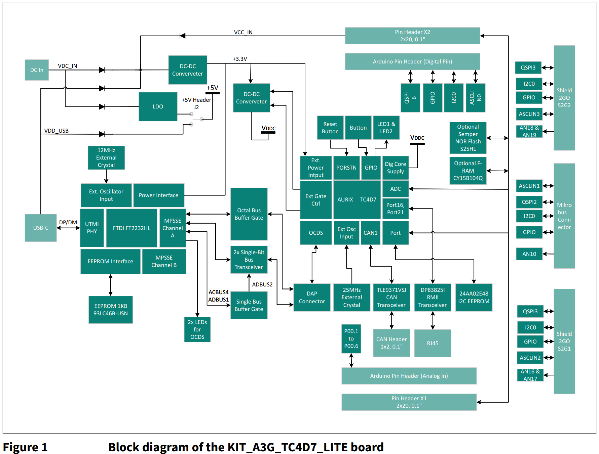
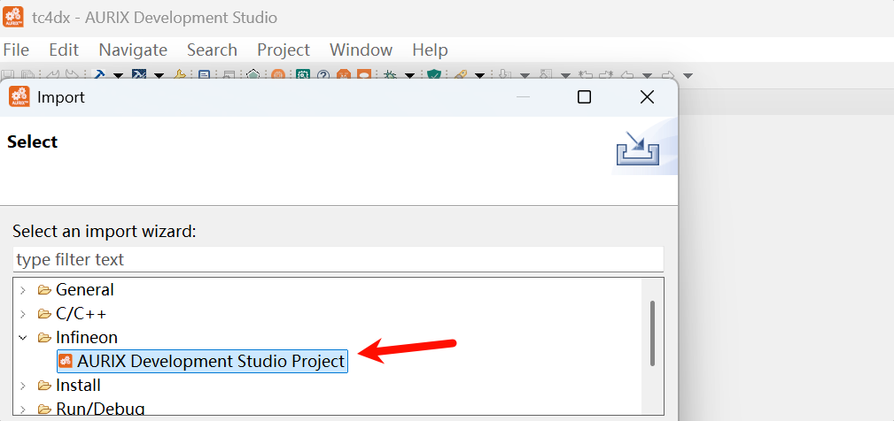
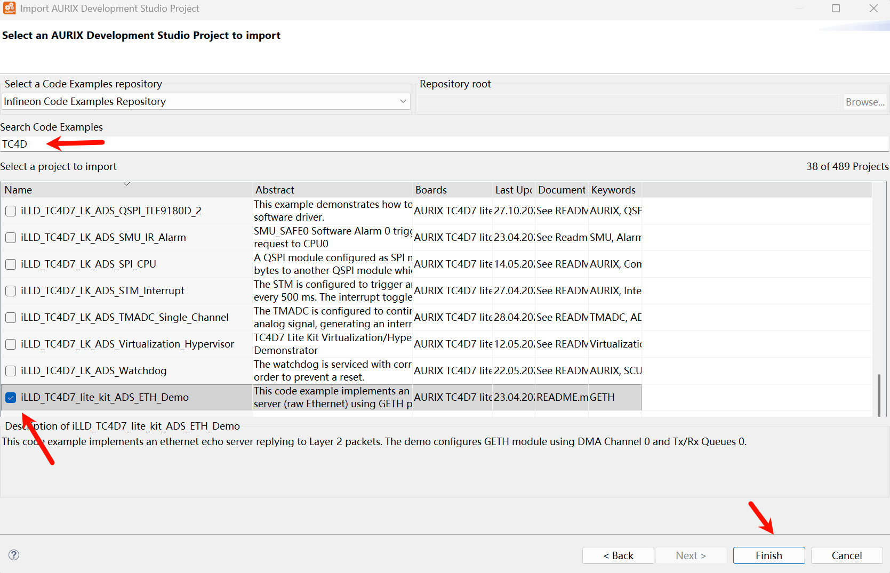
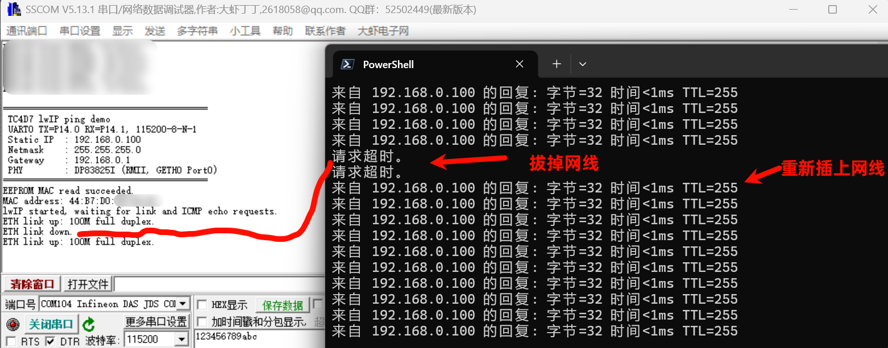
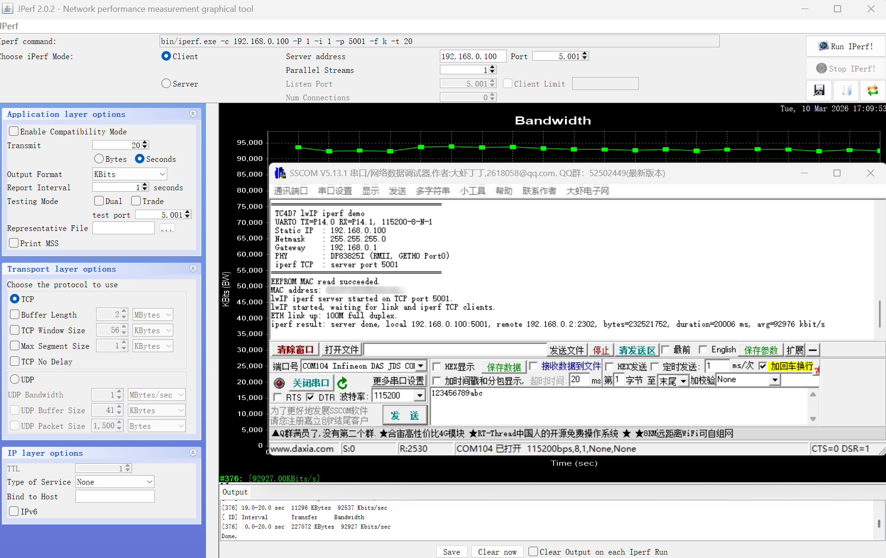
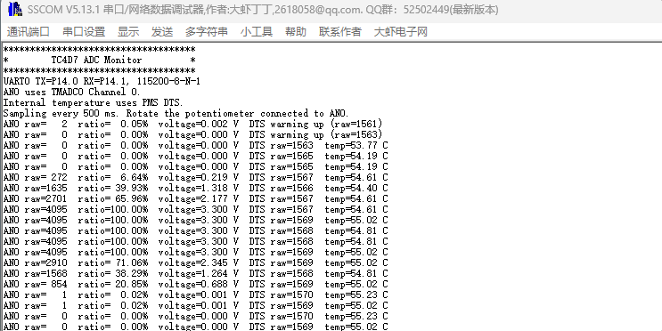
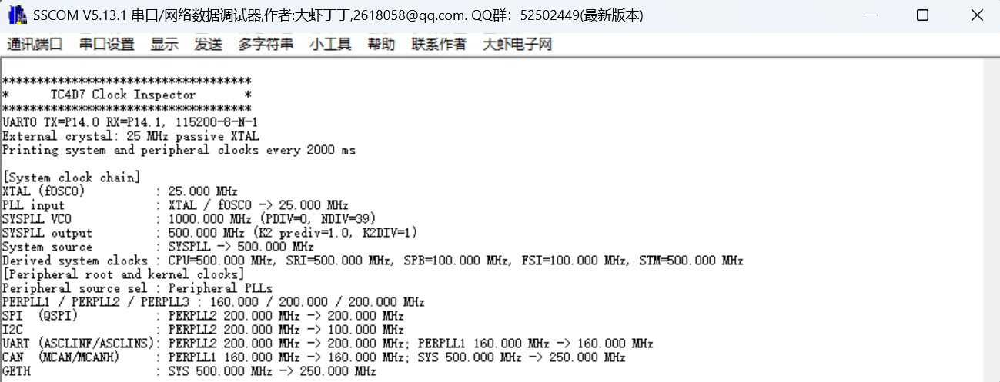

# KIT_A3G_TC4D7_LITE 上手笔记

## 板子图片

包装盒和板子正反面:


## 电源启动复位时钟调试



**电源**:

- 单接 TypeC, CCx引脚有5.1K下拉, 5V输出, 板子能正常工作, 也能同时在X3 Jack 2.1mm 或 排针 VCC_IN 接入 12V 外部供电
- DC-DC: TPS565247DRLR, 输入最大到16V, 输出3.3V, 最大5A
- LDO: TLE4284DV50ATMA1, 输入最大到40V, 输出五福一安, 默认J2上的跳线帽接到了来自USB的5V, 这个LDO搁置.
- VCORE 来自 VGATEE1N 和 VGATEE1P 两个 MOS 管 BUK4D16-20H 和 BUK4D38-20PX, 万用表实测 1.048V.

**启动配置**:

- HWCFG[2:1] = 01B, 通过 3.3V 单电源供电, 内部 EVRC 工作在 SMPS 模式, VGATE1P VGATE1N 引脚外接 MOSFET 输出 VCORE
- HWCFG[4:3]

**时钟**:

- 25MHz 无源晶振


## 开发环境

- Aurix Development Studio: 1.10.28, iLLD 2.4.0, Tricore GCC 11.3.1, 目前这个 ADS 版本并没有像 TC3XX 那样集成 Pin Mapper, 还不太友好. 至于官网有 TC4D9 例子的 Limit 版本或者 Pin Mapper, 似乎是需要申请的, 本文并不涉及这些, 只用最通用的 ADS 即可.
- Memtool: 2025.04

## 导入工程

File -> Import -> Infineon -> AURIX Development Studio Project -> Next



可以看到 TC4D7 相关的示例工程, 可勾选一个, 编译下载(可能需要先打开 TAS Perfmeter)不再赘述



## 新建工程

File -> New -> New AURIX Project -> 输入工程名, 选择存储位置 -> 选择器件 TC4D7XP, Custom Board:


## 板载硬件测试

所有工程在以下链接的 tc4dx 目录下, 欢迎 Star:

[https://github.com/weifengdq/embedded](https://github.com/weifengdq/embedded)

做了几个测试板载硬件的工程, 可以 ads 或者 powershell + cmake 脚本编译下载执行, build.ps1 里面写了工具链路径和下载软件路径, 按需修改即可

```bash
$ToolchainBin = "C:\Infineon\AURIX-Studio-1.10.28\tools\Compilers\tricore-gcc11\bin"

$defaultAurixFlasher = "C:\Infineon\AURIX-Studio-1.10.28\tools\AurixFlasherSoftwareTool_v3.0.14\AURIXFlasher.exe"
```

除了 coremark 工程, 编译下载运行一般是

```bash
.\build.ps1 -Action rebuild -BuildType Release
.\build.ps1 -Action download -BuildType Release
```

各工程简介如下

### tc4d7_gpio

每 50ms 轮询一次按键(板子丝印BUTTON), 如果按键被按下, 则点亮 LED1  LED2, 否则熄灭 LED1 LED2

### tc4d7_uart_printf_echo

串口 UART0 的 echo 测试, 115200-8-N-1, 连接到了板载的 DAP MiniWiggler, 插上 USB 即可.


### tc4d7_coremark

没有太多优化, 实际可能有出入或许更优, 此处结果仅供参考, ADS 带的 GCC 11.3.1, CoreMark 跑分单核 1995, 多核 11951


测试方法和某一次的测试结果:

```bash
# 单核，Release，STACK
.\build.ps1 -Action rebuild -BuildType Release -CoremarkThreads 1 -CoremarkMemMethod STACK
.\build.ps1 -Action download -BuildType Release -CoremarkThreads 1 -CoremarkMemMethod STACK
## 串口日志
=== TC4D7 CoreMark (1 thread) ===
2K performance run parameters for coremark.
CoreMark Size    : 666
Total ticks      : 3223427395
Total time (secs): 15.036789
Iterations/Sec   : 1995.106750
Iterations       : 30000
Compiler version : 11.3.1 20221230
Compiler flags   : -O3 -DNDEBUG
Memory location  : STACK
seedcrc          : 0xe9f5
[0]crclist       : 0xe714
[0]crcmatrix     : 0x1fd7
[0]crcstate      : 0x8e3a
[0]crcfinal      : 0x5275
Correct operation validated. See README.md for run and reporting rules.
CoreMark 1.0 : 1995.106750 / 11.3.1 20221230 -O3 -DNDEBUG / STACK

# 六核，Release，STACK
.\build.ps1 -Action rebuild -BuildType Release -CoremarkThreads 6 -CoremarkMemMethod STACK -CoremarkIterations 30000
.\build.ps1 -Action download -BuildType Release -CoremarkThreads 6 -CoremarkMemMethod STACK
## 串口日志
=== TC4D7 CoreMark (6 thread) ===
2K performance run parameters for coremark.
CoreMark Size    : 666
Total ticks      : 3229989361
Total time (secs): 15.049913
Iterations/Sec   : 11960.201780
Iterations       : 180000
Compiler version : 11.3.1 20221230
Compiler flags   : -O3 -DNDEBUG
Parallel AURIX_TC4DX_CORES : 6
Memory location  : STACK
seedcrc          : 0xe9f5
[0]crclist       : 0xe714
[1]crclist       : 0xe714
[2]crclist       : 0xe714
[3]crclist       : 0xe714
[4]crclist       : 0xe714
[5]crclist       : 0xe714
[0]crcmatrix     : 0x1fd7
[1]crcmatrix     : 0x1fd7
[2]crcmatrix     : 0x1fd7
[3]crcmatrix     : 0x1fd7
[4]crcmatrix     : 0x1fd7
[5]crcmatrix     : 0x1fd7
[0]crcstate      : 0x8e3a
[1]crcstate      : 0x8e3a
[2]crcstate      : 0x8e3a
[3]crcstate      : 0x8e3a
[4]crcstate      : 0x8e3a
[5]crcstate      : 0x8e3a
[0]crcfinal      : 0x5275
[1]crcfinal      : 0x5275
[2]crcfinal      : 0x5275
[3]crcfinal      : 0x5275
[4]crcfinal      : 0x5275
[5]crcfinal      : 0x5275
Correct operation validated. See README.md for run and reporting rules.
CoreMark 1.0 : 11960.201780 / 11.3.1 20221230 -O3 -DNDEBUG / STACK / 6:AURIX_TC4DX_CORES

# 单核，Release，MALLOC
.\build.ps1 -Action rebuild -BuildType Release -CoremarkThreads 1 -CoremarkMemMethod MALLOC
.\build.ps1 -Action download -BuildType Release -CoremarkThreads 1 -CoremarkMemMethod MALLOC
## 串口日志
=== TC4D7 CoreMark (1 thread) ===
2K performance run parameters for coremark.
CoreMark Size    : 666
Total ticks      : 3198857374
Total time (secs): 14.987649
Iterations/Sec   : 2001.648112
Iterations       : 30000
Compiler version : 11.3.1 20221230
Compiler flags   : -O3 -DNDEBUG
Memory location  : MALLOC
seedcrc          : 0xe9f5
[0]crclist       : 0xe714
[0]crcmatrix     : 0x1fd7
[0]crcstate      : 0x8e3a
[0]crcfinal      : 0x5275
Correct operation validated. See README.md for run and reporting rules.
CoreMark 1.0 : 2001.648112 / 11.3.1 20221230 -O3 -DNDEBUG / MALLOC

# 六核，Release，MALLOC
.\build.ps1 -Action rebuild -BuildType Release -CoremarkThreads 6 -CoremarkMemMethod MALLOC -CoremarkIterations 30000
.\build.ps1 -Action download -BuildType Release -CoremarkThreads 6 -CoremarkMemMethod MALLOC
# 串口日志
=== TC4D7 CoreMark (6 thread) ===
2K performance run parameters for coremark.
CoreMark Size    : 666
Total ticks      : 3234191692
Total time (secs): 15.058318
Iterations/Sec   : 11953.526303
Iterations       : 180000
Compiler version : 11.3.1 20221230
Compiler flags   : -O3 -DNDEBUG
Parallel AURIX_TC4DX_CORES : 6
Memory location  : MALLOC
seedcrc          : 0xe9f5
[0]crclist       : 0xe714
[1]crclist       : 0xe714
[2]crclist       : 0xe714
[3]crclist       : 0xe714
[4]crclist       : 0xe714
[5]crclist       : 0xe714
[0]crcmatrix     : 0x1fd7
[1]crcmatrix     : 0x1fd7
[2]crcmatrix     : 0x1fd7
[3]crcmatrix     : 0x1fd7
[4]crcmatrix     : 0x1fd7
[5]crcmatrix     : 0x1fd7
[0]crcstate      : 0x8e3a
[1]crcstate      : 0x8e3a
[2]crcstate      : 0x8e3a
[3]crcstate      : 0x8e3a
[4]crcstate      : 0x8e3a
[5]crcstate      : 0x8e3a
[0]crcfinal      : 0x5275
[1]crcfinal      : 0x5275
[2]crcfinal      : 0x5275
[3]crcfinal      : 0x5275
[4]crcfinal      : 0x5275
[5]crcfinal      : 0x5275
Correct operation validated. See README.md for run and reporting rules.
CoreMark 1.0 : 11953.526303 / 11.3.1 20221230 -O3 -DNDEBUG / MALLOC / 6:AURIX_TC4DX_CORES
```

### tc4d7_can

板子上的收发器 TLE9371VSJXTMA1 是支持 8Mbits/s 的, 板载也带了120Ω终端电阻:

工程默认 500K 80% + 2M 80%, 会把收到的CAN消息原封不动传回去, 测试截图:


### tc4d7_i2c_eeprom_eui

KIT_A3G_TC4D7_LITE 提供一个 2 Kb I2C 串行 EEPROM，预编程的 EUI-48 MAC ID（Microchip 24AA02E48）, 工程 I2C 速率 400 kHz, 没有写入, 只有读出 MAC 地址

```bash
========================================
TC4D7 I2C EEPROM / EUI-48 test
UART0 TX=P14.0 RX=P14.1 @ 115200
I2C0  SCL=P13.1 SDA=P13.2 @ 400 kHz
EEPROM 24AA02E48, slave=0x50
========================================
[1/5] Initialize I2C0...
      OK
[2/5] Read EUI-48 MAC from 0xFA...
      OK
MAC address : 44:B7:D0:**:**:**
[3/5] Run EEPROM write/read verification at 0x20-0x3F...
      FAILED, I2C status=0, last address=0x20
      Mismatch at +0x00: expected=0x31 actual=0xFF backup=0xFF
      Data stayed equal to backup; write looks blocked or ignored by hardware.
      Write data  : 31 3E 4C 59 67 74 82 8F 9D AA B8 C5 D3 E0 EE FB
      Read back   : FF FF FF FF FF FF FF FF FF FF FF FF FF FF FF FF
      Backup data : FF FF FF FF FF FF FF FF FF FF FF FF FF FF FF FF
      Switch to read-only mode: user EEPROM area behaves as read-only on this board.
[4/5] Measure read throughput only...
      OK
[5/5] Restore original EEPROM test area...
      SKIPPED (no writable EEPROM area available)

Result summary
--------------
I2C init            : PASS
MAC read            : PASS
Write/read test     : READ-ONLY
Benchmark           : PASS
Restore             : SKIPPED
Overall             : PASS (READ-ONLY)
Write blocked hint  : YES
Read-only mode      : YES
MAC address : 44:B7:D0:**:**:**
Mismatch detail     : +0x00 expected=0x31 actual=0xFF backup=0xFF
Ready polls         : 32
Last I2C status     : 0
Last EEPROM addr    : 0x20
Write benchmark     : 0 bytes in 0 us, 0 B/s
Read benchmark      : 2048 bytes in 52470 us, 39031 B/s
```


### tc4d7_lwip_ping

LwIP 2.2.1, PHY DP83825I, RMII, 100M, 静态IP 192.168.0.100



### tc4d7_lwip_iperf

百兆PHY测不出什么, 之前 TC397 千兆 PHY 网上测试结果大概是 200Mbits/s 左右, 也说不好 TC4Dx 的上限是多少



### tc4d7_adc

外部 250 kΩ 电位器, 这里的温度不是走的ADC, 是从 PMS VTMON 获取的, 不过代码没有删除. 旋转电位器, 逆时针数值增大, 顺时针数值减小



### tc4d7_clock

打出了从外部 25MHz 无源晶振到系统时钟 500MHz, 以及常用外设的主时钟, 未检查, 可能有误



## 工程链接

再次贴出 Github 工程链接, 欢迎 Star:

[https://github.com/weifengdq/embedded](https://github.com/weifengdq/embedded)

另外官方的示例工程是:

[https://github.com/Infineon/AURIX_code_examples](https://github.com/Infineon/AURIX_code_examples)


