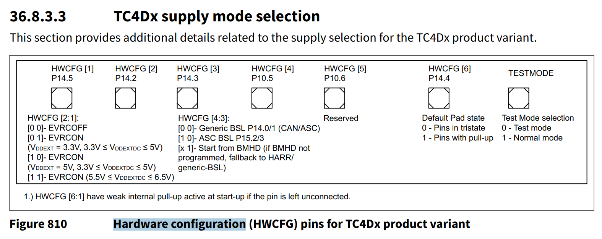
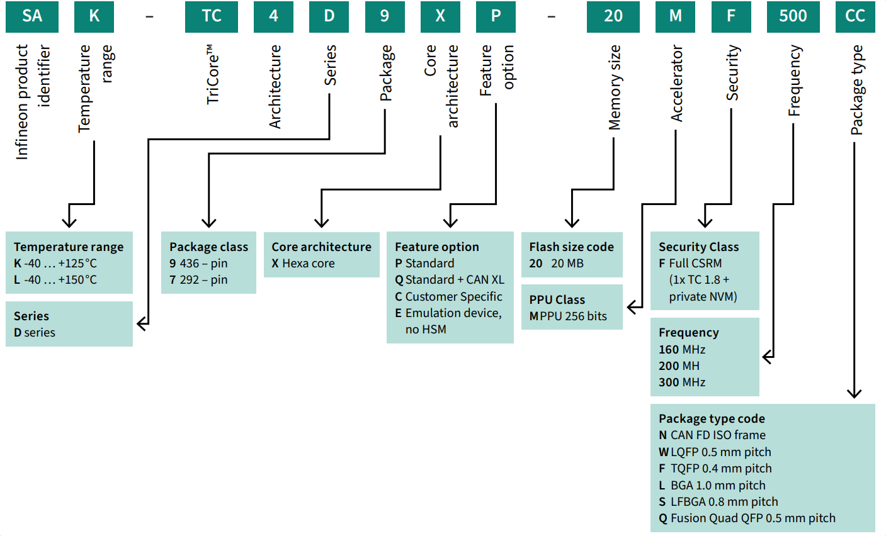
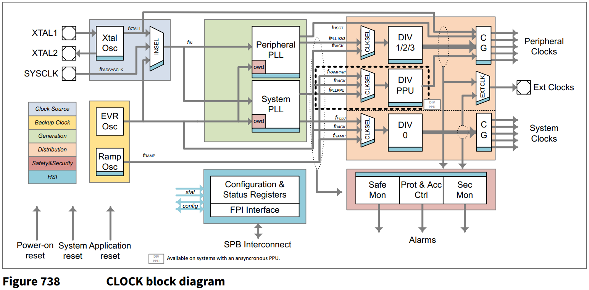

# KIT_A3G_TC4D7_LITE 上手笔记


- [KIT\_A3G\_TC4D7\_LITE 上手笔记](#kit_a3g_tc4d7_lite-上手笔记)
  - [板子图片](#板子图片)
  - [电源启动复位时钟调试](#电源启动复位时钟调试)
  - [开发环境](#开发环境)
  - [ADS 工程操作](#ads-工程操作)
    - [导入工程](#导入工程)
    - [新建工程](#新建工程)
  - [MCU简介](#mcu简介)
  - [板载硬件测试](#板载硬件测试)
    - [tc4d7\_gpio](#tc4d7_gpio)
    - [tc4d7\_uart\_printf\_echo](#tc4d7_uart_printf_echo)
    - [tc4d7\_coremark](#tc4d7_coremark)
    - [tc4d7\_can](#tc4d7_can)
    - [tc4d7\_i2c\_eeprom\_eui](#tc4d7_i2c_eeprom_eui)
    - [tc4d7\_lwip\_ping](#tc4d7_lwip_ping)
    - [tc4d7\_lwip\_iperf](#tc4d7_lwip_iperf)
    - [tc4d7\_adc](#tc4d7_adc)
    - [tc4d7\_clock](#tc4d7_clock)
  - [CMake补充说明](#cmake补充说明)
  - [链接脚本文件](#链接脚本文件)
  - [工程链接](#工程链接)


## 板子图片

包装盒和板子正反面:


## 电源启动复位时钟调试


**电源**:

- 单接 TypeC, CCx引脚有5.1K下拉, 5V输出, 板子能正常工作, 也能同时在X3 Jack 2.1mm 或 排针 VCC_IN 接入 12V 外部供电
- DC-DC: TPS565247DRLR, 输入最大到16V, 输出3.3V, 最大5A
- LDO: TLE4284DV50ATMA1, 输入最大到40V, 输出五福一安, 默认J2上的跳线帽接到了来自USB的5V, 这个LDO搁置.
- VCORE 来自 VGATEE1N 和 VGATEE1P 两个 MOS 管 BUK4D16-20H 和 BUK4D38-20PX, 万用表实测 1.048V.

**启动配置**:

- 
- HWCFG[2:1] = 01B, EVRCON, 通过 3.3V 单电源供电, 内部 EVRC 工作在 SMPS 模式, VGATE1P VGATE1N 引脚外接 MOSFET 输出 VCORE
- HWCFG[4:3] = 11B, 外部配置电阻没有接, 内部弱上拉
- HWCFG6 = 1B, 默认引脚上拉
- **TESTMODE**, P20.2, 悬空未接, 正常模式

**复位**:

- /PORST, 低电平复位, 开漏, 板子2.2K上拉到3.3V

**时钟**:

- 25MHz 无源晶振, 参考下方的 tc4d7_clock 小节
  - System PLL, PLL0, DIV 0 后是 System Clocks 500MHz 系统时钟
  - Peripheral PLL
    - PLL1 160M, 主要给 CAN, 为了兼容 CANXL 20M, 从 80M 提到 160M 还是很有必要的
    - PLL2 200M, 给 QSPI ASCLIN I2C 等外设?
    - PLL3 200M

**调试**:

- 板载的 DAP miniWiggler 或外部 1.27_2x5P 的调试口接其它调试器如劳

## 开发环境

- Aurix Development Studio: 1.10.28, iLLD 2.4.0, Tricore GCC 11.3.1, 目前这个 ADS 版本并没有像 TC3XX 那样集成 Pin Mapper, 还不太友好. 至于官网有 TC4D9 例子的 Limit 版本或者 Pin Mapper, 似乎是需要申请的, 本文并不涉及这些, 只用最通用的 ADS 即可.
- Memtool: 2025.04

## ADS 工程操作

### 导入工程

File -> Import -> Infineon -> AURIX Development Studio Project -> Next


可以看到 TC4D7 相关的示例工程, 可勾选一个, 编译下载(可能需要先打开 TAS Perfmeter)不再赘述


### 新建工程

File -> New -> New AURIX Project -> 输入工程名, 选择存储位置 -> 选择器件 TC4D7XP, Custom Board:


## MCU简介

板载型号是 SAK-TC4D7XP-20MF500MC, 对照下图:

- 温度范围  -40 … +125 °C
- PG-F2BGA-292, 但要注意引脚排列和TC3x是不同的, 不能把板子上的TC3x吹下来直接换TC4x
- 六核, 500MHz
- 标准版, 不带 CAN XL, 有 2x 5 Gbps GETH, 1 PCIe, 20路CANFD, 28路ASCLIN, 有 SDMMC
- 20MB eFlash, PFlash 0 1 3 4 是 4MB, PFlash 2 5 是 2MB, AB-Swap的拆分是与TC3x不同的



## 板载硬件测试

所有工程在以下链接的 tc4dx 目录下, 欢迎 Star:

[https://github.com/weifengdq/embedded](https://github.com/weifengdq/embedded)

这几个用于补充官方例程的测试板载硬件的工程, 可以 ads 或者 powershell + cmake 脚本编译下载执行, build.ps1 里面写了工具链路径和下载软件路径, 可按需修改

```bash
$ToolchainBin = "C:\Infineon\AURIX-Studio-1.10.28\tools\Compilers\tricore-gcc11\bin"

$defaultAurixFlasher = "C:\Infineon\AURIX-Studio-1.10.28\tools\AurixFlasherSoftwareTool_v3.0.14\AURIXFlasher.exe"
```

除了 coremark 工程, 编译下载运行一般是

```bash
.\build.ps1 -Action rebuild -BuildType Release
.\build.ps1 -Action download -BuildType Release
```

如果用 ads 编译下载运行, 注意要把之前 cmake 对应的 build 文件夹先 clean 掉.

各工程简介如下, 更详细的说明可以参考部分工程中的 README.md.

### tc4d7_gpio

引脚分配:

- BUTTON: P03.11, 按下是低电平
- LED1: P03.9, 低电平点亮
- LED2: P03.10, 低电平点亮

每 50ms 轮询一次按键(板子丝印BUTTON), 如果按键被按下, 则点亮 LED1  LED2, 否则熄灭 LED1 LED2

### tc4d7_uart_printf_echo

引脚分配:

- ASCLIN0(Uart0): RX P14.1, TX: P14.0

串口 UART0 的 echo 测试, 115200-8-N-1, 连接到了板载的 DAP MiniWiggler, 插上 USB 即可.


### tc4d7_coremark

没有太多优化, 实际可能有出入或许更优, 此处结果仅供参考, ADS 带的 GCC 11.3.1, CoreMark 跑分单核 1995, 多核 11951. 单核跑分与相近主频的 STM32H7 HPM5E00 CH32H417 相去不远.


测试方法和某一次的测试结果:

```bash
# 单核，Release，STACK
.\build.ps1 -Action rebuild -BuildType Release -CoremarkThreads 1 -CoremarkMemMethod STACK
.\build.ps1 -Action download -BuildType Release -CoremarkThreads 1 -CoremarkMemMethod STACK
## 串口日志
=== TC4D7 CoreMark (1 thread) ===
2K performance run parameters for coremark.
CoreMark Size    : 666
Total ticks      : 3223427395
Total time (secs): 15.036789
Iterations/Sec   : 1995.106750
Iterations       : 30000
Compiler version : 11.3.1 20221230
Compiler flags   : -O3 -DNDEBUG
Memory location  : STACK
seedcrc          : 0xe9f5
[0]crclist       : 0xe714
[0]crcmatrix     : 0x1fd7
[0]crcstate      : 0x8e3a
[0]crcfinal      : 0x5275
Correct operation validated. See README.md for run and reporting rules.
CoreMark 1.0 : 1995.106750 / 11.3.1 20221230 -O3 -DNDEBUG / STACK

# 六核，Release，STACK
.\build.ps1 -Action rebuild -BuildType Release -CoremarkThreads 6 -CoremarkMemMethod STACK -CoremarkIterations 30000
.\build.ps1 -Action download -BuildType Release -CoremarkThreads 6 -CoremarkMemMethod STACK
## 串口日志
=== TC4D7 CoreMark (6 thread) ===
2K performance run parameters for coremark.
CoreMark Size    : 666
Total ticks      : 3229989361
Total time (secs): 15.049913
Iterations/Sec   : 11960.201780
Iterations       : 180000
Compiler version : 11.3.1 20221230
Compiler flags   : -O3 -DNDEBUG
Parallel AURIX_TC4DX_CORES : 6
Memory location  : STACK
seedcrc          : 0xe9f5
[0]crclist       : 0xe714
[1]crclist       : 0xe714
[2]crclist       : 0xe714
[3]crclist       : 0xe714
[4]crclist       : 0xe714
[5]crclist       : 0xe714
[0]crcmatrix     : 0x1fd7
[1]crcmatrix     : 0x1fd7
[2]crcmatrix     : 0x1fd7
[3]crcmatrix     : 0x1fd7
[4]crcmatrix     : 0x1fd7
[5]crcmatrix     : 0x1fd7
[0]crcstate      : 0x8e3a
[1]crcstate      : 0x8e3a
[2]crcstate      : 0x8e3a
[3]crcstate      : 0x8e3a
[4]crcstate      : 0x8e3a
[5]crcstate      : 0x8e3a
[0]crcfinal      : 0x5275
[1]crcfinal      : 0x5275
[2]crcfinal      : 0x5275
[3]crcfinal      : 0x5275
[4]crcfinal      : 0x5275
[5]crcfinal      : 0x5275
Correct operation validated. See README.md for run and reporting rules.
CoreMark 1.0 : 11960.201780 / 11.3.1 20221230 -O3 -DNDEBUG / STACK / 6:AURIX_TC4DX_CORES

# 单核，Release，MALLOC
.\build.ps1 -Action rebuild -BuildType Release -CoremarkThreads 1 -CoremarkMemMethod MALLOC
.\build.ps1 -Action download -BuildType Release -CoremarkThreads 1 -CoremarkMemMethod MALLOC
## 串口日志
=== TC4D7 CoreMark (1 thread) ===
2K performance run parameters for coremark.
CoreMark Size    : 666
Total ticks      : 3198857374
Total time (secs): 14.987649
Iterations/Sec   : 2001.648112
Iterations       : 30000
Compiler version : 11.3.1 20221230
Compiler flags   : -O3 -DNDEBUG
Memory location  : MALLOC
seedcrc          : 0xe9f5
[0]crclist       : 0xe714
[0]crcmatrix     : 0x1fd7
[0]crcstate      : 0x8e3a
[0]crcfinal      : 0x5275
Correct operation validated. See README.md for run and reporting rules.
CoreMark 1.0 : 2001.648112 / 11.3.1 20221230 -O3 -DNDEBUG / MALLOC

# 六核，Release，MALLOC
.\build.ps1 -Action rebuild -BuildType Release -CoremarkThreads 6 -CoremarkMemMethod MALLOC -CoremarkIterations 30000
.\build.ps1 -Action download -BuildType Release -CoremarkThreads 6 -CoremarkMemMethod MALLOC
# 串口日志
=== TC4D7 CoreMark (6 thread) ===
2K performance run parameters for coremark.
CoreMark Size    : 666
Total ticks      : 3234191692
Total time (secs): 15.058318
Iterations/Sec   : 11953.526303
Iterations       : 180000
Compiler version : 11.3.1 20221230
Compiler flags   : -O3 -DNDEBUG
Parallel AURIX_TC4DX_CORES : 6
Memory location  : MALLOC
seedcrc          : 0xe9f5
[0]crclist       : 0xe714
[1]crclist       : 0xe714
[2]crclist       : 0xe714
[3]crclist       : 0xe714
[4]crclist       : 0xe714
[5]crclist       : 0xe714
[0]crcmatrix     : 0x1fd7
[1]crcmatrix     : 0x1fd7
[2]crcmatrix     : 0x1fd7
[3]crcmatrix     : 0x1fd7
[4]crcmatrix     : 0x1fd7
[5]crcmatrix     : 0x1fd7
[0]crcstate      : 0x8e3a
[1]crcstate      : 0x8e3a
[2]crcstate      : 0x8e3a
[3]crcstate      : 0x8e3a
[4]crcstate      : 0x8e3a
[5]crcstate      : 0x8e3a
[0]crcfinal      : 0x5275
[1]crcfinal      : 0x5275
[2]crcfinal      : 0x5275
[3]crcfinal      : 0x5275
[4]crcfinal      : 0x5275
[5]crcfinal      : 0x5275
Correct operation validated. See README.md for run and reporting rules.
CoreMark 1.0 : 11953.526303 / 11.3.1 20221230 -O3 -DNDEBUG / MALLOC / 6:AURIX_TC4DX_CORES
```

### tc4d7_can

引脚分配:

- CAN01_TX: P01.3
- CAN01_RX: P01.4
- CAN_STB: P03.5, 上电引脚拉低是正常工作.

板子上的收发器 TLE9371VSJXTMA1 是支持 8Mbits/s 的, 板载也带了120Ω终端电阻:

工程默认 500K 80% + 2M 80%, 没有管TDC, 会把收到的CAN消息原封不动传回去, 测试截图:


### tc4d7_i2c_eeprom_eui

引脚分配:

- I2C0: SCL P13.1, SDA P13.2

KIT_A3G_TC4D7_LITE 提供一个 2 Kb I2C 串行 EEPROM，预编程的 EUI-48 MAC ID（Microchip 24AA02E48）, 工程 I2C 速率 400 kHz, 没有写入, 只有读出 MAC 地址

```bash
========================================
TC4D7 I2C EEPROM / EUI-48 test
UART0 TX=P14.0 RX=P14.1 @ 115200
I2C0  SCL=P13.1 SDA=P13.2 @ 400 kHz
EEPROM 24AA02E48, slave=0x50
========================================
[1/5] Initialize I2C0...
      OK
[2/5] Read EUI-48 MAC from 0xFA...
      OK
MAC address : 44:B7:D0:**:**:**
[3/5] Run EEPROM write/read verification at 0x20-0x3F...
      FAILED, I2C status=0, last address=0x20
      Mismatch at +0x00: expected=0x31 actual=0xFF backup=0xFF
      Data stayed equal to backup; write looks blocked or ignored by hardware.
      Write data  : 31 3E 4C 59 67 74 82 8F 9D AA B8 C5 D3 E0 EE FB
      Read back   : FF FF FF FF FF FF FF FF FF FF FF FF FF FF FF FF
      Backup data : FF FF FF FF FF FF FF FF FF FF FF FF FF FF FF FF
      Switch to read-only mode: user EEPROM area behaves as read-only on this board.
[4/5] Measure read throughput only...
      OK
[5/5] Restore original EEPROM test area...
      SKIPPED (no writable EEPROM area available)

Result summary
--------------
I2C init            : PASS
MAC read            : PASS
Write/read test     : READ-ONLY
Benchmark           : PASS
Restore             : SKIPPED
Overall             : PASS (READ-ONLY)
Write blocked hint  : YES
Read-only mode      : YES
MAC address : 44:B7:D0:**:**:**
Mismatch detail     : +0x00 expected=0x31 actual=0xFF backup=0xFF
Ready polls         : 32
Last I2C status     : 0
Last EEPROM addr    : 0x20
Write benchmark     : 0 bytes in 0 us, 0 B/s
Read benchmark      : 2048 bytes in 52470 us, 39031 B/s
```


### tc4d7_lwip_ping

LwIP 2.2.1, PHY DP83825I, RMII, 100M, 静态IP 192.168.0.100


### tc4d7_lwip_iperf

板子上的百兆PHY测不出什么, 之前 TC397 接千兆 PHY 网上测试结果大概是 200Mbits/s 左右, 也说不好 TC4Dx 的 5G GETH 实际上限是多少, CPU主频不算太高, 全靠 DMA 或 加速器优化, 联想起王翠花家的 400MHz CH32H417 的 5Gbps USB 3.


### tc4d7_adc

外部 250 kΩ 电位器接到 AN0, 经 TMADC0 Channel 0 连续采样. 旋转电位器, 逆时针数值增大, 顺时针数值减小.

使用 PMS DTS（Die Temperature Sensor） 获取内部温度, `temp = raw / 4.781 - 273.15`,  这里的内部温度不是走的ADC, 不过代码保留了没有删除. 


### tc4d7_clock

打出了从外部 25MHz 无源晶振到系统时钟 500MHz, 以及常用外设的主时钟, 未检查, 可能有误


参考下图看是比较直观的:



## CMake补充说明

> 工具链变量表
>
> | 变量 | 示例值 | 作用 |
> | --- | --- | --- |
> | CMAKE_SYSTEM_NAME | Generic | 告诉 CMake 当前不是桌面 OS，而是通用裸机目标 |
> | CMAKE_SYSTEM_PROCESSOR | tricore | 标识目标架构 |
> | CMAKE_TRY_COMPILE_TARGET_TYPE | STATIC_LIBRARY | 避免配置阶段 try_compile 去链接裸机可执行文件 |
> | AURIX_TOOLCHAIN_BIN | C:/Infineon/.../tricore-gcc11/bin | 工具链 bin 目录 |
> | CMAKE_C_COMPILER | tricore-elf-gcc.exe | C 编译器 |
> | CMAKE_CXX_COMPILER | tricore-elf-g++.exe | C++ 编译器 |
> | CMAKE_ASM_COMPILER | tricore-elf-gcc.exe | 汇编编译器 |
> | CMAKE_AR | tricore-elf-ar.exe | 静态库归档工具 |
> | CMAKE_RANLIB | tricore-elf-ranlib.exe | 静态库索引工具 |
> | CMAKE_OBJCOPY | tricore-elf-objcopy.exe | ELF 转 hex/bin 等格式 |
> | CMAKE_OBJDUMP | tricore-elf-objdump.exe | 反汇编/节查看 |
> | CMAKE_SIZE | tricore-elf-size.exe | 查看节大小 |
>
> 
>
> 编译与链接选项说明表
>
> | 选项 | 阶段 | 作用 | 实际意义 |
> | --- | --- | --- | --- |
> | -Og | Debug 编译 | 兼顾优化与可调试性 | 比 -O0 更接近真实运行状态 |
> | -g3 / -gdwarf-3 | Debug 编译 | 生成更完整调试信息 | 便于断点和变量查看 |
> | -O3 | Release 编译 | 高优化 | 用于最终性能版本 |
> | -DNDEBUG | Release/RelWithDebInfo/MinSizeRel | 关闭 assert 等调试逻辑 | 减少开销 |
> | -Wall | 编译 | 打开常见警告 | 基本质量门槛 |
> | -fno-common | 编译 | 禁止重复定义被合并 | 更早暴露全局变量定义错误 |
> | -fstrict-volatile-bitfields | 编译 | 严格按照位域访问硬件寄存器 | 对 MCU 寄存器访问更安全 |
> | -fdata-sections / -ffunction-sections | 编译 | 每个数据/函数放进独立节 | 让链接器能做未引用节裁剪 |
> | -mcpu=tc4DAx | 编译/链接 | 指定目标 CPU 架构 | 保证指令集和 ABI 匹配 |
> | -T...lsl | 链接 | 指定链接脚本 | 决定内存布局 |
> | -nocrt0 | 链接 | 不使用默认 CRT 启动文件 | 由 AURIX 启动文件接管复位流程 |
> | -Wl,--gc-sections | 链接 | 删除未引用节 | 减少最终镜像体积 |
> | -Wl,-Map,...map | 链接 | 输出 map 文件 | 用于分析节地址和大小 |

## 链接脚本文件

Lcf_Gcc_Tricore_Tc.lsl, 默认未改, 用 AI 给出的详细解释:

> ## 五、Lcf_Gcc_Tricore_Tc.lsl 链接脚本详细解释
>
> 链接脚本是本工程最关键的“内存布局总说明书”。编译器只负责把每个 .c 文件变成若干节，真正决定“代码和数据最后放到哪里”的，是这个 .lsl 文件。
>
> ### 5.1 文件级作用表
>
> | 项目 | 内容 | 说明 |
> | --- | --- | --- |
> | 输出格式 | elf32-tricore | 最终 ELF 面向 TriCore 架构 |
> | 输出架构 | tricore | 链接器按 TriCore 规则布局 |
> | 入口符号 | _START | 程序复位后从启动入口开始执行 |
> | 目标类型 | Default linker script for normal executables | 标准裸机可执行镜像 |
>
> ### 5.2 每核运行时保留区配置表
>
> | CPU | CSA 大小 | 用户栈 USTACK | 中断栈 ISTACK | DSPR 起始地址 | DSPR 大小 |
> | --- | --- | --- | --- | --- | --- |
> | CPU0 | 8 KB | 2 KB | 1 KB | 0x70000000 | 240 KB |
> | CPU1 | 8 KB | 2 KB | 1 KB | 0x60000000 | 240 KB |
> | CPU2 | 8 KB | 2 KB | 1 KB | 0x50000000 | 240 KB |
> | CPU3 | 8 KB | 2 KB | 1 KB | 0x40000000 | 240 KB |
> | CPU4 | 8 KB | 2 KB | 1 KB | 0x30000000 | 240 KB |
> | CPU5 | 8 KB | 2 KB | 1 KB | 0x20000000 | 240 KB |
>
> 说明：
>
> | 项目 | 含义 |
> | --- | --- |
> | CSA | Context Save Area，TriCore 硬件上下文保存区，函数调用与中断切换高度依赖它 |
> | USTACK | 普通线程/主循环使用的用户栈 |
> | ISTACK | 中断服务例程使用的中断栈 |
>
> ### 5.3 堆与偏移计算说明表
>
> | 项目 | 表达式 | 说明 |
> | --- | --- | --- |
> | HEAP 大小 | LCF_HEAP_SIZE = 4k | 默认堆空间 |
> | CSA 偏移 | DSPR_SIZE - 1k - CSA_SIZE | 把 CSA 放到每核 DSPR 高地址附近 |
> | ISTACK 偏移 | CSA_OFFSET - 256 - ISTACK_SIZE | 给栈区之间预留间隙 |
> | USTACK 偏移 | ISTACK_OFFSET - 256 - USTACK_SIZE | 用户栈位于中断栈下方 |
> | HEAP 偏移 | USTACK_OFFSET - HEAP_SIZE | 堆位于用户栈下方 |
>
> 这一组公式体现了脚本的设计思路：每核 DSPR 的高地址区域留给运行时保留块，避免与普通 .data/.bss 混放。
>
> ### 5.4 复位入口、启动入口、陷阱表、中断表地址表
>
> | 项目 | CPU0 | CPU1 | CPU2 | CPU3 | CPU4 | CPU5 |
> | --- | --- | --- | --- | --- | --- | --- |
> | 启动入口 cached | 0x80000000 | 0x80400000 | 0x80800000 | 0x80A00000 | 0x80E00000 | 0x81200000 |
> | 启动入口 non-cached | 0xA0000000 | 0xA0400000 | 0xA0800000 | 0xA0A00000 | 0xA0E00000 | 0xA1200000 |
> | Trap Vector | 0x80000100 | 0x80400100 | 0x80800100 | 0x80A00100 | 0x80E00100 | 0x81200100 |
> | Interrupt Vector | 0x803FE000 | 0x807FE000 | 0x809FE000 | 0x80DFE000 | 0x811FE000 | 0x813FE000 |
>
> 补充说明：
>
> | 项目 | 说明 |
> | --- | --- |
> | RESET = LCF_STARTPTR_NC_CPU0 | 复位后从 CPU0 的非缓存地址空间启动 |
> | .start_tc0 > pfls0_nc | CPU0 的启动段被固定放到非缓存 PFlash 镜像区 |
> | .start_tc1~5 > pflsX_nc | 其他 CPU 的启动入口也都固定放到各自非缓存 PFlash 区 |
> | .traptab_tcX > pflsX | 各 CPU trap 表放在各自 PFlash 区 |
> | .inttab_tcX | 每个中断向量槽位固定 0x20 字节间隔排列 |
>
> ### 5.5 MEMORY 区域汇总表
>
> | 区域名 | 属性 | 起始地址 | 大小 | 典型用途 |
> | --- | --- | --- | --- | --- |
> | dsram0~5 | w!xp | 0x70000000/0x60000000/.../0x20000000 | 各 240 KB | 各 CPU 的数据 SRAM |
> | dsram0_local~5_local | w!xp | 0xD0000000 | 各 240 KB | 各 CPU 本地视角地址 |
> | psram0~5 | w!xp | 0x70100000/0x60100000/... | 各 64 KB | 各 CPU 程序 SRAM |
> | psram_local | w!xp | 0xC0000000 | 64 KB | 本地程序 SRAM 视图 |
> | pfls0 | rx!p | 0x80000000 | 4 MB | CPU0 主 PFlash |
> | pfls1 | rx!p | 0x80400000 | 4 MB | CPU1 主 PFlash |
> | pfls2 | rx!p | 0x80800000 | 2 MB | CPU2 主 PFlash |
> | pfls3 | rx!p | 0x80A00000 | 4 MB | CPU3 主 PFlash |
> | pfls4 | rx!p | 0x80E00000 | 4 MB | CPU4 主 PFlash |
> | pfls5 | rx!p | 0x81200000 | 2 MB | CPU5 主 PFlash |
> | pfls0_nc~pfls5_nc | rx!p | 0xA0000000 起各镜像地址 | 与各自 PFlash 相同 | PFlash 非缓存镜像 |
> | ucb | rx!p | 0xAE400000 | 80 KB | 用户配置块 |
> | cpu0_dlmu~cpu5_dlmu | w!xp | 0x90000000 起 | 各 512 KB | 各 CPU Data LMU |
> | cpu0_dlmu_nc~cpu5_dlmu_nc | w!xp | 0xB0000000 起 | 各 512 KB | 各 CPU Data LMU 非缓存镜像 |
> | lmuram | w!xp | 0x90400000 | 5 MB | 共享 LMU RAM |
> | lmuram_nc | w!xp | 0xB0400000 | 5 MB | 共享 LMU RAM 非缓存镜像 |
>
> ### 5.6 REGION_MAP / REGION_MIRROR / REGION_ALIAS 作用表
>
> | 机制 | 示例 | 作用 | 结果 |
> | --- | --- | --- | --- |
> | REGION_MAP | REGION_MAP(CPU0, dsram0_local -> dsram0) | 把本地地址视图映射到全局地址视图 | 同一物理内存可以被不同寻址方式访问 |
> | REGION_MIRROR | REGION_MIRROR("pfls0", "pfls0_nc") | 建立 cached/non-cached 镜像关系 | 同一存储区拥有两组地址入口 |
> | REGION_ALIAS | default_ram = dsram0, default_rom = pfls0 | 为通用节分配提供默认落点 | 当前工程默认把全局数据放 CPU0 DSPR，把代码常量放 CPU0 PFlash |
>
> 当前脚本启用的是：
>
> | 别名 | 当前绑定 |
> | --- | --- |
> | default_ram | dsram0 |
> | default_rom | pfls0 |
>
> 这意味着如果某些节没有指定按 CPU 拆分的专属放置规则，它们默认会落到 CPU0 的数据 RAM 和 PFlash 中。
>
> ### 5.7 固定地址节布局汇总表
>
> | 节类别 | 位置 | 作用 | 特点 |
> | --- | --- | --- | --- |
> | .ustack | 各 CPU 的 DSPR 高地址保留区 | 用户栈 | 由 LCF_USTACKx_SIZE 与偏移公式决定 |
> | .istack | 各 CPU 的 DSPR 高地址保留区 | 中断栈 | 和 .ustack 分开，避免中断污染主栈 |
> | .csa | 各 CPU 的 DSPR 高地址保留区 | 上下文保存区 | TriCore 特有，不能随意删除 |
> | .start_tc0~5 | 各 CPU non-cached PFlash 启动地址 | 启动代码入口 | 启动入口地址固定 |
> | .traptab_tc0~5 | 各 CPU PFlash trap 地址 | 异常/陷阱向量 | 每核独立 |
> | .inttab_tc0~5 | 各 CPU PFlash interrupt 地址 | 中断向量表 | 脚本显式为 256 个槽位逐项保留 |
> | .interface_const | 0x80000020 | 接口常量区 | 启动初期可直接访问的固定常量 |
>
> ### 5.8 中断向量表的结构说明
>
> 脚本里中断向量表的写法看起来很长，本质上是重复模式：
>
> | 模式 | 含义 |
> | --- | --- |
> | .inttab_tcX_000 (__INTTAB_CPUX + 0x0000) | 第 0 个中断槽 |
> | .inttab_tcX_001 (__INTTAB_CPUX + 0x0020) | 第 1 个中断槽 |
> | ... | 每个槽位递增 0x20 |
> | .inttab_tcX_0FF (__INTTAB_CPUX + 0x1FE0) | 第 255 个中断槽 |
>
> 这说明每个 CPU 被预留了 256 个中断向量入口，每个入口固定 32 字节，链接器通过 KEEP(*(.intvec_tcX_N)) 保证相关节不会被垃圾回收删除。
>
> ### 5.9 小数据区与相对寻址区说明表
>
> | 节/符号 | 落点 | 作用 |
> | --- | --- | --- |
> | .sdata / .sbss | default_ram | A0 小数据区，可用更短指令访问 |
> | _SMALL_DATA_ / __A0_MEM | 由 .sdata 地址推导 | A0 基址符号 |
> | .sdata2 | default_rom | A1 小常量区 |
> | _SMALL_DATA2_ / __A1_MEM | 由 .sdata2 地址推导 | A1 基址符号 |
> | .sdata4 / .sbss4 | lmuram | A9 小数据区 |
> | _SMALL_DATA4_ / __A9_MEM | 由 .sdata4 地址推导 | A9 基址符号 |
> | .sdata3 | default_rom | A8 小常量区 |
> | _SMALL_DATA3_ / __A8_MEM | 由 .sdata3 地址推导 | A8 基址符号 |
>
> 这些区域的意义在于让编译器使用 TriCore 的相对寻址寄存器优化对小数据/小常量的访问。
>
> ### 5.10 各类数据节放置策略表
>
> | 节类别 | 典型节名 | 放置位置 | 说明 |
> | --- | --- | --- | --- |
> | 已初始化数据 | .data | 各 CPU 的 dsramX 或 default_ram | 运行前由 ROM 拷贝到 RAM |
> | 未初始化数据 | .bss | 各 CPU 的 dsramX 或 default_ram | 上电清零 |
> | LMU 初始化数据 | .lmudata | cpuX_dlmu 或 lmuram | 用于更大或共享的数据区 |
> | LMU 未初始化数据 | .lmubss | cpuX_dlmu 或 lmuram | 上电清零 |
> | 常量数据 | .rodata | 各 CPU 的 pflsX 或 default_rom | 直接留在 Flash |
> | 堆 | .heap | default_ram | 动态内存分配空间 |
>
> ### 5.11 clear table 的作用表
>
> | 符号/机制 | 作用 |
> | --- | --- |
> | __clear_table | 记录需要在启动阶段清零的 .zbss/.bss/.lmubss 等节 |
> | 启动代码读取 clear table | 按表执行内存清零 | 把链接脚本和启动代码解耦 |
>
> 这也是裸机工程常见做法：链接脚本不直接“执行清零”，而是提供一张描述表，启动代码统一遍历处理。
>
> ### 5.12 代码节放置策略表
>
> | 节类别 | 放置区域 | 说明 |
> | --- | --- | --- |
> | CPU 专属代码节 | 各 CPU 对应的 pflsX | 可按核拆分代码落点 |
> | 通用代码节 | default_rom | 如果没有特别区分，默认落到 CPU0 PFlash |
> | 启动节 | 各 CPU 的 pflsX_nc | 启动阶段更倾向走非缓存镜像 |

## 工程链接

再次贴出 Github 工程链接, 欢迎 Star:

[https://github.com/weifengdq/embedded](https://github.com/weifengdq/embedded)

另外官方的示例工程是:

[https://github.com/Infineon/AURIX_code_examples](https://github.com/Infineon/AURIX_code_examples)

Q交流群(`嵌入式_机器人_自动驾驶交流群`) :  1040239879


