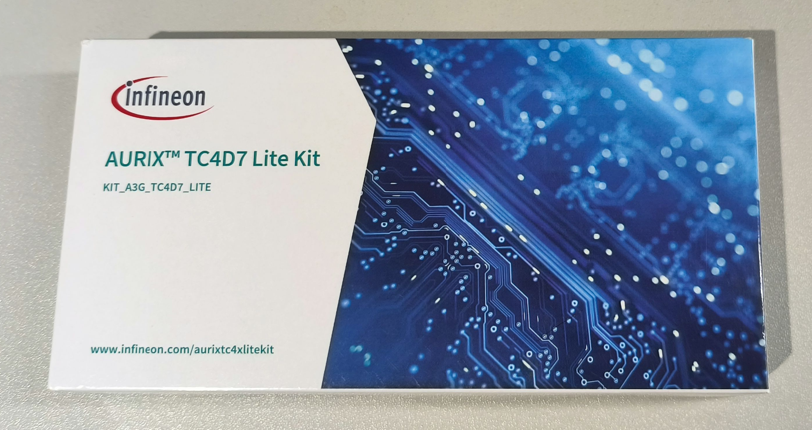
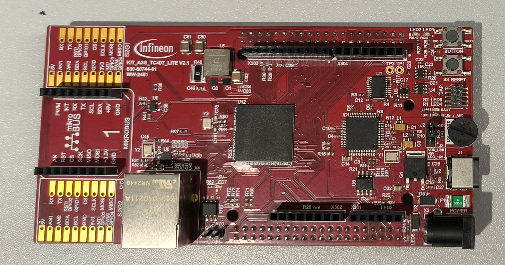
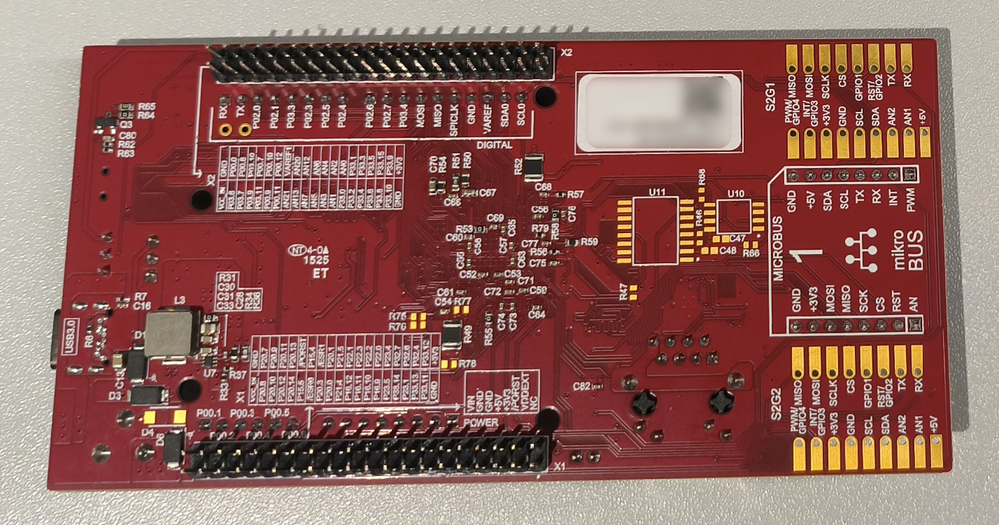
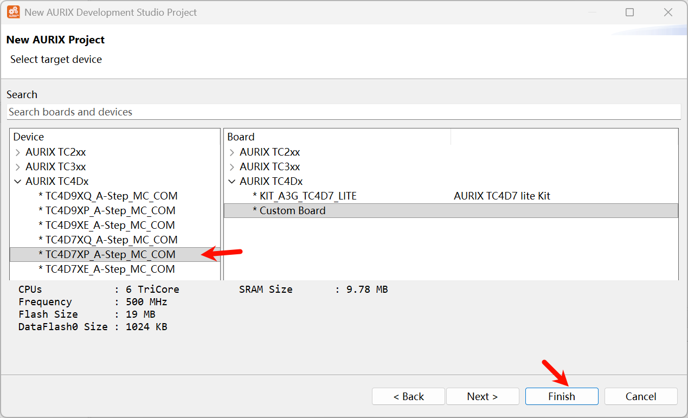
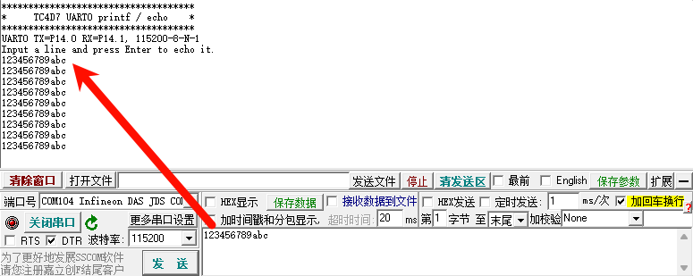
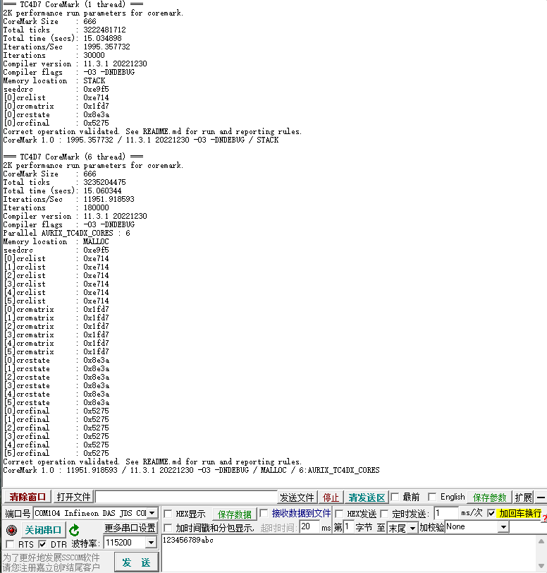
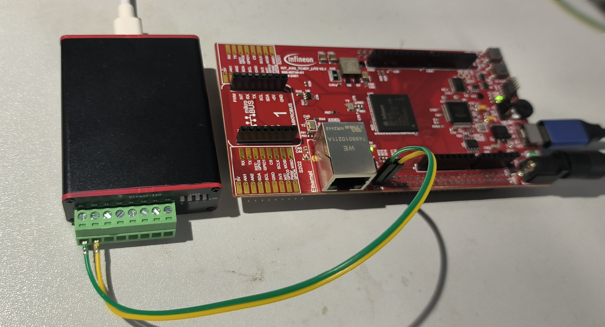
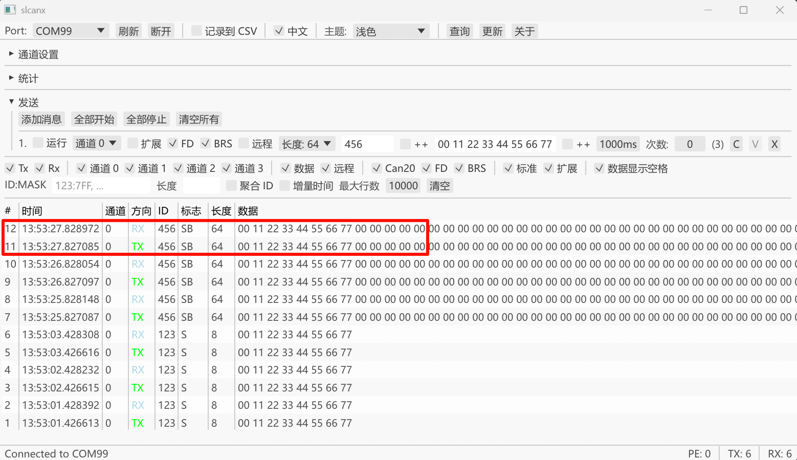

## KIT_A3G_TC4D7_LITE

包装盒和板子正反面:







## 开发环境

- Aurix Development Studio: 1.10.28
- Memtool: 2025.04


## 导入工程


## 新建工程

File -> New -> New AURIX Project -> 输入工程名, 选择存储位置 -> 选择器件 TC4D7XP, Custom Board:



## 板载硬件测试

所有工程在以下链接的 tc4d7 目录下:

[https://github.com/weifengdq/embedded](https://github.com/weifengdq/embedded)

做了几个测试板载硬件的工程, 可以 ads 或者 powershell + cmake 脚本编译下载执行, build.ps1 里面写了工具链路径和下载软件路径, 按需修改即可

```bash
$ToolchainBin = "C:\Infineon\AURIX-Studio-1.10.28\tools\Compilers\tricore-gcc11\bin"

$defaultAurixFlasher = "C:\Infineon\AURIX-Studio-1.10.28\tools\AurixFlasherSoftwareTool_v3.0.14\AURIXFlasher.exe"
```

除了 coremark 工程, 编译下载运行一般是

```bash
.\build.ps1 -Action rebuild -BuildType Release
.\build.ps1 -Action download -BuildType Release
```

各工程简介如下

### tc4d7_gpio

每 50ms 轮询一次按键(板子丝印BUTTON), 如果按键被按下, 则点亮 LED1  LED2, 否则熄灭 LED1 LED2

### tc4d7_uart_printf_echo

串口 UART0 的 echo 测试, 115200-8-N-1, 连接到了板载的 DAP MiniWiggler, 插上 USB 即可.



### tc4d7_coremark

没有什么优化, GCC, 单核 1995, 多核 11951



测试方法和某一次的测试结果:

```bash
# 单核，Release，STACK
.\build.ps1 -Action rebuild -BuildType Release -CoremarkThreads 1 -CoremarkMemMethod STACK
.\build.ps1 -Action download -BuildType Release -CoremarkThreads 1 -CoremarkMemMethod STACK
## 串口日志
=== TC4D7 CoreMark (1 thread) ===
2K performance run parameters for coremark.
CoreMark Size    : 666
Total ticks      : 3223427395
Total time (secs): 15.036789
Iterations/Sec   : 1995.106750
Iterations       : 30000
Compiler version : 11.3.1 20221230
Compiler flags   : -O3 -DNDEBUG
Memory location  : STACK
seedcrc          : 0xe9f5
[0]crclist       : 0xe714
[0]crcmatrix     : 0x1fd7
[0]crcstate      : 0x8e3a
[0]crcfinal      : 0x5275
Correct operation validated. See README.md for run and reporting rules.
CoreMark 1.0 : 1995.106750 / 11.3.1 20221230 -O3 -DNDEBUG / STACK

# 六核，Release，STACK
.\build.ps1 -Action rebuild -BuildType Release -CoremarkThreads 6 -CoremarkMemMethod STACK -CoremarkIterations 30000
.\build.ps1 -Action download -BuildType Release -CoremarkThreads 6 -CoremarkMemMethod STACK
## 串口日志
=== TC4D7 CoreMark (6 thread) ===
2K performance run parameters for coremark.
CoreMark Size    : 666
Total ticks      : 3229989361
Total time (secs): 15.049913
Iterations/Sec   : 11960.201780
Iterations       : 180000
Compiler version : 11.3.1 20221230
Compiler flags   : -O3 -DNDEBUG
Parallel AURIX_TC4DX_CORES : 6
Memory location  : STACK
seedcrc          : 0xe9f5
[0]crclist       : 0xe714
[1]crclist       : 0xe714
[2]crclist       : 0xe714
[3]crclist       : 0xe714
[4]crclist       : 0xe714
[5]crclist       : 0xe714
[0]crcmatrix     : 0x1fd7
[1]crcmatrix     : 0x1fd7
[2]crcmatrix     : 0x1fd7
[3]crcmatrix     : 0x1fd7
[4]crcmatrix     : 0x1fd7
[5]crcmatrix     : 0x1fd7
[0]crcstate      : 0x8e3a
[1]crcstate      : 0x8e3a
[2]crcstate      : 0x8e3a
[3]crcstate      : 0x8e3a
[4]crcstate      : 0x8e3a
[5]crcstate      : 0x8e3a
[0]crcfinal      : 0x5275
[1]crcfinal      : 0x5275
[2]crcfinal      : 0x5275
[3]crcfinal      : 0x5275
[4]crcfinal      : 0x5275
[5]crcfinal      : 0x5275
Correct operation validated. See README.md for run and reporting rules.
CoreMark 1.0 : 11960.201780 / 11.3.1 20221230 -O3 -DNDEBUG / STACK / 6:AURIX_TC4DX_CORES

# 单核，Release，MALLOC
.\build.ps1 -Action rebuild -BuildType Release -CoremarkThreads 1 -CoremarkMemMethod MALLOC
.\build.ps1 -Action download -BuildType Release -CoremarkThreads 1 -CoremarkMemMethod MALLOC
## 串口日志
=== TC4D7 CoreMark (1 thread) ===
2K performance run parameters for coremark.
CoreMark Size    : 666
Total ticks      : 3198857374
Total time (secs): 14.987649
Iterations/Sec   : 2001.648112
Iterations       : 30000
Compiler version : 11.3.1 20221230
Compiler flags   : -O3 -DNDEBUG
Memory location  : MALLOC
seedcrc          : 0xe9f5
[0]crclist       : 0xe714
[0]crcmatrix     : 0x1fd7
[0]crcstate      : 0x8e3a
[0]crcfinal      : 0x5275
Correct operation validated. See README.md for run and reporting rules.
CoreMark 1.0 : 2001.648112 / 11.3.1 20221230 -O3 -DNDEBUG / MALLOC

# 六核，Release，MALLOC
.\build.ps1 -Action rebuild -BuildType Release -CoremarkThreads 6 -CoremarkMemMethod MALLOC -CoremarkIterations 30000
.\build.ps1 -Action download -BuildType Release -CoremarkThreads 6 -CoremarkMemMethod MALLOC
# 串口日志
=== TC4D7 CoreMark (6 thread) ===
2K performance run parameters for coremark.
CoreMark Size    : 666
Total ticks      : 3234191692
Total time (secs): 15.058318
Iterations/Sec   : 11953.526303
Iterations       : 180000
Compiler version : 11.3.1 20221230
Compiler flags   : -O3 -DNDEBUG
Parallel AURIX_TC4DX_CORES : 6
Memory location  : MALLOC
seedcrc          : 0xe9f5
[0]crclist       : 0xe714
[1]crclist       : 0xe714
[2]crclist       : 0xe714
[3]crclist       : 0xe714
[4]crclist       : 0xe714
[5]crclist       : 0xe714
[0]crcmatrix     : 0x1fd7
[1]crcmatrix     : 0x1fd7
[2]crcmatrix     : 0x1fd7
[3]crcmatrix     : 0x1fd7
[4]crcmatrix     : 0x1fd7
[5]crcmatrix     : 0x1fd7
[0]crcstate      : 0x8e3a
[1]crcstate      : 0x8e3a
[2]crcstate      : 0x8e3a
[3]crcstate      : 0x8e3a
[4]crcstate      : 0x8e3a
[5]crcstate      : 0x8e3a
[0]crcfinal      : 0x5275
[1]crcfinal      : 0x5275
[2]crcfinal      : 0x5275
[3]crcfinal      : 0x5275
[4]crcfinal      : 0x5275
[5]crcfinal      : 0x5275
Correct operation validated. See README.md for run and reporting rules.
CoreMark 1.0 : 11953.526303 / 11.3.1 20221230 -O3 -DNDEBUG / MALLOC / 6:AURIX_TC4DX_CORES
```

### tc4d7_can

板子上的收发器 TLE9371VSJXTMA1 是支持 8Mbits/s 的, 板载也带了120Ω终端电阻:

工程默认 500K 80% + 2M 80%, 会把收到的CAN消息原封不动传回去, 测试截图:





### tc4d7_i2c_eeprom_eui

### tc4d7_lwip_ping

### tc4d7_lwip_iperf

### tc4d7_adc

一个是内部温度, 一个是外部 250 kΩ 电位器


