# TCAN4550

- [TCAN4550](#tcan4550)
  - [标准版与Q1版](#标准版与q1版)
  - [原理图](#原理图)
  - [实物图](#实物图)
  - [测试接线](#测试接线)
  - [默认上电测试](#默认上电测试)
  - [STM32CubeMX配置](#stm32cubemx配置)
  - [SLLC469驱动库的适配](#sllc469驱动库的适配)
  - [SPI读ID测试](#spi读id测试)
  - [发送接收CAN消息的步骤](#发送接收can消息的步骤)
  - [MCAN与MRAM的配置](#mcan与mram的配置)
  - [CAN发送测试](#can发送测试)
  - [CAN接收测试](#can接收测试)
  - [VCCOUT直接5V测试](#vccout直接5v测试)
  - [断路短路与Busoff测试](#断路短路与busoff测试)
  - [程序链接](#程序链接)
  - [交流群](#交流群)
  - [板子购买](#板子购买)


## 标准版与Q1版

TCAN4550是带有集成CANFD收发器的CANFD控制器。有标准版和通过 AEC-Q100 的Q1版, 不完全总结如下:

**标准版**: 

- [TCAN4550](https://www.ti.com.cn/product/cn/TCAN4550)
- CANFD数据速率5Mbps(8Mbps)
- 总线故障保护电压 ±42V
- 供电电压(VSUP) 6V–24V
- 也能工作在  –40°C 至 125°C
- PIN3, GPO1, 仅支持输出

**Q1版**: 

- [TCAN4550-Q1](https://www.ti.com.cn/product/cn/TCAN4550-Q1)
- CANFD数据速率8Mbps
- 总线故障保护电压 ±58V
- 供电电压(VSUP) 5.5V–30V
- AEC-Q100温度等级1, –40°C 至 125°C，TA
- PIN3, GPIO1, 可通过SPI配置为输入输出

其它共有的特点:

- PIN16, VCCOUT, 5V, 能对外提供 70mA 电流
- SPI 时钟速率高达 18Mbps

本篇测试的是 Q1 版本, 芯片丝印 `TCAN 4550Q1` 字样, 型号 [TCAN4550RGYRQ1](https://item.szlcsc.com/3085348.html?fromZone=s_s__%22tcan4550%22&spm=sc.gb.xh1.zy.n&lcsc_vid=E1VbAQZWR1JWAgUHFlEIVlwCQwNYBQZWEgUMAQVQRVQxVlNSRVBWVVFfTlVfVjsOAxUeFF5JWBYZEEoVDQ0NFAdIFA4DSA%3D%3D), 如下图所示:

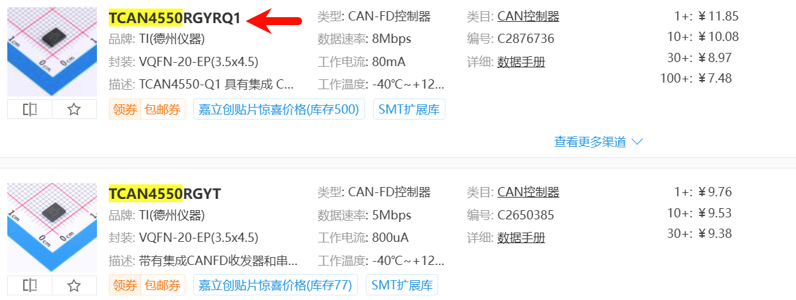

## 原理图

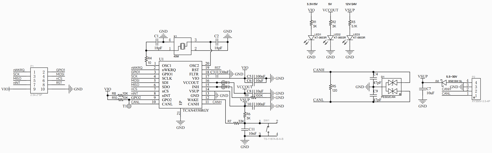

## 实物图

介绍如下:

- 左边 2.54-2x5P 的IDC座(牛角座), 刚好也能插杜邦线
- 右边 3.5mm-4P 的端子
- VSUP 外部 5.5~30V 供电
- 贴的是  [TCAN4550RGYRQ1](https://item.szlcsc.com/3085348.html?fromZone=s_s__%22tcan4550%22&spm=sc.gb.xh1.zy.n&lcsc_vid=E1VbAQZWR1JWAgUHFlEIVlwCQwNYBQZWEgUMAQVQRVQxVlNSRVBWVVFfTlVfVjsOAxUeFF5JWBYZEEoVDQ0NFAdIFA4DSA%3D%3D), 外部 40MHz 无源晶振
- 3个指示灯分别是 VIO, VCCOUT, VSUP 的指示灯
- 板载 120Ω 终端电阻

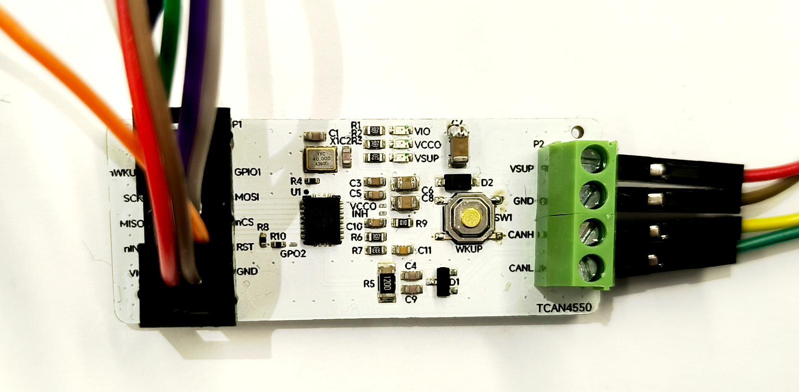

## 测试接线

遇事不决, 32教学, 拿 STM32G431CBT6 作为测试板子, 引脚连接关系:

- PA4, SPI1_nCS
- PA5, SPI1_SCK
- PA6, SPI1_MISO
- PA7, SPI1_MOSI
- PC4, TCAN_RST (高电平复位)
- PB0, TCAN_nINT (下降沿中断, EXTI0)

再加上 VIO(接3.3V), GND 两个引脚, TCAN4550板子左边共使用了 8 个引脚.

右边 VSUP 和 GND 接供电电源 (5.5V~30V), CANH 和 CANL 接设备或CANFD分析仪.

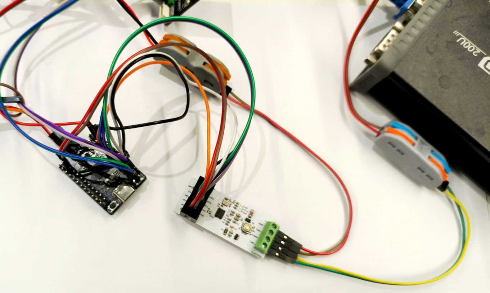

## 默认上电测试

如果不接 MCU, 或者不给 MCU 上电, 只给板子 VSUP 供电:

- 可以观察到 VSUP 和 VCCOUT 指示灯是亮的
- VCCOUT 测量电压是 5V
- 如果 VSUP 下降到 5.4V 及以下, VCCOUT 熄灭, 板子不能正常工作
- **4min 后, VCCOUT 指示灯自动熄灭, 板子进入 Sleep 模式**

最后一条在手册中也进行了说明, 要特别注意:

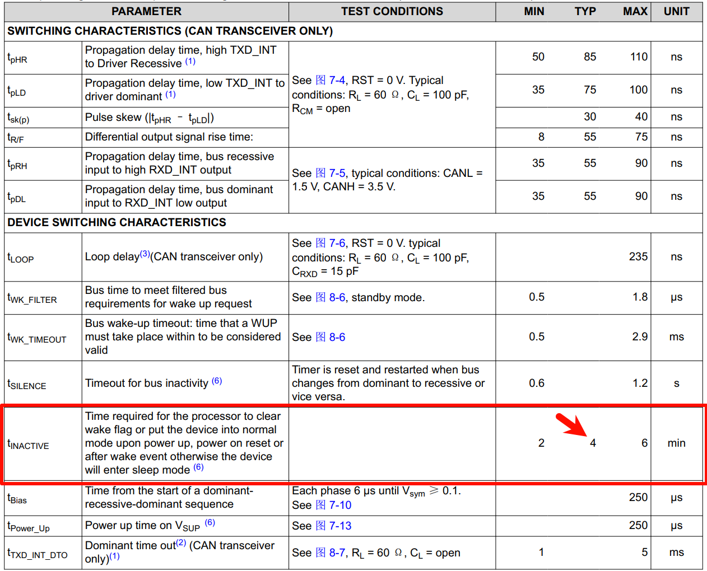

上电复位后先进的是 Standy Mode, 4min无操作后进入 Sleep Mode, VCCOUT不再输出5V, SPI也不再能工作, 除非 CAN  或着 WAKE Pin 唤醒:

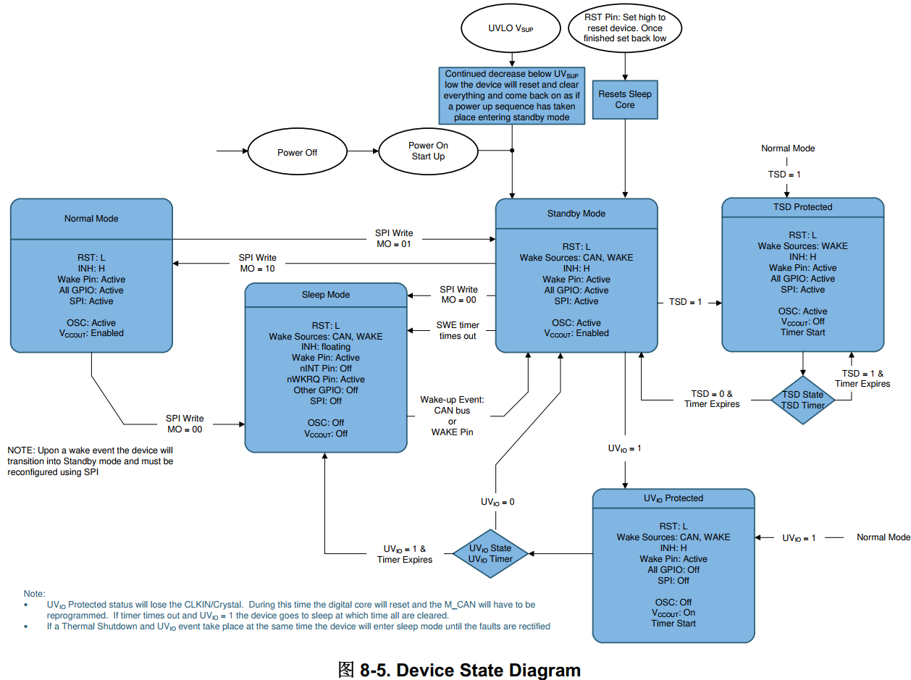

各个引脚不同模式的表现:

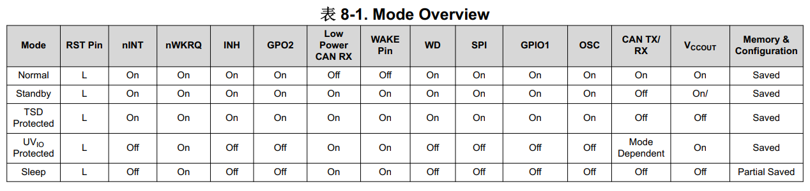

测试从简, 可以先关闭 0x0800 寄存器的 SWE_DIS 位

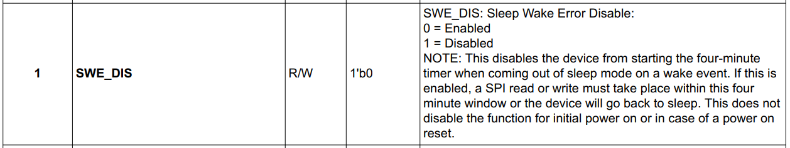

驱动程序库也是有这个说明

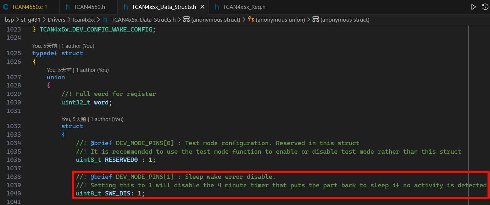

使用举例:

```c
TCAN4x5x_DEV_CONFIG devCfg;
TCAN4x5x_Device_ReadConfig(&devCfg);
devCfg.SWE_DIS = 1;
if (!TCAN4x5x_Device_Configure(&devCfg)) {
  printf("Failed to configure device\n");
}
```

后面也关闭了看门狗, 都是为了测试方便.

## STM32CubeMX配置

SPI 模式0, 全双工, 软件片选, 数据8Bits, 不超过 18Mbits/s, 这里是 160MHz 系统时钟, 32分频后是 5Mbits/s, 实际使用建议 10Mbits/s 以上, 防止高负载率丢包.

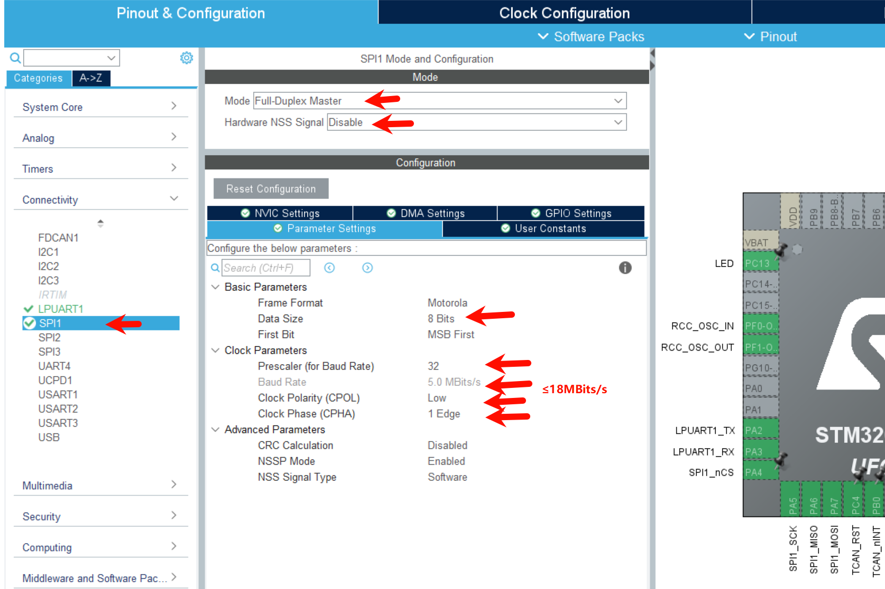

片选默认高电平

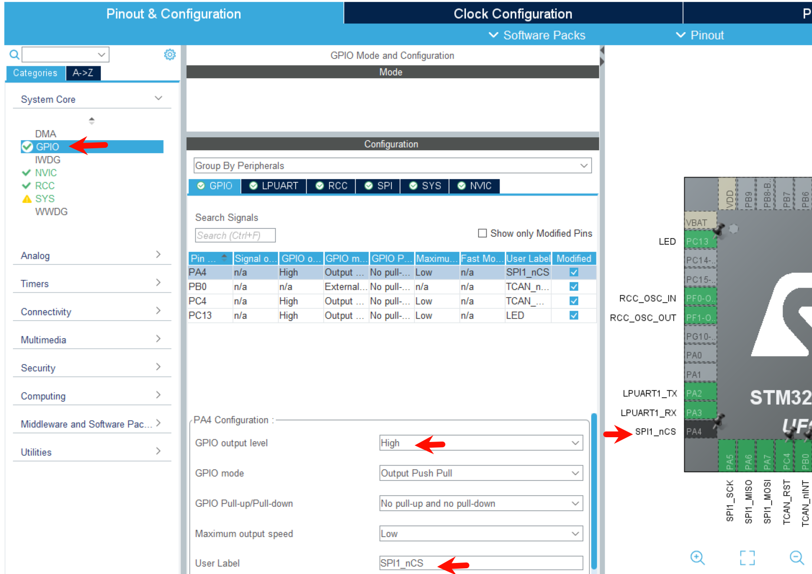

复位默认高电平(复位)

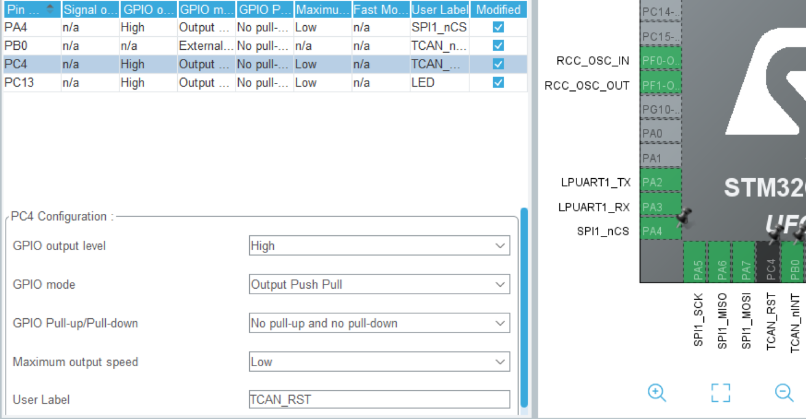

下降沿中断(板子上有10K的上拉电阻了)

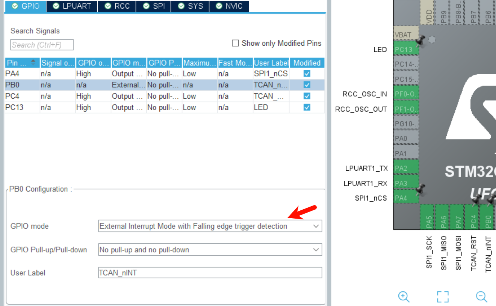

使能 EXTI0 中断

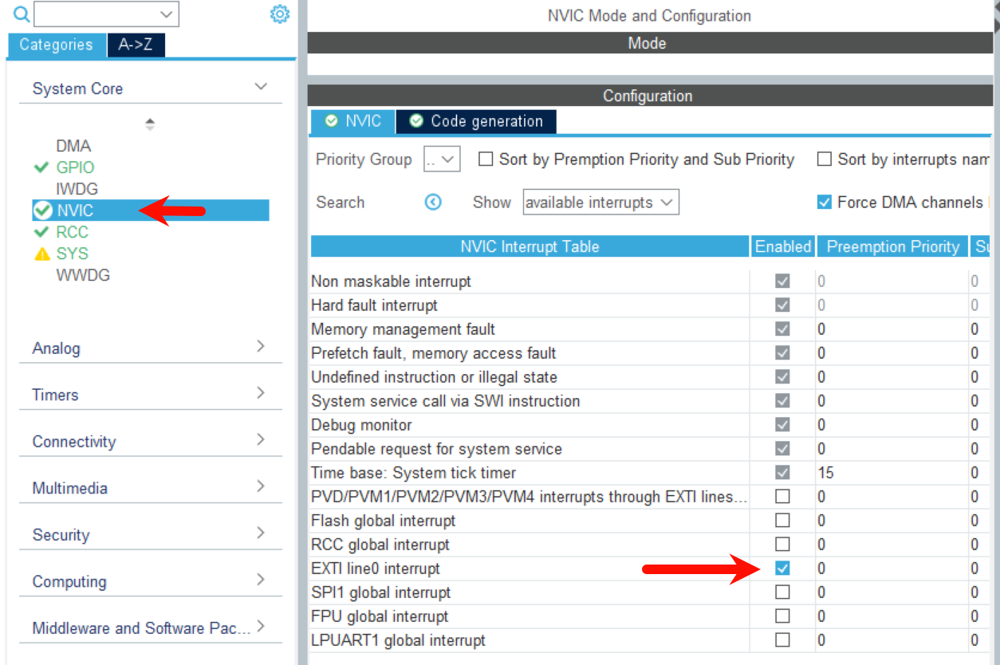

时钟外部12M无源晶振, 系统时钟 160MHz

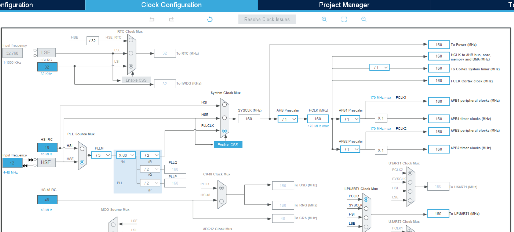

其它 LED, UART, Debug, 工程生成 略.

## SLLC469驱动库的适配

[SLLC469 驱动程序或库 | 德州仪器 TI.com.cn](https://www.ti.com.cn/tool/cn/download/SLLC469), 里面的例子是 MSP430 的, 主要是给 STM32 适配下 TCAN4x5x_SPI 的8个函数:

```c
void AHB_WRITE_32(uint16_t address, uint32_t data);
void AHB_WRITE_BURST_START(uint16_t address, uint8_t words);
void AHB_WRITE_BURST_WRITE(uint32_t data);
void AHB_WRITE_BURST_END(void);

uint32_t AHB_READ_32(uint16_t address);
void AHB_READ_BURST_START(uint16_t address, uint8_t words);
uint32_t AHB_READ_BURST_READ(void);
void AHB_READ_BURST_END(void);
```

以 `AHB_WRITE_32` 和 `AHB_READ_BURST_*` 为例, 把原来的换成 ST 的片选和SPI收发函数即可:

```c
void AHB_WRITE_32(uint16_t address, uint32_t data) {
  uint8_t buffer[8];
  buffer[0] = AHB_WRITE_OPCODE;  // 0x61
  buffer[1] = (address >> 8) & 0xFF;
  buffer[2] = address & 0xFF;
  buffer[3] = 0x01;
  buffer[4] = (data >> 24) & 0xFF;
  buffer[5] = (data >> 16) & 0xFF;
  buffer[6] = (data >> 8) & 0xFF;
  buffer[7] = data & 0xFF;
  HAL_GPIO_WritePin(SPI1_nCS_GPIO_Port, SPI1_nCS_Pin, GPIO_PIN_RESET);
  HAL_StatusTypeDef status = HAL_SPI_Transmit(&hspi1, buffer, 8, 1000);
  HAL_GPIO_WritePin(SPI1_nCS_GPIO_Port, SPI1_nCS_Pin, GPIO_PIN_SET);
  if (status != HAL_OK) {
    print("AHB_WRITE_32 Error: %d\n", (int)status);
  }
}

void AHB_READ_BURST_START(uint16_t address, uint8_t words) {
  uint8_t tx_buf[4] = {0};
  tx_buf[0] = AHB_READ_OPCODE;
  tx_buf[1] = (address >> 8) & 0xFF;
  tx_buf[2] = address & 0xFF;
  tx_buf[3] = words;
  HAL_GPIO_WritePin(SPI1_nCS_GPIO_Port, SPI1_nCS_Pin, GPIO_PIN_RESET);
  HAL_StatusTypeDef status = HAL_SPI_Transmit(&hspi1, tx_buf, 4, 1000);
  if (status != HAL_OK) {
    print("AHB_READ_BURST_START Error: %d\n", (int)status);
  }
}

uint32_t AHB_READ_BURST_READ(void) {
  uint32_t ret;
  uint8_t rx_buf[4] = {0};
  HAL_StatusTypeDef status = HAL_SPI_Receive(&hspi1, rx_buf, 4, 1000);
  if (status != HAL_OK) {
    print("AHB_READ_BURST_READ Error: %d\n", (int)status);
  }
  ret = ((uint32_t)rx_buf[0] << 24) | ((uint32_t)rx_buf[1] << 16) |
               ((uint32_t)rx_buf[2] << 8) | rx_buf[3];
  return ret;
}

void AHB_READ_BURST_END(void) {
  HAL_GPIO_WritePin(SPI1_nCS_GPIO_Port, SPI1_nCS_Pin, GPIO_PIN_SET);
}

```

## SPI读ID测试

一般会用 ID 寄存器来测试 SPI 通信配置是否正常:

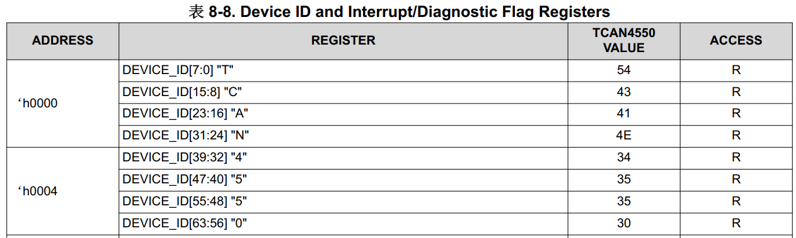

SPI 读的构成为 主机发送四字节 读操作码(0x41) + 16bit地址 + 要读的字的长度(bits/32)

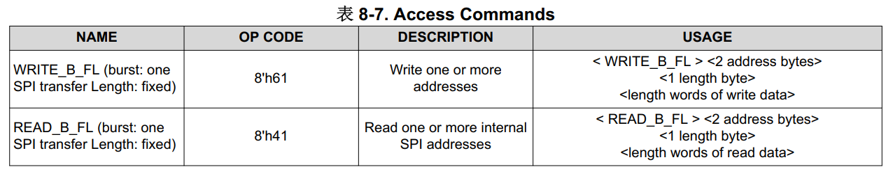

这里以寄存器 0 和 4 为例, 读出 TCAN4550, 下面是逻辑分析仪抓到的读的波形:

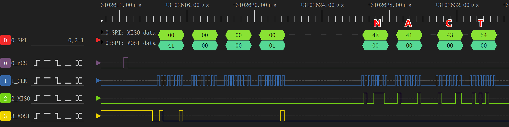

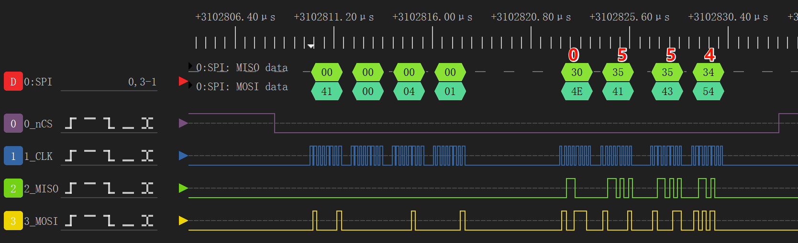

这里是每次读一个寄存器(32bit), 也可以 `41 00 00 02` 把两个寄存器一块读出来

## 发送接收CAN消息的步骤

为了使用TCAN4550-Q1传输消息，应完成以下操作：

1. 确保TCAN4550-Q1处于待机模式（寄存器0x0800[7:6]=0'b01）。这会强制 M_CAN 进入INIT 模式。
2. 设置M_CAN CCR 寄存器以允许配置。如果尚未设置，请设置CCE 和INIT 位。注意：在待机模式下，CSR 位读回1，但用户在执行读取-修改-写入时必须将0写入此位；否则，CAN 通信失败。
3. 如果需要CANFD和比特率切换（BRS）支持，则必须在配置期间通过CCR寄存器中的FDF和BRS位全局启用它。有关此寄存器的更多信息，请参阅设备数据表。
4. 应配置任何所需的设备功能，例如看门狗定时器等。
5. 必须设置CAN时序信息。
6. 应使用任意数据来配置和初始化MRAM部分。
7. 将TCAN4550-Q1设备置于“正常"模式（寄存器0x0800[7:6]=0"b10）以打开收发器并使能CAN核心进行传输。
8. 完成这些步骤后，微控制器就能够通过写入TX 缓冲区来传输消息，然后通过写入TXBAR 寄存器来请求发送消息。

## MCAN与MRAM的配置

TCAN4550 寄存器的分配:

- Register 16'h0000 through 16'h000C are Device ID and SPI Registers
- Register 16'h0800 through 16'h083C are device configuration registers and Interrupt Flags
- Register 16'h1000 through 16'h10FC are for M_CAN
- **Register 16'h8000 through 16'h87FF is for MRAM.**  

类似 STM32H7 或 TC397, TCAN4550 也是 MCAN, 2KB 的 Message RAM, 配置也就大同小异了:

- 以最长的64字节的CANFD帧为例, 加上ID标志位之类的需要占用72字节的MRAM, 2KB最大可以支持 `2048/72 =28.44` 个收发, 当然要至少保留 1个标准帧 加 1个扩展帧 滤波器(掩码方式写0全接收)的空间, 收发可分 27 个.
- 收如果放在 while 循环, 那就要 RX FIFO 多一些, 比如 while 能保证1ms周期, 都是64字节的CANFD帧, 5Mbit/s 1ms 最多8帧, 这里给 RX 11 个 FIFO 深度. 如果帧短, 报文数量更多, 1ms处理可能需要分更多深的FIFO, 或者把最长 64 缩一下让 RX 多一些, 或者直接在 nINT 中断里把数据读出来丢到自己的软件 FIFO, 避免丢失.
- 发也同理, MCAN一般最大 32 个 Buffer 或 FIFO, 这里给 17, 意味着MCU(160MHz填充速度快, 但CAN的5Mbit/s发送速度慢)不要一口气发超过 17 帧, 可以发送中断一次填下一帧, 或者是省心些, 1ms 只填充不超过 4帧 之类的.
- FIFO 和 Buffer 当然是韩信点兵, 多多益善, 如果知道所有的数据长度都不超过8字节, 2KB 可以划分多达 `2048/16=128`, 把 TX 的 32 拉满, 剩下的给 RX, 或者 TX 数据8字节, RX数据64字节, 都是可以的, 只要不重叠或越界. 如果不够, 就接收中断里直接拿走到自己的软件FIFO或者发送中断里从自己的发送FIFO里取数据, 约等于自己进行流控管理.
- 40MHz 时钟, 一般仲裁段不分频或者4分频到10MHz, 数据段就不分频了, 采样点方便计算都是 80%, 和其它 75% 87.5% 对接不会出大问题, 主要是超过 2Mbit/s 时看收发器参数调 TDC, 也可能不需要调节(根据Tseg等几个参数自动粗略计算).

配置代码示例如下:

- 开启了 低电压, 短路, 开路, Busoff 的中断
- 开启了 FDF 和 BRS, 对 CANFD 进行支持(不影响发送普通的CAN报文, 好比人有跑步的功能但不影响走路)
- 根据波特率和采样点自动计算Tq参数(只测试了1M@0.8, 5M@0.75)
- 一个标准帧滤波器(每个占用4个字节MRAM, 寄存器地址为 0x8000), 掩码方式, 全接收到RXFIFO0
- 一个扩展帧滤波器(每个占用8个字节MRAM, 寄存器地址为 0x8004), 掩码方式, 全接收到RXFIFO0
- 11个可以接收64字节CANFD数据的RX FIFO0(每个占用72个字节MRAM, 寄存器地址为 0x800C, 0x800C, 0x809C, ..., 0x82DC), 当然也能接收长度为 `[0, 1, 2, 3, 4, 5, 6, 7, 8, 12, 16, 20, 24, 32, 48, 64]` 的帧
- 16个可以发送64字节CANFD数据的TX Buffer(每个占用72个字节MRAM, 寄存器地址为 0x8324, 0x836C, ..., 0x875C), 当然也能发送长度为 `[0, 1, 2, 3, 4, 5, 6, 7, 8, 12, 16, 20, 24, 32, 48, 64]` 的普通CAN, CANFD, CANFD with BRS 的帧
- 还剩余 0x800 - 0x7A4 = 0x5C = 92 字节的RAM没有用

```c
void tcan4x5x_mcan_config(uint32_t baud, float sample_point,
                                 uint32_t data_baud, float data_sample_point) {
  // Disable all non-MCAN related interrupts for simplicity
  TCAN4x5x_Device_Interrupt_Enable ie = {0};
  ie.UVIOEN = 1;           // UVIO, Undervoltage on VIO
  ie.UVSUPEN = 1;          // UVSUP, Undervoltage on VSUP and VCCOUT
  ie.CANBUSBATEN = 1;      // CANBUSBAT, CAN Shorted to VBAT
  ie.CANBUSGNDEN = 1;      // CANBUSGND, CAN Shorted to GND
  ie.CANBUSOPENEN = 1;     // CANBUSOPEN, CAN Open fault
  ie.CANLGNDEN = 1;        // CANLGND, CANL GND
  ie.CANHBATEN = 1;        // CANHBAT, CANH to VBAT
  ie.CANHCANLEN = 1;       // CANHCANL, CANH and CANL shorted
  ie.CANBUSTERMOPENEN = 1; // CANBUSTERMOPEN, CAN Bus has termination point open
  ie.CANBUSNORMEN = 1;     // CANBUSNOM, CAN Bus is normal flag
  TCAN4x5x_Device_ConfigureInterruptEnable(&ie);
  // Clear PWRON because if it's not cleared within ~4 minutes, it goes to sleep
  TCAN4x5x_Device_Interrupts ir = {0};
  TCAN4x5x_Device_ReadInterrupts(&ir);
  if (ir.PWRON) {
    TCAN4x5x_Device_ClearInterrupts(&ir);
    TCAN4x5x_Debug("Cleared PWRON interrupt\n");
  }

  // 40MHz Clock
  TCAN4x5x_MCAN_CCCR_Config cccr_config = {0};
  cccr_config.FDOE = 1;  // FDF
  cccr_config.BRSE = 1;  // BRS
  TCAN4x5x_MCAN_Nominal_Timing_Simple timing = {
      .NominalBitRatePrescaler = 4,
      .NominalTqBeforeSamplePoint =
          (int)roundf((10000000.0f / baud) * sample_point),  // <math.h>
      .NominalTqAfterSamplePoint =
          (int)roundf((10000000.0f / baud) * (1 - sample_point))};
  TCAN4x5x_Debug("NominalTqBeforeSamplePoint: %d\n",
                 timing.NominalTqBeforeSamplePoint);
  TCAN4x5x_Debug("NominalTqAfterSamplePoint: %d\n",
                 timing.NominalTqAfterSamplePoint);
  TCAN4x5x_MCAN_Data_Timing_Simple data_timing = {
      .DataBitRatePrescaler = 1,
      .DataTqBeforeSamplePoint =
          (int)roundf((40000000 / data_baud) * data_sample_point),
      .DataTqAfterSamplePoint =
          (int)roundf((40000000 / data_baud) * (1 - data_sample_point))};
  TCAN4x5x_Debug("DataTqBeforeSamplePoint: %d\n",
                 data_timing.DataTqBeforeSamplePoint);
  TCAN4x5x_Debug("DataTqAfterSamplePoint: %d\n",
                 data_timing.DataTqAfterSamplePoint);
  TCAN4x5x_MCAN_Global_Filter_Configuration global_filter = {0};
  global_filter.RRFE = 1;
  global_filter.RRFS = 1;
  global_filter.ANFE = TCAN4x5x_GFC_ACCEPT_INTO_RXFIFO0;
  global_filter.ANFS = TCAN4x5x_GFC_ACCEPT_INTO_RXFIFO0;
  // 2KB MRAM, 2048 / 72 = 28.44
  TCAN4x5x_MRAM_Config mram_config = {
      .SIDNumElements = 1,
      .XIDNumElements = 1,
      .Rx0NumElements = 11,
      .Rx0ElementSize = MRAM_64_Byte_Data,
      .Rx1NumElements = 0,
      .Rx1ElementSize = MRAM_64_Byte_Data,
      .RxBufNumElements = 0,
      .RxBufElementSize = MRAM_64_Byte_Data,
      .TxEventFIFONumElements = 0,
      .TxBufferNumElements = 16,
      .TxBufferElementSize = MRAM_64_Byte_Data,
  };

  TCAN4x5x_MCAN_EnableProtectedRegisters();
  TCAN4x5x_MCAN_ConfigureCCCRRegister(&cccr_config);
  TCAN4x5x_MCAN_ConfigureGlobalFilter(&global_filter);
  TCAN4x5x_MCAN_ConfigureNominalTiming_Simple(&timing);
  TCAN4x5x_MCAN_ConfigureDataTiming_Simple(&data_timing);
  TCAN4x5x_MRAM_Clear();
  TCAN4x5x_MRAM_Configure(&mram_config);
  TCAN4x5x_MCAN_DisableProtectedRegisters();

  // interrupt
  TCAN4x5x_MCAN_Interrupt_Enable mcan_ie = {0};
  mcan_ie.RF0NE = 1; // Enable RX FIFO 0 New Message interrupt
  mcan_ie.EPE = 1;   // Enable Error Passive interrupt
  mcan_ie.EWE = 1;   // Enable Warning Status interrupt
  mcan_ie.BOE = 1;   // Enable Bus Off interrupt
  TCAN4x5x_MCAN_ConfigureInterruptEnable(&mcan_ie);

  // filter
  TCAN4x5x_MCAN_SID_Filter std_filter = {0};
  std_filter.SFT = TCAN4x5x_SID_SFT_CLASSIC;
  std_filter.SFEC = TCAN4x5x_SID_SFEC_PRIORITYSTORERX0;
  std_filter.SFID1 = 0;
  std_filter.SFID2 = 0;
  TCAN4x5x_MCAN_WriteSIDFilter(0, &std_filter);
  TCAN4x5x_MCAN_XID_Filter ext_filter = {0};
  ext_filter.EFT = TCAN4x5x_XID_EFT_CLASSIC;
  ext_filter.EFEC = TCAN4x5x_XID_EFEC_PRIORITYSTORERX0;
  ext_filter.EFID1 = 0;
  ext_filter.EFID2 = 0;
  TCAN4x5x_MCAN_WriteXIDFilter(0, &ext_filter);

  /* Configure the TCAN4550 Non-CAN-related functions */
  TCAN4x5x_DEV_CONFIG devConfig = {0};
  devConfig.SWE_DIS =
      0; // Keep Sleep Wake Error Enabled (it's a disable bit, not an enable)
  devConfig.DEVICE_RESET = 0; // Not requesting a software reset
  devConfig.WD_EN = 0;        // Watchdog disabled
  devConfig.nWKRQ_CONFIG = 0; // Mirror INH function (default)
  devConfig.INH_DIS = 0;      // INH enabled (default)
  devConfig.GPIO1_GPO_CONFIG =
      TCAN4x5x_DEV_CONFIG_GPO1_MCAN_INT1; // MCAN nINT 1 (default)
  devConfig.FAIL_SAFE_EN = 0;             // Failsafe disabled (default)
  devConfig.GPIO1_CONFIG =
      TCAN4x5x_DEV_CONFIG_GPIO1_CONFIG_GPO; // GPIO set as GPO (Default)
  devConfig.WD_ACTION =
      TCAN4x5x_DEV_CONFIG_WDT_ACTION_nINT; // Watchdog set an interrupt
                                           // (default)
  devConfig.WD_BIT_RESET = 0;              // Don't reset the watchdog
  devConfig.nWKRQ_VOLTAGE = 0; // Set nWKRQ to internal voltage rail (default)
  devConfig.GPO2_CONFIG =
      TCAN4x5x_DEV_CONFIG_GPO2_NO_ACTION; // GPO2 has no behavior (default)
  devConfig.CLK_REF = 1; // Input crystal is a 40 MHz crystal (default)
  devConfig.WAKE_CONFIG =
      TCAN4x5x_DEV_CONFIG_WAKE_BOTH_EDGES; // Wake pin can be triggered by
                                           // either edge (default)
  TCAN4x5x_Device_Configure(&devConfig);

  TCAN4x5x_Device_SetMode(TCAN4x5x_DEVICE_MODE_NORMAL);
  TCAN4x5x_MCAN_ClearInterruptsAll();
}
```

如机器人控制电机常用的 1M@0.8, 5M@0.75 配置的自动计算的结果:

```bash
# tcan4x5x_mcan_config(1000000, 0.8f, 5000000, 0.75f);
NominalTqBeforeSamplePoint: 8
NominalTqAfterSamplePoint: 2
DataTqBeforeSamplePoint: 6
DataTqAfterSamplePoint: 2
```

## CAN发送测试

发送上面配置成 Buffer 的形式, 这里 10ms 周期发送, 可自行封装成 SocketCAN 类似的结构体, 参考如下:

```c
void tcan4x5x_mcan_write_test_2(void) {
  static uint32_t last_send_time = 0;
  static uint64_t counter = 0;
  uint32_t current_time = HAL_GetTick();

  if (is_busoff_or_error) {
    return;
  }

  // Send message every 1ms
  if (current_time - last_send_time >= 1) {
    // Prepare TX header with ID 0x456
    TCAN4x5x_MCAN_TX_Header tx_header = {
        .ID = 0x456,
        .RTR = 0,
        .XTD = 0,
        .ESI = 0,
        .DLC = 8, // 8 bytes for uint64_t
        .BRS = 0,
        .FDF = 0,
        .reserved = 0,
        .EFC = 0,
        .MM = 0,
    };

    // Convert uint64_t counter to byte array (little-endian)
    uint8_t data[8];
    data[0] = (uint8_t)(counter);
    data[1] = (uint8_t)(counter >> 8);
    data[2] = (uint8_t)(counter >> 16);
    data[3] = (uint8_t)(counter >> 24);
    data[4] = (uint8_t)(counter >> 32);
    data[5] = (uint8_t)(counter >> 40);
    data[6] = (uint8_t)(counter >> 48);
    data[7] = (uint8_t)(counter >> 56);

    // Get next buffer index
    static uint8_t buffer_index = 0;
    buffer_index = (buffer_index + 1) % 16;

    // Write to TX buffer and transmit
    if (TCAN4x5x_MCAN_WriteTXBuffer(buffer_index, &tx_header, data)) {
      if (TCAN4x5x_MCAN_TransmitBufferContents(buffer_index)) {
        // TCAN4x5x_Debug("Sent ID 0x456, counter: %llu\n", counter);
        counter++;
        last_send_time = current_time;
      } else {
        TCAN4x5x_Debug("Failed to transmit buffer\n");
      }
    }
  }
}
```

注意:

- 扩展帧 XTD 置1
- 发 CANFD 的帧就把 FDF 和 BRS 置1
- DLC 那里是 [0,15] 对应 [0, 1, 2, 3, 4, 5, 6, 7, 8, 12, 16, 20, 24, 32, 48, 64] 的长度.

这样, 1ms 周期能收到如下报文:

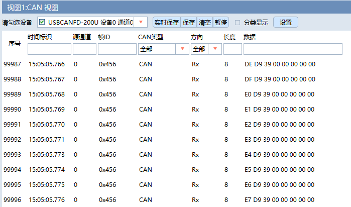

逻辑分析仪抓到的波形:

- 第一次写对应 `TCAN4x5x_MCAN_WriteTXBuffer(buffer_index, &tx_header, data)`

- 61, 写操作码

- 8324, 参考上面 MRAM, 是配置的 TX Buffer0 的地址

- 04, 4 words 的长度

- 0x11580000, 计算方式参考 

  - ```c
        SPIData = 0;
    
        SPIData         |= ((uint32_t)header->ESI & 0x01) << 31;
        SPIData         |= ((uint32_t)header->XTD & 0x01) << 30;
        SPIData         |= ((uint32_t)header->RTR & 0x01) << 29;
    
        if (header->XTD)
            SPIData     |= ((uint32_t)header->ID & 0x1FFFFFFF);
        else
            SPIData     |= ((uint32_t)header->ID & 0x07FF) << 18;
    
    // 0x456 << 18 = 0x11580000
    ```

- 标志位0x00080000, 参考

  - ```c
        SPIData = 0;
        SPIData         |= ((uint32_t)header->DLC & 0x0F) << 16;
        SPIData         |= ((uint32_t)header->BRS & 0x01) << 20;
        SPIData         |= ((uint32_t)header->FDF & 0x01) << 21;
        SPIData         |= ((uint32_t)header->EFC & 0x01) << 23;
        SPIData         |= ((uint32_t)header->MM & 0xFF) << 24;
    
    // DLC = 8, 查表[0, 1, 2, 3, 4, 5, 6, 7, 8, 12, 16, 20, 24, 32, 48, 64], 数据长度8字节
    ```

- 数据 `0F 00 00 00 00 00 00 00`

- 后面的一次写对应 `TCAN4x5x_MCAN_TransmitBufferContents(0)`, 10D0 是 `REG_MCAN_TXBAR` 寄存器, 32bit 对应最大32个buffer, 这里要把 TX Buffer0 里面的东西丢出去, 就 1 << 0

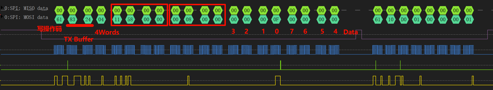

下一帧的波形, TX Buffer1, 数据 `10 00 00 00 00 00 00 00`, 把 TX Buffer1 里面的东西发出去 1 << 1

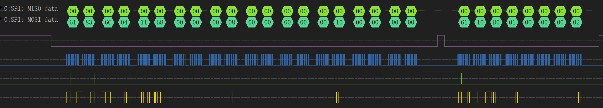

微改一下

```c
    TCAN4x5x_MCAN_TX_Header tx_header = {
        .ID = 0x12345678,
        .RTR = 0,
        .XTD = 1,
        .ESI = 0,
        .DLC = 15, // 64 bytes
        .BRS = 1,
        .FDF = 1,
        .reserved = 0,
        .EFC = 0,
        .MM = 0,
    };
    uint8_t data[64] = {0};
```

收到

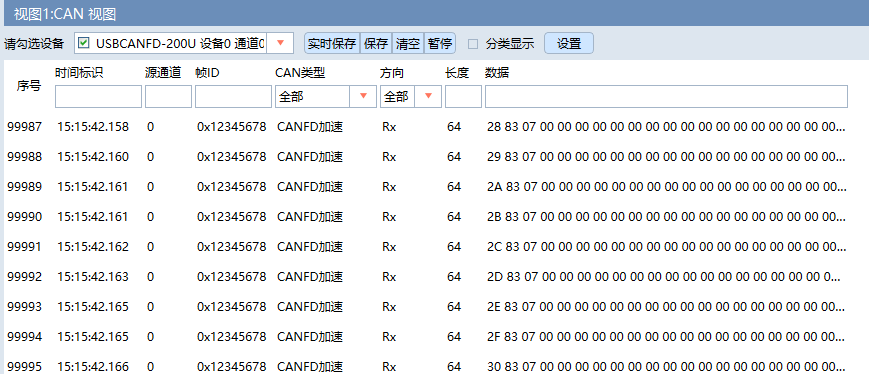

## CAN接收测试

nINT开了新消息中断, 主循环里处理好中断和接收打印:

```c
static int interrupt_count = 0;
void HAL_GPIO_EXTI_Callback(uint16_t GPIO_Pin) {
  if (GPIO_Pin == GPIO_PIN_0) {
    interrupt_count++;
    HAL_GPIO_TogglePin(LED_GPIO_Port, LED_Pin);
  }
}

void bsp_tcan4x5x_process(void) {
  // if busoff or error, wait 100ms and reinit
  if (busoff_or_error_count && HAL_GetTick() - busoff_or_error_count > 100) {
    TCAN4x5x_Debug("busoff_or_error_count: %d\n", busoff_or_error_count);
    busoff_or_error_count = 0;
    bsp_tcan4x5x_init();
  }
  if (interrupt_count) {
    TCAN4x5x_Debug("interrupt_count: %d\n", interrupt_count);
    interrupt_count--;
    TCAN4x5x_Device_Interrupts dev_ir = {0};
    TCAN4x5x_Device_ReadInterrupts(&dev_ir);
    TCAN4x5x_Debug("TCAN4x5x Device Interrupts: 0x%08X\n", dev_ir.word);
    int dev_interrupts_counter = 0;
    for (int i = 0; i < sizeof(dev_interrupts) / sizeof(dev_interrupts[0]);
         i++) {
      if (dev_ir.word & (1 << i)) {
        TCAN4x5x_Debug("  - %s\n", dev_interrupts[i]);
        dev_interrupts_counter++;
      }
    }
    if (dev_ir.UVSUP) {
      is_busoff_or_error = true;
      TCAN4x5x_Debug("UVSUP, is_busoff_or_error: %d\n", is_busoff_or_error);
      busoff_or_error_count = HAL_GetTick();
      return;
    }
    if (dev_ir.SPIERR) {
      TCAN4x5x_Debug("SPIERR\n");
      TCAN4x5x_Device_ClearSPIERR();
    }

    TCAN4x5x_MCAN_Interrupts mcan_ir = {0};
    TCAN4x5x_MCAN_ReadInterrupts(&mcan_ir);
    TCAN4x5x_Debug("TCAN4x5x MCAN Interrupts: 0x%08X\n", mcan_ir.word);
    for (int i = 0; i < sizeof(mcan_interrupts) / sizeof(mcan_interrupts[0]);
         i++) {
      if (mcan_ir.word & (1 << i)) {
        TCAN4x5x_Debug("  - %s\n", mcan_interrupts[i]);
      }
    }
    if (mcan_ir.RF0N) {
      // rx fifo0 new message
      TCAN4x5x_MCAN_ClearInterrupts(&mcan_ir);
      TCAN4x5x_MCAN_RX_Header rx_header = {0};
      uint8_t data[64] = {0};
      uint8_t bytes = TCAN4x5x_MCAN_ReadNextFIFO(RXFIFO0, &rx_header, data);
      TCAN4x5x_Debug("RF0N, RXFIFO0: %d bytes\n", bytes);
      TCAN4x5x_Debug("  ID: 0x%03X\n", rx_header.ID);
      TCAN4x5x_Debug("  XTD: %d\n", rx_header.XTD);
      TCAN4x5x_Debug("  RTR: %d\n", rx_header.RTR);
      TCAN4x5x_Debug("  FDF: %d\n", rx_header.FDF);
      TCAN4x5x_Debug("  BRS: %d\n", rx_header.BRS);
      TCAN4x5x_Debug("  ESI: %d\n", rx_header.ESI);
      TCAN4x5x_Debug("  DLC: %d\n", rx_header.DLC);
      TCAN4x5x_Debug("  Data: ");
      for (int i = 0; i < bytes; i++) {
        TCAN4x5x_Debug("%02X ", data[i]);
      }
      TCAN4x5x_Debug("\n");
    }
    if (mcan_ir.EP) {
      TCAN4x5x_MCAN_ClearInterrupts(&mcan_ir);
      TCAN4x5x_Debug("! Error Passive\n");
    }
    if (mcan_ir.EW) {
      TCAN4x5x_MCAN_ClearInterrupts(&mcan_ir);
      TCAN4x5x_Debug("!! Warning Status\n");
    }
    if (mcan_ir.BO) {
      TCAN4x5x_MCAN_ClearInterrupts(&mcan_ir);
      TCAN4x5x_Debug("!!! Bus Off\n");
      is_busoff_or_error = true;
      busoff_or_error_count = HAL_GetTick();
      return;
    }
  }

  tcan4x5x_mcan_write_test();
}
```


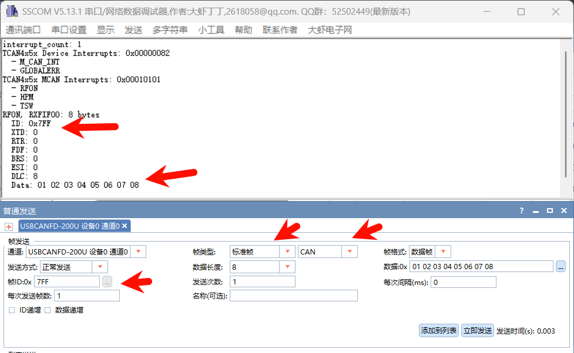

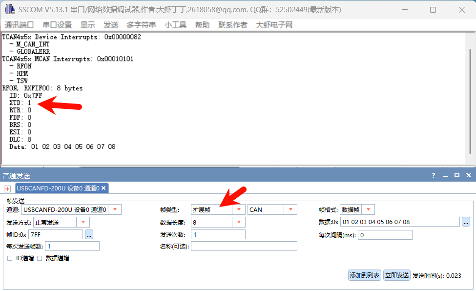

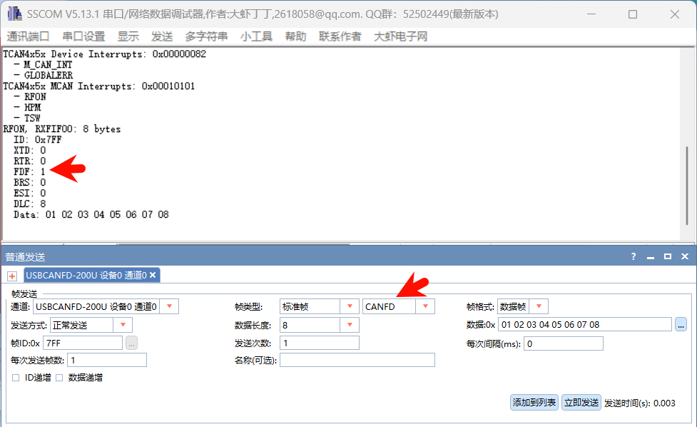

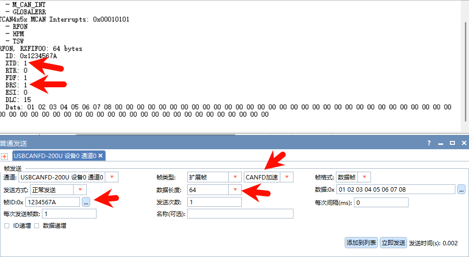

下面是一帧12字节CANFD扩展帧的读取:

```bash
RF0N, RXFIFO0: 12 bytes
  ID: 0x1234567A
  XTD: 1
  RTR: 0
  FDF: 1
  BRS: 1
  ESI: 0
  DLC: 9
  Data: 01 02 03 04 05 06 07 08 00 00 00 00 
```

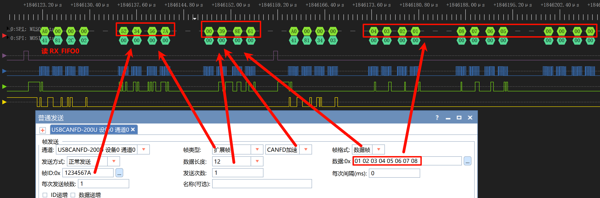

## VCCOUT直接5V测试

VSUP VCCOUT 引脚短路都接5V, 可以正常工作, 但是 4.9V 就不行了, 意味着用 USB 直接给 VSUP 和 VCCOUT 供电是有风险的.

类似的 VSUP, 5.4V 能工作, 5.3V 就不行了, 应该是到 VCCOUT 有 0.4V 的压降.

总之, 需保证 VCCOUT 是稳定在 5V 工作的.

## 断路短路与Busoff测试

短路没有影响的(无需重初始化):

- CANL 对 地 短路好像没啥影响
- CANH 对 VSUP 短路没有影响(注意CAN的TVS是24V的, 短路测试的时候 VSUP 最好不要超过 24V)
- 断开 CANH 或 CANL
- 短路 CANH 和 CANL 一瞬间, 触发 Warning 没触发 Busoff, 不短路后能继续工作, 如图

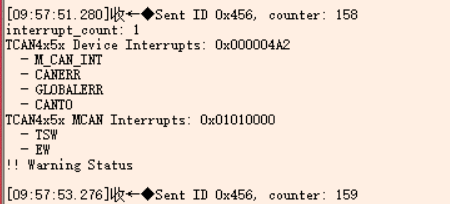

会触发 Busoff 的(程序里有10ms周期一直在往外发), 不能自动恢复, 需要100ms后重新初始化:

- CANL 对 VSUP 短路
- CANH 对 地 短路
- 先断路 CANH 或 CANL, 再短路 CANH 和 CANL
- 短路 CANH 和 CANL 时间过长会触发 Busoff, 如图

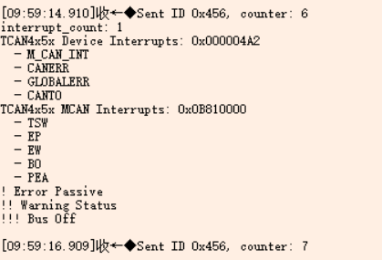

逐步降低VSUP电压到 5.4V 一下, 板子停止工作, 再升高也会触发 UVSUP 中断, 可以打开这个中断, 捕获到中断后, 100ms 重新配置以期恢复正常.

## 程序链接

[https://github.com/weifengdq/embedded/tree/main/tcan4550](https://github.com/weifengdq/embedded/tree/main/tcan4550)

环境:

- STM32CubeMX 6.14.0
- STM32Cube MCU Package for STM32G4 Series 1.6.1

## 交流群

QQ群: 1040239879


## 板子购买

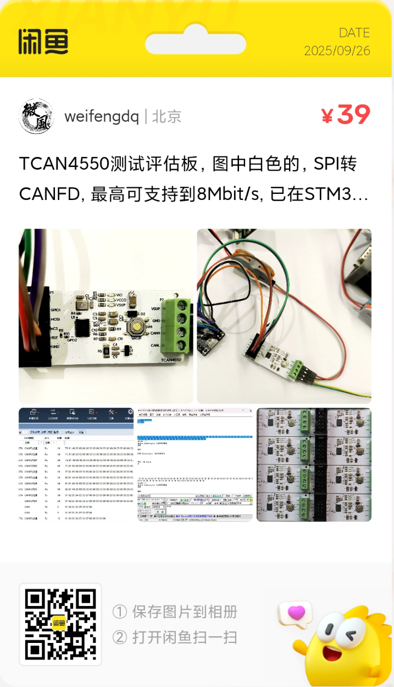


