## TJA1103A评估板简介

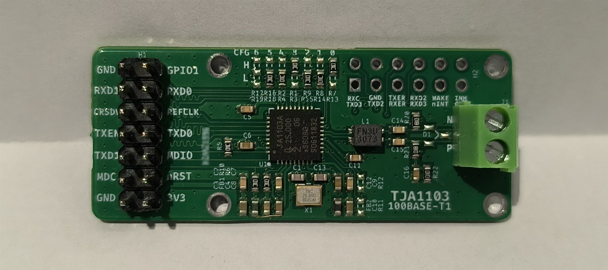

TJA1103A 评估板:

- 贴的是 TJA1103AHN, 官网与介绍  [TJA1103_符合ASIL B安全标准的100BASE-T1 PHY | NXP 半导体](https://www.nxp.com.cn/products/TJA1103):
  - **TJA1103A** RGMII/RMII/MII, **TJA1103B** SGMII
  - 符合ISO26262 ASIL B功能安全标准
  - 符合IEEE802.3bw的100BASE-T1 PHY
  - 符合OPEN Alliance TC-1的高级PHY功能
  - 符合IEEE1588v2/802.1AS的时间戳
  - 符合OPEN Alliance TC-10的睡眠/唤醒功能
  - HVQFN36(6x6mm)封装, PHY与TJA1120兼容?
- 左侧焊2x7 2.54mm排针引出 RMII + MDC/MDIO + NRST + 3V3电源 + GPIO1, 建议使用 10cm 以内杜邦线或直接板对板连接
- 右上预留剩余的 RGMII nINT WAKE INH 等引脚
- 右侧 100BASE-T1 通过 3.5mm 绿色端子引出
- 默认的 Strapping配置: rev-RMII, PHYAD=5, Slave

## 单3V3供电

参考了数据手册里 单 **3V3** 供电:

- VDDIO 和 VDDA_AO 用 3V3 电平. AO: Always On Supply 
- 内部 VREGA LDO 在 VREGA_OUT 输出 **2V5**, 25mA 最大电流
- 内部 VREGD LDO 输出 VDD_CORE **1V1**, 65mA 最大电流

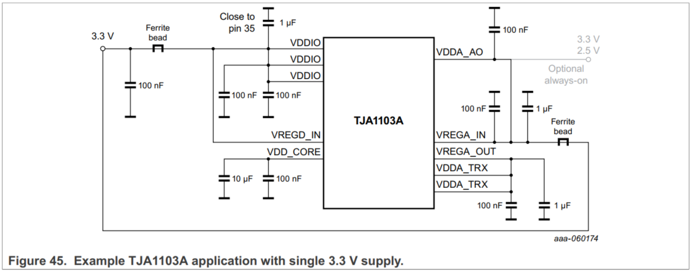

百兆PHY用内部LDO其实还好, 不算太热, 如果是千兆PHY, 几百mA电流还是不建议用内部LDO的, 至少DC-DC外挂电感或者独立供电比较好.

## Strapping 配置

3电平 O H L, 对应 悬空 上拉10K 下拉10K

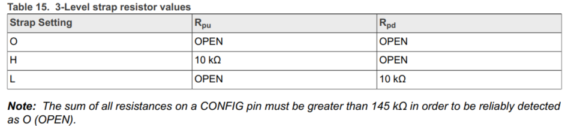

文章测试用的 rev-RMII  模式, RMII 直连, TJA1103A 板子上焊了 25MHz 无源晶振, 通过 REFCLK(Pin29 TXC) 输出50MHz 给 MCU 的REFCLKI.

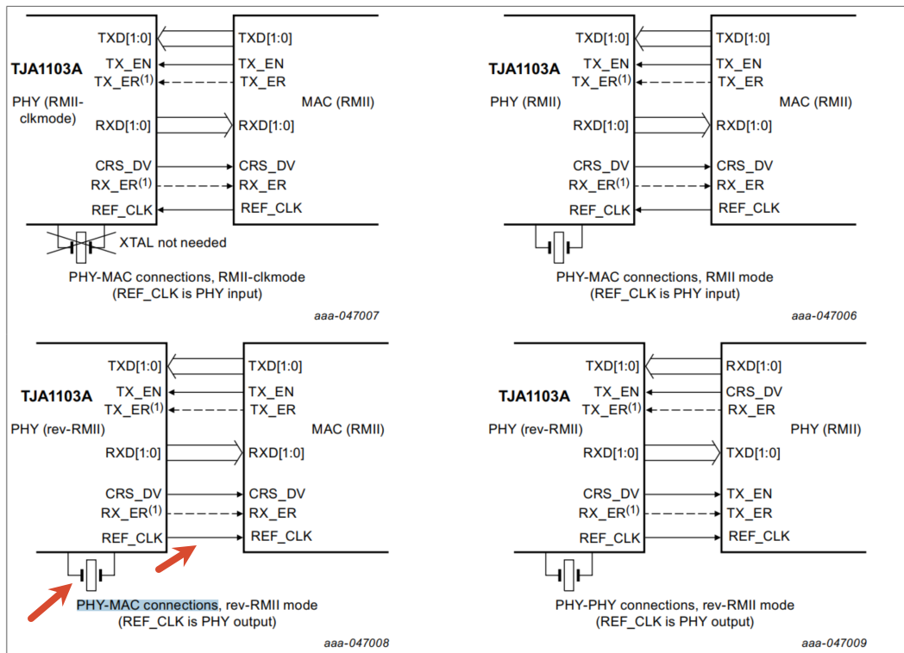

rev-RMII  模式需要 CFG3 上拉, CFG4 下拉, 如图所示:

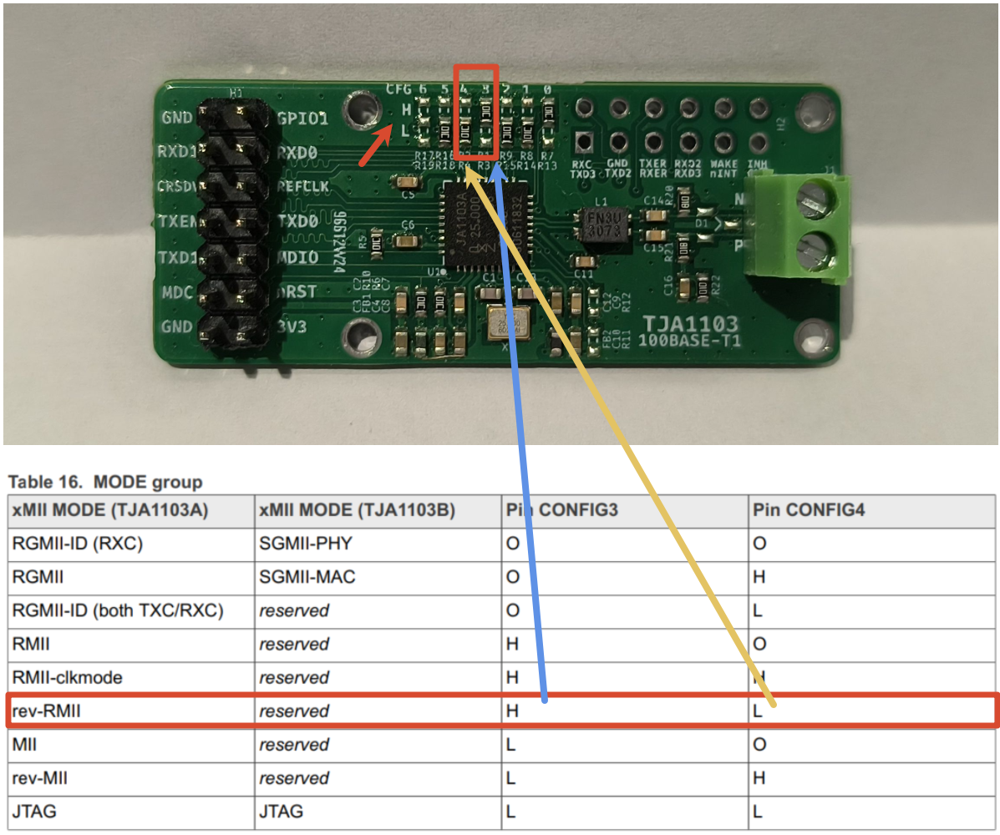

PHY的27种地址通过CFG[0:2]上下拉或悬空配置, 默认贴的是CFG[0:2]=HLL, 也就是5:

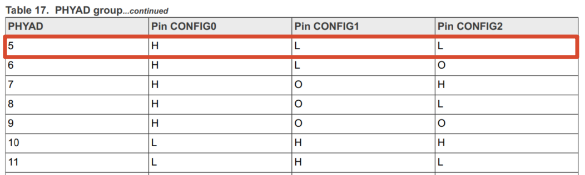

CFG[5:6] 下拉和悬空, 配置了 leader_select=follower(slave), auto=on, polarity=nocorrect (当然也可以试试使能极性检测与校正, 使能后,  FOLLOWER 模式下可以自动检测并翻转 MDI 极性)

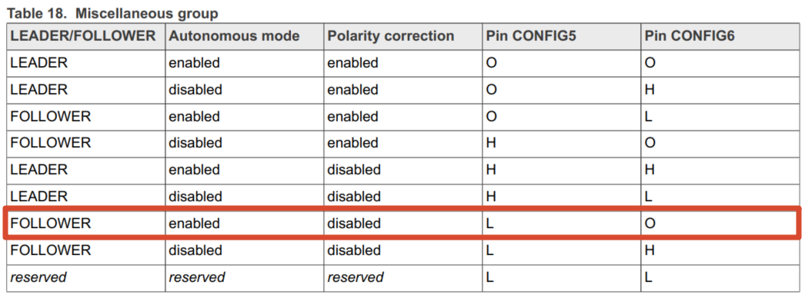

一开始看 LEADER FOLLOWER 我也是懵逼的, 其实就是 Master/Slave, 蛤:

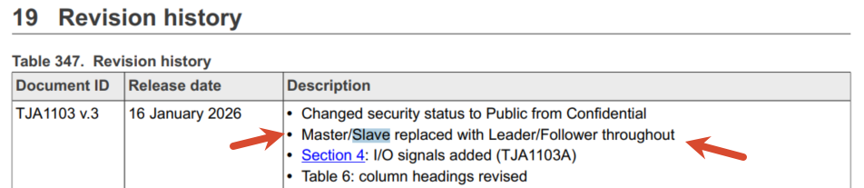

似乎 IEEE 也这么叫.

## STM32H7 测试接线

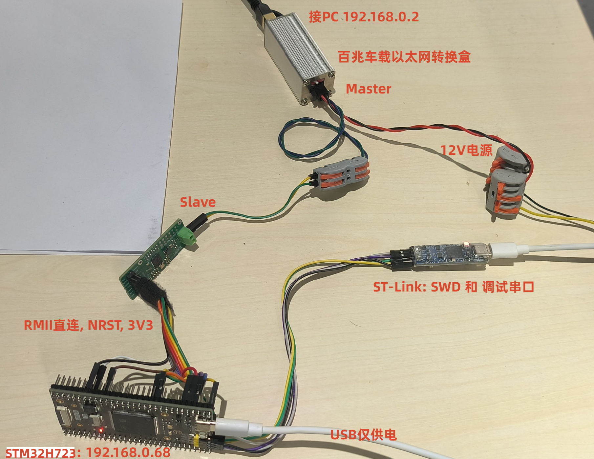

具体到引脚上:

| 功能         | STM32H723 引脚 | 连接对象        |
| ------------ | -------------- | --------------- |
| PHY 复位     | PC0            | TJA1103 nRST    |
| RMII REF_CLK | PA1            | TJA1103 REF_CLK |
| RMII MDIO    | PA2            | TJA1103 MDIO    |
| RMII CRS_DV  | PA7            | TJA1103 CRS_DV  |
| RMII TX_EN   | PB11           | TJA1103 TX_EN   |
| RMII TXD0    | PB12           | TJA1103 TXD0    |
| RMII TXD1    | PB13           | TJA1103 TXD1    |
| RMII MDC     | PC1            | TJA1103 MDC     |
| RMII RXD0    | PC4            | TJA1103 RXD0    |
| RMII RXD1    | PC5            | TJA1103 RXD1    |

另外:

- 调试串口 LPUART1: PA9(TX) PA10(RX), 921600bps
- SWD调试口: PA13 -> SWDIO，PA14 -> SWCLK

## CubeMX 配置

只是初始用 CubeMX 来配置成 CMake 的最小工程, 后续不要再在上面改动或生成代码.

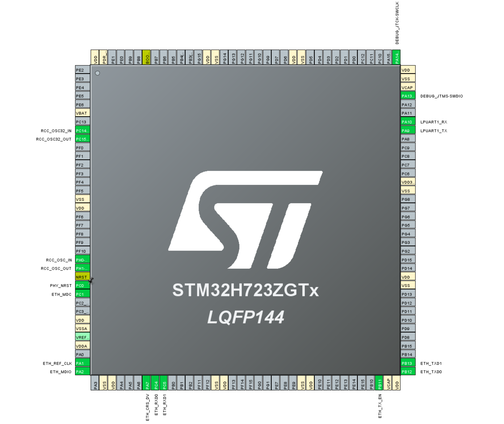

LwIP 除了配成裸机以及静态IP192.168.0.68外, PHY这里选了 USER_PHY

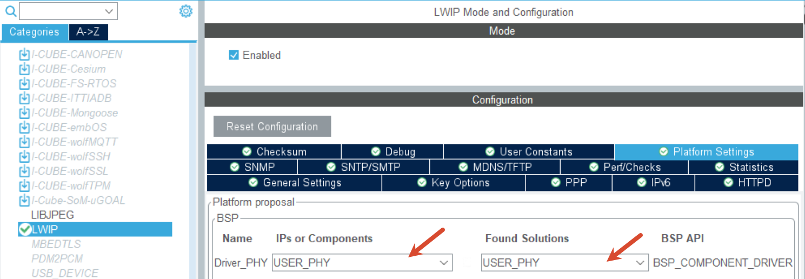

时钟部分, 外部 25M 无源晶振, 系统时钟 550M

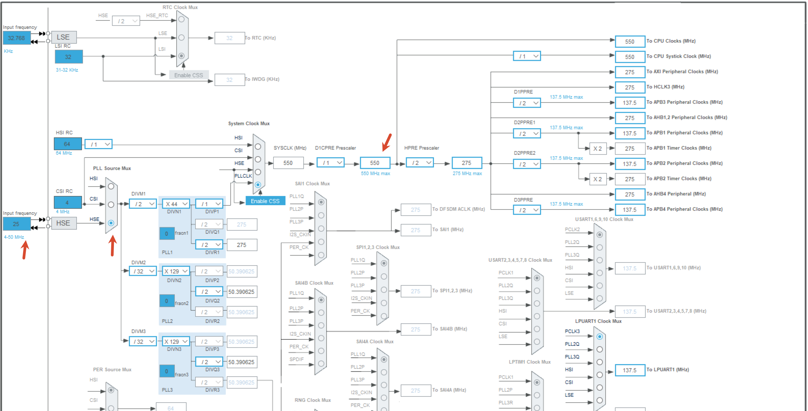

## 工程说明

STM32H723ZG + NXP TJA1103 的 100BASE-T1 裸机 LwIP 示例工程，使用 CMake + GCC 构建:

- 静态IP 192.168.0.68, udp echo 端口7, tcp iperf server 端口5001
- TJA1103 默认地址是5, 上电后串口会打印 `ETH link up: 100M/full PHYAD=5`, 网络断开会打印 `ETH link down`
- LPUART1 的 letter-shell 命令行
- TJA1103 Clause 45 寄存器读写命令
- TJA1103 诊断命令：SQI、MSE、链路训练时间、符号错误计数、链路丢失/失败、线缆测试、供电状态、温度状态、BIST 状态、环回控制
- TJA1103 低功耗/唤醒命令(需外围电路, 未测试, 仅参考)：Wake/Sleep 状态查看、功能模式切换、参数调节、SLEEP_REQUEST / SLEEP_ACCEPT / SLEEP_REJECT / WAKEUP_PHY_REQUEST / WU_SMI 触发

`build.ps1` 脚本中可以看到:

- 用了 STM32CubeIDE 装完后自带的交叉编译工具链 `C:\ST\STM32CubeIDE_2.1.0\STM32CubeIDE\plugins\com.st.stm32cube.ide.mcu.externaltools.gnu-tools-for-stm32.14.3.rel1.win32_1.0.100.202602081740\tools\bin`, 也可以通过 `-ToolchainBinDir` 指定
- 下载是 `STM32_Programmer_CLI.exe`, 也可以通过 `-CubeProgrammerCli` 指定
- 支持 Debug 或 Release 编译, 如 `.\build.ps1 build Debug`
- 命令行下载 `.\build.ps1 flash Debug`

串口是 921600bps-8-N-1, 上电或复位后，串口会显示 letter-shell 提示符：`letter:/$`, 输入 `help` 可查看导出的命令列表:

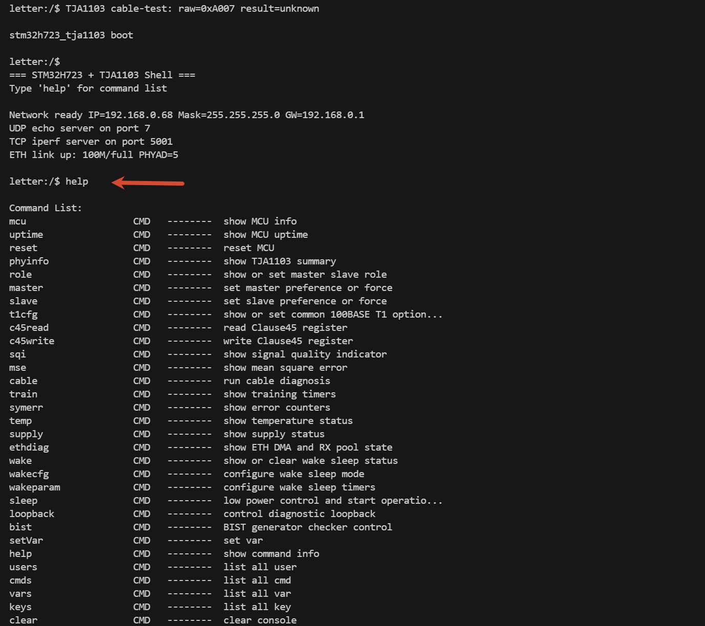

## MCU 基础信息 上电时间 软复位

```bash
# mcu 基本信息
letter:/$ mcu
=== MCU Info ===
Build:  Jul  3 2026 10:10:27
SYSCLK: 550 MHz
HCLK:   275 MHz
RST:    BOR PIN POR
UID:    0021000B-3133510D-34393337
Flash:  1024 KB
================

# 上电时间
letter:/$ uptime
Uptime: 544162 ms (0 days 0:09:04.162)

# mcu 软件复位
letter:/$ reset
MCU software reset in 500 ms...
```

## PHY信息与角色配置 寄存器访问

```bash
# TJA1103 概要信息: PHY 地址、PHY ID、链路状态、AN 状态、SQI、MSE、Wake 状态摘要等
letter:/$ phyinfo
PHYAD=5 PHYID=0x001B/0xB013
Link=UP AN=BUSY SQI=7 valid=1 MSE=0
WakeStatus=0x0000 PHY_STATE=0x0C0D cable=0x2007 losses=0x0000

# role 查询或配置当前 master/slave 角色
letter:/$ role
role=slave-pref adv_l=0x0000 adv_m=0x0000 base_t1=0x8000
leader_select=follower link_available=1 link_status=1 loc_rx=1 rem_rx=1
# role 帮助
letter:/$ role -h
usage: role [show|master-pref|master-force|slave-pref|slave-force]
# 设置 master-force, 网络断开, 恢复 slave-pref, 网络恢复
letter:/$ role master-force
role=master-pref adv_l=0x0000 adv_m=0x0000 base_t1=0xC000
leader_select=leader link_available=0 link_status=1 loc_rx=0 rem_rx=0
letter:/$ ETH link down
letter:/$ role slave-pref
role=slave-pref adv_l=0x0000 adv_m=0x0000 base_t1=0x8000
leader_select=follower link_available=0 link_status=0 loc_rx=0 rem_rx=0
letter:/$ ETH link up: 100M/full PHYAD=5

# t1cfg 查询或配置常见的 100BASE-T1 选项: auto自主/管理 极性检测纠正 等
letter:/$ t1cfg
role=slave-pref auto=on lowpower=off polarity=nocorrect
status: detected_polarity=normal link_available=1 link_status=1 loc_rx=1 rem_rx=1 send_data=1 scrambler=1
letter:/$ t1cfg -h
usage: t1cfg [show|restart|auto on|off|lowpower on|off|polarity auto|nocorrect|swap|swap-nocorrect]
# 手动调换 P/N 极性, 网络断开, 开启极性反转, 网络恢复
letter:/$ ETH link down
letter:/$ t1cfg polarity swap
role=slave-pref auto=on lowpower=off polarity=swap
status: detected_polarity=inverted link_available=0 link_status=0 loc_rx=0 rem_rx=0 send_data=0 scrambler=0
letter:/$ ETH link up: 100M/full PHYAD=5

# Clause 45 寄存器读写:
#   - c45read <devad> <reg>
#   - c45write <devad> <reg> <val>
letter:/$ c45read 30 0x8182
MMD30[0x8182] = 0x8032
# 如通过 Clause 45 的 MMD30 8002h 还有 8003h 访问 ID
letter:/$ c45read 30 0x8002
MMD30[0x8002] = 0x001B
letter:/$ c45read 30 0x8003
MMD30[0x8003] = 0xB013
```

ID 通过 Clause 45 的访问可以参考下图:

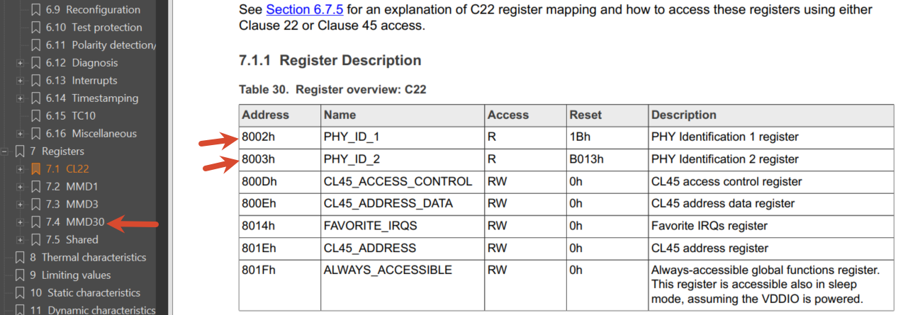

## 诊断命令

### SQI  信号质量

信号质量指示器 (SQI) 位于 SIGNAL_QUALITY 寄存器中（参见表 327）。SQI 字段用于确定链路质量，取值范围为 0（最差，无链路）到 7（最佳）。仅当 SIGNAL_QUALITY 寄存器中的 VALID 位置位时，SQI 值才有效。假设噪声为高斯噪声，则 SQI 值大于等于 3 表示误码率 (BER) 为 10 或更低。

因为只是用了20cm左右的线来连接, 虽然是非屏蔽且有一段没有双绞, 信号质量还很好:

```bash
# sqi: Signal Quality Indicator, 信号质量指示器
letter:/$ sqi
SQI raw=0x4077 valid=1 current=7 worst=7 warn_limit=0

# 断开线束连接
letter:/$ ETH link down
letter:/$ sqi
SQI raw=0x0000 valid=0 current=0 worst=0 warn_limit=0
# 线重新接上恢复连接
letter:/$ ETH link up: 100M/full PHYAD=5
letter:/$ sqi
SQI raw=0x4077 valid=1 current=7 worst=7 warn_limit=0
```

### MSE 均方误差

均方误差是在信道均衡消除码间干扰 (ISI)、回波和衰减效应后捕获的。MSE 指标反映了由不相关噪声和干扰引起的信号失真。MSE 的捕获是在 MSE 寄存器中设置 ENABLE 位后进行的（表 328）。从寄存器读取的 8 位 MSE 值, 要得到以 V 为单位的均方误差，必须将其除以 1024。结果值介于 0.0 V（最佳）和 0.25 V（最差）之间。

```bash
letter:/$ mse -h
usage: mse [on|off]
letter:/$ mse on
MSE raw=0x8000 enabled=1 value=0
# RMSE=√(MSE/1024)=0
```

### Cable 线缆开短路测试

8330h 是 CABLE_TEST 寄存器, 可以用来诊断线缆是否开路或短路

```bash
# bit[2:0] 的值:
#  - 000* No cabling fault detected
#  - 001 Shorted pair
#  - 010 Open pair
#  - 111 Unable to detect

# 正常状态
letter:/$ cable
Cable test raw=0xA007 fault=7
# 断开线束连接, 2 开路
letter:/$ ETH link down
letter:/$ cable   
Cable test raw=0xA002 fault=2
# 短路线束, 1
letter:/$ cable
Cable test raw=0xA001 fault=1
# 恢复正常连接
letter:/$ ETH link up: 100M/full PHYAD=5
letter:/$ cable
Cable test raw=0xA007 fault=7
```

### Train 训练时间

读出 TJA1103 对 **100BASE-T1 link-up 四个阶段**做的"耗时快照"

```bash
letter:/$ train
Link training: 17.000 ms (raw=0x0110)
Local receiver: 17.000 ms (raw=0x0110)
Remote receiver: 14.000 ms (raw=0x00E0)
Follower silent: 9.000 ms (raw=0x0090)
```

读的四个寄存器的解释:

| **寄存器**            | **地址** | **说明**                                                     |
| :-------------------- | :------- | :----------------------------------------------------------- |
| LINK_TRAINING_TIMER   | 8340h    | 从 PHY 进 **TRAINING** 态 → 训练完成 的耗时                  |
| LOC_RCVR_STATUS_TIMER | 8341h    | 从进 **FOLLOWER_SILENT** → 本端 `LOC_RCVR_STATUS=1`（本端收稳） |
| REM_RCVR_STATUS_TIMER | 8342h    | 从进 **FOLLOWER_SILENT** → 对端 `REM_RCVR_STATUS=1`（对端收稳，经训练序列反馈回来） |
| FOLLOWER_SILENT_TIMER | 8343h    | 从进 **FOLLOWER_SILENT** → 离开该态（切 SEND_IDLE）的静默窗口长 |

### Symerr 错误统计

```bash
letter:/$ symerr
SYM=0 link_status_drops=0 link_available_drops=0 link_losses=0 link_failures=0

# 拔掉百兆以太网转换盒线束再重新插上
letter:/$ ETH link down
ETH link up: 100M/full PHYAD=5
letter:/$ symerr
SYM=1462 link_status_drops=1 link_available_drops=1 link_losses=1 link_failures=2
```

是 8350h 8352h 8353h 几个寄存器里的值:

| **Symbol**             | **寄存器** | **位域**     | **对应 100BASE-T1 什么事件**                                 |
| :--------------------- | :--------- | :----------- | :----------------------------------------------------------- |
| `SYMBOL_ERROR_COUNTER` | 0x8350     | [15:0] 16bit | **PCS 层码元解码错**——扰码器/4B3B 解码出的非法符号数，本质是"PHY 收到但解不出来的码元" |
| `LINK_STATUS_DROPS`    | 0x8352     | [13:8] 6bit  | 从 **SEND_DATA**（链路正常态）掉回非 DATA 态的次数——比如对端突然掉电、线缆被拔、EMI 致连续错 |
| `LINK_AVAILABLE_DROPS` | 0x8352     | [5:0] 6bit   | 更早期的 **LINK_AVAIL** 状态掉——训练完刚进可用窗口又掉的那种，比 STATUS_DROPS 更靠前 |
| `LINK_LOSSES`          | 0x8353     | [15:10] 6bit | **LOS（Loss of Signal）** 事件次数——MDI 侧能量低于阈值，判"对端没了" |
| `LINK_FAILURES`        | 0x8353     | [9:0] 10bit  | **链路失败**次数——训练失败、或长期失锁后重新训的次数，最"重"的那档 |

### Temp 温度警告

```bash
# 0xA1 => 161 => x = 161 / 100 = 1.61
# TemperatureWarningLimit=7.22*1.61^2+38.8*1.61+65.3=146.482962℃
# valid range is from 41h to BFh (93 °C to 165 °C)
letter:/$ temp
TEMP_STATUS=0x00A1 event=0 now=0 latent=0 limit=0xA1

```

31Fh TEMP_STATUS 寄存器, 高温事件 0, 当前温度未高于 limit, 无潜在故障

### Supply 电压状态

```bash
$ supply
AO_SYSTEM_SUPPLY_STATUS=0x4000
CORE_SUPPLY_STATUS=0x0000 uv_now=0 ov_now=0
VDDIO_SUPPLY_STATUS=0x0003 level=3
VREGD_SUPPLY_STATUS=0x0000
VREGA_SUPPLY_STATUS=0x0000
```

过压欠压的事件或状态

- AO: Always-On, TC10 wake / RST_N / INH 等
- CORE: 1.1V, VDD
- VDDIO_LEVEL:  1=>1.8V 2=>2.5V 3=>3.3V
- VREGD_IN, 内部数字 LDO 输入
- VREGA_IN, VREGA_OUT, 模拟域(MDI、PLL、XTAL 缓冲)

### BIST

```bash
letter:/$ bist
usage: bist status|cfg ...|genstart prod|cont|genstop|chkstart prod|cont|chkstop|rxstart|rxstop|clr

letter:/$ bist status
route: check=xmii tx=normal rx=normal raw=0x0000
gen: ctrl=0x0000 status=0x0000 check=0x0000 prod=0x0000
preamble=7 ipg_type=0 ipg_len=12 etype=0x0000
payload_cfg=0x20A5 data_type=2 size_type=0 fixed_byte=0xA5 payload_size=0x002E
prbs_cfg=0x0000 prbs=0 seedmode=perframe seed=0x7FFF good=100 bad=0 wait_us=255 gen_count=0
rx_good=0 rx_bad=0 rxer=0
DA=00:00:00:00:00:00
SA=00:00:00:00:00:00
```

BIST（Built-In Self-Test）frame generator + checker，简单说就是 PHY 自己既能发以太网帧、又能收帧校验，不需要外接 MAC 甚至不需要主机参与，专门用来测"PHY → 线束 → 对端 PHY"这条链路是不是健康.

默认 gen 不使能, 有需要的可自行对照测试:

> - `bist status`
>   - 查看 BIST 路由、发生器、检查器、载荷、DA/SA、计数器等完整当前配置
> - `bist cfg show`
>   - 显示当前 BIST 配置
> - `bist cfg check xmii|ephy`
>   - 选择 checker 观察 xMII 侧还是 EPHY 侧数据
> - `bist cfg tx normal|ephy`
>   - 配置 generator 是否拦截 EPHY TX 路径
> - `bist cfg rx normal|xmii`
>   - 配置 checker 是否拦截 XMII RX 路径
> - `bist cfg da <mac>`
>   - 配置 generator 的目的 MAC，例如 `02:00:00:00:00:01`
> - `bist cfg sa <mac>`
>   - 配置 generator 的源 MAC
> - `bist cfg etype <hex>`
>   - 配置 Ethernet Type，例如 `0x0800`
> - `bist cfg payload fixed <byte>`
>   - 配置固定载荷字节
> - `bist cfg payload ramp <byte>`
>   - 配置递增载荷起始字节
> - `bist cfg payload prbs`
>   - 选择 PRBS 载荷
> - `bist cfg sizemode fixed|inc|random`
>   - 配置载荷长度模式
> - `bist cfg psize <value>`
>   - 配置 `PAYLOAD_SIZE`
> - `bist cfg prbs 7|9|11|15`
>   - 配置 PRBS 类型
> - `bist cfg seed <hex>`
>   - 配置 `BIST_LFSR_SEED`
> - `bist cfg seedmode perframe|running`
>   - 配置 LFSR 种子是每帧重装还是连续滚动
> - `bist cfg good <count>`
>   - 配置生产模式下 good frame 数量
> - `bist cfg bad <count>`
>   - 配置生产模式下 bad frame 数量
> - `bist cfg wait <usec>`
>   - 配置 checker 生产模式超时值
> - `bist cfg ipg fixed|inc|random <len>`
>   - 配置 IPG 模式和长度
> - `bist cfg preamble <len>`
>   - 配置前导码字节数
> - `bist genstart prod|cont`
>   - 启动 generator，生产模式或连续模式
> - `bist genstop`
>   - 通过 `STOP` 停止 generator
> - `bist chkstart prod|cont`
>   - 启动 checker，生产模式或连续模式
> - `bist chkstop`
>   - 停止 checker
> - `bist rxstart`
>   - 启动当前工程内置的连续接收统计预设：`check=ephy tx=ephy rx=xmii`
> - `bist rxstop`
>   - 停止内置接收统计预设
> - `bist clr`
>   - 保持当前 checker 配置，仅置位 `STATISTIC_CNT_RST` 清零统计

## Loopback

支持以下命令, 未测试:

> - `loopback off`
>   - 关闭所有已支持的环回位
> - `loopback pma-local`
>   - 开启 PMA local loopback
> - `loopback pma-remote`
>   - 开启 PMA remote loopback
> - `loopback phy`
>   - 开启 xMII PHY loopback
> - `loopback mac`
>   - 开启 xMII MAC loopback

说明：

- 环回属于 test mode，需要先打开受保护的 TEST_ENABLE 链路
- 工程内部已自动处理常见保护位
- 环回会影响正常业务链路，测试结束后应执行 `loopback off`

## 休眠唤醒

需要外围电路修改, 如:

- `VDDA_AO` 必须由独立的 standby 电源持续供电
- `INH` 接到外部主电源稳压器的 `EN`/`SHDN` 管脚
- `WAKE_IN_OUT` 接到 MCU 的 always-on GPIO，或者外部唤醒源

未测试, 仅留命令占位, 有需要的可自行对照测试:

> - `wake`
>   - 显示：
>     - `WAKE_SLEEP_STATUS`
>     - `WAKE_SLEEP_CONFIG`
>     - `WAKE_SLEEP_PARAMETERS`
>     - `ALWAYS_ACCESSIBLE`
> - `wake clear`
>   - 清除 `WAKE_SLEEP_STATUS` 中的可写 1 清零状态位，然后再次显示状态
> - `wakecfg off`
>   - 关闭 Wake/Sleep 功能
> - `wakecfg basic`
>   - 设为 Basic Wake/Sleep 模式
> - `wakecfg tc10`
>   - 设为 TC10 Wake/Sleep 模式
> - `wakecfg io on|off`
>   - 打开/关闭 `WU_IO_ENABLE`
> - `wakecfg smi on|off`
>   - 打开/关闭 `WU_SMI_ENABLE`
> - `wakecfg fwdphy on|off`
>   - 打开/关闭 `FWD_WU_PHY_TO_WU_IO`
> - `wakecfg fwdmdi on|off`
>   - 打开/关闭 `FWD_WUPWUR_TO_WU_IO`
> - `wakecfg noauto on|off`
>   - 打开/关闭 `NO_AUTO_ON_WAKE`
> - `wakecfg autoidle on|off`
>   - 打开/关闭 `AUTO_SLEEP_ON_IDLE`
> - `wakecfg autosilence on|off`
>   - 打开/关闭 `AUTO_SLEEP_ON_SILENCE`
> - `wakecfg autoreject on|off`
>   - 打开/关闭 `AUTO_REJECT`
> - `sleep startop`
>   - 写 `PHY_CONTROL.START_OPERATION`
>   - 当 `NO_AUTO_ON_WAKE=1` 时，唤醒后需要手工执行这个操作，PHY 才会从 active standby 继续恢复到正常工作态
> - `wakeparam ack <0-7>`
>   - 配置 `SLEEP_ACK_TIMER`
> - `wakeparam idle <0-7>`

## GPIO LED

12个 GPIOs 可以用于 LED PTP Misc 等, 注意如RMII下和RXD0 1等同一个PIN的GPIO就不要当GPIO用了(Table27).

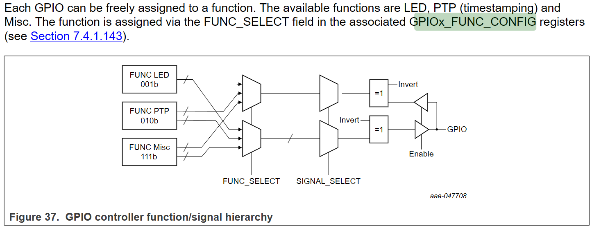

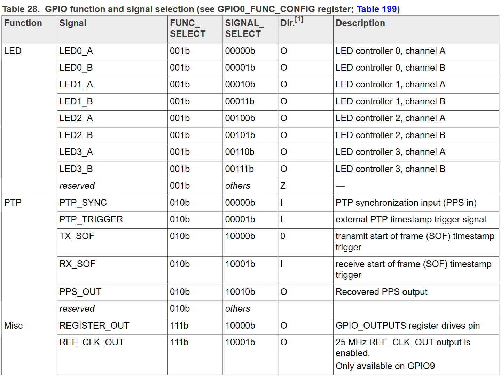

程序中并未体现, 在此仅略作相关寄存器的留存备忘, 如需要设置两个GPIO用做 Link 和 Act 指示:

- 8190h~8193h, 设置 `EPHY_LED_TRIGGER0..3` 的 `FUNCTION` :
  - `0`: `Link_availability`
  - `1`: `Link_status`
  - `2`: `Role`，Leader=1 / Follower=0
  - `3`: `PHY Active`，AFE 运行中
  - `4`: `Frame reception`，`RX_DV=1`
  - `5`: `Symbol errors`
  - `6`: `Frame/test transmission`，`TX_EN=1`
  - `7`: `Frame activity`，RX 或 TX 任一活动
- 1A0H~1AFh, 设置 `LEDx_CONFIG` / `LEDx_TRIG_SOURCE` / `LEDx_TRIG01_CONFIG` / `LEDx_TRIG23_CONFIG`:
  - ENABLE, INVERT, SPLIT_UP, BLINKING_PERIOD(250us~2048ms)
  - ...
- 2C40h~2C4Bh, GPIOx_FUNC_CONFIG:
  - 将某个可用 GPIO 的 `FUNC_SELECT` 设为 `LED`
  - 用 `SIGNAL_SELECT` 选择 `LED0_A/B` 到 `LED3_A/B`

如需 PTP PPS输入输出, 就去设置 PTP 相关的寄存器, 此处略.

## 16小时 ping

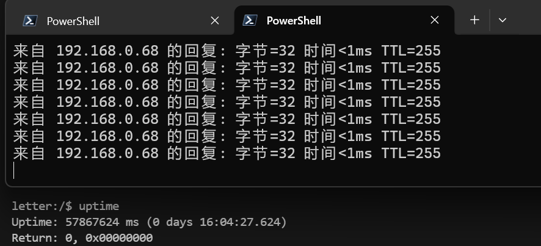

## 2000s iperf

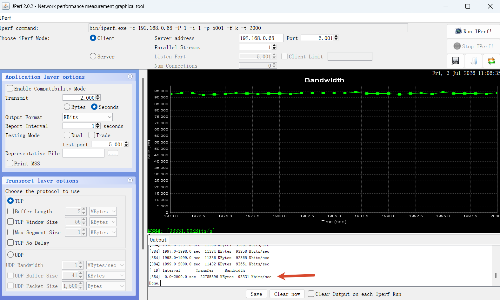

注意散热, 测试的时候有个小风扇吹着测的.


